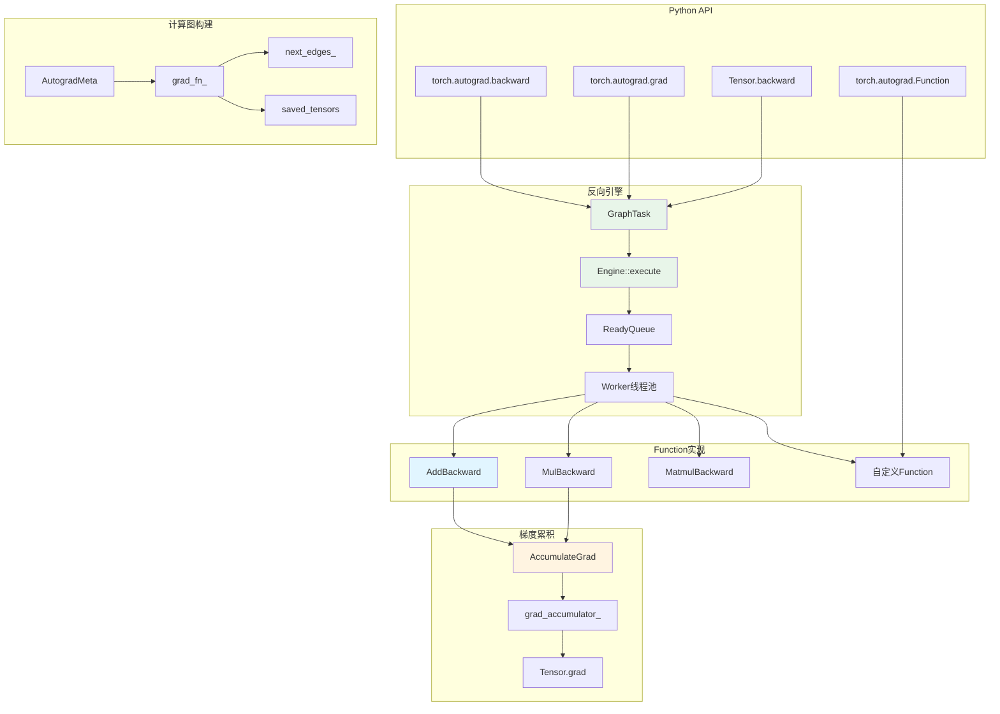
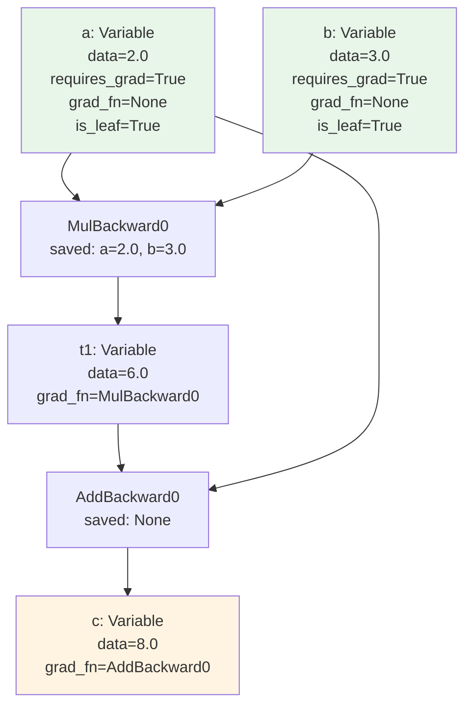
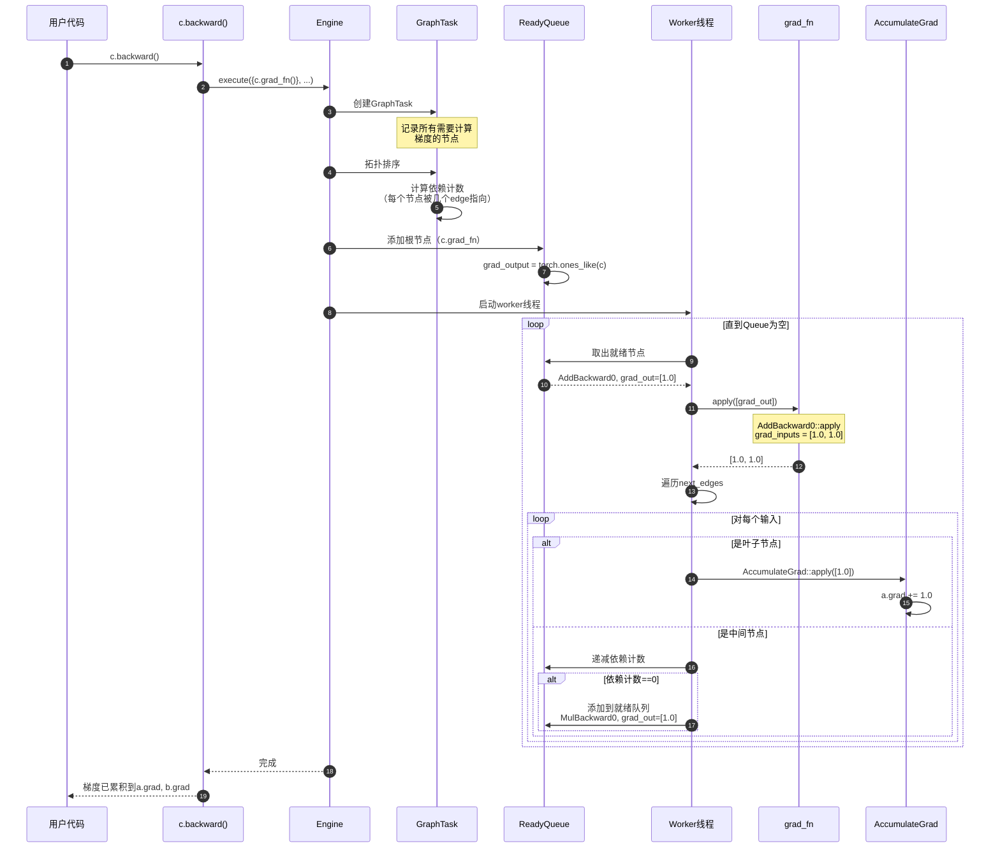

# PyTorch-03-Autograd自动微分

## 模块概览

torch.autograd是PyTorch的自动微分引擎，实现反向模式自动微分（reverse-mode automatic differentiation）。构建动态计算图，记录张量操作，然后通过链式法则自动计算梯度。

### 核心概念

- **动态计算图**：运行时构建，每次前向传播创建新图
- **Function节点**：表示可微分操作，保存前向上下文用于反向
- **梯度计算**：从输出反向遍历图，应用链式法则
- **梯度累积**：支持多次backward，梯度累加到`.grad`属性

### 架构图



## 核心数据结构

### AutogradMeta

```cpp
struct AutogradMeta : public AutogradMetaInterface {
  // 梯度张量
  Variable grad_;
  
  // 梯度函数（此tensor是哪个operation的输出）
  std::shared_ptr<Node> grad_fn_;
  
  // 梯度累积器（仅叶子节点）
  std::weak_ptr<Node> grad_accumulator_;
  
  // Hook列表
  std::vector<std::shared_ptr<FunctionPreHook>> hooks_;
  std::vector<std::shared_ptr<FunctionPostHook>> post_hooks_;
  
  // requires_grad标志
  bool requires_grad_ = false;
  
  // 是否为叶子节点
  bool is_view_ = false;
  
  // 前向梯度（用于forward-mode AD）
  std::shared_ptr<ForwardGrad> fw_grad_;
};
```

### Node (grad_fn)

```cpp
struct Node : std::enable_shared_from_this<Node> {
  // 下一个节点（输入的grad_fn）
  edge_list next_edges_;
  
  // 反向传播函数
  virtual variable_list apply(variable_list&& inputs) = 0;
  
  // 保存的张量（用于反向计算）
  std::vector<SavedVariable> saved_variables_;
  
  // Hook列表
  std::vector<std::unique_ptr<FunctionPreHook>> pre_hooks_;
  std::vector<std::unique_ptr<FunctionPostHook>> post_hooks_;
  
  // 节点信息
  std::string name() const;
  uint64_t sequence_nr() const;
};
```

**重要子类**：
- `AccumulateGrad`: 叶子节点的梯度累积器
- `AddBackward0`, `MulBackward0`: 算子的反向函数
- `PythonFunction`: 自定义autograd.Function

### Edge

```cpp
struct Edge {
  // 指向的Node
  std::shared_ptr<Node> function;
  
  // 输入索引（该edge连接到function的第几个输入）
  uint32_t input_nr;
};
```

### SavedVariable

```cpp
struct SavedVariable {
  // 保存的张量数据
  Variable data_;
  
  // 保存时的版本号
  uint32_t version_counter_;
  
  // 是否为weak引用（不增加引用计数）
  bool was_default_constructed_ = true;
};
```

## 前向传播计算图构建

### 示例：c = a * b + a

```python
import torch

a = torch.tensor([2.0], requires_grad=True)
b = torch.tensor([3.0], requires_grad=True)

# 前向传播
t1 = a * b      # t1 = 6.0
c = t1 + a      # c = 8.0
```

### 计算图结构



### 构建过程

```cpp
// 1. a * b
Tensor at::mul(const Tensor& self, const Tensor& other) {
  // 计算结果
  Tensor result = at::empty_like(self);
  mul_out(result, self, other);  // result = 6.0
  
  // 构建autograd元信息
  if (self.requires_grad() || other.requires_grad()) {
    // 创建MulBackward节点
    auto grad_fn = std::make_shared<MulBackward0>();
    
    // 保存前向上下文
    grad_fn->set_next_edges({
        Edge{self.grad_fn(), 0},  // 连接到a
        Edge{other.grad_fn(), 0}  // 连接到b
    });
    grad_fn->saved_self = SavedVariable(self);
    grad_fn->saved_other = SavedVariable(other);
    
    // 设置结果的grad_fn
    result.set_requires_grad(true);
    result.set_grad_fn(grad_fn);
  }
  
  return result;
}

// 2. t1 + a
Tensor at::add(const Tensor& self, const Tensor& other) {
  Tensor result = at::empty_like(self);
  add_out(result, self, other);  // result = 8.0
  
  if (self.requires_grad() || other.requires_grad()) {
    auto grad_fn = std::make_shared<AddBackward0>();
    grad_fn->set_next_edges({
        Edge{self.grad_fn(), 0},  // 连接到t1（MulBackward0）
        Edge{other.grad_fn(), 0}  // 连接到a
    });
    // Add不需要保存输入（梯度恒为1）
    
    result.set_requires_grad(true);
    result.set_grad_fn(grad_fn);
  }
  
  return result;
}
```

## 反向传播引擎

### Engine架构

```cpp
struct Engine {
  // 执行反向传播
  void execute(
      const edge_list& roots,           // 起始节点
      const variable_list& inputs,      // 输入张量
      bool keep_graph,                  // 是否保留图
      bool create_graph,                // 是否创建梯度的图
      bool accumulate_grad,             // 是否累积梯度
      const edge_list& outputs = {}     // 输出边（用于grad()）
  );
  
  // 工作线程池
  std::vector<std::thread> workers_;
  
  // 就绪队列（每个设备一个）
  std::vector<std::shared_ptr<ReadyQueue>> ready_queues_;
  
  // 全局单例
  static Engine& get_default_engine();
};
```

### 反向传播流程



### 具体Function实现

#### AddBackward0

```cpp
struct AddBackward0 : public TraceableFunction {
  variable_list apply(variable_list&& grads) override {
    // Add的梯度：d(a+b)/da = 1, d(a+b)/db = 1
    // 直接传播grad_output
    return {grads[0], grads[0]};
  }
  
  std::string name() const override {
    return "AddBackward0";
  }
};
```

#### MulBackward0

```cpp
struct MulBackward0 : public TraceableFunction {
  SavedVariable saved_self;   // 保存a
  SavedVariable saved_other;  // 保存b
  
  variable_list apply(variable_list&& grads) override {
    auto& grad_output = grads[0];
    
    // d(a*b)/da = b
    // d(a*b)/db = a
    variable_list grad_inputs(2);
    if (should_compute_output(0)) {
      grad_inputs[0] = grad_output * saved_other.unpack();
    }
    if (should_compute_output(1)) {
      grad_inputs[1] = grad_output * saved_self.unpack();
    }
    
    return grad_inputs;
  }
  
  std::string name() const override {
    return "MulBackward0";
  }
};
```

#### MatmulBackward0

```cpp
struct MatmulBackward0 : public TraceableFunction {
  SavedVariable saved_self;   // 矩阵A
  SavedVariable saved_mat2;   // 矩阵B
  
  variable_list apply(variable_list&& grads) override {
    auto& grad_output = grads[0];  // dL/d(AB)
    
    variable_list grad_inputs(2);
    
    // dL/dA = dL/d(AB) @ B^T
    if (should_compute_output(0)) {
      grad_inputs[0] = grad_output.mm(saved_mat2.unpack().t());
    }
    
    // dL/dB = A^T @ dL/d(AB)
    if (should_compute_output(1)) {
      grad_inputs[1] = saved_self.unpack().t().mm(grad_output);
    }
    
    return grad_inputs;
  }
  
  std::string name() const override {
    return "MatmulBackward0";
  }
};
```

## 自定义Autograd Function

### Python API

```python
class MyReLU(torch.autograd.Function):
    @staticmethod
    def forward(ctx, input):
        # ctx用于保存前向上下文
        ctx.save_for_backward(input)
        return input.clamp(min=0)
    
    @staticmethod
    def backward(ctx, grad_output):
        # 恢复保存的张量
        input, = ctx.saved_tensors
        
        # 计算梯度
        grad_input = grad_output.clone()
        grad_input[input < 0] = 0
        
        return grad_input

# 使用
x = torch.randn(10, requires_grad=True)
y = MyReLU.apply(x)  # 不要直接调用forward/backward
loss = y.sum()
loss.backward()
```

### C++实现

```cpp
// 定义Function
struct MyReluFunction : public Function<MyReluFunction> {
  static Tensor forward(
      AutogradContext* ctx,
      const Tensor& input) {
    // 保存输入
    ctx->save_for_backward({input});
    
    // 前向计算
    return input.clamp_min(0);
  }
  
  static variable_list backward(
      AutogradContext* ctx,
      variable_list grad_outputs) {
    // 恢复保存的张量
    auto saved = ctx->get_saved_variables();
    auto input = saved[0];
    auto grad_output = grad_outputs[0];
    
    // 计算梯度
    auto grad_input = grad_output.clone();
    grad_input.masked_fill_(input < 0, 0);
    
    return {grad_input};
  }
};

// 使用
Tensor my_relu(const Tensor& input) {
  return MyReluFunction::apply(input);
}
```

## 梯度计算API

### torch.autograd.backward

```python
# 基础用法
loss = model(x)
loss.backward()  # 等价于 torch.autograd.backward([loss])

# 多输出backward
out1, out2 = model(x)
torch.autograd.backward(
    [out1, out2],
    [torch.ones_like(out1), torch.ones_like(out2)]
)

# 保留计算图（允许多次backward）
loss.backward(retain_graph=True)
loss.backward()  # 第二次backward

# 创建梯度的梯度图（二阶导数）
loss.backward(create_graph=True)
grad = x.grad
grad_grad = torch.autograd.grad(grad.sum(), x, create_graph=True)[0]
```

### torch.autograd.grad

```python
# 计算梯度但不累积到.grad
x = torch.randn(10, requires_grad=True)
y = x ** 2
grad_x, = torch.autograd.grad(y.sum(), x)  # grad_x是新tensor

# vs backward（累积到.grad）
y.sum().backward()  # x.grad += grad_x

# 多输入多输出
x1 = torch.randn(3, requires_grad=True)
x2 = torch.randn(3, requires_grad=True)
y = (x1 ** 2 + x2 ** 3).sum()

grad_x1, grad_x2 = torch.autograd.grad(y, [x1, x2])
# grad_x1 = dy/dx1 = 2*x1
# grad_x2 = dy/dx2 = 3*x2^2

# allow_unused: 某些输入不影响输出
z = x1.sum()
grad_x1, grad_x2 = torch.autograd.grad(
    z, [x1, x2], 
    allow_unused=True
)
# grad_x1 = 1, grad_x2 = None
```

## 高阶导数

### 二阶导数

```python
x = torch.tensor([1.0, 2.0, 3.0], requires_grad=True)
y = (x ** 3).sum()  # y = x1^3 + x2^3 + x3^3

# 一阶导数
grad_y = torch.autograd.grad(y, x, create_graph=True)[0]
# grad_y = [3*x1^2, 3*x2^2, 3*x3^2] = [3, 12, 27]

# 二阶导数
grad2_y = torch.autograd.grad(grad_y.sum(), x)[0]
# grad2_y = [6*x1, 6*x2, 6*x3] = [6, 12, 18]
```

### Jacobian向量积

```python
# 前向模式AD（torch.func.jvp）
def f(x):
    return x ** 2

x = torch.randn(3)
v = torch.randn(3)  # 切向量

# JVP: J(f)(x) @ v
y, jvp_result = torch.func.jvp(f, (x,), (v,))
# jvp_result = 2*x * v（Jacobian是对角阵，元素为2*x）

# 反向模式AD（torch.autograd.grad）
y = f(x)
vjp_result = torch.autograd.grad(y, x, v)[0]
# vjp_result = v^T @ J(f)(x) = v * 2*x（相同结果，但计算方式不同）
```

## 性能优化

### 1. 禁用梯度计算

```python
# 推理时禁用autograd
with torch.no_grad():
    output = model(input)  # 不构建计算图

# 或使用装饰器
@torch.no_grad()
def inference(model, input):
    return model(input)
```

### 2. 内存优化

```python
# 梯度检查点（gradient checkpointing）
# 减少内存占用，代价是重新计算前向
from torch.utils.checkpoint import checkpoint

class MyModel(nn.Module):
    def forward(self, x):
        # 不保存中间激活，backward时重新计算
        x = checkpoint(self.layer1, x)
        x = checkpoint(self.layer2, x)
        return x

# 释放不需要的梯度
tensor.grad = None  # 比 tensor.grad.zero_() 更快
```

### 3. 混合精度训练

```python
from torch.cuda.amp import autocast, GradScaler

model = MyModel().cuda()
optimizer = torch.optim.Adam(model.parameters())
scaler = GradScaler()

for x, y in dataloader:
    with autocast():  # 自动FP16
        output = model(x)
        loss = criterion(output, y)
    
    scaler.scale(loss).backward()  # 缩放梯度防止下溢
    scaler.step(optimizer)
    scaler.update()
```

---

**文档版本**: v1.0  
**最后更新**: 2025-01-01

