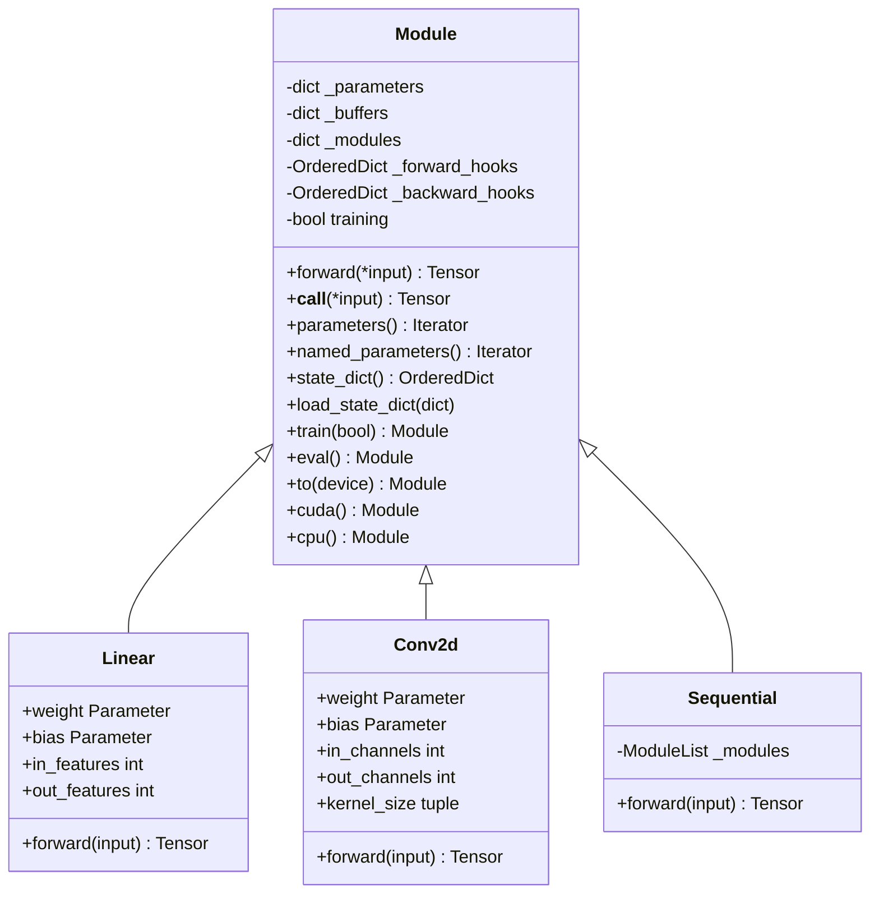

# PyTorch-04-torch.nn模块与JIT编译

## torch.nn模块

### 模块概览

torch.nn提供神经网络构建的高层API，包括层（Layer）、损失函数、优化器等。核心基类是`nn.Module`，所有神经网络模型都继承自它。

### nn.Module架构



### nn.Module核心机制

#### 参数注册

```python
class MyLinear(nn.Module):
    def __init__(self, in_features, out_features):
        super().__init__()
        # Parameter自动注册到_parameters
        self.weight = nn.Parameter(torch.randn(out_features, in_features))
        self.bias = nn.Parameter(torch.randn(out_features))
    
    def forward(self, x):
        return x.matmul(self.weight.t()) + self.bias
```

**`__setattr__`拦截**：
```python
def __setattr__(self, name, value):
    if isinstance(value, Parameter):
        # 注册到_parameters字典
        self._parameters[name] = value
    elif isinstance(value, Module):
        # 注册到_modules字典
        self._modules[name] = value
    else:
        # 普通属性
        object.__setattr__(self, name, value)
```

#### forward与`__call__`

```python
class Module:
    def __call__(self, *input, **kwargs):
        # 1. 执行forward pre-hooks
        for hook in self._forward_pre_hooks.values():
            result = hook(self, input)
            if result is not None:
                input = result
        
        # 2. 调用forward
        result = self.forward(*input, **kwargs)
        
        # 3. 执行forward hooks
        for hook in self._forward_hooks.values():
            hook_result = hook(self, input, result)
            if hook_result is not None:
                result = hook_result
        
        # 4. 执行backward hooks（注册到autograd）
        if len(self._backward_hooks) > 0:
            var = result
            while not isinstance(var, torch.Tensor):
                var = var[0]
            grad_fn = var.grad_fn
            if grad_fn is not None:
                for hook in self._backward_hooks.values():
                    wrapper = _WrappedHook(hook)
                    grad_fn.register_hook(wrapper)
        
        return result
```

### 常用Layer实现

#### Linear层

```python
class Linear(Module):
    def __init__(self, in_features, out_features, bias=True):
        super().__init__()
        self.in_features = in_features
        self.out_features = out_features
        
        # 初始化权重
        self.weight = Parameter(torch.empty(out_features, in_features))
        if bias:
            self.bias = Parameter(torch.empty(out_features))
        else:
            self.register_parameter('bias', None)
        
        self.reset_parameters()
    
    def reset_parameters(self):
        # Kaiming uniform初始化
        nn.init.kaiming_uniform_(self.weight, a=math.sqrt(5))
        if self.bias is not None:
            fan_in, _ = nn.init._calculate_fan_in_and_fan_out(self.weight)
            bound = 1 / math.sqrt(fan_in)
            nn.init.uniform_(self.bias, -bound, bound)
    
    def forward(self, input):
        return F.linear(input, self.weight, self.bias)
```

**F.linear实现**：
```cpp
// aten/src/ATen/native/Linear.cpp
Tensor linear(const Tensor& input, const Tensor& weight, const std::optional<Tensor>& bias) {
  // input: [*, in_features]
  // weight: [out_features, in_features]
  // output: [*, out_features]
  
  auto output = input.matmul(weight.t());
  if (bias.has_value()) {
    output.add_(*bias);
  }
  return output;
}
```

#### Conv2d层

```python
class Conv2d(Module):
    def __init__(self, in_channels, out_channels, kernel_size, 
                 stride=1, padding=0, dilation=1, groups=1, bias=True):
        super().__init__()
        self.in_channels = in_channels
        self.out_channels = out_channels
        self.kernel_size = _pair(kernel_size)  # (3, 3) or (3,)
        self.stride = _pair(stride)
        self.padding = _pair(padding)
        self.dilation = _pair(dilation)
        self.groups = groups
        
        # 权重形状: [out_channels, in_channels/groups, kernel_h, kernel_w]
        self.weight = Parameter(torch.empty(
            out_channels, in_channels // groups, *self.kernel_size
        ))
        if bias:
            self.bias = Parameter(torch.empty(out_channels))
        else:
            self.register_parameter('bias', None)
        
        self.reset_parameters()
    
    def forward(self, input):
        return F.conv2d(input, self.weight, self.bias,
                        self.stride, self.padding, self.dilation, self.groups)
```

**Conv2d实现（CUDA）**：
```cpp
// aten/src/ATen/native/cuda/Conv.cu
Tensor conv2d_cuda(
    const Tensor& input,    // [N, C_in, H, W]
    const Tensor& weight,   // [C_out, C_in/groups, kH, kW]
    const Tensor& bias,
    IntArrayRef stride,
    IntArrayRef padding,
    IntArrayRef dilation,
    int64_t groups) {
  
  // 计算输出形状
  auto output_size = conv_output_size(
      input.sizes(), weight.sizes(), stride, padding, dilation
  );
  Tensor output = at::empty(output_size, input.options());
  
  // 调用cuDNN
  cudnnConvolutionForward(
      handle, &alpha,
      input_desc, input.data_ptr(),
      filter_desc, weight.data_ptr(),
      conv_desc,
      algorithm,
      workspace, workspace_size,
      &beta,
      output_desc, output.data_ptr()
  );
  
  if (bias.defined()) {
    output.add_(bias.view({1, -1, 1, 1}));
  }
  
  return output;
}
```

#### BatchNorm2d层

```python
class BatchNorm2d(Module):
    def __init__(self, num_features, eps=1e-5, momentum=0.1, 
                 affine=True, track_running_stats=True):
        super().__init__()
        self.num_features = num_features
        self.eps = eps
        self.momentum = momentum
        self.affine = affine
        self.track_running_stats = track_running_stats
        
        if self.affine:
            self.weight = Parameter(torch.ones(num_features))
            self.bias = Parameter(torch.zeros(num_features))
        
        if self.track_running_stats:
            self.register_buffer('running_mean', torch.zeros(num_features))
            self.register_buffer('running_var', torch.ones(num_features))
            self.register_buffer('num_batches_tracked', torch.tensor(0, dtype=torch.long))
    
    def forward(self, input):
        if self.training:
            # 训练模式：计算batch统计量
            mean = input.mean([0, 2, 3])
            var = input.var([0, 2, 3], unbiased=False)
            
            # 更新running stats
            with torch.no_grad():
                self.running_mean = (1 - self.momentum) * self.running_mean + self.momentum * mean
                self.running_var = (1 - self.momentum) * self.running_var + self.momentum * var
                self.num_batches_tracked += 1
        else:
            # 推理模式：使用running stats
            mean = self.running_mean
            var = self.running_var
        
        # 归一化
        output = (input - mean.view(1, -1, 1, 1)) / torch.sqrt(var.view(1, -1, 1, 1) + self.eps)
        
        # 缩放和偏移
        if self.affine:
            output = output * self.weight.view(1, -1, 1, 1) + self.bias.view(1, -1, 1, 1)
        
        return output
```

### 模型构建示例

#### Sequential容器

```python
# 简单顺序模型
model = nn.Sequential(
    nn.Linear(784, 256),
    nn.ReLU(),
    nn.Linear(256, 128),
    nn.ReLU(),
    nn.Linear(128, 10)
)

# 带命名的Sequential
model = nn.Sequential(OrderedDict([
    ('fc1', nn.Linear(784, 256)),
    ('relu1', nn.ReLU()),
    ('fc2', nn.Linear(256, 128)),
    ('relu2', nn.ReLU()),
    ('fc3', nn.Linear(128, 10))
]))
```

#### 自定义模型

```python
class ResNetBlock(nn.Module):
    def __init__(self, channels):
        super().__init__()
        self.conv1 = nn.Conv2d(channels, channels, 3, padding=1)
        self.bn1 = nn.BatchNorm2d(channels)
        self.conv2 = nn.Conv2d(channels, channels, 3, padding=1)
        self.bn2 = nn.BatchNorm2d(channels)
    
    def forward(self, x):
        residual = x
        out = F.relu(self.bn1(self.conv1(x)))
        out = self.bn2(self.conv2(out))
        out += residual
        out = F.relu(out)
        return out

class ResNet(nn.Module):
    def __init__(self, num_blocks, num_classes=10):
        super().__init__()
        self.conv1 = nn.Conv2d(3, 64, 7, stride=2, padding=3)
        self.bn1 = nn.BatchNorm2d(64)
        self.maxpool = nn.MaxPool2d(3, stride=2, padding=1)
        
        # 使用ModuleList管理多个block
        self.blocks = nn.ModuleList([
            ResNetBlock(64) for _ in range(num_blocks)
        ])
        
        self.avgpool = nn.AdaptiveAvgPool2d((1, 1))
        self.fc = nn.Linear(64, num_classes)
    
    def forward(self, x):
        x = F.relu(self.bn1(self.conv1(x)))
        x = self.maxpool(x)
        
        for block in self.blocks:
            x = block(x)
        
        x = self.avgpool(x)
        x = x.view(x.size(0), -1)
        x = self.fc(x)
        return x
```

## TorchScript与JIT编译

### 概览

TorchScript是PyTorch的静态图表示，支持：
- **脚本化（Script）**：解析Python代码生成IR
- **跟踪（Trace）**：记录实际执行的算子序列
- **优化**：图融合、死代码消除、常量折叠
- **序列化**：保存为.pt文件，跨平台部署

### Script模式

```python
@torch.jit.script
def fused_relu(x, y):
    # JIT编译器解析Python代码
    z = x + y
    return z.relu()

# 查看生成的图IR
print(fused_relu.graph)
# graph(%x : Tensor, %y : Tensor):
#   %z : Tensor = aten::add(%x, %y)
#   %output : Tensor = aten::relu(%z)
#   return (%output)

# 优化后（融合）
print(fused_relu.graph_for(torch.randn(10), torch.randn(10)))
# graph(%x : Tensor, %y : Tensor):
#   %output : Tensor = prim::FusedAddRelu(%x, %y)  # 融合为单个kernel
#   return (%output)
```

#### Script化Module

```python
class MyCell(torch.nn.Module):
    def __init__(self):
        super().__init__()
        self.linear = torch.nn.Linear(4, 4)
    
    def forward(self, x, h):
        new_h = torch.tanh(self.linear(x) + h)
        return new_h, new_h

# Script化
scripted_cell = torch.jit.script(MyCell())

# 保存
scripted_cell.save("my_cell.pt")

# 加载（可在C++中加载）
loaded_cell = torch.jit.load("my_cell.pt")
```

### Trace模式

```python
def trace_example(x, y):
    if x.sum() > 0:  # 动态控制流
        return x + y
    else:
        return x * y

# 跟踪（记录一次执行路径）
x = torch.randn(3, 4)
y = torch.randn(3, 4)
traced_fn = torch.jit.trace(trace_example, (x, y))

# 问题：trace不记录控制流
# 无论输入如何，traced_fn总是执行x+y分支（跟踪时执行的路径）

# 解决：使用Script或条件注解
@torch.jit.script
def script_example(x, y):
    if bool(x.sum() > 0):  # Script支持控制流
        return x + y
    else:
        return x * y
```

### IR表示

#### Graph IR

```python
# Python代码
def forward(x, weight, bias):
    h = torch.matmul(x, weight)
    h = h + bias
    return torch.relu(h)

# 对应的Graph IR
graph(%x : Tensor, %weight : Tensor, %bias : Tensor):
  %h.1 : Tensor = aten::matmul(%x, %weight)
  %h.2 : Tensor = aten::add(%h.1, %bias, %1)
  %output : Tensor = aten::relu(%h.2)
  return (%output)
```

**IR节点类型**：
- `aten::xxx`: ATen算子
- `prim::xxx`: 原语操作（if/loop/Constant）
- `prim::TupleConstruct`: 构造tuple
- `prim::GetAttr`: 获取模块属性

#### 优化Pass

```python
# 原始图
graph:
  %1 = aten::add(%x, %y)
  %2 = aten::relu(%1)
  return (%2)

# Fusion优化后
graph:
  %1 = prim::FusedAddRelu(%x, %y)  # 融合为单个CUDA kernel
  return (%1)

# 常量折叠
graph:
  %a = prim::Constant[value=2]()
  %b = prim::Constant[value=3]()
  %c = aten::add(%a, %b)
  %d = aten::mul(%x, %c)
  return (%d)

# 优化后
graph:
  %c = prim::Constant[value=5]()  # 2+3在编译时计算
  %d = aten::mul(%x, %c)
  return (%d)
```

### 性能优化

#### 图融合

```python
# 未融合：3个kernel launch
@torch.jit.script
def unfused(x, y, z):
    a = x + y
    b = a * z
    return b.relu()

# JIT自动融合为1个kernel
# fused_kernel: out[i] = relu((x[i] + y[i]) * z[i])
```

#### Frozen Modules

```python
model = MyModel()
model.eval()

# Freeze：内联常量参数和buffer
frozen_model = torch.jit.freeze(torch.jit.script(model))

# 效果：
# 1. 参数从GetAttr变为Constant
# 2. 允许更多常量折叠优化
# 3. 减少内存访问
```

#### CUDA Graph Capture

```python
# 捕获CUDA kernel序列为静态图
model = MyModel().cuda()
x = torch.randn(32, 3, 224, 224, device='cuda')

# Warmup
for _ in range(10):
    y = model(x)

# Capture
g = torch.cuda.CUDAGraph()
with torch.cuda.graph(g):
    y = model(x)

# Replay（减少kernel launch开销）
g.replay()
```

## 模型部署

### 导出ONNX

```python
model = torchvision.models.resnet18(pretrained=True)
model.eval()

dummy_input = torch.randn(1, 3, 224, 224)

# 导出ONNX
torch.onnx.export(
    model,
    dummy_input,
    "resnet18.onnx",
    export_params=True,
    opset_version=11,
    do_constant_folding=True,
    input_names=['input'],
    output_names=['output'],
    dynamic_axes={'input': {0: 'batch_size'}, 'output': {0: 'batch_size'}}
)
```

### C++部署（LibTorch）

```cpp
#include <torch/script.h>

int main() {
  // 加载TorchScript模型
  torch::jit::script::Module module;
  module = torch::jit::load("model.pt");
  module.eval();
  
  // 准备输入
  std::vector<torch::jit::IValue> inputs;
  inputs.push_back(torch::randn({1, 3, 224, 224}));
  
  // 前向传播
  at::Tensor output = module.forward(inputs).toTensor();
  
  std::cout << output.slice(/*dim=*/1, /*start=*/0, /*end=*/5) << '\n';
  
  return 0;
}
```

### 移动端部署

```python
# 优化移动端模型
from torch.utils.mobile_optimizer import optimize_for_mobile

model = MyModel()
model.eval()
example = torch.rand(1, 3, 224, 224)
traced_script_module = torch.jit.trace(model, example)

# 移动端优化
optimized_model = optimize_for_mobile(traced_script_module)
optimized_model._save_for_lite_interpreter("model_mobile.ptl")
```

**Android使用**：
```java
import org.pytorch.Module;
import org.pytorch.Tensor;

Module module = Module.load("model_mobile.ptl");
Tensor input = Tensor.fromBlob(inputData, shape);
Tensor output = module.forward(IValue.from(input)).toTensor();
```

---

**文档版本**: v1.0  
**最后更新**: 2025-01-01

