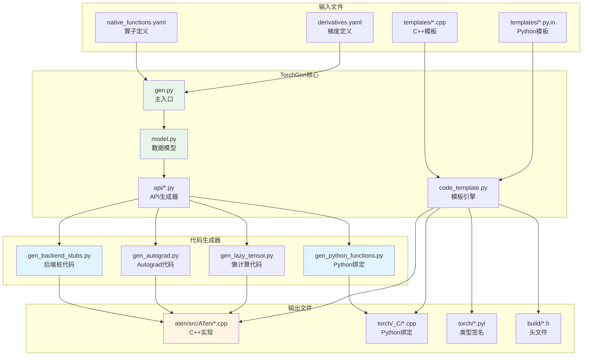
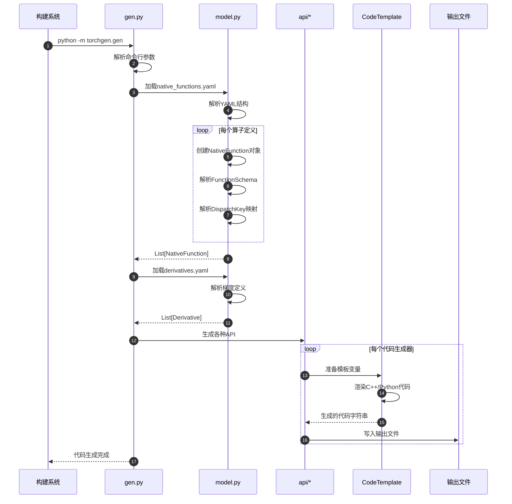
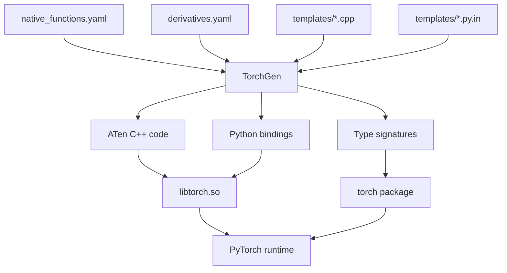

# PyTorch-05-TorchGen代码生成器

## 模块概览

TorchGen是PyTorch的代码生成工具，负责从YAML配置文件和Python模板自动生成C++和Python绑定代码。它是PyTorch构建系统的核心组件，负责生成算子的C++实现、Python绑定、类型签名等。

### 核心职责

- **算子代码生成**：从native_functions.yaml生成C++算子实现
- **Python绑定**：生成torch._C的Python-C++绑定代码
- **类型签名**：生成.pyi类型提示文件
- **Dispatcher注册**：生成算子注册到Dispatcher的代码
- **后端适配**：为不同backend（CPU/CUDA/XPU）生成特化代码

### 架构图



## 核心数据模型

### NativeFunction

表示native_functions.yaml中定义的一个算子。

```python
@dataclass(frozen=True)
class NativeFunction:
    func: FunctionSchema           # 函数签名
    use_c10_dispatcher: bool       # 是否使用c10 dispatcher
    python_module: str | None      # Python模块名
    category_override: str | None  # 分类覆盖
    variants: set[Variant]         # 变体（function/method）
    structured: bool               # 是否结构化
    structured_delegate: str | None # 结构化委托
    out: NativeFunction | None     # out变体
    inplace: NativeFunction | None # inplace变体
    abstract: bool                 # 是否抽象
    device_check: DeviceCheckType  # 设备检查类型
    device_guard: bool             # 是否需要设备保护
    kernel: str | None             # 内核名称
    dispatch: dict[DispatchKey, str] # 分发表
    autogen: list[str]             # 自动生成列表
    cpp_no_default_args: set[str]  # C++无默认参数
    is_abstract: bool              # 是否抽象函数
    has_composite_implicit_autograd_kernel: bool # 是否有复合隐式autograd内核
    has_composite_explicit_autograd_kernel: bool # 是否有复合显式autograd内核
    has_composite_explicit_autograd_non_functional_kernel: bool
    
    @property
    def root_name(self) -> str:
        return self.func.name.name.base  # 例如：add_
    
    @property
    def base_name(self) -> str:
        return self.func.name.name.base  # 例如：add
```

### FunctionSchema

表示函数的完整签名。

```python
@dataclass(frozen=True)
class FunctionSchema:
    name: OperatorName           # 操作符名称
    arguments: Arguments         # 参数列表
    returns: tuple[Return, ...]  # 返回值列表
    
    def signature(self, *, strip_default: bool = False) -> str:
        # 生成完整签名字符串
        # 例如："add.Tensor(Tensor self, Tensor other, *, Scalar alpha=1) -> Tensor"
```

### OperatorName

```python
@dataclass(frozen=True)
class OperatorName:
    name: BaseName               # 基础名称
    overload_name: str           # 重载名称
    
    @property
    def unambiguous_name(self) -> str:
        # 生成无歧义名称
        if self.overload_name:
            return f"{self.name.base}.{self.overload_name}"
        return str(self.name.base)
```

### BaseName

```python
@dataclass(frozen=True)
class BaseName:
    base: str                    # 基础名称（如："add"）
    inplace: bool = False        # 是否inplace（如："add_"）
    
    def __str__(self) -> str:
        return self.base + ("_" if self.inplace else "")
```

## 代码生成流程

### 主流程时序图



### 算子定义解析

**native_functions.yaml示例**：
```yaml
- func: add.Tensor(Tensor self, Tensor other, *, Scalar alpha=1) -> Tensor
  variants: function, method
  structured: true
  dispatch:
    CPU: add_cpu
    CUDA: add_cuda
    MPS: add_mps
  autogen: add.out

- func: add_.Tensor(Tensor(a!) self, Tensor other, *, Scalar alpha=1) -> Tensor(a!)
  variants: method
  structured_delegate: add.Tensor
  dispatch:
    CPU: add__cpu
    CUDA: add__cuda
```

**解析过程**：
```python
def parse_native_function(es: object) -> NativeFunction:
    # 1. 解析函数签名
    func_schema = FunctionSchema.parse(es['func'])
    
    # 2. 解析dispatch映射
    dispatch = {}
    if 'dispatch' in es:
        for key, kernel in es['dispatch'].items():
            dispatch[DispatchKey[key]] = kernel
    
    # 3. 解析variants
    variants = set()
    if 'variants' in es:
        for variant in es['variants'].split(', '):
            variants.add(Variant[variant])
    
    # 4. 构造NativeFunction对象
    return NativeFunction(
        func=func_schema,
        dispatch=dispatch,
        variants=variants,
        structured=es.get('structured', False),
        # ... 其他字段
    )
```

## 主要代码生成器

### 1. gen_backend_stubs.py

生成后端特定的桩代码。

```python
def gen_backend_stubs(
    native_functions: Sequence[NativeFunction],
    backend_name: str,
    dispatch_key: DispatchKey,
    output_dir: str,
):
    # 为每个native function生成backend stub
    
    for f in native_functions:
        if dispatch_key not in f.dispatch:
            continue
            
        # 生成函数声明
        sig = CppSignatureGroup.from_native_function(f)
        decl = f"TORCH_API {sig.signature()} {f.dispatch[dispatch_key]}({sig.arguments()});"
        
        # 生成函数实现（调用kernel）
        impl = f"""
{sig.defn()} {{
    // 自动生成的backend stub
    return at::native::{f.dispatch[dispatch_key]}({sig.call_args()});
}}
"""
        
        # 写入文件
        write_cpp_file(f"{output_dir}/{f.root_name}.cpp", impl)
```

### 2. gen_python_functions.py

生成Python绑定代码。

```python
def gen_python_binding(f: NativeFunction) -> str:
    # 1. 生成Python签名
    python_sig = PythonSignature.from_native_function(f)
    
    # 2. 生成C++分发lambda
    cpp_sig = CppSignature.from_native_function(f)
    lambda_def = f"""
auto dispatch_{f.func.name.unambiguous_name()} = 
    []({cpp_sig.arguments()}) -> {cpp_sig.returns()} {{
    pybind11::gil_scoped_release no_gil;
    return {cpp_sig.call_expression()};
}};
"""
    
    # 3. 生成参数解析代码
    parser_code = f"""
static PythonArgParser parser({{
    "{python_sig.signature_str()}",
}}, /*traceable=*/true);

ParsedArgs<{len(python_sig.arguments)}> parsed_args;
auto _r = parser.parse(nullptr, args, kwargs, parsed_args);
"""
    
    # 4. 生成分发调用
    dispatch_code = f"""
return wrap(dispatch_{f.func.name.unambiguous_name()}(
    {python_sig.binding_expressions()}
));
"""
    
    return lambda_def + parser_code + dispatch_code
```

### 3. gen_autograd.py

生成autograd Function代码。

```python
def gen_autograd_function(f: NativeFunction, derivative: Derivative) -> str:
    # 1. 生成Forward函数
    forward_code = f"""
struct {f.func.name.base.title()}Backward : public TraceableFunction {{
    using TraceableFunction::TraceableFunction;
    
    variable_list apply(variable_list&& grads) override {{
        // 生成梯度计算代码
        {generate_gradient_code(derivative)}
    }}
    
    std::string name() const override {{
        return "{f.func.name.base.title()}Backward";
    }}
}};
"""
    
    # 2. 生成包装函数
    wrapper_code = f"""
Tensor {f.func.name.base}_autograd({cpp_sig.arguments()}) {{
    auto result = at::{f.func.name.base}({cpp_sig.call_args()});
    
    if (requires_grad({{self, other}})) {{
        auto grad_fn = std::make_shared<{f.func.name.base.title()}Backward>();
        grad_fn->save_variables({{self, other}});
        set_history(result, grad_fn);
    }}
    
    return result;
}}
"""
    
    return forward_code + wrapper_code
```

## 模板引擎

### CodeTemplate

TorchGen使用自定义的模板引擎处理代码模板。

```python
class CodeTemplate:
    def __init__(self, template: str):
        self.template = template
        
    def substitute(self, env: dict[str, Any]) -> str:
        # 1. 处理${变量}替换
        result = self.template
        for key, value in env.items():
            placeholder = "${" + key + "}"
            result = result.replace(placeholder, str(value))
        
        # 2. 处理条件语句 $if{condition}...${endif}
        result = self._process_conditionals(result, env)
        
        # 3. 处理循环语句 $for{item in items}...${endfor}
        result = self._process_loops(result, env)
        
        return result
    
    def _process_conditionals(self, text: str, env: dict) -> str:
        # 处理 $if{condition}...${endif} 语法
        import re
        pattern = r'\$if\{([^}]+)\}(.*?)\$\{endif\}'
        
        def replace_conditional(match):
            condition = match.group(1)
            content = match.group(2)
            
            # 评估条件
            try:
                if eval(condition, env):
                    return content
                else:
                    return ""
            except:
                return ""
        
        return re.sub(pattern, replace_conditional, text, flags=re.DOTALL)
```

### 模板示例

**aten/src/ATen/templates/Functions.cpp**：
```cpp
// 自动生成警告
// @generated from ${template_path}

#include <ATen/Functions.h>
#include <ATen/core/dispatch/Dispatcher.h>

namespace at {

$for{f in native_functions}
${cpp_function_definition(f)}

$endfor

} // namespace at
```

**生成结果**：
```cpp
// @generated from aten/src/ATen/templates/Functions.cpp

#include <ATen/Functions.h>
#include <ATen/core/dispatch/Dispatcher.h>

namespace at {

Tensor add(const Tensor& self, const Tensor& other, const Scalar& alpha) {
    static auto op = c10::Dispatcher::singleton()
        .findSchemaOrThrow("aten::add", "Tensor");
    return op.typed<Tensor(const Tensor&, const Tensor&, const Scalar&)>()
        .call(self, other, alpha);
}

Tensor& add_(Tensor& self, const Tensor& other, const Scalar& alpha) {
    static auto op = c10::Dispatcher::singleton()
        .findSchemaOrThrow("aten::add_", "Tensor");
    return op.typed<Tensor&(Tensor&, const Tensor&, const Scalar&)>()
        .call(self, other, alpha);
}

// ... 更多函数

} // namespace at
```

## 关键API生成

### Python API生成

```python
# torch/_C/_VariableFunctions.cpp
PyObject* THPVariable_add(PyObject* self_, PyObject* args, PyObject* kwargs) {
    HANDLE_TH_ERRORS
    
    // 参数解析器
    static PythonArgParser parser({
        "add(Tensor input, Tensor other, *, Scalar alpha=1)",
        "add(Tensor input, Scalar other, Scalar alpha=1)",
    }, /*traceable=*/true);
    
    ParsedArgs<3> parsed_args;
    auto _r = parser.parse(nullptr, args, kwargs, parsed_args);
    
    switch (_r.idx) {
        case 0: {
            // add(Tensor, Tensor, Scalar)
            auto dispatch_add = [](const Tensor& self, const Tensor& other, const Scalar& alpha) {
                pybind11::gil_scoped_release no_gil;
                return self.add(other, alpha);
            };
            return wrap(dispatch_add(_r.tensor(0), _r.tensor(1), _r.scalar(2)));
        }
        case 1: {
            // add(Tensor, Scalar, Scalar)
            auto dispatch_add = [](const Tensor& self, const Scalar& other, const Scalar& alpha) {
                pybind11::gil_scoped_release no_gil;
                return self.add(other, alpha);
            };
            return wrap(dispatch_add(_r.tensor(0), _r.scalar(1), _r.scalar(2)));
        }
    }
    
    END_HANDLE_TH_ERRORS
}
```

### 类型签名生成

```python
# torch/_C/__init__.pyi
def add(
    input: Tensor,
    other: Union[Tensor, Number],
    *,
    alpha: Number = 1,
    out: Optional[Tensor] = None
) -> Tensor: ...

def add_(
    self: Tensor,
    other: Union[Tensor, Number],
    *,
    alpha: Number = 1
) -> Tensor: ...
```

## 性能优化

### 1. 增量生成

TorchGen支持增量代码生成，只重新生成修改过的文件。

```python
def should_regenerate_file(input_files: list[str], output_file: str) -> bool:
    if not os.path.exists(output_file):
        return True
    
    output_mtime = os.path.getmtime(output_file)
    for input_file in input_files:
        if os.path.getmtime(input_file) > output_mtime:
            return True
    
    return False
```

### 2. 并行生成

多个生成器可以并行运行。

```python
import multiprocessing

def generate_all_files():
    tasks = [
        (gen_backend_stubs, backend_args),
        (gen_python_functions, python_args),
        (gen_autograd, autograd_args),
    ]
    
    with multiprocessing.Pool() as pool:
        pool.starmap(run_generator, tasks)
```

### 3. 缓存优化

解析结果可以缓存避免重复计算。

```python
@functools.lru_cache(maxsize=None)
def parse_native_functions(yaml_path: str) -> list[NativeFunction]:
    with open(yaml_path) as f:
        data = yaml.safe_load(f)
    return [parse_native_function(item) for item in data]
```

## 扩展与定制

### 添加新的Backend

1. **定义DispatchKey**：
```python
# torchgen/model.py
class DispatchKey(Enum):
    # ... 现有keys
    MyBackend = auto()
```

2. **添加code generator**：
```python
# torchgen/gen_my_backend.py
def gen_my_backend_kernels(native_functions: Sequence[NativeFunction]):
    for f in native_functions:
        if DispatchKey.MyBackend in f.dispatch:
            generate_kernel_for_function(f)
```

3. **在native_functions.yaml中声明**：
```yaml
- func: add.Tensor(Tensor self, Tensor other, *, Scalar alpha=1) -> Tensor
  dispatch:
    MyBackend: add_my_backend
```

### 自定义模板

```python
# 定义新的模板处理器
class MyCodeTemplate(CodeTemplate):
    def __init__(self, template_path: str):
        with open(template_path) as f:
            super().__init__(f.read())
    
    def generate_for_function(self, f: NativeFunction) -> str:
        env = {
            'function_name': f.func.name.base,
            'arguments': f.func.arguments,
            'returns': f.func.returns,
            # ... 更多变量
        }
        return self.substitute(env)
```

## 构建集成

### CMake集成

```cmake
# 在CMakeLists.txt中
set(TORCHGEN_OUTPUTS
    ${CMAKE_CURRENT_BINARY_DIR}/Functions.cpp
    ${CMAKE_CURRENT_BINARY_DIR}/Functions.h
    ${CMAKE_CURRENT_BINARY_DIR}/python_functions.cpp
)

add_custom_command(
    OUTPUT ${TORCHGEN_OUTPUTS}
    COMMAND ${Python_EXECUTABLE} -m torchgen.gen
        --source-path ${CMAKE_CURRENT_SOURCE_DIR}
        --output-dir ${CMAKE_CURRENT_BINARY_DIR}
    DEPENDS
        ${CMAKE_CURRENT_SOURCE_DIR}/native_functions.yaml
        ${CMAKE_CURRENT_SOURCE_DIR}/derivatives.yaml
    COMMENT "Generating PyTorch operators"
)

add_custom_target(generate_pytorch_ops
    DEPENDS ${TORCHGEN_OUTPUTS}
)
```

### 依赖关系



---

**文档版本**: v1.0  
**最后更新**: 2025-01-01
