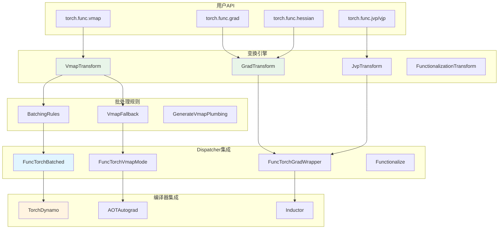
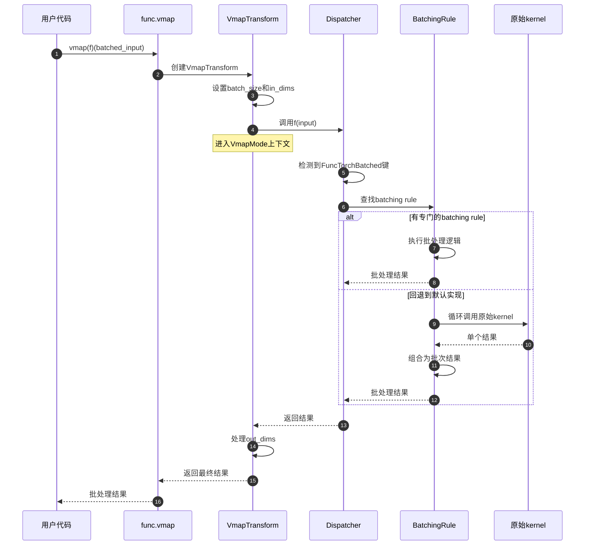

# PyTorch-06-Functorch函数式变换

## 模块概览

Functorch是PyTorch的函数式编程扩展，提供可组合的函数变换，包括自动向量化（vmap）、自动微分（grad）、即时编译等。它将函数视为一等公民，支持高阶函数操作，是PyTorch 2.0编译栈的重要组成部分。

### 核心功能

- **vmap（向量化映射）**：自动批处理函数，无需手写循环
- **grad（函数式梯度）**：纯函数式梯度计算，支持高阶导数
- **jvp/vjp**：Jacobian向量积，支持前向/反向模式AD
- **hessian**：Hessian矩阵计算
- **jacrev/jacfwd**：Jacobian矩阵计算（反向/前向模式）
- **functionalize**：将inplace操作转换为functional形式

### 架构图



## 核心变换

### vmap - 自动向量化

#### 基本概念

vmap将操作单个样本的函数自动转换为处理批次的函数。

```python
import torch
from torch import func

# 原始函数：计算单个向量的L2范数
def compute_norm(x):
    return x.pow(2).sum().sqrt()

# 对于批次数据，传统方法需要循环
batch_x = torch.randn(100, 3)  # 100个3维向量
norms_loop = torch.stack([compute_norm(x) for x in batch_x])

# 使用vmap自动向量化
norms_vmap = func.vmap(compute_norm)(batch_x)

assert torch.allclose(norms_loop, norms_vmap)
```

#### vmap实现机制



#### Batching Rules

每个算子都需要定义batching rule来处理批维度。

```python
# 示例：add操作的batching rule
def add_batching_rule(left_args, right_args):
    left_x, left_bdim = left_args
    right_x, right_bdim = right_args
    
    # 如果两个输入都有batch维度
    if left_bdim is not None and right_bdim is not None:
        # 确保batch维度在同一位置
        if left_bdim != right_bdim:
            left_x = left_x.movedim(left_bdim, 0)
            right_x = right_x.movedim(right_bdim, 0)
            bdim = 0
        else:
            bdim = left_bdim
        
        # 执行实际的add操作
        result = torch.add(left_x, right_x)
        return result, bdim
    
    # 如果只有一个输入有batch维度
    elif left_bdim is not None:
        result = torch.add(left_x, right_x)
        return result, left_bdim
    elif right_bdim is not None:
        result = torch.add(left_x, right_x)
        return result, right_bdim
    
    # 都没有batch维度（不应该发生）
    else:
        result = torch.add(left_x, right_x)
        return result, None
```

### grad - 函数式梯度

#### 基本使用

```python
import torch
from torch import func

def loss_fn(weights, bias, x, y):
    pred = x @ weights + bias
    return ((pred - y) ** 2).mean()

# 计算关于weights的梯度
weights = torch.randn(5, requires_grad=True)
bias = torch.randn(1, requires_grad=True)
x = torch.randn(100, 5)
y = torch.randn(100)

# 传统方式
loss = loss_fn(weights, bias, x, y)
loss.backward()
grad_weights_traditional = weights.grad

# 函数式方式
grad_fn = func.grad(loss_fn, argnums=0)  # 对第0个参数求梯度
grad_weights_functional = grad_fn(weights, bias, x, y)

assert torch.allclose(grad_weights_traditional, grad_weights_functional)
```

#### 高阶导数

```python
# 二阶导数（Hessian对角线）
def scalar_fn(x):
    return (x ** 4).sum()

x = torch.randn(5)

# 一阶导数
first_grad = func.grad(scalar_fn)(x)

# 二阶导数
second_grad = func.grad(func.grad(scalar_fn))(x)

# 或使用hessian
hess = func.hessian(scalar_fn)(x)
hess_diag = torch.diag(hess)

assert torch.allclose(second_grad, hess_diag)
```

### jvp/vjp - Jacobian向量积

#### JVP（前向模式AD）

```python
def f(x):
    return x ** 3 + 2 * x ** 2 + x

x = torch.tensor([1.0, 2.0, 3.0])
v = torch.tensor([1.0, 1.0, 1.0])  # 切向量

# JVP: J(f)(x) @ v
y, jvp_result = func.jvp(f, (x,), (v,))

# 手动计算验证
# f'(x) = 3x^2 + 4x + 1
# f'([1,2,3]) = [8, 21, 40]
# jvp = f'(x) * v = [8, 21, 40]
expected_jvp = 3 * x ** 2 + 4 * x + 1
assert torch.allclose(jvp_result, expected_jvp)
```

#### VJP（反向模式AD）

```python
def f(x):
    return x ** 2

x = torch.tensor([1.0, 2.0, 3.0])

# VJP: v^T @ J(f)(x)
y, vjp_fn = func.vjp(f, x)
v = torch.tensor([1.0, 1.0, 1.0])
vjp_result = vjp_fn(v)[0]

# 手动计算验证
# f'(x) = 2x
# vjp = v^T @ f'(x) = [1,1,1] @ [2,4,6] = [2,4,6]
expected_vjp = 2 * x
assert torch.allclose(vjp_result, expected_vjp)
```

## 变换组合

### vmap + grad

```python
# 计算每个样本的梯度（per-sample gradients）
def loss_fn(weights, x, y):
    pred = x @ weights
    return (pred - y) ** 2

weights = torch.randn(5)
batch_x = torch.randn(100, 5)  # 100个样本
batch_y = torch.randn(100)

# 方法1：vmap(grad(...))
per_sample_grads = func.vmap(func.grad(loss_fn, argnums=0), in_dims=(None, 0, 0))(
    weights, batch_x, batch_y
)

# 方法2：grad(vmap(...))也可以，但语义不同
# 这会计算批次loss的梯度，而不是每个样本的梯度

print(per_sample_grads.shape)  # [100, 5] - 每个样本一个梯度向量
```

### grad + grad（二阶导数）

```python
def f(x):
    return (x ** 4).sum()

x = torch.randn(3)

# Hessian矩阵
def hessian_fn(f):
    return func.jacrev(func.grad(f))

hess = hessian_fn(f)(x)
print(hess.shape)  # [3, 3]

# 等价于直接使用hessian
hess_direct = func.hessian(f)(x)
assert torch.allclose(hess, hess_direct)
```

## 编译器集成

### AOTAutograd

AOTAutograd（Ahead-Of-Time Autograd）使用functorch进行提前梯度计算。

```python
import torch._dynamo as dynamo
from torch._functorch.aot_autograd import aot_function

def model(x, weight):
    return torch.nn.functional.linear(x, weight)

# AOT编译
compiled_model = aot_function(
    model,
    fw_compiler=dynamo.optimize("inductor"),  # 前向编译器
    bw_compiler=dynamo.optimize("inductor"),  # 反向编译器
)

x = torch.randn(10, 5, requires_grad=True)
weight = torch.randn(3, 5, requires_grad=True)

# 使用编译后的模型
output = compiled_model(x, weight)
loss = output.sum()
loss.backward()
```

### 函数化（Functionalization）

将inplace操作转换为functional操作，便于编译器优化。

```python
def inplace_fn(x):
    x.add_(1)      # inplace操作
    x.mul_(2)      # inplace操作
    return x

# 函数化转换
functional_fn = func.functionalize(inplace_fn)

x = torch.randn(5)
x_orig = x.clone()

# 原始函数修改输入
result1 = inplace_fn(x)
assert not torch.equal(x, x_orig)  # x被修改了

# 函数化版本不修改输入
x = x_orig.clone()
result2 = functional_fn(x)
assert torch.equal(x, x_orig)  # x未被修改
assert torch.equal(result1, result2)  # 结果相同
```

## 性能优化

### 批处理规则优化

```python
# 优化的matmul batching rule
def matmul_batching_rule(left_args, right_args):
    left_x, left_bdim = left_args
    right_x, right_bdim = right_args
    
    # 利用批次矩阵乘法（bmm）避免循环
    if left_bdim == 0 and right_bdim == 0:
        # 两个输入都在第0维有batch
        return torch.bmm(left_x, right_x), 0
    elif left_bdim == 0 and right_bdim is None:
        # 只有左边有batch，使用广播
        result = torch.matmul(left_x, right_x.unsqueeze(0))
        return result, 0
    # ... 其他情况
```

### 内存优化

```python
# 使用checkpoint减少内存占用
from torch.utils.checkpoint import checkpoint

def expensive_function(x):
    # 计算密集的函数
    for _ in range(100):
        x = torch.sin(x) + torch.cos(x)
    return x

# vmap with checkpointing
vmapped_fn = func.vmap(lambda x: checkpoint(expensive_function, x))
result = vmapped_fn(torch.randn(1000, 10))
```

### 编译优化

```python
# 使用torch.compile优化vmap
@torch.compile
def fast_vmap_fn(x):
    def single_fn(item):
        return torch.sin(item).sum()
    return func.vmap(single_fn)(x)

# 编译后的版本会融合操作，减少kernel launch
x = torch.randn(1000, 100)
result = fast_vmap_fn(x)
```

## 实际应用案例

### 参数高效微调（LoRA）

```python
def lora_linear(x, W, A, B, scale):
    # W: 预训练权重 [out_features, in_features]
    # A, B: LoRA矩阵 [rank, in_features], [out_features, rank]
    base_output = torch.nn.functional.linear(x, W)
    lora_output = torch.nn.functional.linear(
        torch.nn.functional.linear(x, A.T), B.T
    )
    return base_output + scale * lora_output

# 计算每个LoRA参数的梯度
def compute_lora_grads(loss_fn, A, B, scale, *other_args):
    # 使用grad计算A, B的梯度
    grad_fn = func.grad(loss_fn, argnums=(0, 1))
    grad_A, grad_B = grad_fn(A, B, scale, *other_args)
    return grad_A, grad_B

# 使用vmap处理多个LoRA适配器
def multi_lora_forward(x, W, As, Bs, scales):
    # As: [num_adapters, rank, in_features]
    # Bs: [num_adapters, out_features, rank]
    def single_lora(A, B, scale):
        return lora_linear(x, W, A, B, scale)
    
    outputs = func.vmap(single_lora)(As, Bs, scales)
    return outputs.mean(0)  # 平均多个适配器的输出
```

### 神经ODE求解

```python
def neural_ode_func(t, y, theta):
    # y: [batch_size, state_dim]
    # theta: 神经网络参数
    return neural_net(y, theta)

def solve_ode_batch(y0_batch, t_span, theta):
    # 使用vmap并行求解多个初始条件
    def solve_single(y0):
        return odeint(neural_ode_func, y0, t_span, theta)
    
    return func.vmap(solve_single)(y0_batch)

# 计算关于初始条件的敏感性
def sensitivity_analysis(y0, t_span, theta):
    def solve_fn(y0):
        return odeint(neural_ode_func, y0, t_span, theta)
    
    # 计算解关于初始条件的Jacobian
    jacobian_fn = func.jacrev(solve_fn)
    return jacobian_fn(y0)
```

### 贝叶斯神经网络

```python
def bayesian_prediction(x, weight_samples):
    # weight_samples: [num_samples, ...] 权重样本
    
    def single_forward(weights):
        return neural_net(x, weights)
    
    # vmap over weight samples
    predictions = func.vmap(single_forward)(weight_samples)
    
    # 计算预测均值和方差
    mean_pred = predictions.mean(0)
    var_pred = predictions.var(0)
    
    return mean_pred, var_pred

# 计算每个权重样本的对数似然
def compute_log_likelihoods(data_batch, weight_samples, targets):
    def log_likelihood(weights, x, y):
        pred = neural_net(x, weights)
        return -torch.nn.functional.mse_loss(pred, y)
    
    # vmap over samples and data
    log_liks = func.vmap(
        func.vmap(log_likelihood, in_dims=(None, 0, 0)),
        in_dims=(0, None, None)
    )(weight_samples, data_batch, targets)
    
    return log_liks.sum(-1)  # 每个样本的总对数似然
```

## 调试与分析

### 性能分析

```python
import torch.profiler

with torch.profiler.profile(
    activities=[torch.profiler.ProfilerActivity.CPU, torch.profiler.ProfilerActivity.CUDA],
    record_shapes=True
) as prof:
    with torch.profiler.record_function("vmap_operation"):
        result = func.vmap(some_function)(batch_input)

print(prof.key_averages().table(sort_by="cuda_time_total"))
```

### 错误处理

```python
# 检查vmap维度兼容性
def safe_vmap(fn, in_dims=0, out_dims=0):
    def wrapper(*args):
        # 验证输入维度
        for i, (arg, dim) in enumerate(zip(args, in_dims)):
            if isinstance(dim, int) and dim >= arg.ndim:
                raise ValueError(f"in_dims[{i}]={dim} >= arg.ndim={arg.ndim}")
        
        return func.vmap(fn, in_dims=in_dims, out_dims=out_dims)(*args)
    
    return wrapper
```

---

**文档版本**: v1.0  
**最后更新**: 2025-01-01
