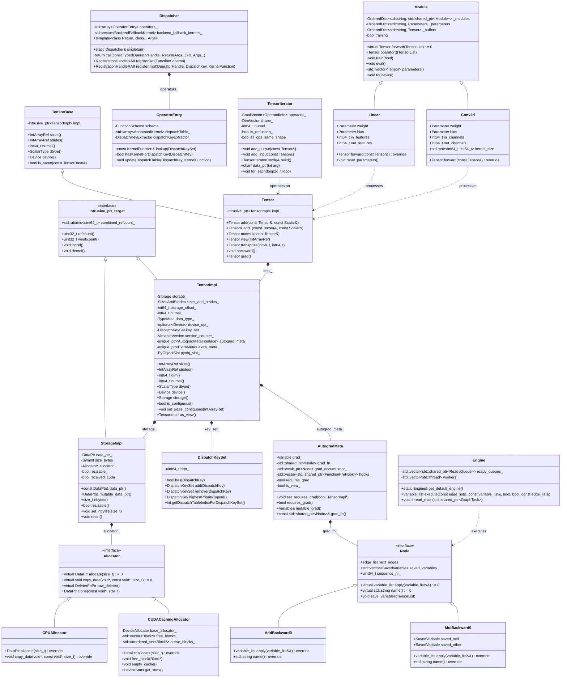

# PyTorch-08-数据结构UML与交互图

## 核心数据结构关系图

### 完整系统UML类图



### 模块交互状态图


### 内存管理生命周期图

```mermaid
stateDiagram-v2
    [*] --> Allocated : Allocator::allocate()
    
    Allocated --> InUse : 创建Tensor
    InUse --> Shared : 多个Tensor共享
    InUse --> Released : 引用计数=0
    
    Shared --> InUse : 其他引用释放
    Shared --> Released : 所有引用释放
    
    Released --> Cached : CachingAllocator缓存
    Released --> Deallocated : 直接释放
    
    Cached --> InUse : 缓存命中复用
    Cached --> Deallocated : 内存压力释放
    
    Deallocated --> [*]
    
    note right of Cached
        GPU内存池
        减少cudaMalloc调用
        按大小分桶管理
    end note
```

## 关键交互时序图

### 训练一个batch的完整时序


### 算子分发详细时序


### 内存分配与回收时序


## 性能瓶颈分析图

### CPU时间分布图


### 内存使用分布图


### 调用频次热力图


## 数据流向图

### 训练数据流


### 内存数据流

```mermaid
flowchart TD
    subgraph CPU内存
        A1[Python对象] --> A2[numpy arrays]
        A2 --> A3[torch.Tensor]
    end
    
    subgraph GPU内存
        B1[Device Tensor]
        B2[Kernel输入]
        B3[Kernel输出]
        B4[缓存池]
    end
    
    subgraph 计算单元
        C1[CUDA Cores]
        C2[Tensor Cores]
        C3[cuDNN]
    end
    
    A3 --> B1 : to(device)
    B1 --> B2 : 内存布局转换
    B2 --> C1 : 一般计算
    B2 --> C2 : 混合精度
    B2 --> C3 : 卷积/RNN
    
    C1 --> B3
    C2 --> B3
    C3 --> B3
    
    B3 --> B1 : 结果存储
    B1 --> B4 : 释放到缓存
    B4 --> B1 : 缓存复用
    
    B1 --> A3 : to('cpu')
```

---

**文档版本**: v1.0  
**最后更新**: 2025-01-01
