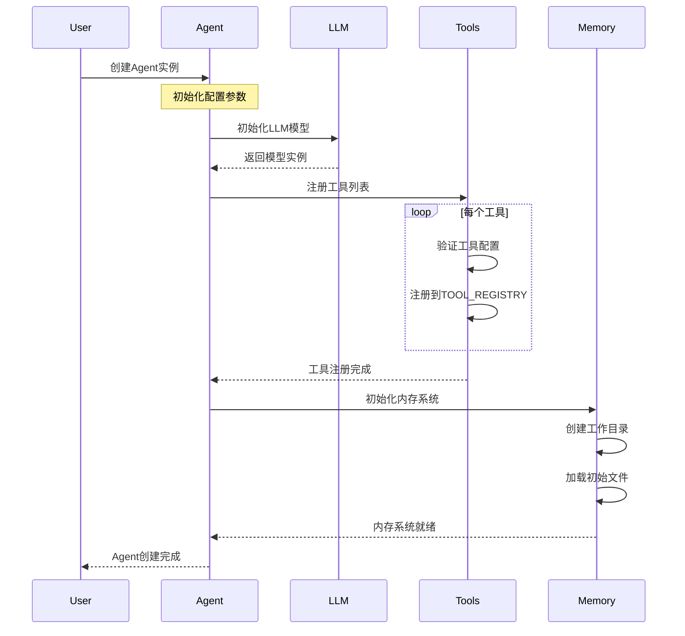
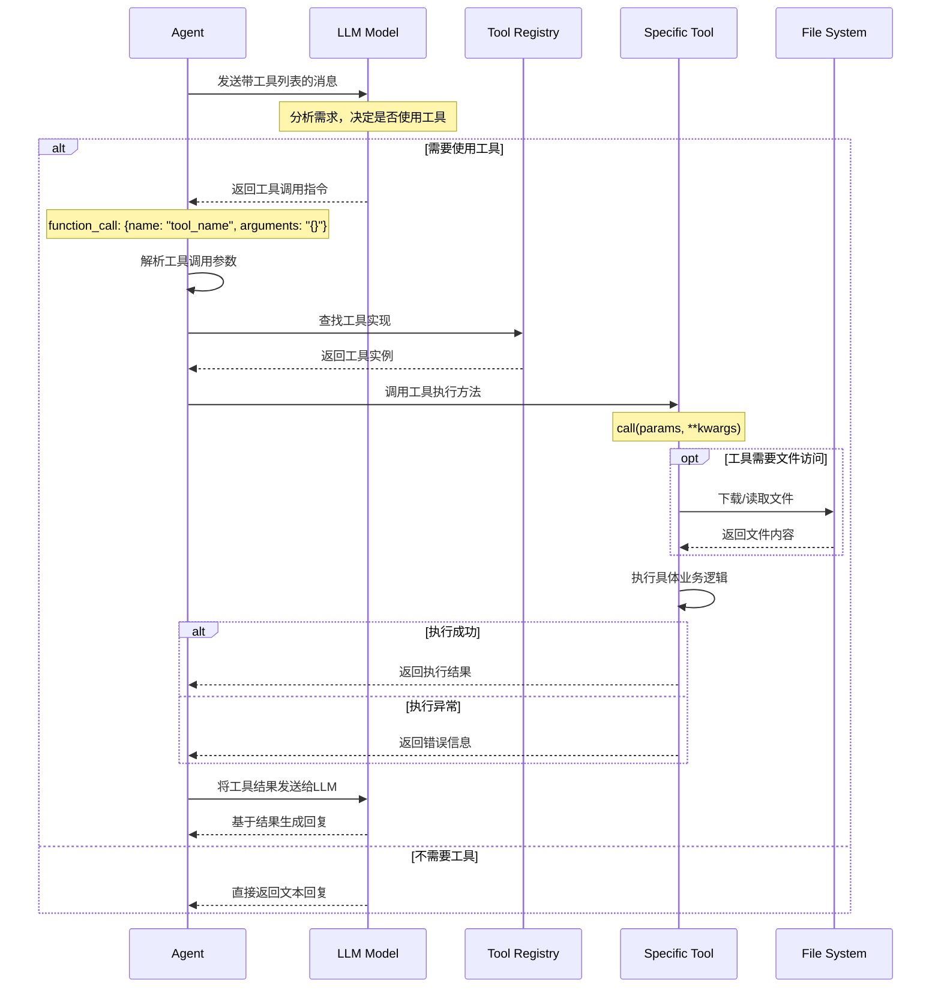
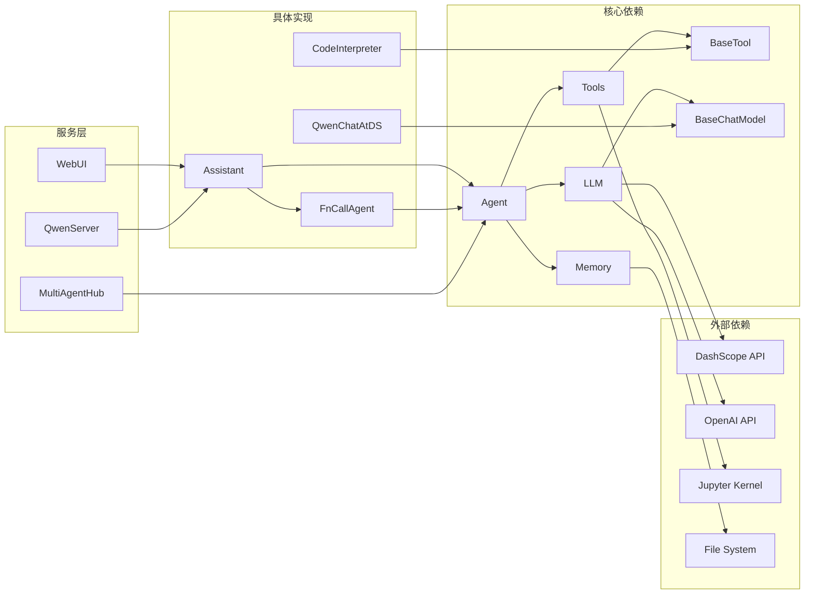

## 📝 概述

Qwen-Agent框架采用分层架构设计，从底层的模型服务到顶层的用户交互，形成了完整的Agent应用开发生态。本文档详细分析框架的整体架构设计，包括系统层次结构、组件关系、数据流转等核心内容。

## 🏗️ 系统架构层次

### 整体架构图

```mermaid
graph TB
    subgraph "用户交互层 (User Interface Layer)"
        A[Web UI] --> A1[Gradio界面]
        B[CLI Interface] --> B1[命令行工具]
        C[API Gateway] --> C1[REST API]
        D[Browser Extension] --> D1[浏览器插件]
    end
    
    subgraph "应用服务层 (Application Service Layer)"
        E[Qwen Server] --> E1[Assistant Server]
        E --> E2[Workstation Server] 
        E --> E3[Database Server]
        F[Multi-Agent Hub] --> F1[协作管理]
        F --> F2[消息路由]
    end
    
    subgraph "Agent核心层 (Agent Core Layer)"
        G[Agent Base] --> G1[BasicAgent<br/>基础代理]
        G --> G2[FnCallAgent<br/>函数调用代理]
        G --> G3[Assistant<br/>通用助手]
        G --> G4[ReActChat<br/>推理行动代理]
        G --> G5[GroupChat<br/>群聊代理]
        
        H[Specialized Agents] --> H1[DocQAAgent<br/>文档问答]
        H --> H2[WriteFromScratch<br/>写作代理]
        H --> H3[TIRMathAgent<br/>数学推理]
        H --> H4[Router<br/>路由代理]
    end
    
    subgraph "能力增强层 (Capability Enhancement Layer)"
        I[Memory System] --> I1[文件管理]
        I --> I2[RAG检索]
        I --> I3[对话记忆]
        
        J[Tool System] --> J1[Built-in Tools<br/>内置工具]
        J --> J2[Custom Tools<br/>自定义工具]
        J --> J3[MCP Tools<br/>MCP工具]
    end
    
    subgraph "模型服务层 (Model Service Layer)"
        K[LLM Abstraction] --> K1[BaseChatModel<br/>基础聊天模型]
        
        L[Model Implementations] --> L1[QwenChatAtDS<br/>DashScope服务]
        L --> L2[TextChatAtOAI<br/>OpenAI兼容]
        L --> L3[QwenVLChatAtDS<br/>视觉语言模型]
        L --> L4[QwenAudioChatAtDS<br/>音频模型]
        L --> L5[Transformers<br/>本地模型]
        L --> L6[OpenVINO<br/>推理加速]
    end
    
    subgraph "基础设施层 (Infrastructure Layer)"
        M[Configuration] --> M1[模型配置]
        M --> M2[工具配置]
        M --> M3[系统设置]
        
        N[Storage] --> N1[本地存储]
        N --> N2[文件缓存]
        N --> N3[数据库]
        
        O[Logging & Monitoring] --> O1[日志系统]
        O --> O2[性能监控]
        O --> O3[错误追踪]
    end
    
    %% 连接关系
    A --> E
    B --> E
    C --> E
    D --> E
    
    E --> F
    E --> G
    F --> G
    
    G --> I
    G --> J
    G --> K
    
    I --> N
    J --> N
    K --> L
    L --> M
    
    I --> O
    J --> O
    K --> O
    
    %% 样式定义
    classDef uiLayer fill:#e1f5fe
    classDef serviceLayer fill:#f3e5f5  
    classDef coreLayer fill:#e8f5e8
    classDef enhancementLayer fill:#fff3e0
    classDef modelLayer fill:#fce4ec
    classDef infraLayer fill:#f1f8e9
    
    class A,B,C,D,A1,B1,C1,D1 uiLayer
    class E,F,E1,E2,E3,F1,F2 serviceLayer
    class G,H,G1,G2,G3,G4,G5,H1,H2,H3,H4 coreLayer
    class I,J,I1,I2,I3,J1,J2,J3 enhancementLayer
    class K,L,K1,L1,L2,L3,L4,L5,L6 modelLayer
    class M,N,O,M1,M2,M3,N1,N2,N3,O1,O2,O3 infraLayer
```



### 架构层次说明

#### 1. 用户交互层 (User Interface Layer)
**职责**: 提供多种用户交互方式，包括Web界面、命令行、API等
- **Web UI**: 基于Gradio的Web交互界面
- **CLI Interface**: 命令行交互工具  
- **API Gateway**: RESTful API服务接口
- **Browser Extension**: 浏览器扩展插件

#### 2. 应用服务层 (Application Service Layer) 
**职责**: 提供高层应用服务和多Agent协作管理
- **Qwen Server**: 核心服务器组件，包含助手服务、工作站服务、数据库服务
- **Multi-Agent Hub**: 多智能体协作中心，负责Agent间的协调和消息路由

#### 3. Agent核心层 (Agent Core Layer)
**职责**: 实现各种类型的智能代理，是框架的核心抽象层
- **Agent Base**: 代理基类，定义统一接口
- **Specialized Agents**: 各种专门化的代理实现

#### 4. 能力增强层 (Capability Enhancement Layer)
**职责**: 为Agent提供增强能力，包括记忆、工具使用等
- **Memory System**: 内存管理系统
- **Tool System**: 工具调用系统

#### 5. 模型服务层 (Model Service Layer)
**职责**: 提供大语言模型的统一抽象和多种实现
- **LLM Abstraction**: 模型抽象层
- **Model Implementations**: 具体模型服务实现

#### 6. 基础设施层 (Infrastructure Layer)
**职责**: 提供系统运行的基础支撑服务
- **Configuration**: 配置管理
- **Storage**: 存储服务
- **Logging & Monitoring**: 日志和监控

## 🔄 核心组件交互图

### Agent创建与初始化流程



### 消息处理完整流程

```mermaid
sequenceDiagram
    participant U as User
    participant A as Agent
    participant L as LLM
    participant T as Tool
    participant M as Memory
    
    U->>A: 发送用户消息
    Note over A: 消息预处理
    
    A->>A: 添加系统消息
    A->>A: 检测消息语言
    
    opt 如果需要检索
        A->>M: 查询相关文档
        M->>M: RAG检索处理
        M-->>A: 返回相关内容
        A->>A: 将检索结果添加到上下文
    end
    
    A->>L: 调用LLM推理
    L->>L: 生成回复内容
    
    opt 如果需要工具调用
        L-->>A: 返回工具调用指令
        A->>A: 解析工具调用参数
        A->>T: 执行工具调用
        T->>T: 执行具体工具逻辑
        T-->>A: 返回工具执行结果
        A->>L: 将结果发送给LLM
        L-->>A: 基于结果生成最终回复
    else 直接回复
        L-->>A: 返回文本回复
    end
    
    A->>A: 后处理回复内容
    A-->>U: 返回最终回复
```

### 工具调用详细时序图



## 🎯 设计原则与模式

### 1. 分层架构 (Layered Architecture)
- **优点**: 职责清晰，易于维护和扩展
- **实现**: 通过抽象基类定义层次接口
- **示例**: `Agent` -> `FnCallAgent` -> `Assistant` 的继承层次

### 2. 策略模式 (Strategy Pattern)
- **应用场景**: LLM模型选择、工具调用策略
- **核心实现**: `get_chat_model()` 函数根据配置选择合适的模型实现

```python
def get_chat_model(cfg: Union[dict, str]) -> BaseChatModel:
    """LLM模型工厂方法，根据配置自动选择合适的模型实现"""
    if 'model_type' in cfg:
        model_type = cfg['model_type']
        return LLM_REGISTRY[model_type](cfg)  # 策略选择
    
    # 根据模型名称自动推断类型
    model = cfg.get('model', '')
    if '-vl' in model.lower():
        return QwenVLChatAtDS(cfg)
    elif 'qwen' in model.lower():  
        return QwenChatAtDS(cfg)
```

### 3. 注册器模式 (Registry Pattern)
- **应用场景**: 工具注册、模型注册
- **核心实现**: `TOOL_REGISTRY`、`LLM_REGISTRY` 全局注册表

```python
# 工具注册装饰器
@register_tool('weather_query')
class WeatherTool(BaseTool):
    """工具会自动注册到TOOL_REGISTRY中"""
    pass

# LLM模型注册
@register_llm('qwen_dashscope')
class QwenChatAtDS(BaseChatModel):
    """模型会自动注册到LLM_REGISTRY中"""
    pass
```

### 4. 观察者模式 (Observer Pattern)
- **应用场景**: 流式输出、消息监听
- **核心实现**: Generator机制实现流式响应

```python
def _run(self, messages: List[Message]) -> Iterator[List[Message]]:
    """Agent运行时采用生成器模式，支持流式输出"""
    for response in self.llm.chat(messages, stream=True):
        yield response  # 流式返回，观察者可以实时监听
```

### 5. 模板方法模式 (Template Method Pattern)
- **应用场景**: Agent基类定义统一流程
- **核心实现**: `Agent.run()` 定义标准流程，子类实现 `_run()`

```python
class Agent(ABC):
    def run(self, messages):
        """模板方法：定义标准的消息处理流程"""
        # 1. 消息预处理
        messages = self._preprocess_messages(messages)
        
        # 2. 调用子类具体实现
        for response in self._run(messages):
            yield response
    
    @abstractmethod  
    def _run(self, messages):
        """抽象方法：子类必须实现具体的处理逻辑"""
        raise NotImplementedError
```

## 🔗 模块间依赖关系

### 依赖关系图



### 依赖分析

#### 强依赖关系
1. **Agent -> LLM**: 每个Agent都必须有LLM支持
2. **FnCallAgent -> Tools**: 函数调用型Agent必须依赖工具系统
3. **Assistant -> Memory**: 助手型Agent需要内存管理支持

#### 弱依赖关系  
1. **Agent -> GUI**: Agent可独立运行，GUI仅是可选的交互方式
2. **Tools -> External APIs**: 工具可以选择性地依赖外部服务
3. **Memory -> Storage**: 内存系统可以选择不同的存储后端

#### 循环依赖避免
- 通过抽象接口打破循环依赖
- 使用依赖注入而非硬编码依赖
- 延迟导入避免初始化时的循环引用

## 📊 性能与扩展性考虑

### 性能优化设计

#### 1. 流式处理
```python
# 流式输出避免内存积累
def chat_stream(self, messages):
    for chunk in self._generate_stream():
        yield chunk  # 逐块返回，减少内存占用
```

#### 2. 缓存机制
```python
class BaseChatModel:
    def __init__(self, cfg):
        # 响应缓存，避免重复计算
        self.cache = diskcache.Cache(directory=cache_dir)
    
    def chat(self, messages):
        cache_key = self._generate_cache_key(messages)
        if cached_result := self.cache.get(cache_key):
            return cached_result
```

#### 3. 异步处理
```python
# 工具并行执行（在实现中考虑）
async def parallel_tool_execution(tools, params):
    tasks = [tool.call_async(param) for tool, param in zip(tools, params)]
    return await asyncio.gather(*tasks)
```

### 扩展性设计

#### 1. 插件化架构
- **工具插件**: 通过注册机制轻松添加新工具
- **模型插件**: 支持新的LLM服务提供商
- **Agent插件**: 可以开发专用领域的Agent

#### 2. 配置驱动
```python
# 配置文件驱动行为，无需修改代码
llm_cfg = {
    'model_type': 'custom_provider',  # 支持自定义提供商
    'custom_params': {...}  # 自定义参数
}
```

#### 3. 微服务架构支持
- **服务拆分**: 可将不同组件部署为独立服务
- **API标准化**: 统一的REST API接口
- **负载均衡**: 支持多实例部署

## 🎨 架构特点总结

### 优势
1. **模块化程度高**: 各层职责清晰，便于独立开发和测试
2. **扩展性强**: 支持多种类型的Agent、工具和模型
3. **可配置性好**: 通过配置文件控制行为，灵活适应不同场景
4. **多模态支持**: 原生支持文本、图像、音频等多种输入输出

### 设计亮点
1. **统一抽象**: 通过基类定义统一接口，屏蔽底层差异
2. **流式处理**: 支持实时响应，提升用户体验
3. **错误处理**: 完善的异常处理和重试机制
4. **工具生态**: 丰富的内置工具和便捷的自定义工具开发

### 改进空间
1. **性能优化**: 可考虑增加更多的并行处理和缓存策略
2. **监控告警**: 可增加更完善的系统监控和告警机制  
3. **安全加固**: 可加强工具执行的沙箱隔离和权限控制
4. **测试覆盖**: 可提高自动化测试的覆盖率

---

*本架构设计文档基于Qwen-Agent v0.0.30版本，随着版本更新可能会有所调整。*
