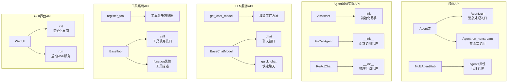
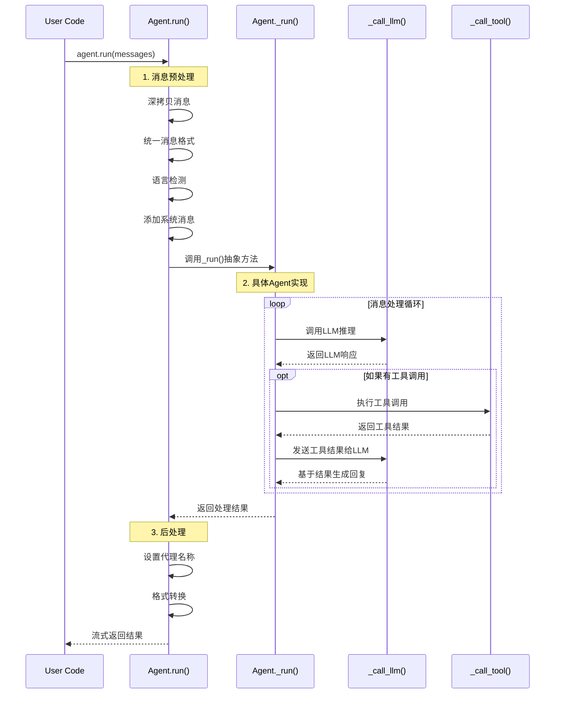
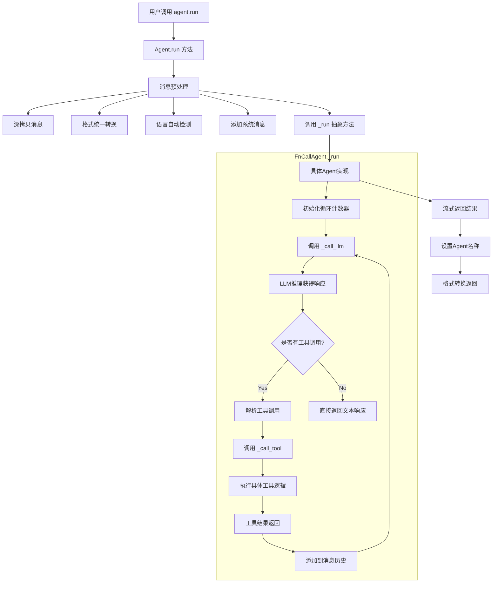
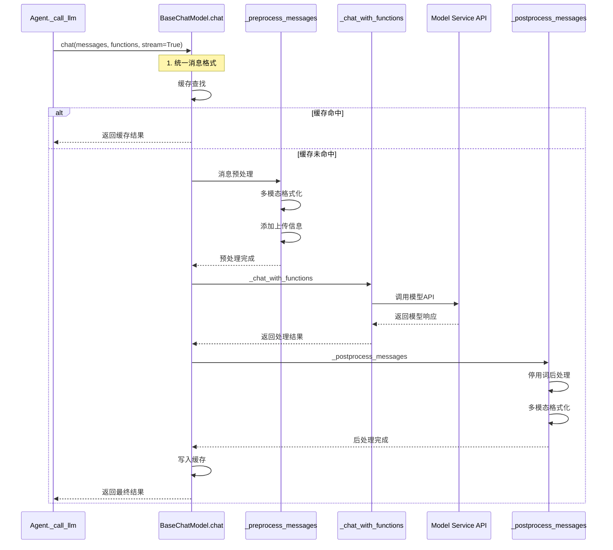
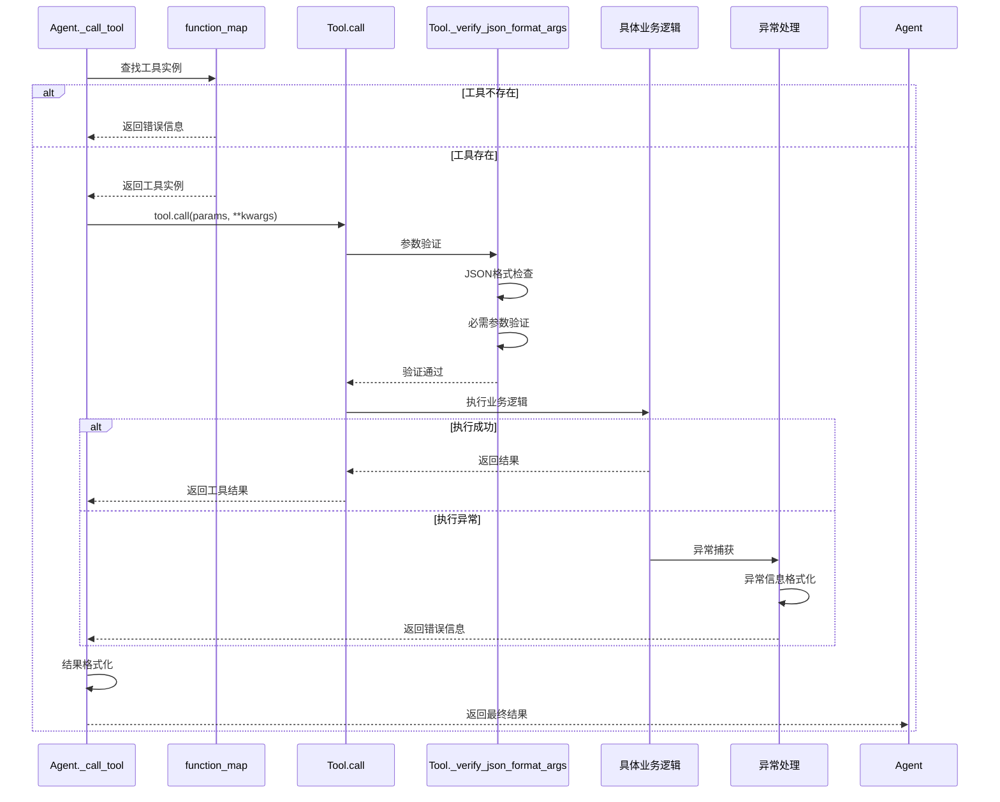

## 📝 概述

Qwen-Agent框架对外暴露了清晰简洁的API接口，使得开发者可以轻松构建各种类型的AI代理应用。本文档深入分析框架的核心API设计、调用链路和关键函数实现。

## 🚀 对外核心API概览

### 1. 框架入口API

```python
# 主要导入接口
from qwen_agent import Agent, MultiAgentHub
from qwen_agent.agents import Assistant, FnCallAgent, ReActChat
from qwen_agent.llm import get_chat_model
from qwen_agent.tools import register_tool, BaseTool
from qwen_agent.gui import WebUI
```

### API分类图



## 🔍 核心API详细分析

### 1. Agent基类API

#### 1.1 Agent.run() - 主要消息处理入口

**函数签名**:
```python
def run(self, messages: List[Union[Dict, Message]], **kwargs) -> Union[Iterator[List[Message]], Iterator[List[Dict]]]:
    """返回基于接收消息的响应生成器
    
    Args:
        messages: 消息列表，支持字典或Message对象
        **kwargs: 额外参数，如lang等
        
    Yields:
        响应生成器，支持流式输出
    """
```

**完整源码分析**:
```python
def run(self, messages: List[Union[Dict, Message]], **kwargs) -> Union[Iterator[List[Message]], Iterator[List[Dict]]]:
    """Agent运行的主入口方法，负责消息预处理和类型转换"""
    
    # 1. 深拷贝消息，避免修改原始数据
    messages = copy.deepcopy(messages)
    _return_message_type = 'dict'
    new_messages = []
    
    # 2. 统一消息格式转换
    if not messages:
        _return_message_type = 'message'
    for msg in messages:
        if isinstance(msg, dict):
            new_messages.append(Message(**msg))  # 字典转Message对象
        else:
            new_messages.append(msg)
            _return_message_type = 'message'
    
    # 3. 自动语言检测
    if 'lang' not in kwargs:
        if has_chinese_messages(new_messages):
            kwargs['lang'] = 'zh'  # 检测到中文设置为中文
        else:
            kwargs['lang'] = 'en'  # 默认英文
    
    # 4. 添加系统消息
    if self.system_message:
        if not new_messages or new_messages[0][ROLE] != SYSTEM:
            # 如果没有系统消息，则添加
            new_messages.insert(0, Message(role=SYSTEM, content=self.system_message))
        else:
            # 如果已有系统消息，则合并
            if isinstance(new_messages[0][CONTENT], str):
                new_messages[0][CONTENT] = self.system_message + '\n\n' + new_messages[0][CONTENT]
            else:
                # 处理多模态内容
                assert isinstance(new_messages[0][CONTENT], list)
                new_messages[0][CONTENT] = [ContentItem(text=self.system_message + '\n\n')] + new_messages[0][CONTENT]
    
    # 5. 调用具体实现的_run方法
    for rsp in self._run(messages=new_messages, **kwargs):
        # 设置代理名称
        for i in range(len(rsp)):
            if not rsp[i].name and self.name:
                rsp[i].name = self.name
        
        # 6. 根据输入类型返回相应格式
        if _return_message_type == 'message':
            yield [Message(**x) if isinstance(x, dict) else x for x in rsp]
        else:
            yield [x.model_dump() if not isinstance(x, dict) else x for x in rsp]
```

**调用链路分析**:



#### 1.2 Agent._call_llm() - LLM调用接口

**函数签名**:
```python
def _call_llm(
    self,
    messages: List[Message],
    functions: Optional[List[Dict]] = None,
    stream: bool = True,
    extra_generate_cfg: Optional[dict] = None,
) -> Iterator[List[Message]]:
```

**源码实现**:
```python
def _call_llm(self, messages: List[Message], functions: Optional[List[Dict]] = None, 
              stream: bool = True, extra_generate_cfg: Optional[dict] = None) -> Iterator[List[Message]]:
    """Agent调用LLM的统一接口
    
    功能说明:
    1. 将Agent的系统消息前置到消息列表
    2. 调用LLM的chat方法进行推理
    3. 合并生成配置参数
    
    参数说明:
    - messages: 输入消息列表
    - functions: 提供给LLM的函数列表（用于函数调用）
    - stream: 是否使用流式输出，默认为True保证一致性
    - extra_generate_cfg: 额外的生成配置参数
    """
    return self.llm.chat(
        messages=messages,
        functions=functions, 
        stream=stream,
        extra_generate_cfg=merge_generate_cfgs(
            base_generate_cfg=self.extra_generate_cfg,  # Agent级别配置
            new_generate_cfg=extra_generate_cfg,        # 调用时配置
        )
    )
```

#### 1.3 Agent._call_tool() - 工具调用接口

**源码实现**:
```python  
def _call_tool(self, tool_name: str, tool_args: Union[str, dict] = '{}', **kwargs) -> Union[str, List[ContentItem]]:
    """Agent调用工具的统一接口
    
    功能说明:
    1. 验证工具是否存在
    2. 调用具体工具实现
    3. 统一异常处理和错误返回
    
    参数说明:
    - tool_name: 工具名称
    - tool_args: 模型生成或用户提供的工具参数
    - **kwargs: 传递给工具的额外参数
    """
    # 1. 工具存在性检查
    if tool_name not in self.function_map:
        return f'Tool {tool_name} does not exists.'
    
    tool = self.function_map[tool_name]
    
    try:
        # 2. 调用工具执行方法
        tool_result = tool.call(tool_args, **kwargs)
    except (ToolServiceError, DocParserError) as ex:
        # 3. 专门的工具服务异常，直接抛出
        raise ex
    except Exception as ex:
        # 4. 其他异常的统一处理
        exception_type = type(ex).__name__
        exception_message = str(ex)
        traceback_info = ''.join(traceback.format_tb(ex.__traceback__))
        error_message = f'An error occurred when calling tool `{tool_name}`:\n' \
                       f'{exception_type}: {exception_message}\n' \
                       f'Traceback:\n{traceback_info}'
        logger.warning(error_message)
        return error_message
    
    # 5. 结果格式化处理
    if isinstance(tool_result, str):
        return tool_result
    elif isinstance(tool_result, list) and all(isinstance(item, ContentItem) for item in tool_result):
        return tool_result  # 多模态工具结果
    else:
        return json.dumps(tool_result, ensure_ascii=False, indent=4)
```

### 2. LLM服务API

#### 2.1 get_chat_model() - 模型工厂方法

**函数签名**:
```python
def get_chat_model(cfg: Union[dict, str] = 'qwen-plus') -> BaseChatModel:
```

**完整源码分析**:
```python
def get_chat_model(cfg: Union[dict, str] = 'qwen-plus') -> BaseChatModel:
    """LLM对象实例化的统一接口
    
    这个方法是框架的核心工厂方法，负责根据配置创建合适的LLM实例
    支持多种配置方式和自动类型推断
    """
    # 1. 配置标准化
    if isinstance(cfg, str):
        cfg = {'model': cfg}  # 字符串转换为字典配置
    
    # 2. 显式模型类型指定
    if 'model_type' in cfg:
        model_type = cfg['model_type']
        if model_type in LLM_REGISTRY:
            # 特殊处理：DashScope兼容模式
            if model_type in ('oai', 'qwenvl_oai'):
                if cfg.get('model_server', '').strip() == 'dashscope':
                    cfg = copy.deepcopy(cfg)
                    cfg['model_server'] = 'https://dashscope.aliyuncs.com/compatible-mode/v1'
            return LLM_REGISTRY[model_type](cfg)
        else:
            raise ValueError(f'Please set model_type from {str(LLM_REGISTRY.keys())}')
    
    # 3. 自动类型推断
    # Azure服务检测
    if 'azure_endpoint' in cfg:
        model_type = 'azure'
        cfg['model_type'] = model_type
        return LLM_REGISTRY[model_type](cfg)
    
    # OpenAI兼容服务检测
    if 'model_server' in cfg:
        if cfg['model_server'].strip().startswith('http'):
            model_type = 'oai'
            cfg['model_type'] = model_type  
            return LLM_REGISTRY[model_type](cfg)
    
    # 基于模型名称推断
    model = cfg.get('model', '')
    
    if '-vl' in model.lower():
        # 视觉语言模型
        model_type = 'qwenvl_dashscope'
        cfg['model_type'] = model_type
        return LLM_REGISTRY[model_type](cfg)
    
    if '-audio' in model.lower():
        # 音频模型
        model_type = 'qwenaudio_dashscope'  
        cfg['model_type'] = model_type
        return LLM_REGISTRY[model_type](cfg)
    
    if 'qwen' in model.lower():
        # Qwen系列模型
        model_type = 'qwen_dashscope'
        cfg['model_type'] = model_type
        return LLM_REGISTRY[model_type](cfg)
    
    # 4. 无法推断则抛出异常
    raise ValueError(f'Invalid model cfg: {cfg}')
```

#### 2.2 BaseChatModel.chat() - 核心聊天接口

**函数签名**:
```python
def chat(
    self,
    messages: List[Union[Message, Dict]],
    functions: Optional[List[Dict]] = None,
    stream: bool = True,
    delta_stream: bool = False,
    extra_generate_cfg: Optional[Dict] = None,
) -> Union[List[Message], List[Dict], Iterator[List[Message]], Iterator[List[Dict]]]:
```

**关键实现逻辑**:
```python
def chat(self, messages, functions=None, stream=True, delta_stream=False, extra_generate_cfg=None):
    """LLM聊天的核心接口，处理所有LLM交互逻辑"""
    
    # 1. 输入消息统一化
    messages = copy.deepcopy(messages)
    _return_message_type = 'dict'
    new_messages = []
    for msg in messages:
        if isinstance(msg, dict):
            new_messages.append(Message(**msg))
        else:
            new_messages.append(msg)
            _return_message_type = 'message'
    messages = new_messages
    
    # 2. 缓存查找 
    if self.cache is not None:
        cache_key = dict(messages=messages, functions=functions, extra_generate_cfg=extra_generate_cfg)
        cache_key: str = json_dumps_compact(cache_key, sort_keys=True)
        cache_value: str = self.cache.get(cache_key)
        if cache_value:
            # 缓存命中，直接返回
            cache_value: List[dict] = json.loads(cache_value)
            if _return_message_type == 'message':
                cache_value: List[Message] = [Message(**m) for m in cache_value]
            if stream:
                cache_value: Iterator = iter([cache_value])
            return cache_value
    
    # 3. 生成配置合并
    generate_cfg = merge_generate_cfgs(base_generate_cfg=self.generate_cfg, new_generate_cfg=extra_generate_cfg)
    
    # 4. 随机种子设置
    if 'seed' not in generate_cfg:
        generate_cfg['seed'] = random.randint(a=0, b=2**30)
    
    # 5. 语言检测
    if 'lang' in generate_cfg:
        lang: Literal['en', 'zh'] = generate_cfg.pop('lang')
    else:
        lang: Literal['en', 'zh'] = 'zh' if has_chinese_messages(messages) else 'en'
    
    # 6. 系统消息添加
    if DEFAULT_SYSTEM_MESSAGE and messages[0].role != SYSTEM:
        messages = [Message(role=SYSTEM, content=DEFAULT_SYSTEM_MESSAGE)] + messages
    
    # 7. 输入长度截断
    max_input_tokens = generate_cfg.pop('max_input_tokens', DEFAULT_MAX_INPUT_TOKENS)
    if max_input_tokens > 0:
        messages = _truncate_input_messages_roughly(messages=messages, max_tokens=max_input_tokens)
    
    # 8. 函数调用模式检测
    if functions:
        fncall_mode = True
    else:
        fncall_mode = False
    
    # 9. 消息预处理
    messages = self._preprocess_messages(messages, lang=lang, generate_cfg=generate_cfg, functions=functions, use_raw_api=self.use_raw_api)
    
    if not self.support_multimodal_input:
        messages = [format_as_text_message(msg, add_upload_info=False) for msg in messages]
    
    # 10. 原生API模式
    if self.use_raw_api:
        logger.debug('`use_raw_api` takes effect.')
        assert stream and (not delta_stream), '`use_raw_api` only support full stream!!!'
        return self.raw_chat(messages=messages, functions=functions, stream=stream, generate_cfg=generate_cfg)
    
    # 11. 模型服务调用
    def _call_model_service():
        if fncall_mode:
            return self._chat_with_functions(messages=messages, functions=functions, stream=stream, delta_stream=delta_stream, generate_cfg=generate_cfg, lang=lang)
        else:
            if messages[-1].role == ASSISTANT:
                # 续写模式
                return self._continue_assistant_response(messages, generate_cfg=generate_cfg, stream=stream)
            else:
                return self._chat(messages, stream=stream, delta_stream=delta_stream, generate_cfg=generate_cfg)
    
    # 12. 重试机制
    if stream and delta_stream:
        output = _call_model_service()  # 增量流式无重试
    elif stream and (not delta_stream):
        output = retry_model_service_iterator(_call_model_service, max_retries=self.max_retries)
    else:
        output = retry_model_service(_call_model_service, max_retries=self.max_retries)
    
    # 13. 结果后处理和缓存
    if isinstance(output, list):
        output = self._postprocess_messages(output, fncall_mode=fncall_mode, generate_cfg=generate_cfg)
        if not self.support_multimodal_output:
            output = _format_as_text_messages(messages=output)
        if self.cache:
            self.cache.set(cache_key, json_dumps_compact(output))
        return self._convert_messages_to_target_type(output, _return_message_type)
    else:
        # 流式后处理
        output = self._postprocess_messages_iterator(output, fncall_mode=fncall_mode, generate_cfg=generate_cfg)
        # ... 流式缓存逻辑
        return self._convert_messages_iterator_to_target_type(_format_and_cache(), _return_message_type)
```

### 3. 工具系统API

#### 3.1 register_tool() - 工具注册装饰器

**源码实现**:
```python
def register_tool(name, allow_overwrite=False):
    """工具注册装饰器，实现工具的自动注册机制
    
    参数说明:
    - name: 工具名称，必须唯一
    - allow_overwrite: 是否允许覆盖已存在的工具
    """
    def decorator(cls):
        # 1. 重复注册检查
        if name in TOOL_REGISTRY:
            if allow_overwrite:
                logger.warning(f'Tool `{name}` already exists! Overwriting with class {cls}.')
            else:
                raise ValueError(f'Tool `{name}` already exists! Please ensure that the tool name is unique.')
        
        # 2. 名称一致性检查
        if cls.name and (cls.name != name):
            raise ValueError(f'{cls.__name__}.name="{cls.name}" conflicts with @register_tool(name="{name}").')
        
        # 3. 设置工具名称并注册
        cls.name = name
        TOOL_REGISTRY[name] = cls
        
        return cls
    
    return decorator
```

**使用示例**:
```python
@register_tool('weather_query')  
class WeatherTool(BaseTool):
    """天气查询工具"""
    description = '查询指定城市的天气信息'
    parameters = [{
        'name': 'city',
        'type': 'string',
        'description': '城市名称', 
        'required': True
    }]
    
    def call(self, params: str, **kwargs) -> str:
        """工具调用实现
        
        这个方法会被Agent通过_call_tool()调用
        参数会经过_verify_json_format_args()验证
        """
        # 参数解析和验证
        params_json = self._verify_json_format_args(params)
        city = params_json['city']
        
        # 具体业务逻辑
        weather_info = self._query_weather_api(city)
        
        return f"{city}的天气：{weather_info}"
```

### 4. GUI界面API

#### 4.1 WebUI类初始化

**源码分析**:
```python  
class WebUI:
    def __init__(self, agent: Union[Agent, MultiAgentHub, List[Agent]], chatbot_config: Optional[dict] = None):
        """WebUI初始化方法
        
        功能说明:
        1. 支持单Agent、多Agent Hub、Agent列表等多种输入
        2. 配置用户和Agent的显示信息
        3. 设置界面交互参数
        """
        chatbot_config = chatbot_config or {}
        
        # 1. Agent统一化处理
        if isinstance(agent, MultiAgentHub):
            self.agent_list = [agent for agent in agent.nonuser_agents]  # 排除用户代理
            self.agent_hub = agent
        elif isinstance(agent, list):
            self.agent_list = agent
            self.agent_hub = None
        else:
            self.agent_list = [agent]  # 单Agent包装为列表
            self.agent_hub = None
        
        # 2. 用户配置
        user_name = chatbot_config.get('user.name', 'user')
        self.user_config = {
            'name': user_name,
            'avatar': chatbot_config.get('user.avatar', get_avatar_image(user_name)),
        }
        
        # 3. Agent配置列表
        self.agent_config_list = [{
            'name': agent.name,
            'avatar': chatbot_config.get('agent.avatar', get_avatar_image(agent.name)),
            'description': agent.description or "I'm a helpful assistant.",
        } for agent in self.agent_list]
        
        # 4. 界面参数配置
        self.input_placeholder = chatbot_config.get('input.placeholder', '跟我聊聊吧～')
        self.prompt_suggestions = chatbot_config.get('prompt.suggestions', [])
        self.verbose = chatbot_config.get('verbose', False)
```

## 🔗 API调用链路深度分析

### 完整的消息处理调用链



### LLM调用的详细链路



### 工具调用的完整链路



## 📋 API使用最佳实践

### 1. Agent初始化最佳实践

```python
# ✅ 推荐的Agent初始化方式
def create_assistant():
    """创建Assistant的最佳实践"""
    
    # 1. 明确的LLM配置
    llm_cfg = {
        'model': 'qwen3-235b-a22b',
        'model_type': 'qwen_dashscope',
        'generate_cfg': {
            'top_p': 0.8,
            'max_input_tokens': 6000,  # 明确设置输入长度限制
            'max_retries': 3,          # 设置重试次数
        }
    }
    
    # 2. 工具列表配置
    tools = [
        'code_interpreter',  # 内置工具使用字符串
        {                    # 工具配置使用字典
            'name': 'web_search',
            'timeout': 30
        },
        CustomTool()         # 自定义工具实例
    ]
    
    # 3. 系统消息配置
    system_msg = '''你是一个专业的AI助手，具备以下能力：
    1. 代码编写和执行
    2. 网络搜索和信息检索
    3. 多轮对话和上下文理解
    
    请始终保持专业、准确、有帮助的回复风格。'''
    
    # 4. 创建Assistant实例
    agent = Assistant(
        llm=llm_cfg,
        function_list=tools,
        system_message=system_msg,
        name='专业助手',
        description='一个具备代码执行和搜索能力的AI助手'
    )
    
    return agent
```

### 2. 消息处理最佳实践

```python
# ✅ 推荐的消息处理方式
def chat_with_agent(agent, user_input: str, history: List[dict] = None):
    """与Agent对话的最佳实践"""
    
    # 1. 构建消息历史
    messages = history or []
    messages.append({'role': 'user', 'content': user_input})
    
    try:
        # 2. 流式处理响应
        response_text = ""
        for response in agent.run(messages=messages):
            if response:
                # 实时更新响应内容
                response_text = response[-1].get('content', '')
                print(f"\r{response_text}", end='', flush=True)
        
        # 3. 更新历史记录
        messages.extend(response)
        print()  # 换行
        
        return response_text, messages
        
    except Exception as e:
        logger.error(f"Agent执行异常: {e}")
        return f"抱歉，处理请求时出现错误: {str(e)}", messages
```

### 3. 工具开发最佳实践

```python
# ✅ 推荐的工具开发模式
@register_tool('file_analyzer')
class FileAnalyzerTool(BaseTool):
    """文件分析工具 - 最佳实践示例"""
    
    description = '分析文件内容并提取关键信息'
    parameters = {
        'type': 'object',
        'properties': {
            'file_path': {
                'type': 'string',
                'description': '要分析的文件路径'
            },
            'analysis_type': {
                'type': 'string', 
                'enum': ['summary', 'keywords', 'structure'],
                'description': '分析类型：摘要、关键词或结构分析'
            }
        },
        'required': ['file_path', 'analysis_type']
    }
    
    def call(self, params: str, **kwargs) -> str:
        """工具调用实现
        
        Args:
            params: JSON格式参数字符串
            **kwargs: 额外参数，可能包含messages等上下文信息
            
        Returns:
            str: 分析结果
        """
        try:
            # 1. 参数验证和解析
            params_dict = self._verify_json_format_args(params)
            file_path = params_dict['file_path']
            analysis_type = params_dict['analysis_type']
            
            # 2. 输入合法性检查  
            if not os.path.exists(file_path):
                return f"错误：文件 {file_path} 不存在"
            
            # 3. 文件安全检查
            if not self._is_safe_file(file_path):
                return f"错误：不支持的文件类型或文件过大"
            
            # 4. 执行具体分析逻辑
            if analysis_type == 'summary':
                result = self._generate_summary(file_path)
            elif analysis_type == 'keywords':
                result = self._extract_keywords(file_path)
            elif analysis_type == 'structure':
                result = self._analyze_structure(file_path)
            
            return f"文件分析结果：\n{result}"
            
        except Exception as e:
            # 5. 异常处理和日志记录
            logger.error(f"文件分析工具执行异常: {e}")
            return f"文件分析失败: {str(e)}"
    
    def _is_safe_file(self, file_path: str) -> bool:
        """文件安全检查"""
        # 检查文件大小（限制10MB）
        if os.path.getsize(file_path) > 10 * 1024 * 1024:
            return False
        
        # 检查文件类型
        allowed_extensions = {'.txt', '.md', '.py', '.js', '.json', '.csv'}
        _, ext = os.path.splitext(file_path.lower())
        return ext in allowed_extensions
    
    def _generate_summary(self, file_path: str) -> str:
        """生成文件摘要"""
        # 具体实现逻辑
        pass
```

## 📊 API性能与监控

### 性能监控装饰器

```python
import time
import functools
from qwen_agent.log import logger

def monitor_api_performance(func):
    """API性能监控装饰器"""
    @functools.wraps(func)
    def wrapper(*args, **kwargs):
        start_time = time.time()
        try:
            result = func(*args, **kwargs)
            execution_time = time.time() - start_time
            logger.info(f"{func.__name__} 执行时间: {execution_time:.2f}秒")
            return result
        except Exception as e:
            execution_time = time.time() - start_time
            logger.error(f"{func.__name__} 执行失败 ({execution_time:.2f}秒): {e}")
            raise
    return wrapper

# 使用示例
@monitor_api_performance  
def monitored_agent_run(agent, messages):
    return list(agent.run(messages))
```

### API使用统计

```python
class APIUsageTracker:
    """API使用统计跟踪器"""
    
    def __init__(self):
        self.stats = {
            'agent_calls': 0,
            'llm_calls': 0, 
            'tool_calls': 0,
            'errors': 0
        }
    
    def track_agent_call(self):
        self.stats['agent_calls'] += 1
    
    def track_llm_call(self):
        self.stats['llm_calls'] += 1
        
    def track_tool_call(self):
        self.stats['tool_calls'] += 1
        
    def track_error(self):
        self.stats['errors'] += 1
    
    def get_stats(self):
        return self.stats.copy()

# 全局实例
usage_tracker = APIUsageTracker()
```

## 🎯 总结

Qwen-Agent框架的API设计体现了以下特点：

### 设计优势
1. **统一抽象**: 通过基类定义统一接口，简化使用复杂度
2. **灵活配置**: 支持多种配置方式，适应不同使用场景
3. **流式处理**: 原生支持流式输出，提供良好的用户体验
4. **错误处理**: 完善的异常处理和重试机制
5. **扩展性强**: 支持自定义Agent、工具和模型

### 关键调用链路
1. **Agent.run()** → **_run()** → **_call_llm()** → **BaseChatModel.chat()**
2. **工具调用**: **_detect_tool()** → **_call_tool()** → **tool.call()**
3. **消息处理**: **预处理** → **LLM推理** → **后处理** → **流式返回**

### 最佳实践建议
1. 明确配置LLM和工具参数
2. 使用流式处理提升响应性
3. 实现完善的错误处理机制
4. 添加性能监控和日志记录
5. 遵循工具开发规范

---

*本API分析文档基于Qwen-Agent v0.0.30版本，涵盖了框架的核心API设计和实现原理。*
