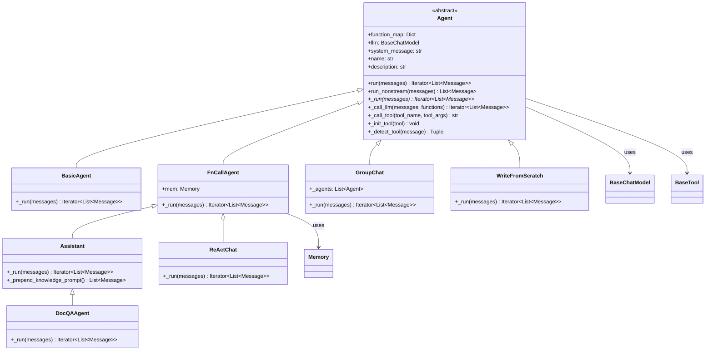
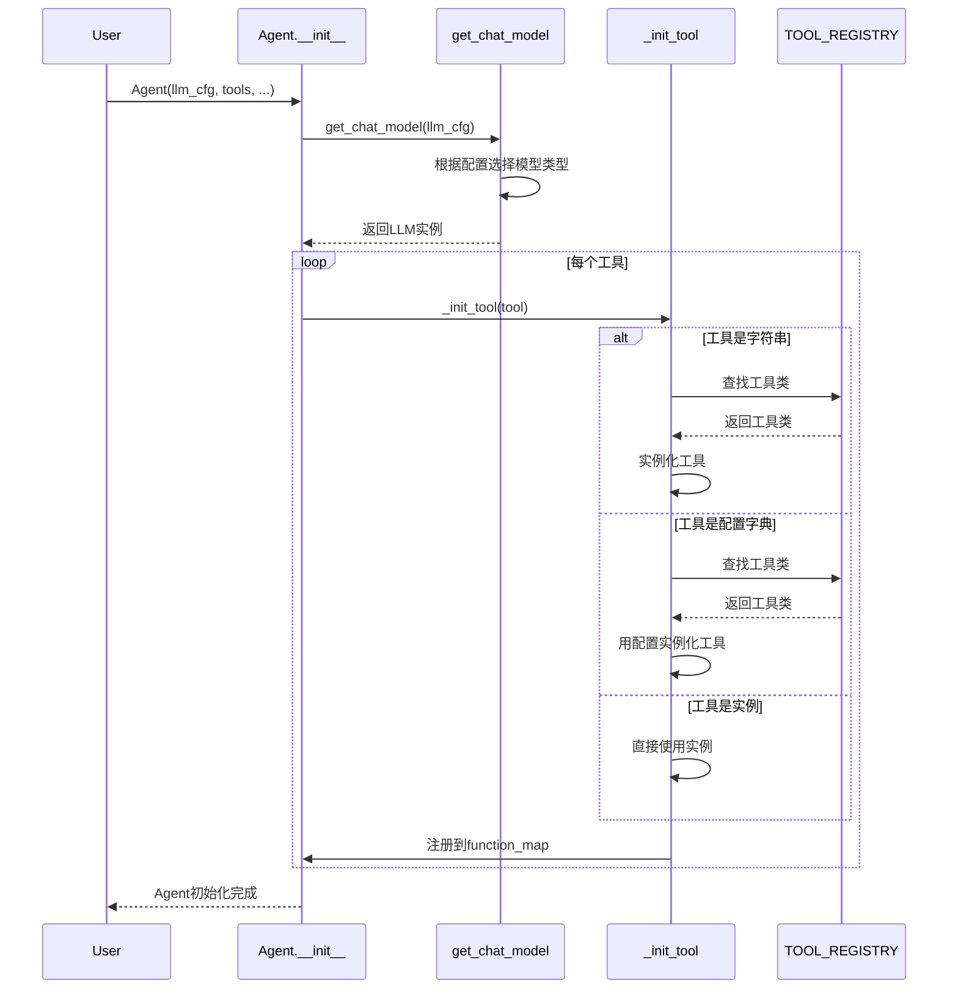
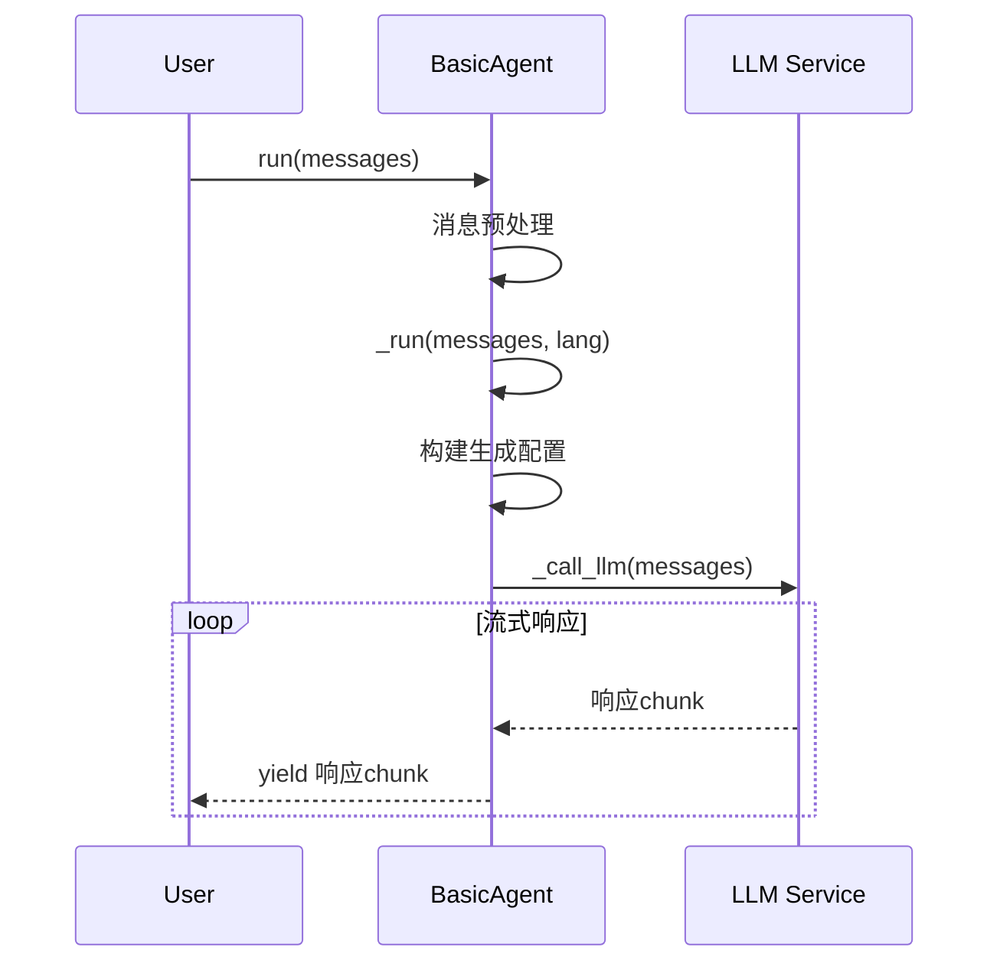
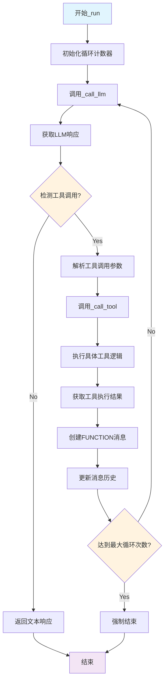
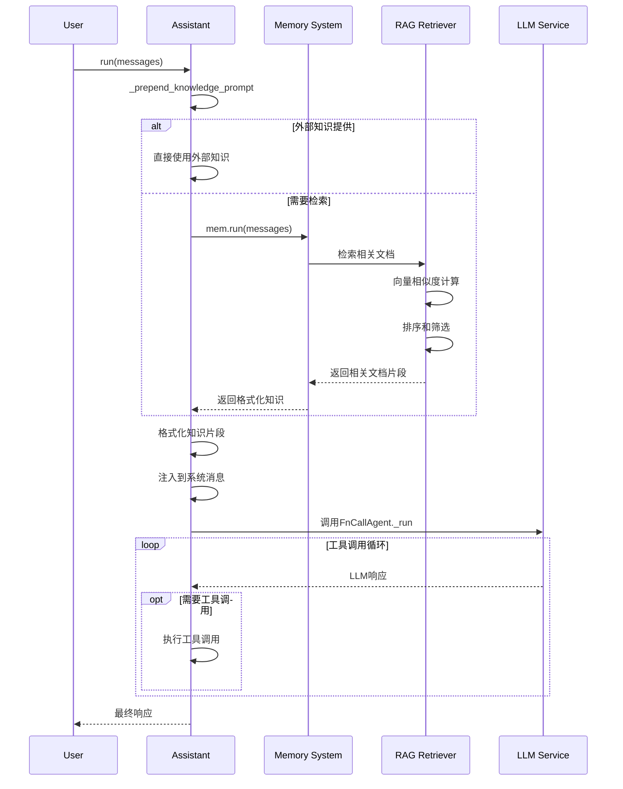
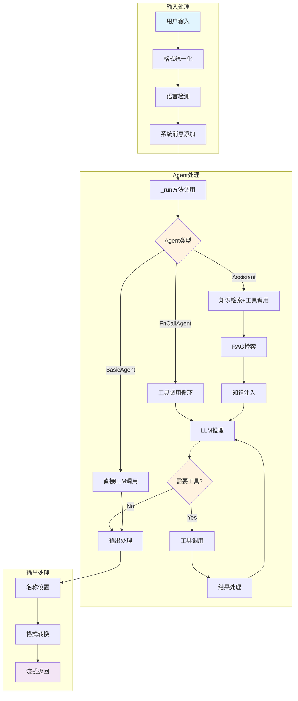

## 📝 概述

Agent模块是Qwen-Agent框架的核心，定义了智能代理的基本抽象和各种具体实现。本文档深入分析Agent模块的设计原理、继承体系、消息处理机制和工具调用流程。

## 🏗️ Agent类继承架构

### Agent类继承关系图



### 核心类关系说明

#### 1. Agent基类
- **职责**: 定义Agent的基本接口和通用行为
- **关键方法**: `run()`, `_run()`, `_call_llm()`, `_call_tool()`
- **设计模式**: 模板方法模式

#### 2. BasicAgent
- **职责**: 最简单的Agent实现，仅包含LLM对话功能
- **特点**: 无工具调用、无记忆管理

#### 3. FnCallAgent  
- **职责**: 支持函数调用的Agent基类
- **特点**: 集成Memory管理、支持工具调用循环

#### 4. Assistant
- **职责**: 通用助手Agent，集成RAG功能
- **特点**: 知识检索、文档理解、工具调用

## 🔍 Agent基类详细分析

### Agent.__init__() 初始化方法

```python
def __init__(self,
             function_list: Optional[List[Union[str, Dict, BaseTool]]] = None,
             llm: Optional[Union[dict, BaseChatModel]] = None,
             system_message: Optional[str] = DEFAULT_SYSTEM_MESSAGE,
             name: Optional[str] = None,
             description: Optional[str] = None,
             **kwargs):
    """Agent初始化方法
    
    参数说明:
        function_list: 工具列表，支持字符串、字典配置或工具实例
        llm: LLM配置或实例
        system_message: 系统消息模板
        name: Agent名称，用于多Agent场景
        description: Agent描述，用于Agent选择
    
    初始化流程:
        1. LLM实例化或配置
        2. 工具注册和映射
        3. 基本属性设置
    """
    # 1. LLM初始化
    if isinstance(llm, dict):
        self.llm = get_chat_model(llm)  # 通过工厂方法创建LLM实例
    else:
        self.llm = llm
    self.extra_generate_cfg: dict = {}  # 额外生成配置
    
    # 2. 工具初始化
    self.function_map = {}  # 工具名称到实例的映射
    if function_list:
        for tool in function_list:
            self._init_tool(tool)  # 逐个初始化工具
    
    # 3. 基本属性设置
    self.system_message = system_message
    self.name = name
    self.description = description
```

**初始化时序图**:



### Agent.run() 主入口方法详细解析

```python
def run(self, messages: List[Union[Dict, Message]], **kwargs) -> Union[Iterator[List[Message]], Iterator[List[Dict]]]:
    """Agent运行的主入口，实现了完整的消息处理pipeline
    
    处理流程:
        1. 输入统一化 - 将Dict和Message统一为Message类型
        2. 类型追踪 - 记录返回类型以保持输入输出一致性
        3. 语言检测 - 自动检测消息语言（中文/英文）
        4. 系统消息处理 - 添加或合并系统消息
        5. 调用具体实现 - 委托给_run()抽象方法
        6. 名称设置 - 为返回消息设置Agent名称
        7. 格式转换 - 将结果转换回输入格式
    
    设计亮点:
        - 保持输入输出格式一致性
        - 自动语言检测提升用户体验
        - 流式处理支持实时响应
        - 多模态内容处理
    """
    # 1. 深拷贝避免修改原始数据
    messages = copy.deepcopy(messages)
    _return_message_type = 'dict'  # 默认返回字典格式
    new_messages = []
    
    # 2. 输入格式统一化
    if not messages:
        _return_message_type = 'message'
    
    for msg in messages:
        if isinstance(msg, dict):
            new_messages.append(Message(**msg))  # 字典转Message对象
        else:
            new_messages.append(msg)
            _return_message_type = 'message'  # 有Message对象则返回Message
    
    # 3. 自动语言检测
    if 'lang' not in kwargs:
        if has_chinese_messages(new_messages):
            kwargs['lang'] = 'zh'  # 检测到中文
        else:
            kwargs['lang'] = 'en'  # 默认英文
    
    # 4. 系统消息处理
    if self.system_message:
        if not new_messages or new_messages[0][ROLE] != SYSTEM:
            # 没有系统消息时添加
            new_messages.insert(0, Message(role=SYSTEM, content=self.system_message))
        else:
            # 已有系统消息时合并
            if isinstance(new_messages[0][CONTENT], str):
                # 纯文本系统消息
                new_messages[0][CONTENT] = self.system_message + '\n\n' + new_messages[0][CONTENT]
            else:
                # 多模态系统消息
                assert isinstance(new_messages[0][CONTENT], list)
                new_messages[0][CONTENT] = [
                    ContentItem(text=self.system_message + '\n\n')
                ] + new_messages[0][CONTENT]
    
    # 5. 调用具体Agent实现
    for rsp in self._run(messages=new_messages, **kwargs):
        # 6. 设置Agent名称
        for i in range(len(rsp)):
            if not rsp[i].name and self.name:
                rsp[i].name = self.name
        
        # 7. 格式转换返回
        if _return_message_type == 'message':
            yield [Message(**x) if isinstance(x, dict) else x for x in rsp]
        else:
            yield [x.model_dump() if not isinstance(x, dict) else x for x in rsp]
```

### Agent._call_llm() LLM调用接口

```python
def _call_llm(
    self,
    messages: List[Message],
    functions: Optional[List[Dict]] = None,
    stream: bool = True,
    extra_generate_cfg: Optional[dict] = None,
) -> Iterator[List[Message]]:
    """Agent调用LLM的统一接口
    
    功能职责:
        1. 为Agent提供统一的LLM调用方式
        2. 合并Agent级别和调用级别的生成配置
        3. 支持函数调用和流式输出
        4. 处理生成参数的优先级合并
    
    参数说明:
        messages: 输入消息列表
        functions: 工具函数描述列表，OpenAI格式
        stream: 是否流式输出，默认True保证一致性
        extra_generate_cfg: 调用时的额外配置
    
    配置合并策略:
        - Agent级别配置(self.extra_generate_cfg)作为基础
        - 调用级别配置(extra_generate_cfg)具有更高优先级
        - 使用merge_generate_cfgs进行智能合并
    """
    return self.llm.chat(
        messages=messages,
        functions=functions,
        stream=stream,
        extra_generate_cfg=merge_generate_cfgs(
            base_generate_cfg=self.extra_generate_cfg,    # Agent基础配置
            new_generate_cfg=extra_generate_cfg,          # 调用时配置
        )
    )
```

### Agent._call_tool() 工具调用接口

```python
def _call_tool(self, tool_name: str, tool_args: Union[str, dict] = '{}', **kwargs) -> Union[str, List[ContentItem]]:
    """Agent调用工具的统一接口
    
    功能职责:
        1. 工具存在性验证
        2. 统一异常处理和错误消息格式化
        3. 支持多模态工具返回结果
        4. JSON结果自动序列化
    
    异常处理策略:
        - ToolServiceError和DocParserError直接抛出，由上层处理
        - 其他Exception捕获并格式化为错误消息返回
        - 记录详细的异常堆栈信息用于调试
    
    返回值处理:
        - 字符串结果直接返回
        - ContentItem列表支持多模态结果
        - 其他类型自动JSON序列化
    """
    # 1. 工具存在性检查
    if tool_name not in self.function_map:
        return f'Tool {tool_name} does not exists.'
    
    tool = self.function_map[tool_name]
    
    try:
        # 2. 调用工具执行
        tool_result = tool.call(tool_args, **kwargs)
    except (ToolServiceError, DocParserError) as ex:
        # 3. 特定异常直接抛出
        raise ex
    except Exception as ex:
        # 4. 通用异常处理
        exception_type = type(ex).__name__
        exception_message = str(ex)
        traceback_info = ''.join(traceback.format_tb(ex.__traceback__))
        
        error_message = f'An error occurred when calling tool `{tool_name}`:\n' \
                       f'{exception_type}: {exception_message}\n' \
                       f'Traceback:\n{traceback_info}'
        logger.warning(error_message)
        return error_message
    
    # 5. 返回值格式化
    if isinstance(tool_result, str):
        return tool_result
    elif isinstance(tool_result, list) and all(isinstance(item, ContentItem) for item in tool_result):
        return tool_result  # 多模态工具结果
    else:
        return json.dumps(tool_result, ensure_ascii=False, indent=4)
```

## 🔧 具体Agent实现分析

### 1. BasicAgent - 基础对话Agent

```python
class BasicAgent(Agent):
    """最基础的Agent实现，仅提供LLM对话功能
    
    特点:
        - 无工具调用能力
        - 无记忆管理
        - 直接调用LLM进行对话
        - 适用于纯对话场景
    
    使用场景:
        - 简单问答系统
        - 纯文本对话机器人
        - LLM能力测试
    """
    
    def _run(self, messages: List[Message], lang: str = 'en', **kwargs) -> Iterator[List[Message]]:
        """BasicAgent的核心实现：直接调用LLM
        
        实现逻辑:
            1. 构建额外生成配置
            2. 设置随机种子（如果提供）
            3. 直接调用_call_llm获取响应
            4. 流式返回结果
        """
        extra_generate_cfg = {'lang': lang}
        
        # 设置随机种子以保证结果可复现
        if kwargs.get('seed') is not None:
            extra_generate_cfg['seed'] = kwargs['seed']
        
        return self._call_llm(messages, extra_generate_cfg=extra_generate_cfg)
```

**BasicAgent处理流程**:



### 2. FnCallAgent - 函数调用Agent

```python
class FnCallAgent(Agent):
    """支持函数调用的Agent基类
    
    核心功能:
        1. 工具调用循环处理
        2. Memory系统集成
        3. 多轮工具调用支持
        4. 文件管理和RAG支持
    
    设计特点:
        - 支持多步骤工具调用
        - 自动循环处理工具结果
        - 集成文件和记忆管理
        - 支持并行工具调用
    """
    
    def __init__(self, function_list=None, llm=None, system_message=None, 
                 name=None, description=None, files=None, **kwargs):
        """FnCallAgent初始化
        
        额外初始化:
            - Memory系统初始化
            - 文件预加载
            - RAG配置设置
        """
        super().__init__(function_list=function_list, llm=llm, 
                        system_message=system_message, name=name, description=description)
        
        if not hasattr(self, 'mem'):
            # 根据模型类型选择Memory的LLM配置
            if 'qwq' in self.llm.model.lower() or 'qvq' in self.llm.model.lower() or 'qwen3' in self.llm.model.lower():
                if 'dashscope' in self.llm.model_type:
                    # 大模型使用轻量级模型进行文档处理
                    mem_llm = {
                        'model': 'qwen-turbo',
                        'model_type': 'qwen_dashscope',
                        'generate_cfg': {'max_input_tokens': 30000}
                    }
                else:
                    mem_llm = None
            else:
                mem_llm = self.llm
            
            # 初始化Memory系统
            self.mem = Memory(llm=mem_llm, files=files, **kwargs)
    
    def _run(self, messages: List[Message], lang: Literal['en', 'zh'] = 'en', **kwargs) -> Iterator[List[Message]]:
        """FnCallAgent的核心执行逻辑
        
        执行流程:
            1. 初始化循环计数器（防止无限循环）
            2. 进入工具调用循环
            3. 调用LLM获取响应
            4. 检测是否需要工具调用
            5. 执行工具调用并更新消息历史
            6. 继续循环直到无需工具调用或达到最大循环次数
        
        关键特性:
            - 支持多步骤工具调用
            - 自动循环处理
            - 流式输出支持
            - 异常处理和错误恢复
        """
        messages = copy.deepcopy(messages)
        num_llm_calls_available = MAX_LLM_CALL_PER_RUN  # 最大循环次数限制
        response = []
        
        while True and num_llm_calls_available > 0:
            num_llm_calls_available -= 1
            
            # 1. 配置LLM调用参数
            extra_generate_cfg = {'lang': lang}
            if kwargs.get('seed') is not None:
                extra_generate_cfg['seed'] = kwargs['seed']
            
            # 2. 调用LLM获取响应
            output_stream = self._call_llm(
                messages=messages,
                functions=[func.function for func in self.function_map.values()],  # 提供可用工具列表
                extra_generate_cfg=extra_generate_cfg
            )
            
            # 3. 处理流式输出
            output: List[Message] = []
            for output in output_stream:
                if output:
                    yield response + output  # 流式返回累积结果
            
            if output:
                response.extend(output)
                messages.extend(output)
                used_any_tool = False
                
                # 4. 检查每个输出消息是否包含工具调用
                for out in output:
                    use_tool, tool_name, tool_args, _ = self._detect_tool(out)
                    
                    if use_tool:
                        # 5. 执行工具调用
                        tool_result = self._call_tool(tool_name, tool_args, messages=messages, **kwargs)
                        
                        # 6. 创建工具结果消息
                        fn_msg = Message(
                            role=FUNCTION,
                            name=tool_name,
                            content=tool_result,
                        )
                        
                        # 7. 更新消息历史
                        messages.append(fn_msg)
                        response.append(fn_msg)
                        used_any_tool = True
                
                # 8. 如果没有使用工具，结束循环
                if not used_any_tool:
                    break
            else:
                break
        
        # 9. 提取文件信息并更新Memory
        new_files = extract_files_from_messages(messages)
        if new_files and hasattr(self, 'mem'):
            self.mem.extend_files(new_files)
```

**FnCallAgent工具调用流程图**:



### 3. Assistant - 通用助手Agent

```python
class Assistant(FnCallAgent):
    """集成RAG功能的通用助手Agent
    
    核心特性:
        1. 继承FnCallAgent的所有功能
        2. 集成知识检索(RAG)
        3. 文档理解和问答
        4. 自动知识源管理
    
    使用场景:
        - 文档问答系统
        - 知识库助手
        - 复合任务处理
        - 企业智能客服
    """
    
    def __init__(self, function_list=None, llm=None, system_message=None,
                 name=None, description=None, files=None, rag_cfg=None):
        """Assistant初始化
        
        参数说明:
            files: 初始文档列表，支持本地文件和URL
            rag_cfg: RAG检索配置，包含检索策略、向量化模型等
        """
        super().__init__(function_list=function_list, llm=llm,
                        system_message=system_message, name=name,
                        description=description, files=files, rag_cfg=rag_cfg)
    
    def _run(self, messages: List[Message], lang: Literal['en', 'zh'] = 'en',
             knowledge: str = '', **kwargs) -> Iterator[List[Message]]:
        """Assistant的核心执行逻辑
        
        处理流程:
            1. 知识检索（如果没有外部知识）
            2. 知识融合到消息上下文
            3. 调用FnCallAgent的处理逻辑
        
        参数说明:
            knowledge: 外部提供的知识字符串，如果提供则跳过检索
        """
        # 1. 知识前置处理
        new_messages = self._prepend_knowledge_prompt(
            messages=messages, 
            lang=lang, 
            knowledge=knowledge, 
            **kwargs
        )
        
        # 2. 调用父类处理逻辑
        return super()._run(messages=new_messages, lang=lang, **kwargs)
    
    def _prepend_knowledge_prompt(self, messages: List[Message], lang: Literal['en', 'zh'] = 'en',
                                 knowledge: str = '', **kwargs) -> List[Message]:
        """知识检索和上下文构建
        
        功能说明:
            1. 从Memory系统检索相关文档
            2. 格式化检索结果
            3. 将知识注入到系统消息中
        
        处理逻辑:
            - 如果提供外部知识，直接使用
            - 否则通过Memory系统进行RAG检索
            - 将检索结果格式化为知识片段
            - 注入到系统消息或创建新的系统消息
        """
        messages = copy.deepcopy(messages)
        
        if not knowledge:
            # 1. 通过Memory系统进行RAG检索
            *_, last = self.mem.run(messages=messages, lang=lang, **kwargs)
            knowledge = last[-1][CONTENT]
        
        logger.debug(f'Retrieved knowledge of type `{type(knowledge).__name__}`:\n{knowledge}')
        
        if knowledge:
            # 2. 知识格式化
            knowledge = format_knowledge_to_source_and_content(knowledge)
            logger.debug(f'Formatted knowledge into type `{type(knowledge).__name__}`:\n{knowledge}')
        else:
            knowledge = []
        
        # 3. 构建知识片段
        snippets = []
        for k in knowledge:
            snippets.append(KNOWLEDGE_SNIPPET[lang].format(
                source=k['source'], 
                content=k['content']
            ))
        
        # 4. 生成知识提示
        knowledge_prompt = ''
        if snippets:
            knowledge_prompt = KNOWLEDGE_TEMPLATE[lang].format(
                knowledge='\n\n'.join(snippets)
            )
        
        # 5. 注入到消息中
        if knowledge_prompt:
            if messages and messages[0][ROLE] == SYSTEM:
                # 合并到现有系统消息
                if isinstance(messages[0][CONTENT], str):
                    messages[0][CONTENT] += '\n\n' + knowledge_prompt
                else:
                    # 多模态内容处理
                    assert isinstance(messages[0][CONTENT], list)
                    messages[0][CONTENT] += [ContentItem(text='\n\n' + knowledge_prompt)]
            else:
                # 创建新的系统消息
                messages = [Message(role=SYSTEM, content=knowledge_prompt)] + messages
        
        return messages
```

**Assistant知识检索时序图**:



## 🔍 消息处理机制深度分析

### Message数据结构

```python
@dataclass
class Message:
    """统一的消息数据结构
    
    字段说明:
        role: 消息角色 (user/assistant/system/function)
        content: 消息内容，支持字符串或ContentItem列表
        name: 发送者名称，用于多Agent场景
        function_call: 函数调用信息
        reasoning_content: 推理过程内容（QwQ等模型）
        extra: 额外信息字典
    
    支持特性:
        - 多模态内容（文本、图片、音频、视频、文件）
        - 函数调用信息
        - 推理过程记录
        - 扩展字段支持
    """
    role: str
    content: Union[str, List[ContentItem]] = ''
    name: Optional[str] = None
    function_call: Optional[FunctionCall] = None
    reasoning_content: Optional[str] = None
    extra: Optional[dict] = None

@dataclass  
class ContentItem:
    """多模态内容项
    
    支持类型:
        - text: 纯文本内容
        - image: 图片（URL或base64）
        - audio: 音频文件
        - video: 视频文件
        - file: 一般文件
    """
    text: Optional[str] = None
    image: Optional[str] = None
    audio: Optional[str] = None
    video: Optional[str] = None
    file: Optional[str] = None
    
    def get_type_and_value(self) -> Tuple[str, str]:
        """获取内容类型和值"""
        if self.text is not None:
            return 'text', self.text
        elif self.image is not None:
            return 'image', self.image
        elif self.audio is not None:
            return 'audio', self.audio
        elif self.video is not None:
            return 'video', self.video
        elif self.file is not None:
            return 'file', self.file
        else:
            return 'text', ''

@dataclass
class FunctionCall:
    """函数调用信息
    
    字段说明:
        name: 函数名称
        arguments: 函数参数（JSON字符串）
    """
    name: str
    arguments: str
```

### 消息流转完整流程



### 工具检测机制

```python
def _detect_tool(self, message: Message) -> Tuple[bool, str, str, str]:
    """内置的工具调用检测机制
    
    功能说明:
        从LLM响应消息中检测是否包含工具调用指令
        支持function_call格式的工具调用
    
    返回值:
        - bool: 是否需要调用工具
        - str: 工具名称
        - str: 工具参数（JSON字符串）
        - str: 文本回复内容
    
    检测逻辑:
        1. 检查message.function_call字段
        2. 提取工具名称和参数
        3. 获取文本内容
        4. 返回检测结果
    """
    func_name = None
    func_args = None
    
    # 1. 检测function_call字段
    if message.function_call:
        func_call = message.function_call
        func_name = func_call.name       # 工具名称
        func_args = func_call.arguments  # 工具参数（JSON字符串）
    
    # 2. 获取文本内容
    text = message.content
    if not text:
        text = ''
    
    # 3. 返回检测结果
    return (func_name is not None), func_name, func_args, text
```

## 📊 Agent性能优化策略

### 1. 循环控制机制

```python
# 在FnCallAgent中防止无限工具调用循环
num_llm_calls_available = MAX_LLM_CALL_PER_RUN  # 默认10次

while True and num_llm_calls_available > 0:
    num_llm_calls_available -= 1
    # ... 执行工具调用逻辑
    
    if not used_any_tool:
        break  # 没有工具调用时结束
```

### 2. 流式输出优化

```python
# 实时流式返回，提升用户体验
for output in output_stream:
    if output:
        yield response + output  # 实时返回累积结果
```

### 3. Memory系统优化

```python
# 根据模型类型选择合适的Memory LLM
if 'qwq' in self.llm.model.lower() or 'qwen3' in self.llm.model.lower():
    # 大模型使用轻量级模型处理文档
    mem_llm = {
        'model': 'qwen-turbo',
        'model_type': 'qwen_dashscope',
        'generate_cfg': {'max_input_tokens': 30000}
    }
```

### 4. 缓存策略

```python
# LLM层面的响应缓存
if self.cache is not None:
    cache_key = json_dumps_compact(dict(messages=messages, functions=functions))
    if cached_result := self.cache.get(cache_key):
        return cached_result
```

## 🎯 Agent模块总结

### 设计优势

1. **层次清晰**: 从抽象基类到具体实现，职责分明
2. **扩展性强**: 支持多种Agent类型，易于自定义扩展
3. **模块化好**: Memory、Tools、LLM各司其职
4. **流式支持**: 原生支持流式处理，提升用户体验
5. **错误处理**: 完善的异常处理和错误恢复机制

### 核心特性

1. **统一抽象**: Agent基类定义统一接口
2. **工具集成**: 内置丰富的工具调用机制
3. **知识检索**: Assistant集成RAG功能
4. **多轮对话**: 支持上下文记忆和多轮交互
5. **多模态**: 原生支持文本、图像、音频等多种输入

### 扩展建议

1. **并行工具调用**: 支持同时调用多个工具提升效率
2. **Agent编排**: 支持更复杂的Agent协作模式
3. **性能监控**: 增加更详细的性能指标和监控
4. **安全加固**: 工具调用的沙箱隔离和权限控制
5. **插件机制**: 更灵活的插件化架构

---

*本Agent模块分析文档基于Qwen-Agent v0.0.30版本，涵盖了模块的核心设计和实现原理。*
