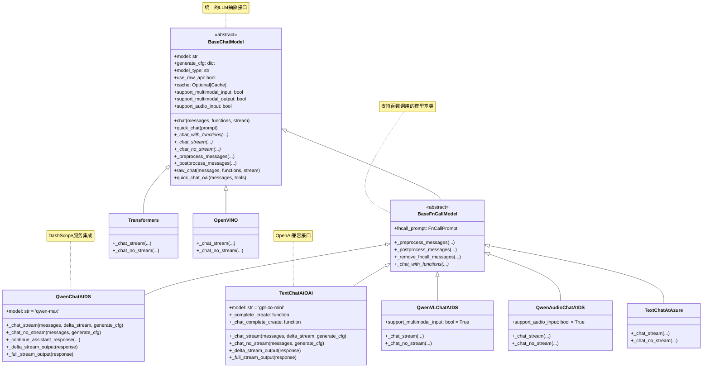
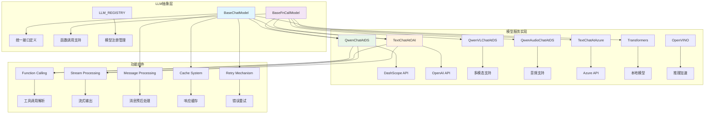
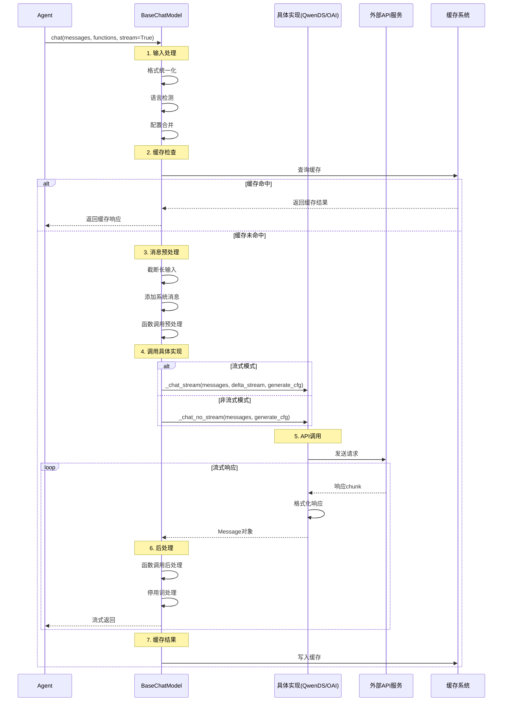
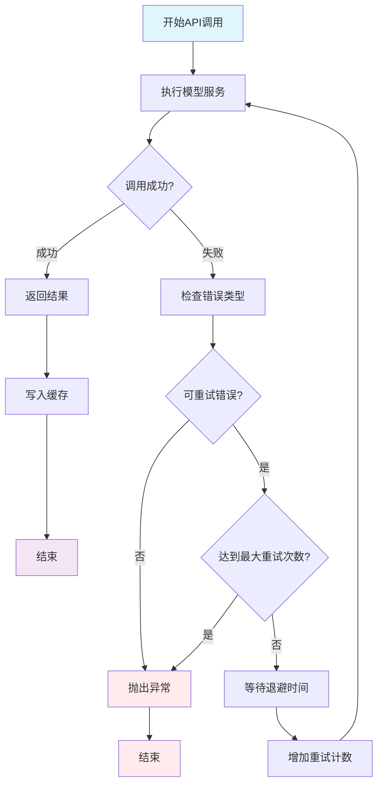

## 📝 概述

LLM模块是Qwen-Agent框架的核心驱动力，负责与各种大语言模型服务进行交互。本模块通过统一的抽象接口，支持多种模型服务提供商，包括DashScope、OpenAI、Azure等，并提供函数调用、流式输出、多模态支持等高级功能。

## 🏗️ LLM模块架构设计

### 核心类继承关系图



### 模块组件关系图



## 🔍 BaseChatModel基类详细分析

### BaseChatModel核心属性和方法

```python
class BaseChatModel(ABC):
    """LLM基础抽象类 - 定义统一的模型交互接口
    
    设计目标:
        1. 为所有LLM提供统一的接口抽象
        2. 支持多种输入输出模式（文本、多模态、音频）
        3. 提供完整的缓存和重试机制
        4. 支持流式和非流式两种处理模式
        5. 兼容多种API格式和调用方式
    
    核心职责:
        - 消息格式标准化和转换
        - 输入长度管理和截断
        - 响应缓存和性能优化
        - 错误处理和重试机制
        - 流式输出管理
    """
    
    # 模型能力属性
    @property
    def support_multimodal_input(self) -> bool:
        """是否支持多模态输入（图像、音频、视频等）"""
        return False
        
    @property  
    def support_multimodal_output(self) -> bool:
        """是否支持多模态输出（除文本外的其他格式）"""
        return False
        
    @property
    def support_audio_input(self) -> bool:
        """是否支持音频输入"""
        return False
    
    def __init__(self, cfg: Optional[Dict] = None):
        """BaseChatModel初始化
        
        初始化流程:
            1. 解析基础配置（模型名称、类型等）
            2. 设置生成参数和缓存配置  
            3. 初始化重试机制
            4. 配置原生API模式
        
        关键配置项:
            - model: 模型名称
            - model_type: 模型类型标识
            - generate_cfg: 生成参数配置
            - cache_dir: 缓存目录配置
            - max_retries: 最大重试次数
            - use_raw_api: 是否使用原生API
        """
        cfg = cfg or {}
        
        # 1. 基础配置
        self.model = cfg.get('model', '').strip()
        self.model_type = cfg.get('model_type', '')
        
        # 2. 生成配置处理
        generate_cfg = copy.deepcopy(cfg.get('generate_cfg', {}))
        cache_dir = cfg.get('cache_dir', generate_cfg.pop('cache_dir', None))
        self.max_retries = generate_cfg.pop('max_retries', 0)
        self.generate_cfg = generate_cfg
        
        # 3. DashScope特殊配置
        if 'dashscope' in self.model_type:
            self.generate_cfg['incremental_output'] = True
        
        # 4. 原生API模式配置
        self.use_raw_api = os.getenv('QWEN_AGENT_USE_RAW_API', 'false').lower() == 'true'
        if 'use_raw_api' in generate_cfg:
            self.use_raw_api = generate_cfg.pop('use_raw_api')
        elif self.model_type == 'qwen_dashscope':
            # Qwen3-Max默认使用原生API
            if self.model == 'qwen3-max' and (not self.use_raw_api):
                logger.info('Setting `use_raw_api` to True when using `Qwen3-Max`')
                self.use_raw_api = True
        
        # 5. 缓存系统初始化
        if cache_dir:
            try:
                import diskcache
                os.makedirs(cache_dir, exist_ok=True)
                self.cache = diskcache.Cache(directory=cache_dir)
            except ImportError:
                logger.warning('Caching disabled because diskcache is not installed.')
                self.cache = None
        else:
            self.cache = None
```

### chat()方法完整实现分析

```python
def chat(
    self,
    messages: List[Union[Message, Dict]],
    functions: Optional[List[Dict]] = None,
    stream: bool = True,
    delta_stream: bool = False,
    extra_generate_cfg: Optional[Dict] = None,
) -> Union[List[Message], List[Dict], Iterator[List[Message]], Iterator[List[Dict]]]:
    """LLM聊天的核心接口 - 统一处理所有LLM交互
    
    处理流程详解:
        1. 输入格式统一化 - 将Dict和Message统一为Message类型
        2. 缓存查找 - 检查是否有已缓存的响应
        3. 配置合并 - 合并基础配置和调用配置
        4. 随机种子设置 - 确保结果可复现
        5. 语言检测 - 自动检测消息语言
        6. 系统消息处理 - 添加默认系统消息
        7. 输入长度管理 - 截断过长的输入
        8. 函数调用模式检测 - 判断是否需要工具调用
        9. 消息预处理 - 多模态内容处理
        10. 模型服务调用 - 具体的API调用
        11. 重试机制 - 错误时的重试逻辑
        12. 响应后处理 - 格式化和缓存
    
    参数说明:
        messages: 输入消息列表，支持Dict或Message对象
        functions: 可用函数列表，用于函数调用
        stream: 是否流式输出
        delta_stream: 是否增量流式输出（已弃用）
        extra_generate_cfg: 额外的生成配置
    
    返回值说明:
        - 非流式: 返回Message或Dict列表
        - 流式: 返回Message或Dict列表的迭代器
    """
    
    # 1. 输入消息统一化
    messages = copy.deepcopy(messages)
    _return_message_type = 'dict'  # 记录返回类型
    new_messages = []
    
    for msg in messages:
        if isinstance(msg, dict):
            new_messages.append(Message(**msg))
        else:
            new_messages.append(msg)
            _return_message_type = 'message'
    messages = new_messages
    
    if not messages:
        raise ValueError('Messages can not be empty.')
    
    # 2. 缓存查找
    if self.cache is not None:
        cache_key = dict(messages=messages, functions=functions, extra_generate_cfg=extra_generate_cfg)
        cache_key: str = json_dumps_compact(cache_key, sort_keys=True)
        cache_value: str = self.cache.get(cache_key)
        if cache_value:
            cache_value: List[dict] = json.loads(cache_value)
            if _return_message_type == 'message':
                cache_value: List[Message] = [Message(**m) for m in cache_value]
            if stream:
                cache_value: Iterator[List[Union[Message, dict]]] = iter([cache_value])
            return cache_value
    
    # 3. 弃用警告处理
    if stream and delta_stream:
        logger.warning(
            'Support for `delta_stream=True` is deprecated. '
            'Please use `stream=True and delta_stream=False` or `stream=False` instead.'
        )
    
    # 4. 配置合并和处理
    generate_cfg = merge_generate_cfgs(base_generate_cfg=self.generate_cfg, new_generate_cfg=extra_generate_cfg)
    
    # 5. 随机种子设置
    if 'seed' not in generate_cfg:
        generate_cfg['seed'] = random.randint(a=0, b=2**30)
    
    # 6. 语言检测
    if 'lang' in generate_cfg:
        lang: Literal['en', 'zh'] = generate_cfg.pop('lang')
    else:
        lang: Literal['en', 'zh'] = 'zh' if has_chinese_messages(messages) else 'en'
    
    if not stream and 'incremental_output' in generate_cfg:
        generate_cfg.pop('incremental_output')
    
    # 7. 系统消息处理
    if DEFAULT_SYSTEM_MESSAGE and messages[0].role != SYSTEM:
        messages = [Message(role=SYSTEM, content=DEFAULT_SYSTEM_MESSAGE)] + messages
    
    # 8. 输入长度管理
    max_input_tokens = generate_cfg.pop('max_input_tokens', DEFAULT_MAX_INPUT_TOKENS)
    if max_input_tokens > 0:
        messages = _truncate_input_messages_roughly(
            messages=messages,
            max_tokens=max_input_tokens,
        )
    
    # 9. 函数调用模式检测
    if functions:
        fncall_mode = True
    else:
        fncall_mode = False
    
    # function_choice参数验证
    if 'function_choice' in generate_cfg:
        fn_choice = generate_cfg['function_choice']
        valid_fn_choices = [f.get('name', f.get('name_for_model', None)) for f in (functions or [])]
        valid_fn_choices = ['auto', 'none'] + [f for f in valid_fn_choices if f]
        if fn_choice not in valid_fn_choices:
            raise ValueError(f'The value of function_choice must be one of: {valid_fn_choices}. '
                           f'But function_choice="{fn_choice}" is received.')
        if fn_choice == 'none':
            fncall_mode = False
    
    # 10. 消息预处理
    messages = self._preprocess_messages(messages,
                                       lang=lang,
                                       generate_cfg=generate_cfg,
                                       functions=functions,
                                       use_raw_api=self.use_raw_api)
    
    if not self.support_multimodal_input:
        messages = [format_as_text_message(msg, add_upload_info=False) for msg in messages]
    
    # 11. 原生API模式处理
    if self.use_raw_api:
        logger.debug('`use_raw_api` takes effect.')
        assert stream and (not delta_stream), '`use_raw_api` only support full stream!!!'
        return self.raw_chat(messages=messages, functions=functions, stream=stream, generate_cfg=generate_cfg)
    
    # 12. 清理非函数调用模式的参数
    if not fncall_mode:
        for k in ['parallel_function_calls', 'function_choice', 'thought_in_content']:
            if k in generate_cfg:
                del generate_cfg[k]
    
    # 13. 定义模型服务调用函数
    def _call_model_service():
        if fncall_mode:
            return self._chat_with_functions(
                messages=messages,
                functions=functions,
                stream=stream,
                delta_stream=delta_stream,
                generate_cfg=generate_cfg,
                lang=lang,
            )
        else:
            # TODO: 优化代码结构
            if messages[-1].role == ASSISTANT:
                # 续写模式
                assert not delta_stream, 'Continuation mode does not currently support `delta_stream`'
                return self._continue_assistant_response(messages, generate_cfg=generate_cfg, stream=stream)
            else:
                return self._chat(
                    messages,
                    stream=stream,
                    delta_stream=delta_stream,
                    generate_cfg=generate_cfg,
                )
    
    # 14. 重试机制应用
    if stream and delta_stream:
        # 增量流式无重试
        output = _call_model_service()
    elif stream and (not delta_stream):
        # 全量流式支持重试
        output = retry_model_service_iterator(_call_model_service, max_retries=self.max_retries)
    else:
        # 非流式支持重试
        output = retry_model_service(_call_model_service, max_retries=self.max_retries)
    
    # 15. 响应处理和缓存
    if isinstance(output, list):
        # 非流式处理
        assert not stream
        logger.debug(f'LLM Output: \n{pformat([_.model_dump() for _ in output], indent=2)}')
        output = self._postprocess_messages(output, fncall_mode=fncall_mode, generate_cfg=generate_cfg)
        if not self.support_multimodal_output:
            output = _format_as_text_messages(messages=output)
        if self.cache:
            self.cache.set(cache_key, json_dumps_compact(output))
        return self._convert_messages_to_target_type(output, _return_message_type)
    else:
        # 流式处理
        assert stream
        if delta_stream:
            # 增量流式的特殊处理
            generate_cfg = copy.deepcopy(generate_cfg)
            assert 'skip_stopword_postproc' not in generate_cfg
            generate_cfg['skip_stopword_postproc'] = True
            
        output = self._postprocess_messages_iterator(output, fncall_mode=fncall_mode, generate_cfg=generate_cfg)
        
        def _format_and_cache() -> Iterator[List[Message]]:
            o = []
            for o in output:
                if o:
                    if not self.support_multimodal_output:
                        o = _format_as_text_messages(messages=o)
                    yield o
            if o and (self.cache is not None):
                self.cache.set(cache_key, json_dumps_compact(o))
        
        return self._convert_messages_iterator_to_target_type(_format_and_cache(), _return_message_type)
```

## 🔧 BaseFnCallModel函数调用模型

### 函数调用处理机制

```python
class BaseFnCallModel(BaseChatModel, ABC):
    """支持函数调用的LLM基类
    
    核心功能:
        1. 函数调用提示模板管理
        2. 消息格式转换（函数调用 <-> 普通对话）
        3. 并行函数调用支持
        4. 思维链内容处理
    
    提示模板类型:
        - qwen: Qwen原生函数调用格式
        - nous: Nous研究格式（推荐）
    """
    
    def __init__(self, cfg: Optional[Dict] = None):
        """函数调用模型初始化
        
        初始化过程:
            1. 选择函数调用提示模板类型
            2. 加载对应的提示处理器
            3. 配置停用词（如果需要）
        """
        super().__init__(cfg)
        
        # 1. 获取函数调用提示类型
        fncall_prompt_type = self.generate_cfg.get('fncall_prompt_type', 'nous')
        
        # 2. 加载对应的提示处理器
        if fncall_prompt_type == 'qwen':
            from qwen_agent.llm.fncall_prompts.qwen_fncall_prompt import FN_STOP_WORDS, QwenFnCallPrompt
            self.fncall_prompt = QwenFnCallPrompt()
            # 添加函数调用停用词
            stop = self.generate_cfg.get('stop', [])
            self.generate_cfg['stop'] = stop + [x for x in FN_STOP_WORDS if x not in stop]
        elif fncall_prompt_type == 'nous':
            from qwen_agent.llm.fncall_prompts.nous_fncall_prompt import NousFnCallPrompt
            self.fncall_prompt = NousFnCallPrompt()
        else:
            raise NotImplementedError(f'Unsupported fncall_prompt_type: {fncall_prompt_type}')
        
        # 3. 清理配置中的提示类型参数
        if 'fncall_prompt_type' in self.generate_cfg:
            del self.generate_cfg['fncall_prompt_type']
    
    def _preprocess_messages(
        self,
        messages: List[Message],
        lang: Literal['en', 'zh'],
        generate_cfg: dict,
        functions: Optional[List[Dict]] = None,
        use_raw_api: bool = False,
    ) -> List[Message]:
        """函数调用消息预处理
        
        处理逻辑:
            1. 调用父类进行基础预处理
            2. 如果使用原生API，直接返回
            3. 如果没有函数或function_choice=none，移除函数调用消息
            4. 否则，使用提示模板处理函数调用消息
        
        参数说明:
            messages: 输入消息列表
            lang: 语言类型
            generate_cfg: 生成配置
            functions: 可用函数列表
            use_raw_api: 是否使用原生API
        """
        # 1. 父类基础预处理
        messages = super()._preprocess_messages(messages, lang=lang, generate_cfg=generate_cfg, functions=functions)
        
        # 2. 原生API模式直接返回
        if use_raw_api:
            return messages
        
        # 3. 处理函数调用相关逻辑
        if (not functions) or (generate_cfg.get('function_choice', 'auto') == 'none'):
            # 移除函数调用消息
            messages = self._remove_fncall_messages(messages, lang=lang)
        else:
            # 使用函数调用提示模板处理
            messages = self.fncall_prompt.preprocess_fncall_messages(
                messages=messages,
                functions=functions,
                lang=lang,
                parallel_function_calls=generate_cfg.get('parallel_function_calls', False),
                function_choice=generate_cfg.get('function_choice', 'auto'),
            )
        
        return messages
    
    def _postprocess_messages(
        self,
        messages: List[Message],
        fncall_mode: bool,
        generate_cfg: dict,
    ) -> List[Message]:
        """函数调用消息后处理
        
        处理逻辑:
            1. 调用父类进行基础后处理
            2. 如果是函数调用模式，使用提示模板后处理
        """
        # 1. 父类基础后处理
        messages = super()._postprocess_messages(messages, fncall_mode=fncall_mode, generate_cfg=generate_cfg)
        
        # 2. 函数调用模式的特殊后处理
        if fncall_mode:
            messages = self.fncall_prompt.postprocess_fncall_messages(
                messages=messages,
                parallel_function_calls=generate_cfg.get('parallel_function_calls', False),
                function_choice=generate_cfg.get('function_choice', 'auto'),
                thought_in_content=generate_cfg.get('thought_in_content', False),
            )
        
        return messages
    
    def _remove_fncall_messages(self, messages: List[Message], lang: Literal['en', 'zh']) -> List[Message]:
        """移除函数调用消息，转换为普通用户消息
        
        使用场景:
            当function_choice="none"时，需要将函数调用相关的消息
            转换为普通的用户消息，避免模型继续尝试生成函数调用
        
        转换逻辑:
            - function_call消息 -> 转换为描述工具调用的用户消息
            - FUNCTION消息 -> 转换为描述工具结果的用户消息
        """
        new_messages = []
        for msg in messages:
            if (msg.role == FUNCTION) or msg.function_call:
                # 确保前一条消息是用户消息
                if (not new_messages) or (new_messages[-1].role != USER):
                    new_messages.append(Message(role=USER, content=[]))
                
                if msg.function_call:
                    # 处理函数调用消息
                    tool_name = msg.function_call.name
                    tool_args = msg.function_call.arguments
                    if lang == 'zh':
                        tool_text = f'\n\n工具"{tool_name}"被调用时使用了以下参数：\n{tool_args}'
                    else:
                        tool_text = f'\n\nThe tool "{tool_name}" was called with these arguments: \n{tool_args}'
                else:
                    # 处理函数结果消息
                    assert msg.role == FUNCTION
                    if lang == 'zh':
                        tool_text = f'\n\n工具"{msg.name}"返回了以下结果：\n{msg.content}'
                    else:
                        tool_text = f'\n\nThe tool "{msg.name}" returned: \n{msg.content}'
                
                # 将工具信息添加到用户消息中
                if isinstance(new_messages[-1].content, str):
                    new_messages[-1].content += tool_text
                else:
                    new_messages[-1].content.append(ContentItem(text=tool_text))
            else:
                # 普通消息直接添加
                new_messages.append(msg)
        
        return new_messages
```

## 🌐 具体模型服务实现

### 1. QwenChatAtDS - DashScope服务实现

```python
@register_llm('qwen_dashscope')
class QwenChatAtDS(BaseFnCallModel):
    """DashScope服务的Qwen模型实现
    
    特点:
        1. 集成阿里云DashScope服务
        2. 支持流式和非流式输出
        3. 支持函数调用和推理内容
        4. 提供完整的错误处理
    
    支持的功能:
        - 文本对话
        - 函数调用
        - 流式输出
        - 增量和全量流式
        - 推理内容（reasoning_content）
    """
    
    def __init__(self, cfg: Optional[Dict] = None):
        """DashScope模型初始化
        
        初始化过程:
            1. 调用父类初始化
            2. 设置默认模型名称
            3. 初始化DashScope SDK
        """
        super().__init__(cfg)
        self.model = self.model or 'qwen-max'  # 默认使用qwen-max
        initialize_dashscope(cfg)  # 初始化DashScope配置
    
    def _chat_stream(
        self,
        messages: List[Message],
        delta_stream: bool,
        generate_cfg: dict,
    ) -> Iterator[List[Message]]:
        """流式聊天实现
        
        处理流程:
            1. 消息格式转换
            2. 处理续写模式（partial=True）
            3. 调用DashScope Generation API
            4. 根据stream模式返回不同格式
        
        参数说明:
            messages: 输入消息列表
            delta_stream: 是否增量流式输出
            generate_cfg: 生成配置参数
        """
        # 1. 消息格式转换
        messages = [msg.model_dump() for msg in messages]
        
        # 2. 处理续写模式
        if messages[-1]['role'] == ASSISTANT:
            messages[-1]['partial'] = True
        
        # 3. 转换为OpenAI格式（DashScope兼容）
        messages = self._conv_qwen_agent_messages_to_oai(messages)
        
        # 4. 调试日志
        logger.debug(f'LLM Input: \n{pformat(messages, indent=2)}')
        logger.debug(f'LLM Input generate_cfg: \n{generate_cfg}')
        
        # 5. 调用DashScope API
        response = dashscope.Generation.call(
            self.model,
            messages=messages,
            result_format='message',
            stream=True,
            **generate_cfg
        )
        
        # 6. 根据流式模式返回
        if delta_stream:
            return self._delta_stream_output(response)
        else:
            return self._full_stream_output(response)
    
    def _chat_no_stream(
        self,
        messages: List[Message],
        generate_cfg: dict,
    ) -> List[Message]:
        """非流式聊天实现
        
        处理流程:
            1. 消息格式转换和预处理
            2. 调用DashScope非流式API
            3. 结果解析和错误处理
            4. 返回标准Message格式
        """
        # 1. 消息格式转换
        messages = [msg.model_dump() for msg in messages]
        if messages[-1]['role'] == ASSISTANT:
            messages[-1]['partial'] = True
        messages = self._conv_qwen_agent_messages_to_oai(messages)
        
        # 2. 调试日志
        logger.debug(f'LLM Input: \n{pformat(messages, indent=2)}')
        
        # 3. 调用DashScope API
        response = dashscope.Generation.call(
            self.model,
            messages=messages,
            result_format='message',
            stream=False,
            **generate_cfg
        )
        
        # 4. 结果处理
        if response.status_code == HTTPStatus.OK:
            return [
                Message(
                    role=ASSISTANT,
                    content=response.output.choices[0].message.content,
                    reasoning_content=response.output.choices[0].message.get('reasoning_content', ''),
                    extra={'model_service_info': response}
                )
            ]
        else:
            raise ModelServiceError(
                code=response.code,
                message=response.message,
                extra={'model_service_info': response}
            )
    
    @staticmethod
    def _delta_stream_output(response) -> Iterator[List[Message]]:
        """增量流式输出处理
        
        特点:
            - 每次返回新增的内容片段
            - 适用于实时显示场景
            - 需要客户端自行拼接完整内容
        """
        for chunk in response:
            if chunk.status_code == HTTPStatus.OK:
                choice = chunk.output.choices[0]
                yield [
                    Message(
                        role=ASSISTANT,
                        content=choice.delta.get('content', ''),
                        reasoning_content=choice.delta.get('reasoning_content', ''),
                        extra={'model_service_info': chunk}
                    )
                ]
            else:
                raise ModelServiceError(
                    code=chunk.code,
                    message=chunk.message,
                    extra={'model_service_info': chunk}
                )
    
    @staticmethod
    def _full_stream_output(response) -> Iterator[List[Message]]:
        """全量流式输出处理
        
        特点:
            - 每次返回完整的累积内容
            - 适用于逐步构建响应的场景
            - 客户端无需拼接，直接使用最新结果
        """
        for chunk in response:
            if chunk.status_code == HTTPStatus.OK:
                choice = chunk.output.choices[0]
                yield [
                    Message(
                        role=ASSISTANT,
                        content=choice.message.get('content', ''),
                        reasoning_content=choice.message.get('reasoning_content', ''),
                        extra={'model_service_info': chunk}
                    )
                ]
            else:
                raise ModelServiceError(
                    code=chunk.code,
                    message=chunk.message,
                    extra={'model_service_info': chunk}
                )
```

### 2. TextChatAtOAI - OpenAI兼容实现

```python
@register_llm('oai')
class TextChatAtOAI(BaseFnCallModel):
    """OpenAI兼容的文本聊天模型
    
    特点:
        1. 兼容OpenAI API格式
        2. 支持多种OpenAI兼容服务（vLLM、Ollama等）
        3. 自适应OpenAI SDK版本
        4. 支持额外参数透传
    
    兼容的服务:
        - OpenAI官方API
        - vLLM部署的服务
        - Ollama本地服务
        - 其他OpenAI兼容API
    """
    
    def __init__(self, cfg: Optional[Dict] = None):
        """OpenAI兼容模型初始化
        
        初始化过程:
            1. 设置默认模型和配置
            2. 处理API配置（base_url、api_key）
            3. 适配不同OpenAI SDK版本
            4. 创建调用函数
        """
        super().__init__(cfg)
        self.model = self.model or 'gpt-4o-mini'
        cfg = cfg or {}
        
        # 1. API配置处理
        api_base = cfg.get('api_base') or cfg.get('base_url') or cfg.get('model_server')
        api_base = (api_base or '').strip()
        
        api_key = cfg.get('api_key') or os.getenv('OPENAI_API_KEY')
        api_key = (api_key or 'EMPTY').strip()
        
        # 2. SDK版本适配
        if openai.__version__.startswith('0.'):
            # OpenAI SDK v0.x版本
            if api_base:
                openai.api_base = api_base
            if api_key:
                openai.api_key = api_key
            self._complete_create = openai.Completion.create
            self._chat_complete_create = openai.ChatCompletion.create
        else:
            # OpenAI SDK v1.x版本
            api_kwargs = {}
            if api_base:
                api_kwargs['base_url'] = api_base
            if api_key:
                api_kwargs['api_key'] = api_key
            
            # 3. 创建兼容的调用函数
            def _chat_complete_create(*args, **kwargs):
                """聊天完成API调用包装器
                
                功能:
                    1. 处理v1 API不支持的参数
                    2. 将特殊参数移到extra_body中
                    3. 处理超时参数名变化
                """
                # OpenAI API v1不允许某些参数，必须通过extra_body传递
                extra_params = ['top_k', 'repetition_penalty']
                if any((k in kwargs) for k in extra_params):
                    kwargs['extra_body'] = copy.deepcopy(kwargs.get('extra_body', {}))
                    for k in extra_params:
                        if k in kwargs:
                            kwargs['extra_body'][k] = kwargs.pop(k)
                
                # 处理超时参数名变化
                if 'request_timeout' in kwargs:
                    kwargs['timeout'] = kwargs.pop('request_timeout')
                
                # 创建客户端并调用
                client = openai.OpenAI(**api_kwargs)
                return client.chat.completions.create(*args, **kwargs)
            
            def _complete_create(*args, **kwargs):
                """完成API调用包装器"""
                # 同样的参数处理逻辑
                extra_params = ['top_k', 'repetition_penalty']
                if any((k in kwargs) for k in extra_params):
                    kwargs['extra_body'] = copy.deepcopy(kwargs.get('extra_body', {}))
                    for k in extra_params:
                        if k in kwargs:
                            kwargs['extra_body'][k] = kwargs.pop(k)
                
                if 'request_timeout' in kwargs:
                    kwargs['timeout'] = kwargs.pop('request_timeout')
                
                client = openai.OpenAI(**api_kwargs)
                return client.completions.create(*args, **kwargs)
            
            self._complete_create = _complete_create
            self._chat_complete_create = _chat_complete_create
    
    def _chat_stream(
        self,
        messages: List[Message],
        delta_stream: bool,
        generate_cfg: dict,
    ) -> Iterator[List[Message]]:
        """OpenAI流式聊天实现"""
        # 消息格式转换
        messages = [msg.model_dump() for msg in messages]
        messages = self._conv_qwen_agent_messages_to_oai(messages)
        
        # 调试日志
        logger.debug(f'LLM Input: \n{pformat(messages, indent=2)}')
        logger.debug(f'LLM Input generate_cfg: \n{generate_cfg}')
        
        try:
            # 调用OpenAI API
            response = self._chat_complete_create(
                model=self.model,
                messages=messages,
                stream=True,
                **generate_cfg
            )
            
            # 根据流式模式处理响应
            if delta_stream:
                return self._delta_stream_output(response)
            else:
                return self._full_stream_output(response)
                
        except OpenAIError as ex:
            raise ModelServiceError(exception=ex)
    
    def _chat_no_stream(
        self,
        messages: List[Message],
        generate_cfg: dict,
    ) -> List[Message]:
        """OpenAI非流式聊天实现"""
        # 消息格式转换
        messages = [msg.model_dump() for msg in messages]
        messages = self._conv_qwen_agent_messages_to_oai(messages)
        
        logger.debug(f'LLM Input: \n{pformat(messages, indent=2)}')
        
        try:
            # 调用OpenAI API
            response = self._chat_complete_create(
                model=self.model,
                messages=messages,
                stream=False,
                **generate_cfg
            )
            
            # 解析响应
            choice = response.choices[0]
            message = choice.message
            
            return [
                Message(
                    role=ASSISTANT,
                    content=message.content or '',
                    function_call=FunctionCall(
                        name=message.function_call.name,
                        arguments=message.function_call.arguments,
                    ) if message.function_call else None,
                    extra={'model_service_info': response}
                )
            ]
            
        except OpenAIError as ex:
            raise ModelServiceError(exception=ex)
```

## 🔄 LLM模块工作流程

### 完整的LLM调用时序图



### 错误处理和重试机制



## 📊 性能优化策略

### 1. 缓存机制

```python
# 缓存key生成策略
def generate_cache_key(messages, functions, extra_generate_cfg):
    """生成缓存键
    
    缓存策略:
        1. 基于完整的输入参数生成唯一键
        2. 使用JSON序列化确保一致性
        3. 排序键名确保相同参数产生相同键
    """
    cache_data = {
        'messages': messages,
        'functions': functions,
        'extra_generate_cfg': extra_generate_cfg
    }
    return json_dumps_compact(cache_data, sort_keys=True)

# 缓存使用示例
if self.cache is not None:
    cache_key = generate_cache_key(messages, functions, extra_generate_cfg)
    cached_result = self.cache.get(cache_key)
    if cached_result:
        return json.loads(cached_result)
```

### 2. 输入长度管理

```python
def _truncate_input_messages_roughly(messages: List[Message], max_tokens: int) -> List[Message]:
    """智能输入截断策略
    
    截断原则:
        1. 保留系统消息（最重要）
        2. 保留最新的用户-助手对话轮次
        3. 优先截断函数调用结果（占用空间大）
        4. 保持对话的连贯性
    
    截断步骤:
        1. 计算所有消息的token数量
        2. 按轮次组织消息
        3. 从旧到新逐步移除消息
        4. 确保不超过最大长度限制
    """
    # 实现智能截断逻辑
    # 详细实现见base.py中的_truncate_input_messages_roughly函数
```

### 3. 流式输出优化

```python
class StreamOptimizer:
    """流式输出优化器"""
    
    @staticmethod
    def optimize_stream_output(response_iterator):
        """优化流式输出
        
        优化策略:
            1. 批量处理小chunk，减少网络往返
            2. 预测性缓冲，提前准备下一批内容
            3. 自适应延迟，在速度和体验间平衡
        """
        buffer = []
        buffer_size = 0
        max_buffer_size = 1024  # 1KB缓冲
        
        for chunk in response_iterator:
            buffer.append(chunk)
            buffer_size += len(str(chunk))
            
            # 达到缓冲大小或遇到完整句子时输出
            if (buffer_size >= max_buffer_size or 
                any('。' in str(c) or '.' in str(c) for c in buffer)):
                yield buffer
                buffer = []
                buffer_size = 0
        
        # 输出剩余内容
        if buffer:
            yield buffer
```

## 🎯 LLM模块总结

### 设计优势

1. **统一抽象**: BaseChatModel提供了统一的模型接口，屏蔽底层差异
2. **多服务支持**: 支持DashScope、OpenAI、Azure等多种模型服务
3. **函数调用**: 完整的函数调用支持，包括并行调用和思维链
4. **流式处理**: 原生支持流式输出，提升用户体验
5. **错误恢复**: 完善的重试机制和错误处理
6. **性能优化**: 缓存、截断、批处理等多种优化策略

### 核心特性

1. **模型服务抽象**: 统一的API调用接口
2. **配置管理**: 灵活的参数配置和合并机制
3. **消息处理**: 完整的消息预后处理pipeline
4. **多模态支持**: 支持文本、图像、音频等多种输入
5. **版本兼容**: 适配不同版本的第三方SDK

### 扩展建议

1. **模型服务扩展**: 支持更多的模型服务提供商
2. **性能监控**: 增加详细的性能指标和监控
3. **批量处理**: 支持批量请求处理提升效率
4. **模型管理**: 增加模型版本管理和A/B测试
5. **成本控制**: 增加token使用统计和成本控制

---

*本LLM模块分析文档基于Qwen-Agent v0.0.30版本，详细描述了模块的架构设计和实现原理。*
