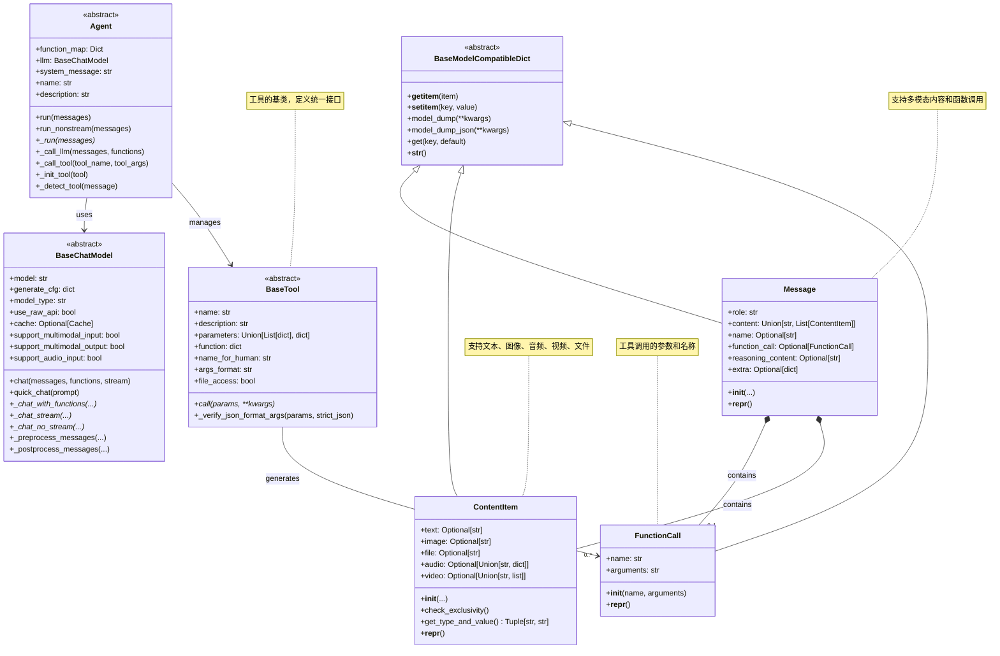
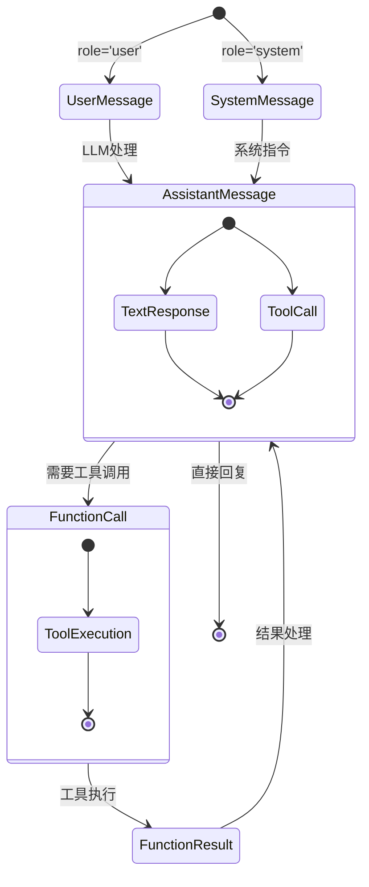
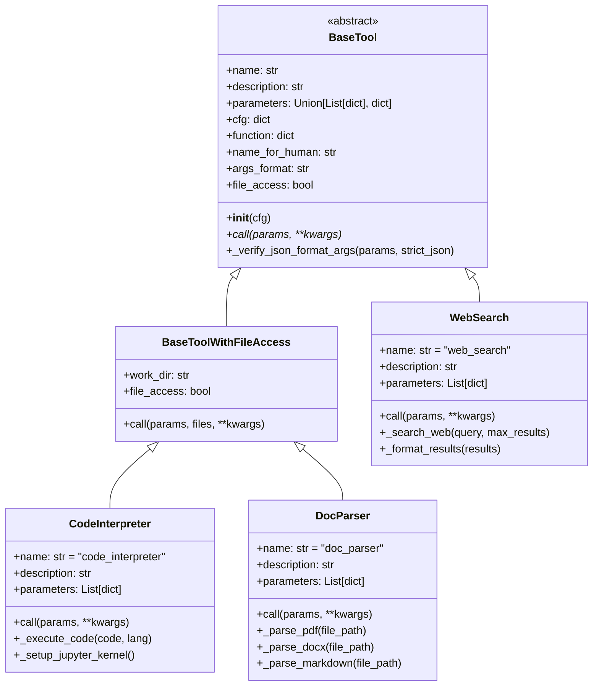
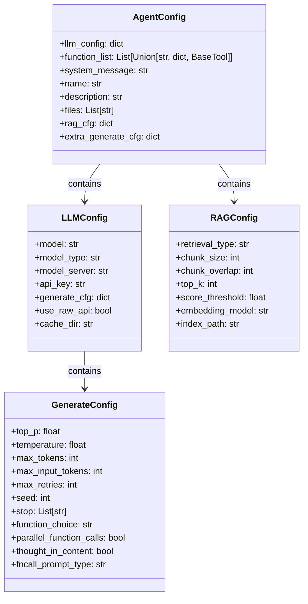
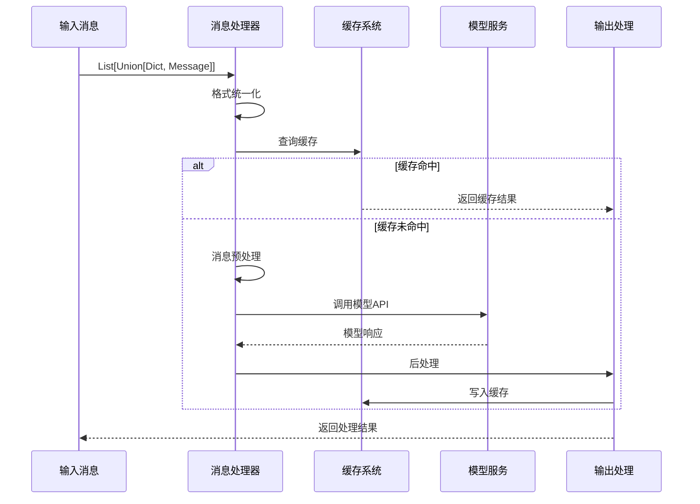
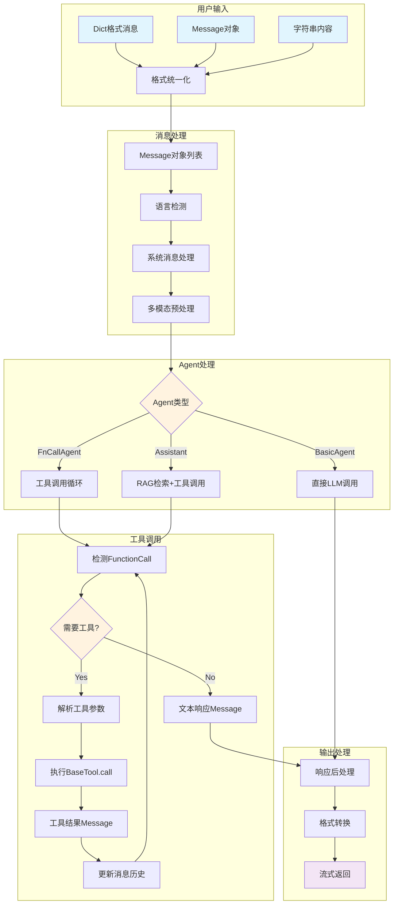

## 📝 概述

Qwen-Agent框架中的数据结构设计精巧而功能完备，支持多模态内容、函数调用、消息传递等核心功能。本文档通过UML图和详细说明，深入解析框架中的关键数据结构。

## 🏗️ 核心数据结构总览

### 数据结构关系图



## 📋 消息系统数据结构

### 1. Message类详细设计

```python
class Message(BaseModelCompatibleDict):
    """统一的消息数据结构
    
    设计目标:
        1. 支持多种角色的消息（用户、助手、系统、函数）
        2. 支持多模态内容（文本、图像、音频、视频、文件）
        3. 支持函数调用和推理过程
        4. 提供灵活的扩展机制
    
    核心字段:
        role: 消息角色，值为 'user'|'assistant'|'system'|'function'
        content: 消息内容，可以是字符串或ContentItem列表
        name: 发送者名称，用于多Agent场景的身份标识
        function_call: 函数调用信息，包含函数名和参数
        reasoning_content: 推理过程内容，用于支持思维链模型
        extra: 额外信息字典，提供扩展能力
    
    使用场景:
        - 用户输入：role='user', content='用户问题'
        - 助手回复：role='assistant', content='回答内容'
        - 系统指令：role='system', content='系统提示'
        - 函数调用：role='assistant', function_call=FunctionCall(...)
        - 函数结果：role='function', content='执行结果'
    """
    role: str
    content: Union[str, List[ContentItem]] = ''
    name: Optional[str] = None
    function_call: Optional[FunctionCall] = None
    reasoning_content: Optional[str] = None
    extra: Optional[dict] = None
    
    @field_validator('role')
    @classmethod
    def validate_role(cls, v):
        """角色验证器：确保角色值有效"""
        valid_roles = {'user', 'assistant', 'system', 'function'}
        if v not in valid_roles:
            raise ValueError(f'Role must be one of {valid_roles}, got {v}')
        return v
    
    @model_validator(mode='after')
    def check_function_message(self):
        """函数消息验证：function角色必须有name字段"""
        if self.role == FUNCTION and not self.name:
            raise ValueError('Function message must have a name')
        return self
    
    def is_multimodal(self) -> bool:
        """检查是否为多模态消息"""
        if isinstance(self.content, list):
            return any(item.image or item.audio or item.video or item.file 
                      for item in self.content)
        return False
    
    def get_text_content(self) -> str:
        """提取纯文本内容"""
        if isinstance(self.content, str):
            return self.content
        elif isinstance(self.content, list):
            texts = [item.text for item in self.content if item.text]
            return '\n'.join(texts)
        return ''
```

**Message类状态转换图**:



### 2. ContentItem类详细设计

```python
class ContentItem(BaseModelCompatibleDict):
    """多模态内容项数据结构
    
    设计原则:
        1. 互斥性：每个ContentItem只能包含一种类型的内容
        2. 可扩展性：支持新的多媒体类型
        3. 统一性：提供统一的访问接口
    
    支持的内容类型:
        text: 纯文本内容
        image: 图片内容，支持URL或base64编码
        file: 文件内容，通常是URL或文件路径
        audio: 音频内容，可以是字符串URL或包含元数据的字典
        video: 视频内容，可以是字符串URL或包含多个视频源的列表
    
    验证机制:
        - 确保每个实例只包含一种内容类型
        - 至少包含一种非空内容
        - 类型转换和格式验证
    """
    text: Optional[str] = None
    image: Optional[str] = None  
    file: Optional[str] = None
    audio: Optional[Union[str, dict]] = None
    video: Optional[Union[str, list]] = None
    
    @model_validator(mode='after')
    def check_exclusivity(self):
        """互斥性检查：确保只有一个字段非空"""
        provided_fields = 0
        if self.text is not None:
            provided_fields += 1
        if self.image:
            provided_fields += 1
        if self.file:
            provided_fields += 1
        if self.audio:
            provided_fields += 1
        if self.video:
            provided_fields += 1
            
        if provided_fields == 0:
            raise ValueError('At least one content field must be provided')
        elif provided_fields > 1:
            raise ValueError('Only one content field can be provided')
        return self
    
    def get_type_and_value(self) -> Tuple[str, Union[str, dict, list]]:
        """获取内容类型和值的统一接口
        
        返回:
            Tuple[str, Union[str, dict, list]]: (类型名称, 内容值)
        
        使用示例:
            content_type, content_value = item.get_type_and_value()
            if content_type == 'text':
                print(f"文本内容: {content_value}")
            elif content_type == 'image':
                print(f"图片URL: {content_value}")
        """
        if self.text is not None:
            return 'text', self.text
        elif self.image is not None:
            return 'image', self.image
        elif self.file is not None:
            return 'file', self.file
        elif self.audio is not None:
            return 'audio', self.audio
        elif self.video is not None:
            return 'video', self.video
        else:
            return 'text', ''
    
    def is_media_content(self) -> bool:
        """判断是否为媒体内容（非文本）"""
        return bool(self.image or self.audio or self.video)
    
    def get_file_extension(self) -> Optional[str]:
        """获取文件扩展名（如果适用）"""
        content_type, content_value = self.get_type_and_value()
        if content_type in ['image', 'file'] and isinstance(content_value, str):
            if '.' in content_value:
                return content_value.split('.')[-1].lower()
        return None
```

**ContentItem类型关系图**:

```mermaid
graph TB
    A[ContentItem] --> B{内容类型}
    
    B -->|text| C[TextContent<br/>纯文本内容]
    B -->|image| D[ImageContent<br/>图片内容]
    B -->|file| E[FileContent<br/>文件内容]
    B -->|audio| F[AudioContent<br/>音频内容]
    B -->|video| G[VideoContent<br/>视频内容]
    
    C --> C1[字符串文本]
    
    D --> D1[URL地址]
    D --> D2[Base64编码]
    
    E --> E1[本地文件路径]
    E --> E2[网络文件URL]
    
    F --> F1[URL字符串]
    F --> F2[元数据字典<br/>{url, duration, format}]
    
    G --> G1[URL字符串]
    G --> G2[视频源列表<br/>[{url, quality, format}]]
    
    style A fill:#e1f5fe
    style B fill:#fff3e0
    style C fill:#e8f5e8
    style D fill:#fce4ec
    style E fill:#f3e5f5
    style F fill:#f1f8e9
    style G fill:#fff9c4
```

### 3. FunctionCall类详细设计

```python
class FunctionCall(BaseModelCompatibleDict):
    """函数调用数据结构
    
    设计目的:
        1. 标准化工具调用接口
        2. 支持复杂参数传递
        3. 兼容OpenAI函数调用格式
        4. 提供调试和追踪能力
    
    核心字段:
        name: 函数名称，对应注册的工具名称
        arguments: 函数参数，JSON格式字符串
    
    使用流程:
        1. LLM生成FunctionCall对象
        2. Agent解析function_call字段
        3. 根据name查找对应工具
        4. 传递arguments给工具执行
        5. 获取工具执行结果
    
    JSON格式示例:
        {
            "name": "web_search",
            "arguments": "{\"query\": \"Python机器学习\", \"max_results\": 5}"
        }
    """
    name: str
    arguments: str
    
    def __init__(self, name: str, arguments: str):
        """初始化函数调用
        
        参数验证:
            - name不能为空
            - arguments必须是有效的JSON字符串
        """
        super().__init__(name=name, arguments=arguments)
    
    @field_validator('name')
    @classmethod  
    def validate_name(cls, v):
        """函数名验证"""
        if not v or not v.strip():
            raise ValueError('Function name cannot be empty')
        return v.strip()
    
    @field_validator('arguments')
    @classmethod
    def validate_arguments(cls, v):
        """参数格式验证"""
        if not isinstance(v, str):
            raise ValueError('Arguments must be a JSON string')
        
        try:
            import json
            json.loads(v)  # 验证是否为有效JSON
        except json.JSONDecodeError:
            raise ValueError('Arguments must be valid JSON string')
        
        return v
    
    def get_parsed_arguments(self) -> dict:
        """获取解析后的参数字典
        
        返回:
            dict: 解析后的参数字典
            
        异常:
            json.JSONDecodeError: 参数格式无效时抛出
        """
        import json
        return json.loads(self.arguments)
    
    def add_argument(self, key: str, value) -> 'FunctionCall':
        """添加参数（返回新实例）
        
        参数:
            key: 参数名称
            value: 参数值
            
        返回:
            FunctionCall: 新的函数调用实例
        """
        import json
        current_args = self.get_parsed_arguments()
        current_args[key] = value
        new_arguments = json.dumps(current_args, ensure_ascii=False)
        return FunctionCall(name=self.name, arguments=new_arguments)
```

## 🛠️ 工具系统数据结构

### BaseTool类详细设计



**BaseTool参数格式规范**:

```python
# 列表格式（传统格式）
parameters = [
    {
        'name': 'query',
        'type': 'string',
        'description': '搜索关键词',
        'required': True
    },
    {
        'name': 'max_results',
        'type': 'integer', 
        'description': '最大结果数量',
        'required': False,
        'default': 10
    }
]

# OpenAI JSON Schema格式（推荐）
parameters = {
    'type': 'object',
    'properties': {
        'query': {
            'type': 'string',
            'description': '搜索关键词'
        },
        'max_results': {
            'type': 'integer',
            'description': '最大结果数量',
            'default': 10
        }
    },
    'required': ['query']
}
```

### 工具注册机制

```python
# 全局工具注册表
TOOL_REGISTRY: Dict[str, Type[BaseTool]] = {}

def register_tool(name: str, allow_overwrite: bool = False):
    """工具注册装饰器
    
    功能:
        1. 验证工具名称唯一性
        2. 设置工具名称属性
        3. 注册到全局注册表
        4. 支持覆盖已存在工具
    
    参数:
        name: 工具名称，必须唯一
        allow_overwrite: 是否允许覆盖已存在工具
    """
    def decorator(cls: Type[BaseTool]):
        # 1. 重复性检查
        if name in TOOL_REGISTRY:
            if allow_overwrite:
                logger.warning(f'Tool `{name}` already exists! Overwriting with class {cls}.')
            else:
                raise ValueError(f'Tool `{name}` already exists! Please ensure that the tool name is unique.')
        
        # 2. 名称一致性检查
        if cls.name and (cls.name != name):
            raise ValueError(f'{cls.__name__}.name="{cls.name}" conflicts with @register_tool(name="{name}").')
        
        # 3. 设置工具名称并注册
        cls.name = name
        TOOL_REGISTRY[name] = cls
        
        return cls
    
    return decorator

# 使用示例
@register_tool('custom_calculator')
class CalculatorTool(BaseTool):
    description = '执行数学计算'
    parameters = {
        'type': 'object',
        'properties': {
            'expression': {
                'type': 'string',
                'description': '数学表达式，如 "2 + 3 * 4"'
            }
        },
        'required': ['expression']
    }
    
    def call(self, params: str, **kwargs) -> str:
        params_dict = self._verify_json_format_args(params)
        expression = params_dict['expression']
        
        try:
            result = eval(expression)  # 实际应用中应使用安全的表达式求值
            return f"计算结果: {expression} = {result}"
        except Exception as e:
            return f"计算错误: {str(e)}"
```

## 🤖 Agent系统数据结构

### Agent配置数据结构



**Agent配置示例**:

```python
# 完整的Agent配置示例
agent_config = {
    # LLM配置
    'llm': {
        'model': 'qwen3-235b-a22b',
        'model_type': 'qwen_dashscope',
        'model_server': 'https://dashscope.aliyuncs.com/compatible-mode/v1',
        'api_key': 'your_api_key',
        'generate_cfg': {
            'top_p': 0.8,
            'temperature': 0.7,
            'max_tokens': 2000,
            'max_input_tokens': 6000,
            'max_retries': 3,
            'seed': 42,
            'stop': ['<|endoftext|>'],
            'function_choice': 'auto',
            'parallel_function_calls': True,
            'thought_in_content': False,
            'fncall_prompt_type': 'nous'
        },
        'use_raw_api': False,
        'cache_dir': './cache'
    },
    
    # 工具配置
    'function_list': [
        'code_interpreter',  # 字符串形式
        {                    # 字典配置形式
            'name': 'web_search',
            'timeout': 30,
            'max_results': 10
        },
        CustomTool()         # 实例形式
    ],
    
    # Agent基本信息
    'system_message': '你是一个专业的AI助手...',
    'name': '专业助手',
    'description': '具备代码执行和搜索能力的AI助手',
    
    # 文件和RAG配置
    'files': ['./docs/manual.pdf', 'https://example.com/data.json'],
    'rag_cfg': {
        'retrieval_type': 'hybrid',
        'chunk_size': 500,
        'chunk_overlap': 50,
        'top_k': 5,
        'score_threshold': 0.7,
        'embedding_model': 'text-embedding-v1',
        'index_path': './rag_index'
    }
}
```

## 📊 LLM服务数据结构

### LLM消息处理流程数据结构



### 模型响应数据结构

```python
class ModelResponse(BaseModelCompatibleDict):
    """模型响应数据结构
    
    用途:
        统一不同模型服务的响应格式
        支持流式和非流式响应
        包含元数据和使用统计
    """
    messages: List[Message]
    usage: Optional[dict] = None
    model: Optional[str] = None
    finish_reason: Optional[str] = None
    response_id: Optional[str] = None
    created: Optional[int] = None
    
    def get_content(self) -> str:
        """获取响应内容"""
        if self.messages:
            return self.messages[-1].get_text_content()
        return ''
    
    def get_function_calls(self) -> List[FunctionCall]:
        """获取所有函数调用"""
        function_calls = []
        for msg in self.messages:
            if msg.function_call:
                function_calls.append(msg.function_call)
        return function_calls

class Usage(BaseModelCompatibleDict):
    """模型使用统计"""
    prompt_tokens: int = 0
    completion_tokens: int = 0  
    total_tokens: int = 0
    cost: Optional[float] = None
    
    def __add__(self, other: 'Usage') -> 'Usage':
        """支持使用统计累加"""
        return Usage(
            prompt_tokens=self.prompt_tokens + other.prompt_tokens,
            completion_tokens=self.completion_tokens + other.completion_tokens,
            total_tokens=self.total_tokens + other.total_tokens,
            cost=(self.cost or 0) + (other.cost or 0)
        )
```

## 🔄 数据流转完整流程

### 端到端数据流图



## 🎯 数据结构设计原则总结

### 1. 统一抽象原则
- **BaseModelCompatibleDict**: 提供统一的字典和对象访问接口
- **Message**: 统一所有消息格式，支持多模态和函数调用
- **BaseTool**: 统一所有工具接口，简化工具开发

### 2. 类型安全原则
- 使用Pydantic进行数据验证和类型检查
- 提供完整的类型注解
- 运行时参数验证和错误提示

### 3. 扩展性原则
- **extra字段**: 提供灵活的扩展机制
- **ContentItem**: 支持新的多媒体类型扩展
- **工具注册机制**: 支持动态工具注册和管理

### 4. 兼容性原则
- 支持Dict和对象两种访问方式
- 兼容OpenAI API格式
- 向后兼容的字段设计

### 5. 性能优化原则
- 延迟计算和缓存机制
- 流式处理支持
- 内存高效的数据结构

## 📈 数据结构使用最佳实践

### 1. Message创建最佳实践

```python
# ✅ 推荐：使用明确的参数
user_message = Message(
    role='user',
    content='请帮我分析这张图片',
    name='用户A'
)

# ✅ 推荐：多模态内容
multimodal_message = Message(
    role='user',
    content=[
        ContentItem(text='请分析这张图片的内容'),
        ContentItem(image='https://example.com/image.jpg')
    ]
)

# ❌ 避免：空内容消息
empty_message = Message(role='user', content='')

# ❌ 避免：混合内容类型的ContentItem
invalid_item = ContentItem(text='文本', image='图片')  # 会抛出验证错误
```

### 2. 工具开发最佳实践

```python
@register_tool('file_processor')
class FileProcessor(BaseTool):
    """文件处理工具 - 最佳实践示例"""
    
    description = '处理和分析各种格式的文件'
    
    # ✅ 推荐：使用JSON Schema格式
    parameters = {
        'type': 'object',
        'properties': {
            'file_path': {
                'type': 'string',
                'description': '要处理的文件路径'
            },
            'operation': {
                'type': 'string', 
                'enum': ['read', 'analyze', 'convert'],
                'description': '操作类型'
            },
            'options': {
                'type': 'object',
                'properties': {
                    'format': {'type': 'string'},
                    'encoding': {'type': 'string', 'default': 'utf-8'}
                },
                'description': '额外选项'
            }
        },
        'required': ['file_path', 'operation']
    }
    
    def call(self, params: str, **kwargs) -> str:
        # ✅ 推荐：使用内置验证方法
        params_dict = self._verify_json_format_args(params)
        
        file_path = params_dict['file_path']
        operation = params_dict['operation']
        options = params_dict.get('options', {})
        
        # ✅ 推荐：完善的错误处理
        try:
            if operation == 'read':
                return self._read_file(file_path, options)
            elif operation == 'analyze':
                return self._analyze_file(file_path, options)
            elif operation == 'convert':
                return self._convert_file(file_path, options)
        except FileNotFoundError:
            return f"错误：文件 {file_path} 不存在"
        except PermissionError:
            return f"错误：没有权限访问文件 {file_path}"
        except Exception as e:
            return f"处理文件时发生错误：{str(e)}"
```

### 3. 配置数据结构最佳实践

```python
# ✅ 推荐：分层配置结构
config = {
    'llm': {
        'model': 'qwen3-235b-a22b',
        'model_type': 'qwen_dashscope', 
        'generate_cfg': {
            'top_p': 0.8,
            'max_input_tokens': 6000,
            'function_choice': 'auto'
        }
    },
    'tools': [
        'code_interpreter',
        {'name': 'web_search', 'timeout': 30}
    ],
    'system_message': '你是一个专业助手...',
    'rag_cfg': {
        'chunk_size': 500,
        'top_k': 5
    }
}

# ❌ 避免：平铺的配置结构
flat_config = {
    'model': 'qwen3-235b-a22b',
    'top_p': 0.8,
    'tools': ['code_interpreter'],
    'chunk_size': 500,
    'max_tokens': 2000,
    # ... 难以维护的平铺结构
}
```

---

*本数据结构UML文档基于Qwen-Agent v0.0.30版本，详细描述了框架中的核心数据结构设计和使用方法。*
