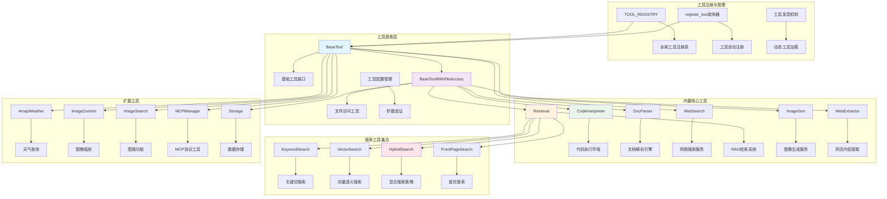
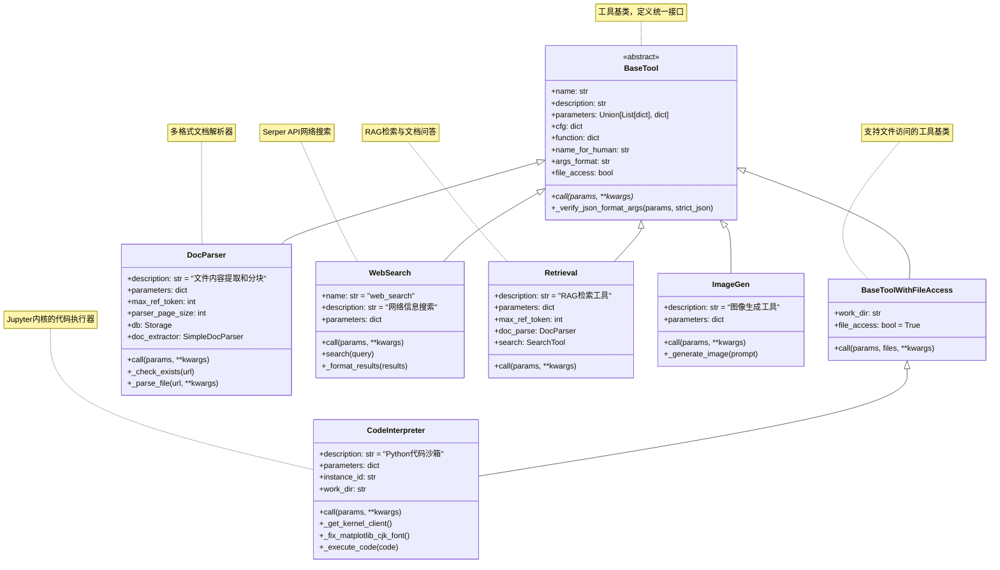
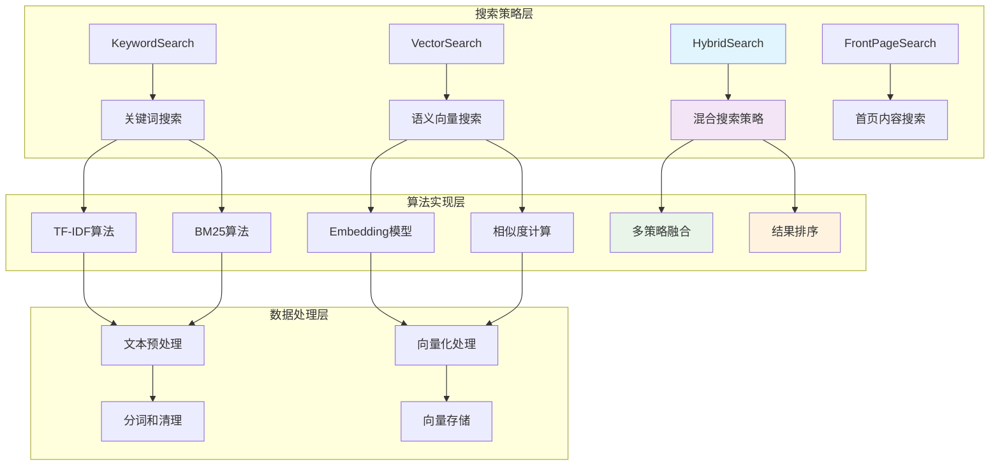

## 📝 概述

Tools工具系统是Qwen-Agent框架的核心能力之一，为Agent提供了与外部世界交互的能力。通过统一的工具接口，Agent可以执行代码、搜索网络、解析文档、生成图片等各种复杂任务。本文档深入分析工具系统的设计原理、核心组件和具体实现。

## 🏗️ Tools模块架构设计

### 工具系统整体架构图



### 核心类继承关系图



## 🔧 BaseTool基类详细分析

### BaseTool核心设计

```python
class BaseTool(ABC):
    """工具基类 - 定义所有工具的统一接口
    
    设计原则:
        1. 统一接口：所有工具都遵循相同的调用规范
        2. 参数验证：内置参数格式验证和类型检查
        3. 错误处理：统一的异常处理机制
        4. 可扩展性：支持灵活的参数配置和功能扩展
        5. 文档化：强制要求工具描述和参数说明
    
    核心属性:
        name: 工具名称，全局唯一标识符
        description: 工具功能描述，用于Agent理解工具用途
        parameters: 参数定义，支持列表和OpenAI JSON Schema格式
        cfg: 工具配置，包含个性化设置
    
    关键方法:
        call(): 工具执行入口，子类必须实现
        _verify_json_format_args(): 参数验证方法
        function: 工具信息属性，用于Agent函数调用
    """
    
    # 类属性定义
    name: str = ''                    # 工具名称
    description: str = ''             # 功能描述
    parameters: Union[List[dict], dict] = []  # 参数定义
    
    def __init__(self, cfg: Optional[dict] = None):
        """BaseTool初始化
        
        初始化流程:
            1. 验证工具名称的有效性
            2. 参数格式规范性检查
            3. 配置信息加载和验证
        
        异常处理:
            - ValueError: 工具名称为空或参数格式错误
            - jsonschema.ValidationError: JSON Schema验证失败
        """
        self.cfg = cfg or {}
        
        # 1. 工具名称验证
        if not self.name:
            raise ValueError(
                f'You must set {self.__class__.__name__}.name, '
                f'either by @register_tool(name=...) or explicitly setting {self.__class__.__name__}.name'
            )
        
        # 2. 参数格式验证（针对JSON Schema格式）
        if isinstance(self.parameters, dict):
            if not is_tool_schema({
                'name': self.name, 
                'description': self.description, 
                'parameters': self.parameters
            }):
                raise ValueError(
                    'The parameters, when provided as a dict, '
                    'must conform to a valid openai-compatible JSON schema.'
                )
    
    @abstractmethod
    def call(self, params: Union[str, dict], **kwargs) -> Union[str, list, dict, List[ContentItem]]:
        """工具调用的核心接口
        
        这是每个工具必须实现的核心方法，定义了工具的具体执行逻辑
        
        参数说明:
            params: 工具参数，可以是JSON字符串或字典
                   - str: JSON格式的参数字符串（常见情况）
                   - dict: 直接传递的参数字典
            **kwargs: 额外的上下文参数
                     - messages: 当前对话消息历史
                     - files: 相关文件列表
                     - 其他Agent传递的上下文信息
        
        返回值类型:
            - str: 文本结果（最常见）
            - list: 结构化数据列表
            - dict: 结构化数据字典
            - List[ContentItem]: 多模态内容列表
        
        实现要求:
            1. 使用_verify_json_format_args()验证参数
            2. 提供详细的错误信息和异常处理
            3. 返回格式化的、对Agent友好的结果
            4. 记录必要的日志信息
        """
        raise NotImplementedError
    
    def _verify_json_format_args(self, params: Union[str, dict], strict_json: bool = False) -> dict:
        """参数验证方法 - 确保工具参数格式正确
        
        验证流程:
            1. JSON格式解析和验证
            2. 必需参数存在性检查
            3. 参数类型和值域验证
            4. 返回标准化的参数字典
        
        参数说明:
            params: 待验证的参数
            strict_json: 是否使用严格的JSON解析
        
        返回值:
            dict: 验证通过的参数字典
        
        异常:
            ValueError: 参数格式错误或缺少必需参数
            json.JSONDecodeError: JSON解析失败
        """
        # 1. 参数类型转换
        if isinstance(params, str):
            try:
                if strict_json:
                    params_json: dict = json.loads(params)
                else:
                    # 使用json5支持更宽松的JSON格式
                    params_json: dict = json_loads(params)
            except json.decoder.JSONDecodeError as e:
                raise ValueError(f'Parameters must be formatted as valid JSON: {e}')
        else:
            params_json: dict = params
        
        # 2. 参数验证（基于parameters定义）
        if isinstance(self.parameters, list):
            # 列表格式参数验证
            for param in self.parameters:
                if param.get('required', False):
                    if param['name'] not in params_json:
                        raise ValueError(f'Parameters {param["name"]} is required!')
        elif isinstance(self.parameters, dict):
            # JSON Schema格式验证
            import jsonschema
            try:
                jsonschema.validate(instance=params_json, schema=self.parameters)
            except jsonschema.ValidationError as e:
                raise ValueError(f'Parameter validation failed: {e.message}')
        else:
            raise ValueError('Invalid parameters definition format')
        
        return params_json
    
    @property
    def function(self) -> dict:
        """工具函数信息 - 用于Agent函数调用
        
        返回OpenAI函数调用格式的工具描述，包含：
        - name: 工具名称
        - description: 功能描述
        - parameters: 参数定义
        
        这个属性被Agent用于构建functions列表，传递给LLM进行函数调用
        """
        return {
            'name': self.name,
            'description': self.description,
            'parameters': self.parameters,
        }
    
    @property
    def name_for_human(self) -> str:
        """人类可读的工具名称
        
        优先级：配置中的name_for_human > 工具name
        用于GUI界面显示和用户交互
        """
        return self.cfg.get('name_for_human', self.name)
    
    @property
    def args_format(self) -> str:
        """参数格式说明 - 帮助Agent理解如何使用工具
        
        自动根据工具的语言环境生成适当的格式说明：
        - 中文环境：返回中文说明
        - 英文环境：返回英文说明
        """
        fmt = self.cfg.get('args_format')
        if fmt is None:
            # 检查是否包含中文字符
            if has_chinese_chars([self.name_for_human, self.name, self.description, self.parameters]):
                fmt = '此工具的输入应为JSON对象。'
            else:
                fmt = 'Format the arguments as a JSON object.'
        return fmt
    
    @property
    def file_access(self) -> bool:
        """工具是否需要文件访问权限
        
        返回值:
            False: 基础工具不需要文件访问
        
        子类可以重写此属性以声明文件访问需求
        """
        return False
```

### 工具注册机制详解

```python
# 全局工具注册表
TOOL_REGISTRY: Dict[str, Type[BaseTool]] = {}

def register_tool(name: str, allow_overwrite: bool = False):
    """工具注册装饰器 - 实现工具的自动发现和注册
    
    设计目标:
        1. 自动化注册：通过装饰器自动将工具注册到全局注册表
        2. 名称管理：确保工具名称的唯一性和一致性
        3. 覆盖控制：提供安全的工具覆盖机制
        4. 运行时发现：支持动态工具加载和管理
    
    使用方式:
        @register_tool('tool_name')
        class MyTool(BaseTool):
            pass
    
    参数说明:
        name: 工具名称，必须全局唯一
        allow_overwrite: 是否允许覆盖已存在的工具
    
    注册流程:
        1. 检查工具名称是否已存在
        2. 验证名称一致性
        3. 设置工具名称属性
        4. 注册到全局注册表
    """
    def decorator(cls: Type[BaseTool]):
        # 1. 重复注册检查
        if name in TOOL_REGISTRY:
            if allow_overwrite:
                logger.warning(f'Tool `{name}` already exists! Overwriting with class {cls}.')
            else:
                raise ValueError(
                    f'Tool `{name}` already exists! '
                    f'Please ensure that the tool name is unique.'
                )
        
        # 2. 名称一致性验证
        if hasattr(cls, 'name') and cls.name and (cls.name != name):
            raise ValueError(
                f'{cls.__name__}.name="{cls.name}" conflicts with @register_tool(name="{name}").'
            )
        
        # 3. 设置工具名称
        cls.name = name
        
        # 4. 注册到全局注册表
        TOOL_REGISTRY[name] = cls
        
        return cls
    
    return decorator

# 工具实例化函数
def get_tool_instance(tool_identifier: Union[str, dict, BaseTool]) -> BaseTool:
    """获取工具实例 - 统一的工具实例化接口
    
    支持多种输入格式:
        1. 字符串：工具名称，使用默认配置
        2. 字典：包含name和配置的字典
        3. 实例：直接返回工具实例
    
    参数说明:
        tool_identifier: 工具标识符
    
    返回值:
        BaseTool: 工具实例
    
    异常:
        ValueError: 工具名称不存在或配置格式错误
    """
    if isinstance(tool_identifier, BaseTool):
        # 已经是工具实例，直接返回
        return tool_identifier
    elif isinstance(tool_identifier, str):
        # 字符串格式：工具名称
        if tool_identifier not in TOOL_REGISTRY:
            raise ValueError(f'Tool {tool_identifier} is not registered.')
        tool_class = TOOL_REGISTRY[tool_identifier]
        return tool_class()
    elif isinstance(tool_identifier, dict):
        # 字典格式：包含name和配置
        tool_name = tool_identifier.get('name')
        if not tool_name:
            raise ValueError('Tool configuration must contain "name" field.')
        if tool_name not in TOOL_REGISTRY:
            raise ValueError(f'Tool {tool_name} is not registered.')
        
        tool_class = TOOL_REGISTRY[tool_name]
        tool_config = {k: v for k, v in tool_identifier.items() if k != 'name'}
        return tool_class(cfg=tool_config)
    else:
        raise ValueError(f'Invalid tool identifier type: {type(tool_identifier)}')
```

## 🛠️ 核心内置工具详解

### 1. CodeInterpreter - 代码执行器

```python
@register_tool('code_interpreter')
class CodeInterpreter(BaseToolWithFileAccess):
    """Python代码沙箱执行器
    
    核心功能:
        1. 安全的Python代码执行环境
        2. Jupyter内核集成，支持状态保持
        3. 图表生成和可视化支持
        4. 文件系统访问和管理
        5. 多实例隔离执行
    
    技术特点:
        - 基于Jupyter内核的代码执行
        - 自动中文字体配置（matplotlib）
        - 实例级别的工作目录隔离
        - 完整的错误捕获和日志记录
        - 支持异步代码执行
    
    安全考虑:
        - 工作目录隔离
        - 子进程管理和清理
        - 资源使用监控
        - 危险操作限制
    """
    
    description = 'Python code sandbox, which can be used to execute Python code.'
    parameters = {
        'type': 'object',
        'properties': {
            'code': {
                'description': 'The python code.',
                'type': 'string',
            }
        },
        'required': ['code'],
    }
    
    def __init__(self, cfg: Optional[Dict] = None):
        """CodeInterpreter初始化
        
        初始化过程:
            1. 调用父类初始化，设置工作目录
            2. 生成唯一实例ID，确保多实例隔离
            3. 检查依赖项（Jupyter、matplotlib等）
            4. 配置代码执行环境
        """
        super().__init__(cfg)
        
        # 1. 工作目录配置（支持环境变量覆盖）
        self.work_dir: str = os.getenv('M6_CODE_INTERPRETER_WORK_DIR', self.work_dir)
        self.work_dir: str = self.cfg.get('work_dir', self.work_dir)
        
        # 2. 实例ID生成（确保多实例隔离）
        self.instance_id: str = str(uuid.uuid4())
        
        # 3. 依赖检查
        _check_deps_for_code_interpreter()
    
    def call(self, params: Union[str, dict], **kwargs) -> str:
        """执行Python代码
        
        执行流程:
            1. 参数解析和验证
            2. 代码预处理（提取代码块）
            3. Jupyter内核获取和初始化
            4. 代码执行和结果捕获
            5. 错误处理和日志记录
            6. 结果格式化和返回
        
        参数说明:
            params: 包含code字段的参数
            **kwargs: 额外上下文参数
        
        返回值:
            str: 代码执行结果，包含输出和错误信息
        """
        # 1. 参数验证
        params = self._verify_json_format_args(params)
        code_input = params['code']
        
        # 2. 代码提取（从markdown代码块中提取）
        code_blocks = extract_code(code_input)
        
        if not code_blocks:
            return 'No Python code found in the input.'
        
        # 3. 初始化执行环境
        os.makedirs(self.work_dir, exist_ok=True)
        
        result_messages = []
        
        # 4. 逐个执行代码块
        for i, code_block in enumerate(code_blocks):
            try:
                # 获取或创建Jupyter内核客户端
                kernel_client = self._get_kernel_client()
                
                # 执行代码
                execution_result = self._execute_code(code_block, kernel_client)
                
                result_messages.append(f"Code block {i+1} executed successfully:")
                result_messages.append(execution_result)
                
            except Exception as e:
                error_msg = f"Error executing code block {i+1}: {str(e)}"
                logger.error(error_msg)
                result_messages.append(error_msg)
        
        return '\n'.join(result_messages)
    
    def _get_kernel_client(self):
        """获取或创建Jupyter内核客户端
        
        内核管理策略:
            1. 实例级别的内核复用
            2. 自动内核启动和连接
            3. 异常时的内核重启机制
            4. 资源清理和生命周期管理
        """
        if self.instance_id in _KERNEL_CLIENTS:
            return _KERNEL_CLIENTS[self.instance_id]
        
        # 创建新的内核客户端
        kernel_client = self._create_kernel_client()
        _KERNEL_CLIENTS[self.instance_id] = kernel_client
        
        # 初始化代码执行（字体配置等）
        self._initialize_kernel(kernel_client)
        
        return kernel_client
    
    def _create_kernel_client(self):
        """创建Jupyter内核客户端
        
        创建过程:
            1. 启动独立的Jupyter内核进程
            2. 建立客户端连接
            3. 配置内核参数
            4. 注册清理处理器
        """
        try:
            import jupyter_client
        except ImportError:
            raise ImportError('jupyter_client is required for code execution.')
        
        # 内核管理器配置
        km = jupyter_client.KernelManager()
        km.start_kernel(
            cwd=self.work_dir,
            extra_arguments=[
                '--IPKernelApp.parent_appname=qwen_agent',
            ]
        )
        
        # 创建客户端连接
        kc = km.client()
        kc.start_channels()
        
        return kc
    
    def _initialize_kernel(self, kernel_client):
        """初始化内核环境
        
        初始化内容:
            1. matplotlib中文字体配置
            2. 工作目录设置
            3. 常用库导入
            4. 环境变量配置
        """
        # 中文字体配置代码
        init_code = f"""
import os
import sys
os.chdir('{self.work_dir}')

# Configure matplotlib for Chinese font support
try:
    import matplotlib.pyplot as plt
    import matplotlib
    font_path = '{ALIB_FONT_FILE}'
    if os.path.exists(font_path):
        matplotlib.font_manager.fontManager.addfont(font_path)
        plt.rcParams['font.sans-serif'] = ['AlibabaPuHuiTi-3-45-Light']
        plt.rcParams['axes.unicode_minus'] = False
except ImportError:
    pass

print("Code interpreter initialized successfully.")
"""
        
        # 执行初始化代码
        self._execute_code(init_code, kernel_client)
    
    def _execute_code(self, code: str, kernel_client) -> str:
        """执行单段代码
        
        执行流程:
            1. 提交代码到内核
            2. 监听执行消息
            3. 收集输出结果
            4. 处理错误和异常
            5. 格式化返回结果
        
        参数说明:
            code: 要执行的Python代码
            kernel_client: Jupyter内核客户端
        
        返回值:
            str: 执行结果，包含标准输出、错误输出等
        """
        # 提交代码执行
        msg_id = kernel_client.execute(code, silent=False, store_history=True)
        
        outputs = []
        errors = []
        
        # 监听执行结果
        while True:
            try:
                # 获取执行消息（超时处理）
                msg = kernel_client.get_iopub_msg(timeout=10)
                
                if msg['parent_header'].get('msg_id') == msg_id:
                    msg_type = msg['header']['msg_type']
                    content = msg['content']
                    
                    if msg_type == 'stream':
                        # 标准输出/错误输出
                        stream_content = content['text']
                        if content['name'] == 'stdout':
                            outputs.append(stream_content)
                        elif content['name'] == 'stderr':
                            errors.append(stream_content)
                    
                    elif msg_type == 'execute_result':
                        # 执行结果
                        if 'text/plain' in content['data']:
                            outputs.append(content['data']['text/plain'])
                    
                    elif msg_type == 'display_data':
                        # 显示数据（图像等）
                        if 'image/png' in content['data']:
                            # 保存图像到工作目录
                            image_filename = self._save_image(content['data']['image/png'])
                            outputs.append(f"Generated image saved as: {image_filename}")
                    
                    elif msg_type == 'error':
                        # 执行错误
                        error_name = content['ename']
                        error_value = content['evalue']
                        traceback = '\n'.join(content['traceback'])
                        errors.append(f"{error_name}: {error_value}\n{traceback}")
                    
                    elif msg_type == 'status' and content['execution_state'] == 'idle':
                        # 执行完成
                        break
            
            except queue.Empty:
                # 执行超时
                errors.append("Code execution timeout")
                break
            except Exception as e:
                errors.append(f"Execution error: {str(e)}")
                break
        
        # 格式化结果
        result_parts = []
        
        if outputs:
            result_parts.append("Output:")
            result_parts.extend(outputs)
        
        if errors:
            result_parts.append("Errors:")
            result_parts.extend(errors)
        
        if not outputs and not errors:
            result_parts.append("Code executed successfully (no output)")
        
        return '\n'.join(result_parts)
    
    def _save_image(self, image_data: str) -> str:
        """保存生成的图像
        
        参数说明:
            image_data: base64编码的图像数据
        
        返回值:
            str: 保存的图像文件名
        """
        import base64
        
        # 生成唯一文件名
        timestamp = int(time.time())
        filename = f"generated_image_{timestamp}.png"
        filepath = os.path.join(self.work_dir, filename)
        
        # 保存图像
        with open(filepath, 'wb') as f:
            f.write(base64.b64decode(image_data))
        
        return filename
```

### 2. WebSearch - 网络搜索工具

```python
@register_tool('web_search', allow_overwrite=True)
class WebSearch(BaseTool):
    """网络搜索工具 - 基于Serper API的搜索服务
    
    核心功能:
        1. Google搜索结果获取
        2. 搜索结果结构化处理
        3. 多语言搜索支持
        4. 结果格式化和摘要
    
    技术特点:
        - 集成Serper.dev API服务
        - 结构化搜索结果返回
        - 自动结果格式化
        - 支持搜索参数自定义
    
    使用场景:
        - 实时信息查询
        - 新闻搜索和跟踪
        - 研究资料收集
        - 事实验证和核实
    """
    
    name = 'web_search'
    description = 'Search for information from the internet.'
    parameters = {
        'type': 'object',
        'properties': {
            'query': {
                'type': 'string',
                'description': 'The search query string'
            }
        },
        'required': ['query'],
    }
    
    def call(self, params: Union[str, dict], **kwargs) -> str:
        """执行网络搜索
        
        搜索流程:
            1. 参数验证和解析
            2. 调用Serper API进行搜索
            3. 结果处理和格式化
            4. 返回结构化搜索结果
        
        参数说明:
            params: 包含query字段的搜索参数
        
        返回值:
            str: 格式化的搜索结果
        """
        # 1. 参数验证
        params = self._verify_json_format_args(params)
        query = params['query']
        
        try:
            # 2. 执行搜索
            search_results = self.search(query)
            
            # 3. 格式化结果
            formatted_results = self._format_results(search_results)
            
            return formatted_results
            
        except Exception as e:
            error_msg = f"搜索失败: {str(e)}"
            logger.error(error_msg)
            return error_msg
    
    @staticmethod
    def search(query: str) -> List[Any]:
        """调用Serper API执行搜索
        
        API配置:
            - SERPER_API_KEY: API密钥（环境变量）
            - SERPER_URL: API端点URL
        
        参数说明:
            query: 搜索查询字符串
        
        返回值:
            List[Any]: 原始搜索结果列表
        
        异常:
            ValueError: API密钥未配置
            requests.RequestException: API调用失败
        """
        # 1. API密钥检查
        if not SERPER_API_KEY:
            raise ValueError(
                'SERPER_API_KEY is None! Please apply for an API key from https://serper.dev '
                'and set it as an environment variable: export SERPER_API_KEY=xxxxxx'
            )
        
        # 2. 构建请求
        headers = {
            'Content-Type': 'application/json',
            'X-API-KEY': SERPER_API_KEY
        }
        payload = {'q': query}
        
        # 3. 调用API
        response = requests.post(SERPER_URL, json=payload, headers=headers)
        response.raise_for_status()
        
        # 4. 解析结果
        response_data = response.json()
        return response_data.get('organic', [])
    
    @staticmethod
    def _format_results(search_results: List[Any]) -> str:
        """格式化搜索结果
        
        格式化策略:
            1. 提取关键信息（标题、摘要、日期）
            2. 结构化展示
            3. 添加索引编号
            4. Markdown格式输出
        
        参数说明:
            search_results: 原始搜索结果列表
        
        返回值:
            str: 格式化的搜索结果字符串
        """
        if not search_results:
            return "未找到相关搜索结果。"
        
        # 格式化每个搜索结果
        formatted_items = []
        for i, result in enumerate(search_results, 1):
            title = result.get('title', 'No Title')
            snippet = result.get('snippet', 'No Description')
            date = result.get('date', '')
            url = result.get('link', '')
            
            # 构建单个结果的格式化字符串
            formatted_item = f"[{i}] **{title}**\n"
            formatted_item += f"   {snippet}\n"
            if date:
                formatted_item += f"   发布时间: {date}\n"
            formatted_item += f"   链接: {url}"
            
            formatted_items.append(formatted_item)
        
        # 组合所有结果
        result_content = '\n\n'.join(formatted_items)
        
        # 添加搜索结果头部
        header = f"搜索结果 (共找到 {len(search_results)} 条相关信息):\n\n"
        
        return header + result_content
```

### 3. DocParser - 文档解析工具

```python
@register_tool('doc_parser')
class DocParser(BaseTool):
    """文档解析工具 - 多格式文档内容提取和分块处理
    
    核心功能:
        1. 多格式文档解析（PDF、Word、PPT、HTML等）
        2. 智能分块和token管理
        3. 文档内容缓存和索引
        4. 元数据提取和管理
        5. 结构化内容输出
    
    技术特点:
        - 支持10+种文档格式
        - 智能分块算法，保持内容完整性
        - 基于token的长度控制
        - 持久化存储和缓存机制
        - 增量解析和更新
    
    支持格式:
        - PDF文档 (.pdf)
        - Word文档 (.docx, .doc)
        - PowerPoint (.pptx, .ppt)
        - HTML网页 (.html, .htm)
        - Markdown文档 (.md)
        - 纯文本文件 (.txt)
        - CSV数据文件 (.csv)
        - JSON数据文件 (.json)
    """
    
    description = '对一个文件进行内容提取和分块、返回分块后的文件内容'
    parameters = {
        'type': 'object',
        'properties': {
            'url': {
                'description': '待解析的文件的路径，可以是一个本地路径或可下载的http(s)链接',
                'type': 'string',
            }
        },
        'required': ['url'],
    }
    
    def __init__(self, cfg: Optional[Dict] = None):
        """DocParser初始化
        
        初始化组件:
            1. 配置参数加载
            2. 存储系统初始化
            3. 文档提取器创建
            4. 缓存机制设置
        """
        super().__init__(cfg)
        
        # 1. 配置参数
        self.max_ref_token: int = self.cfg.get('max_ref_token', DEFAULT_MAX_REF_TOKEN)
        self.parser_page_size: int = self.cfg.get('parser_page_size', DEFAULT_PARSER_PAGE_SIZE)
        
        # 2. 存储系统初始化
        self.data_root = self.cfg.get('path', os.path.join(DEFAULT_WORKSPACE, 'tools', self.name))
        self.db = Storage({'storage_root_path': self.data_root})
        
        # 3. 文档提取器
        self.doc_extractor = SimpleDocParser({'structured_doc': True})
    
    def call(self, params: Union[str, dict], **kwargs) -> dict:
        """文档解析主入口
        
        解析流程:
            1. 参数验证和URL处理
            2. 缓存检查（避免重复解析）
            3. 文档下载和预处理
            4. 内容提取和分块
            5. 结果存储和返回
        
        返回格式:
            {
                'url': '文件URL',
                'title': '提取的标题',
                'raw': [
                    {
                        'content': '分块内容',
                        'token': 'token数量',
                        'metadata': {}  # 元数据信息
                    },
                    ...
                ]
            }
        """
        # 1. 参数验证
        params = self._verify_json_format_args(params)
        url = params.get('url', params.get('file_path', ''))  # 兼容旧版本
        
        if not url:
            raise ValueError('URL parameter is required')
        
        # 2. 缓存检查
        if self._check_exists(url):
            logger.info(f"Document {url} already parsed, loading from cache")
            return self._load_from_cache(url)
        
        # 3. 执行解析
        try:
            result = self._parse_file(url, **kwargs)
            
            # 4. 存储结果
            self._save_to_cache(url, result)
            
            return result
            
        except Exception as e:
            error_msg = f"Document parsing failed for {url}: {str(e)}"
            logger.error(error_msg)
            raise DocParserError(error_msg)
    
    def _parse_file(self, url: str, **kwargs) -> dict:
        """执行文件解析
        
        解析步骤:
            1. 文档内容提取
            2. 标题和元数据提取
            3. 内容清理和预处理
            4. 智能分块处理
            5. Token计算和验证
        """
        # 1. 内容提取
        raw_content = self.doc_extractor.parse(url)
        
        if not raw_content:
            raise DocParserError(f"No content extracted from {url}")
        
        # 2. 提取标题
        title = self._extract_title(raw_content, url)
        
        # 3. 内容分块
        chunks = self._chunk_content(raw_content, url)
        
        # 4. 构建结果
        result = {
            'url': url,
            'title': title,
            'raw': [chunk.to_dict() for chunk in chunks]
        }
        
        return result
    
    def _chunk_content(self, content: str, url: str) -> List[Chunk]:
        """智能内容分块
        
        分块策略:
            1. 按段落分块，保持语义完整性
            2. 控制每个块的token数量
            3. 处理重叠内容，提供上下文
            4. 保留结构化信息
        
        参数说明:
            content: 原始文档内容
            url: 文档URL（用于元数据）
        
        返回值:
            List[Chunk]: 分块结果列表
        """
        chunks = []
        
        # 1. 按段落分割
        paragraphs = content.split(PARAGRAPH_SPLIT_SYMBOL)
        
        current_chunk = ""
        current_tokens = 0
        chunk_index = 0
        
        for paragraph in paragraphs:
            paragraph = paragraph.strip()
            if not paragraph:
                continue
            
            # 计算段落token数
            para_tokens = count_tokens(paragraph)
            
            # 2. 检查是否需要新建块
            if current_tokens + para_tokens > self.parser_page_size and current_chunk:
                # 创建当前块
                chunk = Chunk(
                    content=current_chunk.strip(),
                    metadata={
                        'source': get_basename_from_url(url),
                        'chunk_index': chunk_index,
                        'url': url
                    },
                    token=current_tokens
                )
                chunks.append(chunk)
                
                # 重置计数器
                current_chunk = ""
                current_tokens = 0
                chunk_index += 1
            
            # 3. 添加段落到当前块
            if current_chunk:
                current_chunk += "\n\n" + paragraph
            else:
                current_chunk = paragraph
            current_tokens += para_tokens
        
        # 4. 处理最后一个块
        if current_chunk.strip():
            chunk = Chunk(
                content=current_chunk.strip(),
                metadata={
                    'source': get_basename_from_url(url),
                    'chunk_index': chunk_index,
                    'url': url
                },
                token=current_tokens
            )
            chunks.append(chunk)
        
        return chunks
    
    def _extract_title(self, content: str, url: str) -> str:
        """提取文档标题
        
        提取策略:
            1. 查找明显的标题标记
            2. 使用文件名作为后备标题
            3. 提取首段作为标题
        """
        # 1. 查找标题标记
        title_patterns = [
            r'^#\s+(.+)$',           # Markdown标题
            r'^(.+)\n=+$',           # 下划线标题
            r'<title>(.+)</title>',  # HTML标题
            r'<h1>(.+)</h1>'         # HTML H1标题
        ]
        
        for pattern in title_patterns:
            match = re.search(pattern, content, re.MULTILINE | re.IGNORECASE)
            if match:
                return match.group(1).strip()
        
        # 2. 使用文件名
        filename = get_basename_from_url(url)
        if filename:
            return os.path.splitext(filename)[0]
        
        # 3. 使用首段
        first_line = content.split('\n')[0].strip()
        if first_line:
            return first_line[:100] + ('...' if len(first_line) > 100 else '')
        
        return 'Untitled Document'
    
    def _check_exists(self, url: str) -> bool:
        """检查文档是否已解析
        
        检查策略:
            1. 基于URL哈希值查找缓存
            2. 检查文件修改时间
            3. 验证缓存完整性
        """
        try:
            url_hash = hash_sha256(url)
            return self.db.get(url_hash) is not None
        except KeyNotExistsError:
            return False
        except Exception:
            return False
    
    def _save_to_cache(self, url: str, result: dict):
        """保存解析结果到缓存"""
        try:
            url_hash = hash_sha256(url)
            self.db.put(url_hash, json.dumps(result, ensure_ascii=False))
        except Exception as e:
            logger.warning(f"Failed to cache result for {url}: {e}")
    
    def _load_from_cache(self, url: str) -> dict:
        """从缓存加载解析结果"""
        try:
            url_hash = hash_sha256(url)
            cached_data = self.db.get(url_hash)
            return json.loads(cached_data)
        except Exception as e:
            logger.error(f"Failed to load from cache for {url}: {e}")
            raise DocParserError(f"Cache loading failed: {e}")
```

### 4. Retrieval - RAG检索工具

```python
@register_tool('retrieval')
class Retrieval(BaseTool):
    """RAG检索工具 - 文档问答和知识检索系统
    
    核心功能:
        1. 多文档并行解析和索引
        2. 混合搜索策略（关键词+语义+BM25）
        3. 智能相关性排序
        4. 上下文感知的结果聚合
        5. 多语言检索支持
    
    技术架构:
        - 文档解析: DocParser集成
        - 检索引擎: 可配置的搜索策略
        - 排序算法: 多因素综合排序
        - 结果聚合: 智能去重和合并
    
    检索策略:
        - KeywordSearch: 基于TF-IDF的关键词搜索
        - VectorSearch: 基于embedding的语义搜索
        - HybridSearch: 混合搜索策略
        - FrontPageSearch: 首页内容搜索
    """
    
    description = f"从给定文件列表中检索出和问题相关的内容，支持文件类型包括：{' / '.join(PARSER_SUPPORTED_FILE_TYPES)}"
    parameters = {
        'type': 'object',
        'properties': {
            'query': {
                'description': '在这里列出关键词，用逗号分隔，目的是方便在文档中匹配到相关的内容，由于文档可能多语言，关键词最好中英文都有。',
                'type': 'string',
            },
            'files': {
                'description': '待解析的文件路径列表，支持本地文件路径或可下载的http(s)链接。',
                'type': 'array',
                'items': {
                    'type': 'string'
                }
            },
        },
        'required': ['query', 'files'],
    }
    
    def __init__(self, cfg: Optional[Dict] = None):
        """Retrieval初始化
        
        初始化组件:
            1. RAG依赖检查
            2. 文档解析器初始化
            3. 搜索引擎配置
            4. 参数配置加载
        """
        super().__init__(cfg)
        
        # 1. 依赖检查
        _check_deps_for_rag()
        
        # 2. 配置参数
        self.max_ref_token: int = self.cfg.get('max_ref_token', DEFAULT_MAX_REF_TOKEN)
        self.parser_page_size: int = self.cfg.get('parser_page_size', DEFAULT_PARSER_PAGE_SIZE)
        
        # 3. 文档解析器
        self.doc_parse = DocParser({
            'max_ref_token': self.max_ref_token,
            'parser_page_size': self.parser_page_size
        })
        
        # 4. 搜索引擎配置
        self.rag_searchers = self.cfg.get('rag_searchers', DEFAULT_RAG_SEARCHERS)
        
        if len(self.rag_searchers) == 1:
            # 单一搜索策略
            searcher_name = self.rag_searchers[0]
            self.search = TOOL_REGISTRY[searcher_name]({'max_ref_token': self.max_ref_token})
        else:
            # 混合搜索策略
            from qwen_agent.tools.search_tools.hybrid_search import HybridSearch
            self.search = HybridSearch({
                'max_ref_token': self.max_ref_token,
                'rag_searchers': self.rag_searchers
            })
    
    def call(self, params: Union[str, dict], **kwargs) -> list:
        """RAG检索主入口
        
        检索流程:
            1. 参数验证和预处理
            2. 文档并行解析和索引
            3. 查询预处理和扩展
            4. 多策略检索执行
            5. 结果排序和聚合
            6. 上下文相关性优化
        
        参数说明:
            params: 包含query和files的检索参数
        
        返回值:
            list: 检索结果列表，包含相关文档片段
        """
        # 1. 参数验证
        params = self._verify_json_format_args(params)
        query = params['query']
        files = params.get('files', [])
        
        if isinstance(files, str):
            files = json5.loads(files)
        
        if not files:
            return []
        
        # 2. 文档解析阶段
        logger.info(f"开始解析 {len(files)} 个文档")
        records = []
        
        for file_path in files:
            try:
                # 解析单个文档
                parsed_record = self.doc_parse.call(params={'url': file_path}, **kwargs)
                
                if parsed_record and parsed_record.get('raw'):
                    # 转换为Record对象
                    chunks = []
                    for chunk_data in parsed_record['raw']:
                        chunk = Chunk(
                            content=chunk_data['content'],
                            metadata=chunk_data['metadata'],
                            token=chunk_data['token']
                        )
                        chunks.append(chunk)
                    
                    record = Record(
                        url=parsed_record['url'],
                        raw=chunks,
                        title=parsed_record['title']
                    )
                    records.append(record)
                    
                logger.info(f"文档解析完成: {file_path} ({len(chunks)} 个分块)")
                
            except Exception as e:
                logger.error(f"文档解析失败: {file_path}, 错误: {str(e)}")
                continue
        
        if not records:
            return []
        
        # 3. 检索阶段
        logger.info(f"开始检索，查询: {query}")
        
        try:
            # 执行检索
            search_results = self.search.call(
                params={'query': query, 'files': records},
                **kwargs
            )
            
            logger.info(f"检索完成，找到 {len(search_results)} 个相关结果")
            return search_results
            
        except Exception as e:
            logger.error(f"检索失败: {str(e)}")
            return []
```

## 🔍 搜索工具子系统

### 搜索策略架构图



### HybridSearch - 混合搜索实现

```python
class HybridSearch(BaseTool):
    """混合搜索策略 - 结合多种搜索算法的综合检索
    
    核心思想:
        通过组合不同的搜索策略，弥补单一算法的不足，
        提供更准确、更全面的检索结果
    
    搜索策略组合:
        1. KeywordSearch: 精确匹配和关键词频率
        2. VectorSearch: 语义理解和上下文相关性
        3. BM25Search: 改进的TF-IDF算法
        4. 自定义加权和排序机制
    
    融合算法:
        - 多策略并行执行
        - 结果归一化和权重分配
        - 综合排序和去重
        - 多样性保证机制
    """
    
    def __init__(self, cfg: Optional[Dict] = None):
        """混合搜索初始化"""
        super().__init__(cfg)
        self.rag_searchers = self.cfg.get('rag_searchers', ['keyword_search', 'vector_search'])
        self.search_weights = self.cfg.get('search_weights', {})  # 搜索策略权重
        
        # 初始化各个搜索器
        self.searchers = {}
        for searcher_name in self.rag_searchers:
            if searcher_name in TOOL_REGISTRY:
                self.searchers[searcher_name] = TOOL_REGISTRY[searcher_name](self.cfg)
    
    def call(self, params: Union[str, dict], **kwargs) -> list:
        """执行混合搜索
        
        搜索流程:
            1. 并行执行各个搜索策略
            2. 结果收集和预处理
            3. 相关性得分计算
            4. 多策略结果融合
            5. 综合排序和筛选
        """
        params = self._verify_json_format_args(params)
        query = params['query']
        files = params['files']
        
        # 1. 并行执行搜索策略
        all_results = []
        strategy_results = {}
        
        for strategy_name, searcher in self.searchers.items():
            try:
                strategy_result = searcher.call(params, **kwargs)
                strategy_results[strategy_name] = strategy_result
                
                # 为每个结果添加策略来源标记
                for result in strategy_result:
                    result['search_strategy'] = strategy_name
                    all_results.append(result)
                    
            except Exception as e:
                logger.warning(f"搜索策略 {strategy_name} 执行失败: {str(e)}")
                continue
        
        # 2. 结果去重和归一化
        unique_results = self._deduplicate_results(all_results)
        
        # 3. 多策略融合排序
        final_results = self._hybrid_ranking(unique_results, query, strategy_results)
        
        # 4. 结果筛选和截断
        max_results = self.cfg.get('max_results', 10)
        return final_results[:max_results]
    
    def _hybrid_ranking(self, results: list, query: str, strategy_results: dict) -> list:
        """混合排序算法
        
        排序因素:
            1. 多策略一致性得分
            2. 各策略的置信度权重
            3. 内容质量和完整性
            4. 查询相关性得分
        """
        # 计算每个结果的综合得分
        for result in results:
            scores = []
            
            # 各策略得分收集
            for strategy_name in self.searchers.keys():
                if strategy_name in strategy_results:
                    strategy_score = self._get_strategy_score(result, strategy_results[strategy_name])
                    weight = self.search_weights.get(strategy_name, 1.0)
                    scores.append(strategy_score * weight)
            
            # 综合得分计算
            if scores:
                result['hybrid_score'] = sum(scores) / len(scores)
                result['strategy_consensus'] = len([s for s in scores if s > 0.5]) / len(scores)
            else:
                result['hybrid_score'] = 0.0
                result['strategy_consensus'] = 0.0
        
        # 按综合得分排序
        return sorted(results, key=lambda x: x['hybrid_score'], reverse=True)
```

## 📊 工具系统性能优化

### 1. 缓存和持久化策略

```python
class ToolCache:
    """工具缓存管理器"""
    
    def __init__(self, cache_dir: str = None):
        self.cache_dir = cache_dir or os.path.join(DEFAULT_WORKSPACE, 'cache')
        os.makedirs(self.cache_dir, exist_ok=True)
        
        # 不同级别的缓存
        self.memory_cache = {}      # 内存缓存
        self.disk_cache = None      # 磁盘缓存
        self._init_disk_cache()
    
    def _init_disk_cache(self):
        """初始化磁盘缓存"""
        try:
            import diskcache
            self.disk_cache = diskcache.Cache(self.cache_dir)
        except ImportError:
            logger.warning("diskcache not available, using memory cache only")
    
    def get(self, key: str) -> Any:
        """获取缓存值"""
        # 1. 内存缓存查找
        if key in self.memory_cache:
            return self.memory_cache[key]
        
        # 2. 磁盘缓存查找
        if self.disk_cache:
            value = self.disk_cache.get(key)
            if value is not None:
                # 提升到内存缓存
                self.memory_cache[key] = value
                return value
        
        return None
    
    def set(self, key: str, value: Any, expire: int = 3600):
        """设置缓存值"""
        # 内存缓存
        self.memory_cache[key] = value
        
        # 磁盘缓存
        if self.disk_cache:
            self.disk_cache.set(key, value, expire=expire)
```

### 2. 并发处理优化

```python
import asyncio
from concurrent.futures import ThreadPoolExecutor, as_completed

class ParallelToolExecutor:
    """并行工具执行器"""
    
    def __init__(self, max_workers: int = 4):
        self.max_workers = max_workers
        self.executor = ThreadPoolExecutor(max_workers=max_workers)
    
    def execute_parallel(self, tool_calls: List[Tuple[BaseTool, dict]]) -> List[Any]:
        """并行执行多个工具调用
        
        优势:
            1. 提高执行效率
            2. 减少等待时间
            3. 资源利用最大化
        """
        # 提交所有任务
        futures = []
        for tool, params in tool_calls:
            future = self.executor.submit(tool.call, params)
            futures.append(future)
        
        # 收集结果
        results = []
        for future in as_completed(futures):
            try:
                result = future.result(timeout=30)  # 30秒超时
                results.append(result)
            except Exception as e:
                logger.error(f"工具执行失败: {str(e)}")
                results.append(f"执行错误: {str(e)}")
        
        return results
    
    async def execute_async(self, tool_calls: List[Tuple[BaseTool, dict]]) -> List[Any]:
        """异步执行工具调用"""
        loop = asyncio.get_event_loop()
        
        # 创建异步任务
        tasks = []
        for tool, params in tool_calls:
            task = loop.run_in_executor(self.executor, tool.call, params)
            tasks.append(task)
        
        # 等待所有任务完成
        results = await asyncio.gather(*tasks, return_exceptions=True)
        
        # 处理异常结果
        processed_results = []
        for result in results:
            if isinstance(result, Exception):
                processed_results.append(f"执行错误: {str(result)}")
            else:
                processed_results.append(result)
        
        return processed_results
```

### 3. 资源管理和清理

```python
class ResourceManager:
    """工具资源管理器"""
    
    def __init__(self):
        self.active_resources = {}
        self.cleanup_handlers = []
        
        # 注册清理处理器
        atexit.register(self.cleanup_all)
    
    def register_resource(self, resource_id: str, resource: Any, cleanup_func: callable = None):
        """注册资源"""
        self.active_resources[resource_id] = {
            'resource': resource,
            'cleanup_func': cleanup_func,
            'created_at': time.time()
        }
    
    def cleanup_resource(self, resource_id: str):
        """清理指定资源"""
        if resource_id in self.active_resources:
            resource_info = self.active_resources[resource_id]
            
            if resource_info['cleanup_func']:
                try:
                    resource_info['cleanup_func'](resource_info['resource'])
                except Exception as e:
                    logger.warning(f"资源清理失败 {resource_id}: {str(e)}")
            
            del self.active_resources[resource_id]
    
    def cleanup_all(self):
        """清理所有资源"""
        for resource_id in list(self.active_resources.keys()):
            self.cleanup_resource(resource_id)
    
    def cleanup_expired(self, max_age: int = 3600):
        """清理过期资源"""
        current_time = time.time()
        expired_resources = []
        
        for resource_id, resource_info in self.active_resources.items():
            if current_time - resource_info['created_at'] > max_age:
                expired_resources.append(resource_id)
        
        for resource_id in expired_resources:
            self.cleanup_resource(resource_id)
```

## 🎯 Tools模块总结

### 设计优势

1. **统一接口**: BaseTool提供统一的工具抽象，简化工具开发和使用
2. **插件化架构**: 通过注册机制支持动态工具加载和管理
3. **丰富生态**: 内置多种实用工具，覆盖常见使用场景
4. **参数验证**: 完善的参数验证和错误处理机制
5. **缓存优化**: 智能缓存策略，提升工具执行效率
6. **并发支持**: 支持并行工具调用，提高整体性能

### 核心特性

1. **多格式支持**: 支持10+种文档格式解析
2. **智能检索**: RAG系统提供精准的文档问答能力
3. **代码执行**: 安全的Python代码执行环境
4. **网络搜索**: 实时网络信息获取和处理
5. **图像处理**: 图像生成、搜索、缩放等功能
6. **扩展机制**: 支持MCP协议和自定义工具开发

### 扩展建议

1. **安全加固**: 增强代码执行沙箱的安全性
2. **性能优化**: 支持更多的并行处理和缓存策略
3. **工具市场**: 建立工具插件市场和分享机制
4. **监控告警**: 增加工具执行的监控和告警功能
5. **版本管理**: 支持工具版本管理和兼容性检查

---

*本Tools工具系统分析文档基于Qwen-Agent v0.0.30版本，详细描述了工具系统的架构设计和实现原理。*
