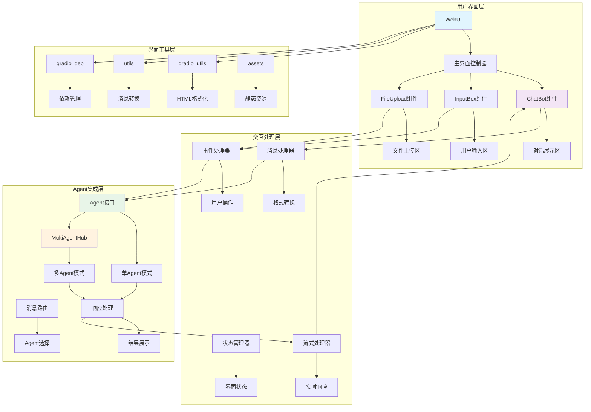
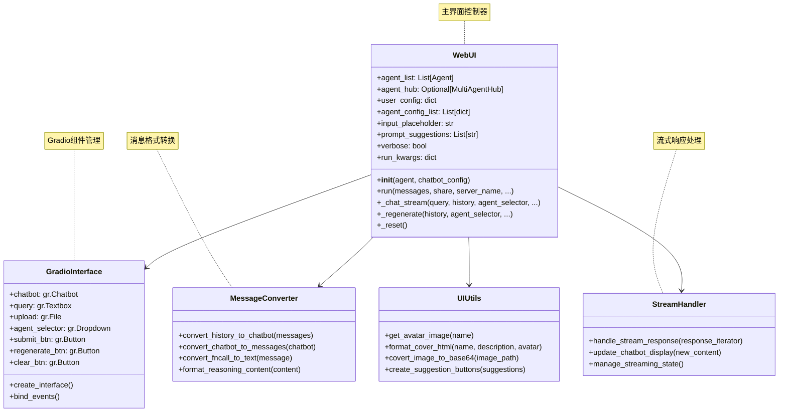

## 📝 概述

GUI界面系统是Qwen-Agent框架的用户交互层，基于Gradio构建，提供了美观、易用的Web界面，支持多Agent对话、多模态交互、实时流式响应等功能。本文档深入分析GUI系统的架构设计、组件实现和交互机制。

## 🏗️ GUI模块架构设计

### GUI系统整体架构图



### WebUI核心类设计



## 🎨 WebUI核心实现

### WebUI类详细分析

```python
class WebUI:
    """通用聊天界面应用 - Agent的统一Web界面
    
    设计目标:
        1. 为所有类型的Agent提供统一的Web交互界面
        2. 支持单Agent和多Agent模式的无缝切换
        3. 提供现代化的聊天体验和多模态交互
        4. 支持实时流式响应和富文本展示
    
    核心功能:
        - 多Agent管理和切换
        - 实时对话和流式响应
        - 文件上传和多模态支持
        - 对话历史管理
        - 美观的界面设计
    
    支持的Agent类型:
        - Assistant: 智能助手
        - GroupChat: 群聊Agent
        - Router: 路由Agent
        - CustomAgent: 自定义Agent
    """
    
    def __init__(self, agent: Union[Agent, MultiAgentHub, List[Agent]], chatbot_config: Optional[dict] = None):
        """WebUI初始化
        
        初始化过程:
            1. Agent配置解析和标准化
            2. 用户界面配置加载
            3. Agent配置列表构建
            4. 界面参数设置
        
        参数说明:
            agent: Agent实例，支持多种类型
                  - Agent: 单个Agent
                  - MultiAgentHub: 多Agent集合
                  - List[Agent]: Agent列表
            chatbot_config: 聊天界面配置
                          - user.name: 用户名称
                          - user.avatar: 用户头像
                          - agent.avatar: Agent头像
                          - input.placeholder: 输入提示
                          - prompt.suggestions: 建议提示列表
        """
        chatbot_config = chatbot_config or {}
        
        # 1. Agent配置解析
        if isinstance(agent, MultiAgentHub):
            # 多Agent Hub模式
            self.agent_list = [agent for agent in agent.nonuser_agents]
            self.agent_hub = agent
        elif isinstance(agent, list):
            # Agent列表模式
            self.agent_list = agent
            self.agent_hub = None
        else:
            # 单Agent模式
            self.agent_list = [agent]
            self.agent_hub = None
        
        # 2. 用户配置
        user_name = chatbot_config.get('user.name', 'user')
        self.user_config = {
            'name': user_name,
            'avatar': chatbot_config.get(
                'user.avatar',
                get_avatar_image(user_name),
            ),
        }
        
        # 3. Agent配置列表构建
        self.agent_config_list = [{
            'name': agent.name,
            'avatar': chatbot_config.get(
                'agent.avatar',
                get_avatar_image(agent.name),
            ),
            'description': agent.description or "I'm a helpful assistant.",
        } for agent in self.agent_list]
        
        # 4. 界面参数设置
        self.input_placeholder = chatbot_config.get('input.placeholder', '跟我聊聊吧～')
        self.prompt_suggestions = chatbot_config.get('prompt.suggestions', [])
        self.verbose = chatbot_config.get('verbose', False)
    
    def run(self,
            messages: List[Message] = None,
            share: bool = False,
            server_name: str = None,
            server_port: int = None,
            concurrency_limit: int = 10,
            enable_mention: bool = False,
            **kwargs):
        """启动WebUI界面
        
        启动流程:
            1. 导入Gradio依赖和组件
            2. 创建自定义主题配置
            3. 构建界面布局和组件
            4. 绑定事件处理器
            5. 启动Web服务器
        
        参数说明:
            messages: 初始对话历史
            share: 是否创建公开分享链接
            server_name: 服务器地址
            server_port: 服务端口
            concurrency_limit: 并发限制
            enable_mention: 是否启用@提及功能
            **kwargs: 额外的运行参数
        """
        # 保存运行参数
        self.run_kwargs = kwargs
        
        # 1. 导入Gradio依赖
        from qwen_agent.gui.gradio_dep import gr, mgr, ms
        
        # 2. 创建自定义主题
        customTheme = gr.themes.Default(
            primary_hue=gr.themes.utils.colors.blue,      # 主色调：蓝色
            radius_size=gr.themes.utils.sizes.radius_none, # 圆角：无圆角
        )
        
        # 3. 构建主界面
        with gr.Blocks(
            theme=customTheme,
            title="Qwen-Agent: 智能助手平台"
        ) as demo:
            
            # 3.1 界面状态变量
            history = gr.State([])      # 对话历史
            user_input_state = gr.State("")  # 用户输入状态
            
            # 3.2 主界面布局
            with gr.Row(equal_height=True):
                
                # 左侧：Agent信息面板
                with gr.Column(scale=1):
                    # Agent封面展示
                    if len(self.agent_list) == 1:
                        agent_info_html = format_cover_html(
                            self.agent_list[0].name,
                            self.agent_config_list[0]['description'],
                            self.agent_config_list[0]['avatar']
                        )
                        agent_info = gr.HTML(agent_info_html)
                        agent_selector = gr.Dropdown(
                            choices=[agent.name for agent in self.agent_list],
                            value=self.agent_list[0].name,
                            interactive=False,
                            show_label=False,
                            visible=False,
                        )
                    else:
                        # 多Agent选择器
                        agent_info = gr.HTML("")
                        agent_selector = gr.Dropdown(
                            choices=[agent.name for agent in self.agent_list],
                            value=self.agent_list[0].name,
                            label="选择智能助手",
                            interactive=True,
                        )
                    
                    # 建议提示按钮
                    if self.prompt_suggestions:
                        suggestion_buttons = []
                        for suggestion in self.prompt_suggestions:
                            btn = gr.Button(
                                suggestion[:20] + "..." if len(suggestion) > 20 else suggestion,
                                size='sm'
                            )
                            suggestion_buttons.append(btn)
                
                # 右侧：对话区域
                with gr.Column(scale=4):
                    
                    # 3.3 聊天框组件
                    chatbot = gr.Chatbot(
                        label="对话",
                        show_copy_button=True,
                        show_share_button=False,
                        height=600,
                        avatar_images=[
                            self.user_config['avatar'],
                            self.agent_config_list[0]['avatar']
                        ],
                        bubble_full_width=False,
                    )
                    
                    # 3.4 输入区域
                    with gr.Row():
                        with gr.Column(scale=12):
                            # 文本输入框
                            query = gr.Textbox(
                                label="",
                                placeholder=self.input_placeholder,
                                lines=1,
                                max_lines=5,
                                show_copy_button=True,
                            )
                        
                        with gr.Column(scale=1, min_width=0):
                            # 文件上传按钮
                            upload = gr.File(
                                file_count="multiple",
                                file_types=None,
                                label="",
                                visible=True,
                            )
                    
                    # 3.5 操作按钮区域
                    with gr.Row():
                        submit_btn = gr.Button("发送 📤", variant="primary")
                        regenerate_btn = gr.Button("重新生成 🔄", variant="secondary")
                        clear_btn = gr.Button("清空对话 🗑️", variant="stop")
            
            # 4. 事件绑定
            self._bind_events(
                demo, history, user_input_state, chatbot, query, upload,
                agent_selector, submit_btn, regenerate_btn, clear_btn,
                suggestion_buttons if self.prompt_suggestions else [],
                enable_mention
            )
            
            # 5. 初始化对话历史
            if messages:
                initial_chatbot = convert_history_to_chatbot(messages)
                history.value = messages
                chatbot.value = initial_chatbot
        
        # 6. 启动服务器
        demo.queue(
            concurrency_count=concurrency_limit,
            max_size=100
        ).launch(
            share=share,
            server_name=server_name,
            server_port=server_port,
            show_api=False,
            show_error=True,
        )
    
    def _bind_events(self, demo, history, user_input_state, chatbot, query, upload,
                    agent_selector, submit_btn, regenerate_btn, clear_btn,
                    suggestion_buttons, enable_mention):
        """绑定界面事件处理器
        
        事件类型:
            1. 提交消息事件
            2. 重新生成事件
            3. 清空对话事件
            4. Agent切换事件
            5. 建议提示点击事件
            6. 文件上传事件
        """
        # 1. 提交消息事件
        submit_event = submit_btn.click(
            fn=self._chat_stream,
            inputs=[query, history, agent_selector, upload],
            outputs=[chatbot, history, query, upload],
            show_progress='minimal',
        )
        
        # Enter键提交
        query.submit(
            fn=self._chat_stream,
            inputs=[query, history, agent_selector, upload],
            outputs=[chatbot, history, query, upload],
            show_progress='minimal',
        )
        
        # 2. 重新生成事件
        regenerate_btn.click(
            fn=self._regenerate,
            inputs=[history, agent_selector],
            outputs=[chatbot, history],
            show_progress='minimal',
        )
        
        # 3. 清空对话事件
        clear_btn.click(
            fn=self._reset,
            outputs=[chatbot, history, query, upload],
        )
        
        # 4. Agent切换事件（仅多Agent模式）
        if len(self.agent_list) > 1:
            agent_selector.change(
                fn=self._update_agent_info,
                inputs=[agent_selector],
                outputs=[],  # 更新Agent信息显示
            )
        
        # 5. 建议提示点击事件
        for i, btn in enumerate(suggestion_buttons):
            btn.click(
                fn=lambda suggestion=self.prompt_suggestions[i]: self._set_query(suggestion),
                outputs=[query],
            )
    
    def _chat_stream(self, query, history, agent_selector, upload):
        """处理聊天消息的流式响应
        
        处理流程:
            1. 输入验证和预处理
            2. 消息格式构建
            3. Agent选择和调用
            4. 流式响应处理
            5. 界面状态更新
        
        参数说明:
            query: 用户输入的查询文本
            history: 当前对话历史
            agent_selector: 选中的Agent名称
            upload: 上传的文件列表
        
        返回值:
            tuple: (更新后的chatbot, 更新后的history, 清空的query, 清空的upload)
        """
        # 1. 输入验证
        if not query.strip() and not upload:
            return history, history, query, upload
        
        # 2. 获取选中的Agent
        selected_agent = self._get_agent_by_name(agent_selector)
        if not selected_agent:
            return history, history, query, upload
        
        # 3. 构建消息对象
        user_message = self._build_user_message(query, upload)
        
        # 4. 更新历史记录
        history = history + [user_message]
        chatbot = convert_history_to_chatbot(history)
        
        # 5. 清空输入
        query = ""
        upload = None
        
        # 6. 流式响应处理
        try:
            # 调用Agent进行流式响应
            if self.agent_hub:
                response_stream = self.agent_hub.run(
                    messages=history,
                    stream=True,
                    **self.run_kwargs
                )
            else:
                response_stream = selected_agent.run(
                    messages=history,
                    stream=True,
                    **self.run_kwargs
                )
            
            # 7. 处理流式响应
            assistant_message = Message(role=ASSISTANT, content='')
            
            for response in response_stream:
                if response:
                    # 更新Assistant消息
                    assistant_message = response[-1]
                    
                    # 更新对话历史
                    updated_history = history + [assistant_message]
                    updated_chatbot = convert_history_to_chatbot(updated_history)
                    
                    # 实时更新界面
                    yield updated_chatbot, updated_history, query, upload
            
            # 8. 最终状态更新
            final_history = history + [assistant_message]
            final_chatbot = convert_history_to_chatbot(final_history)
            
            yield final_chatbot, final_history, query, upload
            
        except Exception as e:
            # 错误处理
            error_message = Message(
                role=ASSISTANT,
                content=f"抱歉，处理您的请求时出现了错误：{str(e)}"
            )
            error_history = history + [error_message]
            error_chatbot = convert_history_to_chatbot(error_history)
            
            logger.error(f"Chat stream error: {str(e)}")
            yield error_chatbot, error_history, query, upload
    
    def _build_user_message(self, query: str, upload) -> Message:
        """构建用户消息对象
        
        支持的内容类型:
            1. 纯文本消息
            2. 文本+文件混合消息
            3. 多文件上传消息
            4. 多模态内容（图片、音频、视频）
        """
        content_items = []
        
        # 1. 添加文本内容
        if query.strip():
            content_items.append({
                CONTENT: query.strip()
            })
        
        # 2. 处理文件上传
        if upload:
            if not isinstance(upload, list):
                upload = [upload]
            
            for file_obj in upload:
                if hasattr(file_obj, 'name') and file_obj.name:
                    file_path = file_obj.name
                    
                    # 根据文件类型添加相应的内容项
                    file_ext = os.path.splitext(file_path)[1].lower()
                    
                    if file_ext in ['.jpg', '.jpeg', '.png', '.gif', '.bmp']:
                        # 图像文件
                        content_items.append({
                            IMAGE: file_path
                        })
                    elif file_ext in ['.mp3', '.wav', '.m4a', '.flac']:
                        # 音频文件
                        content_items.append({
                            AUDIO: file_path
                        })
                    elif file_ext in ['.mp4', '.avi', '.mov', '.mkv']:
                        # 视频文件
                        content_items.append({
                            VIDEO: file_path
                        })
                    else:
                        # 普通文件
                        content_items.append({
                            FILE: file_path
                        })
        
        # 3. 构建消息对象
        return Message(
            role=USER,
            content=content_items,
            name=self.user_config['name']
        )
    
    def _regenerate(self, history, agent_selector):
        """重新生成最后一个回复
        
        重新生成逻辑:
            1. 检查历史记录有效性
            2. 移除最后一个助手回复
            3. 重新调用Agent生成回复
            4. 更新对话历史
        """
        if not history or len(history) < 2:
            return [], []
        
        # 移除最后一个Assistant消息
        if history[-1].role == ASSISTANT:
            history = history[:-1]
        
        # 重新生成回复
        return self._chat_stream("", history, agent_selector, None)
    
    def _reset(self):
        """重置对话状态
        
        重置内容:
            1. 清空对话历史
            2. 清空输入框
            3. 清空文件上传
            4. 重置界面状态
        """
        return [], [], "", None
    
    def _get_agent_by_name(self, agent_name: str) -> Optional[Agent]:
        """根据名称获取Agent实例"""
        for agent in self.agent_list:
            if agent.name == agent_name:
                return agent
        return None
    
    def _set_query(self, suggestion: str) -> str:
        """设置查询文本（用于建议提示点击）"""
        return suggestion
```

## 🛠️ 消息处理和格式转换

### 消息转换机制

```python
def convert_history_to_chatbot(messages: List[Message]) -> List[List]:
    """将Message对象列表转换为Gradio Chatbot格式
    
    转换规则:
        1. 连续的相同角色消息会被合并
        2. SYSTEM消息被隐藏（不在界面显示）
        3. FUNCTION消息转换为工具调用展示
        4. 支持多模态内容的格式化显示
        5. 推理内容（reasoning_content）特殊处理
    
    Gradio Chatbot格式:
        [
            ["用户消息", "助手回复"],
            ["用户消息2", "助手回复2"],
            ...
        ]
    """
    if not messages:
        return []
    
    chatbot_messages = []
    current_pair = [None, None]  # [用户消息, 助手回复]
    
    for message in messages:
        if message.role == SYSTEM:
            # 跳过系统消息（不显示）
            continue
        
        elif message.role == USER:
            # 用户消息处理
            if current_pair[0] is not None:
                # 保存前一对对话
                chatbot_messages.append(current_pair[:])
                current_pair = [None, None]
            
            # 格式化用户消息内容
            user_content = _format_message_content(message)
            current_pair[0] = user_content
        
        elif message.role == ASSISTANT:
            # 助手消息处理
            assistant_content = _format_message_content(message)
            
            # 处理推理内容
            if hasattr(message, REASONING_CONTENT) and message.reasoning_content:
                thinking_html = THINK.format(thought=message.reasoning_content)
                assistant_content = thinking_html + "\n\n" + assistant_content
            
            current_pair[1] = assistant_content
        
        elif message.role == FUNCTION:
            # 工具结果消息处理
            tool_output_html = TOOL_OUTPUT.format(
                tool_output=_format_message_content(message)
            )
            
            if current_pair[1] is None:
                current_pair[1] = tool_output_html
            else:
                current_pair[1] += "\n\n" + tool_output_html
    
    # 添加最后一对对话
    if current_pair[0] is not None or current_pair[1] is not None:
        chatbot_messages.append(current_pair)
    
    return chatbot_messages

def _format_message_content(message: Message) -> str:
    """格式化消息内容为HTML显示格式
    
    支持的内容类型:
        1. 纯文本内容
        2. 多模态内容（图像、音频、视频、文件）
        3. 函数调用内容
        4. 结构化数据内容
    """
    if isinstance(message.content, str):
        # 纯文本内容
        return message.content
    
    elif isinstance(message.content, list):
        # 多模态内容列表
        formatted_parts = []
        
        for item in message.content:
            if isinstance(item, dict):
                if CONTENT in item:
                    # 文本内容
                    formatted_parts.append(item[CONTENT])
                
                elif IMAGE in item:
                    # 图像内容
                    image_path = item[IMAGE]
                    if os.path.exists(image_path):
                        # 转换为base64格式显示
                        image_html = f''
                        formatted_parts.append(image_html)
                    else:
                        formatted_parts.append(f"[图像文件: {image_path}]")
                
                elif FILE in item:
                    # 文件内容
                    file_path = item[FILE]
                    file_name = os.path.basename(file_path)
                    formatted_parts.append(f"📎 **文件**: {file_name}")
                
                elif AUDIO in item:
                    # 音频内容
                    audio_path = item[AUDIO]
                    audio_name = os.path.basename(audio_path)
                    formatted_parts.append(f"🎵 **音频**: {audio_name}")
                
                elif VIDEO in item:
                    # 视频内容
                    video_path = item[VIDEO]
                    video_name = os.path.basename(video_path)
                    formatted_parts.append(f"🎥 **视频**: {video_name}")
            
            elif isinstance(item, str):
                # 字符串内容
                formatted_parts.append(item)
        
        return "\n\n".join(formatted_parts)
    
    else:
        # 其他类型内容
        return str(message.content)

def convert_fncall_to_text(message: Message) -> str:
    """将函数调用消息转换为可读文本
    
    转换内容:
        1. 函数调用的参数和名称
        2. 工具调用的展开显示
        3. 错误信息的友好显示
    """
    if not hasattr(message, 'function_call') or not message.function_call:
        return _format_message_content(message)
    
    # 获取函数调用信息
    func_call = message.function_call
    tool_name = func_call.name
    tool_args = func_call.arguments
    
    # 格式化工具调用展示
    if isinstance(tool_args, str):
        try:
            import json
            tool_args_dict = json.loads(tool_args)
            tool_args_formatted = json.dumps(tool_args_dict, indent=2, ensure_ascii=False)
        except:
            tool_args_formatted = tool_args
    else:
        tool_args_formatted = str(tool_args)
    
    # 生成工具调用HTML
    tool_call_html = TOOL_CALL.format(
        tool_name=tool_name,
        tool_input=f"```json\n{tool_args_formatted}\n```"
    )
    
    # 合并消息内容
    message_content = _format_message_content(message)
    
    if message_content:
        return tool_call_html + "\n\n" + message_content
    else:
        return tool_call_html

def convert_chatbot_to_messages(chatbot: List[List]) -> List[Message]:
    """将Gradio Chatbot格式转换为Message对象列表
    
    用途:
        1. 界面状态恢复
        2. 对话历史导出
        3. Agent调用参数准备
    """
    messages = []
    
    for pair in chatbot:
        user_content, assistant_content = pair
        
        # 添加用户消息
        if user_content:
            messages.append(Message(
                role=USER,
                content=user_content
            ))
        
        # 添加助手消息
        if assistant_content:
            messages.append(Message(
                role=ASSISTANT,
                content=assistant_content
            ))
    
    return messages
```

## 🎨 界面美化和主题定制

### 自定义主题设计

```python
def create_custom_theme():
    """创建Qwen-Agent自定义主题
    
    主题特色:
        1. 简洁现代的设计风格
        2. 蓝色主色调，体现科技感
        3. 无圆角设计，更加专业
        4. 响应式布局支持
    """
    from qwen_agent.gui.gradio_dep import gr
    
    # 自定义颜色配置
    custom_colors = gr.themes.utils.colors.Color(
        name="qwen_blue",
        c50="#eff6ff",
        c100="#dbeafe", 
        c200="#bfdbfe",
        c300="#93c5fd",
        c400="#60a5fa",
        c500="#3b82f6",    # 主色调
        c600="#2563eb",
        c700="#1d4ed8",
        c800="#1e40af",
        c900="#1e3a8a",
    )
    
    # 创建主题
    theme = gr.themes.Default(
        primary_hue=custom_colors,
        secondary_hue=gr.themes.utils.colors.gray,
        neutral_hue=gr.themes.utils.colors.gray,
        radius_size=gr.themes.utils.sizes.radius_none,
        font=[
            gr.themes.GoogleFont("Noto Sans SC"),  # 中文字体
            gr.themes.GoogleFont("Inter"),         # 英文字体
            "ui-sans-serif", 
            "system-ui"
        ]
    )
    
    return theme

def create_agent_cover_html(name: str, description: str, avatar: str = None) -> str:
    """创建Agent封面HTML
    
    封面包含:
        1. Agent头像（圆形显示）
        2. Agent名称（粗体显示）
        3. Agent描述（多行文本）
        4. 响应式设计支持
        5. 深色模式兼容
    """
    # 处理头像
    if avatar and os.path.exists(avatar):
        image_src = covert_image_to_base64(avatar)
    else:
        # 使用默认头像
        image_src = '//img.alicdn.com/imgextra/i3/O1CN01YPqZFO1YNZerQfSBk_!!6000000003047-0-tps-225-225.jpg'
    
    # 生成HTML
    html_content = f"""
    <style>
        .agent-cover {{
            display: flex;
            flex-direction: column;
            align-items: center;
            text-align: center;
            padding: 24px;
            border-radius: 12px;
            background: linear-gradient(145deg, #f8fafc 0%, #e2e8f0 100%);
            box-shadow: 0 4px 6px -1px rgba(0, 0, 0, 0.1), 0 2px 4px -1px rgba(0, 0, 0, 0.06);
            margin-bottom: 16px;
            transition: all 0.3s ease;
        }}
        
        .agent-cover:hover {{
            transform: translateY(-2px);
            box-shadow: 0 10px 15px -3px rgba(0, 0, 0, 0.1), 0 4px 6px -2px rgba(0, 0, 0, 0.05);
        }}
        
        .agent-avatar {{
            position: relative;
            margin-bottom: 16px;
        }}
        
        .agent-avatar img {{
            width: 120px;
            height: 120px;
            object-fit: cover;
            border-radius: 50%;
            border: 4px solid #3b82f6;
            box-shadow: 0 8px 16px rgba(59, 130, 246, 0.3);
        }}
        
        .agent-name {{
            font-size: 24px;
            font-weight: 700;
            color: #1e293b;
            margin-bottom: 8px;
            background: linear-gradient(135deg, #3b82f6, #1e40af);
            -webkit-background-clip: text;
            -webkit-text-fill-color: transparent;
        }}
        
        .agent-description {{
            font-size: 16px;
            line-height: 1.6;
            color: #64748b;
            max-width: 300px;
            margin: 0 auto;
        }}
        
        /* 深色模式支持 */
        .dark .agent-cover {{
            background: linear-gradient(145deg, #1e293b 0%, #334155 100%);
        }}
        
        .dark .agent-name {{
            color: #f1f5f9;
        }}
        
        .dark .agent-description {{
            color: #94a3b8;
        }}
        
        /* 响应式设计 */
        @media (max-width: 768px) {{
            .agent-cover {{
                padding: 16px;
            }}
            
            .agent-avatar img {{
                width: 80px;
                height: 80px;
            }}
            
            .agent-name {{
                font-size: 20px;
            }}
            
            .agent-description {{
                font-size: 14px;
            }}
        }}
    </style>
    
    <div class="agent-cover">
        <div class="agent-avatar">
            
        </div>
        <div class="agent-name">{name}</div>
        <div class="agent-description">{description}</div>
    </div>
    """
    
    return html_content

def create_suggestion_buttons(suggestions: List[str]) -> List:
    """创建建议提示按钮
    
    按钮特性:
        1. 美观的卡片式设计
        2. 悬停效果和点击反馈
        3. 自适应文本长度
        4. 统一的视觉风格
    """
    buttons = []
    
    for suggestion in suggestions:
        # 截断过长的文本
        display_text = suggestion[:25] + "..." if len(suggestion) > 25 else suggestion
        
        # 创建按钮
        btn = gr.Button(
            value=display_text,
            variant="secondary",
            size="sm",
            elem_classes=["suggestion-button"]
        )
        
        buttons.append(btn)
    
    return buttons
```

## 📱 多设备适配和响应式设计

### 响应式布局实现

```python
def create_responsive_layout():
    """创建响应式界面布局
    
    适配策略:
        1. 桌面端：双列布局（Agent信息 + 对话区）
        2. 平板端：可折叠的Agent信息面板
        3. 手机端：单列布局，Agent选择下拉框
        4. 动态字体和组件大小调整
    """
    from qwen_agent.gui.gradio_dep import gr
    
    # CSS样式定义
    responsive_css = """
    <style>
        /* 基础响应式容器 */
        .responsive-container {
            max-width: 1200px;
            margin: 0 auto;
            padding: 0 16px;
        }
        
        /* 桌面端布局 */
        @media (min-width: 1024px) {
            .agent-panel {
                min-width: 320px;
                max-width: 400px;
            }
            
            .chat-panel {
                flex: 1;
                min-width: 600px;
            }
            
            .input-area {
                max-height: 120px;
            }
        }
        
        /* 平板端布局 */
        @media (min-width: 768px) and (max-width: 1023px) {
            .agent-panel {
                min-width: 280px;
                max-width: 320px;
            }
            
            .chat-panel {
                flex: 1;
                min-width: 400px;
            }
            
            .chatbot {
                height: 500px;
            }
        }
        
        /* 手机端布局 */
        @media (max-width: 767px) {
            .main-container {
                flex-direction: column;
            }
            
            .agent-panel {
                width: 100%;
                margin-bottom: 16px;
            }
            
            .chat-panel {
                width: 100%;
            }
            
            .chatbot {
                height: 400px;
            }
            
            .input-area {
                max-height: 80px;
            }
            
            .action-buttons {
                flex-wrap: wrap;
            }
            
            .action-buttons > * {
                margin: 4px;
                min-width: calc(50% - 8px);
            }
        }
        
        /* 通用优化 */
        .chatbot-message {
            word-wrap: break-word;
            overflow-wrap: break-word;
        }
        
        .file-upload {
            max-width: 100%;
        }
        
        .suggestion-buttons {
            display: flex;
            flex-wrap: wrap;
            gap: 8px;
        }
        
        .suggestion-buttons button {
            flex: 1 1 auto;
            min-width: 120px;
            max-width: 200px;
        }
    </style>
    """
    
    return responsive_css
```

## 🔄 实时交互和状态管理

### 流式响应处理器

```python
class StreamResponseHandler:
    """流式响应处理器 - 管理实时对话流
    
    核心功能:
        1. 流式响应的缓冲和显示
        2. 界面状态的实时更新
        3. 用户交互的并发控制
        4. 错误状态的优雅处理
    """
    
    def __init__(self, chatbot_component, history_state):
        self.chatbot = chatbot_component
        self.history = history_state
        self.is_streaming = False
        self.current_response = ""
        
    def handle_stream(self, response_iterator, user_message):
        """处理流式响应
        
        处理策略:
            1. 实时更新界面显示
            2. 缓冲不完整的响应
            3. 处理网络中断和重连
            4. 维护响应的完整性
        """
        self.is_streaming = True
        accumulated_response = ""
        
        try:
            for chunk in response_iterator:
                if chunk and len(chunk) > 0:
                    # 获取最新的响应消息
                    latest_message = chunk[-1]
                    
                    if latest_message.role == ASSISTANT:
                        # 累积响应内容
                        accumulated_response = latest_message.content
                        
                        # 更新界面显示
                        yield self._update_display(user_message, latest_message)
            
            # 完成流式响应
            self.is_streaming = False
            
        except Exception as e:
            # 错误处理
            self.is_streaming = False
            error_message = Message(
                role=ASSISTANT,
                content=f"处理响应时发生错误：{str(e)}"
            )
            yield self._update_display(user_message, error_message)
    
    def _update_display(self, user_message, assistant_message):
        """更新界面显示"""
        # 构建完整的对话历史
        updated_history = self.history.value + [user_message, assistant_message]
        updated_chatbot = convert_history_to_chatbot(updated_history)
        
        return updated_chatbot, updated_history
    
    def cancel_stream(self):
        """取消当前流式响应"""
        self.is_streaming = False
        # 这里可以添加流取消的具体逻辑
```

## 🎯 GUI模块总结

### 设计优势

1. **统一界面**: 为所有Agent类型提供一致的交互体验
2. **现代设计**: 基于Gradio的现代化Web界面，美观易用
3. **多模态支持**: 支持文本、图像、音频、视频等多种内容类型
4. **实时交互**: 流式响应机制，提供实时的对话体验
5. **响应式设计**: 适配桌面、平板、手机等多种设备
6. **高度可定制**: 支持主题、头像、建议等多种个性化配置

### 核心特性

1. **Agent管理**: 支持单Agent和多Agent模式的无缝切换
2. **对话管理**: 完整的对话历史管理和状态保持
3. **文件上传**: 支持多种文件格式的上传和处理
4. **美观界面**: 自定义主题和响应式设计
5. **错误处理**: 优雅的错误提示和恢复机制
6. **性能优化**: 流式响应和界面渲染优化

### 技术架构

1. **基于Gradio**: 利用Gradio强大的组件系统和事件处理
2. **消息转换**: 完善的Message对象和界面格式转换机制
3. **状态管理**: Gradio State组件管理界面状态
4. **事件驱动**: 基于事件的用户交互处理
5. **模块化设计**: 清晰的组件分离和职责划分

### 扩展建议

1. **界面增强**: 支持更多的界面组件和交互方式
2. **性能优化**: 大对话历史的虚拟化显示
3. **多语言支持**: 界面的国际化和本地化
4. **accessibility**: 无障碍访问支持
5. **PWA支持**: 渐进式Web应用功能

---

*本GUI界面系统分析文档基于Qwen-Agent v0.0.30版本，详细描述了GUI模块的架构设计和实现原理。*
