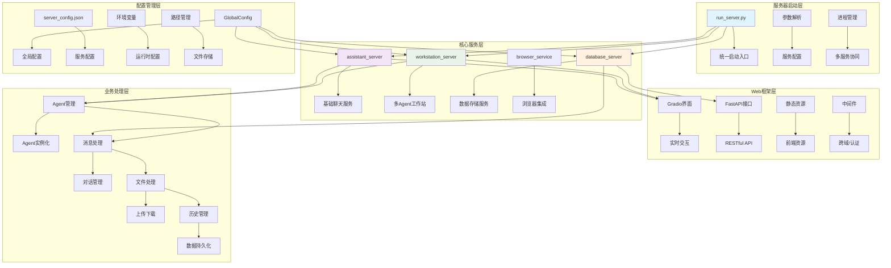
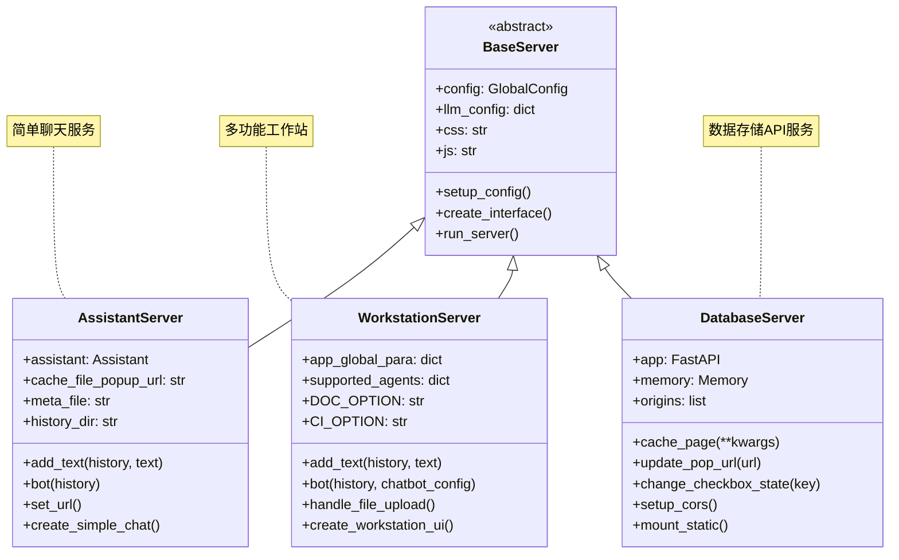

# QwenAgent-07 - Server服务体系深度解析

## 📝 概述

Server服务体系是Qwen-Agent框架的部署层，提供了多种服务器配置和部署方案，支持从简单的聊天服务到复杂的多Agent工作站。本文档深入分析服务体系的架构设计、服务类型和部署机制。

## 🏗️ Server模块架构设计

### 服务体系整体架构图



### 服务类型对比图



## 🚀 run_server.py - 统一启动入口

### 服务启动器详细分析

```python
def parse_args():
    """命令行参数解析 - 支持多种配置方式
    
    支持的参数:
        -m, --model_server: 模型服务类型（dashscope/vLLM/Ollama等）
        -k, --api_key: API密钥
        -l, --llm: 模型名称
        --assistant_port: 助手服务端口
        --workstation_port: 工作站端口
        --database_port: 数据库服务端口
        --disable_browser: 禁用浏览器自动打开
    
    配置优先级:
        命令行参数 > 环境变量 > 配置文件默认值
    """
    parser = argparse.ArgumentParser(description='Qwen-Agent服务器启动器')
    
    # 1. 模型服务配置
    parser.add_argument(
        '-m', '--model_server',
        type=str,
        default='dashscope',
        help='模型服务类型：dashscope（DashScope服务）或OpenAI兼容服务的base_url'
    )
    
    parser.add_argument(
        '-k', '--api_key', 
        type=str,
        default='',
        help='API密钥，支持DashScope或OpenAI兼容服务'
    )
    
    parser.add_argument(
        '-l', '--llm',
        type=str, 
        default='qwen-plus',
        help='模型名称，如qwen-max/qwen-plus/qwen-turbo或自定义模型名'
    )
    
    # 2. 服务端口配置
    parser.add_argument(
        '--assistant_port',
        type=int,
        default=8002,
        help='助手服务端口号'
    )
    
    parser.add_argument(
        '--workstation_port', 
        type=int,
        default=8003,
        help='工作站服务端口号'
    )
    
    parser.add_argument(
        '--database_port',
        type=int, 
        default=8004,
        help='数据库服务端口号'
    )
    
    # 3. 其他配置
    parser.add_argument(
        '--disable_browser',
        action='store_true',
        help='禁用浏览器自动打开'
    )
    
    return parser.parse_args()

def main():
    """主启动函数 - 协调多个服务的启动
    
    启动流程:
        1. 解析命令行参数
        2. 更新服务配置文件
        3. 启动数据库服务（后台进程）
        4. 根据选择启动对应的Web服务
        5. 设置进程信号处理
        6. 等待服务结束
    """
    # 1. 参数解析
    args = parse_args()
    
    # 2. 读取并更新配置
    config_path = Path(__file__).resolve().parent / 'qwen_server' / 'server_config.json'
    
    with open(config_path, 'r') as f:
        config_data = json.load(f)
    
    # 更新配置参数
    if hasattr(args, 'model_server') and args.model_server:
        config_data['server']['model_server'] = args.model_server
    
    if hasattr(args, 'api_key') and args.api_key:
        config_data['server']['api_key'] = args.api_key
    
    if hasattr(args, 'llm') and args.llm:
        config_data['server']['llm'] = args.llm
    
    # 端口配置更新
    config_data['server']['assistant_port'] = args.assistant_port
    config_data['server']['workstation_port'] = args.workstation_port  
    config_data['server']['database_port'] = args.database_port
    
    # 3. 保存配置文件
    with open(config_path, 'w') as f:
        json.dump(config_data, f, indent=2, ensure_ascii=False)
    
    # 4. 启动数据库服务（后台进程）
    database_cmd = [
        sys.executable, '-m', 'qwen_server.database_server',
        '--port', str(args.database_port)
    ]
    
    database_process = subprocess.Popen(
        database_cmd,
        stdout=subprocess.DEVNULL,
        stderr=subprocess.DEVNULL
    )
    
    print(f"✅ 数据库服务已启动 (PID: {database_process.pid}, 端口: {args.database_port})")
    
    # 5. 服务选择界面
    print("\n🚀 Qwen-Agent 服务器启动器")
    print("=" * 50)
    print("请选择要启动的服务:")
    print("1. 助手服务 (简单聊天界面)")
    print("2. 工作站服务 (完整功能界面)")
    print("3. 仅数据库服务")
    print("0. 退出")
    
    while True:
        try:
            choice = input("\n请输入选择 (0-3): ").strip()
            
            if choice == '0':
                print("正在退出...")
                database_process.terminate()
                sys.exit(0)
            
            elif choice == '1':
                # 启动助手服务
                print(f"🤖 启动助手服务 (端口: {args.assistant_port})")
                start_assistant_server(args)
                break
            
            elif choice == '2':
                # 启动工作站服务  
                print(f"🛠️ 启动工作站服务 (端口: {args.workstation_port})")
                start_workstation_server(args)
                break
            
            elif choice == '3':
                print(f"💾 仅数据库服务运行中 (端口: {args.database_port})")
                print("按 Ctrl+C 退出...")
                try:
                    database_process.wait()
                except KeyboardInterrupt:
                    print("正在关闭数据库服务...")
                    database_process.terminate()
                break
            
            else:
                print("❌ 无效选择，请重新输入")
        
        except KeyboardInterrupt:
            print("\n正在退出...")
            database_process.terminate()
            sys.exit(0)
    
    # 6. 设置信号处理
    def signal_handler(signum, frame):
        print(f"\n接收到信号 {signum}，正在关闭服务...")
        database_process.terminate()
        sys.exit(0)
    
    signal.signal(signal.SIGINT, signal_handler)
    signal.signal(signal.SIGTERM, signal_handler)

def start_assistant_server(args):
    """启动助手服务"""
    assistant_cmd = [
        sys.executable, '-m', 'qwen_server.assistant_server',
        '--port', str(args.assistant_port)
    ]
    
    if not args.disable_browser:
        assistant_cmd.append('--auto_open_browser')
    
    subprocess.run(assistant_cmd)

def start_workstation_server(args):
    """启动工作站服务"""
    workstation_cmd = [
        sys.executable, '-m', 'qwen_server.workstation_server', 
        '--port', str(args.workstation_port)
    ]
    
    if not args.disable_browser:
        workstation_cmd.append('--auto_open_browser')
    
    subprocess.run(workstation_cmd)

if __name__ == '__main__':
    main()
```

## 🤖 AssistantServer - 基础聊天服务

### AssistantServer核心实现

```python
class AssistantServer:
    """基础助手聊天服务 - 提供简洁的对话界面
    
    设计目标:
        1. 提供简单易用的聊天界面
        2. 支持文档问答和网页浏览
        3. 快速部署和启动
        4. 轻量级资源消耗
    
    核心功能:
        - 实时对话交互
        - 网页内容获取和分析
        - 对话历史管理
        - 错误处理和恢复
    
    适用场景:
        - 简单的AI对话服务
        - 网页内容分析工具
        - 文档问答服务
        - 演示和原型验证
    """
    
    def __init__(self):
        """AssistantServer初始化
        
        初始化过程:
            1. 加载服务配置
            2. 初始化Assistant Agent
            3. 设置文件路径
            4. 加载静态资源
        """
        # 1. 读取配置
        server_config_path = Path(__file__).resolve().parent / 'server_config.json'
        with open(server_config_path, 'r') as f:
            server_config = json.load(f)
            self.server_config = GlobalConfig(**server_config)
        
        # 2. 配置LLM
        llm_config = None
        if hasattr(self.server_config.server, 'llm'):
            llm_config = {
                'model': self.server_config.server.llm,
                'api_key': self.server_config.server.api_key,
                'model_server': self.server_config.server.model_server
            }
        
        # 3. 初始化Assistant
        self.assistant = Assistant(llm=llm_config)
        
        # 4. 文件路径设置
        self.cache_file_popup_url = os.path.join(
            self.server_config.path.work_space_root, 
            'popup_url.jsonl'
        )
        self.meta_file = os.path.join(
            self.server_config.path.work_space_root, 
            'meta_data.jsonl'
        )
        self.history_dir = os.path.join(
            self.server_config.path.work_space_root, 
            'history'
        )
        
        # 5. 加载静态资源
        with open(Path(__file__).resolve().parent / 'css/main.css', 'r') as f:
            self.css = f.read()
        with open(Path(__file__).resolve().parent / 'js/main.js', 'r') as f:
            self.js = f.read()
    
    def create_interface(self):
        """创建Gradio界面
        
        界面组件:
            1. 聊天框 - 显示对话历史
            2. 输入框 - 用户消息输入
            3. 发送按钮 - 触发消息发送
            4. 清空按钮 - 清空对话历史
            5. 状态显示 - 显示当前页面URL
        """
        # 自定义CSS和JS注入
        css_html = f"<style>{self.css}</style>"
        js_html = f"<script>{self.js}</script>"
        
        with gr.Blocks(
            title="Qwen-Agent Assistant",
            theme=gr.themes.Soft(),
            css=self.css,
            head=css_html + js_html
        ) as demo:
            
            # 状态变量
            history_state = gr.State([])
            
            # 标题和说明
            gr.Markdown(
                """
                # 🤖 Qwen-Agent Assistant
                
                智能助手为您提供：
                - 📝 智能对话交互
                - 🌐 网页内容分析  
                - 📄 文档问答服务
                - 🔍 信息查询和总结
                """
            )
            
            # 主界面布局
            with gr.Row():
                with gr.Column(scale=4):
                    # 聊天框
                    chatbot = gr.Chatbot(
                        label="对话历史",
                        height=500,
                        show_copy_button=True,
                        avatar_images=[
                            get_avatar_image('user'),
                            get_avatar_image('assistant')
                        ]
                    )
                    
                    # 输入区域
                    with gr.Row():
                        with gr.Column(scale=8):
                            msg_input = gr.Textbox(
                                label="",
                                placeholder="请输入您的问题...",
                                lines=2,
                                max_lines=4
                            )
                        
                        with gr.Column(scale=1):
                            submit_btn = gr.Button("发送 📤", variant="primary")
                            clear_btn = gr.Button("清空 🗑️", variant="secondary")
                
                with gr.Column(scale=1):
                    # 侧边栏信息
                    gr.Markdown("### 📊 服务状态")
                    
                    current_url = gr.Textbox(
                        label="当前页面",
                        value="等待页面加载...",
                        interactive=False
                    )
                    
                    gr.Markdown(
                        """
                        ### 💡 使用提示
                        - 直接输入问题开始对话
                        - 支持网页内容分析
                        - 可进行多轮对话
                        - 点击清空重置对话
                        """
                    )
            
            # 事件绑定
            self._bind_events(
                chatbot, msg_input, submit_btn, clear_btn, 
                history_state, current_url
            )
        
        return demo
    
    def _bind_events(self, chatbot, msg_input, submit_btn, clear_btn, 
                    history_state, current_url):
        """绑定界面事件"""
        
        # 发送消息事件
        def submit_message(message, history):
            if not message.strip():
                return history, history, ""
            
            # 添加用户消息
            updated_history, _ = self.add_text(history, message)
            
            # 生成回复
            final_history = list(self.bot(updated_history))[-1]
            
            return final_history, final_history, ""
        
        # 清空对话事件
        def clear_chat():
            return [], [], ""
        
        # 绑定事件
        submit_btn.click(
            fn=submit_message,
            inputs=[msg_input, history_state],
            outputs=[chatbot, history_state, msg_input]
        )
        
        msg_input.submit(
            fn=submit_message, 
            inputs=[msg_input, history_state],
            outputs=[chatbot, history_state, msg_input]
        )
        
        clear_btn.click(
            fn=clear_chat,
            outputs=[chatbot, history_state, msg_input]
        )
        
        # 页面加载时更新URL
        demo.load(
            fn=self.set_url,
            outputs=[current_url]
        )
    
    def add_text(self, history, text):
        """添加用户消息到历史"""
        history = history + [(text, None)]
        return history, gr.update(value='', interactive=False)
    
    def bot(self, history):
        """处理机器人回复
        
        处理流程:
            1. 获取当前页面URL
            2. 构建消息格式
            3. 调用Assistant生成回复
            4. 流式更新界面显示
            5. 错误处理和日志记录
        """
        # 1. 获取页面URL
        page_url = self.set_url()
        
        if not history:
            yield history
            return
        
        # 2. 构建消息
        user_message = history[-1][0]
        messages = [{
            'role': 'user', 
            'content': [
                {'text': user_message},
                {'file': page_url}
            ]
        }]
        
        # 3. 初始化回复
        history[-1] = (history[-1][0], '')
        
        try:
            # 4. 调用Assistant
            response = self.assistant.run(
                messages=messages,
                max_ref_token=self.server_config.server.max_ref_token
            )
            
            # 5. 流式更新
            for rsp in response:
                if rsp:
                    history[-1] = (history[-1][0], rsp[-1]['content'])
                    yield history
        
        except ModelServiceError as ex:
            # LLM服务错误处理
            error_msg = f"模型服务错误: {str(ex)}"
            logger.error(error_msg)
            history[-1] = (history[-1][0], error_msg)
            yield history
        
        except Exception as ex:
            # 其他错误处理
            error_msg = f"处理请求时发生错误: {str(ex)}"
            logger.error(error_msg)
            history[-1] = (history[-1][0], error_msg)
            yield history
    
    def set_url(self):
        """获取当前页面URL
        
        URL获取策略:
            1. 从缓存文件读取最新URL
            2. 处理网络异常情况
            3. 返回默认值或错误提示
        """
        try:
            if not os.path.exists(self.cache_file_popup_url):
                gr.Warning('无法获取页面URL，可能存在网络问题')
                return "无可用页面"
            
            # 读取最新的URL记录
            lines = []
            with jsonlines.open(self.cache_file_popup_url) as reader:
                for line in reader:
                    lines.append(line)
            
            if lines:
                current_url = lines[-1]['url']
                logger.info(f'当前访问页面: {current_url}')
                return current_url
            else:
                return "无可用页面"
        
        except Exception as e:
            logger.error(f'获取页面URL失败: {str(e)}')
            return "获取页面失败"
    
    def run(self, port=8002, share=False):
        """启动服务器"""
        demo = self.create_interface()
        
        print(f"🚀 Assistant服务启动中...")
        print(f"📍 本地访问地址: http://localhost:{port}")
        
        demo.launch(
            server_port=port,
            share=share,
            server_name="0.0.0.0",
            show_api=False,
            show_error=True
        )

# 服务器启动入口
if __name__ == "__main__":
    server = AssistantServer()
    server.run()
```

## 🛠️ WorkstationServer - 多功能工作站

### WorkstationServer核心架构

```python
class WorkstationServer:
    """多功能工作站服务 - 提供完整的Agent工作环境
    
    设计目标:
        1. 支持多种Agent类型和功能模式
        2. 提供丰富的工具集成和文件处理
        3. 支持代码执行、文档分析等高级功能
        4. 提供专业的工作界面和用户体验
    
    支持的Agent类型:
        - Assistant: 通用智能助手
        - ArticleAgent: 文章写作助手
        - ReActChat: 推理链对话Agent
        - CodeInterpreter: 代码解释器模式
    
    主要功能模块:
        - 文档问答 (Document QA)
        - 代码执行 (Code Interpreter)  
        - 文件上传和管理
        - 多模态内容处理
        - 对话历史管理
    """
    
    def __init__(self):
        """WorkstationServer初始化"""
        # 读取配置
        with open(Path(__file__).resolve().parent / 'server_config.json', 'r') as f:
            server_config = json.load(f)
            self.server_config = GlobalConfig(**server_config)
        
        # LLM配置
        self.llm_config = None
        if hasattr(self.server_config.server, 'llm'):
            self.llm_config = {
                'model': self.server_config.server.llm,
                'api_key': self.server_config.server.api_key,
                'model_server': self.server_config.server.model_server
            }
        
        # 全局参数
        self.app_global_para = {
            'time': [str(datetime.date.today()), str(datetime.date.today())],
            'messages': [],                    # 文档QA消息历史
            'last_turn_msg_id': [],           # 最后一轮消息ID
            'is_first_upload': True,          # 是否首次上传
            'uploaded_ci_file': '',           # 代码解释器文件
            'pure_messages': [],              # 纯对话消息历史
            'pure_last_turn_msg_id': [],      # 纯对话最后消息ID
        }
        
        # 功能选项常量
        self.DOC_OPTION = 'Document QA'
        self.CI_OPTION = 'Code Interpreter'
        self.CODE_FLAG = '/code'
        self.PLUGIN_FLAG = '/plug'
        self.TITLE_FLAG = '/title'
        
        # 文件路径
        self.meta_file = os.path.join(
            self.server_config.path.work_space_root, 
            'meta_data.jsonl'
        )
        
        # 加载静态资源
        with open(Path(__file__).resolve().parent / 'css/main.css', 'r') as f:
            self.css = f.read()
        with open(Path(__file__).resolve().parent / 'js/main.js', 'r') as f:
            self.js = f.read()
    
    def create_interface(self):
        """创建工作站界面
        
        界面结构:
            1. 顶部导航栏 - 功能切换和配置
            2. 主工作区 - 双栏布局
               - 左侧：对话区域和输入框
               - 右侧：文件管理和工具面板
            3. 底部状态栏 - 系统信息和帮助
        """
        with gr.Blocks(
            title="Qwen-Agent Workstation",
            theme=gr.themes.Soft(),
            css=self.css
        ) as demo:
            
            # 全局状态变量
            chatbot_config = gr.State({})
            
            # 顶部标题和导航
            with gr.Row():
                gr.Markdown(
                    """
                    # 🛠️ Qwen-Agent Workstation
                    **专业的AI Agent工作环境** - 支持文档分析、代码执行、多模态交互
                    """
                )
            
            # 功能选择面板
            with gr.Row():
                with gr.Column(scale=1):
                    mode_selector = gr.Radio(
                        choices=[self.DOC_OPTION, self.CI_OPTION],
                        value=self.DOC_OPTION,
                        label="工作模式",
                        info="选择当前的工作模式"
                    )
                
                with gr.Column(scale=1):
                    agent_selector = gr.Dropdown(
                        choices=['Assistant', 'ArticleAgent', 'ReActChat'],
                        value='Assistant',
                        label="Agent类型",
                        info="选择使用的AI Agent"
                    )
                
                with gr.Column(scale=1):
                    model_selector = gr.Dropdown(
                        choices=['qwen-max', 'qwen-plus', 'qwen-turbo'],
                        value=self.llm_config.get('model', 'qwen-plus'),
                        label="模型选择",
                        info="选择使用的语言模型"
                    )
            
            # 主工作区
            with gr.Row():
                # 左侧：对话区域
                with gr.Column(scale=3):
                    # 文档QA聊天框
                    doc_chatbot = gr.Chatbot(
                        label="📄 文档问答",
                        height=400,
                        visible=True,
                        show_copy_button=True,
                        avatar_images=[
                            get_avatar_image('user'),
                            get_avatar_image('assistant')
                        ]
                    )
                    
                    # 纯对话聊天框
                    pure_chatbot = gr.Chatbot(
                        label="💬 纯对话",
                        height=400,
                        visible=False,
                        show_copy_button=True,
                        avatar_images=[
                            get_avatar_image('user'),
                            get_avatar_image('assistant')
                        ]
                    )
                    
                    # 输入区域
                    with gr.Row():
                        with gr.Column(scale=8):
                            query_input = gr.Textbox(
                                label="",
                                placeholder="输入您的问题...",
                                lines=3,
                                max_lines=6
                            )
                        
                        with gr.Column(scale=1):
                            submit_btn = gr.Button("发送 📤", variant="primary")
                            regen_btn = gr.Button("重新生成 🔄", variant="secondary")
                    
                    # 操作按钮
                    with gr.Row():
                        clear_doc_btn = gr.Button("清空文档QA", variant="stop", size="sm")
                        clear_pure_btn = gr.Button("清空纯对话", variant="stop", size="sm")
                        export_btn = gr.Button("导出对话 📥", variant="secondary", size="sm")
                
                # 右侧：工具和文件面板
                with gr.Column(scale=1):
                    # 文件上传区域
                    with gr.Group():
                        gr.Markdown("### 📁 文件管理")
                        
                        file_upload = gr.File(
                            label="上传文件",
                            file_count="multiple",
                            file_types=PARSER_SUPPORTED_FILE_TYPES,
                            height=150
                        )
                        
                        upload_btn = gr.Button("处理上传文件", variant="primary", size="sm")
                    
                    # 代码解释器面板
                    with gr.Group():
                        gr.Markdown("### 💻 代码解释器")
                        
                        ci_file_upload = gr.File(
                            label="代码文件",
                            file_count="single",
                            file_types=['.py', '.ipynb', '.txt'],
                            visible=False
                        )
                        
                        ci_status = gr.Textbox(
                            label="执行状态",
                            value="就绪",
                            interactive=False
                        )
                    
                    # 系统信息面板
                    with gr.Group():
                        gr.Markdown("### 📊 系统信息")
                        
                        system_info = gr.HTML(
                            value=self._get_system_info()
                        )
                        
                        refresh_info_btn = gr.Button("刷新信息", size="sm")
                    
                    # 帮助面板
                    with gr.Group():
                        gr.Markdown("### 💡 使用帮助")
                        
                        help_content = gr.Markdown(
                            """
                            **快捷命令:**
                            - `/code` - 切换到代码执行模式
                            - `/plug` - 显示可用插件
                            - `/title` - 设置对话标题
                            
                            **支持格式:**
                            - PDF、Word、PowerPoint文档
                            - 代码文件（Python、Jupyter等）
                            - 图像、音频、视频文件
                            """
                        )
            
            # 事件绑定
            self._bind_workstation_events(
                demo, mode_selector, agent_selector, model_selector,
                doc_chatbot, pure_chatbot, query_input, submit_btn, regen_btn,
                clear_doc_btn, clear_pure_btn, export_btn,
                file_upload, upload_btn, ci_file_upload, ci_status,
                system_info, refresh_info_btn, chatbot_config
            )
        
        return demo
    
    def _bind_workstation_events(self, demo, mode_selector, agent_selector, model_selector,
                                doc_chatbot, pure_chatbot, query_input, submit_btn, regen_btn,
                                clear_doc_btn, clear_pure_btn, export_btn,
                                file_upload, upload_btn, ci_file_upload, ci_status,
                                system_info, refresh_info_btn, chatbot_config):
        """绑定工作站界面事件"""
        
        # 模式切换事件
        def switch_mode(mode):
            if mode == self.DOC_OPTION:
                return (
                    gr.update(visible=True),   # doc_chatbot
                    gr.update(visible=False),  # pure_chatbot  
                    gr.update(visible=True),   # file_upload
                    gr.update(visible=False),  # ci_file_upload
                )
            else:  # CI_OPTION
                return (
                    gr.update(visible=False),  # doc_chatbot
                    gr.update(visible=True),   # pure_chatbot
                    gr.update(visible=False),  # file_upload 
                    gr.update(visible=True),   # ci_file_upload
                )
        
        mode_selector.change(
            fn=switch_mode,
            inputs=[mode_selector],
            outputs=[doc_chatbot, pure_chatbot, file_upload, ci_file_upload]
        )
        
        # 消息提交事件
        def submit_message(query, mode, agent_type, model_name):
            # 根据模式选择相应的处理函数
            if mode == self.DOC_OPTION:
                return self._handle_doc_message(query, agent_type, model_name)
            else:
                return self._handle_ci_message(query, agent_type, model_name)
        
        submit_btn.click(
            fn=submit_message,
            inputs=[query_input, mode_selector, agent_selector, model_selector],
            outputs=[doc_chatbot, pure_chatbot, query_input]
        )
        
        # 其他事件绑定...
        # (清空、重新生成、文件上传等事件处理)
    
    def _handle_doc_message(self, query, agent_type, model_name):
        """处理文档QA消息"""
        if not query.strip():
            return self.app_global_para['messages'], self.app_global_para['pure_messages'], query
        
        # 创建Agent实例
        agent = self._create_agent(agent_type, model_name)
        
        # 添加用户消息
        user_message = {'role': 'user', 'content': query}
        self.app_global_para['messages'].append(user_message)
        
        # 生成回复
        try:
            response = agent.run(messages=self.app_global_para['messages'])
            
            for rsp in response:
                if rsp:
                    assistant_message = rsp[-1]
                    self.app_global_para['messages'][-1] = assistant_message
        
        except Exception as e:
            error_message = {'role': 'assistant', 'content': f'错误: {str(e)}'}
            self.app_global_para['messages'].append(error_message)
        
        # 转换为chatbot格式
        chatbot_history = self._convert_messages_to_chatbot(self.app_global_para['messages'])
        
        return chatbot_history, self.app_global_para['pure_messages'], ""
    
    def _create_agent(self, agent_type, model_name):
        """根据类型创建Agent实例"""
        # 更新LLM配置
        llm_config = self.llm_config.copy()
        llm_config['model'] = model_name
        
        if agent_type == 'Assistant':
            return Assistant(llm=llm_config)
        elif agent_type == 'ArticleAgent':
            return ArticleAgent(llm=llm_config)  
        elif agent_type == 'ReActChat':
            return ReActChat(llm=llm_config)
        else:
            return Assistant(llm=llm_config)
    
    def _get_system_info(self):
        """获取系统信息HTML"""
        return f"""
        <div style="font-size: 12px; color: #666;">
            <p><strong>服务状态:</strong> 🟢 正常运行</p>
            <p><strong>当前时间:</strong> {datetime.datetime.now().strftime('%Y-%m-%d %H:%M:%S')}</p>
            <p><strong>工作目录:</strong> {self.server_config.path.work_space_root}</p>
            <p><strong>支持格式:</strong> {len(PARSER_SUPPORTED_FILE_TYPES)} 种</p>
        </div>
        """
    
    def run(self, port=8003, share=False):
        """启动工作站服务器"""
        demo = self.create_interface()
        
        print(f"🛠️ Workstation服务启动中...")
        print(f"📍 本地访问地址: http://localhost:{port}")
        
        demo.launch(
            server_port=port,
            share=share,
            server_name="0.0.0.0",
            show_api=False,
            show_error=True
        )
```

## 💾 DatabaseServer - 数据存储服务

### DatabaseServer API设计

```python
class DatabaseServer:
    """数据库服务 - 提供数据存储和管理API
    
    设计目标:
        1. 提供RESTful API接口
        2. 支持文件缓存和元数据管理
        3. 处理浏览器扩展的数据请求
        4. 提供跨域访问支持
    
    核心API端点:
        - POST /cache_page: 缓存页面内容
        - POST /update_popup_url: 更新弹出页面URL
        - POST /change_checkbox: 更改复选框状态
        - GET /static/*: 静态文件服务
    
    技术栈:
        - FastAPI: Web框架
        - uvicorn: ASGI服务器
        - Memory: 数据存储组件
        - CORS: 跨域资源共享
    """
    
    def __init__(self):
        """DatabaseServer初始化"""
        # 读取配置
        with open(Path(__file__).resolve().parent / 'server_config.json', 'r') as f:
            server_config = json.load(f)
            self.server_config = GlobalConfig(**server_config)
        
        # 初始化Memory组件
        self.memory = Memory()
        
        # 创建FastAPI应用
        self.app = FastAPI(
            title="Qwen-Agent Database API",
            description="数据存储和管理服务",
            version="1.0.0"
        )
        
        # 设置CORS
        self._setup_cors()
        
        # 挂载静态文件
        self._mount_static()
        
        # 注册API路由
        self._register_routes()
        
        # 文件路径设置
        self.cache_file_popup_url = os.path.join(
            self.server_config.path.work_space_root, 
            'popup_url.jsonl'
        )
        self.meta_file = os.path.join(
            self.server_config.path.work_space_root, 
            'meta_data.jsonl'
        )
        self.history_dir = os.path.join(
            self.server_config.path.work_space_root, 
            'history'
        )
    
    def _setup_cors(self):
        """设置跨域资源共享"""
        # 允许的源地址
        origins = [
            f'http://127.0.0.1:{self.server_config.server.workstation_port}',
            f'http://localhost:{self.server_config.server.workstation_port}',
            f'http://0.0.0.0:{self.server_config.server.workstation_port}',
            f'http://{get_local_ip()}:{self.server_config.server.workstation_port}',
        ]
        
        self.app.add_middleware(
            CORSMiddleware,
            allow_origins=origins,
            allow_credentials=True,
            allow_methods=['*'],
            allow_headers=['*'],
        )
    
    def _mount_static(self):
        """挂载静态文件服务"""
        static_dir = self.server_config.path.code_interpreter_ws
        self.app.mount('/static', StaticFiles(directory=static_dir), name='static')
    
    def _register_routes(self):
        """注册API路由"""
        
        @self.app.post("/cache_page")
        async def cache_page(request: Request):
            """缓存页面内容API
            
            请求格式:
                {
                    "url": "页面URL",
                    "content": "页面内容",
                    "title": "页面标题",
                    "meta": {...}  // 元数据
                }
            
            响应格式:
                {
                    "status": "success|error",
                    "message": "操作结果描述",
                    "cached_url": "缓存后的URL"
                }
            """
            try:
                data = await request.json()
                url = data.get('url', '')
                content = data.get('content', '')
                title = data.get('title', '')
                meta = data.get('meta', {})
                
                # 处理页面缓存
                cached_url = await self._cache_page_content(url, content, title, meta)
                
                return JSONResponse({
                    "status": "success",
                    "message": "页面缓存成功",
                    "cached_url": cached_url
                })
            
            except Exception as e:
                logger.error(f"缓存页面失败: {str(e)}")
                return JSONResponse({
                    "status": "error", 
                    "message": f"缓存失败: {str(e)}"
                }, status_code=500)
        
        @self.app.post("/update_popup_url")
        async def update_popup_url(request: Request):
            """更新弹出页面URL API"""
            try:
                data = await request.json()
                url = data.get('url', '')
                
                result = self._update_popup_url(url)
                
                return JSONResponse({
                    "status": "success",
                    "message": result
                })
            
            except Exception as e:
                logger.error(f"更新URL失败: {str(e)}")
                return JSONResponse({
                    "status": "error",
                    "message": f"更新失败: {str(e)}"
                }, status_code=500)
        
        @self.app.post("/change_checkbox")
        async def change_checkbox(request: Request):
            """更改复选框状态API"""
            try:
                data = await request.json()
                key = data.get('key', '')
                
                result = self._change_checkbox_state(key)
                
                return JSONResponse(result)
            
            except Exception as e:
                logger.error(f"更改状态失败: {str(e)}")
                return JSONResponse({
                    "status": "error",
                    "message": f"操作失败: {str(e)}"
                }, status_code=500)
        
        @self.app.get("/health")
        async def health_check():
            """健康检查API"""
            return JSONResponse({
                "status": "healthy",
                "timestamp": datetime.datetime.now().isoformat(),
                "version": "1.0.0"
            })
        
        @self.app.get("/api/info")
        async def get_api_info():
            """获取API信息"""
            return JSONResponse({
                "title": "Qwen-Agent Database API",
                "version": "1.0.0",
                "endpoints": [
                    {"path": "/cache_page", "method": "POST", "description": "缓存页面内容"},
                    {"path": "/update_popup_url", "method": "POST", "description": "更新弹出URL"},
                    {"path": "/change_checkbox", "method": "POST", "description": "更改复选框状态"},
                    {"path": "/health", "method": "GET", "description": "健康检查"},
                    {"path": "/api/info", "method": "GET", "description": "API信息"}
                ]
            })
    
    async def _cache_page_content(self, url: str, content: str, title: str, meta: dict) -> str:
        """缓存页面内容处理"""
        if not url:
            raise ValueError("URL不能为空")
        
        # 生成缓存路径
        url_hash = hash_sha256(url)
        cache_dir = os.path.join(self.server_config.path.download_root, url_hash)
        os.makedirs(cache_dir, exist_ok=True)
        
        # 确定文件名
        file_name = get_basename_from_url(url)
        if not file_name:
            file_name = "cached_page.html"
        
        cached_file_path = os.path.join(cache_dir, file_name)
        
        # 保存页面内容
        if content:
            save_text_to_file(cached_file_path, content)
            
            # 保存元数据
            save_browsing_meta_data(cached_file_path, title or '[CACHED]', self.meta_file)
            
            logger.info(f"页面已缓存: {url} -> {cached_file_path}")
        
        return cached_file_path
    
    def _update_popup_url(self, url: str) -> str:
        """更新弹出页面URL"""
        # 处理特殊文件类型
        if not get_file_type(url) in ['pdf', 'docx', 'pptx', 'txt']:
            url_hash = hash_sha256(url)
            url = os.path.join(
                self.server_config.path.download_root, 
                url_hash, 
                get_basename_from_url(url)
            )
        
        # 写入URL缓存文件
        new_record = {'url': url}
        
        with jsonlines.open(self.cache_file_popup_url, mode='w') as writer:
            writer.write(new_record)
        
        return 'URL更新成功'
    
    def _change_checkbox_state(self, key: str) -> dict:
        """更改复选框状态"""
        if not key.startswith('cb_'):
            raise ValueError("无效的复选框键名")
        
        # 读取元数据
        with open(self.meta_file, 'r', encoding='utf-8') as file:
            meta_info = json.load(file)
        
        # 切换状态
        item_key = key[3:]  # 去掉'cb_'前缀
        if item_key in meta_info:
            meta_info[item_key]['checked'] = not meta_info[item_key]['checked']
            
            # 保存更新
            with open(self.meta_file, 'w', encoding='utf-8') as file:
                json.dump(meta_info, file, indent=4, ensure_ascii=False)
            
            return {'result': 'changed', 'new_state': meta_info[item_key]['checked']}
        else:
            raise ValueError(f"找不到项目: {item_key}")
    
    def run(self, host="0.0.0.0", port=8004):
        """启动数据库服务器"""
        print(f"💾 Database API服务启动中...")
        print(f"📍 API地址: http://localhost:{port}")
        print(f"📖 API文档: http://localhost:{port}/docs")
        
        uvicorn.run(
            self.app,
            host=host,
            port=port,
            log_level="info"
        )

# 服务器启动入口
if __name__ == "__main__":
    server = DatabaseServer()
    server.run()
```

## 📋 配置管理和数据结构

### GlobalConfig配置体系

```python
from pydantic import BaseModel
from typing import Optional

class ServerConfig(BaseModel):
    """服务器配置结构"""
    llm: str = "qwen-plus"                    # 默认模型
    api_key: str = ""                         # API密钥
    model_server: str = "dashscope"           # 模型服务
    assistant_port: int = 8002                # 助手服务端口
    workstation_port: int = 8003              # 工作站端口  
    database_port: int = 8004                 # 数据库端口
    max_ref_token: int = 4000                 # 最大参考token数

class PathConfig(BaseModel):
    """路径配置结构"""
    work_space_root: str = "./workspace"       # 工作空间根目录
    download_root: str = "./downloads"         # 下载目录
    code_interpreter_ws: str = "./ci_workspace" # 代码解释器工作空间

class GlobalConfig(BaseModel):
    """全局配置结构"""
    server: ServerConfig                       # 服务器配置
    path: PathConfig                          # 路径配置
    
    class Config:
        # 允许任意类型
        arbitrary_types_allowed = True
        # 使用枚举值
        use_enum_values = True

# 默认配置文件内容
DEFAULT_CONFIG = {
    "server": {
        "llm": "qwen-plus",
        "api_key": "",
        "model_server": "dashscope", 
        "assistant_port": 8002,
        "workstation_port": 8003,
        "database_port": 8004,
        "max_ref_token": 4000
    },
    "path": {
        "work_space_root": "./workspace",
        "download_root": "./downloads",
        "code_interpreter_ws": "./ci_workspace"
    }
}
```

### 服务架构对比表

| 特性 | AssistantServer | WorkstationServer | DatabaseServer |
|------|----------------|------------------|----------------|
| **定位** | 简单聊天服务 | 专业工作站 | 数据存储API |
| **界面框架** | Gradio | Gradio | FastAPI |
| **Agent支持** | Assistant | 多种Agent | 无 |
| **文件处理** | 基础支持 | 完整支持 | 缓存管理 |
| **代码执行** | 否 | 是 | 否 |
| **API接口** | 否 | 否 | 是 |
| **部署复杂度** | 低 | 中 | 低 |
| **资源消耗** | 低 | 高 | 低 |
| **适用场景** | 演示、简单对话 | 专业工作、开发 | 数据服务 |

## 🚀 部署和运维

### Docker部署配置

```dockerfile
# Dockerfile for Qwen-Agent Server
FROM python:3.9-slim

# 设置工作目录
WORKDIR /app

# 安装系统依赖
RUN apt-get update && apt-get install -y \
    gcc \
    g++ \
    make \
    && rm -rf /var/lib/apt/lists/*

# 复制项目文件
COPY . .

# 安装Python依赖
RUN pip install -r requirements.txt

# 创建必要目录
RUN mkdir -p workspace downloads ci_workspace

# 暴露端口
EXPOSE 8002 8003 8004

# 设置环境变量
ENV PYTHONPATH=/app

# 启动脚本
CMD ["python", "run_server.py"]
```

### 监控和日志

```python
import logging
from prometheus_client import Counter, Histogram, start_http_server

# 指标收集
REQUEST_COUNT = Counter('qwen_server_requests_total', 'Total requests', ['method', 'endpoint'])
REQUEST_DURATION = Histogram('qwen_server_request_duration_seconds', 'Request duration')

class ServerMonitor:
    """服务器监控组件"""
    
    def __init__(self):
        self.setup_logging()
        self.setup_metrics()
    
    def setup_logging(self):
        """设置日志系统"""
        logging.basicConfig(
            level=logging.INFO,
            format='%(asctime)s - %(name)s - %(levelname)s - %(message)s',
            handlers=[
                logging.FileHandler('qwen_server.log'),
                logging.StreamHandler()
            ]
        )
    
    def setup_metrics(self):
        """启动指标服务"""
        start_http_server(8005)  # Prometheus指标端口
    
    def record_request(self, method: str, endpoint: str, duration: float):
        """记录请求指标"""
        REQUEST_COUNT.labels(method=method, endpoint=endpoint).inc()
        REQUEST_DURATION.observe(duration)
```

## 🎯 Server模块总结

### 设计优势

1. **多样化部署**: 提供3种不同复杂度的服务选择
2. **统一管理**: run_server.py提供统一的启动和配置管理
3. **模块化架构**: 每个服务器独立运行，便于扩展和维护
4. **配置驱动**: 基于JSON配置文件的灵活配置系统
5. **API支持**: 数据库服务提供标准RESTful API接口
6. **跨域支持**: 完整的CORS配置支持前后端分离

### 核心特性

1. **服务分层**: 界面服务、业务服务、数据服务的清晰分层
2. **进程协同**: 多进程架构支持服务独立扩展
3. **配置管理**: 统一的配置文件和环境变量支持
4. **错误处理**: 完善的异常处理和用户友好的错误提示
5. **日志监控**: 结构化日志和指标收集支持
6. **容器化**: Docker支持便于云原生部署

### 技术栈

1. **Web框架**: Gradio(界面) + FastAPI(API)
2. **配置管理**: Pydantic + JSON配置文件
3. **进程管理**: subprocess + signal处理
4. **跨域处理**: CORS中间件
5. **静态服务**: StaticFiles挂载
6. **日志系统**: Python logging + 自定义格式

### 扩展建议

1. **负载均衡**: 支持多实例负载均衡部署
2. **服务发现**: 集成服务注册和发现机制
3. **健康检查**: 增强的健康检查和自动恢复
4. **安全加固**: JWT认证、限流、安全头设置
5. **缓存优化**: Redis缓存集成和缓存策略
6. **监控告警**: 完善的监控指标和告警机制

---

*本Server服务体系分析文档基于Qwen-Agent v0.0.30版本，详细描述了服务体系的架构设计和部署方案。*
