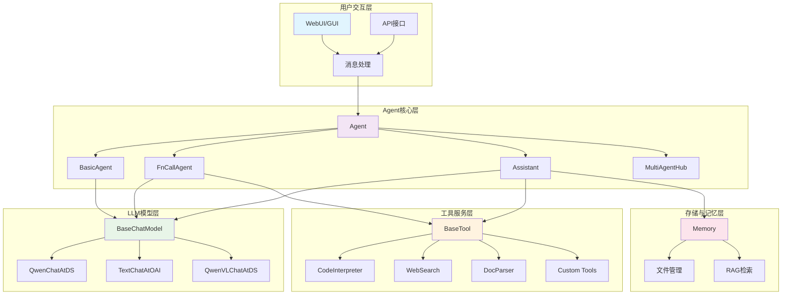

## 📖 概述

Qwen-Agent是一个基于通义千问模型的LLM应用开发框架，为开发者提供了强大的Agent构建能力。本文档将从架构设计、核心API、模块分析、实战案例等多个维度，对Qwen-Agent框架进行全面深入的源码剖析。

### 🎯 框架核心特性
- **多层次Agent抽象**：从BasicAgent到复合Agent，支持灵活的架构设计
- **丰富的工具生态**：内置代码解释器、文档解析、搜索工具等
- **多模态支持**：支持文本、图像、音频等多种输入输出模式
- **RAG集成**：内置检索增强生成功能
- **多Agent协作**：支持多智能体协同工作
- **GUI界面**：基于Gradio的Web界面

## 📁 文档结构

### 1. [整体架构设计](/posts/01-整体架构设计/)
- 系统整体架构图
- 核心组件关系图
- 数据流时序图
- 模块交互图

### 2. [核心API详细分析](/posts/02-核心API分析/)
- 对外暴露的主要API
- API调用链路分析
- 关键函数实现剖析

### 3. [Agent模块深度解析](/posts/03-Agent模块解析/)
- Agent基类设计原理
- 具体Agent实现分析
- 消息处理机制
- 工具调用流程

### 4. [LLM模块架构分析](/posts/04-LLM模块分析/)
- BaseChatModel抽象设计
- 多种模型服务适配
- 函数调用机制
- 流式输出处理

### 5. [Tools工具系统解析](/posts/05-Tools工具系统/)
- 工具注册机制
- 内置工具详解
- 自定义工具开发
- 工具调用链路

### 6. [Memory内存管理](/posts/06-Memory内存管理/)
- 内存管理架构
- 文件处理机制
- RAG检索实现

### 7. [GUI界面系统](/posts/07-GUI界面系统/)
- WebUI架构设计
- Gradio集成方案
- 消息流处理

### 8. [多Agent协作机制](/posts/08-多Agent协作/)
- MultiAgentHub设计
- Agent间通信机制
- 协作模式分析

### 9. [数据结构与UML图](/posts/09-数据结构UML/)
- 核心数据结构设计
- UML类图详解
- 消息格式规范

### 10. [实战案例与最佳实践](/posts/10-实战案例/)
- 框架使用示例
- 自定义Agent开发
- 性能优化建议
- 问题排查指南

## 🚀 快速上手

### 基础使用示例

```python
# 1. 导入核心组件
from qwen_agent.agents import Assistant
from qwen_agent.tools.base import BaseTool, register_tool
import json5

# 2. 自定义工具开发
@register_tool('weather_tool')
class WeatherTool(BaseTool):
    """天气查询工具"""
    description = '查询指定城市的天气信息'
    parameters = [{
        'name': 'city',
        'type': 'string', 
        'description': '城市名称',
        'required': True
    }]
    
    def call(self, params: str, **kwargs) -> str:
        """工具调用实现
        
        Args:
            params: JSON格式的参数字符串
            **kwargs: 额外参数
            
        Returns:
            str: 查询结果
        """
        params_dict = json5.loads(params)
        city = params_dict['city']
        # 实际实现中会调用天气API
        return f"{city}今天晴天，温度25°C"

# 3. 配置LLM模型
llm_cfg = {
    'model': 'qwen3-235b-a22b',
    'model_type': 'qwen_dashscope',
    'generate_cfg': {
        'top_p': 0.8
    }
}

# 4. 创建Assistant代理
bot = Assistant(
    llm=llm_cfg,
    function_list=['weather_tool', 'code_interpreter'],
    system_message='你是一个智能助手，可以查询天气和执行代码'
)

# 5. 消息交互
messages = [{'role': 'user', 'content': '帮我查一下北京的天气'}]
for response in bot.run(messages=messages):
    print(response[-1].content)
```

### 架构概览图



## 🔧 开发环境设置

### 依赖安装
```bash
# 完整安装（推荐）
pip install -U "qwen-agent[gui,rag,code_interpreter,mcp]"

# 最小安装
pip install -U qwen-agent
```

### 环境变量配置
```bash
# DashScope API Key
export DASHSCOPE_API_KEY="your_api_key"

# 工作目录（可选）
export QWEN_AGENT_WORKSPACE="/path/to/workspace"
```

## 📈 性能与监控

### 关键性能指标
- **响应延迟**：Agent处理消息的端到端延迟
- **工具调用成功率**：工具执行的成功率统计
- **内存使用率**：长会话场景下的内存管理效果
- **并发处理能力**：多用户同时访问的处理能力

### 监控建议
```python
import time
from qwen_agent.log import logger

def monitor_agent_performance(agent, messages):
    """性能监控装饰器"""
    start_time = time.time()
    
    try:
        for response in agent.run(messages):
            yield response
    except Exception as e:
        logger.error(f"Agent执行异常: {e}")
        raise
    finally:
        execution_time = time.time() - start_time
        logger.info(f"Agent执行耗时: {execution_time:.2f}秒")
```

## 🤝 贡献指南

### 开发流程
1. Fork项目到个人仓库
2. 创建功能分支 (`git checkout -b feature/AmazingFeature`)
3. 提交代码 (`git commit -m 'Add some AmazingFeature'`)
4. 推送分支 (`git push origin feature/AmazingFeature`)
5. 创建Pull Request

### 代码规范
- 遵循PEP 8 Python编码规范
- 添加完整的类型注解
- 编写详细的docstring文档
- 提供单元测试用例

## 📞 支持与反馈

- **官方文档**: https://qwen.readthedocs.io/
- **GitHub Issues**: https://github.com/QwenLM/Qwen-Agent/issues
- **讨论社区**: https://github.com/QwenLM/Qwen-Agent/discussions

---

*本文档持续更新中，最后更新时间：2025年1月*
