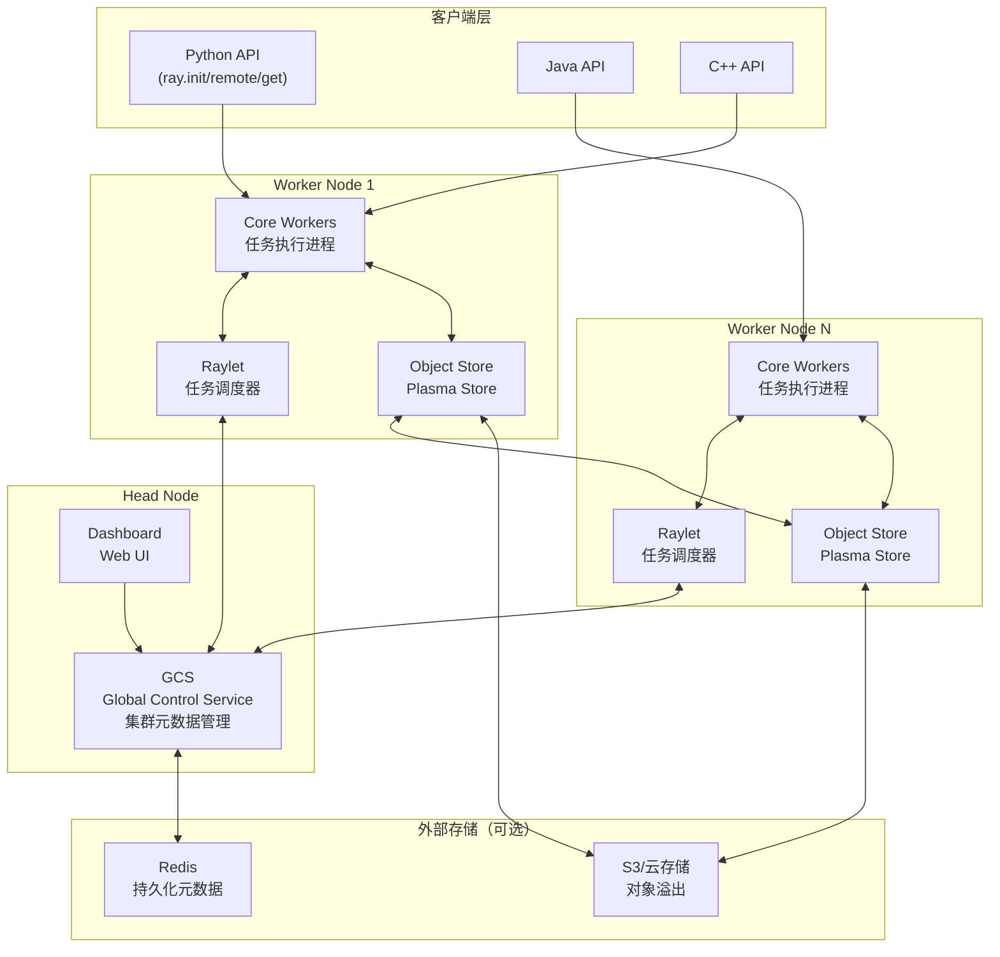
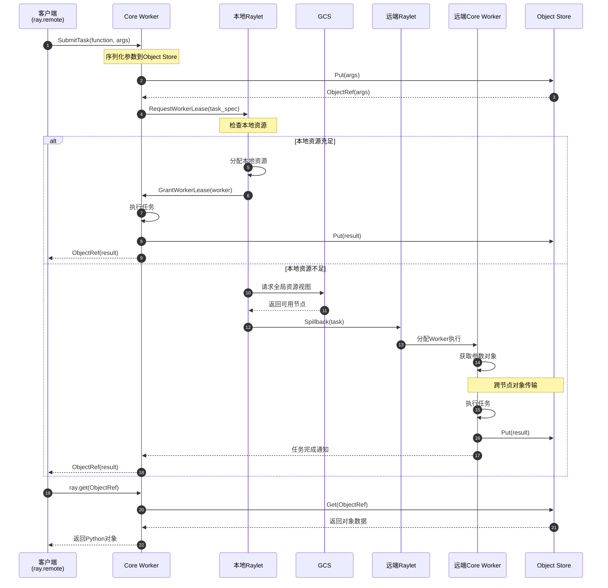

# Ray-00-总览

## 0. 摘要

### 项目目标与问题域

Ray是一个开源的通用分布式计算框架，旨在简化分布式应用程序的开发和扩展。其核心目标包括：

- 提供统一的API用于任务并行、Actor模型和分布式数据处理
- 简化分布式系统的资源管理和调度
- 支持动态任务图和异构资源调度
- 提供高性能的对象存储和传输机制
- 支持机器学习工作负载的弹性扩展

### 核心能力边界

**支持的能力**：
- 分布式任务调度与执行（Task Parallel）
- 分布式Actor编程模型
- 分布式数据处理（Ray Data）
- 分布式训练（Ray Train）
- 超参数调优（Ray Tune）
- 模型服务（Ray Serve）
- 强化学习（RLlib）
- 自动扩缩容（Autoscaler）
- 运行时环境隔离（Runtime Environment）

**非目标**：
- 不是通用的消息队列系统
- 不提供持久化存储解决方案（依赖外部存储）
- 不是纯粹的流处理系统

### 运行环境

**语言与运行时**：
- Python 3.7+ （主要客户端语言）
- C++17 （核心系统实现）
- Java 8+ （Java客户端）
- 依赖：gRPC、Arrow、Protobuf、Boost等

**部署形态**：
- 单机模式：用于开发和测试
- 集群模式：支持多节点分布式部署
- 云端部署：支持AWS、GCP、Azure等云平台
- Kubernetes：支持K8s原生部署（KubeRay）

## 1. 整体架构图



### 架构图解与要点

**组件职责**：

1. **GCS (Global Control Service)**
   - 集中式的控制平面，管理集群全局状态
   - 存储Actor、Job、Node的元数据
   - 负责Actor和Placement Group的调度决策
   - 提供集群资源视图的统一查询接口

2. **Raylet**
   - 运行在每个Worker节点上的本地调度器
   - 接收任务提交请求并执行本地调度
   - 管理本地资源和Worker进程池
   - 处理任务溢出（Spillback）到其他节点
   - 与GCS通信获取全局视图

3. **Object Store (Plasma Store)**
   - 基于共享内存的高性能对象存储
   - 零拷贝的对象访问机制
   - 支持对象引用计数和自动回收
   - 支持对象溢出到外部存储（S3等）

4. **Core Worker**
   - 实际执行任务和Actor方法的进程
   - 管理对象的序列化和反序列化
   - 处理远程函数调用和Actor消息
   - 维护对象引用计数

5. **Dashboard**
   - Web界面用于集群监控和管理
   - 展示任务状态、资源使用、日志等
   - 支持Job和Actor的生命周期管理

**耦合关系**：

- **同步调用**：Client → Core Worker → Raylet（任务提交）
- **异步通信**：Raylet ↔ GCS（心跳、资源上报）
- **共享内存**：Core Worker ↔ Object Store（对象读写）
- **gRPC**：跨节点的Core Worker通信、Raylet通信

**数据流与控制流**：

- **控制流**：Client → Core Worker → Raylet → GCS（调度决策）→ Raylet → Core Worker
- **数据流**：Core Worker → Object Store → 网络传输 → 远端Object Store → 远端Core Worker

**跨进程/跨线程路径**：

- 客户端调用通过gRPC与本地Core Worker通信（跨进程）
- Core Worker内部使用线程池处理并发任务（多线程）
- Raylet与GCS之间通过gRPC异步通信（跨节点）

**高可用性**：

- GCS支持故障恢复机制，元数据可持久化到Redis
- Actor支持自动重启（max_restarts配置）
- 对象存储支持对象重建（Lineage-based recovery）

**扩展性**：

- 水平扩展：增加Worker节点提升计算能力
- 资源异构：支持CPU、GPU、自定义资源
- 动态调度：支持任务动态提交和资源动态分配

**状态管理**：

- Actor状态存储在Core Worker进程内存
- 集群状态集中存储在GCS
- 对象元数据分布式存储在各节点Raylet

## 2. 全局时序图（任务提交与执行）



### 时序图解与要点

**关键步骤说明**：

1. **任务提交（步骤1-3）**
   - 客户端调用`@ray.remote`装饰的函数
   - Core Worker序列化函数参数并存入Object Store
   - 生成TaskSpecification包含函数描述符和参数引用

2. **资源请求（步骤4-5）**
   - Core Worker向本地Raylet请求Worker租约
   - Raylet查看本地资源是否满足任务需求
   - 包括CPU、GPU、内存和自定义资源

3. **本地调度路径（步骤6-9）**
   - 资源充足时在本地执行
   - 从Worker池获取或创建新Worker进程
   - Worker执行任务并将结果写入Object Store

4. **远端调度路径（步骤10-17）**
   - 本地资源不足时触发Spillback
   - Raylet查询GCS获取全局资源视图
   - 选择合适的远端节点并转发任务
   - 远端节点独立执行相同的调度流程

5. **对象获取（步骤18-21）**
   - 客户端调用`ray.get()`阻塞等待结果
   - Core Worker从Object Store读取对象
   - 如果对象不在本地，触发跨节点传输

**幂等性**：

- 任务提交本身不保证幂等，需应用层处理
- 对象引用（ObjectRef）全局唯一，可多次get
- Actor方法调用顺序由Ray保证

**重试策略**：

- 任务失败默认不重试，可通过`max_retries`配置
- Actor方法失败会根据Actor配置决定是否重启Actor
- 网络传输失败有自动重试机制（指数退避）

**超时处理**：

- `ray.get()`支持timeout参数
- 任务执行本身无超时，需应用层实现
- Worker租约有超时机制，超时后回收资源

**资源上界**：

- 每个任务的资源需求在提交时指定
- Raylet维护节点总资源和可用资源
- 资源不足时任务排队等待或Spillback

## 3. 模块边界与交互图

### 模块清单

| 模块名称 | 位置 | 职责 | 对外API |
|---------|------|------|---------|
| Core API | python/ray/__init__.py | 提供ray.init/remote/get等基础API | init, remote, get, put, wait |
| Actor | python/ray/actor.py | Actor编程模型 | @ray.remote(class), ActorClass.remote() |
| Data | python/ray/data/ | 分布式数据处理 | ray.data.read_*, Dataset类 |
| Train | python/ray/train/ | 分布式训练 | Trainer类, ScalingConfig |
| Tune | python/ray/tune/ | 超参数调优 | tune.run, Tuner类 |
| Serve | python/ray/serve/ | 模型服务 | @serve.deployment, serve.run |
| RLlib | rllib/ | 强化学习 | Trainer类, PPO/DQN等算法 |
| Autoscaler | python/ray/autoscaler/ | 自动扩缩容 | autoscaler配置文件 |
| Runtime Env | python/ray/runtime_env/ | 运行时环境管理 | RuntimeEnv类 |
| Dashboard | python/ray/dashboard/ | Web监控面板 | HTTP API |
| GCS | src/ray/gcs/ | 全局控制服务（C++） | gRPC服务 |
| Raylet | src/ray/raylet/ | 本地任务调度器（C++） | gRPC服务 |
| Core Worker | src/ray/core_worker/ | 任务执行器（C++） | gRPC服务 |
| Object Manager | src/ray/object_manager/ | 对象传输管理（C++） | 内部接口 |

### 模块交互矩阵

| 调用方 → 被调方 | Core API | Actor | GCS | Raylet | Core Worker | Object Store |
|----------------|----------|-------|-----|--------|-------------|-------------|
| **Python Client** | 同步 | 同步 | - | - | gRPC | - |
| **Core API** | - | - | - | - | 内部调用 | - |
| **Actor** | 使用 | - | - | - | 内部调用 | - |
| **Core Worker** | - | - | gRPC | gRPC | gRPC | 共享内存 |
| **Raylet** | - | - | gRPC异步 | gRPC | gRPC | - |
| **GCS** | - | - | - | 推送消息 | - | - |
| **Object Store** | - | - | - | - | 共享内存 | - |

### 交互说明

**同步调用**：
- Python Client → Core Worker：任务提交、对象获取
- Core Worker → Raylet：Worker租约请求
- Core Worker → Object Store：对象读写（共享内存）

**异步消息**：
- Raylet → GCS：心跳、资源上报
- GCS → Raylet：Actor调度指令、资源更新通知
- Core Worker间：Actor消息传递

**共享存储**：
- 同节点的Core Worker通过Object Store共享对象（零拷贝）
- GCS元数据可选持久化到Redis

**订阅/发布**：
- Raylet订阅GCS的节点状态变更
- Core Worker订阅Raylet的资源可用性事件

## 4. 关键设计与权衡

### 数据一致性

**最终一致性**：
- 集群资源视图采用最终一致性模型
- Raylet定期向GCS上报资源使用情况（心跳间隔）
- 调度决策基于略有延迟的资源视图

**强一致性**：
- Actor状态修改在单个Actor内部是顺序一致的
- GCS元数据写入（Actor注册、Job提交）是强一致的

**事务边界**：
- 单个任务的执行是原子的（成功或失败）
- 跨任务的状态需要应用层保证一致性
- Actor方法调用在Actor内部串行执行

### 并发控制

**锁策略**：
- GCS内部使用细粒度锁保护元数据
- Object Store使用读写锁管理对象访问
- Raylet调度器无锁化设计（基于消息传递）

**Actor并发**：
- 默认Actor方法串行执行
- 支持并发Actor（async def或concurrency_groups）
- 并发度由应用层控制

### 性能关键路径

**P95延迟优化**：
- 对象存储基于共享内存，本地访问延迟<1ms
- 任务提交到执行的延迟通常<10ms（本地调度）
- 跨节点任务调度延迟约50-200ms

**内存峰值**：
- Object Store默认占用30%节点内存
- 可通过object_store_memory参数调整
- 支持对象溢出到磁盘或云存储

**I/O热点**：
- 对象传输使用专用的Object Manager处理
- 支持对象分块传输和并行传输
- 大对象自动触发直接传输（Direct Call）

**可观测性指标**：
- 任务QPS、延迟分布
- Object Store内存使用率、溢出速率
- Worker池大小、任务队列深度
- 网络带宽使用

### 配置项

**影响行为的关键配置**：

| 配置项 | 默认值 | 说明 |
|--------|--------|------|
| num_cpus | 自动检测 | 节点CPU核心数 |
| num_gpus | 自动检测 | 节点GPU数量 |
| object_store_memory | 30%内存 | Object Store大小 |
| max_restarts | 0 | Actor失败重启次数 |
| max_retries | 0 | 任务失败重试次数 |
| num_workers_soft_limit | 自动 | Worker进程软上限 |

## 5. 典型使用示例与最佳实践

### 示例1：最小可运行入口

```python
import ray

# 1. 初始化Ray集群
ray.init()  # 本地模式
# 或连接到现有集群: ray.init(address='auto')

# 2. 定义远程函数
@ray.remote
def compute_task(x):
    return x * x

# 3. 提交任务
futures = [compute_task.remote(i) for i in range(10)]

# 4. 获取结果
results = ray.get(futures)
print(results)  # [0, 1, 4, 9, 16, 25, 36, 49, 64, 81]

# 5. 清理
ray.shutdown()
```

**核心业务链路**：
1. `ray.init()`启动或连接Ray集群
2. `@ray.remote`装饰器将函数注册为远程函数
3. `.remote()`异步提交任务，返回ObjectRef
4. `ray.get()`阻塞获取结果，触发任务执行

### 示例2：Actor使用

```python
import ray

ray.init()

@ray.remote
class Counter:
    def __init__(self):
        self.value = 0
    
    def increment(self):
        self.value += 1
        return self.value
    
    def get_value(self):
        return self.value

# 创建Actor实例
counter = Counter.remote()

# 调用Actor方法
futures = [counter.increment.remote() for _ in range(10)]
results = ray.get(futures)
print(results)  # [1, 2, 3, 4, 5, 6, 7, 8, 9, 10]

# 获取最终值
final = ray.get(counter.get_value.remote())
print(final)  # 10
```

### 示例3：规模化注意事项

**资源配置**：
```python
# 显式指定资源需求
@ray.remote(num_cpus=2, num_gpus=1, memory=1024*1024*1024)
def gpu_task(data):
    # GPU计算任务
    pass

# 自定义资源
ray.init(resources={"special_hardware": 4})

@ray.remote(resources={"special_hardware": 1})
def special_task():
    pass
```

**对象管理**：
```python
# 避免传递大对象，使用ObjectRef
large_data = ray.put(huge_array)  # 只传输一次

@ray.remote
def process(data_ref):
    data = ray.get(data_ref)  # 在worker内部获取
    return compute(data)

# 并行处理
futures = [process.remote(large_data) for _ in range(100)]
```

**错误处理**：
```python
# 任务重试
@ray.remote(max_retries=3)
def may_fail_task():
    pass

# Actor容错
@ray.remote(max_restarts=5)
class RobustActor:
    pass

# 超时控制
try:
    result = ray.get(future, timeout=10)
except ray.exceptions.GetTimeoutError:
    print("Task timeout")
```

**监控和调试**：
```python
# 启用Dashboard
ray.init(include_dashboard=True)

# 查看集群状态
ray.cluster_resources()
ray.available_resources()

# 使用Ray State API
from ray.util.state import list_tasks, list_actors
print(list_tasks(limit=10))
```

## 6. 部署形态说明

### 单机模式
```python
# 自动启动所有组件
ray.init()
```

### 集群模式
```bash
# Head节点
ray start --head --port=6379

# Worker节点
ray start --address='head_node_ip:6379'
```

### Kubernetes部署
```yaml
# 使用KubeRay Operator
apiVersion: ray.io/v1alpha1
kind: RayCluster
metadata:
  name: ray-cluster
spec:
  rayVersion: '2.9.0'
  headGroupSpec:
    replicas: 1
  workerGroupSpecs:
  - replicas: 3
    minReplicas: 1
    maxReplicas: 10
```

---

## 附录：版本信息

本文档基于Ray主干代码分析，对应Ray 2.x系列版本。具体实现细节可能随版本演进有所变化。

