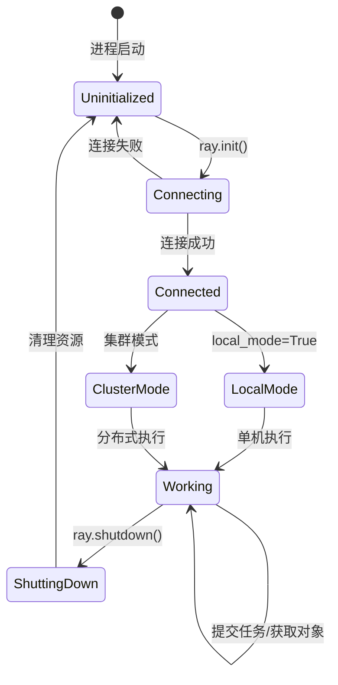
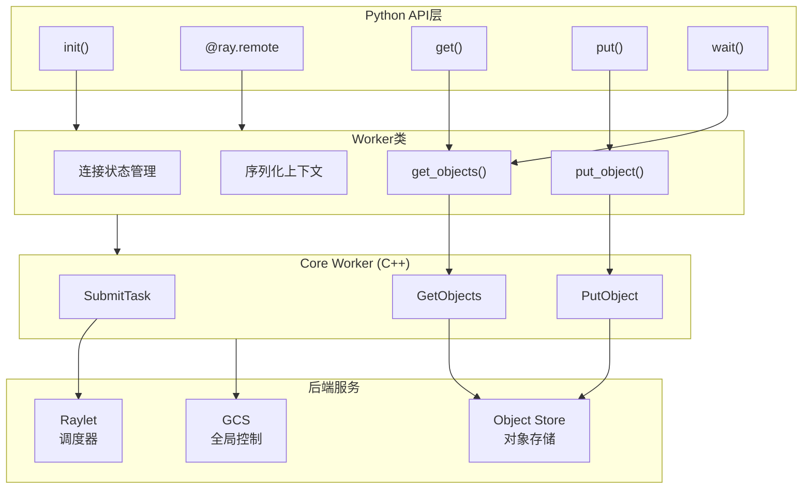
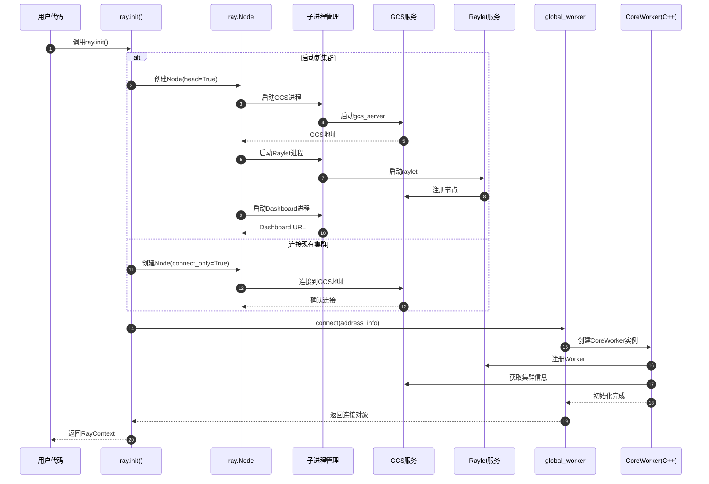
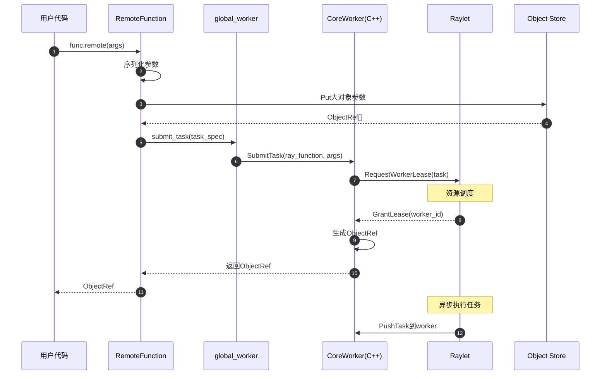
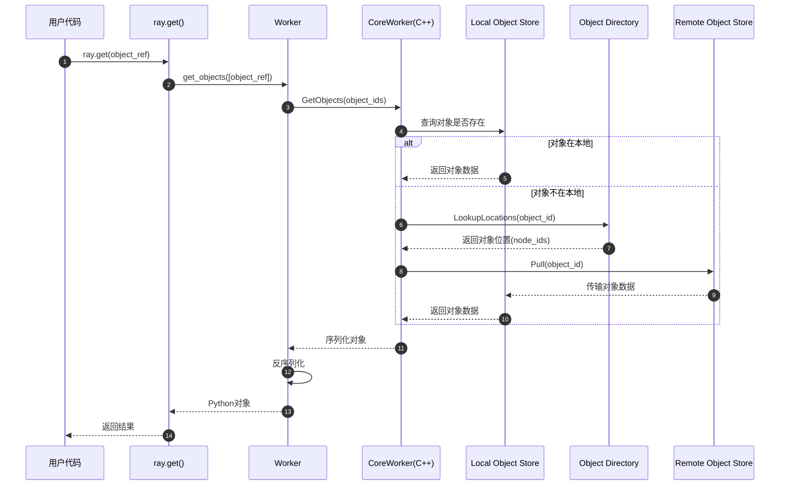
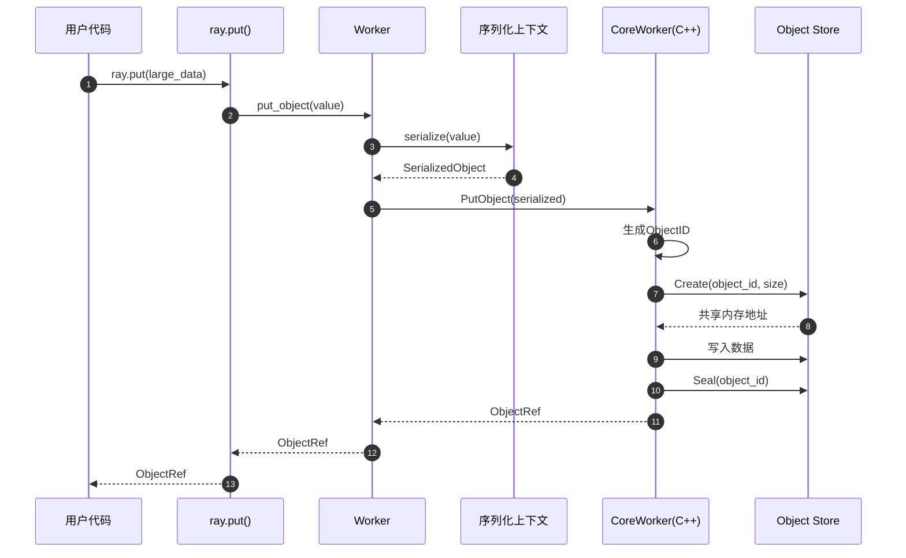
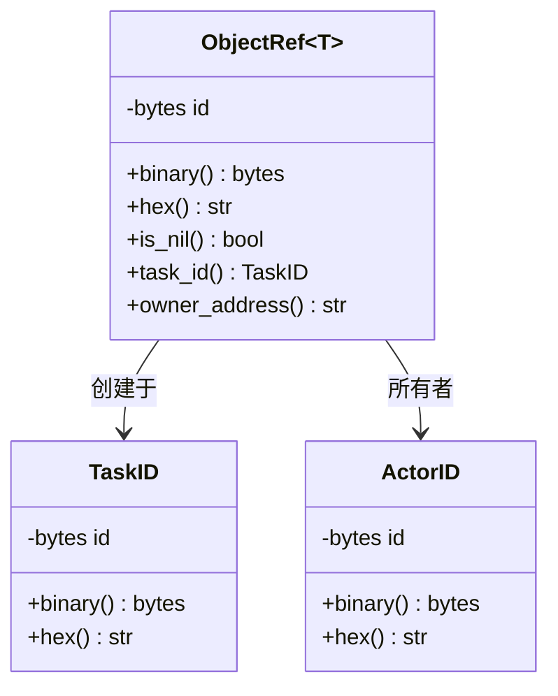
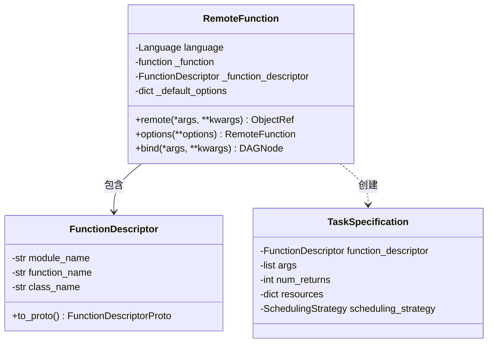

# Ray-01-核心API模块

## 模块概览

### 职责

核心API模块是Ray框架的基础层，提供Python用户与Ray分布式系统交互的主要接口。其核心职责包括：

- 集群初始化与连接管理（init, shutdown）
- 远程函数注册与调用（@ray.remote装饰器）
- 任务提交与异步执行（.remote()方法）
- 对象存储与获取（put, get）
- 同步原语（wait）
- Actor handle管理（get_actor）
- 资源查询（cluster_resources, available_resources）

### 输入/输出

**输入**：
- Python函数/类定义
- 函数调用参数
- 对象引用（ObjectRef）
- 配置参数（资源需求、超时等）

**输出**：
- ObjectRef（异步任务句柄）
- Actor handle（Actor实例引用）
- Python对象（get操作的结果）
- 集群状态信息

### 上下游依赖

**上游依赖（被调用）**：
- Python用户代码
- Ray高层库（Data, Train, Serve等）

**下游依赖（调用）**：
- Core Worker（C++）：任务提交、对象读写
- Raylet（C++）：任务调度
- GCS（C++）：集群状态查询
- Object Store（Plasma）：对象存储

### 生命周期



### 模块架构图



## API详细规格

### API 1: ray.init()

#### 基本信息

- **名称**：`init`
- **位置**：`python/ray/_private/worker.py`
- **协议**：Python函数调用
- **幂等性**：否（重复调用抛出异常，除非设置ignore_reinit_error=True）

#### 函数签名

```python
def init(
    address: Optional[str] = None,
    *,
    num_cpus: Optional[int] = None,
    num_gpus: Optional[int] = None,
    resources: Optional[Dict[str, float]] = None,
    labels: Optional[Dict[str, str]] = None,
    object_store_memory: Optional[int] = None,
    local_mode: bool = False,
    ignore_reinit_error: bool = False,
    include_dashboard: Optional[bool] = None,
    dashboard_host: str = ray_constants.DEFAULT_DASHBOARD_IP,
    dashboard_port: Optional[int] = None,
    job_config: "ray.job_config.JobConfig" = None,
    configure_logging: bool = True,
    logging_level: int = ray_constants.LOGGER_LEVEL,
    logging_format: Optional[str] = None,
    logging_config: Optional[LoggingConfig] = None,
    log_to_driver: Optional[bool] = None,
    namespace: Optional[str] = None,
    runtime_env: Optional[Union[Dict[str, Any], "RuntimeEnv"]] = None,
    **kwargs,
) -> BaseContext
```

#### 参数说明

| 参数 | 类型 | 必填 | 默认值 | 说明 |
|------|------|------|--------|------|
| address | str | 否 | None | 集群地址。None表示启动本地集群，"auto"表示连接已有集群，"ray://ip:port"表示通过客户端连接 |
| num_cpus | int | 否 | 自动检测 | 节点CPU核心数（仅启动新集群时有效） |
| num_gpus | int | 否 | 自动检测 | 节点GPU数量（仅启动新集群时有效） |
| resources | Dict[str, float] | 否 | None | 自定义资源字典 |
| labels | Dict[str, str] | 否 | None | 节点标签（实验性功能） |
| object_store_memory | int | 否 | 30%内存 | Object Store大小（字节） |
| local_mode | bool | 否 | False | 本地模式（已弃用，用于调试） |
| ignore_reinit_error | bool | 否 | False | 是否忽略重复初始化错误 |
| include_dashboard | bool | 否 | None | 是否启动Dashboard |
| dashboard_host | str | 否 | "127.0.0.1" | Dashboard绑定地址 |
| dashboard_port | int | 否 | None | Dashboard端口 |
| job_config | JobConfig | 否 | None | Job配置对象 |
| configure_logging | bool | 否 | True | 是否配置日志 |
| logging_level | int | 否 | INFO | 日志级别 |
| namespace | str | 否 | None | 命名空间（用于Actor隔离） |
| runtime_env | dict/RuntimeEnv | 否 | None | 运行时环境配置 |

#### 返回值

返回`RayContext`或`ClientContext`对象，包含：
- 集群地址信息
- Dashboard URL
- Ray版本信息
- 节点ID

#### 核心实现代码

```python
# python/ray/_private/worker.py
def init(...) -> BaseContext:
    # 1. 检查是否使用Ray Client模式
    if address is not None and address.startswith("ray://"):
        builder = ray.client(address)
        # 配置客户端参数
        builder._init_args(**passed_kwargs)
        ctx = builder.connect()
        return ctx
    
    # 2. 检查是否已经初始化
    if global_worker.connected:
        if ignore_reinit_error:
            return RayContext(dict(_global_node.address_info, 
                                  node_id=node_id.hex()))
        else:
            raise RuntimeError("Maybe you called ray.init twice?")
    
    # 3. 确定是启动新集群还是连接现有集群
    bootstrap_address = services.canonicalize_bootstrap_address(address, _temp_dir)
    
    if bootstrap_address is None:
        # 启动新集群
        ray_params = ray._private.parameter.RayParams(
            node_ip_address=_node_ip_address,
            num_cpus=num_cpus,
            num_gpus=num_gpus,
            resources=resources,
            object_store_memory=object_store_memory,
            # ...其他参数
        )
        _global_node = ray._private.node.Node(
            ray_params=ray_params,
            head=True,
            shutdown_at_exit=False,
            spawn_reaper=True,
            ray_init_cluster=True,
        )
    else:
        # 连接现有集群
        _global_node = ray._private.node.Node(
            ray_params,
            head=False,
            connect_only=True,
        )
    
    # 4. 初始化全局worker
    _global_node.connect(_global_node.address_info)
    global_worker.set_mode(driver_mode)
    
    # 5. 设置job配置
    job_config = job_config or ray.job_config.JobConfig()
    if runtime_env:
        job_config.set_runtime_env(runtime_env)
    
    # 6. 初始化core worker
    global_worker.core_worker.set_current_job_id(job_id)
    
    return RayContext(dict(_global_node.address_info, 
                          dashboard_url=dashboard_url))
```

#### 调用链与上层函数

**调用链**：
1. 用户代码 → `ray.init()`
2. `ray.init()` → `ray._private.worker.init()`
3. `init()` → `ray._private.node.Node()` （启动本地节点）
4. `Node()` → 启动Raylet、GCS、Dashboard等进程
5. `init()` → `global_worker.connect()` （连接到集群）
6. `connect()` → `core_worker.CoreWorker()` （初始化C++ Core Worker）

#### 时序图



#### 边界条件与异常处理

**边界条件**：
- 重复调用：默认抛出`RuntimeError`，可设置`ignore_reinit_error=True`忽略
- 连接超时：无法连接到指定地址时抛出`ConnectionError`
- 资源不足：如果指定的资源超过系统可用资源，会给出警告但仍然启动

**异常类型**：
- `RuntimeError`：重复初始化、参数错误
- `ConnectionError`：无法连接到集群
- `ValueError`：参数验证失败
- `TypeError`：参数类型错误

**回退策略**：
- 连接失败时不会自动重试，由用户决定
- 启动进程失败时会清理已启动的子进程

#### 使用示例

```python
# 示例1：启动本地集群
import ray
ray.init()

# 示例2：指定资源
ray.init(num_cpus=4, num_gpus=1, object_store_memory=1024*1024*1024)

# 示例3：连接到现有集群
ray.init(address='auto')  # 自动发现
# 或
ray.init(address='ray://192.168.1.100:10001')  # Ray Client模式

# 示例4：使用运行时环境
ray.init(runtime_env={
    "pip": ["requests==2.26.0"],
    "env_vars": {"MY_VAR": "value"}
})

# 示例5：命名空间隔离
ray.init(namespace="my_namespace")
```

### API 2: @ray.remote 装饰器

#### 基本信息

- **名称**：`remote`
- **位置**：`python/ray/_private/worker.py`
- **协议**：Python装饰器
- **幂等性**：是（多次装饰同一函数返回相同的RemoteFunction对象）

#### 函数签名

```python
def remote(
    *,
    num_returns: Union[int, Literal["streaming"]] = Undefined,
    num_cpus: Union[int, float] = Undefined,
    num_gpus: Union[int, float] = Undefined,
    resources: Dict[str, float] = Undefined,
    accelerator_type: str = Undefined,
    memory: Union[int, float] = Undefined,
    max_calls: int = Undefined,
    max_restarts: int = Undefined,
    max_task_retries: int = Undefined,
    max_retries: int = Undefined,
    retry_exceptions: Union[bool, List[Exception]] = Undefined,
    runtime_env: Dict[str, Any] = Undefined,
    scheduling_strategy: Union[None, Literal["DEFAULT"], Literal["SPREAD"], PlacementGroupSchedulingStrategy, NodeAffinitySchedulingStrategy] = Undefined,
    _metadata: Dict[str, str] = Undefined,
    **options,
) -> Union[RemoteFunction, ActorClass]
```

#### 参数说明

| 参数 | 类型 | 必填 | 默认值 | 说明 |
|------|------|------|--------|------|
| num_returns | int/"streaming" | 否 | 1 | 任务返回值数量。"streaming"表示生成器 |
| num_cpus | int/float | 否 | 1 | 任务需要的CPU核心数 |
| num_gpus | int/float | 否 | 0 | 任务需要的GPU数量 |
| resources | Dict[str, float] | 否 | {} | 自定义资源需求 |
| memory | int/float | 否 | None | 内存需求（字节） |
| max_calls | int | 否 | 0 | Worker最大重用次数（0表示无限制） |
| max_restarts | int | 否 | 0 | Actor重启次数（仅Actor有效） |
| max_retries/max_task_retries | int | 否 | 0 | 任务失败重试次数 |
| retry_exceptions | bool/List[Exception] | 否 | False | 是否重试异常或指定异常类型 |
| runtime_env | dict | 否 | None | 运行时环境 |
| scheduling_strategy | str/策略对象 | 否 | "DEFAULT" | 调度策略 |

#### 返回值

- **函数装饰**：返回`RemoteFunction`对象
- **类装饰**：返回`ActorClass`对象

#### 核心实现代码（函数）

```python
# python/ray/_private/worker.py
def remote(*args, **kwargs):
    # 处理装饰器参数
    if len(args) == 1 and len(kwargs) == 0 and callable(args[0]):
        # @ray.remote 无参数形式
        return make_decorator(args[0])
    elif len(args) == 0:
        # @ray.remote(**options) 有参数形式
        return lambda fn: make_decorator(fn, **kwargs)
    else:
        raise TypeError("Invalid usage of @ray.remote")
    
def make_decorator(function_or_class, **options):
    # 检测是函数还是类
    if inspect.isfunction(function_or_class) or is_cython(function_or_class):
        # 普通函数 -> RemoteFunction
        return _make_remote_function(function_or_class, options)
    elif inspect.isclass(function_or_class):
        # 类 -> ActorClass
        return _make_actor_class(function_or_class, options)
    else:
        raise TypeError("Expected a function or class")

def _make_remote_function(function, options):
    # 1. 提取函数签名和元数据
    func_signature = signature.extract_signature(function)
    
    # 2. 创建FunctionDescriptor（用于序列化）
    func_descriptor = FunctionDescriptor.from_function(
        function,
        function.__module__
    )
    
    # 3. 注册函数到worker
    global_worker.function_actor_manager.export(func_descriptor, function)
    
    # 4. 包装为RemoteFunction对象
    remote_function = RemoteFunction(
        Language.PYTHON,
        function,
        func_descriptor,
        options,
    )
    
    return remote_function
```

#### RemoteFunction.remote()方法

```python
# python/ray/remote_function.py
class RemoteFunction:
    def remote(self, *args, **kwargs):
        # 1. 准备任务参数
        task_args = []
        for arg in args:
            if isinstance(arg, ObjectRef):
                task_args.append(arg)  # 传递引用
            else:
                # 小对象内联，大对象存入Object Store
                task_args.append(arg)
        
        # 2. 构建TaskSpecification
        task_spec = TaskSpecification(
            function_descriptor=self._function_descriptor,
            args=task_args,
            num_returns=self._num_returns,
            resources=self._resources,
            # ...其他配置
        )
        
        # 3. 提交任务到Core Worker
        object_refs = global_worker.core_worker.submit_task(
            task_spec,
            max_retries=self._max_retries,
            retry_exceptions=self._retry_exceptions,
        )
        
        # 4. 返回ObjectRef
        if self._num_returns == 1:
            return object_refs[0]
        else:
            return object_refs
```

#### 时序图（函数任务提交）



### API 3: ray.get()

#### 基本信息

- **名称**：`get`
- **位置**：`python/ray/_private/worker.py`
- **协议**：Python函数调用
- **幂等性**：是（多次get同一ObjectRef返回相同值）

#### 函数签名

```python
def get(
    object_refs: Union[
        "ObjectRef[Any]",
        Sequence["ObjectRef[Any]"],
    ],
    *,
    timeout: Optional[float] = None,
) -> Union[Any, List[Any]]
```

#### 参数说明

| 参数 | 类型 | 必填 | 默认值 | 说明 |
|------|------|------|--------|------|
| object_refs | ObjectRef/List[ObjectRef] | 是 | - | 要获取的对象引用 |
| timeout | float | 否 | None | 超时时间（秒）。None表示无限等待 |

#### 返回值

- 单个ObjectRef：返回对应的Python对象
- ObjectRef列表：返回对象列表（保持顺序）

#### 核心实现代码

```python
# python/ray/_private/worker.py
def get(object_refs, *, timeout=None):
    worker = global_worker
    worker.check_connected()
    
    # 1. 参数标准化
    is_individual_id = isinstance(object_refs, ray.ObjectRef)
    if is_individual_id:
        object_refs = [object_refs]
    
    # 2. 调用worker.get_objects()
    values, debugger_breakpoint = worker.get_objects(
        object_refs, 
        timeout=timeout
    )
    
    # 3. 检查异常
    for i, value in enumerate(values):
        if isinstance(value, RayError):
            if isinstance(value, RayTaskError):
                raise value.as_instanceof_cause()
            else:
                raise value
    
    # 4. 返回结果
    if is_individual_id:
        return values[0]
    else:
        return values

# Worker.get_objects()实现
class Worker:
    def get_objects(self, object_refs, timeout=None):
        # 1. 转换超时时间
        timeout_ms = int(timeout * 1000) if timeout else -1
        
        # 2. 调用Core Worker获取序列化对象
        serialized_objects = self.core_worker.get_objects(
            object_refs,
            self.current_task_id,
            timeout_ms
        )
        
        # 3. 反序列化对象
        objects = self.deserialize_objects(
            serialized_objects,
            object_refs
        )
        
        return objects, debugger_breakpoint
```

#### C++ Core Worker实现

```cpp
// src/ray/core_worker/core_worker.cc
std::vector<std::shared_ptr<RayObject>> CoreWorker::GetObjects(
    const std::vector<ObjectID> &object_ids,
    int64_t timeout_ms) {
  
  // 1. 创建GetRequest
  std::vector<std::shared_ptr<RayObject>> results(object_ids.size());
  absl::flat_hash_set<ObjectID> remaining_ids;
  for (const auto &id : object_ids) {
    remaining_ids.insert(id);
  }
  
  // 2. 尝试从本地Object Store获取
  bool got_exception = false;
  auto status = plasma_store_provider_->Get(
      remaining_ids,
      timeout_ms,
      task_id,
      &results,
      &got_exception);
  
  // 3. 如果本地没有，触发对象传输
  if (!remaining_ids.empty()) {
    // 向Object Manager请求从远程节点获取对象
    object_directory_->LookupLocations(remaining_ids);
    
    // 等待对象到达
    Wait(remaining_ids, timeout_ms);
    
    // 再次从本地获取
    plasma_store_provider_->Get(
        remaining_ids,
        timeout_ms,
        task_id,
        &results,
        &got_exception);
  }
  
  return results;
}
```

#### 时序图



#### 边界条件与异常处理

**超时处理**：
```python
try:
    result = ray.get(object_ref, timeout=10)
except ray.exceptions.GetTimeoutError:
    print("获取对象超时")
```

**任务失败处理**：
```python
try:
    result = ray.get(object_ref)
except ray.exceptions.RayTaskError as e:
    print(f"任务执行失败：{e}")
    print(f"原始异常：{e.cause}")
```

**对象丢失处理**：
```python
try:
    result = ray.get(object_ref)
except ray.exceptions.ObjectLostError:
    print("对象已丢失（节点故障）")
```

### API 4: ray.put()

#### 基本信息

- **名称**：`put`
- **位置**：`python/ray/_private/worker.py`
- **协议**：Python函数调用
- **幂等性**：否（每次调用创建新的ObjectRef）

#### 函数签名

```python
def put(
    value: Any,
    *,
    _owner: Optional["ray.actor.ActorHandle"] = None,
) -> "ray.ObjectRef"
```

#### 参数说明

| 参数 | 类型 | 必填 | 默认值 | 说明 |
|------|------|------|--------|------|
| value | Any | 是 | - | 要存储的Python对象 |
| _owner | ActorHandle | 否 | None | 对象所有者（内部使用） |

#### 返回值

返回`ObjectRef`，指向存储的对象

#### 核心实现代码

```python
# python/ray/_private/worker.py
def put(value, *, _owner=None):
    worker = global_worker
    worker.check_connected()
    
    # 检查value不能是ObjectRef
    if isinstance(value, ObjectRef):
        raise TypeError("Cannot put an ObjectRef")
    
    # 1. 序列化对象
    try:
        serialized_value = worker.get_serialization_context().serialize(value)
    except TypeError as e:
        # 序列化失败，提供详细错误信息
        sio = io.StringIO()
        ray.util.inspect_serializability(value, print_file=sio)
        raise TypeError(f"Cannot serialize: {sio.getvalue()}") from e
    
    # 2. 确定owner地址
    owner_address = None
    if _owner:
        owner_address = _owner._actor_id.binary()
    
    # 3. 调用Core Worker存储对象
    object_ref = worker.core_worker.put_object(
        serialized_value,
        owner_address=owner_address,
    )
    
    return object_ref

# Worker.put_object()实现
class Worker:
    def put_object(self, value, owner_address=None):
        # 序列化
        serialized_value = self.get_serialization_context().serialize(value)
        
        # 调用C++ Core Worker
        ret = self.core_worker.put_object(
            serialized_value,
            pin_object=True,
            owner_address=owner_address,
            inline_small_object=True,
        )
        
        return ret
```

#### 时序图



### API 5: ray.wait()

#### 基本信息

- **名称**：`wait`
- **位置**：`python/ray/_private/worker.py`
- **协议**：Python函数调用
- **幂等性**：是

#### 函数签名

```python
def wait(
    object_refs: List[ObjectRef],
    *,
    num_returns: int = 1,
    timeout: Optional[float] = None,
    fetch_local: bool = True,
) -> Tuple[List[ObjectRef], List[ObjectRef]]
```

#### 参数说明

| 参数 | 类型 | 必填 | 默认值 | 说明 |
|------|------|------|--------|------|
| object_refs | List[ObjectRef] | 是 | - | 要等待的对象引用列表 |
| num_returns | int | 否 | 1 | 等待完成的对象数量 |
| timeout | float | 否 | None | 超时时间（秒） |
| fetch_local | bool | 否 | True | 是否将对象预取到本地 |

#### 返回值

返回元组`(ready, not_ready)`：
- `ready`：已完成的ObjectRef列表
- `not_ready`：未完成的ObjectRef列表

#### 核心实现代码

```python
def wait(object_refs, *, num_returns=1, timeout=None, fetch_local=True):
    worker = global_worker
    worker.check_connected()
    
    # 参数验证
    if not isinstance(object_refs, list):
        raise TypeError("object_refs must be a list")
    if num_returns <= 0 or num_returns > len(object_refs):
        raise ValueError("Invalid num_returns")
    
    # 转换超时时间
    timeout_ms = int(timeout * 1000) if timeout else -1
    
    # 调用Core Worker
    ready_ids, remaining_ids = worker.core_worker.wait(
        object_refs,
        num_returns,
        timeout_ms,
        worker.current_task_id,
        fetch_local,
    )
    
    return ready_ids, remaining_ids
```

#### 使用示例

```python
# 示例1：等待第一个任务完成
refs = [func.remote() for _ in range(10)]
ready, not_ready = ray.wait(refs, num_returns=1)
first_result = ray.get(ready[0])

# 示例2：等待所有任务完成
ready, _ = ray.wait(refs, num_returns=len(refs))
results = ray.get(ready)

# 示例3：超时控制
ready, not_ready = ray.wait(refs, num_returns=5, timeout=10)
if len(ready) < 5:
    print("部分任务超时")

# 示例4：迭代处理完成的任务
refs = [task.remote(i) for i in range(100)]
while refs:
    ready, refs = ray.wait(refs)
    result = ray.get(ready[0])
    process(result)
```

## 关键数据结构

### ObjectRef

```python
# python/ray/_raylet.pyi
class ObjectRef(Generic[T]):
    """对象引用，指向Ray Object Store中的对象"""
    
    def __init__(self, id: bytes):
        pass
    
    def binary(self) -> bytes:
        """返回ObjectID的二进制表示"""
        pass
    
    def hex(self) -> str:
        """返回ObjectID的十六进制字符串"""
        pass
    
    def is_nil(self) -> bool:
        """检查是否为空引用"""
        pass
```

**UML类图**：



### RemoteFunction



### RayContext

```python
@dataclass
class RayContext:
    """ray.init()返回的上下文对象"""
    address_info: dict
    dashboard_url: Optional[str]
    python_version: str
    ray_version: str
    ray_commit: str
    protocol_version: Optional[str]
    
    @property
    def node_id(self) -> str:
        """当前节点ID"""
        return self.address_info.get("node_id")
    
    @property
    def address(self) -> str:
        """Ray集群地址"""
        return self.address_info.get("raylet_socket_name")
```

## 最佳实践与使用建议

### 1. 避免在循环中调用ray.get()

**反模式**：
```python
# 不好：串行等待
results = []
for ref in object_refs:
    results.append(ray.get(ref))  # 阻塞等待每个任务
```

**推荐模式**：
```python
# 好：批量获取
results = ray.get(object_refs)  # 并行等待所有任务
```

### 2. 合理使用ray.put()避免重复传输

**反模式**：
```python
# 不好：每次任务都传输large_data
large_data = load_large_dataset()
results = [process.remote(large_data) for _ in range(100)]
```

**推荐模式**：
```python
# 好：只传输一次
large_data = load_large_dataset()
data_ref = ray.put(large_data)
results = [process.remote(data_ref) for _ in range(100)]
```

### 3. 使用ray.wait()实现流水线处理

```python
# 流水线模式：边计算边处理结果
pending = [compute.remote(i) for i in range(1000)]
while pending:
    ready, pending = ray.wait(pending, num_returns=10)
    results = ray.get(ready)
    process_results(results)
```

### 4. 资源配置最佳实践

```python
# 为计算密集型任务分配足够CPU
@ray.remote(num_cpus=4)
def cpu_intensive_task():
    pass

# 为GPU任务正确分配资源
@ray.remote(num_gpus=1)
def gpu_task():
    pass

# 使用自定义资源
ray.init(resources={"special_hardware": 2})

@ray.remote(resources={"special_hardware": 1})
def special_task():
    pass
```

### 5. 错误处理模式

```python
# 模式1：容错重试
@ray.remote(max_retries=3, retry_exceptions=True)
def may_fail():
    pass

# 模式2：批量错误处理
refs = [task.remote() for _ in range(100)]
try:
    results = ray.get(refs)
except ray.exceptions.RayTaskError as e:
    print(f"Task failed: {e}")
    # 找出失败的任务
    results = []
    for ref in refs:
        try:
            results.append(ray.get(ref))
        except Exception as e:
            results.append(None)
```

### 6. 调试技巧

```python
# 1. 使用本地模式快速调试（已弃用，建议用Ray Debugger）
# ray.init(local_mode=True)

# 2. 查看集群资源
print(ray.cluster_resources())
print(ray.available_resources())

# 3. 使用State API监控
from ray.util.state import list_tasks
print(list_tasks(limit=10, filters=[("state", "=", "FAILED")]))

# 4. 对象引用调试
object_ref = task.remote()
print(f"ObjectID: {object_ref.hex()}")
print(f"Task ID: {object_ref.task_id().hex()}")
```

---

## 附录：性能考虑

### 延迟特征

| 操作 | 典型延迟 | 说明 |
|------|---------|------|
| ray.put() 小对象(<100KB) | <1ms | 内存拷贝 |
| ray.put() 大对象(>1MB) | ~数十ms | 共享内存映射 |
| ray.get() 本地对象 | <1ms | 零拷贝访问 |
| ray.get() 远程对象 | 10-100ms | 网络传输 |
| 任务提交 | 1-5ms | 调度开销 |
| 任务调度（本地） | 5-10ms | Worker分配 |

### 可扩展性

- 单节点可支持数千并发任务
- 集群可扩展到数千节点
- Object Store大小是性能瓶颈（配置object_store_memory）

---

## 总结

核心API模块是Ray的基础，提供了简洁而强大的分布式计算接口。正确使用这些API可以充分发挥Ray的性能优势，避免常见陷阱。关键要点：

1. 初始化配置影响整体性能
2. 避免不必要的对象传输
3. 合理使用异步和批处理模式
4. 正确配置资源需求
5. 建立完善的错误处理机制


