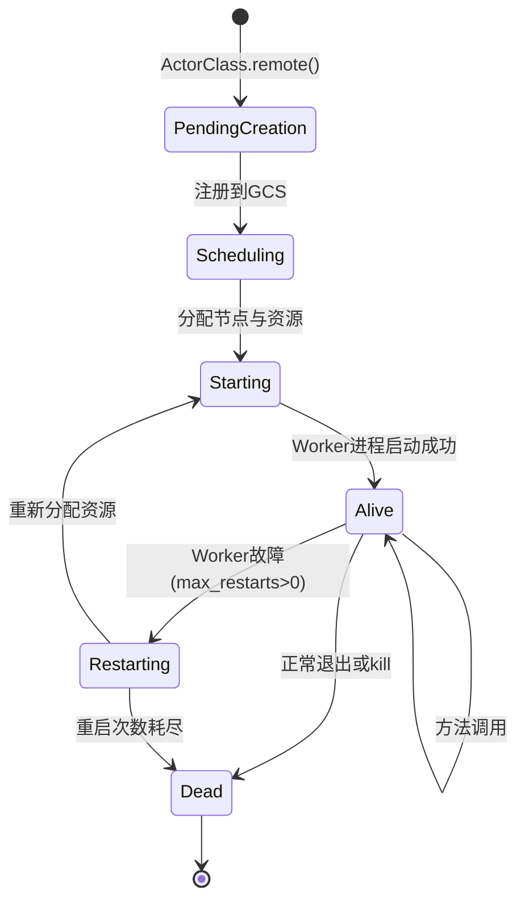
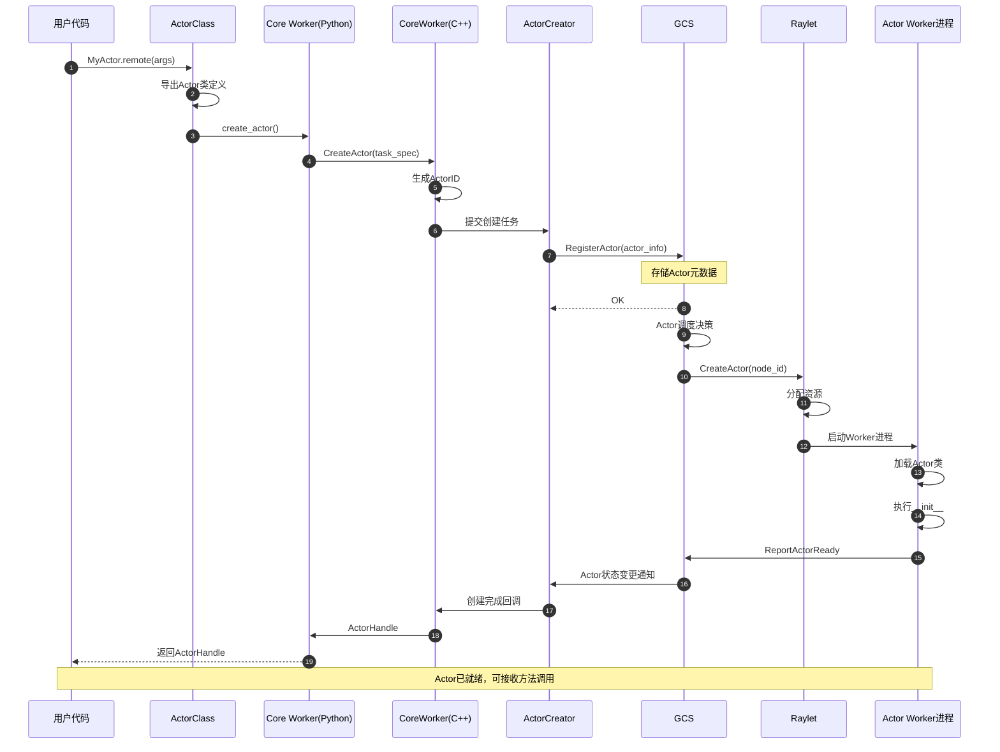
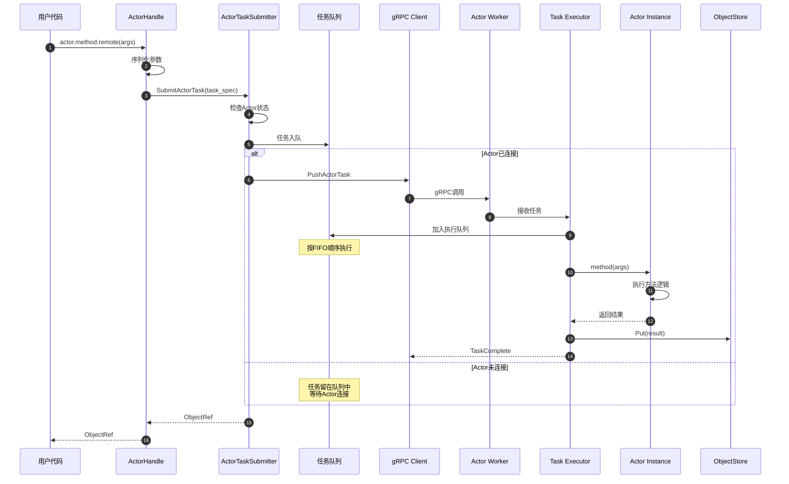
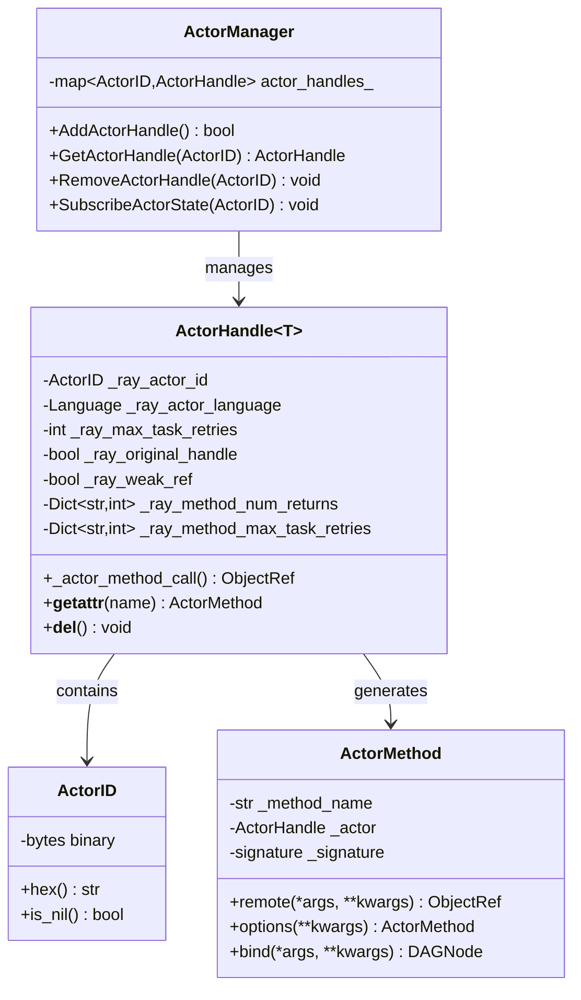
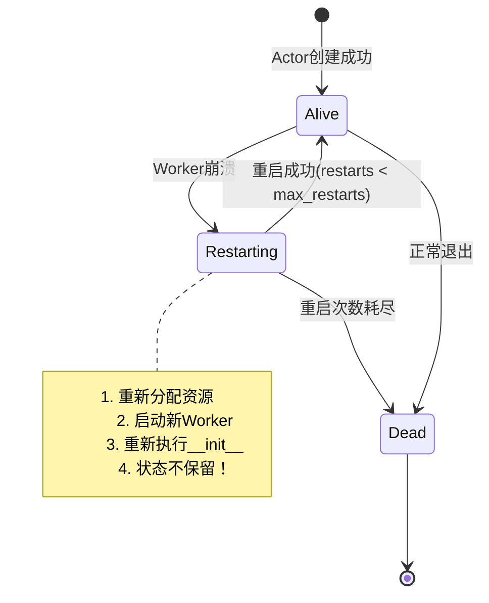

# Ray-02-Actor模块

## 模块概览

### 职责

Actor模块实现Ray的有状态分布式编程模型，提供面向对象的远程调用能力。其核心职责包括：

- 分布式有状态对象的创建与管理
- Actor方法的异步调用与顺序保证
- Actor生命周期管理（创建、运行、重启、销毁）
- Actor引用传递与序列化
- Actor容错与自动重启
- 命名Actor的注册与查找
- 并发Actor支持（concurrency_groups）

### 输入/输出

**输入**：
- Python类定义（通过@ray.remote装饰）
- Actor构造参数
- Actor方法调用参数
- 配置选项（资源、重启策略等）

**输出**：
- ActorHandle（Actor句柄）
- ObjectRef（方法调用返回值）
- Actor状态变更通知

### 上下游依赖

**上游（被调用）**：
- Python用户代码
- Ray高层库（Train、Serve等使用Actor）

**下游（调用）**：
- Core Worker（Actor任务提交）
- GCS（Actor注册与调度）
- ActorManager（C++，Actor状态管理）
- ReferenceCounter（Actor引用计数）

### 生命周期



**状态说明**：

1. **PendingCreation**：Actor类已注册，等待GCS调度
2. **Scheduling**：GCS选择节点并分配资源
3. **Starting**：Worker进程正在启动，执行`__init__`
4. **Alive**：Actor就绪，可接收方法调用
5. **Restarting**：Worker故障，正在重启
6. **Dead**：Actor已终止，无法恢复

### 模块架构图

```mermaid
flowchart TB
    subgraph Python["Python层"]
        ActorClass["@ray.remote(class)<br/>ActorClass"]
        ActorHandle["ActorHandle<br/>Actor句柄"]
        ActorMethod["ActorMethod<br/>方法包装器"]
    end
    
    subgraph CoreWorkerPy["Core Worker (Python)"]
        ActorCreation["actor_creator_<br/>Actor创建管理"]
        ActorMethodCall["_actor_method_call()<br/>方法调用提交"]
    end
    
    subgraph CoreWorkerCpp["Core Worker (C++)"]
        ActorManager["ActorManager<br/>Actor状态管理"]
        ActorTaskSubmitter["ActorTaskSubmitter<br/>任务提交器"]
        ReferenceCounter["ReferenceCounter<br/>引用计数"]
    end
    
    subgraph GCS["GCS"]
        ActorRegistry["Actor Registry<br/>Actor注册表"]
        ActorScheduler["Actor Scheduler<br/>Actor调度器"]
    end
    
    subgraph Worker["Actor Worker进程"]
        ActorInstance["Actor Instance<br/>Actor实例"]
        TaskExecutor["Task Executor<br/>任务执行器"]
    end
    
    ActorClass -->|.remote()| ActorCreation
    ActorCreation --> ActorManager
    ActorManager --> GCS
    GCS --> ActorScheduler
    ActorScheduler --> Worker
    
    ActorHandle -->|method.remote()| ActorMethodCall
    ActorMethodCall --> ActorTaskSubmitter
    ActorTaskSubmitter --> Worker
    
    ActorTaskSubmitter -.订阅状态.-> GCS
    ActorManager --> ReferenceCounter
    
    Worker --> TaskExecutor
    TaskExecutor --> ActorInstance
```

## Actor创建流程详解

### API 1: @ray.remote 装饰器（类）

#### 基本信息

- **名称**：`remote` (用于类)
- **位置**：`python/ray/actor.py`
- **协议**：Python装饰器
- **幂等性**：是（重复装饰返回相同的ActorClass）

#### 函数签名

```python
def remote(
    *,
    num_cpus: Union[int, float] = None,
    num_gpus: Union[int, float] = None,
    resources: Dict[str, float] = None,
    memory: Union[int, float] = None,
    object_store_memory: Union[int, float] = None,
    accelerator_type: str = None,
    max_concurrency: int = None,
    max_restarts: int = 0,
    max_task_retries: int = 0,
    max_pending_calls: int = -1,
    retry_exceptions: Union[bool, List[Exception]] = False,
    name: str = None,
    namespace: str = None,
    lifetime: str = None,  # "detached" or None
    runtime_env: Dict[str, Any] = None,
    scheduling_strategy: SchedulingStrategyT = None,
    allow_out_of_order_execution: bool = None,
    concurrency_groups: List[Dict] = None,
) -> ActorClass
```

#### 参数说明（Actor特有）

| 参数 | 类型 | 必填 | 默认值 | 说明 |
|------|------|------|--------|------|
| max_restarts | int | 否 | 0 | Actor故障重启次数。0=不重启，-1=无限重启 |
| max_concurrency | int | 否 | 1或1000 | 最大并发调用数。普通Actor=1，async Actor=1000 |
| max_pending_calls | int | 否 | -1 | 待处理调用队列上限。-1=无限制 |
| name | str | 否 | None | Actor全局唯一名称，可用ray.get_actor()查找 |
| namespace | str | 否 | None | Actor命名空间，与name配合使用 |
| lifetime | str | 否 | None | "detached"=独立生命周期，None=跟随创建者 |
| object_store_memory | int | 否 | None | Actor专属Object Store内存（字节） |
| allow_out_of_order_execution | bool | 否 | False | 是否允许乱序执行任务 |
| concurrency_groups | List[Dict] | 否 | None | 并发组配置，支持细粒度并发控制 |

#### 核心实现代码

```python
# python/ray/actor.py
def _make_actor(cls, actor_options):
    # 1. 修改类，添加Ray特定方法
    Class = _modify_class(cls)
    
    # 2. 提取类方法签名
    method_signatures = {}
    for method_name in dir(Class):
        method = getattr(Class, method_name)
        if is_function_or_method(method) and not method_name.startswith("_"):
            method_signatures[method_name] = signature.extract_signature(method)
    
    # 3. 创建ActorClass包装器
    actor_class = ActorClass(
        Class,
        method_signatures,
        actor_options,
    )
    
    return actor_class

def _modify_class(cls):
    """添加Ray特定的Actor方法"""
    class Class(cls):
        __ray_actor_class__ = cls  # 保存原始类
        
        def __ray_ready__(self):
            """Actor就绪检查"""
            return True
        
        def __ray_call__(self, fn, *args, **kwargs):
            """Actor方法调用拦截"""
            return fn(self, *args, **kwargs)
        
        def __ray_terminate__(self):
            """Actor终止处理"""
            ray.actor.exit_actor()
    
    return Class
```

### API 2: ActorClass.remote() - Actor创建

#### 基本信息

- **名称**：`ActorClass._remote()`
- **位置**：`python/ray/actor.py`
- **协议**：Python方法调用
- **幂等性**：否（每次调用创建新Actor实例）

#### 参数说明

| 参数 | 类型 | 必填 | 默认值 | 说明 |
|------|------|------|--------|------|
| args | tuple | 否 | () | 传递给`__init__`的位置参数 |
| kwargs | dict | 否 | {} | 传递给`__init__`的关键字参数 |
| **actor_options | dict | 否 | {} | 覆盖装饰器中的配置 |

#### 返回值

返回`ActorHandle`对象，包含：
- `_ray_actor_id`：Actor唯一ID
- `_ray_actor_method_cpus`：方法CPU需求
- `_ray_max_task_retries`：方法重试配置
- 各种方法配置映射

#### 核心实现代码

```python
# python/ray/actor.py
def _remote(self, args=None, kwargs=None, **actor_options):
    """创建Actor实例"""
    worker = ray._private.worker.global_worker
    worker.check_connected()
    
    # 1. 处理get_if_exists选项（获取或创建）
    if actor_options.get("get_if_exists"):
        try:
            return ray.get_actor(name, namespace=namespace)
        except ValueError:
            # Actor不存在，继续创建
            pass
    
    # 2. 检查名称冲突
    if name is not None:
        try:
            ray.get_actor(name, namespace=namespace)
            raise ValueError(f"The name {name} is already taken")
        except ValueError:
            pass  # 名称可用
    
    # 3. 导出Actor类到集群
    if not meta.is_cross_language:
        worker.function_actor_manager.export_actor_class(
            Class,
            actor_creation_function_descriptor,
        )
    
    # 4. 配置调度策略
    scheduling_strategy = _configure_placement_group_based_on_context(
        scheduling_strategy,
        placement_group,
        placement_group_bundle_index,
        placement_group_capture_child_tasks,
    )
    
    # 5. 提交Actor创建任务到Core Worker
    actor_id = worker.core_worker.create_actor(
        language=self._language,
        actor_creation_function_descriptor=actor_creation_function_descriptor,
        args=serialized_args,
        max_restarts=max_restarts,
        max_task_retries=max_task_retries,
        max_concurrency=max_concurrency,
        max_pending_calls=max_pending_calls,
        name=name or "",
        namespace=namespace or "",
        is_detached=detached,
        is_asyncio=is_asyncio,
        resources=resources_dict,
        scheduling_strategy=scheduling_strategy,
        runtime_env_info=runtime_env_info,
        concurrency_groups=concurrency_groups_list,
        enable_task_events=enable_task_events,
    )
    
    # 6. 创建并返回ActorHandle
    actor_handle = ActorHandle(
        Language.PYTHON,
        actor_id,
        max_task_retries,
        enable_task_events,
        method_is_generator,
        method_decorators,
        method_signatures,
        method_num_returns,
        method_max_task_retries,
        method_retry_exceptions,
        method_generator_backpressure_num_objects,
        method_enable_task_events,
        enable_tensor_transport,
        method_name_to_tensor_transport,
        actor_method_cpus,
        actor_creation_function_descriptor,
        worker.current_cluster_and_job,
        original_handle=True,
    )
    
    return actor_handle
```

#### C++ Core Worker实现

```cpp
// src/ray/core_worker/core_worker.cc
ActorID CoreWorker::CreateActor(
    const RayFunction &function,
    const std::vector<std::unique_ptr<TaskArg>> &args,
    const ActorCreationOptions &actor_creation_options,
    const std::string &extension_data) {
  
  // 1. 生成Actor ID
  ActorID actor_id = ActorID::Of(worker_context_.GetCurrentJobID(),
                                  worker_context_.GetCurrentTaskID(),
                                  actor_counter_++);
  
  // 2. 构建Actor创建任务规格
  auto actor_creation_task_spec = BuildActorCreationTaskSpec(
      function,
      args,
      actor_id,
      actor_creation_options);
  
  // 3. 提交到Actor Creator
  actor_creator_->CreateActor(
      actor_creation_task_spec,
      [this, actor_id](Status status, const rpc::ActorTableData &actor_data) {
        if (status.ok()) {
          // Actor创建成功，添加到ActorManager
          actor_manager_->AddActorHandle(
              CreateActorHandle(actor_id, actor_data),
              /*add_local_ref=*/true);
        } else {
          // 创建失败，通知调用者
          RAY_LOG(ERROR) << "Failed to create actor: " << status;
        }
      });
  
  return actor_id;
}
```

#### 时序图（Actor创建完整流程）



#### 边界条件与异常处理

**重名处理**：
```python
try:
    actor = MyActor.options(name="my_actor").remote()
except ValueError as e:
    print(f"Actor name conflict: {e}")
```

**get_if_exists模式**：
```python
# 获取已存在的Actor或创建新的
actor = MyActor.options(name="my_actor", get_if_exists=True).remote()
```

**创建超时**：
```python
# Actor创建是异步的，首次方法调用会等待创建完成
try:
    result = ray.get(actor.method.remote(), timeout=30)
except ray.exceptions.GetTimeoutError:
    print("Actor创建或方法执行超时")
```

**资源不足**：
```python
# 如果集群资源不足，Actor会处于pending状态
actor = MyActor.options(num_gpus=100).remote()  # 可能长时间等待
```

## Actor方法调用机制

### API 3: ActorHandle.method.remote()

#### 基本信息

- **名称**：`ActorMethod._remote()`
- **位置**：`python/ray/actor.py`
- **协议**：Python方法调用
- **幂等性**：否（每次调用提交新任务）

#### 核心实现代码

```python
# python/ray/actor.py
class ActorMethod:
    """Actor方法包装器"""
    
    def _remote(self, args=None, kwargs=None, **options):
        """提交Actor方法调用"""
        args = args or []
        kwargs = kwargs or {}
        
        # 1. 获取Actor句柄
        dst_actor = self._actor
        if dst_actor is None:
            raise RuntimeError("Lost reference to actor")
        
        # 2. 调用Actor的方法调用接口
        return dst_actor._actor_method_call(
            self._method_name,
            args=args,
            kwargs=kwargs,
            num_returns=options.get("num_returns"),
            max_task_retries=options.get("max_task_retries"),
            retry_exceptions=options.get("retry_exceptions"),
        )

# ActorHandle实现
class ActorHandle:
    def _actor_method_call(
        self,
        method_name: str,
        args,
        kwargs,
        **options
    ):
        """提交Actor任务到Core Worker"""
        worker = ray._private.worker.global_worker
        
        # 1. 序列化参数
        serialized_args = worker.get_serialization_context().serialize(args)
        serialized_kwargs = worker.get_serialization_context().serialize(kwargs)
        
        # 2. 构建函数描述符
        function_descriptor = self._ray_function_descriptor[method_name]
        
        # 3. 提交任务到Core Worker
        object_refs = worker.core_worker.submit_actor_task(
            language=self._ray_actor_language,
            actor_id=self._ray_actor_id,
            function_descriptor=function_descriptor,
            args=serialized_args,
            num_returns=num_returns,
            max_task_retries=max_task_retries,
            retry_exceptions=retry_exceptions,
        )
        
        return object_refs
```

#### C++ ActorTaskSubmitter实现

```cpp
// src/ray/core_worker/task_submission/actor_task_submitter.cc
std::vector<rpc::ObjectReference> ActorTaskSubmitter::SubmitTask(
    const TaskSpecification &task_spec) {
  
  const ActorID actor_id = task_spec.ActorId();
  
  // 1. 获取Actor连接信息
  auto actor_handle = actor_manager_.GetActorHandle(actor_id);
  if (!actor_handle) {
    // Actor不存在或已死亡
    return FailTask(task_spec, ErrorType::ACTOR_DIED);
  }
  
  // 2. 检查Actor状态
  if (!actor_handle->IsAlive()) {
    return FailTask(task_spec, ErrorType::ACTOR_DIED);
  }
  
  // 3. 将任务加入Actor的发送队列
  auto &queue = actor_task_queues_[actor_id];
  queue.push(task_spec);
  
  // 4. 尝试发送队列中的任务
  SendPendingTasks(actor_id);
  
  // 5. 生成并返回ObjectRef
  std::vector<rpc::ObjectReference> return_refs;
  for (int i = 0; i < task_spec.NumReturns(); i++) {
    return_refs.push_back(task_spec.ReturnId(i));
  }
  
  return return_refs;
}

void ActorTaskSubmitter::SendPendingTasks(const ActorID &actor_id) {
  auto &queue = actor_task_queues_[actor_id];
  auto actor_handle = actor_manager_.GetActorHandle(actor_id);
  
  // 检查Actor是否连接
  if (!actor_handle || !actor_handle->IsConnected()) {
    return;  // 等待Actor连接
  }
  
  // 获取Actor的RPC客户端
  auto client = GetOrConnectActorClient(actor_handle->GetAddress());
  
  // 发送队列中的任务
  while (!queue.empty() && CanSendMore(actor_id)) {
    auto task_spec = queue.front();
    queue.pop();
    
    // 通过gRPC发送任务到Actor Worker
    client->PushActorTask(
        task_spec,
        [this, actor_id, task_id](Status status) {
          if (!status.ok()) {
            // 任务发送失败，重新入队或标记失败
            OnTaskSendFailed(actor_id, task_id, status);
          }
        });
  }
}
```

#### 时序图（Actor方法调用）



### Actor任务顺序保证

**关键机制**：
1. **单队列FIFO**：每个Actor维护单一任务队列，按提交顺序执行
2. **序列号机制**：每个任务携带序列号，Actor Worker按序号执行
3. **阻塞执行**：默认每次只执行一个任务（max_concurrency=1）

```python
# 示例：顺序保证
actor = Counter.remote()

# 这三个调用按顺序执行，即使并发提交
ref1 = actor.increment.remote()  # 1
ref2 = actor.increment.remote()  # 2
ref3 = actor.get_value.remote()  # 3

# ref3保证看到前两次increment的结果
value = ray.get(ref3)  # value = 2
```

### 并发Actor配置

#### 多线程并发

```python
@ray.remote(max_concurrency=10)
class ThreadedActor:
    """支持10个并发调用"""
    def slow_method(self):
        time.sleep(1)
        return "done"

actor = ThreadedActor.remote()

# 可以并发提交10个调用
refs = [actor.slow_method.remote() for _ in range(10)]
```

#### Async Actor

```python
@ray.remote
class AsyncActor:
    """使用async def定义方法"""
    async def async_method(self):
        await asyncio.sleep(1)
        return "done"

actor = AsyncActor.remote()
# 默认max_concurrency=1000，支持大量并发
refs = [actor.async_method.remote() for _ in range(1000)]
```

#### Concurrency Groups

```python
@ray.remote(concurrency_groups={
    "io": 5,    # IO密集任务最多5个并发
    "cpu": 2,   # CPU密集任务最多2个并发
})
class MixedActor:
    @ray.method(concurrency_group="io")
    def io_task(self):
        pass
    
    @ray.method(concurrency_group="cpu")
    def cpu_task(self):
        pass
```

## ActorHandle详解

### 数据结构UML图



### ActorHandle生命周期管理

#### 引用计数机制

```python
# python/ray/actor.py
class ActorHandle:
    def __del__(self):
        """Actor Handle被垃圾回收时调用"""
        if self._ray_weak_ref:
            return  # weak reference不计数
        
        try:
            worker = ray._private.worker.global_worker
            if worker.connected:
                # 减少Actor的分布式引用计数
                worker.core_worker.remove_actor_handle_reference(
                    self._ray_actor_id
                )
        except AttributeError:
            pass  # Python销毁顺序问题，忽略
```

```cpp
// src/ray/core_worker/core_worker.cc
void CoreWorker::RemoveActorHandleReference(const ActorID &actor_id) {
  // Actor Handle对应一个特殊的ObjectID
  ObjectID actor_handle_id = ObjectID::ForActorHandle(actor_id);
  
  // 减少本地引用计数
  reference_counter_->RemoveLocalReference(actor_handle_id, nullptr);
  
  // 如果引用计数降为0，通知GCS可以回收Actor
  if (reference_counter_->GetRefCount(actor_handle_id) == 0) {
    gcs_client_->Actors().AsyncNotifyActorHandleFreed(actor_id);
  }
}
```

#### Handle传递与序列化

**场景1：通过任务参数传递**

```python
@ray.remote
def task_with_actor(actor_handle):
    # actor_handle被序列化并传递到worker
    return ray.get(actor_handle.method.remote())

actor = MyActor.remote()
result = ray.get(task_with_actor.remote(actor))
```

**场景2：通过ray.put传递**

```python
actor = MyActor.remote()
actor_ref = ray.put(actor)  # 将handle放入Object Store

@ray.remote
def task():
    actor = ray.get(actor_ref)  # 反序列化获取handle
    return ray.get(actor.method.remote())
```

**序列化格式**：

```python
# python/ray/actor.py
class ActorHandle:
    def __reduce__(self):
        """Pickle序列化方法"""
        serialized = self._serialize()
        weak_ref = self._ray_weak_ref
        return (
            ActorHandle._deserialization_helper,
            (serialized, weak_ref, None)
        )
    
    def _serialize(self):
        """序列化为字节串"""
        return self._ray_actor_id.binary() + pickle.dumps({
            "language": self._ray_actor_language,
            "actor_creation_function_descriptor": 
                self._ray_actor_creation_function_descriptor,
            # ...其他字段
        })
```

## Actor容错机制

### 配置选项

```python
@ray.remote(
    max_restarts=5,           # 最多重启5次
    max_task_retries=3,       # 任务失败重试3次
)
class RobustActor:
    def __init__(self):
        self.state = 0
    
    def increment(self):
        self.state += 1
        return self.state
```

### 重启行为



**重要特性**：

1. **状态丢失**：Actor重启后状态重置，需要应用层实现状态持久化
2. **任务重试**：正在执行的任务失败，客户端会重试
3. **顺序保证**：重启后任务仍按原顺序执行

### 任务级别重试

```python
@ray.remote
class Actor:
    @ray.method(max_task_retries=3, retry_exceptions=True)
    def may_fail_method(self):
        if random.random() < 0.5:
            raise RuntimeError("Random failure")
        return "success"

actor = Actor.remote()
# 方法失败会自动重试最多3次
result = ray.get(actor.may_fail_method.remote())
```

### 故障检测与通知

```cpp
// src/ray/core_worker/actor_manager.cc
void ActorManager::HandleActorStateNotification(
    const ActorID &actor_id,
    const rpc::ActorTableData &actor_data) {
  
  // 处理Actor状态变更
  if (actor_data.state() == rpc::ActorTableData::RESTARTING) {
    // Actor正在重启
    actor_task_submitter_.DisconnectActor(
        actor_id,
        actor_data.num_restarts(),
        /*dead=*/false,
        actor_data.death_cause(),
        /*is_restartable=*/true);
  }
  else if (actor_data.state() == rpc::ActorTableData::DEAD) {
    // Actor已死亡
    OnActorKilled(actor_id);
    actor_task_submitter_.DisconnectActor(
        actor_id,
        actor_data.num_restarts(),
        /*dead=*/true,
        actor_data.death_cause(),
        /*is_restartable=*/false);
  }
  else if (actor_data.state() == rpc::ActorTableData::ALIVE) {
    // Actor重新上线
    actor_task_submitter_.ConnectActor(
        actor_id,
        actor_data.address(),
        actor_data.num_restarts());
  }
}
```

## 命名Actor

### API 4: ray.get_actor()

#### 基本信息

- **名称**：`get_actor`
- **位置**：`python/ray/_private/worker.py`
- **协议**：Python函数调用
- **幂等性**：是

#### 函数签名

```python
def get_actor(name: str, namespace: Optional[str] = None) -> ActorHandle:
    """根据名称获取Actor"""
    pass
```

#### 核心实现代码

```python
def get_actor(name, namespace=None):
    """获取命名Actor"""
    worker = global_worker
    worker.check_connected()
    
    if namespace is None:
        namespace = worker.namespace
    
    # 1. 从本地缓存查找
    cached_id = actor_manager.GetCachedNamedActorID(
        namespace, name
    )
    if cached_id is not None:
        return actor_manager.GetActorHandle(cached_id)
    
    # 2. 从GCS查询
    actor_info = worker.core_worker.get_named_actor_handle(
        name, namespace
    )
    
    if actor_info is None:
        raise ValueError(f"Actor '{name}' not found in namespace '{namespace}'")
    
    # 3. 反序列化ActorHandle
    actor_handle = ActorHandle._deserialize(actor_info)
    
    # 4. 标记为weak reference（不影响Actor生命周期）
    actor_handle._ray_weak_ref = True
    
    return actor_handle
```

#### 使用示例

```python
# 创建命名Actor
actor = MyActor.options(name="my_actor", lifetime="detached").remote()

# 在其他进程中获取
actor = ray.get_actor("my_actor")
result = ray.get(actor.method.remote())

# 跨命名空间
actor = ray.get_actor("my_actor", namespace="production")
```

## 最佳实践

### 1. Actor vs Task选择

**使用Actor的场景**：
```python
# ✅ 好：需要维护状态
@ray.remote
class DatabaseConnection:
    def __init__(self):
        self.conn = connect_to_db()
    
    def query(self, sql):
        return self.conn.execute(sql)

# ❌ 不好：无状态操作用Actor
@ray.remote
class StatelessCompute:  # 应该用@ray.remote函数
    def compute(self, x):
        return x * 2
```

### 2. 状态持久化

```python
@ray.remote(max_restarts=3)
class PersistentActor:
    def __init__(self, checkpoint_path):
        self.checkpoint_path = checkpoint_path
        self.state = self.load_checkpoint()
    
    def load_checkpoint(self):
        if os.path.exists(self.checkpoint_path):
            return pickle.load(open(self.checkpoint_path, 'rb'))
        return {}
    
    def save_checkpoint(self):
        with open(self.checkpoint_path, 'wb') as f:
            pickle.dump(self.state, f)
    
    def update_state(self, key, value):
        self.state[key] = value
        self.save_checkpoint()  # 每次更新后保存
```

### 3. 避免Actor热点

**反模式**：
```python
# ❌ 不好：单个Actor成为瓶颈
counter = Counter.remote()
tasks = [increment_counter.remote(counter) for _ in range(10000)]
```

**推荐模式**：
```python
# ✅ 好：使用Actor池
counters = [Counter.remote() for _ in range(10)]
tasks = [
    increment_counter.remote(counters[i % 10])
    for i in range(10000)
]
```

### 4. 合理使用并发

```python
# CPU密集型：低并发
@ray.remote(max_concurrency=2)
class CPUActor:
    def compute(self, data):
        return heavy_computation(data)

# IO密集型：高并发
@ray.remote
class IOActor:
    async def fetch(self, url):
        return await aiohttp.get(url)
```

### 5. Actor生命周期管理

```python
# 临时Actor：跟随创建者
actor = MyActor.remote()  # lifetime=None

# 长期服务：使用detached
service = MyService.options(
    name="my_service",
    lifetime="detached"
).remote()

# 清理detached actor
ray.kill(service)
```

### 6. 错误处理模式

```python
@ray.remote(max_restarts=3)
class RobustActor:
    def __init__(self):
        self.failures = 0
    
    @ray.method(max_task_retries=3, retry_exceptions=[ConnectionError])
    def reliable_call(self):
        try:
            return external_service_call()
        except ConnectionError:
            self.failures += 1
            raise  # 触发重试
        except Exception as e:
            # 非预期错误，记录但不重试
            log_error(e)
            return None

# 客户端错误处理
actor = RobustActor.remote()
try:
    result = ray.get(actor.reliable_call.remote())
except ray.exceptions.RayActorError:
    print("Actor已死亡，无法恢复")
except ray.exceptions.RayTaskError as e:
    print(f"任务失败：{e.cause}")
```

### 7. Actor资源配置

```python
# 为Actor预留足够资源
@ray.remote(
    num_cpus=4,                      # CPU核心数
    num_gpus=1,                      # GPU数量
    memory=1024*1024*1024,           # 内存（1GB）
    object_store_memory=2*1024**3,   # Object Store（2GB）
)
class HeavyActor:
    def process_large_data(self, data):
        # 确保有足够资源处理大数据
        pass
```

### 8. 调试技巧

```python
# 1. 检查Actor状态
from ray.util.state import list_actors
actors = list_actors(filters=[("state", "=", "ALIVE")])
for actor in actors:
    print(f"Actor: {actor['name']}, State: {actor['state']}")

# 2. 获取Actor句柄进行检查
actor_handle = ray.get_actor("my_actor")
print(f"Actor ID: {actor_handle._ray_actor_id.hex()}")

# 3. 强制kill Actor
ray.kill(actor_handle)

# 4. 查看Actor日志
# 日志位于: /tmp/ray/session_*/logs/worker-*.out
```

## 性能考虑

### 延迟特征

| 操作 | 典型延迟 | 说明 |
|------|---------|------|
| Actor创建 | 100-500ms | 包括资源分配、进程启动、初始化 |
| 首次方法调用 | +50-100ms | 建立gRPC连接 |
| 后续方法调用 | 1-5ms | 直接通过已建立的连接 |
| Actor重启 | 100-1000ms | 取决于初始化复杂度 |

### 性能优化建议

1. **批量操作**：
```python
# ❌ 不好：频繁小调用
for item in items:
    actor.process.remote(item)

# ✅ 好：批量处理
actor.process_batch.remote(items)
```

2. **减少序列化开销**：
```python
# ❌ 不好：每次传递大对象
large_data = load_large_dataset()
for _ in range(100):
    actor.process.remote(large_data)

# ✅ 好：先put，传递引用
large_data_ref = ray.put(load_large_dataset())
for _ in range(100):
    actor.process.remote(large_data_ref)
```

3. **异步调用，批量获取**：
```python
# ✅ 好：并发提交，批量等待
refs = [actor.method.remote(i) for i in range(100)]
results = ray.get(refs)  # 批量等待
```

## 总结

Actor模块是Ray的核心抽象之一，提供了简单而强大的分布式有状态编程模型。关键要点：

1. **状态管理**：Actor封装状态，方法调用顺序保证
2. **容错机制**：支持自动重启，但状态不自动恢复
3. **性能优化**：合理配置并发度，避免热点
4. **生命周期**：区分临时Actor和detached Actor
5. **最佳实践**：适合有状态服务、连接池、缓存等场景

正确使用Actor可以大幅简化分布式系统的状态管理和错误处理。

