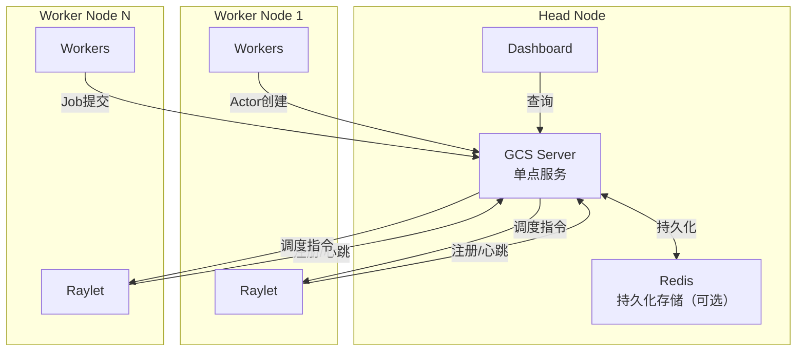
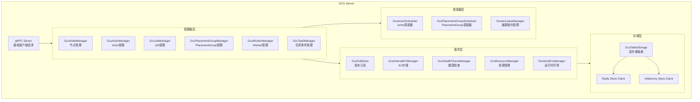
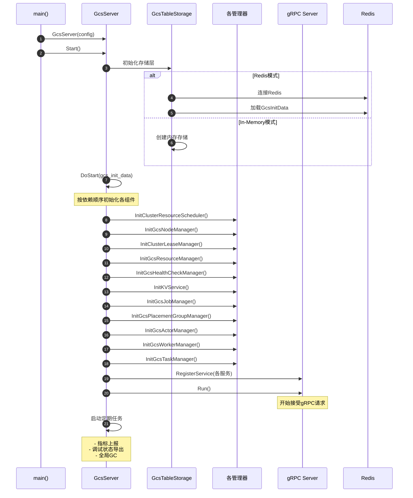
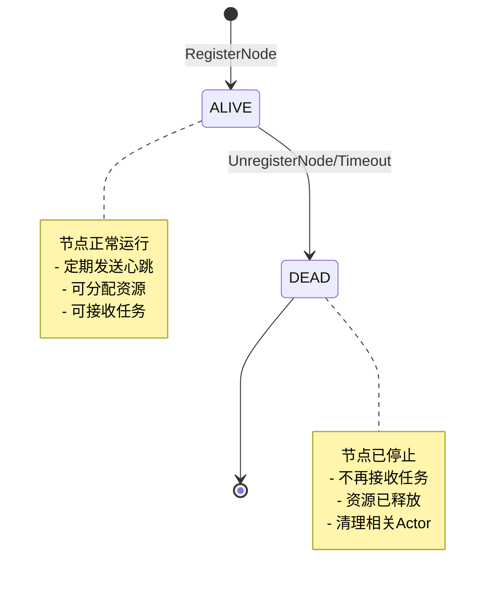
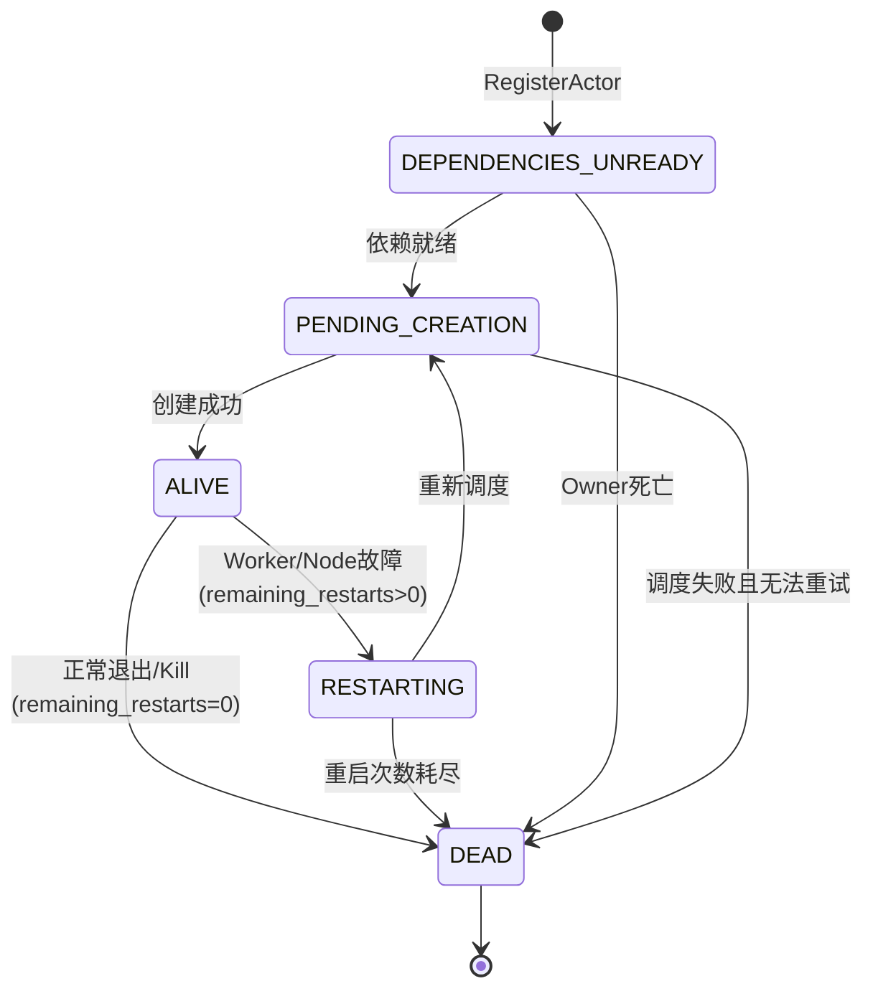
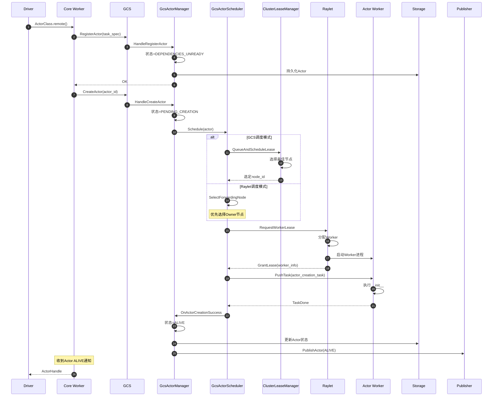

# Ray-03-GCS模块（全局控制服务）

## 模块概览

### 职责

GCS (Global Control Service) 是Ray集群的控制平面，作为单点中心化服务管理集群的全局状态。其核心职责包括：

- 集群元数据管理（Node、Actor、Job、PlacementGroup、Worker）
- Actor调度决策与生命周期管理
- 节点健康检查与故障检测
- 资源视图维护与查询
- 分布式配置管理（KV Store）
- 事件发布订阅（PubSub）
- 函数注册与管理
- 运行时环境管理

### 输入/输出

**输入**：
- 节点注册请求（Raylet）
- Actor创建请求（Core Worker）
- Job提交请求（Driver）
- 资源使用上报（Raylet）
- 健康检查心跳

**输出**：
- Actor调度决策
- 节点状态变更通知
- 资源可用性信息
- 配置数据查询结果
- 事件订阅推送

### 上下游依赖

**上游（被调用）**：
- Raylet：节点注册、资源上报、心跳
- Core Worker：Actor注册、Job提交
- Dashboard：状态查询、监控数据

**下游（调用）**：
- Redis：元数据持久化（可选）
- Raylet：Actor创建指令、资源分配
- Core Worker：Actor初始化

### 部署形态



**说明**：
- GCS运行在Head Node上，作为单点服务
- 所有节点通过gRPC与GCS通信
- Redis用于持久化元数据（可选，支持in-memory模式）
- GCS故障时可重启恢复（从Redis加载状态）

### 模块架构图



## GCS Server启动流程

### 启动时序图



### 核心实现代码

```cpp
// src/ray/gcs/gcs_server.cc
void GcsServer::DoStart(const GcsInitData &gcs_init_data) {
  // 1. 初始化资源调度器（用于Actor调度）
  InitClusterResourceScheduler();
  
  // 2. 初始化节点管理器（管理集群节点）
  InitGcsNodeManager(gcs_init_data);
  
  // 3. 初始化租约管理器（任务调度）
  InitClusterLeaseManager();
  
  // 4. 初始化资源管理器（跟踪资源使用）
  InitGcsResourceManager(gcs_init_data);
  
  // 5. 初始化健康检查管理器（节点心跳）
  InitGcsHealthCheckManager(gcs_init_data);
  
  // 6. 初始化Ray Syncer（节点间同步）
  InitRaySyncer(gcs_init_data);
  
  // 7. 初始化KV服务（配置存储）
  InitKVService();
  
  // 8. 初始化功能管理器（函数注册）
  InitFunctionManager();
  
  // 9. 初始化发布订阅处理器
  InitPubSubHandler();
  
  // 10. 初始化运行时环境管理器
  InitRuntimeEnvManager();
  
  // 11. 初始化Job管理器
  InitGcsJobManager(gcs_init_data);
  
  // 12. 初始化PlacementGroup管理器
  InitGcsPlacementGroupManager(gcs_init_data);
  
  // 13. 初始化Actor管理器（核心）
  InitGcsActorManager(gcs_init_data);
  
  // 14. 初始化Worker管理器
  InitGcsWorkerManager();
  
  // 15. 初始化任务管理器
  InitGcsTaskManager();
  
  // 16. 安装事件监听器
  InstallEventListeners();
  
  // 17. 启动gRPC服务器
  rpc_server_.Run();
  
  // 18. 启动定期任务
  periodical_runner_->RunFnPeriodically(
      [this] { RecordMetrics(); },
      RayConfig::instance().metrics_report_interval_ms() / 2,
      "GCSServer.metrics_report");
  
  periodical_runner_->RunFnPeriodically(
      [this] { 
        RAY_LOG(INFO) << GetDebugState();
        PrintAsioStats();
      },
      RayConfig::instance().event_stats_print_interval_ms(),
      "GCSServer.debug_state_print");
  
  is_started_ = true;
}
```

## GcsNodeManager - 节点管理器

### 职责

- 管理集群中所有节点的生命周期（注册、存活、死亡）
- 维护节点列表（alive_nodes_, dead_nodes_）
- 处理节点注册、注销请求
- 发布节点状态变更通知
- 提供节点查询接口

### 节点状态机



### 核心API

#### API 1: HandleRegisterNode

```cpp
// src/ray/gcs/gcs_node_manager.cc
void GcsNodeManager::HandleRegisterNode(
    rpc::RegisterNodeRequest request,
    rpc::RegisterNodeReply *reply,
    rpc::SendReplyCallback send_reply_callback) {
  
  const rpc::GcsNodeInfo &node_info = request.node_info();
  NodeID node_id = NodeID::FromBinary(node_info.node_id());
  
  RAY_LOG(INFO) << "Registering node " << node_id
                << ", address=" << node_info.node_manager_address();
  
  // 回调：注册成功后的操作
  auto on_done = [this, node_id, node_info, reply, send_reply_callback](
                     const Status &status) {
    RAY_CHECK_OK(status);
    
    absl::MutexLock lock(&mutex_);
    
    // 1. 添加到存活节点缓存
    AddNodeToCache(std::make_shared<rpc::GcsNodeInfo>(node_info));
    
    // 2. 导出节点事件（用于可观测性）
    WriteNodeExportEvent(node_info, /*is_register_event=*/true);
    
    // 3. 发布节点信息到订阅者
    gcs_publisher_->PublishNodeInfo(node_id, node_info);
    
    // 4. 返回响应
    GCS_RPC_SEND_REPLY(send_reply_callback, reply, status);
  };
  
  // 处理Head Node特殊情况（HA模式下可能有旧Head Node）
  if (node_info.is_head_node()) {
    // 查找现有的Head Node
    std::vector<NodeID> old_head_nodes;
    {
      absl::ReaderMutexLock lock(&mutex_);
      for (auto &node : alive_nodes_) {
        if (node.second->is_head_node()) {
          old_head_nodes.push_back(node.first);
        }
      }
    }
    
    // 标记旧Head Node为Dead
    if (!old_head_nodes.empty()) {
      OnNodeFailure(old_head_nodes[0], 
                    [this, node_id, node_info, on_done]() {
        gcs_table_storage_->NodeTable().Put(
            node_id, node_info, on_done);
      });
    } else {
      // 持久化到存储
      gcs_table_storage_->NodeTable().Put(
          node_id, node_info, on_done);
    }
  } else {
    gcs_table_storage_->NodeTable().Put(
        node_id, node_info, on_done);
  }
}
```

#### API 2: HandleUnregisterNode

```cpp
void GcsNodeManager::HandleUnregisterNode(
    rpc::UnregisterNodeRequest request,
    rpc::UnregisterNodeReply *reply,
    rpc::SendReplyCallback send_reply_callback) {
  
  absl::MutexLock lock(&mutex_);
  NodeID node_id = NodeID::FromBinary(request.node_id());
  
  RAY_LOG(INFO) << "Unregistering node " << node_id;
  
  // 1. 从存活节点中移除
  auto node = RemoveNodeFromCache(
      node_id, 
      request.node_death_info(), 
      rpc::GcsNodeInfo::DEAD, 
      current_sys_time_ms());
  
  if (!node) {
    RAY_LOG(INFO) << "Node already removed: " << node_id;
    return;
  }
  
  // 2. 添加到死亡节点列表
  AddDeadNodeToCache(node);
  
  // 3. 构建增量更新
  auto node_info_delta = std::make_shared<rpc::GcsNodeInfo>();
  node_info_delta->set_node_id(node->node_id());
  node_info_delta->mutable_death_info()->CopyFrom(request.node_death_info());
  node_info_delta->set_state(node->state());
  node_info_delta->set_end_time_ms(node->end_time_ms());
  
  // 4. 持久化并发布
  auto on_put_done = [this, node_id, node_info_delta, node](const Status &status) {
    gcs_publisher_->PublishNodeInfo(node_id, *node_info_delta);
    WriteNodeExportEvent(*node, /*is_register_event=*/false);
  };
  
  gcs_table_storage_->NodeTable().Put(node_id, *node, on_put_done);
  
  GCS_RPC_SEND_REPLY(send_reply_callback, reply, Status::OK());
}
```

### 节点查询接口

```cpp
class GcsNodeManager {
public:
  // 获取存活节点
  std::optional<std::shared_ptr<const rpc::GcsNodeInfo>> 
  GetAliveNode(const NodeID &node_id) const {
    absl::ReaderMutexLock lock(&mutex_);
    auto it = alive_nodes_.find(node_id);
    if (it != alive_nodes_.end()) {
      return it->second;
    }
    return std::nullopt;
  }
  
  // 随机选择存活节点
  std::shared_ptr<const rpc::GcsNodeInfo> 
  SelectRandomAliveNode() const {
    absl::ReaderMutexLock lock(&mutex_);
    if (alive_nodes_.empty()) {
      return nullptr;
    }
    auto it = alive_nodes_.begin();
    std::advance(it, rand() % alive_nodes_.size());
    return it->second;
  }
  
  // 获取所有存活节点
  absl::flat_hash_map<NodeID, std::shared_ptr<const rpc::GcsNodeInfo>>
  GetAllAliveNodes() const {
    absl::ReaderMutexLock lock(&mutex_);
    return alive_nodes_;
  }
  
private:
  // 存活节点缓存（node_id -> node_info）
  absl::flat_hash_map<NodeID, std::shared_ptr<const rpc::GcsNodeInfo>> 
      alive_nodes_ ABSL_GUARDED_BY(mutex_);
  
  // 死亡节点缓存
  absl::flat_hash_map<NodeID, std::shared_ptr<const rpc::GcsNodeInfo>> 
      dead_nodes_ ABSL_GUARDED_BY(mutex_);
  
  mutable absl::Mutex mutex_;
};
```

## GcsActorManager - Actor管理器

### 职责

- 管理所有Actor的完整生命周期
- 维护Actor状态机转换
- 处理Actor注册、创建、死亡
- 管理Actor重启逻辑
- 追踪Actor所有权关系
- 处理命名Actor

### Actor状态机（详细版）



**状态说明**：

| 状态 | 含义 | 可能的转换 |
|------|------|----------|
| DEPENDENCIES_UNREADY | Actor已注册但依赖未就绪 | → PENDING_CREATION, DEAD |
| PENDING_CREATION | 正在调度和创建 | → ALIVE, DEAD |
| ALIVE | Actor运行中，可接收任务 | → RESTARTING, DEAD |
| RESTARTING | Worker故障，正在重启 | → PENDING_CREATION, DEAD |
| DEAD | Actor已终止 | 终态 |

### 核心实现代码

#### Actor注册

```cpp
// src/ray/gcs/gcs_actor_manager.cc
void GcsActorManager::HandleRegisterActor(
    rpc::RegisterActorRequest request,
    rpc::RegisterActorReply *reply,
    rpc::SendReplyCallback send_reply_callback) {
  
  auto actor_id = ActorID::FromBinary(request.task_spec().actor_creation_task_spec().actor_id());
  
  RAY_LOG(INFO) << "Registering actor, job_id = " << actor_id.JobId()
                << ", actor_id = " << actor_id;
  
  // 1. 创建GcsActor对象
  auto actor = std::make_shared<GcsActor>(
      request.task_spec(),
      request.ray_namespace());
  
  // 2. 设置初始状态
  actor->UpdateState(rpc::ActorTableData::DEPENDENCIES_UNREADY);
  
  // 3. 添加到注册表
  registered_actors_.emplace(actor_id, actor);
  unresolved_actors_.emplace(actor_id);
  
  // 4. 持久化
  auto actor_table_data = actor->GetMutableActorTableData();
  gcs_table_storage_->ActorTable().Put(
      actor_id,
      *actor_table_data,
      [this, actor_id, actor, reply, send_reply_callback](Status status) {
        RAY_CHECK_OK(status);
        
        // 5. 发布Actor状态
        gcs_publisher_->PublishActor(
            actor_id,
            GenActorDataOnlyWithStates(*actor->GetActorTableData()));
        
        // 6. 返回响应
        GCS_RPC_SEND_REPLY(send_reply_callback, reply, status);
      });
}
```

#### Actor创建（调度）

```cpp
void GcsActorManager::HandleCreateActor(
    rpc::CreateActorRequest request,
    rpc::CreateActorReply *reply,
    rpc::SendReplyCallback send_reply_callback) {
  
  auto actor_id = ActorID::FromBinary(request.task_spec().actor_creation_task_spec().actor_id());
  
  RAY_LOG(INFO) << "Creating actor, actor_id = " << actor_id;
  
  // 1. 从未解决列表移除
  auto iter = unresolved_actors_.find(actor_id);
  if (iter == unresolved_actors_.end()) {
    // Actor已经在创建中
    GCS_RPC_SEND_REPLY(send_reply_callback, reply, Status::OK());
    return;
  }
  unresolved_actors_.erase(iter);
  
  // 2. 获取Actor对象
  auto actor = registered_actors_[actor_id];
  
  // 3. 更新状态为PENDING_CREATION
  actor->UpdateState(rpc::ActorTableData::PENDING_CREATION);
  
  // 4. 持久化状态
  auto actor_table_data = actor->GetMutableActorTableData();
  gcs_table_storage_->ActorTable().Put(
      actor_id,
      *actor_table_data,
      [this, actor_id, actor, reply, send_reply_callback](Status status) {
        // 5. 发布状态变更
        gcs_publisher_->PublishActor(
            actor_id,
            GenActorDataOnlyWithStates(*actor->GetActorTableData()));
        
        // 6. 触发调度
        gcs_actor_scheduler_->Schedule(actor);
        
        GCS_RPC_SEND_REPLY(send_reply_callback, reply, status);
      });
}
```

### GcsActorScheduler - Actor调度器

#### 调度策略

Ray支持两种Actor调度模式：

1. **GCS调度模式**（新）：GCS直接调度，资源感知
2. **Raylet调度模式**（传统）：转发给Raylet调度

```cpp
// src/ray/gcs/gcs_actor_scheduler.cc
void GcsActorScheduler::Schedule(std::shared_ptr<GcsActor> actor) {
  RAY_CHECK(actor->GetNodeID().IsNil());
  
  // 根据配置选择调度模式
  if (RayConfig::instance().gcs_actor_scheduling_enabled() &&
      !actor->GetLeaseSpecification().GetRequiredResources().IsEmpty()) {
    // GCS直接调度（资源感知）
    ScheduleByGcs(actor);
  } else {
    // 转发给Raylet调度
    ScheduleByRaylet(actor);
  }
}
```

#### GCS调度模式

```cpp
void GcsActorScheduler::ScheduleByGcs(std::shared_ptr<GcsActor> actor) {
  auto reply = std::make_shared<rpc::RequestWorkerLeaseReply>();
  
  // 回调：处理调度结果
  auto send_reply_callback = [this, actor, reply](
      Status status,
      std::function<void()> success,
      std::function<void()> failure) {
    
    if (reply->canceled()) {
      // 调度被取消
      HandleRequestWorkerLeaseCanceled(actor, ...);
      return;
    }
    
    // 获取调度结果（选中的节点）
    auto node_id = NodeID::FromBinary(
        reply->retry_at_raylet_address().node_id());
    auto node = gcs_node_manager_.GetAliveNode(node_id);
    RAY_CHECK(node.has_value());
    
    // 更新Actor地址
    rpc::Address address;
    address.set_node_id(node.value()->node_id());
    actor->UpdateAddress(address);
    
    // 记录分配的资源
    actor->SetAcquiredResources(...);
    
    // 从节点租用Worker
    LeaseWorkerFromNode(actor, node.value());
  };
  
  // 提交到集群租约管理器
  const auto &owner_node = gcs_node_manager_.GetAliveNode(
      actor->GetOwnerNodeID());
  
  RayLease lease(
      actor->GetLeaseSpecification(),
      owner_node.has_value() ? actor->GetOwnerNodeID().Binary() : "");
  
  cluster_lease_manager_.QueueAndScheduleLease(
      std::move(lease),
      /*grant_or_reject=*/false,
      /*is_selected_based_on_locality=*/false,
      reply.get(),
      send_reply_callback);
}
```

#### Raylet调度模式

```cpp
void GcsActorScheduler::ScheduleByRaylet(std::shared_ptr<GcsActor> actor) {
  // 1. 选择转发节点（优先选择Owner所在节点）
  auto node_id = SelectForwardingNode(actor);
  
  auto node = gcs_node_manager_.GetAliveNode(node_id);
  if (!node.has_value()) {
    // 无可用节点
    schedule_failure_handler_(
        std::move(actor),
        rpc::RequestWorkerLeaseReply::SCHEDULING_FAILED,
        "No available nodes");
    return;
  }
  
  // 2. 更新Actor地址
  rpc::Address address;
  address.set_node_id(node.value()->node_id());
  actor->UpdateAddress(address);
  
  // 3. 从节点租用Worker
  LeaseWorkerFromNode(actor, node.value());
}

NodeID GcsActorScheduler::SelectForwardingNode(
    std::shared_ptr<GcsActor> actor) {
  
  const auto &lease_spec = actor->GetLeaseSpecification();
  
  // 如果Actor有资源需求，优先调度到Owner节点
  if (!lease_spec.GetRequiredResources().IsEmpty()) {
    auto maybe_node = gcs_node_manager_.GetAliveNode(
        actor->GetOwnerNodeID());
    if (maybe_node.has_value()) {
      return actor->GetOwnerNodeID();
    }
  }
  
  // 否则随机选择节点
  auto node = gcs_node_manager_.SelectRandomAliveNode();
  return node ? NodeID::FromBinary(node->node_id()) : NodeID::Nil();
}
```

#### Worker租用

```cpp
void GcsActorScheduler::LeaseWorkerFromNode(
    std::shared_ptr<GcsActor> actor,
    std::shared_ptr<const rpc::GcsNodeInfo> node) {
  
  auto node_id = NodeID::FromBinary(node->node_id());
  
  // 1. 获取Raylet客户端
  auto raylet_client = raylet_client_pool_.GetOrConnectByAddress(
      rpc::RayletClientPool::GenerateRayletAddress(
          node_id,
          node->node_manager_address(),
          node->node_manager_port()));
  
  // 2. 构建租约请求
  auto request = std::make_shared<rpc::RequestWorkerLeaseRequest>();
  auto task_spec = actor->GetCreationTaskSpecification();
  request->mutable_resource_spec()->CopyFrom(
      task_spec.GetRequiredResources().GetResourceMap());
  request->set_grant_or_reject(actor->GetGrantOrReject());
  
  // 3. 发送租约请求到Raylet
  raylet_client->RequestWorkerLease(
      *request,
      [this, actor, node_id](
          const Status &status,
          const rpc::RequestWorkerLeaseReply &reply) {
        
        if (!status.ok()) {
          // 租约失败
          OnWorkerLeaseFailure(actor, node_id, status);
          return;
        }
        
        if (reply.rejected()) {
          // Raylet拒绝租约（资源不足）
          OnWorkerLeaseRejected(actor, node_id);
          return;
        }
        
        // 租约成功，创建Actor
        OnWorkerLeaseGranted(actor, reply);
      });
}
```

### Actor创建完整时序图



### Actor故障与重启

```cpp
void GcsActorManager::OnActorCreationFailed(
    std::shared_ptr<GcsActor> actor,
    const rpc::ActorDeathCause &death_cause) {
  
  auto actor_id = actor->GetActorID();
  auto node_id = actor->GetNodeID();
  
  // 1. 检查是否可以重启
  int64_t max_restarts = actor->GetMaxRestarts();
  int64_t num_restarts = actor->GetActorTableData().num_restarts();
  int64_t remaining_restarts = (max_restarts == -1) 
      ? std::numeric_limits<int64_t>::max()
      : max_restarts - num_restarts;
  
  RAY_LOG(INFO) << "Actor " << actor_id << " failed on node " << node_id
                << ", remaining_restarts=" << remaining_restarts;
  
  if (remaining_restarts > 0) {
    // 2. 可以重启，更新状态
    auto mutable_actor_table_data = actor->GetMutableActorTableData();
    mutable_actor_table_data->set_num_restarts(num_restarts + 1);
    actor->UpdateState(rpc::ActorTableData::RESTARTING);
    
    // 重置地址（将重新调度）
    actor->UpdateAddress(rpc::Address());
    mutable_actor_table_data->clear_resource_mapping();
    
    // 3. 持久化状态
    gcs_table_storage_->ActorTable().Put(
        actor_id,
        *mutable_actor_table_data,
        [this, actor, actor_id](Status status) {
          // 4. 发布重启状态
          gcs_publisher_->PublishActor(
              actor_id,
              GenActorDataOnlyWithStates(*actor->GetActorTableData()));
          
          // 5. 重新调度
          gcs_actor_scheduler_->Schedule(actor);
        });
  } else {
    // 重启次数耗尽，标记为DEAD
    actor->UpdateState(rpc::ActorTableData::DEAD);
    auto mutable_actor_table_data = actor->GetMutableActorTableData();
    mutable_actor_table_data->mutable_death_cause()->CopyFrom(death_cause);
    
    // 持久化并发布
    gcs_table_storage_->ActorTable().Put(
        actor_id,
        *mutable_actor_table_data,
        [this, actor, actor_id](Status status) {
          gcs_publisher_->PublishActor(
              actor_id,
              GenActorDataOnlyWithStates(*actor->GetActorTableData()));
          
          // 清理Actor
          OnActorDestruction(actor);
        });
  }
}
```

## 存储层设计

### GcsTableStorage - 表存储抽象

```cpp
class GcsTableStorage {
public:
  GcsTableStorage(std::shared_ptr<StoreClient> store_client)
      : actor_table_(std::make_unique<GcsActorTable>(store_client)),
        job_table_(std::make_unique<GcsJobTable>(store_client)),
        node_table_(std::make_unique<GcsNodeTable>(store_client)),
        // ...其他表
  {}
  
  // 访问各个表
  GcsActorTable &ActorTable() { return *actor_table_; }
  GcsJobTable &JobTable() { return *job_table_; }
  GcsNodeTable &NodeTable() { return *node_table_; }
  // ...
  
private:
  std::unique_ptr<GcsActorTable> actor_table_;
  std::unique_ptr<GcsJobTable> job_table_;
  std::unique_ptr<GcsNodeTable> node_table_;
  std::unique_ptr<GcsPlacementGroupTable> placement_group_table_;
  std::unique_ptr<GcsWorkerTable> worker_table_;
  // ...
};
```

### 存储模式

#### 1. Redis持久化模式

```cpp
// Redis连接配置
auto redis_store_client = std::make_shared<RedisStoreClient>(
    io_context,
    RedisClientOptions{
        .server_ip = config.redis_address,
        .server_port = config.redis_port,
        .password = config.redis_password,
        .enable_ssl = config.enable_redis_ssl,
    });

// 健康检查（定期检查Redis连接）
periodical_runner_->RunFnPeriodically(
    [redis_store_client] {
      redis_store_client->AsyncCheckHealth(
          [](const Status &status) {
            RAY_CHECK_OK(status) << "Redis connection failed";
          });
    },
    RayConfig::instance().gcs_redis_heartbeat_interval_milliseconds(),
    "GCSServer.redis_health_check");
```

**数据持久化**：
- Actor、Job、Node等元数据持久化到Redis
- 使用Redis的Hash结构存储
- Key格式：`<namespace>:<table_name>:<id>`
- 支持批量读写操作

#### 2. In-Memory模式

```cpp
// 仅内存存储（用于测试或小规模部署）
auto store_client = std::make_shared<InMemoryStoreClient>();
```

**特点**：
- 所有数据仅存内存
- GCS重启后数据丢失
- 性能更好，延迟更低
- 适合测试环境

### GCS故障恢复

```cpp
// GCS重启时加载初始数据
void GcsServer::Start() {
  // 1. 从存储加载元数据
  auto gcs_init_data = gcs_table_storage_->LoadAll();
  
  // 2. 恢复各个管理器状态
  DoStart(gcs_init_data);
}

// GcsInitData结构
struct GcsInitData {
  // 所有表的数据
  absl::flat_hash_map<NodeID, rpc::GcsNodeInfo> Nodes() const;
  absl::flat_hash_map<ActorID, rpc::ActorTableData> Actors() const;
  absl::flat_hash_map<JobID, rpc::JobTableData> Jobs() const;
  // ...
};
```

**恢复流程**：
1. 从Redis/InMemory加载所有元数据
2. 重建内存缓存（alive_nodes_, registered_actors_等）
3. 通知所有Raylet重新订阅GCS
4. 重新调度pending状态的Actor

## 健康检查机制

### GcsHealthCheckManager

```cpp
class GcsHealthCheckManager {
public:
  // 添加节点健康检查
  void AddNode(const NodeID &node_id) {
    auto heartbeat_timeout_ms = 
        RayConfig::instance().raylet_heartbeat_timeout_milliseconds();
    
    // 启动定时器，检查心跳超时
    auto timer = std::make_shared<boost::asio::deadline_timer>(
        io_context_);
    
    health_check_contexts_[node_id] = HealthCheckContext{
        .timer = timer,
        .last_heartbeat_time = current_time_ms(),
    };
    
    ScheduleNextHealthCheck(node_id);
  }
  
  // 接收心跳
  void HandleReportHeartbeat(
      rpc::ReportHeartbeatRequest request,
      rpc::ReportHeartbeatReply *reply,
      rpc::SendReplyCallback send_reply_callback) {
    
    auto node_id = NodeID::FromBinary(request.heartbeat().node_id());
    
    // 更新最后心跳时间
    auto &context = health_check_contexts_[node_id];
    context.last_heartbeat_time = current_time_ms();
    
    GCS_RPC_SEND_REPLY(send_reply_callback, reply, Status::OK());
  }
  
private:
  void ScheduleNextHealthCheck(const NodeID &node_id) {
    auto &context = health_check_contexts_[node_id];
    
    context.timer->expires_from_now(
        boost::posix_time::milliseconds(check_interval_ms));
    
    context.timer->async_wait([this, node_id](const boost::system::error_code &ec) {
      if (ec) return;
      
      auto now = current_time_ms();
      auto &context = health_check_contexts_[node_id];
      auto elapsed = now - context.last_heartbeat_time;
      
      if (elapsed > heartbeat_timeout_ms_) {
        // 心跳超时，标记节点为Dead
        RAY_LOG(WARNING) << "Node " << node_id << " heartbeat timeout";
        OnNodeFailure(node_id);
      } else {
        // 继续下次检查
        ScheduleNextHealthCheck(node_id);
      }
    });
  }
  
  struct HealthCheckContext {
    std::shared_ptr<boost::asio::deadline_timer> timer;
    int64_t last_heartbeat_time;
  };
  
  absl::flat_hash_map<NodeID, HealthCheckContext> health_check_contexts_;
};
```

## 发布订阅机制

### GcsPublisher

```cpp
class GcsPublisher {
public:
  // 发布Actor状态变更
  void PublishActor(
      const ActorID &actor_id,
      const rpc::ActorTableData &actor_data) {
    
    // 构建消息
    auto message = std::make_shared<rpc::ActorTableData>(actor_data);
    
    // 发布到订阅者（Core Workers）
    publisher_->Publish(
        pubsub::ActorChannel::GetChannel(actor_id),
        std::to_string(actor_data.num_restarts()),  // sequence ID
        Serialize(message));
  }
  
  // 发布节点状态变更
  void PublishNodeInfo(
      const NodeID &node_id,
      const rpc::GcsNodeInfo &node_info) {
    
    auto message = std::make_shared<rpc::GcsNodeInfo>(node_info);
    
    publisher_->Publish(
        pubsub::NodeInfoChannel::GetChannel(node_id),
        "",  // no sequence
        Serialize(message));
  }
  
  // 发布Job状态变更
  void PublishJob(const JobID &job_id, const rpc::JobTableData &job_data) {
    auto message = std::make_shared<rpc::JobTableData>(job_data);
    
    publisher_->Publish(
        pubsub::JobChannel::GetChannel(job_id),
        "",
        Serialize(message));
  }
};
```

### 订阅者（Core Worker侧）

```cpp
// Core Worker订阅Actor状态
gcs_client_->Actors().AsyncSubscribe(
    actor_id,
    [this](const ActorID &actor_id, const rpc::ActorTableData &data) {
      // 处理Actor状态变更
      if (data.state() == rpc::ActorTableData::ALIVE) {
        OnActorAlive(actor_id, data);
      } else if (data.state() == rpc::ActorTableData::RESTARTING) {
        OnActorRestarting(actor_id, data);
      } else if (data.state() == rpc::ActorTableData::DEAD) {
        OnActorDead(actor_id, data);
      }
    },
    [](Status status) {
      RAY_LOG(INFO) << "Subscribed to actor";
    });
```

## 关键数据结构

### GcsActor类图

```mermaid
classDiagram
    class GcsActor {
        -ActorID actor_id_
        -JobID job_id_
        -TaskSpecification task_spec_
        -rpc::ActorTableData actor_table_data_
        -NodeID node_id_
        -WorkerID worker_id_
        +GetState() ActorState
        +UpdateState(state) void
        +GetMaxRestarts() int64_t
        +GetNodeID() NodeID
        +GetWorkerID() WorkerID
        +UpdateAddress(address) void
    }
    
    class rpc::ActorTableData {
        +ActorState state
        +int64 num_restarts
        +rpc::Address address
        +ActorDeathCause death_cause
        +ResourceMapping resource_mapping
        +bool is_detached
        +string name
        +string ray_namespace
    }
    
    class TaskSpecification {
        +ActorCreationTaskSpec actor_creation_task_spec
        +JobID job_id
        +TaskID task_id
        +ResourceSet required_resources
    }
    
    GcsActor --> rpc::ActorTableData
    GcsActor --> TaskSpecification
```

### GcsNodeInfo结构

```protobuf
// src/ray/protobuf/gcs.proto
message GcsNodeInfo {
  // 节点ID
  bytes node_id = 1;
  
  // 节点地址
  string node_manager_address = 2;
  int32 node_manager_port = 3;
  
  // 节点资源
  map<string, double> resources_total = 4;
  
  // 节点标签
  map<string, string> labels = 5;
  
  // 节点状态
  enum GcsNodeState {
    ALIVE = 0;
    DEAD = 1;
  }
  GcsNodeState state = 6;
  
  // 时间戳
  int64 start_time_ms = 7;
  int64 end_time_ms = 8;
  
  // 死亡信息
  NodeDeathInfo death_info = 9;
  
  // 是否是Head Node
  bool is_head_node = 10;
  
  // 节点名称
  string node_name = 11;
}
```

## 最佳实践

### 1. GCS高可用配置

```bash
# 启用Redis持久化（推荐生产环境）
ray start --head \
  --redis-address=redis-host:6379 \
  --redis-password=your_password
```

**注意事项**：
- 使用Redis持久化模式，而非in-memory
- 配置Redis高可用（Redis Sentinel或Redis Cluster）
- 定期备份Redis数据
- 监控GCS进程健康状态

### 2. 监控GCS状态

```python
# 查看GCS连接状态
import ray
ray.init(address='auto')

# 检查集群资源
resources = ray.cluster_resources()
print(f"Cluster resources: {resources}")

# 查看节点状态
from ray.util.state import list_nodes
nodes = list_nodes()
for node in nodes:
    print(f"Node {node['node_id']}: {node['state']}")

# 查看Actor状态
from ray.util.state import list_actors
actors = list_actors()
for actor in actors:
    print(f"Actor {actor['actor_id']}: {actor['state']}")
```

### 3. GCS性能调优

**配置项**：

```python
# GCS服务器配置
RAY_gcs_server_request_timeout_seconds = 60  # RPC超时
RAY_gcs_storage = "redis"  # 存储类型
RAY_gcs_actor_scheduling_enabled = true  # 启用GCS调度

# Redis配置
RAY_gcs_redis_heartbeat_interval_milliseconds = 1000  # 心跳间隔
RAY_raylet_heartbeat_timeout_milliseconds = 30000  # 心跳超时

# 资源调度
RAY_scheduler_spread_threshold = 0.5  # 负载均衡阈值
```

### 4. 故障恢复测试

```bash
# 模拟GCS故障
kill -9 $(pgrep gcs_server)

# GCS自动重启（如果配置了监控）
# 或手动重启
ray start --head --redis-address=redis:6379

# 检查恢复状态
ray status
```

**恢复验证**：
- 确认所有节点重新连接
- 检查Actor状态是否正确恢复
- 验证pending的Actor是否继续调度

### 5. 调试技巧

```python
# 查看GCS调试状态
# 访问 http://head-node:8265 (Dashboard)

# 或通过API查询
import requests
resp = requests.get("http://head-node:8265/api/cluster_status")
print(resp.json())

# 查看GCS日志
# 日志位置: /tmp/ray/session_*/logs/gcs_server.out
tail -f /tmp/ray/session_*/logs/gcs_server.out
```

## 性能特征

### 延迟数据

| 操作 | 典型延迟 | 说明 |
|------|---------|------|
| 节点注册 | 10-50ms | 包括Redis写入 |
| Actor注册 | 5-20ms | 写入元数据 |
| Actor调度（GCS模式） | 50-200ms | 包括节点选择、Worker租用 |
| Actor调度（Raylet模式） | 20-100ms | 转发到Raylet |
| 状态查询 | 1-5ms | 从内存缓存读取 |
| PubSub延迟 | 10-50ms | 状态变更通知 |

### 扩展性

- **节点数量**：支持数千节点
- **Actor数量**：支持数十万Actor
- **并发请求**：每秒数千RPC
- **状态同步**：秒级延迟

### 资源占用

- **内存**：与元数据量成正比，典型1-10GB
- **CPU**：通常<10%（单核）
- **网络**：心跳和RPC流量，通常<100Mbps

## 总结

GCS是Ray集群的大脑，负责所有全局决策和状态管理。关键要点：

1. **中心化设计**：单点服务，简化一致性管理
2. **模块化架构**：清晰的管理器分工
3. **高可用支持**：Redis持久化，故障恢复
4. **灵活调度**：支持GCS和Raylet两种模式
5. **可观测性**：完善的日志、指标、事件系统

理解GCS对于深入掌握Ray的调度、容错和扩展性至关重要。

