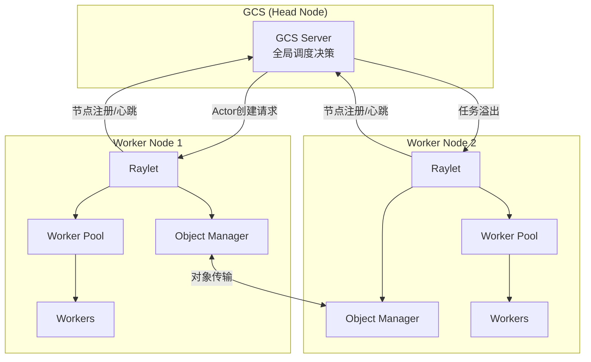
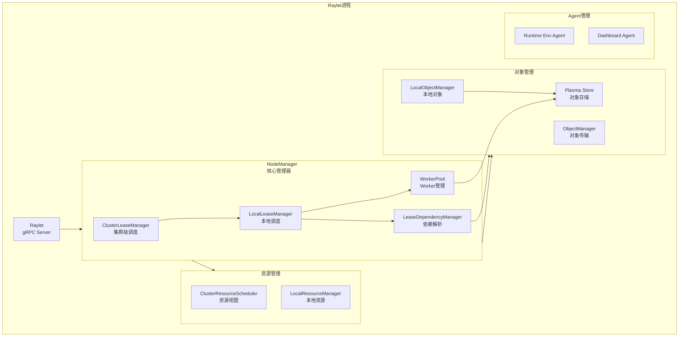
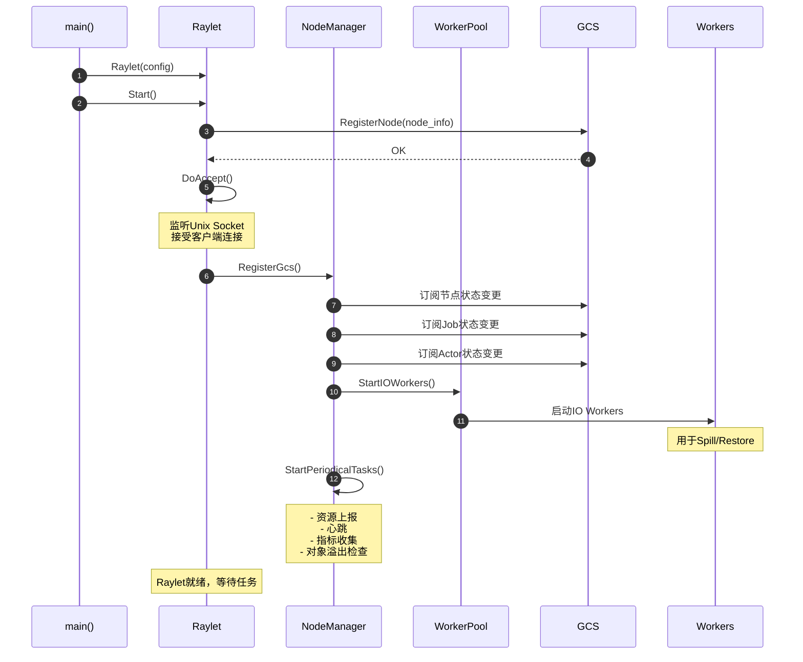
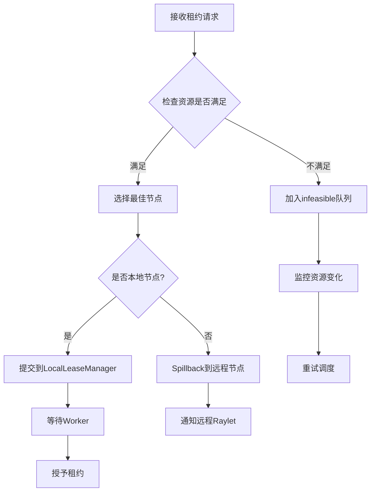
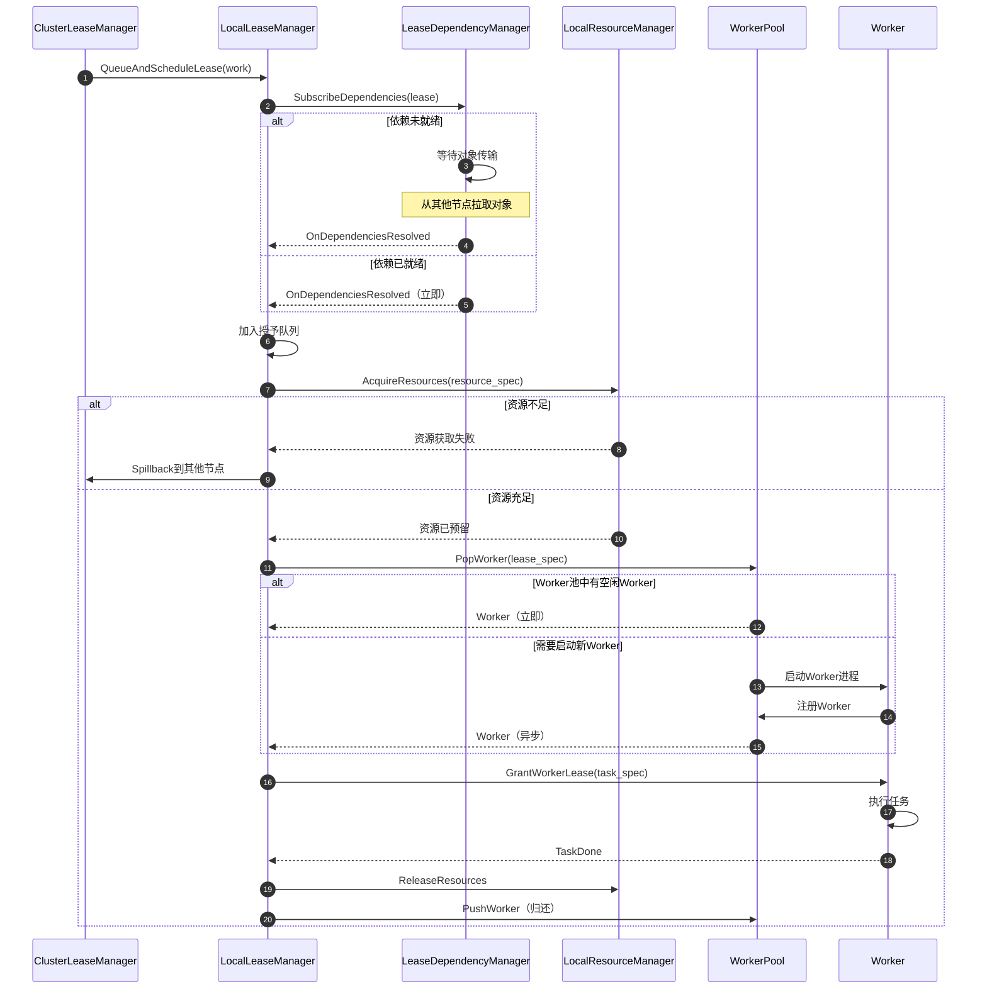
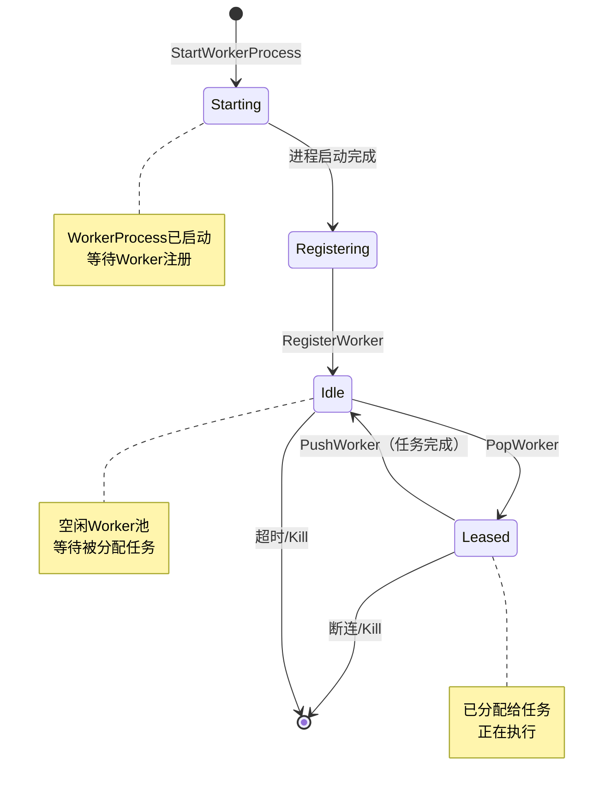
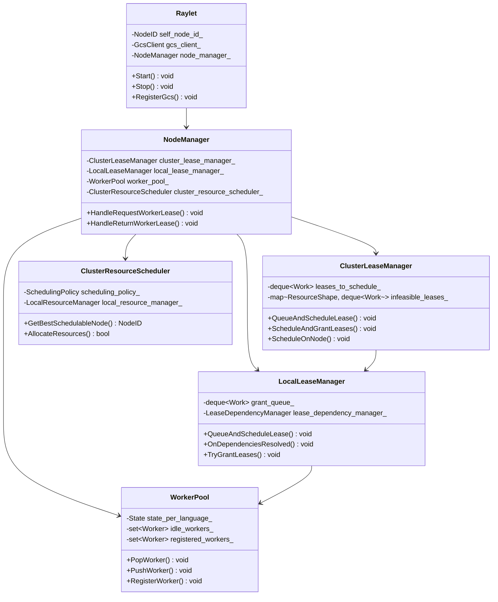

# Ray-04-Raylet模块（节点级调度器）

## 模块概览

### 职责

Raylet是每个Ray节点上的本地管理器和调度器，负责该节点上所有任务执行和资源管理。其核心职责包括：

- **任务调度**：接收来自GCS或其他节点的任务租约请求，调度到本地Worker
- **Worker生命周期管理**：启动、注册、分配、回收Worker进程
- **资源管理**：跟踪本地CPU、GPU、内存等资源使用情况
- **对象管理**：管理本地Plasma对象存储，处理对象迁移和溢出
- **依赖解析**：确保任务的输入对象在本地可用
- **节点注册与心跳**：向GCS注册并定期发送心跳

### Raylet与GCS的协作



### 输入/输出

**输入**：
- GCS分配的任务租约（Actor创建、普通任务）
- 其他Raylet转发的任务
- Core Worker的Worker租约请求
- 对象依赖请求（`ray.get`）

**输出**：
- Worker租约响应（worker地址、资源分配）
- Worker启动与回收
- 对象存储管理结果
- 节点资源状态上报

### 部署形态

每个Ray节点上运行一个Raylet进程，与GCS和其他Raylet通信。

### 模块架构图



## Raylet启动流程

### 启动时序图



### 核心实现代码

```cpp
// src/ray/raylet/raylet.cc
void Raylet::Start() {
  // 1. 向GCS注册本节点
  RegisterGcs();
  
  // 2. 开始监听客户端连接
  DoAccept();
}

void Raylet::RegisterGcs() {
  auto register_callback = [this](const Status &status) {
    RAY_CHECK_OK(status);
    
    RAY_LOG(INFO) << "Raylet of id " << self_node_id_ << " started."
                  << " node_manager address: "
                  << BuildAddress(self_node_info_.node_manager_address(),
                                  self_node_info_.node_manager_port())
                  << " object_manager address: "
                  << BuildAddress(self_node_info_.node_manager_address(),
                                  self_node_info_.object_manager_port());
    
    // NodeManager订阅GCS
    node_manager_.RegisterGcs();
  };
  
  // 向GCS注册节点信息
  RAY_CHECK_OK(gcs_client_.Nodes().RegisterSelf(
      self_node_info_, register_callback));
}

void Raylet::DoAccept() {
  // 监听Unix Socket，接受客户端连接
  acceptor_.async_accept(
      socket_,
      boost::bind(&Raylet::HandleAccept, this, 
                  boost::asio::placeholders::error));
}

void Raylet::HandleAccept(const boost::system::error_code &error) {
  if (!error) {
    // 定义错误处理器
    ConnectionErrorHandler error_handler = 
        [this](std::shared_ptr<ClientConnection> client,
               const boost::system::error_code &err) {
      node_manager_.HandleClientConnectionError(client, err);
    };
    
    // 定义消息处理器
    MessageHandler message_handler = 
        [this](std::shared_ptr<ClientConnection> client,
               int64_t message_type,
               const std::vector<uint8_t> &message) {
      node_manager_.ProcessClientMessage(
          client, message_type, message.data());
    };
    
    // 创建客户端连接
    auto conn = ClientConnection::Create(
        message_handler,
        error_handler,
        std::move(socket_),
        "worker",
        node_manager_message_enum);
    
    // 开始处理消息
    conn->ProcessMessages();
  }
  
  // 继续接受下一个连接
  DoAccept();
}
```

## NodeManager - 核心管理器

### 职责

NodeManager是Raylet的核心，协调所有本地组件：

- 接收并处理来自GCS的任务租约请求
- 接收并处理来自Core Worker的Worker租约请求
- 管理Worker生命周期
- 协调对象依赖解析
- 处理Worker注册、心跳、断连
- 上报节点资源和指标

### 核心API

#### API 1: HandleRequestWorkerLease

**功能**：处理Worker租约请求（来自GCS或Core Worker）

```cpp
// src/ray/raylet/node_manager.cc
void NodeManager::HandleRequestWorkerLease(
    rpc::RequestWorkerLeaseRequest request,
    rpc::RequestWorkerLeaseReply *reply,
    rpc::SendReplyCallback send_reply_callback) {
  
  // 1. 提取任务规格
  TaskSpecification task_spec(request.resource_spec());
  const LeaseID lease_id = LeaseID::FromBinary(task_spec.LeaseId());
  const JobID job_id = task_spec.JobId();
  
  RAY_LOG(DEBUG) << "Received lease request for task " << task_spec.TaskId()
                 << ", lease " << lease_id;
  
  // 2. 检查Job是否已完成
  if (finished_jobs_.count(job_id) > 0) {
    reply->set_rejected(true);
    reply->set_rejection_reason_message("Job has finished");
    send_reply_callback();
    return;
  }
  
  // 3. 构建RayLease对象
  RayLease lease(task_spec, request.grant_or_reject());
  
  // 4. 提交到ClusterLeaseManager进行调度
  auto callback = [this, reply, send_reply_callback]() {
    if (reply->rejected()) {
      // 租约被拒绝（资源不足或需要Spillback）
      send_reply_callback();
      return;
    }
    
    // 租约成功，Worker已分配
    send_reply_callback();
  };
  
  cluster_lease_manager_.QueueAndScheduleLease(
      std::move(lease),
      request.grant_or_reject(),
      request.is_selected_based_on_locality(),
      reply,
      std::move(callback));
}
```

#### API 2: HandleReturnWorkerLease

**功能**：归还Worker租约（任务完成后）

```cpp
void NodeManager::HandleReturnWorkerLease(
    rpc::ReturnWorkerLeaseRequest request,
    rpc::ReturnWorkerLeaseReply *reply,
    rpc::SendReplyCallback send_reply_callback) {
  
  const LeaseID lease_id = LeaseID::FromBinary(request.lease_id());
  const WorkerID worker_id = WorkerID::FromBinary(request.worker_id());
  
  RAY_LOG(DEBUG) << "Returning worker lease " << lease_id 
                 << ", worker " << worker_id;
  
  // 1. 从leased_workers_中移除
  auto it = leased_workers_.find(lease_id);
  if (it == leased_workers_.end()) {
    RAY_LOG(WARNING) << "Lease " << lease_id << " not found";
    send_reply_callback();
    return;
  }
  
  auto worker = it->second;
  leased_workers_.erase(it);
  
  // 2. 释放资源
  const auto &task_resources = worker->GetGrantedTaskResources();
  cluster_resource_scheduler_.GetLocalResourceManager()
      .ReleaseWorkerResources(task_resources);
  
  // 3. 清理Worker状态
  worker->ClearGrantedLeaseId();
  worker->ClearGrantedTaskResources();
  
  // 4. 将Worker放回WorkerPool
  if (!request.disconnect_worker()) {
    worker_pool_.PushWorker(worker);
  }
  
  send_reply_callback();
}
```

## ClusterLeaseManager - 集群级调度器

### 职责

ClusterLeaseManager负责集群级的任务调度决策：

- 接收租约请求并加入队列
- 使用ClusterResourceScheduler选择最佳节点
- 决定任务在本地执行还是溢出到其他节点
- 处理不可调度任务（Infeasible）

### 调度策略



### 核心实现代码

```cpp
// src/ray/raylet/scheduling/cluster_lease_manager.cc
void ClusterLeaseManager::QueueAndScheduleLease(
    RayLease lease,
    bool grant_or_reject,
    bool is_selected_based_on_locality,
    rpc::RequestWorkerLeaseReply *reply,
    std::function<void()> callback) {
  
  // 1. 创建Work对象（包含租约和回调）
  auto work = std::make_shared<internal::Work>(
      std::move(lease),
      grant_or_reject,
      is_selected_based_on_locality,
      reply,
      std::move(callback));
  
  const auto &lease_spec = work->lease_.GetLeaseSpecification();
  
  RAY_LOG(DEBUG) << "Queueing lease " << lease_spec.LeaseId();
  
  // 2. 添加到待调度队列（按资源需求分组）
  auto resource_shape = lease_spec.GetRequiredResources().GetResourceMap();
  leases_to_schedule_[resource_shape].push_back(work);
  
  // 3. 立即尝试调度
  ScheduleAndGrantLeases();
}

void ClusterLeaseManager::ScheduleAndGrantLeases() {
  // 1. 先尝试调度infeasible队列中的任务
  TryScheduleInfeasibleLease();
  
  // 2. 遍历所有待调度队列
  for (auto shapes_it = leases_to_schedule_.begin();
       shapes_it != leases_to_schedule_.end();) {
    
    auto &work_queue = shapes_it->second;
    bool is_infeasible = false;
    
    for (auto work_it = work_queue.begin(); 
         work_it != work_queue.end();) {
      
      const std::shared_ptr<internal::Work> &work = *work_it;
      RayLease lease = work->lease_;
      
      RAY_LOG(DEBUG) << "Scheduling lease " 
                     << lease.GetLeaseSpecification().LeaseId();
      
      // 3. 调用ClusterResourceScheduler选择最佳节点
      auto scheduling_node_id = 
          cluster_resource_scheduler_.GetBestSchedulableNode(
              lease.GetLeaseSpecification(),
              /*preferred_node_id*/ work->PrioritizeLocalNode() 
                  ? self_node_id_.Binary()
                  : lease.GetPreferredNodeID(),
              /*exclude_local_node*/ false,
              /*requires_object_store_memory*/ false,
              &is_infeasible);
      
      // 4. 没有可用节点
      if (scheduling_node_id.IsNil()) {
        if (is_infeasible) {
          // 资源需求无法满足，加入infeasible队列
          AddToInfeasibleQueue(work);
          work_it = work_queue.erase(work_it);
        } else {
          // 暂时没有资源，等待
          ++work_it;
        }
        continue;
      }
      
      // 5. 调度到选定节点
      ScheduleOnNode(NodeID::FromBinary(scheduling_node_id.Binary()), 
                     work);
      work_it = work_queue.erase(work_it);
    }
    
    // 清空已调度完的队列
    if (work_queue.empty()) {
      shapes_it = leases_to_schedule_.erase(shapes_it);
    } else {
      ++shapes_it;
    }
  }
}

void ClusterLeaseManager::ScheduleOnNode(
    const NodeID &spillback_to,
    const std::shared_ptr<internal::Work> &work) {
  
  if (spillback_to == self_node_id_) {
    // 本地执行，提交到LocalLeaseManager
    local_lease_manager_.QueueAndScheduleLease(work);
    return;
  }
  
  // 需要Spillback到远程节点
  auto send_reply_callback = work->callback_;
  
  if (work->grant_or_reject_) {
    // 如果要求立即授予或拒绝，则拒绝
    work->reply_->set_rejected(true);
    send_reply_callback();
    return;
  }
  
  // 分配远程资源
  const auto &lease = work->lease_;
  const auto &lease_spec = lease.GetLeaseSpecification();
  
  RAY_LOG(DEBUG) << "Spilling lease " << lease_spec.LeaseId() 
                 << " to node " << spillback_to;
  
  cluster_resource_scheduler_.AllocateRemoteTaskResources(
      scheduling::NodeID(spillback_to.Binary()),
      lease_spec.GetRequiredResources().GetResourceMap());
  
  // 构建Spillback响应
  auto node_info_ptr = get_node_info_(spillback_to);
  auto reply = work->reply_;
  reply->mutable_retry_at_raylet_address()->set_ip_address(
      node_info_ptr->node_manager_address());
  reply->mutable_retry_at_raylet_address()->set_port(
      node_info_ptr->node_manager_port());
  reply->mutable_retry_at_raylet_address()->set_node_id(
      spillback_to.Binary());
  
  send_reply_callback();
}
```

## LocalLeaseManager - 本地调度器

### 职责

LocalLeaseManager负责本地任务执行的具体安排：

- 解析任务依赖（确保输入对象在本地）
- 等待依赖就绪，将任务加入授予队列
- 从Worker Pool获取Worker
- 分配本地资源（CPU、GPU、内存）
- 将任务发送给Worker执行

### 本地调度流程



### 核心实现代码

```cpp
// src/ray/raylet/local_lease_manager.cc
void LocalLeaseManager::QueueAndScheduleLease(
    std::shared_ptr<internal::Work> work) {
  
  const auto &lease = work->lease_;
  const auto &lease_spec = lease.GetLeaseSpecification();
  
  RAY_LOG(DEBUG) << "Local scheduling lease " << lease_spec.LeaseId();
  
  // 1. 订阅任务依赖
  lease_dependency_manager_.SubscribeDependencies(
      lease_spec.LeaseId(),
      lease_spec.GetDependencies(),
      [this, work](const LeaseID &lease_id) {
        // 依赖就绪回调
        OnDependenciesResolved(work);
      });
  
  // 2. 如果依赖已就绪，立即调度
  // 否则等待依赖解析完成
}

void LocalLeaseManager::OnDependenciesResolved(
    std::shared_ptr<internal::Work> work) {
  
  // 1. 添加到授予队列
  work->SetStateWaitingForWorker();
  grant_queue_.push_back(work);
  
  // 2. 尝试授予
  TryGrantLeases();
}

void LocalLeaseManager::TryGrantLeases() {
  for (auto it = grant_queue_.begin(); it != grant_queue_.end();) {
    auto &work = *it;
    const auto &lease_spec = work->lease_.GetLeaseSpecification();
    
    // 1. 尝试获取本地资源
    auto allocated_instances = 
        local_resource_manager_.TryAllocate(
            lease_spec.GetRequiredResources());
    
    if (!allocated_instances.has_value()) {
      // 资源不足，尝试Spillback
      SpillbackIfPossible(work);
      it = grant_queue_.erase(it);
      continue;
    }
    
    work->allocated_instances_ = 
        std::make_shared<TaskResourceInstances>(
            allocated_instances.value());
    
    // 2. 从WorkerPool获取Worker
    worker_pool_.PopWorker(
        lease_spec,
        [this, work](const std::shared_ptr<WorkerInterface> &worker,
                     PopWorkerStatus status,
                     const std::string &error_message) {
          if (status != PopWorkerStatus::OK) {
            // Worker获取失败
            HandleWorkerLeaseFailure(work, error_message);
            return true;
          }
          
          // 3. 授予租约给Worker
          GrantWorkerLease(work, worker);
          return true;
        });
    
    it = grant_queue_.erase(it);
  }
}

void LocalLeaseManager::GrantWorkerLease(
    std::shared_ptr<internal::Work> work,
    std::shared_ptr<WorkerInterface> worker) {
  
  const auto &lease_spec = work->lease_.GetLeaseSpecification();
  
  // 1. 设置Worker的租约信息
  worker->SetGrantedLeaseId(LeaseID::FromBinary(lease_spec.LeaseId()));
  worker->SetGrantedTaskResources(*work->allocated_instances_);
  
  // 2. 记录到leased_workers_
  leased_workers_[LeaseID::FromBinary(lease_spec.LeaseId())] = worker;
  
  // 3. 构建租约响应
  auto reply = work->reply_;
  reply->mutable_worker_address()->set_ip_address(
      worker->IpAddress());
  reply->mutable_worker_address()->set_port(
      worker->Port());
  reply->mutable_worker_address()->set_worker_id(
      worker->WorkerId().Binary());
  reply->set_lease_id(lease_spec.LeaseId());
  
  // 4. 调用回调
  work->callback_();
  
  RAY_LOG(DEBUG) << "Granted lease " << lease_spec.LeaseId()
                 << " to worker " << worker->WorkerId();
}
```

## WorkerPool - Worker管理器

### 职责

WorkerPool负责管理所有Worker进程的生命周期：

- 启动新Worker进程
- 维护空闲Worker池
- 匹配Worker与租约请求
- 处理Worker注册、心跳、断连
- 管理IO Worker（用于Spill/Restore）
- 管理Runtime Environment

### Worker状态机



### 核心API

#### API 1: PopWorker

**功能**：从Worker池中获取或启动Worker

```cpp
// src/ray/raylet/worker_pool.cc
void WorkerPool::PopWorker(
    std::shared_ptr<PopWorkerRequest> pop_worker_request) {
  
  // 1. 尝试从空闲池中找到匹配的Worker
  auto worker = FindAndPopIdleWorker(*pop_worker_request);
  
  if (worker != nullptr) {
    // 找到空闲Worker，立即返回
    RAY_LOG(DEBUG) << "Reusing idle worker " << worker->WorkerId();
    ray_metric_num_workers_started_from_cache_.Record(1);
    
    PopWorkerCallbackAsync(
        pop_worker_request->callback_, 
        worker, 
        PopWorkerStatus::OK);
    return;
  }
  
  // 2. 没有空闲Worker，启动新Worker
  StartNewWorker(pop_worker_request);
}

std::shared_ptr<WorkerInterface> WorkerPool::FindAndPopIdleWorker(
    const PopWorkerRequest &pop_worker_request) {
  
  auto &state = GetStateForLanguage(pop_worker_request.language_);
  
  // 遍历空闲Worker池
  for (auto it = state.idle.begin(); it != state.idle.end(); ++it) {
    auto &worker = *it;
    
    // 检查Worker是否适合该租约
    auto unfit_reason = WorkerFitForLease(*worker, pop_worker_request);
    
    if (unfit_reason == WorkerUnfitForLeaseReason::NONE) {
      // 找到匹配的Worker
      state.idle.erase(it);
      return worker;
    }
  }
  
  return nullptr;
}

WorkerUnfitForLeaseReason WorkerPool::WorkerFitForLease(
    const WorkerInterface &worker,
    const PopWorkerRequest &request) const {
  
  // 检查语言
  if (worker.GetLanguage() != request.language_) {
    return WorkerUnfitForLeaseReason::LANGUAGE_MISMATCH;
  }
  
  // 检查Worker类型
  if (worker.GetWorkerType() != request.worker_type_) {
    return WorkerUnfitForLeaseReason::WORKER_TYPE_MISMATCH;
  }
  
  // 检查Runtime Environment
  if (worker.GetRuntimeEnvHash() != request.runtime_env_hash_) {
    return WorkerUnfitForLeaseReason::RUNTIME_ENV_MISMATCH;
  }
  
  // 检查Job ID（非detached actor）
  if (!request.root_detached_actor_id_.IsNil()) {
    // Detached actor可以使用任何Worker
    return WorkerUnfitForLeaseReason::NONE;
  }
  
  if (!worker.GetAssignedJobId().IsNil() &&
      worker.GetAssignedJobId() != request.job_id_) {
    return WorkerUnfitForLeaseReason::JOB_MISMATCH;
  }
  
  // 检查Dynamic Options
  if (worker.GetDynamicOptions() != request.dynamic_options_) {
    return WorkerUnfitForLeaseReason::DYNAMIC_OPTIONS_MISMATCH;
  }
  
  return WorkerUnfitForLeaseReason::NONE;
}
```

#### API 2: StartNewWorker

**功能**：启动新的Worker进程

```cpp
void WorkerPool::StartNewWorker(
    const std::shared_ptr<PopWorkerRequest> &pop_worker_request) {
  
  auto &state = GetStateForLanguage(pop_worker_request->language_);
  
  // 1. 检查是否超过最大启动并发数
  int num_starting = GetNumWorkersStarting(state);
  if (num_starting >= maximum_startup_concurrency_) {
    RAY_LOG(DEBUG) << "Too many workers starting: " << num_starting;
    
    // 加入待启动队列
    state.pending_start_requests.push_back(pop_worker_request);
    
    PopWorkerCallbackAsync(
        pop_worker_request->callback_,
        nullptr,
        PopWorkerStatus::TooManyStartingWorkerProcesses);
    return;
  }
  
  // 2. 创建Runtime Environment
  if (!pop_worker_request->runtime_env_info_.serialized_runtime_env().empty()) {
    CreateRuntimeEnv(
        pop_worker_request,
        [this, pop_worker_request](bool successful, 
                                     const std::string &error_msg) {
          if (!successful) {
            PopWorkerCallbackAsync(
                pop_worker_request->callback_,
                nullptr,
                PopWorkerStatus::RuntimeEnvCreationFailed,
                error_msg);
            return;
          }
          
          // Runtime Env创建成功，启动Worker进程
          StartWorkerProcess(pop_worker_request);
        });
  } else {
    // 无需Runtime Env，直接启动
    StartWorkerProcess(pop_worker_request);
  }
}

void WorkerPool::StartWorkerProcess(
    const std::shared_ptr<PopWorkerRequest> &pop_worker_request) {
  
  auto &state = GetStateForLanguage(pop_worker_request->language_);
  
  RAY_LOG(INFO) << "Starting worker process for job " 
                << pop_worker_request->job_id_;
  
  // 1. 构建Worker启动命令
  auto [worker_command_args, env] = BuildProcessCommandArgs(
      pop_worker_request->language_,
      job_config,
      pop_worker_request->worker_type_,
      pop_worker_request->job_id_,
      pop_worker_request->dynamic_options_,
      runtime_env_hash,
      serialized_runtime_env_context,
      state);
  
  // 2. 启动进程
  Process proc = StartProcess(worker_command_args, env);
  ray_metric_num_workers_started_.Record(1);
  
  RAY_LOG(INFO) << "Started worker process with pid " << proc.GetId();
  
  // 3. 调整OOM Score（Linux）
  AdjustWorkerOomScore(proc.GetId());
  
  // 4. 监控Worker启动
  StartupToken worker_startup_token = worker_startup_token_counter_++;
  MonitorStartingWorkerProcess(
      worker_startup_token, 
      pop_worker_request->language_,
      pop_worker_request->worker_type_);
  
  // 5. 记录Worker进程信息
  AddWorkerProcess(
      state,
      pop_worker_request->worker_type_,
      proc,
      current_time,
      pop_worker_request->runtime_env_info_,
      pop_worker_request->dynamic_options_,
      pop_worker_request->worker_startup_keep_alive_duration_);
  
  // 6. 加入待注册队列
  state.pending_registration_requests.push_back(pop_worker_request);
}
```

#### API 3: PushWorker

**功能**：归还Worker到空闲池

```cpp
void WorkerPool::PushWorker(
    const std::shared_ptr<WorkerInterface> &worker) {
  
  // 1. 验证Worker状态
  RAY_CHECK(worker->GetGrantedLeaseId().IsNil())
      << "Idle workers cannot have an assigned lease ID";
  RAY_CHECK(worker->GetWorkerType() != rpc::WorkerType::DRIVER)
      << "Idle workers cannot be drivers";
  
  auto &state = GetStateForLanguage(worker->GetLanguage());
  
  // 2. 尝试匹配待处理的请求
  std::shared_ptr<PopWorkerRequest> pop_worker_request = nullptr;
  
  // 先查找pending_registration_requests
  auto it = std::find_if(
      state.pending_registration_requests.begin(),
      state.pending_registration_requests.end(),
      [this, &worker](const std::shared_ptr<PopWorkerRequest> &request) {
        return WorkerFitForLease(*worker, *request) == 
               WorkerUnfitForLeaseReason::NONE;
      });
  
  if (it != state.pending_registration_requests.end()) {
    pop_worker_request = *it;
    state.pending_registration_requests.erase(it);
  }
  
  // 再查找pending_start_requests
  if (!pop_worker_request) {
    auto it2 = std::find_if(
        state.pending_start_requests.begin(),
        state.pending_start_requests.end(),
        [this, &worker](const std::shared_ptr<PopWorkerRequest> &request) {
          return WorkerFitForLease(*worker, *request) == 
                 WorkerUnfitForLeaseReason::NONE;
        });
    
    if (it2 != state.pending_start_requests.end()) {
      pop_worker_request = *it2;
      state.pending_start_requests.erase(it2);
    }
  }
  
  // 3. 如果找到匹配请求，分配Worker
  if (pop_worker_request) {
    bool used = pop_worker_request->callback_(
        worker, PopWorkerStatus::OK, "");
    
    if (!used) {
      // 回调拒绝了Worker，重新尝试PushWorker
      return PushWorker(worker);
    }
  } else {
    // 4. 没有待处理请求，加入空闲池
    RAY_LOG(DEBUG) << "Pushing worker " << worker->WorkerId() 
                   << " to idle pool";
    state.idle.insert(worker);
  }
}
```

### Worker注册流程

```cpp
void WorkerPool::RegisterWorker(
    const std::shared_ptr<WorkerInterface> &worker,
    pid_t pid,
    StartupToken worker_startup_token,
    std::function<void()> callback) {
  
  auto &state = GetStateForLanguage(worker->GetLanguage());
  
  RAY_LOG(INFO) << "Registering worker " << worker->WorkerId()
                << ", pid=" << pid
                << ", startup_token=" << worker_startup_token;
  
  // 1. 查找对应的WorkerProcess
  auto it = state.worker_processes.find(worker_startup_token);
  if (it == state.worker_processes.end()) {
    RAY_LOG(WARNING) << "Unknown worker startup token: " 
                     << worker_startup_token;
    callback();
    return;
  }
  
  auto &worker_process_info = it->second;
  
  // 2. 设置Worker属性
  worker->SetProcess(worker_process_info.proc);
  worker->SetStartupToken(worker_startup_token);
  worker->SetRuntimeEnvInfo(worker_process_info.runtime_env_info);
  worker->SetDynamicOptions(worker_process_info.dynamic_options);
  
  // 3. 添加到registered_workers
  state.registered_workers.insert(worker);
  
  // 4. 将Worker加入空闲池（会自动匹配待处理请求）
  PushWorker(worker);
  
  callback();
}
```

## ClusterResourceScheduler - 资源调度器

### 职责

ClusterResourceScheduler维护集群所有节点的资源视图，并提供调度算法：

- 跟踪每个节点的资源总量和可用量
- 接收节点资源变更通知
- 为任务选择最佳节点（考虑资源、数据局部性、负载均衡）
- 支持多种调度策略（Spread、NodeAffinity、PlacementGroup）

### 资源视图结构

```cpp
class ClusterResourceScheduler {
public:
  // 获取最佳可调度节点
  scheduling::NodeID GetBestSchedulableNode(
      const LeaseSpecification &lease_spec,
      const std::string &preferred_node_id,
      bool exclude_local_node,
      bool requires_object_store_memory,
      bool *is_infeasible);
  
  // 分配本地资源
  bool AllocateLocalTaskResources(
      const ResourceRequest &resource_request,
      std::shared_ptr<TaskResourceInstances> task_allocation);
  
  // 分配远程资源
  bool AllocateRemoteTaskResources(
      const scheduling::NodeID &node_id,
      const absl::flat_hash_map<std::string, double> &task_resources);
  
  // 释放资源
  void FreeLocalTaskResources(
      const TaskResourceInstances &task_allocation);
  
private:
  // 调度策略
  std::unique_ptr<SchedulingPolicy> scheduling_policy_;
  
  // 本地资源管理器
  LocalResourceManager &local_resource_manager_;
  
  // 节点资源视图
  absl::flat_hash_map<scheduling::NodeID, Node> nodes_;
};
```

### 调度策略

```cpp
// src/ray/raylet/scheduling/scheduling_policy.cc
scheduling::NodeID HybridSchedulingPolicy::Schedule(
    const ResourceRequest &resource_request,
    SchedulingOptions options) {
  
  // 1. 生成节点遍历顺序（本地节点优先）
  std::vector<scheduling::NodeID> node_order = 
      GenerateTraversalOrder(
          options.avoid_local_node,
          options.require_node_available,
          options.node_filter);
  
  scheduling::NodeID best_node_id = scheduling::NodeID::Nil();
  float best_utilization_score = INFINITY;
  bool best_is_available = false;
  
  // 2. 遍历节点，找到最佳匹配
  for (auto node_id : node_order) {
    auto &node = nodes_[node_id];
    
    // 检查资源是否满足
    if (!node.GetLocalView().IsFeasible(resource_request)) {
      continue;
    }
    
    // 计算利用率得分（负载均衡）
    float utilization_score = 
        node.GetLocalView().CalculateUtilizationScore(
            resource_request,
            /*object_store_memory_used*/ 0);
    
    // 比较节点优先级
    bool is_available = IsNodeAvailable(node_id);
    if (!best_is_available && is_available) {
      // 优先选择可用节点
      best_node_id = node_id;
      best_utilization_score = utilization_score;
      best_is_available = true;
    } else if (best_is_available == is_available &&
               utilization_score < best_utilization_score) {
      // 选择负载更低的节点
      best_node_id = node_id;
      best_utilization_score = utilization_score;
    }
  }
  
  return best_node_id;
}
```

## 关键数据结构

### Raylet组件类图



### Work结构（调度单元）

```cpp
// src/ray/raylet/scheduling/internal.h
class Work {
public:
  // 租约信息
  RayLease lease_;
  
  // 是否要求立即授予或拒绝
  bool grant_or_reject_;
  
  // 是否基于局部性选择
  bool is_selected_based_on_locality_;
  
  // 响应对象
  rpc::RequestWorkerLeaseReply *reply_;
  
  // 完成回调
  std::function<void()> callback_;
  
  // 已分配的资源实例
  std::shared_ptr<TaskResourceInstances> allocated_instances_;
  
  // 状态
  WorkStatus status_;  // WAITING, WAITING_FOR_WORKER, CANCELLED
  
  // 未调度原因
  UnscheduledWorkCause unscheduled_work_cause_;
  
  // 是否优先本地节点
  bool PrioritizeLocalNode() const {
    return grant_or_reject_ || is_selected_based_on_locality_;
  }
};
```

## 最佳实践

### 1. 资源配置

```bash
# 启动Raylet时指定资源
ray start --head \
  --num-cpus=16 \
  --num-gpus=4 \
  --memory=64000000000 \  # 64GB
  --resources='{"custom_resource": 10}'
```

**注意事项**：
- 资源应略小于物理资源，为系统进程预留空间
- 自定义资源用于任务亲和性调度

### 2. Worker Pool调优

```python
# RayConfig配置
RAY_maximum_startup_concurrency = 10  # Worker并发启动数
RAY_worker_register_timeout_seconds = 60  # Worker注册超时
RAY_idle_worker_killing_time_threshold_ms = 600000  # 空闲Worker回收时间（10分钟）
RAY_num_prestart_workers = 0  # 预启动Worker数量
```

**调优建议**：
- 对于大量短任务，增加`maximum_startup_concurrency`
- 对于长任务，减少`idle_worker_killing_time_threshold_ms`避免频繁启动
- 使用`num_prestart_workers`预热Worker池

### 3. 调度策略选择

```python
# Spread策略（默认）：负载均衡
@ray.remote(scheduling_strategy="SPREAD")
def task():
    pass

# Node Affinity策略：指定节点
@ray.remote(scheduling_strategy=NodeAffinitySchedulingStrategy(
    node_id=ray.get_runtime_context().get_node_id(),
    soft=True  # soft=False为硬约束
))
def task():
    pass

# Placement Group策略：资源打包
pg = PlacementGroup(bundles=[{"CPU": 2}] * 4, strategy="PACK")
@ray.remote(scheduling_strategy=PlacementGroupSchedulingStrategy(
    placement_group=pg
))
def task():
    pass
```

### 4. 监控Raylet状态

```python
# 查看节点资源
import ray
ray.init(address='auto')

# 查看集群资源
print(ray.cluster_resources())
print(ray.available_resources())

# 查看节点详情
from ray.util.state import list_nodes
nodes = list_nodes()
for node in nodes:
    print(f"Node {node['node_id']}: "
          f"CPU={node['cpu']}, GPU={node['gpu']}, "
          f"Memory={node['memory']}")

# 查看Worker状态
from ray.util.state import list_workers
workers = list_workers()
print(f"Total workers: {len(workers)}")
```

### 5. 故障排查

```bash
# 查看Raylet日志
tail -f /tmp/ray/session_*/logs/raylet.out
tail -f /tmp/ray/session_*/logs/raylet.err

# 常见问题
# 1. Worker启动超时
#    - 检查runtime_env是否过大
#    - 增加worker_register_timeout_seconds

# 2. 调度缓慢
#    - 检查是否资源碎片化
#    - 使用PlacementGroup打包资源

# 3. 内存溢出
#    - 调整object_store_memory
#    - 启用对象溢出（automatic_object_spilling=True）
```

## 性能特征

### 延迟数据

| 操作 | 典型延迟 | 说明 |
|------|---------|------|
| Worker租约请求 | 1-10ms | 已有空闲Worker时 |
| Worker启动 | 100-500ms | 需要启动新Worker |
| Runtime Env创建 | 1-10s | 依赖大小 |
| 任务调度 | 1-5ms | 本地调度 |
| Spillback | 5-20ms | 跨节点调度 |
| 对象传输 | 10-100ms | 取决于对象大小和网络 |

### 扩展性

- **节点规模**：单Raylet可管理数百Worker
- **任务吞吐**：每秒数千任务
- **资源类型**：支持任意自定义资源
- **Worker池大小**：自动扩展，按需启动

### 资源占用

- **内存**：基础100-500MB，随Worker数量增长
- **CPU**：通常<5%（单核）
- **磁盘**：日志和Plasma存储

## 总结

Raylet是Ray的节点级调度器，负责本地任务执行的所有细节。关键要点：

1. **两级调度**：ClusterLeaseManager（全局）+ LocalLeaseManager（本地）
2. **Worker池化**：复用Worker进程，减少启动开销
3. **资源感知**：精确跟踪本地资源，支持多种资源类型
4. **依赖驱动**：任务只有在依赖就绪后才调度
5. **Spillback机制**：本地资源不足时自动转发到其他节点

理解Raylet对于优化Ray应用性能、排查调度问题至关重要。

