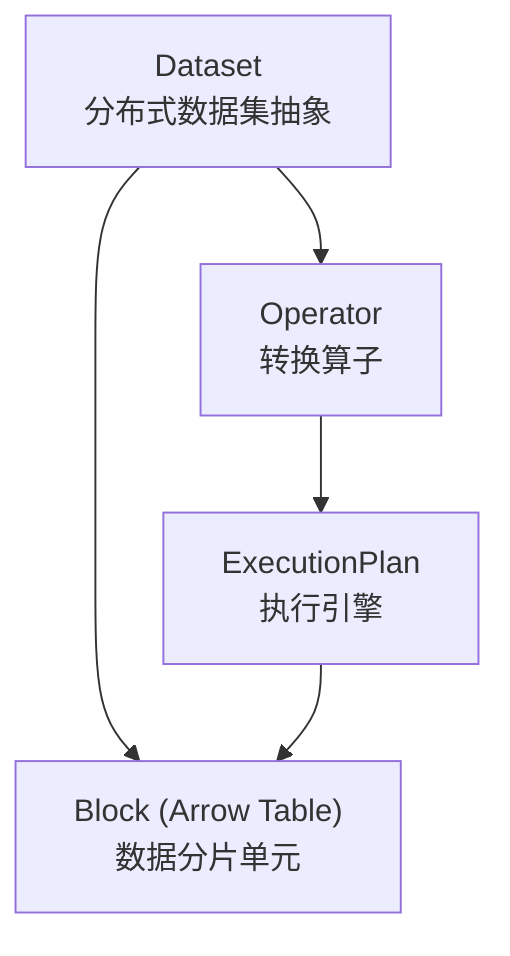
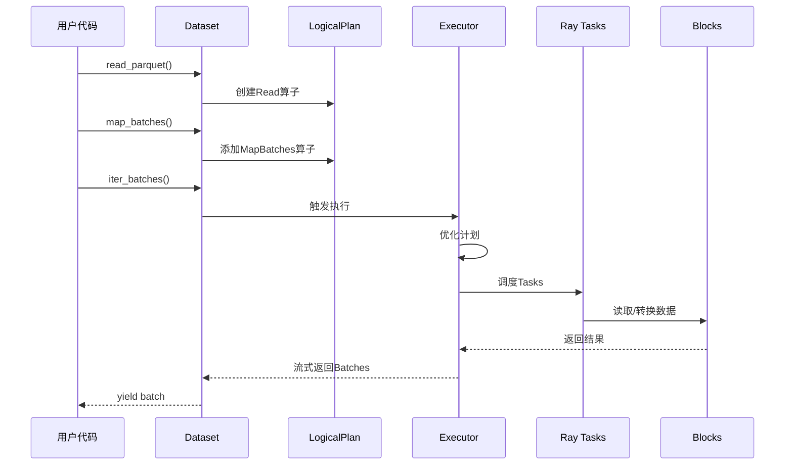

# Ray-05-Data模块（数据处理）

## 模块概览

### 职责

Ray Data是Ray的分布式数据加载和处理库，用于构建可扩展的ML数据管道。核心职责：

- **数据加载**：从多种源加载数据（S3、HDFS、本地磁盘、数据库）
- **数据转换**：分布式的map、filter、group_by等操作
- **数据处理**：批处理、流式处理、增量处理
- **数据输出**：写入到多种存储系统
- **ML集成**：与PyTorch/TensorFlow无缝集成

### 核心概念



## 关键API

### 数据加载

```python
import ray

# 从文件加载
ds = ray.data.read_parquet("s3://bucket/data/*.parquet")
ds = ray.data.read_csv("hdfs://path/*.csv")
ds = ray.data.read_images("/path/to/images")

# 从内存加载
ds = ray.data.from_items([{"x": 1}, {"x": 2}])
ds = ray.data.range(1000000)
```

### 数据转换

```python
# Map操作（无状态）
ds = ds.map_batches(
    lambda batch: {"x": batch["x"] * 2},
    batch_size=1024
)

# Map操作（有状态，使用Actor）
class Preprocessor:
    def __init__(self):
        self.model = load_model()
    
    def __call__(self, batch):
        return self.model.transform(batch)

ds = ds.map_batches(
    Preprocessor,
    concurrency=4,  # 4个Actor并行
    num_gpus=1      # 每个Actor 1个GPU
)

# Filter操作
ds = ds.filter(lambda row: row["age"] > 18)

# GroupBy + Aggregate
ds.groupby("user_id").count()
ds.groupby("category").max("price")
```

### 数据输出

```python
# 写入文件
ds.write_parquet("s3://output/")
ds.write_json("hdfs://output/")

# 迭代消费（训练）
for batch in ds.iter_batches(batch_size=32):
    model.train(batch)

# 转换为PyTorch/TensorFlow
torch_ds = ds.iter_torch_batches(batch_size=32)
tf_ds = ds.to_tf(batch_size=32)
```

## 架构设计

### 逻辑计划与物理执行



### Block结构

每个Block是一个Arrow Table，包含N行数据。Block大小影响性能：
- 过小：调度开销大
- 过大：内存占用高、并行度低

### 执行引擎

Ray Data使用流式执行引擎，支持：
- **Pipeline执行**：算子流水线，减少内存占用
- **增量处理**：边读边处理
- **反压控制**：防止内存溢出

## 最佳实践

### 1. 选择合适的Batch Size

```python
# 小batch：低延迟，高吞吐
ds.map_batches(fn, batch_size=128)  # GPU推理

# 大batch：高效利用CPU
ds.map_batches(fn, batch_size=4096)  # CPU预处理
```

### 2. 使用Actor实现有状态转换

```python
# 适用于模型推理（避免重复加载模型）
class ModelInference:
    def __init__(self):
        self.model = load_model()  # 只加载一次
    
    def __call__(self, batch):
        return self.model.predict(batch)

ds.map_batches(
    ModelInference,
    concurrency=8,     # 8个并行Actor
    num_gpus=1,        # 每个Actor 1个GPU
    batch_size=32
)
```

### 3. 性能调优

```python
# 设置执行参数
ctx = ray.data.DataContext.get_current()
ctx.execution_options.resource_limits.cpu = 16
ctx.execution_options.resource_limits.object_store_memory = 10e9

# 预取数据
ds = ds.map_batches(fn, prefetch_batches=2)
```

## 总结

Ray Data是构建可扩展ML数据管道的利器，关键特性：

1. **统一接口**：支持多种数据源和格式
2. **分布式执行**：自动并行化，线性扩展
3. **流式处理**：内存高效，支持大规模数据
4. **ML框架集成**：与PyTorch/TensorFlow无缝对接
5. **灵活调度**：支持CPU/GPU混合调度

