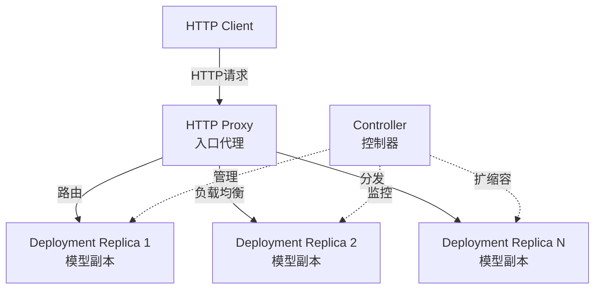
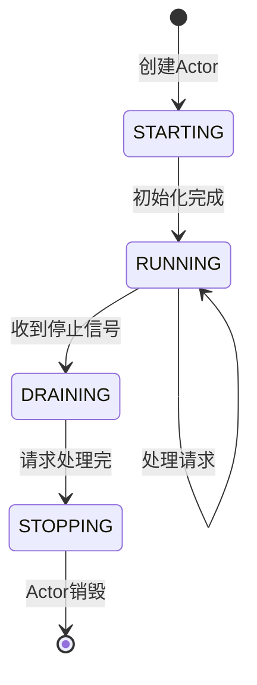
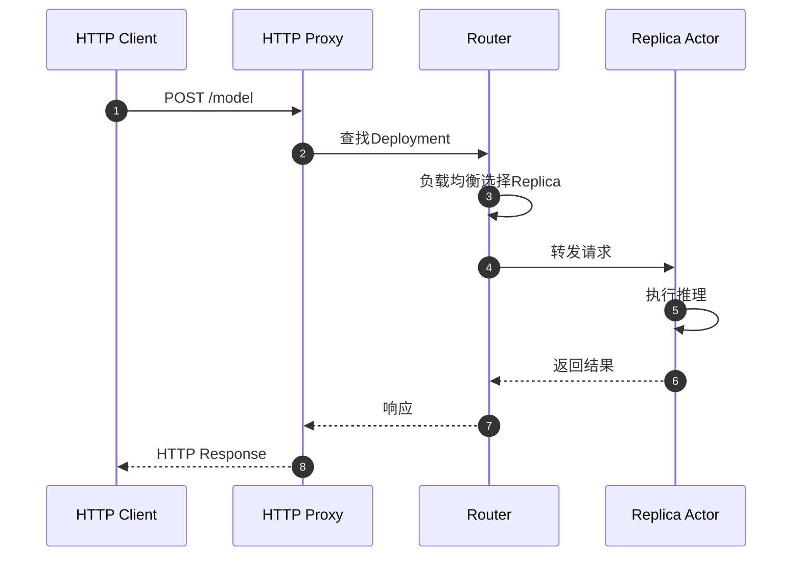

# Ray-06-Serve模块（模型服务）

## 模块概览

### 职责

Ray Serve是Ray的可扩展模型服务框架，用于部署和管理ML模型。核心职责：

- **模型部署**：快速部署Python函数或类作为HTTP服务
- **自动扩缩容**：根据负载动态调整副本数
- **流量管理**：请求路由、负载均衡、A/B测试
- **多模型组合**：构建复杂的模型管道（DAG）
- **高可用**：副本容错、优雅降级

### 核心概念



## 关键API

### 基础部署

```python
from ray import serve
import ray

ray.init()
serve.start()

# 简单函数部署
@serve.deployment
def my_model(request):
    return {"result": request.query_params["input"]}

my_model.deploy()

# 查询模型
import requests
resp = requests.get("http://localhost:8000/my_model?input=hello")
print(resp.json())
```

### 类部署（有状态）

```python
@serve.deployment(num_replicas=2, ray_actor_options={"num_gpus": 1})
class ModelDeployment:
    def __init__(self, model_path):
        # 加载模型（每个副本执行一次）
        self.model = load_model(model_path)
    
    async def __call__(self, request):
        data = await request.json()
        prediction = self.model.predict(data["input"])
        return {"prediction": prediction}

app = ModelDeployment.bind(model_path="s3://models/my_model")
serve.run(app)
```

### 自动扩缩容

```python
@serve.deployment(
    autoscaling_config={
        "min_replicas": 1,
        "max_replicas": 10,
        "target_num_ongoing_requests_per_replica": 5,
    }
)
class AutoscaledModel:
    def __call__(self, request):
        return process(request)
```

### 模型组合（DAG）

```python
# 构建模型管道
@serve.deployment
class Preprocessor:
    def __call__(self, input_data):
        return preprocess(input_data)

@serve.deployment
class Model:
    def __call__(self, processed_data):
        return model_inference(processed_data)

@serve.deployment
class Postprocessor:
    def __call__(self, prediction):
        return postprocess(prediction)

# 组装DAG
preprocessor = Preprocessor.bind()
model = Model.bind()
postprocessor = Postprocessor.bind()

# 串联调用
app = DAGDriver.bind({
    "preprocessor": preprocessor,
    "model": model,
    "postprocessor": postprocessor
})
serve.run(app)
```

## 架构设计

### Controller架构

```python
class ServeController:
    """负责管理Serve应用的生命周期"""
    
    def deploy_application(self, app_config):
        # 1. 解析配置
        deployments = parse_config(app_config)
        
        # 2. 创建/更新Deployment
        for deployment in deployments:
            self.create_or_update_deployment(deployment)
        
        # 3. 监控健康状态
        self.start_health_check(deployments)
    
    def scale_deployment(self, deployment_name, num_replicas):
        # 动态调整副本数
        deployment = self.get_deployment(deployment_name)
        deployment.scale(num_replicas)
```

### Replica生命周期



### 请求流程



## 关键特性

### 1. FastAPI集成

```python
from fastapi import FastAPI
from ray import serve

app = FastAPI()

@serve.deployment
@serve.ingress(app)
class MyFastAPIDeployment:
    @app.get("/")
    def root(self):
        return {"message": "Hello World"}
    
    @app.post("/predict")
    def predict(self, data: dict):
        return {"prediction": model.predict(data)}

serve.run(MyFastAPIDeployment.bind())
```

### 2. 多模型推理（Multiplexing）

```python
@serve.deployment
class MultiModel:
    def __init__(self):
        self.models = {}
    
    @serve.multiplexed(max_num_models_per_replica=3)
    async def load_model(self, model_id: str):
        # 动态加载模型
        model = load_from_storage(model_id)
        return model
    
    async def __call__(self, request):
        model_id = serve.get_multiplexed_model_id()
        model = await self.load_model(model_id)
        return model.predict(request)
```

### 3. 流式响应

```python
@serve.deployment
class StreamingModel:
    async def __call__(self, request):
        # 流式返回结果
        async def generate():
            for chunk in model.generate_stream(request):
                yield chunk
        
        from starlette.responses import StreamingResponse
        return StreamingResponse(generate(), media_type="text/plain")
```

## 最佳实践

### 1. 资源配置

```python
@serve.deployment(
    num_replicas=4,
    ray_actor_options={
        "num_cpus": 2,
        "num_gpus": 1,
        "memory": 4 * 1024 * 1024 * 1024,  # 4GB
        "resources": {"custom_resource": 1}
    }
)
class ResourceConfiguredModel:
    pass
```

### 2. 故障恢复

```python
@serve.deployment(
    max_ongoing_requests=100,    # 限流
    health_check_period_s=10,    # 健康检查间隔
    health_check_timeout_s=30    # 健康检查超时
)
class RobustModel:
    async def check_health(self):
        # 自定义健康检查
        return model.is_ready()
```

### 3. 监控与日志

```python
import logging
from ray import serve

logger = logging.getLogger("ray.serve")

@serve.deployment
class MonitoredModel:
    def __call__(self, request):
        logger.info(f"Processing request: {request}")
        result = model.predict(request)
        logger.info(f"Result: {result}")
        return result
```

## 生产部署

### 使用配置文件

```yaml
# serve_config.yaml
applications:
  - name: my_app
    import_path: mymodule:app
    route_prefix: /
    runtime_env:
      working_dir: "s3://bucket/code.zip"
      pip:
        - torch==2.0.0
        - transformers==4.30.0
    deployments:
      - name: ModelDeployment
        num_replicas: 4
        ray_actor_options:
          num_gpus: 1
        autoscaling_config:
          min_replicas: 2
          max_replicas: 10
```

```bash
# 部署
serve deploy serve_config.yaml

# 查看状态
serve status

# 删除
serve delete my_app
```

## 总结

Ray Serve是企业级模型服务框架，核心优势：

1. **简单易用**：几行代码完成模型部署
2. **高性能**：低延迟、高吞吐
3. **可扩展**：自动扩缩容，支持数千副本
4. **灵活**：支持任意Python代码、多模型组合
5. **生产就绪**：监控、日志、容错完善

