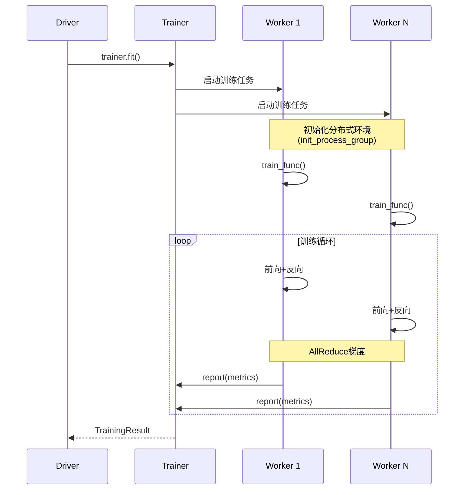

# Ray-07-Train模块（分布式训练）

## 模块概览

Ray Train是Ray的分布式机器学习训练库，提供统一API支持各类ML框架。

### 核心能力

- **多框架支持**：PyTorch、TensorFlow、XGBoost、LightGBM、Horovod
- **分布式训练**：数据并行、模型并行
- **容错机制**：自动checkpoint、失败重试
- **资源管理**：GPU调度、混合精度训练
- **与Ray生态集成**：无缝对接Ray Data、Ray Tune

## 关键API

### PyTorch分布式训练

```python
from ray.train.torch import TorchTrainer
from ray.train import ScalingConfig

def train_func(config):
    import torch
    import torch.nn as nn
    from torch.utils.data import DataLoader
    from ray.train.torch import prepare_model, prepare_data_loader
    
    # 模型（自动包装DDP）
    model = nn.Linear(10, 1)
    model = prepare_model(model)
    
    # 数据（自动分片）
    train_dataset = get_dataset()
    train_loader = DataLoader(train_dataset, batch_size=32)
    train_loader = prepare_data_loader(train_loader)
    
    optimizer = torch.optim.SGD(model.parameters(), lr=0.01)
    
    for epoch in range(10):
        for batch in train_loader:
            optimizer.zero_grad()
            loss = model(batch)
            loss.backward()
            optimizer.step()
        
        # 报告指标
        train.report({"loss": loss.item()})

# 配置训练
trainer = TorchTrainer(
    train_func,
    scaling_config=ScalingConfig(
        num_workers=4,  # 4个Worker
        use_gpu=True
    )
)

# 执行训练
result = trainer.fit()
print(result.metrics)
```

### 与Ray Data集成

```python
import ray
from ray.train.torch import TorchTrainer

# 加载数据
train_ds = ray.data.read_parquet("s3://data/train/")

def train_func(config):
    # 获取数据分片
    train_ds = train.get_dataset_shard("train")
    
    for epoch in range(10):
        for batch in train_ds.iter_batches(batch_size=32):
            # 训练逻辑
            pass

trainer = TorchTrainer(
    train_func,
    datasets={"train": train_ds},
    scaling_config=ScalingConfig(num_workers=4)
)
```

### Checkpoint机制

```python
def train_func(config):
    model = create_model()
    
    for epoch in range(100):
        train_one_epoch(model)
        
        # 定期保存checkpoint
        if epoch % 10 == 0:
            train.report(
                {"epoch": epoch},
                checkpoint=Checkpoint.from_dict({
                    "model_state": model.state_dict(),
                    "epoch": epoch
                })
            )

# 从checkpoint恢复
trainer = TorchTrainer(
    train_func,
    resume_from_checkpoint=previous_checkpoint
)
```

## 架构设计

### Worker协调



### 容错处理

- **Worker失败**：自动重启，从最新checkpoint恢复
- **Checkpoint**：定期保存到持久化存储
- **弹性训练**：支持动态增删Worker

## 最佳实践

### 1. 混合精度训练

```python
from torch.cuda.amp import autocast, GradScaler

def train_func(config):
    model = prepare_model(model)
    scaler = GradScaler()
    
    for batch in dataloader:
        with autocast():
            loss = model(batch)
        
        scaler.scale(loss).backward()
        scaler.step(optimizer)
        scaler.update()
```

### 2. 梯度累积

```python
def train_func(config):
    accumulation_steps = 4
    
    for i, batch in enumerate(dataloader):
        loss = model(batch) / accumulation_steps
        loss.backward()
        
        if (i + 1) % accumulation_steps == 0:
            optimizer.step()
            optimizer.zero_grad()
```

### 3. 性能调优

```python
trainer = TorchTrainer(
    train_func,
    scaling_config=ScalingConfig(
        num_workers=8,
        use_gpu=True,
        resources_per_worker={"CPU": 4, "GPU": 1}
    ),
    run_config=RunConfig(
        checkpoint_config=CheckpointConfig(
            num_to_keep=3,  # 保留3个checkpoint
            checkpoint_frequency=10  # 每10轮保存
        )
    )
)
```

## 总结

Ray Train统一了分布式训练接口，关键特性：

1. **框架无关**：支持主流ML框架
2. **易用性**：最小代码改动即可分布式
3. **容错性**：自动checkpoint和恢复
4. **扩展性**：从单机到数千GPU

