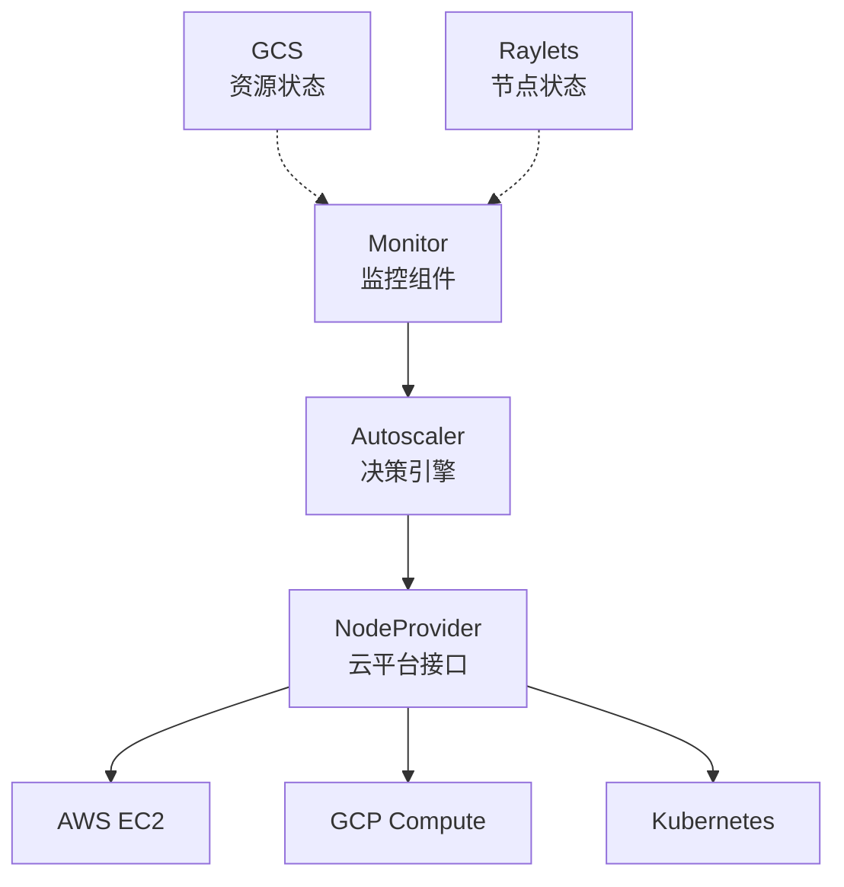

# Ray-09-Autoscaler模块（自动扩缩容）

## 模块概览

Ray Autoscaler根据集群负载自动增删节点，实现弹性集群。

### 核心能力

- **需求驱动扩容**：根据pending任务数量扩容
- **空闲节点回收**：自动删除空闲节点
- **云平台集成**：AWS、GCP、Azure、Kubernetes
- **节点类型管理**：支持异构节点（CPU/GPU混合）

## 架构设计



## 配置文件

```yaml
# cluster.yaml
cluster_name: my-ray-cluster

max_workers: 10  # 最大Worker节点数

provider:
  type: aws
  region: us-west-2
  availability_zone: us-west-2a

auth:
  ssh_user: ubuntu
  ssh_private_key: ~/.ssh/ray-autoscaler.pem

# 节点类型
available_node_types:
  ray.head.default:
    resources: {"CPU": 8}
    node_config:
      InstanceType: m5.2xlarge
      ImageId: ami-0a2363a9cff180a64
  
  ray.worker.cpu:
    min_workers: 0
    max_workers: 5
    resources: {"CPU": 16}
    node_config:
      InstanceType: m5.4xlarge
      ImageId: ami-0a2363a9cff180a64
  
  ray.worker.gpu:
    min_workers: 0
    max_workers: 5
    resources: {"CPU": 8, "GPU": 4}
    node_config:
      InstanceType: p3.2xlarge
      ImageId: ami-0a2363a9cff180a64

# 初始化命令
head_setup_commands:
  - pip install ray[all]

worker_setup_commands:
  - pip install ray[all]
```

## 扩缩容策略

### 扩容触发条件

1. **任务队列积压**：pending任务数 > 阈值
2. **资源不足**：无法调度的任务
3. **PlacementGroup**：PG无法满足

### 缩容触发条件

1. **节点空闲**：无运行任务超过idle_timeout
2. **资源过剩**：节点利用率低
3. **手动触发**：ray down命令

## 使用方式

### 启动集群

```bash
# 启动集群
ray up cluster.yaml

# 连接到Head节点
ray attach cluster.yaml

# 提交任务
ray submit cluster.yaml script.py

# 查看状态
ray status

# 停止集群
ray down cluster.yaml
```

### Kubernetes部署

```yaml
# ray-cluster.yaml
apiVersion: ray.io/v1
kind: RayCluster
metadata:
  name: ray-cluster
spec:
  rayVersion: '2.9.0'
  headGroupSpec:
    replicas: 1
    rayStartParams:
      dashboard-host: '0.0.0.0'
    template:
      spec:
        containers:
        - name: ray-head
          image: rayproject/ray:2.9.0
          resources:
            limits:
              cpu: "4"
              memory: "16G"
  
  workerGroupSpecs:
  - groupName: worker-group
    replicas: 3
    minReplicas: 1
    maxReplicas: 10
    rayStartParams: {}
    template:
      spec:
        containers:
        - name: ray-worker
          image: rayproject/ray:2.9.0
          resources:
            limits:
              cpu: "8"
              memory: "32G"
              nvidia.com/gpu: "1"
```

```bash
kubectl apply -f ray-cluster.yaml
```

## 监控与调试

### 查看Autoscaler日志

```bash
# Head节点上
tail -f /tmp/ray/session_latest/logs/monitor.log
tail -f /tmp/ray/session_latest/logs/autoscaler.log
```

### 自定义指标

```python
import ray

# 设置自动扩缩容参数
ray.init(
    address="auto",
    _system_config={
        "autoscaling_upscaling_speed": 1.0,  # 扩容速度
        "autoscaling_downscaling_speed": 1.0  # 缩容速度
    }
)
```

## 最佳实践

### 1. 节点类型设计

```yaml
# 区分CPU密集和GPU密集任务
available_node_types:
  cpu-intensive:
    resources: {"CPU": 32}
    node_config:
      InstanceType: c5.9xlarge
  
  gpu-inference:
    resources: {"CPU": 16, "GPU": 4}
    node_config:
      InstanceType: p3.2xlarge
  
  gpu-training:
    resources: {"CPU": 32, "GPU": 8}
    node_config:
      InstanceType: p3.8xlarge
```

### 2. 成本优化

```yaml
# 使用Spot实例
worker_node_config:
  InstanceMarketOptions:
    MarketType: spot
    SpotOptions:
      MaxPrice: "1.0"  # 最高价格
```

### 3. 快速启动

```yaml
# 使用自定义AMI预装依赖
node_config:
  ImageId: ami-custom-with-deps

# 减少setup_commands
worker_setup_commands: []
```

## 总结

Ray Autoscaler实现弹性计算集群，关键特性：

1. **自动化**：无需手动管理节点
2. **成本优化**：按需分配资源
3. **多云支持**：AWS、GCP、Azure、K8s
4. **异构调度**：CPU/GPU混合调度
5. **容错性**：节点失败自动恢复

