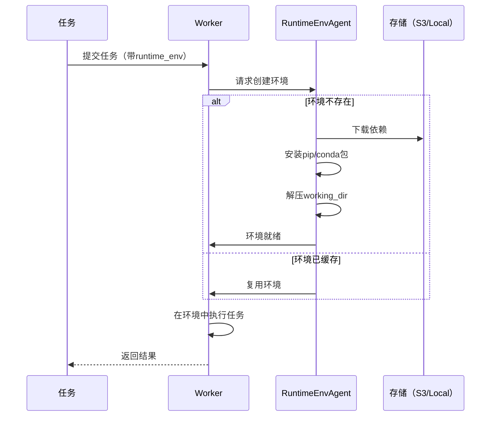

# Ray-10-RuntimeEnv模块（运行时环境）

## 模块概览

Runtime Environment (Runtime Env) 允许为任务和Actor指定独立的Python依赖和环境配置。

### 核心能力

- **依赖隔离**：不同任务使用不同Python包版本
- **环境复现**：确保本地和远程环境一致
- **动态配置**：无需重启集群即可更新依赖
- **多种来源**：pip、conda、容器、working_dir

## 关键API

### 基础使用

```python
import ray

# 为整个Job指定runtime_env
ray.init(runtime_env={
    "pip": ["requests==2.28.0", "pandas==1.5.0"]
})

# 为单个任务指定
@ray.remote(runtime_env={"pip": ["numpy==1.23.0"]})
def task():
    import numpy as np
    return np.version.version

# 为Actor指定
@ray.remote(runtime_env={
    "pip": ["torch==2.0.0"],
    "env_vars": {"OMP_NUM_THREADS": "1"}
})
class MyActor:
    def run(self):
        import torch
        return torch.__version__
```

### Runtime Env配置项

```python
runtime_env = {
    # Python依赖
    "pip": [
        "requests==2.28.0",
        "pandas==1.5.0"
    ],
    
    # Conda环境
    "conda": {
        "channels": ["conda-forge"],
        "dependencies": ["pytorch==1.12.0"]
    },
    
    # 工作目录（代码）
    "working_dir": "s3://bucket/code.zip",
    
    # 环境变量
    "env_vars": {
        "CUDA_VISIBLE_DEVICES": "0,1",
        "OMP_NUM_THREADS": "4"
    },
    
    # 容器镜像
    "container": {
        "image": "rayproject/ray-ml:2.9.0-gpu",
        "worker_path": "/ray/python/ray/workers/default_worker.py"
    },
    
    # 排除文件
    "excludes": ["*.pyc", "__pycache__", ".git"]
}
```

### 使用working_dir

```python
# 本地目录
runtime_env = {
    "working_dir": "/path/to/local/dir"
}

# 远程URI
runtime_env = {
    "working_dir": "s3://bucket/code.zip"
}

# Git仓库
runtime_env = {
    "working_dir": "https://github.com/user/repo.git",
    "git_branch": "main"
}
```

## 架构设计



### RuntimeEnvAgent

每个节点运行一个Agent，负责：

1. **环境创建**：安装pip/conda包、下载代码
2. **环境缓存**：复用相同环境，避免重复创建
3. **环境清理**：删除过期环境
4. **资源管理**：限制环境创建并发数

## 使用场景

### 1. 多版本依赖隔离

```python
# 任务A使用TensorFlow 1.x
@ray.remote(runtime_env={"pip": ["tensorflow==1.15.5"]})
def train_model_v1():
    import tensorflow as tf
    # TF 1.x代码
    pass

# 任务B使用TensorFlow 2.x
@ray.remote(runtime_env={"pip": ["tensorflow==2.13.0"]})
def train_model_v2():
    import tensorflow as tf
    # TF 2.x代码
    pass
```

### 2. 动态部署代码

```python
# 开发环境
runtime_env_dev = {
    "working_dir": "s3://bucket/dev/code-v1.zip"
}

# 生产环境
runtime_env_prod = {
    "working_dir": "s3://bucket/prod/code-v2.zip"
}

# 无需重启集群，切换代码版本
@ray.remote(runtime_env=runtime_env_prod)
def process():
    # 使用最新代码
    pass
```

### 3. Ray Serve模型部署

```python
from ray import serve

@serve.deployment(
    runtime_env={
        "pip": ["transformers==4.30.0", "torch==2.0.1"],
        "working_dir": "s3://models/bert/"
    }
)
class BertModel:
    def __init__(self):
        from transformers import BertModel
        self.model = BertModel.from_pretrained(".")
    
    def __call__(self, text):
        return self.model(text)
```

## 性能优化

### 1. 环境缓存

```python
# 相同runtime_env会复用环境
runtime_env = {"pip": ["numpy==1.23.0"]}

@ray.remote(runtime_env=runtime_env)
def task1():
    pass

@ray.remote(runtime_env=runtime_env)  # 复用环境
def task2():
    pass
```

### 2. 预热环境

```python
# 集群启动时预装环境
ray up cluster.yaml --runtime-env '{"pip": ["torch", "transformers"]}'
```

### 3. 使用容器

```python
# 容器启动更快（预装依赖）
runtime_env = {
    "container": {
        "image": "my-custom-image:latest"
    }
}
```

## 调试与监控

### 查看环境状态

```python
import ray

# 查看所有runtime_env
from ray._private.runtime_env import get_runtime_env_info
info = get_runtime_env_info()
print(info)
```

### 日志

```bash
# RuntimeEnvAgent日志
tail -f /tmp/ray/session_latest/logs/runtime_env_agent.log
```

### 常见问题

1. **环境创建超时**
   ```python
   # 增加超时时间
   ray.init(
       _system_config={
           "runtime_env_setup_timeout_seconds": 600
       }
   )
   ```

2. **依赖冲突**
   ```python
   # 使用虚拟环境隔离
   runtime_env = {
       "pip": {
           "packages": ["package==version"],
           "pip_check": False  # 跳过依赖检查
       }
   }
   ```

## 最佳实践

### 1. 固定版本

```python
# 好：固定版本
runtime_env = {"pip": ["numpy==1.23.0"]}

# 不好：不固定版本
runtime_env = {"pip": ["numpy"]}
```

### 2. 最小化依赖

```python
# 只安装必要的包
runtime_env = {
    "pip": ["numpy", "pandas"],  # 不要安装整个ML框架
}
```

### 3. 使用requirements.txt

```python
runtime_env = {
    "pip": {
        "packages": [],
        "pip_version": "==23.1.2",
        "pip_check": False
    },
    "working_dir": ".",  # 包含requirements.txt
}
```

## 总结

Runtime Env是Ray的环境隔离机制，关键特性：

1. **灵活性**：支持pip、conda、容器等多种方式
2. **隔离性**：不同任务使用不同环境
3. **可复现性**：确保环境一致
4. **性能**：环境缓存和复用
5. **易用性**：声明式配置，自动管理

