# RocksDB-01-DB模块

## 模块概览

## 1. 模块职责与边界

### 核心职责
DB模块是RocksDB的核心引擎模块，负责：

- **数据库生命周期管理**：数据库的创建、打开、关闭和销毁
- **基础CRUD操作**：Put、Get、Delete、Merge等基本键值操作
- **事务支持**：提供ACID事务保证和多版本并发控制
- **列族管理**：支持多个命名空间的数据隔离和独立配置
- **后台任务调度**：Flush、Compaction、统计收集等后台任务的协调

### 输入输出接口
- **输入**：
  - 客户端API调用（Put/Get/Delete等）
  - 配置选项（DBOptions、ColumnFamilyOptions）
  - Write Batch批量操作
  - 读写选项（ReadOptions、WriteOptions）
- **输出**：
  - 操作状态（Status）
  - 查询结果（PinnableSlice、迭代器）
  - 统计信息和性能指标
  - 事件通知（EventListener）

### 上下游依赖关系
- **上游调用方**：
  - 客户端应用程序
  - 事务模块（Transaction）
  - 工具模块（Tools）
- **下游依赖**：
  - MemTable模块：内存数据存储
  - Table模块：SST文件读写
  - Cache模块：数据块缓存
  - WAL模块：预写日志
  - File模块：文件系统操作
  - Environment模块：系统环境抽象

### 生命周期管理
1. **初始化阶段**：
   - 解析配置选项
   - 初始化内部组件（VersionSet、MemTable、Cache等）
   - 恢复WAL日志
   - 启动后台线程
2. **运行阶段**：
   - 处理读写请求
   - 执行后台任务
   - 维护统计信息
3. **关闭阶段**：
   - 停止后台线程
   - Flush未持久化数据
   - 释放资源

## 2. 模块架构图

```mermaid
flowchart TB
    subgraph "DB Module Architecture"
        subgraph "API Layer"
            DBAPI[DB API Interface]
            CFAPI[Column Family API]
            TxnAPI[Transaction API]
            IterAPI[Iterator API]
        end
        
        subgraph "Core Implementation"
            DBImpl[DBImpl Core]
            subgraph "Write Path"
                WriteBatch[Write Batch]
                WriteThread[Write Thread]
                WALWriter[WAL Writer]
            end
            
            subgraph "Read Path"
                GetImpl[Get Implementation]
                IterImpl[Iterator Implementation]
                SnapshotMgr[Snapshot Manager]
            end
            
            subgraph "Background Tasks"
                FlushScheduler[Flush Scheduler]
                CompactionScheduler[Compaction Scheduler]
                PeriodicTasks[Periodic Tasks]
            end
        end
        
        subgraph "Storage Management"
            VersionSet[Version Set]
            ColumnFamilySet[Column Family Set]
            MemTableList[MemTable List]
            TableCache[Table Cache]
        end
        
        subgraph "System Integration"
            ErrorHandler[Error Handler]
            EventLogger[Event Logger]
            Statistics[Statistics]
            InfoLog[Info Log]
        end
    end
    
    subgraph "External Dependencies"
        MemTable[MemTable Module]
        Table[Table Module]
        Cache[Cache Module]
        FileSystem[File System]
        Environment[Environment]
    end
    
    %% API to Implementation
    DBAPI --> DBImpl
    CFAPI --> DBImpl
    TxnAPI --> DBImpl
    IterAPI --> DBImpl
    
    %% Core Implementation Connections
    DBImpl --> WriteBatch
    DBImpl --> GetImpl
    DBImpl --> FlushScheduler
    WriteBatch --> WriteThread
    WriteThread --> WALWriter
    GetImpl --> SnapshotMgr
    
    %% Storage Management
    DBImpl --> VersionSet
    DBImpl --> ColumnFamilySet
    VersionSet --> MemTableList
    VersionSet --> TableCache
    
    %% System Integration
    DBImpl --> ErrorHandler
    DBImpl --> EventLogger
    DBImpl --> Statistics
    DBImpl --> InfoLog
    
    %% External Dependencies
    DBImpl --> MemTable
    DBImpl --> Table
    DBImpl --> Cache
    DBImpl --> FileSystem
    DBImpl --> Environment
    
    classDef apiClass fill:#e3f2fd
    classDef coreClass fill:#f3e5f5
    classDef storageClass fill:#e8f5e8
    classDef systemClass fill:#fff3e0
    classDef externalClass fill:#fce4ec
    
    class DBAPI,CFAPI,TxnAPI,IterAPI apiClass
    class DBImpl,WriteBatch,WriteThread,WALWriter,GetImpl,IterImpl,SnapshotMgr,FlushScheduler,CompactionScheduler,PeriodicTasks coreClass
    class VersionSet,ColumnFamilySet,MemTableList,TableCache storageClass
    class ErrorHandler,EventLogger,Statistics,InfoLog systemClass
    class MemTable,Table,Cache,FileSystem,Environment externalClass
```

### 架构图详细说明

#### 边界条件与约束
- **并发边界**：支持多读单写，通过MVCC实现读写分离
- **内存边界**：通过Write Buffer Manager控制内存使用上限
- **文件句柄边界**：通过max_open_files限制同时打开的文件数
- **事务边界**：支持跨列族的原子事务，通过两阶段提交保证一致性

#### 异常路径与回退
- **写入失败**：WAL写入失败时回滚操作，返回错误状态
- **内存不足**：触发强制Flush或阻塞写入，防止OOM
- **磁盘满**：切换到只读模式，停止写入操作
- **文件损坏**：通过Repair功能尝试恢复，或从备份恢复

#### 性能要点
- **写入性能**：通过Write Batch聚合操作，减少WAL同步次数
- **读取性能**：通过Block Cache和Bloom Filter加速查找
- **并发性能**：读操作无锁，写操作通过Write Thread串行化
- **后台性能**：多线程Compaction，异步Flush操作

#### 扩展点设计
- **自定义比较器**：支持用户定义的键排序规则
- **合并操作符**：支持自定义的值合并逻辑
- **事件监听器**：提供数据库事件的回调机制
- **统计收集器**：支持自定义统计信息收集

## 3. 核心算法与流程

### 写入流程算法

```cpp
// 写入操作的核心流程
Status DBImpl::WriteImpl(const WriteOptions& write_options,
                        WriteBatch* my_batch, WriteCallback* callback) {
    // 1. 预处理：检查参数有效性和数据库状态
    if (my_batch == nullptr) {
        return Status::InvalidArgument("Batch is nullptr");
    }
    
    // 2. 加入写入组：通过Write Thread实现批量写入优化
    WriteThread::Writer w(write_options, my_batch, callback);
    write_thread_.JoinBatchGroup(&w);
    
    if (w.state == WriteThread::STATE_GROUP_LEADER) {
        // 3. 作为组长执行批量写入
        WriteThread::WriteGroup write_group;
        write_thread_.EnterAsBatchGroupLeader(&w, &write_group);
        
        // 4. 预写日志：保证持久性
        Status status = WriteToWAL(write_group);
        if (!status.ok()) {
            write_thread_.ExitAsBatchGroupLeader(write_group, status);
            return status;
        }
        
        // 5. 写入MemTable：更新内存数据
        status = WriteBatchInternal::InsertInto(
            write_group, sequence_, column_family_memtables_.get());
        
        // 6. 完成写入组
        write_thread_.ExitAsBatchGroupLeader(write_group, status);
        return status;
    } else {
        // 7. 等待组长完成写入
        return w.FinalStatus();
    }
}
```

**算法说明**：

- **目的**：实现高效的批量写入，减少WAL同步开销
- **输入**：WriteOptions（写入选项）、WriteBatch（批量操作）
- **输出**：Status（操作状态）
- **复杂度**：O(1)加入写入组，O(n)批量写入n个操作
- **优化点**：Write Group Leader模式，一次WAL同步处理多个写入

### 读取流程算法

```cpp
// 读取操作的核心流程
Status DBImpl::GetImpl(const ReadOptions& read_options,
                      ColumnFamilyHandle* column_family,
                      const Slice& key, PinnableSlice* value) {
    // 1. 获取读取快照：确定读取的数据版本
    SequenceNumber snapshot_seq = GetSequenceNumber(read_options);
    
    // 2. 构建LookupKey：包含用户键和序列号
    LookupKey lkey(key, snapshot_seq);
    
    // 3. 查找MemTable：优先查找内存中的最新数据
    bool found_final_value = false;
    Status s = mem_->Get(lkey, value, &found_final_value);
    if (found_final_value) {
        return s;
    }
    
    // 4. 查找Immutable MemTable：查找正在Flush的内存表
    for (auto* imm_mem : imm_memtables) {
        s = imm_mem->Get(lkey, value, &found_final_value);
        if (found_final_value) {
            return s;
        }
    }
    
    // 5. 查找SST文件：按层级顺序查找磁盘文件
    Version* current = versions_->current();
    s = current->Get(read_options, lkey, value, &found_final_value);
    
    return s;
}
```

**算法说明**：

- **目的**：实现MVCC读取，保证读取一致性
- **输入**：ReadOptions（读取选项）、key（查找键）
- **输出**：PinnableSlice（查找结果）、Status（操作状态）
- **复杂度**：O(log n)内存查找 + O(log m)磁盘查找
- **查找顺序**：MemTable → Immutable MemTable → SST Files（L0→L1→...→LN）

### Compaction调度算法

```cpp
// Compaction调度的核心逻辑
void DBImpl::MaybeScheduleFlushOrCompaction() {
    // 1. 检查是否需要Flush
    for (auto cfd : *versions_->GetColumnFamilySet()) {
        if (cfd->imm()->IsFlushPending()) {
            ScheduleFlushJob(cfd);
        }
    }
    
    // 2. 检查是否需要Compaction
    for (auto cfd : *versions_->GetColumnFamilySet()) {
        if (cfd->NeedsCompaction()) {
            Compaction* c = cfd->PickCompaction();
            if (c != nullptr) {
                ScheduleCompactionJob(cfd, c);
            }
        }
    }
}

// Compaction选择策略
Compaction* LevelCompactionPicker::PickCompaction() {
    // 1. 计算每层的得分
    for (int level = 0; level < num_levels_; level++) {
        double score = ComputeCompactionScore(level);
        if (score > 1.0) {
            // 2. 选择得分最高的层进行Compaction
            return PickCompactionBySize(level);
        }
    }
    return nullptr;
}
```

**算法说明**：

- **目的**：维护LSM树结构，优化读写性能
- **策略**：基于层级大小和文件数量的得分算法
- **触发条件**：层级大小超过阈值或文件数量过多
- **优化目标**：平衡写放大、读放大和空间放大

## 4. 配置与可观测性

### 关键配置项

```cpp
struct DBOptions {
    // 基础配置
    bool create_if_missing = false;           // 数据库不存在时是否创建
    bool error_if_exists = false;             // 数据库已存在时是否报错
    
    // 并发控制
    int max_background_jobs = 2;              // 后台任务线程数
    int max_subcompactions = 1;               // 子压缩任务数
    bool allow_concurrent_memtable_write = true; // 并发MemTable写入
    
    // 内存管理
    std::shared_ptr<WriteBufferManager> write_buffer_manager; // 统一内存管理
    size_t db_write_buffer_size = 0;          // 数据库总写缓冲区大小
    
    // WAL配置
    bool avoid_flush_during_recovery = false; // 恢复时避免Flush
    bool avoid_flush_during_shutdown = false; // 关闭时避免Flush
    size_t wal_recovery_mode = WALRecoveryMode::kPointInTimeRecovery;
    
    // 文件管理
    int max_open_files = -1;                  // 最大打开文件数
    uint64_t max_file_opening_threads = 16;   // 文件打开线程数
    
    // 统计与监控
    bool enable_statistics = false;           // 启用统计收集
    std::shared_ptr<Statistics> statistics;   // 统计信息收集器
    std::vector<std::shared_ptr<EventListener>> listeners; // 事件监听器
};

struct ColumnFamilyOptions {
    // MemTable配置
    size_t write_buffer_size = 64 << 20;      // MemTable大小（64MB）
    int max_write_buffer_number = 2;          // 最大MemTable数量
    int min_write_buffer_number_to_merge = 1; // 最小合并MemTable数量
    
    // Compaction配置
    int level0_file_num_compaction_trigger = 4;    // L0文件数触发压缩
    int level0_slowdown_writes_trigger = 20;       // L0文件数减缓写入
    int level0_stop_writes_trigger = 36;           // L0文件数停止写入
    uint64_t target_file_size_base = 64 << 20;     // 目标文件大小
    uint64_t max_bytes_for_level_base = 256 << 20; // L1层最大大小
    
    // 缓存配置
    std::shared_ptr<Cache> block_cache;            // 数据块缓存
    size_t block_cache_compressed_size = 0;        // 压缩块缓存大小
    
    // 过滤器配置
    std::shared_ptr<const FilterPolicy> filter_policy; // 过滤器策略
    bool optimize_filters_for_hits = false;       // 为命中优化过滤器
};
```

### 性能指标监控

```cpp
// 核心性能指标
enum Tickers : uint32_t {
    // 基础操作统计
    NUMBER_DB_SEEK,                    // Seek操作次数
    NUMBER_DB_NEXT,                    // Next操作次数
    NUMBER_DB_PREV,                    // Prev操作次数
    NUMBER_DB_SEEK_FOUND,              // Seek命中次数
    NUMBER_DB_NEXT_FOUND,              // Next命中次数
    
    // 读写统计
    BYTES_READ,                        // 读取字节数
    BYTES_WRITTEN,                     // 写入字节数
    NUMBER_KEYS_WRITTEN,               // 写入键数量
    NUMBER_KEYS_READ,                  // 读取键数量
    NUMBER_KEYS_UPDATED,               // 更新键数量
    
    // Compaction统计
    COMPACT_READ_BYTES,                // Compaction读取字节数
    COMPACT_WRITE_BYTES,               // Compaction写入字节数
    NUMBER_SUPERVERSION_ACQUIRES,      // SuperVersion获取次数
    NUMBER_SUPERVERSION_RELEASES,      // SuperVersion释放次数
    
    // 缓存统计
    BLOCK_CACHE_HIT,                   // 块缓存命中次数
    BLOCK_CACHE_MISS,                  // 块缓存未命中次数
    BLOCK_CACHE_ADD,                   // 块缓存添加次数
    BLOCK_CACHE_INDEX_HIT,             // 索引缓存命中次数
    BLOCK_CACHE_FILTER_HIT,            // 过滤器缓存命中次数
    
    // WAL统计
    WAL_FILE_SYNCED,                   // WAL文件同步次数
    WAL_FILE_BYTES,                    // WAL文件字节数
    
    // 错误统计
    NUMBER_DB_SEEK_ERROR,              // Seek错误次数
    NUMBER_DB_NEXT_ERROR,              // Next错误次数
    NUMBER_DB_PREV_ERROR,              // Prev错误次数
};

// 延迟统计
enum Histograms : uint32_t {
    DB_GET,                            // Get操作延迟
    DB_WRITE,                          // Write操作延迟
    COMPACTION_TIME,                   // Compaction耗时
    SUBCOMPACTION_SETUP_TIME,          // 子压缩设置耗时
    TABLE_SYNC_MICROS,                 // 表同步延迟
    COMPACTION_OUTFILE_SYNC_MICROS,    // Compaction输出文件同步延迟
    WAL_FILE_SYNC_MICROS,              // WAL文件同步延迟
    MANIFEST_FILE_SYNC_MICROS,         // Manifest文件同步延迟
    
    // 读取路径延迟
    TABLE_OPEN_IO_MICROS,              // 表文件打开IO延迟
    DB_MULTIGET,                       // MultiGet操作延迟
    READ_BLOCK_COMPACTION_MICROS,      // 读取块压缩延迟
    READ_BLOCK_GET_MICROS,             // 读取块Get延迟
    
    // 写入路径延迟
    WRITE_RAW_BLOCK_MICROS,            // 写入原始块延迟
    NUM_FILES_IN_SINGLE_COMPACTION,    // 单次压缩文件数
    DB_SEEK,                           // Seek操作延迟
    WRITE_STALL,                       // 写入停顿时间
};
```

### 监控最佳实践

```cpp
// 统计信息收集示例
void MonitorDBPerformance(DB* db) {
    std::string stats_string;
    
    // 1. 获取基础统计信息
    db->GetProperty("rocksdb.stats", &stats_string);
    
    // 2. 获取特定指标
    uint64_t cache_hit = db->GetOptions().statistics->getTickerCount(BLOCK_CACHE_HIT);
    uint64_t cache_miss = db->GetOptions().statistics->getTickerCount(BLOCK_CACHE_MISS);
    double cache_hit_rate = static_cast<double>(cache_hit) / (cache_hit + cache_miss);
    
    // 3. 获取延迟分布
    HistogramData get_latency;
    db->GetOptions().statistics->histogramData(DB_GET, &get_latency);
    
    // 4. 输出关键指标
    printf("Cache Hit Rate: %.2f%%\n", cache_hit_rate * 100);
    printf("Get P99 Latency: %.2f ms\n", get_latency.percentile99 / 1000.0);
    printf("Get Average Latency: %.2f ms\n", get_latency.average / 1000.0);
}
```

**监控维度说明**：

- **操作维度**：按Get/Put/Delete/Scan等操作类型分类统计
- **列族维度**：每个列族独立统计，便于定位性能瓶颈
- **时间维度**：支持历史统计数据查询和趋势分析
- **错误维度**：统计各类错误的发生频率和分布

**关键阈值建议**：

- **缓存命中率**：Block Cache命中率应保持在95%以上
- **写入停顿**：Write Stall时间应控制在100ms以内
- **Compaction延迟**：单次Compaction应控制在10s以内
- **文件数量**：L0层文件数应控制在10个以内

---

## API接口

## 1. API概览

DB模块提供了RocksDB的核心API接口，包括基础的CRUD操作、事务支持、批量操作和迭代器等功能。所有API都通过统一的Status返回机制处理错误状态。

### API分类
- **基础操作API**：Put、Get、Delete、Merge等单键操作
- **批量操作API**：WriteBatch、MultiGet等批量处理
- **迭代器API**：NewIterator、Seek、Next等遍历操作
- **事务API**：BeginTransaction、Commit、Rollback等事务控制
- **管理API**：Open、Close、Flush、CompactRange等数据库管理

## 2. 基础操作API

### 2.1 Put操作

#### 基本信息
- **名称**：`Put`
- **协议/方法**：C++ API `Status Put(const WriteOptions&, ColumnFamilyHandle*, const Slice&, const Slice&)`
- **幂等性**：否（重复Put会覆盖旧值，但序列号递增）

#### 请求结构体

```cpp
// Put操作的输入参数
struct PutRequest {
    WriteOptions write_options;        // 写入选项
    ColumnFamilyHandle* column_family; // 列族句柄，nullptr表示默认列族
    Slice key;                        // 键，任意字节序列
    Slice value;                      // 值，任意字节序列
};

// WriteOptions结构体定义
struct WriteOptions {
    bool sync = false;                // 是否同步写入WAL
    bool disableWAL = false;          // 是否禁用WAL
    bool ignore_missing_column_families = false; // 忽略不存在的列族
    bool no_slowdown = false;         // 不因写入停顿而阻塞
    bool low_pri = false;             // 低优先级写入
    uint64_t memtable_insert_hint_per_batch = 0; // MemTable插入提示
    Env::IOPriority rate_limiter_priority = Env::IO_TOTAL; // 限流优先级
    uint8_t protection_bytes_per_key = 0; // 每个键的保护字节数
};
```

| 字段 | 类型 | 必填 | 默认 | 约束 | 说明 |
|------|------|------|------|------|------|
| write_options | WriteOptions | 是 | 默认构造 | - | 写入配置选项 |
| column_family | ColumnFamilyHandle* | 否 | nullptr | 有效句柄 | 目标列族，nullptr表示默认列族 |
| key | Slice | 是 | - | 长度>0 | 要写入的键 |
| value | Slice | 是 | - | - | 要写入的值，可以为空 |

#### 响应结构体

```cpp
// Put操作的返回结果
class Status {
public:
    bool ok() const;                  // 操作是否成功
    bool IsNotFound() const;          // 是否未找到
    bool IsCorruption() const;        // 是否数据损坏
    bool IsNotSupported() const;      // 是否不支持
    bool IsInvalidArgument() const;   // 是否参数无效
    bool IsIOError() const;           // 是否IO错误
    std::string ToString() const;     // 获取错误描述
    
private:
    Code code_;                       // 错误码
    SubCode subcode_;                 // 子错误码
    std::unique_ptr<Slice> msg_;      // 错误消息
};
```

| 字段 | 类型 | 必填 | 默认 | 约束 | 说明 |
|------|------|------|------|------|------|
| code_ | Code | 是 | kOk | 枚举值 | 主要错误类型 |
| subcode_ | SubCode | 否 | kNone | 枚举值 | 详细错误类型 |
| msg_ | std::unique_ptr<Slice> | 否 | nullptr | - | 错误详细信息 |

#### 入口函数与关键代码

```cpp
// DBImpl中Put操作的入口函数
Status DBImpl::Put(const WriteOptions& o, ColumnFamilyHandle* column_family,
                   const Slice& key, const Slice& val) {
    // 1. 时间戳检查：验证列族是否配置了时间戳
    const Status s = FailIfCfHasTs(column_family);
    if (!s.ok()) {
        return s;
    }
    
    // 2. 调用基类Put方法，创建WriteBatch并执行写入
    return DB::Put(o, column_family, key, val);
}

// DB基类中的Put实现
Status DB::Put(const WriteOptions& opt, ColumnFamilyHandle* column_family,
               const Slice& key, const Slice& value) {
    // 1. 创建WriteBatch：聚合单个Put操作
    WriteBatch batch(0 /* reserved_bytes */, 0 /* max_bytes */,
                     opt.protection_bytes_per_key, 0 /* default_cf_ts_sz */);
    
    // 2. 添加Put操作到批次中
    Status s = batch.Put(column_family, key, value);
    if (!s.ok()) {
        return s;
    }
    
    // 3. 执行批量写入
    return Write(opt, &batch);
}
```

#### 上层适配/调用链核心代码

```cpp
// Write方法的核心实现
Status DBImpl::Write(const WriteOptions& write_options, WriteBatch* my_batch) {
    Status s;
    
    // 1. 数据保护：更新保护信息
    if (write_options.protection_bytes_per_key > 0) {
        s = WriteBatchInternal::UpdateProtectionInfo(
            my_batch, write_options.protection_bytes_per_key);
    }
    
    // 2. 执行写入实现
    if (s.ok()) {
        s = WriteImpl(write_options, my_batch, /*callback=*/nullptr,
                      /*user_write_cb=*/nullptr, /*wal_used=*/nullptr);
    }
    
    return s;
}

// WriteImpl的核心逻辑（简化版）
Status DBImpl::WriteImpl(const WriteOptions& write_options, WriteBatch* my_batch,
                        WriteCallback* callback, UserWriteCallback* user_write_cb) {
    // 1. 参数验证
    if (my_batch == nullptr) {
        return Status::InvalidArgument("Batch is nullptr");
    }
    
    // 2. 创建Writer并加入写入组
    WriteThread::Writer w(write_options, my_batch, callback, user_write_cb);
    write_thread_.JoinBatchGroup(&w);
    
    // 3. 如果是组长，执行批量写入
    if (w.state == WriteThread::STATE_GROUP_LEADER) {
        WriteThread::WriteGroup write_group;
        write_thread_.EnterAsBatchGroupLeader(&w, &write_group);
        
        // 4. 写入WAL：保证持久性
        Status status = WriteToWAL(write_group, log_writer_.get());
        if (!status.ok()) {
            write_thread_.ExitAsBatchGroupLeader(write_group, status);
            return status;
        }
        
        // 5. 写入MemTable：更新内存数据
        status = WriteBatchInternal::InsertInto(
            write_group, sequence_, column_family_memtables_.get());
        
        // 6. 完成写入组
        write_thread_.ExitAsBatchGroupLeader(write_group, status);
        return status;
    } else {
        // 7. 等待组长完成写入
        return w.FinalStatus();
    }
}
```

#### 时序图（请求→响应）

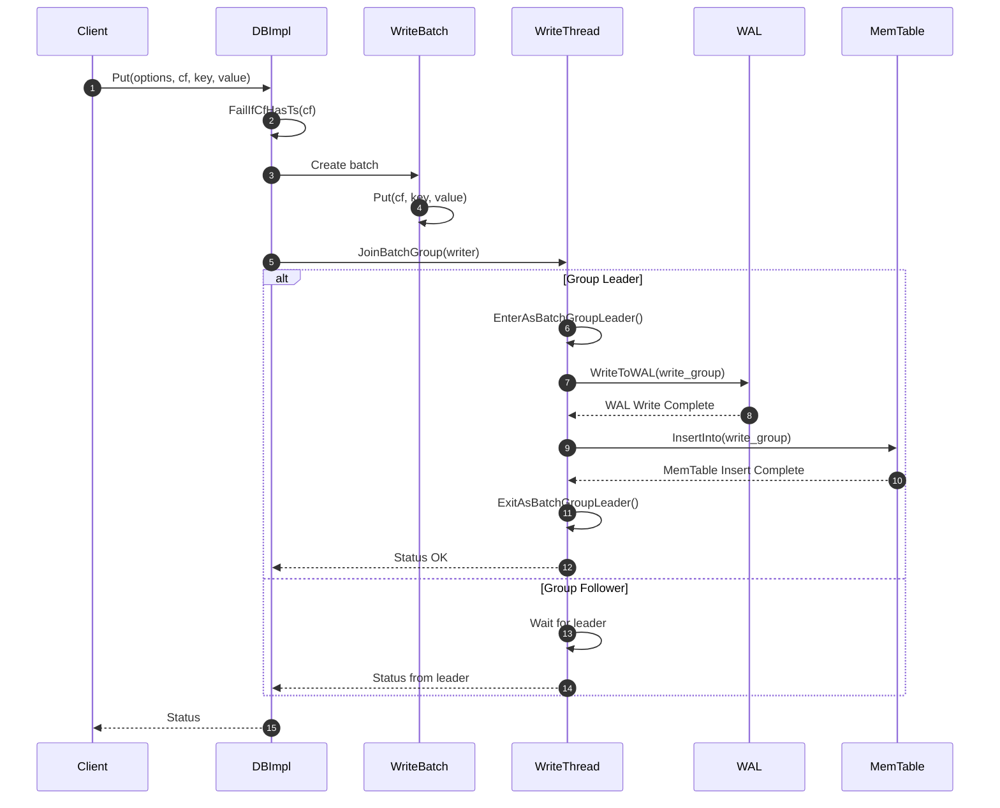

#### 异常/回退与性能要点

**异常处理**：

- **参数无效**：返回`Status::InvalidArgument`，不执行任何写入
- **列族不存在**：返回`Status::InvalidArgument`，检查列族有效性
- **WAL写入失败**：回滚整个写入组，返回IO错误状态
- **MemTable写入失败**：标记数据库为只读状态，触发错误处理流程
- **磁盘空间不足**：阻塞写入或返回`Status::IOError`

**回退策略**：

- **写入组失败**：组长负责回滚所有组员的操作状态
- **部分写入失败**：通过WAL恢复保证数据一致性
- **内存不足**：触发强制Flush释放内存空间

**性能要点**：

- **批量优化**：通过Write Group Leader模式减少WAL同步次数
- **并发控制**：支持并发MemTable写入，提升多线程性能
- **内存管理**：及时释放WriteBatch内存，避免内存泄漏
- **缓存友好**：按顺序写入MemTable，提升缓存命中率

### 2.2 Get操作

#### 基本信息
- **名称**：`Get`
- **协议/方法**：C++ API `Status Get(const ReadOptions&, ColumnFamilyHandle*, const Slice&, PinnableSlice*)`
- **幂等性**：是（读操作天然幂等，可安全重试）

#### 请求结构体

```cpp
// Get操作的输入参数
struct GetRequest {
    ReadOptions read_options;          // 读取选项
    ColumnFamilyHandle* column_family; // 列族句柄
    Slice key;                        // 要查找的键
};

// ReadOptions结构体定义
struct ReadOptions {
    bool verify_checksums = true;      // 验证校验和
    bool fill_cache = true;           // 是否填充缓存
    const Snapshot* snapshot = nullptr; // 读取快照
    ReadTier read_tier = kReadAllTier; // 读取层级
    bool tailing = false;             // 尾部读取模式
    bool managed = false;             // 托管迭代器
    bool total_order_seek = false;    // 全序Seek
    bool prefix_same_as_start = false; // 前缀优化
    bool pin_data = false;            // 固定数据
    bool background_purge_on_iterator_cleanup = false; // 后台清理
    uint64_t max_skippable_internal_keys = 0; // 最大可跳过内部键数
    bool ignore_range_deletions = false; // 忽略范围删除
    Env::IOActivity io_activity = Env::IOActivity::kUnknown; // IO活动类型
    std::shared_ptr<const Slice> timestamp; // 时间戳
    const Slice* iterate_lower_bound = nullptr; // 迭代下界
    const Slice* iterate_upper_bound = nullptr; // 迭代上界
};
```

| 字段 | 类型 | 必填 | 默认 | 约束 | 说明 |
|------|------|------|------|------|------|
| read_options | ReadOptions | 是 | 默认构造 | - | 读取配置选项 |
| column_family | ColumnFamilyHandle* | 否 | nullptr | 有效句柄 | 目标列族 |
| key | Slice | 是 | - | 长度>0 | 要查找的键 |

#### 响应结构体

```cpp
// Get操作的返回结果
struct GetResponse {
    Status status;                    // 操作状态
    PinnableSlice value;             // 查找到的值
    std::string timestamp;           // 时间戳（如果启用）
};

// PinnableSlice：支持零拷贝的值容器
class PinnableSlice : public Slice {
public:
    void Reset();                    // 重置内容
    void PinSlice(const Slice& slice, CleanupFunction cleanup); // 固定切片
    void PinSelf(const Slice& slice); // 固定自身
    bool IsPinned() const;           // 是否已固定
    
private:
    std::string buf_;                // 内部缓冲区
    void* pinned_ptr_;              // 固定指针
    size_t pinned_size_;            // 固定大小
    CleanupFunction cleanup_func_;   // 清理函数
};
```

| 字段 | 类型 | 必填 | 默认 | 约束 | 说明 |
|------|------|------|------|------|------|
| status | Status | 是 | - | - | 操作结果状态 |
| value | PinnableSlice | 是 | 空 | - | 查找结果，支持零拷贝 |
| timestamp | std::string | 否 | 空 | - | 记录时间戳 |

#### 入口函数与关键代码

```cpp
// DBImpl中Get操作的入口函数
Status DBImpl::Get(const ReadOptions& _read_options,
                   ColumnFamilyHandle* column_family, const Slice& key,
                   PinnableSlice* value, std::string* timestamp) {
    // 1. 参数验证：检查value指针有效性
    assert(value != nullptr);
    value->Reset();
    
    // 2. IO活动类型检查
    if (_read_options.io_activity != Env::IOActivity::kUnknown &&
        _read_options.io_activity != Env::IOActivity::kGet) {
        return Status::InvalidArgument(
            "Can only call Get with io_activity kUnknown or kGet");
    }
    
    // 3. 设置默认IO活动类型
    ReadOptions read_options(_read_options);
    if (read_options.io_activity == Env::IOActivity::kUnknown) {
        read_options.io_activity = Env::IOActivity::kGet;
    }
    
    // 4. 调用内部Get实现
    Status s = GetImpl(read_options, column_family, key, value, timestamp);
    return s;
}

// GetImpl的核心实现
Status DBImpl::GetImpl(const ReadOptions& read_options, const Slice& key,
                      GetImplOptions& get_impl_options) {
    // 1. 获取列族数据
    auto cfh = static_cast_with_check<ColumnFamilyHandleImpl>(
        get_impl_options.column_family);
    auto cfd = cfh->cfd();
    
    // 2. 获取SuperVersion：包含当前版本的所有组件
    SuperVersion* sv = GetAndRefSuperVersion(cfd);
    
    // 3. 确定读取快照
    SequenceNumber snapshot;
    if (read_options.snapshot != nullptr) {
        snapshot = read_options.snapshot->GetSequenceNumber();
    } else {
        snapshot = versions_->LastSequence();
    }
    
    // 4. 构建查找键
    LookupKey lkey(key, snapshot, read_options.timestamp);
    
    // 5. 查找MemTable
    bool skip_memtable = (read_options.read_tier == kPersistedTier &&
                         has_unpersisted_data_.load(std::memory_order_relaxed));
    bool done = false;
    Status s;
    
    if (!skip_memtable) {
        // 5.1 查找活跃MemTable
        if (sv->mem->Get(lkey, get_impl_options.value, /*columns=*/nullptr,
                        get_impl_options.timestamp, &s, &merge_context,
                        &max_covering_tombstone_seq, read_options)) {
            done = true;
            RecordTick(stats_, MEMTABLE_HIT);
        }
        // 5.2 查找不可变MemTable
        else if ((s.ok() || s.IsMergeInProgress()) &&
                 sv->imm->Get(lkey, get_impl_options.value, /*columns=*/nullptr,
                             get_impl_options.timestamp, &s, &merge_context,
                             &max_covering_tombstone_seq, read_options)) {
            done = true;
            RecordTick(stats_, MEMTABLE_HIT);
        }
    }
    
    // 6. 查找SST文件
    if (!done) {
        sv->current->Get(read_options, lkey, get_impl_options.value,
                        /*columns=*/nullptr, get_impl_options.timestamp, &s,
                        &merge_context, &max_covering_tombstone_seq,
                        &pinned_iters_mgr);
        RecordTick(stats_, MEMTABLE_MISS);
    }
    
    // 7. 清理SuperVersion引用
    ReturnAndCleanupSuperVersion(cfd, sv);
    return s;
}
```

#### 上层适配/调用链核心代码

```cpp
// Version::Get的核心实现（SST文件查找）
void Version::Get(const ReadOptions& read_options, const LookupKey& k,
                 PinnableSlice* value, std::string* timestamp, Status* status,
                 MergeContext* merge_context, SequenceNumber* max_covering_tombstone_seq,
                 PinnedIteratorsManager* pinned_iters_mgr) {
    
    // 1. 按层级顺序查找
    for (int level = 0; level < storage_info_.num_levels_; level++) {
        size_t num_files = storage_info_.files_[level].size();
        if (num_files == 0) continue;
        
        // 2. Level 0特殊处理：文件间可能重叠
        if (level == 0) {
            for (size_t i = 0; i < num_files; ++i) {
                FileMetaData* f = storage_info_.files_[level][i];
                if (AfterFile(ucmp, &k, f) || BeforeFile(ucmp, &k, f)) {
                    continue;
                }
                
                // 查找单个文件
                *status = table_cache_->Get(
                    read_options, *internal_comparator_, *f, ikey, value,
                    timestamp, merge_context, max_covering_tombstone_seq,
                    pinned_iters_mgr);
                    
                if (!status->ok()) {
                    return;
                }
            }
        } else {
            // 3. Level 1+：文件不重叠，二分查找
            uint32_t index = FindFile(*internal_comparator_,
                                     storage_info_.files_[level], ikey);
            if (index < num_files) {
                FileMetaData* f = storage_info_.files_[level][index];
                if (ucmp->Compare(user_key, f->smallest.user_key()) >= 0) {
                    *status = table_cache_->Get(
                        read_options, *internal_comparator_, *f, ikey, value,
                        timestamp, merge_context, max_covering_tombstone_seq,
                        pinned_iters_mgr);
                }
            }
        }
    }
}
```

#### 时序图（请求→响应）

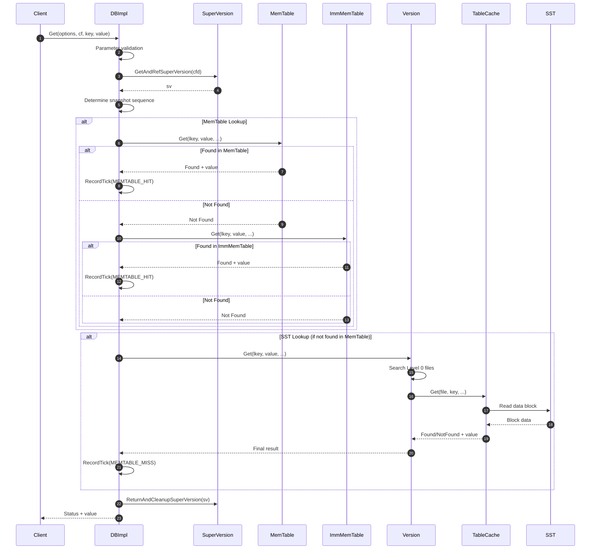

#### 异常/回退与性能要点

**异常处理**：

- **键不存在**：返回`Status::NotFound`，这是正常情况而非错误
- **数据损坏**：返回`Status::Corruption`，触发数据修复流程
- **IO错误**：返回`Status::IOError`，可能需要重试
- **快照无效**：返回`Status::InvalidArgument`，检查快照有效性

**性能优化**：

- **内存优先**：先查找MemTable，命中率高时避免磁盘IO
- **Bloom Filter**：在SST文件查找前过滤不存在的键
- **缓存利用**：Block Cache缓存热点数据块
- **预取优化**：根据访问模式预读相关数据块

**读取路径优化**：

- **Zero-Copy**：使用PinnableSlice避免不必要的内存拷贝
- **快照一致性**：通过MVCC保证读取一致性，无需加锁
- **并发友好**：多个读操作可以并发执行，不互相阻塞

### 2.3 Delete操作

#### 基本信息
- **名称**：`Delete`
- **协议/方法**：C++ API `Status Delete(const WriteOptions&, ColumnFamilyHandle*, const Slice&)`
- **幂等性**：是（删除不存在的键仍返回成功状态）

#### 请求结构体

```cpp
// Delete操作的输入参数
struct DeleteRequest {
    WriteOptions write_options;        // 写入选项（同Put操作）
    ColumnFamilyHandle* column_family; // 列族句柄
    Slice key;                        // 要删除的键
};
```

| 字段 | 类型 | 必填 | 默认 | 约束 | 说明 |
|------|------|------|------|------|------|
| write_options | WriteOptions | 是 | 默认构造 | - | 写入配置选项 |
| column_family | ColumnFamilyHandle* | 否 | nullptr | 有效句柄 | 目标列族 |
| key | Slice | 是 | - | 长度>0 | 要删除的键 |

#### 响应结构体

```cpp
// Delete操作返回Status，无额外数据
// Status结构体定义同Put操作
```

#### 入口函数与关键代码

```cpp
// DBImpl中Delete操作的入口函数
Status DBImpl::Delete(const WriteOptions& write_options,
                      ColumnFamilyHandle* column_family, const Slice& key) {
    // 1. 时间戳检查
    const Status s = FailIfCfHasTs(column_family);
    if (!s.ok()) {
        return s;
    }
    
    // 2. 调用基类Delete方法
    return DB::Delete(write_options, column_family, key);
}

// DB基类中的Delete实现
Status DB::Delete(const WriteOptions& opt, ColumnFamilyHandle* column_family,
                  const Slice& key) {
    // 1. 创建WriteBatch
    WriteBatch batch(0 /* reserved_bytes */, 0 /* max_bytes */,
                     opt.protection_bytes_per_key, 0 /* default_cf_ts_sz */);
    
    // 2. 添加Delete操作到批次中
    Status s = batch.Delete(column_family, key);
    if (!s.ok()) {
        return s;
    }
    
    // 3. 执行批量写入
    return Write(opt, &batch);
}
```

**Delete操作说明**：

- **逻辑删除**：RocksDB使用墓碑标记（Tombstone）实现删除，不立即物理删除数据
- **序列号递增**：每次Delete操作都会分配新的序列号，保证操作顺序
- **Compaction清理**：实际的数据清理在Compaction过程中完成
- **范围查询影响**：删除操作会影响范围查询和迭代器的结果

## 3. 批量操作API

### 3.1 WriteBatch操作

#### 基本信息
- **名称**：`Write`
- **协议/方法**：C++ API `Status Write(const WriteOptions&, WriteBatch*)`
- **幂等性**：否（但支持通过序列号检测重复）

#### 请求结构体

```cpp
// WriteBatch：批量操作容器
class WriteBatch {
public:
    WriteBatch();
    explicit WriteBatch(size_t reserved_bytes);
    
    // 添加操作到批次
    Status Put(ColumnFamilyHandle* column_family, const Slice& key, const Slice& value);
    Status Delete(ColumnFamilyHandle* column_family, const Slice& key);
    Status Merge(ColumnFamilyHandle* column_family, const Slice& key, const Slice& value);
    Status DeleteRange(ColumnFamilyHandle* column_family,
                      const Slice& begin_key, const Slice& end_key);
    
    // 批次信息
    int Count() const;                // 操作数量
    size_t GetDataSize() const;       // 数据大小
    void Clear();                     // 清空批次
    std::string Data() const;         // 获取序列化数据
    
private:
    std::string rep_;                 // 内部表示
    size_t content_flags_;           // 内容标志
};
```

| 字段 | 类型 | 必填 | 默认 | 约束 | 说明 |
|------|------|------|------|------|------|
| rep_ | std::string | 是 | 空 | - | 序列化的操作数据 |
| content_flags_ | size_t | 是 | 0 | 位标志 | 批次内容类型标记 |

#### 入口函数与关键代码

```cpp
// WriteBatch的核心写入逻辑
Status DBImpl::Write(const WriteOptions& write_options, WriteBatch* my_batch) {
    Status s;
    
    // 1. 数据保护：如果启用了保护机制
    if (write_options.protection_bytes_per_key > 0) {
        s = WriteBatchInternal::UpdateProtectionInfo(
            my_batch, write_options.protection_bytes_per_key);
    }
    
    // 2. 执行写入
    if (s.ok()) {
        s = WriteImpl(write_options, my_batch, /*callback=*/nullptr,
                      /*user_write_cb=*/nullptr, /*wal_used=*/nullptr);
    }
    
    return s;
}

// WriteBatch内部操作添加
Status WriteBatch::Put(ColumnFamilyHandle* column_family,
                      const Slice& key, const Slice& value) {
    // 1. 获取列族ID
    uint32_t cf_id = GetColumnFamilyID(column_family);
    
    // 2. 序列化操作到内部表示
    WriteBatchInternal::Put(this, cf_id, key, value);
    
    // 3. 更新内容标志
    content_flags_.store(content_flags_.load(std::memory_order_relaxed) |
                        ContentFlags::HAS_PUT, std::memory_order_relaxed);
    
    return Status::OK();
}
```

#### 时序图（批量写入）

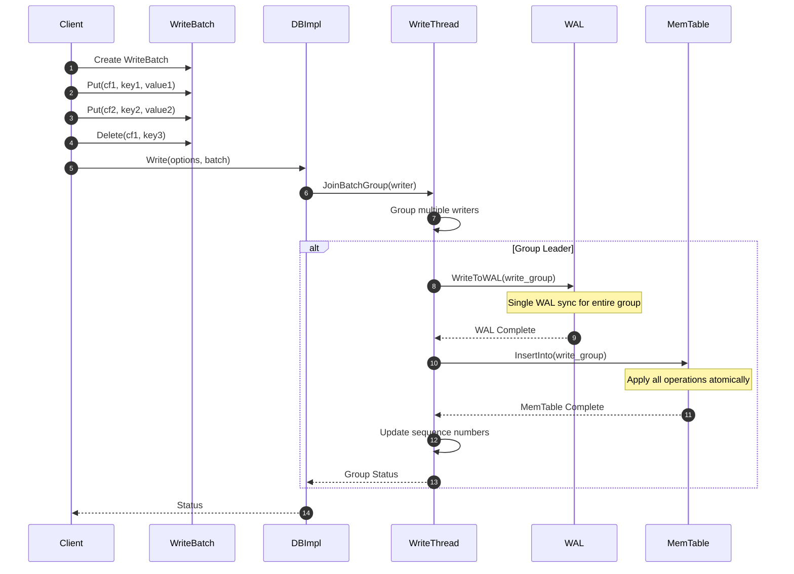

**批量操作优势**：

- **原子性**：整个批次要么全部成功，要么全部失败
- **性能优化**：一次WAL同步处理多个操作，减少磁盘同步开销
- **写入组优化**：多个客户端的WriteBatch可以合并为一个写入组
- **内存效率**：批量操作减少函数调用开销和内存分配次数

### 3.2 MultiGet操作

#### 基本信息
- **名称**：`MultiGet`
- **协议/方法**：C++ API `std::vector<Status> MultiGet(const ReadOptions&, const std::vector<ColumnFamilyHandle*>&, const std::vector<Slice>&, std::vector<std::string>*)`
- **幂等性**：是（读操作天然幂等）

#### 请求结构体

```cpp
// MultiGet操作的输入参数
struct MultiGetRequest {
    ReadOptions read_options;                      // 读取选项
    std::vector<ColumnFamilyHandle*> column_families; // 列族句柄数组
    std::vector<Slice> keys;                      // 键数组
};
```

| 字段 | 类型 | 必填 | 默认 | 约束 | 说明 |
|------|------|------|------|------|------|
| read_options | ReadOptions | 是 | 默认构造 | - | 读取配置选项 |
| column_families | std::vector<ColumnFamilyHandle*> | 是 | - | 与keys等长 | 列族句柄数组 |
| keys | std::vector<Slice> | 是 | - | 长度>0 | 要查找的键数组 |

#### 响应结构体

```cpp
// MultiGet操作的返回结果
struct MultiGetResponse {
    std::vector<Status> statuses;                 // 每个键的查找状态
    std::vector<std::string> values;              // 查找到的值数组
};
```

| 字段 | 类型 | 必填 | 默认 | 约束 | 说明 |
|------|------|------|------|------|------|
| statuses | std::vector<Status> | 是 | - | 与输入等长 | 每个键的操作状态 |
| values | std::vector<std::string> | 是 | - | 与输入等长 | 查找结果数组 |

#### 入口函数与关键代码

```cpp
// MultiGet的核心实现
std::vector<Status> DBImpl::MultiGet(
    const ReadOptions& read_options,
    const std::vector<ColumnFamilyHandle*>& column_families,
    const std::vector<Slice>& keys,
    std::vector<std::string>* values) {
    
    StopWatch sw(immutable_db_options_.clock, stats_, DB_MULTIGET);
    
    // 1. 参数验证
    size_t num_keys = keys.size();
    std::vector<Status> stat_list(num_keys);
    values->resize(num_keys);
    
    // 2. 按列族分组键
    std::unordered_map<uint32_t, std::vector<size_t>> cf_to_keys;
    for (size_t i = 0; i < num_keys; ++i) {
        auto cfh = static_cast_with_check<ColumnFamilyHandleImpl>(column_families[i]);
        cf_to_keys[cfh->GetID()].push_back(i);
    }
    
    // 3. 按列族批量查找
    for (auto& cf_keys : cf_to_keys) {
        uint32_t cf_id = cf_keys.first;
        auto& key_indices = cf_keys.second;
        
        // 获取SuperVersion
        ColumnFamilyData* cfd = GetColumnFamilySet()->GetColumnFamily(cf_id);
        SuperVersion* sv = GetAndRefSuperVersion(cfd);
        
        // 批量查找当前列族的所有键
        MultiGetImpl(read_options, key_indices, keys, values, stat_list, sv);
        
        // 清理SuperVersion引用
        ReturnAndCleanupSuperVersion(cfd, sv);
    }
    
    return stat_list;
}

// MultiGetImpl的优化实现
void DBImpl::MultiGetImpl(const ReadOptions& read_options,
                         const std::vector<size_t>& key_indices,
                         const std::vector<Slice>& keys,
                         std::vector<std::string>* values,
                         std::vector<Status>& stat_list,
                         SuperVersion* sv) {
    
    // 1. 构建查找上下文
    std::vector<LookupKey> lookup_keys;
    SequenceNumber snapshot = GetSnapshot(read_options);
    
    for (size_t idx : key_indices) {
        lookup_keys.emplace_back(keys[idx], snapshot, read_options.timestamp);
    }
    
    // 2. 批量查找MemTable
    std::vector<bool> found_in_mem(key_indices.size(), false);
    for (size_t i = 0; i < key_indices.size(); ++i) {
        size_t idx = key_indices[i];
        if (sv->mem->Get(lookup_keys[i], &(*values)[idx], /*columns=*/nullptr,
                        /*timestamp=*/nullptr, &stat_list[idx], &merge_context,
                        &max_covering_tombstone_seq, read_options)) {
            found_in_mem[i] = true;
            RecordTick(stats_, MEMTABLE_HIT);
        }
    }
    
    // 3. 批量查找SST文件（未在MemTable中找到的键）
    std::vector<size_t> sst_keys;
    for (size_t i = 0; i < key_indices.size(); ++i) {
        if (!found_in_mem[i]) {
            sst_keys.push_back(key_indices[i]);
        }
    }
    
    if (!sst_keys.empty()) {
        sv->current->MultiGet(read_options, sst_keys, keys, values, stat_list);
        RecordTick(stats_, MEMTABLE_MISS);
    }
}
```

**MultiGet优势**：

- **批量优化**：一次操作查找多个键，减少函数调用开销
- **缓存友好**：批量访问提升缓存命中率和预取效率
- **并行处理**：可以并行查找不同的SST文件
- **内存效率**：共享SuperVersion和快照，减少内存分配

## 4. 迭代器API

### 4.1 NewIterator操作

#### 基本信息
- **名称**：`NewIterator`
- **协议/方法**：C++ API `Iterator* NewIterator(const ReadOptions&, ColumnFamilyHandle*)`
- **幂等性**：是（每次调用返回新的迭代器实例）

#### 请求结构体

```cpp
// NewIterator操作的输入参数
struct NewIteratorRequest {
    ReadOptions read_options;          // 读取选项
    ColumnFamilyHandle* column_family; // 列族句柄
};
```

#### 响应结构体

```cpp
// Iterator接口定义
class Iterator {
public:
    virtual ~Iterator() {}
    
    // 迭代器控制
    virtual bool Valid() const = 0;           // 当前位置是否有效
    virtual void SeekToFirst() = 0;           // 定位到第一个元素
    virtual void SeekToLast() = 0;            // 定位到最后一个元素
    virtual void Seek(const Slice& target) = 0; // 定位到指定键
    virtual void SeekForPrev(const Slice& target) = 0; // 反向定位
    virtual void Next() = 0;                  // 移动到下一个元素
    virtual void Prev() = 0;                  // 移动到上一个元素
    
    // 数据访问
    virtual Slice key() const = 0;            // 获取当前键
    virtual Slice value() const = 0;          // 获取当前值
    virtual Status status() const = 0;        // 获取迭代器状态
    
    // 高级功能
    virtual void Refresh() {}                 // 刷新迭代器
    virtual bool IsKeyPinned() const { return false; }  // 键是否固定
    virtual bool IsValuePinned() const { return false; } // 值是否固定
};
```

#### 入口函数与关键代码

```cpp
// DBImpl中NewIterator的实现
Iterator* DBImpl::NewIterator(const ReadOptions& read_options,
                             ColumnFamilyHandle* column_family) {
    // 1. 参数验证
    if (read_options.io_activity != Env::IOActivity::kUnknown &&
        read_options.io_activity != Env::IOActivity::kIterator) {
        return NewErrorIterator(Status::InvalidArgument(
            "Can only call NewIterator with io_activity kUnknown or kIterator"));
    }
    
    // 2. 设置默认IO活动类型
    ReadOptions roptions(read_options);
    if (roptions.io_activity == Env::IOActivity::kUnknown) {
        roptions.io_activity = Env::IOActivity::kIterator;
    }
    
    // 3. 获取列族数据
    auto cfh = static_cast_with_check<ColumnFamilyHandleImpl>(column_family);
    auto cfd = cfh->cfd();
    
    // 4. 获取SuperVersion
    SuperVersion* sv = GetAndRefSuperVersion(cfd);
    
    // 5. 创建合并迭代器
    auto* internal_iter = NewInternalIterator(roptions, cfd, sv);
    
    // 6. 包装为用户迭代器
    auto* user_iter = NewDBIterator(
        env_, roptions, *cfd->ioptions(), cfd->user_comparator(),
        internal_iter, kMaxSequenceNumber, sv->mutable_cf_options.max_sequential_skip_in_iterations,
        sv->version_number);
    
    return user_iter;
}

// 创建内部迭代器
InternalIterator* DBImpl::NewInternalIterator(const ReadOptions& read_options,
                                             ColumnFamilyData* cfd,
                                             SuperVersion* super_version) {
    // 1. 创建迭代器列表
    std::vector<InternalIterator*> iterator_list;
    
    // 2. 添加MemTable迭代器
    iterator_list.push_back(super_version->mem->NewIterator(read_options));
    
    // 3. 添加Immutable MemTable迭代器
    super_version->imm->AddIterators(read_options, &iterator_list);
    
    // 4. 添加SST文件迭代器
    super_version->current->AddIterators(read_options, &iterator_list);
    
    // 5. 创建合并迭代器
    InternalIterator* internal_iter = nullptr;
    if (iterator_list.size() == 0) {
        internal_iter = NewEmptyInternalIterator();
    } else if (iterator_list.size() == 1) {
        internal_iter = iterator_list[0];
    } else {
        internal_iter = NewMergingIterator(
            &cfd->internal_comparator(), &iterator_list[0], iterator_list.size());
    }
    
    return internal_iter;
}
```

**迭代器设计要点**：

- **多层合并**：合并MemTable、Immutable MemTable和SST文件的迭代器
- **有序遍历**：保证按键的字典序或用户定义顺序遍历
- **快照一致性**：基于快照的一致性视图，不受后续写入影响
- **懒加载**：只在需要时加载数据，提升性能
- **资源管理**：自动管理SuperVersion引用，防止资源泄漏

## 5. 异常处理与性能优化

### 5.1 错误处理机制

#### Status错误码体系

```cpp
// 主要错误类型
enum Code : unsigned char {
    kOk = 0,                    // 成功
    kNotFound = 1,              // 未找到
    kCorruption = 2,            // 数据损坏
    kNotSupported = 3,          // 不支持
    kInvalidArgument = 4,       // 参数无效
    kIOError = 5,               // IO错误
    kMergeInProgress = 6,       // 合并进行中
    kIncomplete = 7,            // 不完整
    kShutdownInProgress = 8,    // 关闭进行中
    kTimedOut = 9,              // 超时
    kAborted = 10,              // 中止
    kBusy = 11,                 // 忙碌
    kExpired = 12,              // 过期
    kTryAgain = 13,             // 重试
    kCompactionTooLarge = 14,   // 压缩过大
    kColumnFamilyDropped = 15,  // 列族已删除
    kMaxCode                    // 最大错误码
};

// 子错误类型（提供更详细的错误信息）
enum SubCode : unsigned char {
    kNone = 0,                  // 无子错误
    kMutexTimeout = 1,          // 互斥锁超时
    kLockTimeout = 2,           // 锁超时
    kLockLimit = 3,             // 锁限制
    kNoSpace = 4,               // 空间不足
    kDeadlock = 5,              // 死锁
    kStaleFile = 6,             // 文件过期
    kMemoryLimit = 7,           // 内存限制
    kSpaceLimit = 8,            // 空间限制
    kPathNotFound = 9,          // 路径不存在
    kMaxSubCode                 // 最大子错误码
};
```

#### 错误恢复策略

```cpp
// 错误处理示例
Status HandleDatabaseError(Status s) {
    if (s.ok()) {
        return s;
    }
    
    // 1. 可重试错误
    if (s.IsTryAgain() || s.IsTimedOut()) {
        // 实现指数退避重试
        return RetryWithBackoff(s);
    }
    
    // 2. 资源不足错误
    if (s.IsIOError() && s.subcode() == Status::kNoSpace) {
        // 触发紧急压缩，释放空间
        TriggerEmergencyCompaction();
        return s;
    }
    
    // 3. 数据损坏错误
    if (s.IsCorruption()) {
        // 记录损坏信息，可能需要修复
        LogCorruptionInfo(s);
        return s;
    }
    
    // 4. 不可恢复错误
    if (s.IsShutdownInProgress()) {
        // 数据库正在关闭，停止操作
        return s;
    }
    
    return s;
}
```

### 5.2 性能优化策略

#### 写入性能优化

```cpp
// 写入性能优化配置
void OptimizeWritePerformance(Options& options) {
    // 1. 增大写缓冲区
    options.write_buffer_size = 256 << 20;  // 256MB
    options.max_write_buffer_number = 6;
    options.min_write_buffer_number_to_merge = 2;
    
    // 2. 优化WAL设置
    options.use_fsync = false;  // 使用fdatasync而不是fsync
    options.bytes_per_sync = 1 << 20;  // 1MB同步间隔
    
    // 3. 启用并发写入
    options.allow_concurrent_memtable_write = true;
    options.enable_write_thread_adaptive_yield = true;
    
    // 4. 优化压缩触发
    options.level0_file_num_compaction_trigger = 8;
    options.level0_slowdown_writes_trigger = 17;
    options.level0_stop_writes_trigger = 24;
    
    // 5. 增加后台线程
    options.max_background_jobs = 8;
    options.max_subcompactions = 4;
}
```

#### 读取性能优化

```cpp
// 读取性能优化配置
void OptimizeReadPerformance(Options& options) {
    // 1. 配置Block Cache
    options.block_cache = NewLRUCache(2ULL << 30);  // 2GB缓存
    options.cache_index_and_filter_blocks = true;
    options.pin_top_level_index_and_filter = true;
    
    // 2. 启用Bloom Filter
    options.filter_policy.reset(NewBloomFilterPolicy(10));
    options.optimize_filters_for_hits = true;
    
    // 3. 配置预取
    options.compaction_readahead_size = 2 << 20;  // 2MB预读
    
    // 4. 优化迭代器
    options.max_sequential_skip_in_iterations = 8;
    
    // 5. 启用统计
    options.statistics = CreateDBStatistics();
}
```

#### 内存使用优化

```cpp
// 内存使用优化
void OptimizeMemoryUsage(Options& options) {
    // 1. 统一内存管理
    size_t total_memory = 4ULL << 30;  // 4GB总内存限制
    
    auto cache = NewLRUCache(total_memory * 0.6);  // 60%用于Block Cache
    options.block_cache = cache;
    
    options.write_buffer_manager = std::make_shared<WriteBufferManager>(
        total_memory * 0.3, cache);  // 30%用于写缓冲区
    
    // 2. 控制Table Cache
    options.max_open_files = 1000;
    options.table_cache_numshardbits = 4;
    
    // 3. 优化MemTable
    options.memtable_factory = std::make_shared<SkipListFactory>();
    options.allow_mmap_reads = true;
    
    // 4. 压缩配置
    options.compression = kSnappyCompression;
    options.compression_opts.level = 1;
    options.compression_opts.parallel_threads = 4;
}
```

**API使用最佳实践**：

1. **批量操作优先**：尽量使用WriteBatch和MultiGet减少函数调用开销
2. **合理设置选项**：根据业务特点调整ReadOptions和WriteOptions
3. **资源及时释放**：Iterator使用完毕后及时delete，避免资源泄漏
4. **错误处理完善**：检查所有API的返回状态，实现适当的错误处理逻辑
5. **性能监控**：启用Statistics收集性能指标，定期分析和优化

---

## 数据结构

## 1. 核心数据结构概览

DB模块的数据结构设计体现了RocksDB的LSM-Tree架构和多版本并发控制机制。核心数据结构包括DBImpl（数据库实例）、ColumnFamilyData（列族数据）、SuperVersion（超级版本）、Version（版本）等，它们协同工作实现高效的读写操作。

### 数据结构层次关系

```
DBImpl (数据库实例)
├── ColumnFamilySet (列族集合)
│   ├── ColumnFamilyData (列族数据)
│   │   ├── SuperVersion (超级版本)
│   │   │   ├── MemTable (活跃内存表)
│   │   │   ├── MemTableListVersion (不可变内存表列表)
│   │   │   └── Version (SST文件版本)
│   │   ├── TableCache (表缓存)
│   │   └── CompactionPicker (压缩选择器)
│   └── ...
├── VersionSet (版本集合)
├── WriteThread (写线程管理)
└── EventLogger (事件日志)
```

## 2. 核心数据结构UML图

```mermaid
classDiagram
    class DBImpl {
        -ColumnFamilySet column_family_set_
        -VersionSet versions_
        -WriteThread write_thread_
        -std::shared_ptr~Cache~ table_cache_
        -std::unique_ptr~EventLogger~ event_logger_
        -InstrumentedMutex mutex_
        -std::atomic~bool~ shutting_down_
        -ErrorHandler error_handler_
        +Put(WriteOptions, ColumnFamilyHandle*, Slice, Slice) Status
        +Get(ReadOptions, ColumnFamilyHandle*, Slice, PinnableSlice*) Status
        +Delete(WriteOptions, ColumnFamilyHandle*, Slice) Status
        +Write(WriteOptions, WriteBatch*) Status
        +NewIterator(ReadOptions, ColumnFamilyHandle*) Iterator*
        +Flush(FlushOptions, ColumnFamilyHandle*) Status
        +CompactRange(CompactRangeOptions, ColumnFamilyHandle*, Slice*, Slice*) Status
    }
    
    class ColumnFamilySet {
        -std::unordered_map~uint32_t, ColumnFamilyData*~ column_families_
        -std::unordered_map~std::string, uint32_t~ column_family_names_
        -uint32_t max_column_family_
        -ColumnFamilyData* dummy_cfd_
        +GetColumnFamily(uint32_t) ColumnFamilyData*
        +GetColumnFamily(string) ColumnFamilyData*
        +CreateColumnFamily(ColumnFamilyOptions, string) ColumnFamilyData*
        +DropColumnFamily(ColumnFamilyData*) void
        +GetRefedColumnFamilySet() autovector~ColumnFamilyData*~
    }
    
    class ColumnFamilyData {
        -uint32_t id_
        -string name_
        -Version* current_
        -MemTable* mem_
        -MemTableList imm_
        -SuperVersion* super_version_
        -std::atomic~uint64_t~ super_version_number_
        -std::unique_ptr~TableCache~ table_cache_
        -std::unique_ptr~CompactionPicker~ compaction_picker_
        -std::unique_ptr~InternalStats~ internal_stats_
        -MutableCFOptions mutable_cf_options_
        -ImmutableOptions ioptions_
        +GetID() uint32_t
        +GetName() string
        +current() Version*
        +mem() MemTable*
        +imm() MemTableList*
        +GetSuperVersionNumber() uint64_t
        +InstallSuperVersion(SuperVersionContext*, InstrumentedMutex*) void
        +NeedsCompaction() bool
        +PickCompaction() Compaction*
    }
    
    class SuperVersion {
        -ColumnFamilyData* cfd
        -ReadOnlyMemTable* mem
        -MemTableListVersion* imm
        -Version* current
        -MutableCFOptions mutable_cf_options
        -uint64_t version_number
        -WriteStallCondition write_stall_condition
        -std::atomic~int32_t~ refs_
        +Ref() SuperVersion*
        +Unref() bool
        +Cleanup() void
        +Init(ColumnFamilyData*, MemTable*, MemTableListVersion*, Version*) void
    }
    
    class Version {
        -VersionStorageInfo storage_info_
        -VersionSet* vset_
        -Version* next_
        -Version* prev_
        -int refs_
        -uint64_t version_number_
        +Get(ReadOptions, LookupKey, PinnableSlice*, Status*) void
        +MultiGet(ReadOptions, MultiGetContext*) void
        +NewIterator(ReadOptions, MergeIteratorBuilder*) InternalIterator*
        +AddIterators(ReadOptions, std::vector~InternalIterator*~*) void
        +GetOverlappingInputs(int, Slice*, Slice*, std::vector~FileMetaData*~*) void
        +PickLevelForMemTableOutput(Slice, Slice) int
    }
    
    class VersionSet {
        -std::unique_ptr~ColumnFamilySet~ column_family_set_
        -Env* const env_
        -FileSystem* const fs_
        -std::string dbname_
        -std::unique_ptr~log::Writer~ descriptor_log_
        -uint64_t manifest_file_number_
        -uint64_t options_file_number_
        -uint64_t pending_manifest_file_number_
        -std::atomic~uint64_t~ last_sequence_
        -uint64_t last_allocated_sequence_
        -uint64_t last_published_sequence_
        +LogAndApply(ColumnFamilyData*, MutableCFOptions, VersionEdit*, InstrumentedMutex*) Status
        +Recover(std::vector~ColumnFamilyDescriptor~*, bool) Status
        +GetColumnFamilySet() ColumnFamilySet*
        +LastSequence() uint64_t
        +SetLastSequence(uint64_t) void
        +NewFileNumber() uint64_t
    }
    
    class MemTable {
        -KeyComparator comparator_
        -std::unique_ptr~MemTableRep~ table_
        -std::atomic~uint64_t~ data_size_
        -std::atomic~uint64_t~ num_entries_
        -std::atomic~uint64_t~ num_deletes_
        -SequenceNumber earliest_seqno_
        -SequenceNumber creation_seqno_
        -uint64_t mem_next_logfile_number_
        -uint64_t mem_logfile_number_
        +Add(SequenceNumber, ValueType, Slice, Slice) bool
        +Get(LookupKey, std::string*, Status*) bool
        +NewIterator(ReadOptions, Arena*) MemTableIterator*
        +ApproximateSize(Slice, Slice) uint64_t
        +ShouldFlush() bool
        +MarkImmutable() void
    }
    
    class WriteThread {
        -std::deque~Writer*~ writers_
        -Writer* newest_writer_
        -std::atomic~uint8_t~ stall_mu_
        -std::atomic~uint8_t~ stall_cv_
        +JoinBatchGroup(Writer*) uint8_t
        +EnterAsBatchGroupLeader(Writer*, WriteGroup*) size_t
        +ExitAsBatchGroupLeader(WriteGroup, Status) void
        +EnterUnbatched(Writer*, InstrumentedMutex*) void
        +ExitUnbatched(Writer*) void
        +WaitForMemTableWriters() void
    }
    
    class WriteBatch {
        -std::string rep_
        -size_t content_flags_
        +Put(ColumnFamilyHandle*, Slice, Slice) Status
        +Delete(ColumnFamilyHandle*, Slice) Status
        +Merge(ColumnFamilyHandle*, Slice, Slice) Status
        +Clear() void
        +Count() int
        +GetDataSize() size_t
        +Data() string
        +Iterate(Handler*) Status
    }
    
    %% 关系定义
    DBImpl ||--|| ColumnFamilySet : contains
    DBImpl ||--|| VersionSet : contains  
    DBImpl ||--|| WriteThread : contains
    ColumnFamilySet ||--o{ ColumnFamilyData : manages
    ColumnFamilyData ||--|| SuperVersion : has current
    ColumnFamilyData ||--|| MemTable : has active
    ColumnFamilyData ||--|| Version : has current
    SuperVersion ||--|| MemTable : references
    SuperVersion ||--|| Version : references
    SuperVersion ||--|| MemTableListVersion : references
    VersionSet ||--|| ColumnFamilySet : manages
    WriteThread ||--o{ WriteBatch : processes
```

### UML图详细说明

#### 类关系说明
1. **组合关系（||--||）**：表示强拥有关系，生命周期绑定
   - DBImpl与ColumnFamilySet：DBImpl拥有并管理所有列族
   - ColumnFamilyData与SuperVersion：每个列族有当前的超级版本
   
2. **聚合关系（||--o{）**：表示弱拥有关系，可以独立存在
   - ColumnFamilySet与ColumnFamilyData：集合管理多个列族实例
   - WriteThread与WriteBatch：写线程处理多个写批次

3. **引用关系**：SuperVersion引用但不拥有MemTable、Version等对象

#### 核心数据流
- **写入流**：WriteBatch → WriteThread → MemTable → SuperVersion
- **读取流**：SuperVersion → MemTable/Version → 数据块
- **版本管理流**：VersionEdit → VersionSet → Version → SuperVersion

## 3. 关键数据结构详解

### 3.1 DBImpl结构

```cpp
// DBImpl：RocksDB的核心实现类
class DBImpl : public DB {
private:
    // 核心组件
    std::unique_ptr<ColumnFamilySet> column_family_set_;  // 列族集合
    std::unique_ptr<VersionSet> versions_;                // 版本管理
    WriteThread write_thread_;                            // 写线程管理
    WriteThread nonmem_write_thread_;                     // 非内存写线程
    
    // 缓存和存储
    std::shared_ptr<Cache> table_cache_;                  // 表缓存
    std::unique_ptr<WriteBufferManager> write_buffer_manager_; // 写缓冲管理器
    
    // 并发控制
    mutable InstrumentedMutex mutex_;                     // 主互斥锁
    std::atomic<bool> shutting_down_;                     // 关闭标志
    std::condition_variable bg_cv_;                       // 后台条件变量
    
    // 后台任务
    std::unique_ptr<ThreadPool> flush_pool_;              // Flush线程池
    std::unique_ptr<ThreadPool> compaction_pool_;         // Compaction线程池
    FlushScheduler flush_scheduler_;                      // Flush调度器
    TrimHistoryScheduler trim_history_scheduler_;         // 历史修剪调度器
    
    // 错误处理和监控
    ErrorHandler error_handler_;                          // 错误处理器
    std::unique_ptr<EventLogger> event_logger_;           // 事件日志记录器
    std::shared_ptr<Statistics> stats_;                   // 统计信息
    
    // WAL和恢复
    std::unique_ptr<log::Writer> log_writer_;             // WAL写入器
    std::unique_ptr<log::Reader> log_reader_;             // WAL读取器
    uint64_t logfile_number_;                            // 当前日志文件号
    
    // 配置选项
    const ImmutableDBOptions immutable_db_options_;       // 不可变DB选项
    MutableDBOptions mutable_db_options_;                 // 可变DB选项
    
public:
    // 构造函数：初始化所有组件
    DBImpl(const DBOptions& options, const std::string& dbname,
           const std::vector<ColumnFamilyDescriptor>& column_families,
           std::vector<ColumnFamilyHandle*>* handles, bool seq_per_batch = false,
           bool batch_per_txn = true, bool read_only = false);
    
    // 核心API实现
    Status Put(const WriteOptions& options, ColumnFamilyHandle* column_family,
               const Slice& key, const Slice& value) override;
    Status Get(const ReadOptions& options, ColumnFamilyHandle* column_family,
               const Slice& key, PinnableSlice* value) override;
    Status Delete(const WriteOptions& options, ColumnFamilyHandle* column_family,
                  const Slice& key) override;
    Iterator* NewIterator(const ReadOptions& options,
                         ColumnFamilyHandle* column_family) override;
};
```

**DBImpl设计要点**：

- **中央协调器**：协调所有子系统的工作，包括读写、压缩、错误处理等
- **线程安全**：通过mutex_保护共享状态，支持多线程并发访问
- **资源管理**：管理内存、文件句柄、线程池等系统资源
- **可配置性**：支持丰富的配置选项，适应不同使用场景

### 3.2 ColumnFamilyData结构

```cpp
// ColumnFamilyData：列族的核心数据结构
class ColumnFamilyData {
private:
    // 基本信息
    uint32_t id_;                                        // 列族ID
    const std::string name_;                             // 列族名称
    std::atomic<int> refs_;                              // 引用计数
    std::atomic<bool> initialized_;                      // 初始化标志
    std::atomic<bool> dropped_;                          // 删除标志
    
    // 版本管理
    Version* dummy_versions_;                            // 版本链表头
    Version* current_;                                   // 当前版本
    SuperVersion* super_version_;                        // 当前超级版本
    std::atomic<uint64_t> super_version_number_;         // 超级版本号
    
    // 内存表管理
    MemTable* mem_;                                      // 活跃内存表
    MemTableList imm_;                                   // 不可变内存表列表
    
    // 缓存和存储
    std::unique_ptr<TableCache> table_cache_;            // 表缓存
    std::unique_ptr<BlobFileCache> blob_file_cache_;     // Blob文件缓存
    std::unique_ptr<BlobSource> blob_source_;            // Blob数据源
    
    // 压缩管理
    std::unique_ptr<CompactionPicker> compaction_picker_; // 压缩选择器
    bool queued_for_flush_;                              // 是否在Flush队列中
    bool queued_for_compaction_;                         // 是否在Compaction队列中
    
    // 配置选项
    const InternalKeyComparator internal_comparator_;    // 内部键比较器
    const ColumnFamilyOptions initial_cf_options_;       // 初始列族选项
    const ImmutableOptions ioptions_;                    // 不可变选项
    MutableCFOptions mutable_cf_options_;                // 可变选项
    
    // 统计和监控
    std::unique_ptr<InternalStats> internal_stats_;      // 内部统计信息
    WriteBufferManager* write_buffer_manager_;           // 写缓冲管理器
    
    // 线程本地存储
    std::unique_ptr<ThreadLocalPtr> local_sv_;           // 线程本地SuperVersion
    
    // 链表结构（用于ColumnFamilySet）
    ColumnFamilyData* next_;                             // 下一个列族
    ColumnFamilyData* prev_;                             // 上一个列族
    
public:
    // 访问器方法
    uint32_t GetID() const { return id_; }
    const std::string& GetName() const { return name_; }
    Version* current() const { return current_; }
    MemTable* mem() const { return mem_; }
    MemTableList* imm() const { return &imm_; }
    
    // SuperVersion管理
    SuperVersion* GetSuperVersion() { return super_version_; }
    uint64_t GetSuperVersionNumber() const {
        return super_version_number_.load(std::memory_order_acquire);
    }
    void InstallSuperVersion(SuperVersionContext* sv_context,
                           InstrumentedMutex* db_mutex);
    
    // 压缩相关
    bool NeedsCompaction() const;
    Compaction* PickCompaction(const MutableCFOptions& mutable_options,
                              const MutableDBOptions& mutable_db_options,
                              LogBuffer* log_buffer);
    
    // 引用计数管理
    void Ref() { refs_.fetch_add(1, std::memory_order_relaxed); }
    void UnrefAndTryDelete();
};
```

**ColumnFamilyData设计要点**：

- **独立命名空间**：每个列族有独立的配置、统计和存储空间
- **版本一致性**：通过SuperVersion提供一致的数据视图
- **内存管理**：管理MemTable的生命周期和内存使用
- **压缩调度**：独立的压缩策略和调度逻辑

### 3.3 SuperVersion结构

```cpp
// SuperVersion：提供一致的数据视图快照
struct SuperVersion {
    // 核心组件引用
    ColumnFamilyData* cfd;                               // 所属列族
    ReadOnlyMemTable* mem;                               // 只读内存表
    MemTableListVersion* imm;                            // 不可变内存表版本
    Version* current;                                    // 当前SST文件版本
    
    // 配置快照
    MutableCFOptions mutable_cf_options;                 // 可变配置选项快照
    uint64_t version_number;                             // 版本号
    WriteStallCondition write_stall_condition;          // 写入停顿条件
    
    // 时间戳相关
    std::string full_history_ts_low;                     // 历史时间戳下界
    std::shared_ptr<const SeqnoToTimeMapping> seqno_to_time_mapping; // 序列号到时间映射
    
    // 引用计数
    std::atomic<int32_t> refs_;                          // 引用计数
    
    // 生命周期管理
    SuperVersion() = default;
    ~SuperVersion();
    
    // 引用计数操作
    SuperVersion* Ref() {
        refs_.fetch_add(1, std::memory_order_relaxed);
        return this;
    }
    
    bool Unref() {
        int32_t previous_refs = refs_.fetch_sub(1, std::memory_order_relaxed);
        assert(previous_refs > 0);
        return previous_refs == 1;  // 返回true表示需要清理
    }
    
    // 初始化和清理
    void Init(ColumnFamilyData* new_cfd, MemTable* new_mem,
              MemTableListVersion* new_imm, Version* new_current,
              std::shared_ptr<const SeqnoToTimeMapping> new_seqno_to_time_mapping);
    void Cleanup();  // 清理引用，需要在mutex保护下调用
};
```

**SuperVersion设计要点**：

- **原子快照**：提供某个时刻的一致性数据视图
- **引用计数**：支持多个读操作同时持有引用
- **写时复制**：写操作时创建新的SuperVersion，不影响正在进行的读操作
- **内存安全**：通过引用计数确保对象生命周期安全

### 3.4 Version结构

```cpp
// Version：表示某个时刻的SST文件集合
class Version {
private:
    // 存储信息
    VersionStorageInfo storage_info_;                    // 存储结构信息
    VersionSet* vset_;                                   // 所属版本集合
    ColumnFamilyData* cfd_;                             // 所属列族
    
    // 双向链表结构
    Version* next_;                                      // 下一个版本
    Version* prev_;                                      // 上一个版本
    
    // 引用计数和版本号
    int refs_;                                           // 引用计数
    uint64_t version_number_;                            // 版本号
    
    // 文件索引
    std::unique_ptr<FileIndexer> file_indexer_;          // 文件索引器
    
public:
    // 构造函数
    Version(ColumnFamilyData* column_family_data, VersionSet* vset,
            const FileOptions& file_opt,
            const MutableCFOptions mutable_cf_options,
            const std::shared_ptr<IOTracer>& io_tracer,
            uint64_t version_number = 0);
    
    // 查找操作
    void Get(const ReadOptions& read_options, const LookupKey& key,
             PinnableSlice* value, std::string* timestamp, Status* status,
             MergeContext* merge_context, SequenceNumber* max_covering_tombstone_seq,
             PinnedIteratorsManager* pinned_iters_mgr, bool* value_found = nullptr,
             bool* key_exists = nullptr, SequenceNumber* seq = nullptr,
             ReadCallback* callback = nullptr, bool* is_blob_index = nullptr,
             bool do_merge = true);
    
    // 批量查找
    void MultiGet(const ReadOptions& read_options, MultiGetContext* range,
                  bool* is_blob_index = nullptr);
    
    // 迭代器支持
    InternalIterator* NewIterator(const ReadOptions& read_options,
                                 MergeIteratorBuilder* merge_iter_builder,
                                 Arena* arena = nullptr);
    void AddIterators(const ReadOptions& read_options,
                     std::vector<InternalIterator*>* iters);
    
    // 压缩相关
    void GetOverlappingInputs(int level, const InternalKey* begin,
                             const InternalKey* end,
                             std::vector<FileMetaData*>* inputs,
                             int hint_index = -1, int* file_index = nullptr,
                             bool expand_range = true, InternalKey** next_smallest = nullptr);
    
    // 统计信息
    uint64_t NumLevelBytes(int level) const {
        return storage_info_.NumLevelBytes(level);
    }
    int NumLevelFiles(int level) const {
        return storage_info_.NumLevelFiles(level);
    }
    
    // 引用计数管理
    void Ref();
    void Unref();
    
    // 访问器
    VersionStorageInfo* storage_info() { return &storage_info_; }
    VersionSet* version_set() { return vset_; }
    uint64_t GetVersionNumber() const { return version_number_; }
};
```

**Version设计要点**：

- **不可变性**：一旦创建就不能修改，保证读操作的一致性
- **多层结构**：管理Level 0到Level N的SST文件层次结构
- **高效查找**：通过文件索引和二分查找快速定位数据
- **版本链**：通过双向链表维护历史版本，支持快照读

### 3.5 WriteThread结构

```cpp
// WriteThread：管理并发写入的线程协调器
class WriteThread {
public:
    // Writer状态枚举
    enum State : uint8_t {
        STATE_INIT = 1,                                  // 初始状态
        STATE_GROUP_LEADER = 2,                          // 组长状态
        STATE_PARALLEL_MEMTABLE_WRITER = 4,              // 并行内存表写入者
        STATE_PARALLEL_MEMTABLE_CALLER = 8,              // 并行内存表调用者
        STATE_COMPLETED = 16,                            // 完成状态
        STATE_LOCKED_WAITING = 32,                       // 锁等待状态
    };
    
    // Writer：写入请求的封装
    struct Writer {
        WriteOptions write_options;                      // 写入选项
        WriteBatch* batch;                              // 写入批次
        WriteCallback* callback;                        // 写入回调
        UserWriteCallback* user_write_cb;               // 用户写入回调
        uint64_t log_ref;                               // 日志引用
        bool disable_memtable;                          // 禁用内存表写入
        size_t batch_cnt;                               // 批次计数
        PreReleaseCallback* pre_release_callback;       // 预释放回调
        PostMemTableCallback* post_memtable_callback;   // 内存表后回调
        
        // 状态和结果
        std::atomic<uint8_t> state;                     // 写入状态
        Status status;                                  // 最终状态
        Status callback_status;                         // 回调状态
        SequenceNumber sequence;                        // 分配的序列号
        bool made_waitable;                            // 是否可等待
        std::condition_variable cv;                     // 条件变量
        
        // 写入组相关
        WriteGroup* write_group;                        // 所属写入组
        bool in_batch_group;                           // 是否在批次组中
        bool ShouldWriteToMemtable() const {
            return !disable_memtable;
        }
        
        bool CheckCallback(DBImpl* db);
        bool CallbackFailed() const;
        Status FinalStatus() const;
    };
    
    // WriteGroup：写入组，包含多个Writer
    struct WriteGroup {
        Writer* leader = nullptr;                        // 组长
        Writer* last_writer = nullptr;                   // 最后一个写入者
        bool running = false;                           // 是否正在运行
        size_t size = 0;                               // 组大小
        
        struct Iterator {
            Writer* writer;
            explicit Iterator(Writer* w) : writer(w) {}
            Writer& operator*() { return *writer; }
            Iterator& operator++() {
                writer = writer->link_newer;
                return *this;
            }
            bool operator!=(const Iterator& other) {
                return writer != other.writer;
            }
        };
        
        Iterator begin() { return Iterator(leader); }
        Iterator end() { return Iterator(nullptr); }
    };
    
private:
    // 写入队列管理
    std::atomic<Writer*> newest_writer_;                 // 最新的写入者
    std::deque<Writer*> writers_;                       // 写入者队列
    
    // 停顿控制
    std::atomic<uint8_t> stall_mu_;                     // 停顿互斥锁
    std::atomic<uint8_t> stall_cv_;                     // 停顿条件变量
    
public:
    WriteThread(const ImmutableDBOptions& immutable_db_options);
    
    // 核心接口
    uint8_t JoinBatchGroup(Writer* w);                  // 加入批次组
    size_t EnterAsBatchGroupLeader(Writer* leader, WriteGroup* write_group); // 作为组长进入
    void ExitAsBatchGroupLeader(WriteGroup& write_group, Status status); // 组长退出
    void EnterUnbatched(Writer* w, InstrumentedMutex* mu); // 进入非批次模式
    void ExitUnbatched(Writer* w);                      // 退出非批次模式
    
    // 并行写入支持
    bool LaunchParallelMemTableWriters(WriteGroup* write_group); // 启动并行写入
    bool CompleteParallelMemTableWriter(Writer* w);     // 完成并行写入
    void ExitAsBatchGroupFollower(Writer* w);           // 作为跟随者退出
    
    // 停顿控制
    void BeginWriteStall();                             // 开始写入停顿
    void EndWriteStall();                               // 结束写入停顿
};
```

**WriteThread设计要点**：

- **批量优化**：将多个写入请求合并为一个写入组，减少WAL同步次数
- **并发控制**：支持并行MemTable写入，提升多线程写入性能
- **状态机管理**：通过状态机确保写入流程的正确性
- **背压控制**：通过写入停顿机制防止写入速度过快导致系统过载

## 4. 数据结构交互模式

### 4.1 读取路径数据流

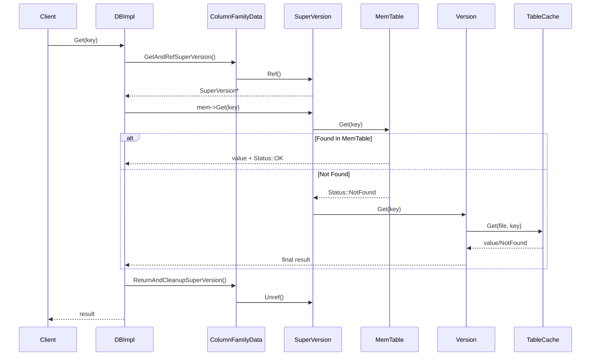

### 4.2 写入路径数据流

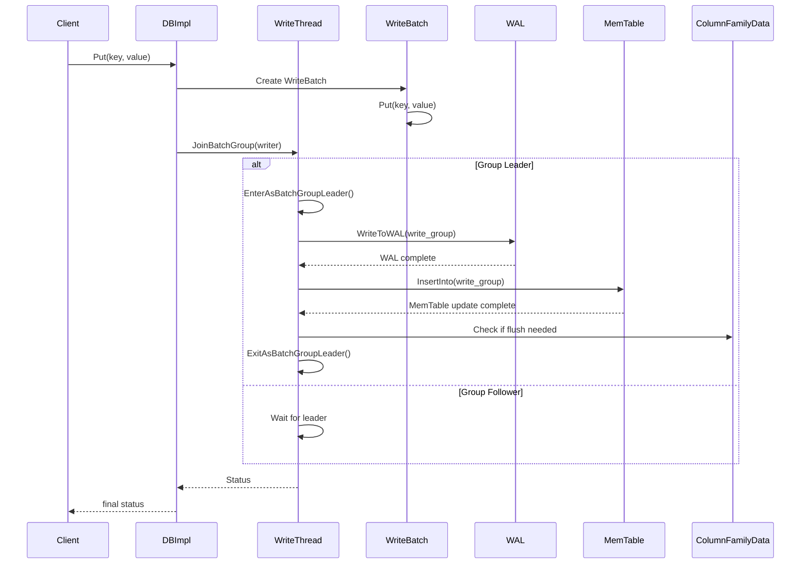

### 4.3 版本更新数据流

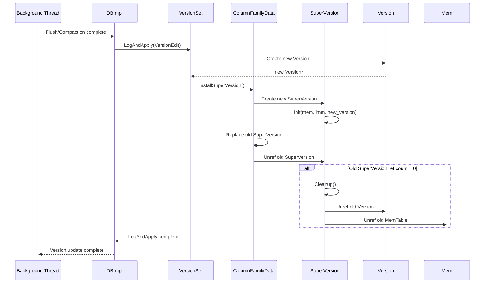

## 5. 内存管理与生命周期

### 5.1 引用计数机制

```cpp
// 引用计数管理示例
class ReferenceCountedObject {
private:
    std::atomic<int> refs_;
    
public:
    ReferenceCountedObject() : refs_(1) {}  // 初始引用计数为1
    
    void Ref() {
        refs_.fetch_add(1, std::memory_order_relaxed);
    }
    
    bool Unref() {
        int previous = refs_.fetch_sub(1, std::memory_order_relaxed);
        assert(previous > 0);
        return previous == 1;  // 返回true表示需要删除
    }
    
    int GetRefCount() const {
        return refs_.load(std::memory_order_relaxed);
    }
};

// SuperVersion的安全使用模式
SuperVersion* GetAndRefSuperVersion(ColumnFamilyData* cfd) {
    SuperVersion* sv = cfd->GetSuperVersion();
    sv->Ref();  // 增加引用计数
    return sv;
}

void ReturnAndCleanupSuperVersion(ColumnFamilyData* cfd, SuperVersion* sv) {
    if (sv->Unref()) {  // 减少引用计数
        // 引用计数归零，需要清理
        sv->Cleanup();
        delete sv;
    }
}
```

### 5.2 内存分配策略

```cpp
// 内存分配和管理策略
class MemoryManager {
private:
    // 统一内存管理器
    std::shared_ptr<WriteBufferManager> write_buffer_manager_;
    std::shared_ptr<Cache> block_cache_;
    
public:
    // MemTable内存分配
    MemTable* AllocateMemTable(const ColumnFamilyOptions& cf_options) {
        size_t memtable_size = cf_options.write_buffer_size;
        
        // 检查内存限制
        if (write_buffer_manager_->ShouldFlush()) {
            TriggerFlush();  // 触发Flush释放内存
        }
        
        // 分配MemTable
        MemTable* mem = new MemTable(cf_options, write_buffer_manager_);
        
        // 注册内存使用
        write_buffer_manager_->ReserveMem(memtable_size);
        
        return mem;
    }
    
    // SuperVersion内存管理
    SuperVersion* AllocateSuperVersion() {
        SuperVersion* sv = new SuperVersion();
        // SuperVersion本身很小，不需要特殊的内存管理
        return sv;
    }
    
    // 缓存内存管理
    void ManageCacheMemory() {
        // Block Cache自动管理LRU淘汰
        // 当内存不足时自动淘汰旧的数据块
        size_t cache_usage = block_cache_->GetUsage();
        size_t cache_capacity = block_cache_->GetCapacity();
        
        if (cache_usage > cache_capacity * 0.9) {
            // 缓存使用率过高，可能需要调整
            LOG_WARN("Block cache usage high: %zu/%zu", cache_usage, cache_capacity);
        }
    }
};
```

### 5.3 对象生命周期管理

```cpp
// 对象生命周期管理最佳实践
class LifecycleManager {
public:
    // ColumnFamilyData生命周期
    static void ManageColumnFamilyLifecycle() {
        // 1. 创建阶段
        ColumnFamilyData* cfd = CreateColumnFamily(options, name);
        cfd->Ref();  // 初始引用
        
        // 2. 使用阶段
        {
            SuperVersion* sv = GetAndRefSuperVersion(cfd);
            // 使用SuperVersion进行读写操作...
            ReturnAndCleanupSuperVersion(cfd, sv);
        }
        
        // 3. 删除阶段
        cfd->SetDropped();  // 标记为已删除
        cfd->Unref();       // 减少引用
        // 当引用计数归零时，ColumnFamilyData会被自动删除
    }
    
    // Version生命周期
    static void ManageVersionLifecycle() {
        // 1. 创建新版本
        Version* new_version = new Version(cfd, vset, file_options, version_number);
        
        // 2. 安装新版本
        Version* old_version = cfd->current();
        cfd->SetCurrent(new_version);
        new_version->Ref();  // 被SuperVersion引用
        
        // 3. 清理旧版本
        if (old_version != nullptr) {
            old_version->Unref();  // 可能触发删除
        }
    }
    
    // 内存表生命周期
    static void ManageMemTableLifecycle() {
        // 1. 活跃阶段：接受写入
        MemTable* active_mem = cfd->mem();
        
        // 2. 不可变阶段：停止写入，准备Flush
        if (active_mem->ShouldFlush()) {
            MemTable* new_mem = AllocateMemTable();
            cfd->SetMemTable(new_mem);
            cfd->imm()->Add(active_mem);  // 移到不可变列表
        }
        
        // 3. Flush阶段：写入SST文件
        FlushJob flush_job(cfd, db_options, mutable_cf_options);
        flush_job.Run();
        
        // 4. 清理阶段：Flush完成后删除MemTable
        cfd->imm()->RemoveOldest();  // 从不可变列表中移除
        // MemTable的引用计数归零后自动删除
    }
};
```

**数据结构设计原则总结**：

1. **引用计数管理**：确保对象在被引用期间不被意外删除
2. **写时复制**：读操作不阻塞写操作，写操作创建新版本
3. **分层设计**：清晰的层次结构，每层有明确的职责
4. **线程安全**：通过原子操作和互斥锁保证多线程安全
5. **内存效率**：统一内存管理，避免内存碎片和泄漏
6. **可扩展性**：支持多列族、多版本、多层级的扩展

---

## 时序图

## 1. 时序图概览

DB模块的时序图展示了RocksDB核心操作的执行流程，包括读取、写入、压缩等关键场景。这些时序图详细描述了各个组件之间的交互顺序、数据流向和控制流程，帮助理解RocksDB的内部工作机制。

### 主要时序场景
- **写入操作时序**：Put/Delete操作的完整执行流程
- **读取操作时序**：Get操作的多层查找过程
- **批量操作时序**：WriteBatch和MultiGet的批量处理
- **后台任务时序**：Flush和Compaction的异步执行
- **版本更新时序**：SuperVersion和Version的更新流程
- **错误处理时序**：异常情况的处理和恢复流程

## 2. 写入操作时序图

### 2.1 单键写入时序（Put操作）

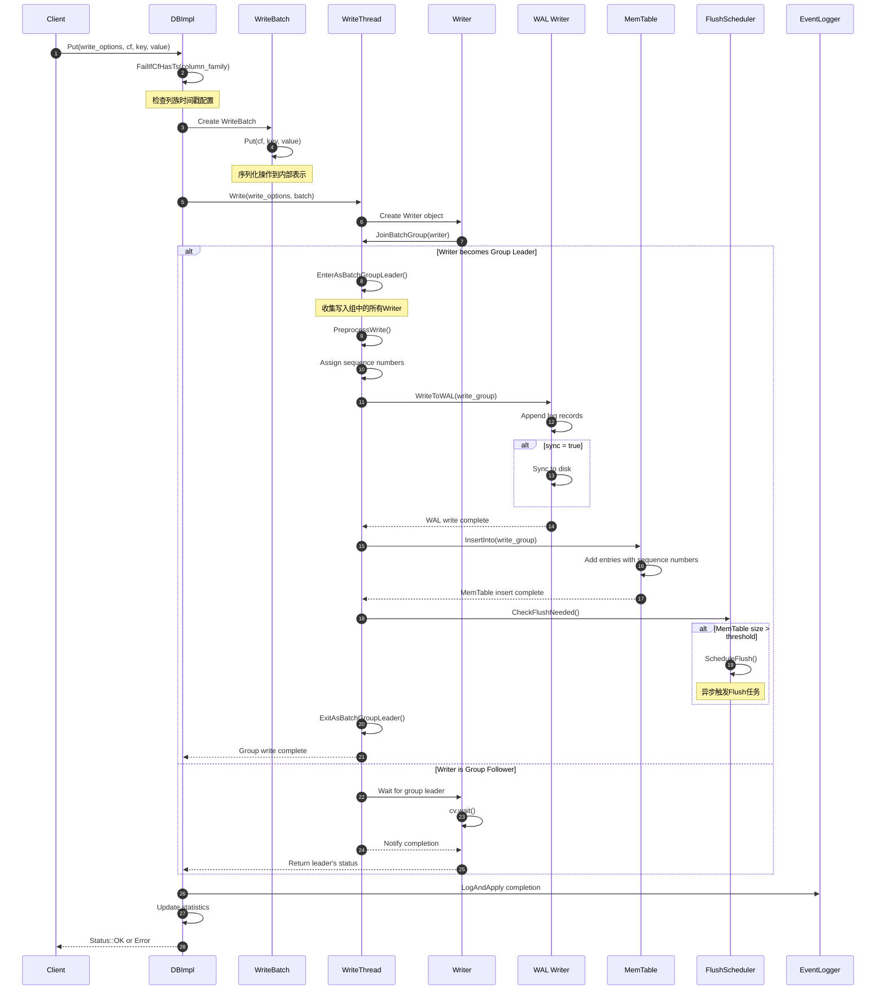

**写入时序详细说明**：

#### 阶段1：请求预处理（步骤1-3）
- **参数验证**：检查列族是否存在，时间戳配置是否正确
- **WriteBatch创建**：将单个Put操作封装为WriteBatch，便于统一处理
- **序列化**：将键值对序列化为内部存储格式

#### 阶段2：写入组形成（步骤4-5）
- **Writer创建**：每个写入请求创建一个Writer对象
- **批量优化**：多个并发写入请求合并为一个写入组
- **组长选举**：第一个到达的Writer成为组长，负责执行实际写入

#### 阶段3：WAL写入（步骤6-7）
- **序列号分配**：为写入组中的所有操作分配连续的序列号
- **日志写入**：将所有操作写入WAL，保证持久性
- **同步控制**：根据sync选项决定是否立即同步到磁盘

#### 阶段4：MemTable更新（步骤8-9）
- **内存写入**：将操作应用到MemTable，更新内存数据
- **Flush检查**：检查MemTable大小，必要时触发异步Flush
- **并发支持**：支持多个Writer并行写入不同的MemTable

#### 阶段5：完成和清理（步骤10-12）
- **状态通知**：通知写入组中的所有Writer操作结果
- **事件记录**：记录写入事件，更新统计信息
- **资源清理**：清理临时对象，释放资源

### 2.2 批量写入时序（WriteBatch操作）

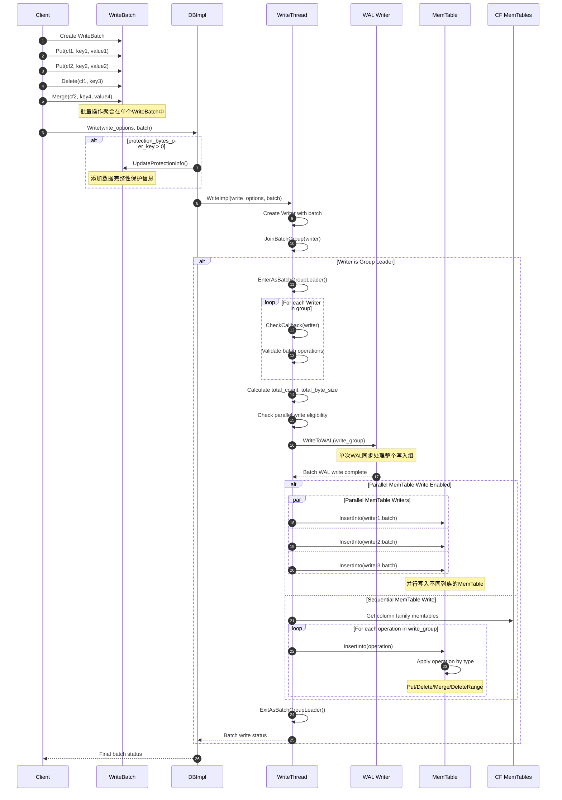

**批量写入优势说明**：

#### 性能优化
- **WAL批量同步**：多个操作共享一次磁盘同步，显著减少I/O开销
- **写入组合并**：来自不同客户端的WriteBatch可以合并处理
- **并行MemTable写入**：支持同时写入多个列族的MemTable

#### 原子性保证
- **全或无语义**：整个WriteBatch要么全部成功，要么全部失败
- **序列号连续性**：批次内的操作获得连续的序列号
- **跨列族一致性**：支持跨多个列族的原子操作

## 3. 读取操作时序图

### 3.1 单键读取时序（Get操作）

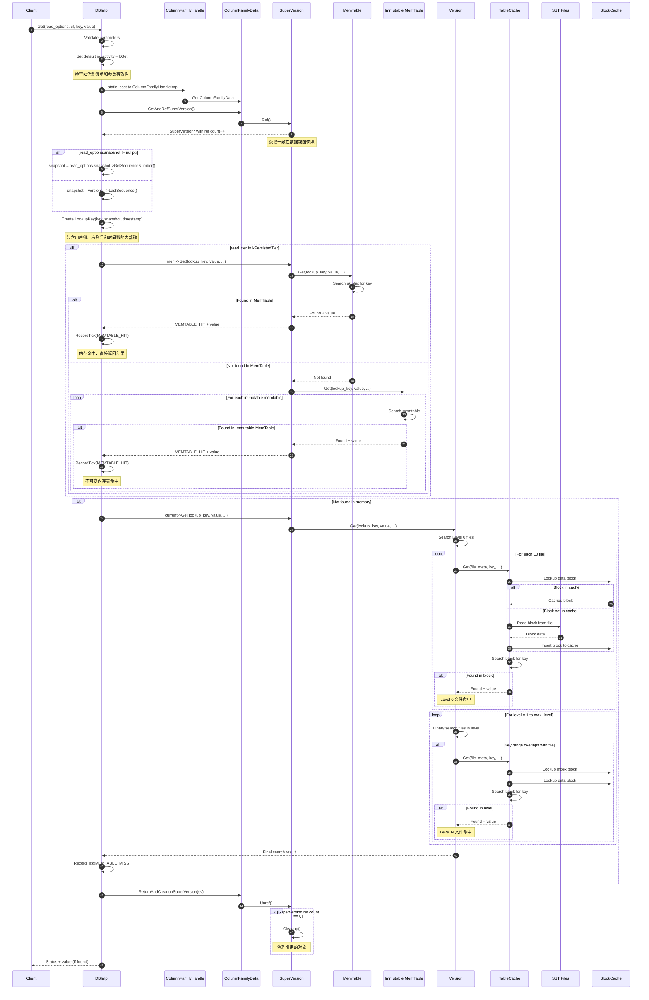

**读取时序详细说明**：

#### 阶段1：请求准备（步骤1-6）
- **参数验证**：确保读取选项和列族句柄有效
- **SuperVersion获取**：获取当前数据视图的一致性快照
- **快照确定**：确定读取的数据版本，支持历史版本读取
- **查找键构建**：创建包含序列号的内部查找键

#### 阶段2：内存查找（步骤7-8）
- **MemTable优先**：首先查找活跃的MemTable，命中率最高
- **Immutable查找**：查找正在Flush的不可变MemTable
- **快速路径**：内存命中时避免磁盘I/O，延迟最低

#### 阶段3：磁盘查找（步骤9）
- **Level 0特殊处理**：文件可能重叠，需要检查所有相关文件
- **Level 1+优化**：文件不重叠，使用二分查找快速定位
- **缓存加速**：通过Block Cache减少重复的磁盘读取

#### 阶段4：资源清理（步骤10）
- **引用计数管理**：安全释放SuperVersion引用
- **内存保护**：确保读取过程中数据不被意外删除

### 3.2 批量读取时序（MultiGet操作）

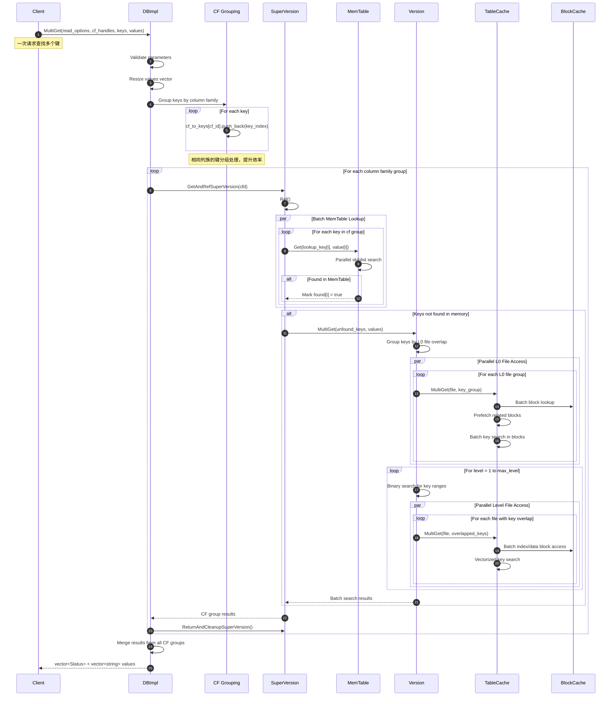

**批量读取优化说明**：

#### 批量处理优势
- **缓存友好**：批量访问提升Block Cache命中率
- **预取优化**：预读相关数据块，减少随机I/O
- **并行处理**：同时处理多个键的查找，提升吞吐量

#### 分组策略
- **列族分组**：相同列族的键一起处理，共享SuperVersion
- **文件分组**：相同SST文件的键批量处理，减少文件访问次数
- **块分组**：相同数据块的键一起查找，最大化缓存利用率

## 4. 后台任务时序图

### 4.1 Flush操作时序

```mermaid
sequenceDiagram
    autonumber
    participant WriteThread
    participant FlushScheduler
    participant BGThread as Background Thread
    participant DBImpl
    participant CFD as ColumnFamilyData
    participant MemTable
    participant FlushJob
    participant TableBuilder
    parameter SST as SST File
    participant VersionSet
    participant SuperVersion
    
    %% 1. 触发Flush条件
    WriteThread->>FlushScheduler: MemTable size > threshold
    FlushScheduler->>FlushScheduler: ScheduleFlush(cfd)
    Note over FlushScheduler: 将列族加入Flush队列
    
    %% 2. 后台线程处理
    BGThread->>DBImpl: BackgroundCallFlush()
    DBImpl->>DBImpl: MaybeScheduleFlushOrCompaction()
    
    %% 3. 选择Flush任务
    DBImpl->>CFD: Check flush_requested flag
    CFD->>CFD: cfd->imm()->IsFlushPending()
    alt Flush needed
        DBImpl->>FlushJob: Create FlushJob(cfd, db_options, mutable_cf_options)
        FlushJob->>FlushJob: Prepare flush context
    end
    
    %% 4. 执行Flush操作
    DBImpl->>FlushJob: Run()
    FlushJob->>CFD: Get immutable memtable list
    CFD->>MemTable: Get memtables to flush
    
    %% 5. 创建SST文件
    FlushJob->>TableBuilder: Create table builder
    FlushJob->>MemTable: Create iterator
    
    loop For each key-value in MemTable
        MemTable->>FlushJob: Next key-value pair
        FlushJob->>TableBuilder: Add(key, value)
        TableBuilder->>TableBuilder: Write to SST file
        
        %% 压缩处理
        alt Compression enabled
            TableBuilder->>TableBuilder: Compress data block
        end
        
        %% 过滤器构建
        alt Filter policy set
            TableBuilder->>TableBuilder: Add key to filter
        end
    end
    
    %% 6. 完成SST文件写入
    FlushJob->>TableBuilder: Finish()
    TableBuilder->>TableBuilder: Write index blocks
    TableBuilder->>TableBuilder: Write filter blocks
    TableBuilder->>TableBuilder: Write footer
    TableBuilder->>SST: Sync file to disk
    SST-->>TableBuilder: File sync complete
    TableBuilder-->>FlushJob: SST file ready
    
    %% 7. 更新版本信息
    FlushJob->>VersionSet: LogAndApply(version_edit)
    VersionSet->>VersionSet: Create new Version
    VersionSet->>CFD: Install new SuperVersion
    
    %% 8. SuperVersion更新
    CFD->>SuperVersion: Create new SuperVersion
    SuperVersion->>SuperVersion: Init with new version
    CFD->>CFD: Replace old SuperVersion
    
    %% 9. 清理MemTable
    FlushJob->>CFD: Remove flushed memtables
    CFD->>MemTable: Remove from immutable list
    MemTable->>MemTable: Decrease reference count
    alt MemTable ref count == 0
        MemTable->>MemTable: Delete memtable
        Note over MemTable: 释放内存空间
    end
    
    %% 10. 完成Flush
    FlushJob-->>DBImpl: Flush job complete
    DBImpl->>DBImpl: Update statistics
    DBImpl->>DBImpl: Trigger compaction if needed
    
    BGThread-->>FlushScheduler: Background flush complete
```

**Flush时序详细说明**：

#### 触发条件
- **内存阈值**：MemTable大小超过write_buffer_size
- **WAL大小**：WAL文件大小超过限制
- **手动触发**：用户调用Flush API
- **关闭数据库**：确保数据持久化

#### 执行过程
- **原子性**：整个Flush过程是原子的，要么全部成功要么全部失败
- **并发安全**：Flush期间不影响读写操作
- **版本更新**：Flush完成后更新SuperVersion，新的读操作可以访问SST文件

### 4.2 Compaction操作时序

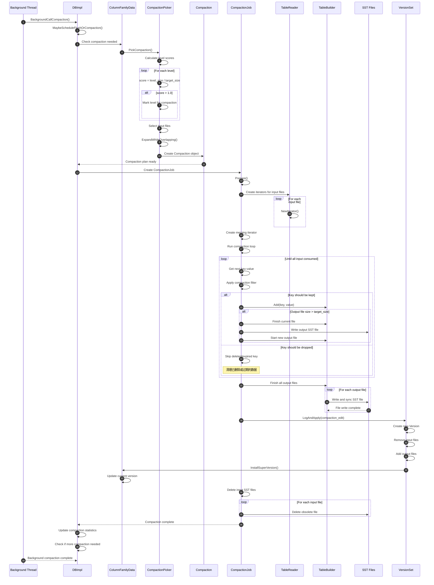

**Compaction时序详细说明**：

#### 触发策略
- **大小触发**：层级大小超过目标大小
- **文件数触发**：Level 0文件数量过多
- **手动触发**：用户调用CompactRange API
- **定期触发**：基于时间的周期性压缩

#### 优化机制
- **增量压缩**：只压缩需要的文件，不是整层压缩
- **并行子压缩**：大的压缩任务拆分为多个子任务并行执行
- **智能文件选择**：选择最优的输入文件组合，最小化写放大

## 5. 版本更新时序图

### 5.1 SuperVersion更新时序

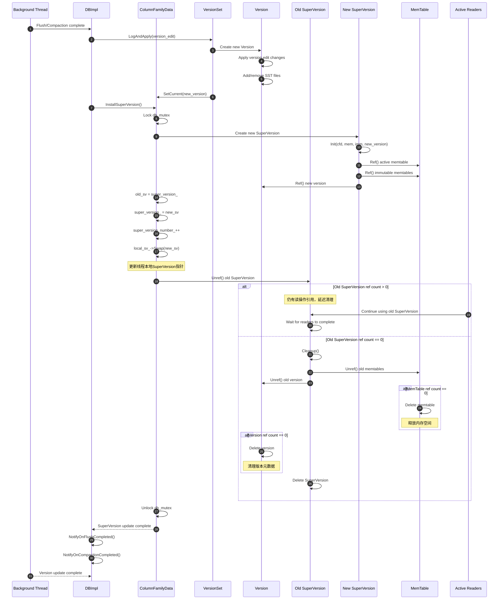

**SuperVersion更新说明**：

#### 更新原因
- **Flush完成**：新的SST文件加入，需要更新文件列表
- **Compaction完成**：文件合并，更新多层文件结构
- **配置变更**：列族选项改变，需要更新配置快照
- **MemTable切换**：活跃MemTable变为不可变状态

#### 并发安全
- **原子替换**：SuperVersion指针的原子替换保证一致性
- **引用计数**：通过引用计数确保旧版本在使用期间不被删除
- **线程本地缓存**：减少获取SuperVersion的锁竞争

## 6. 错误处理时序图

### 6.1 写入错误处理时序

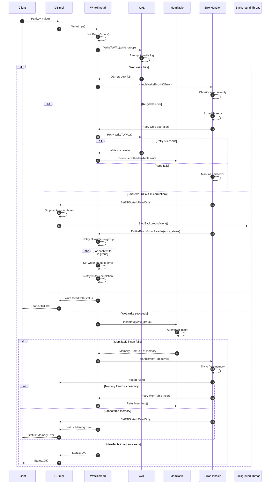

### 6.2 读取错误处理时序

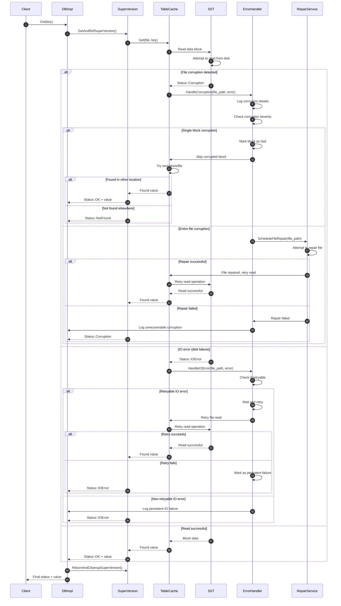

**错误处理设计原则**：

#### 错误分类
- **可重试错误**：临时网络故障、磁盘忙碌等
- **不可重试错误**：磁盘满、权限不足、数据损坏等
- **严重错误**：需要进入只读模式或停止服务

#### 恢复策略
- **优雅降级**：部分功能失败时保持其他功能可用
- **自动修复**：尝试自动修复可修复的错误
- **状态隔离**：错误不会影响其他正常的操作

#### 一致性保证
- **原子性**：错误发生时保证数据的原子性
- **持久性**：已提交的数据在错误后仍然持久化
- **隔离性**：错误处理不影响其他并发操作

通过这些详细的时序图，可以清楚地理解RocksDB DB模块各种操作的执行流程、组件交互和错误处理机制，为深入理解和优化RocksDB提供了重要参考。

---
