# RocksDB-02-Cache模块

## 模块概览

## 1. 模块职责与边界

### 核心职责
Cache模块是RocksDB的缓存系统核心，负责：

- **数据块缓存**：缓存从SST文件读取的数据块，减少磁盘I/O
- **索引和过滤器缓存**：缓存索引块和布隆过滤器，加速查找
- **内存管理**：统一管理缓存内存使用，支持容量限制和淘汰策略
- **多级缓存**：支持主缓存和二级缓存的分层存储架构
- **并发控制**：提供线程安全的缓存访问，支持高并发读写

### 输入输出接口
- **输入**：
  - 缓存键（CacheKey）：唯一标识缓存项的键
  - 缓存值（ObjectPtr）：要缓存的数据对象
  - 缓存选项（CacheOptions）：缓存配置参数
  - 优先级（Priority）：缓存项的重要程度
- **输出**：
  - 缓存句柄（Handle）：访问缓存项的句柄
  - 缓存统计（Statistics）：命中率、使用量等统计信息
  - 淘汰通知（EvictionCallback）：缓存项被淘汰时的回调

### 上下游依赖关系
- **上游调用方**：
  - DB模块：缓存数据块和索引
  - Table模块：缓存SST文件的块数据
  - Filter模块：缓存布隆过滤器
- **下游依赖**：
  - Memory模块：内存分配和管理
  - Hash模块：哈希函数和哈希表
  - Util模块：工具函数和数据结构

### 生命周期管理
1. **初始化阶段**：
   - 创建缓存实例（LRU或Clock缓存）
   - 设置容量和分片数量
   - 初始化二级缓存（如果配置）
2. **运行阶段**：
   - 处理查找、插入、删除请求
   - 执行淘汰策略维护容量限制
   - 收集统计信息
3. **关闭阶段**：
   - 清理所有缓存项
   - 释放内存资源
   - 保存统计信息

## 2. 模块架构图

```mermaid
flowchart TB
    subgraph "Cache Module Architecture"
        subgraph "Cache Interface Layer"
            CacheAPI[Cache API]
            BlockCache[Block Cache Interface]
            RowCache[Row Cache Interface]
        end
        
        subgraph "Cache Implementation"
            subgraph "Primary Cache"
                LRUCache[LRU Cache]
                ClockCache[HyperClock Cache]
                ShardedCache[Sharded Cache Base]
            end
            
            subgraph "Secondary Cache"
                SecondaryCache[Secondary Cache Interface]
                CompressedCache[Compressed Secondary Cache]
                TieredCache[Tiered Secondary Cache]
                SecondaryAdapter[Secondary Cache Adapter]
            end
            
            subgraph "Cache Utilities"
                CacheKey[Cache Key]
                CacheHelpers[Cache Helpers]
                CacheReservation[Cache Reservation Manager]
                ChargedCache[Charged Cache]
            end
        end
        
        subgraph "Storage and Management"
            subgraph "Hash Table"
                LRUHandleTable[LRU Handle Table]
                ClockHandleTable[Clock Handle Table]
            end
            
            subgraph "Memory Management"
                MemoryAllocator[Memory Allocator]
                CacheEntryRoles[Cache Entry Roles]
                UsageTracker[Usage Tracker]
            end
            
            subgraph "Eviction Policies"
                LRUEviction[LRU Eviction]
                ClockEviction[Clock Eviction]
                PriorityQueues[Priority Queues]
            end
        end
        
        subgraph "Monitoring and Statistics"
            CacheStats[Cache Statistics]
            EvictionCallback[Eviction Callback]
            CacheEntryStats[Cache Entry Statistics]
        end
    end
    
    subgraph "External Dependencies"
        TableReader[Table Reader]
        FilterPolicy[Filter Policy]
        BlockBuilder[Block Builder]
        Compressor[Compressor]
    end
    
    %% API Connections
    CacheAPI --> LRUCache
    CacheAPI --> ClockCache
    BlockCache --> ShardedCache
    RowCache --> ShardedCache
    
    %% Implementation Connections
    LRUCache --> LRUHandleTable
    LRUCache --> LRUEviction
    ClockCache --> ClockHandleTable
    ClockCache --> ClockEviction
    ShardedCache --> MemoryAllocator
    
    %% Secondary Cache Connections
    LRUCache --> SecondaryAdapter
    ClockCache --> SecondaryAdapter
    SecondaryAdapter --> CompressedCache
    SecondaryAdapter --> TieredCache
    
    %% Utility Connections
    LRUCache --> CacheKey
    ClockCache --> CacheKey
    ShardedCache --> CacheHelpers
    ShardedCache --> CacheReservation
    
    %% Management Connections
    LRUEviction --> PriorityQueues
    ClockEviction --> UsageTracker
    MemoryAllocator --> CacheEntryRoles
    
    %% Statistics Connections
    LRUCache --> CacheStats
    ClockCache --> CacheStats
    ShardedCache --> EvictionCallback
    CacheStats --> CacheEntryStats
    
    %% External Dependencies
    TableReader --> CacheAPI
    FilterPolicy --> BlockCache
    BlockBuilder --> CacheAPI
    Compressor --> CompressedCache
    
    classDef interfaceClass fill:#e3f2fd
    classDef primaryClass fill:#f3e5f5
    classDef secondaryClass fill:#e8f5e8
    classDef utilityClass fill:#fff3e0
    classDef storageClass fill:#fce4ec
    classDef monitoringClass fill:#f1f8e9
    classDef externalClass fill:#ffebee
    
    class CacheAPI,BlockCache,RowCache interfaceClass
    class LRUCache,ClockCache,ShardedCache primaryClass
    class SecondaryCache,CompressedCache,TieredCache,SecondaryAdapter secondaryClass
    class CacheKey,CacheHelpers,CacheReservation,ChargedCache utilityClass
    class LRUHandleTable,ClockHandleTable,MemoryAllocator,CacheEntryRoles,UsageTracker,LRUEviction,ClockEviction,PriorityQueues storageClass
    class CacheStats,EvictionCallback,CacheEntryStats monitoringClass
    class TableReader,FilterPolicy,BlockBuilder,Compressor externalClass
```

### 架构图详细说明

#### 接口层设计
- **统一API**：Cache接口提供统一的缓存操作方法
- **专用接口**：BlockCache和RowCache针对不同使用场景优化
- **类型安全**：通过模板和类型别名确保类型安全

#### 实现层分离
- **主缓存**：LRU和Clock缓存提供不同的淘汰策略
- **二级缓存**：支持压缩缓存和分层存储
- **分片设计**：通过分片减少锁竞争，提升并发性能

#### 存储管理
- **哈希表**：高效的键值查找和存储
- **内存管理**：统一的内存分配和使用跟踪
- **淘汰策略**：LRU和Clock算法的具体实现

#### 监控体系
- **统计收集**：详细的缓存使用统计
- **事件回调**：缓存事件的通知机制
- **性能监控**：命中率、延迟等关键指标

## 3. 核心算法与实现

### 3.1 LRU缓存算法

```cpp
// LRU缓存的核心数据结构
class LRUCacheShard {
private:
    // 双向链表节点
    struct LRUHandle {
        Cache::ObjectPtr value;              // 缓存值
        const Cache::CacheItemHelper* helper; // 缓存项辅助器
        LRUHandle* next_hash;               // 哈希链表指针
        LRUHandle* next;                    // LRU链表下一个节点
        LRUHandle* prev;                    // LRU链表上一个节点
        size_t total_charge;                // 总内存开销
        uint32_t hash;                      // 哈希值
        uint32_t refs;                      // 引用计数
        uint8_t m_flags;                    // 可变标志
        uint8_t im_flags;                   // 不可变标志
        char key_data[1];                   // 键数据（变长）
    };
    
    // 哈希表
    LRUHandleTable table_;
    
    // LRU链表头尾指针
    LRUHandle lru_;                         // 链表头（最近使用）
    LRUHandle* lru_low_pri_;               // 低优先级池头部
    LRUHandle* lru_bottom_pri_;            // 底部优先级池头部
    
    // 容量和使用量
    size_t capacity_;                       // 总容量
    size_t usage_;                         // 当前使用量
    size_t lru_usage_;                     // LRU链表使用量
    
    // 优先级池配置
    double high_pri_pool_ratio_;           // 高优先级池比例
    double low_pri_pool_ratio_;            // 低优先级池比例
    
    mutable DMutex mutex_;                 // 分布式互斥锁
    
public:
    // 查找操作
    Cache::Handle* Lookup(const Slice& key, uint32_t hash) {
        MutexLock l(&mutex_);
        LRUHandle* e = table_.Lookup(key, hash);
        if (e != nullptr) {
            // 命中：增加引用计数，从LRU链表中移除（如果在链表中）
            assert(e->InCache());
            if (!e->HasRefs()) {
                // 从LRU链表移到哈希表（仅引用状态）
                LRU_Remove(e);
            }
            e->Ref();
            e->SetHit();
        }
        return reinterpret_cast<Cache::Handle*>(e);
    }
    
    // 插入操作
    Status Insert(const Slice& key, uint32_t hash, Cache::ObjectPtr value,
                 const Cache::CacheItemHelper* helper, size_t charge,
                 Cache::Handle** handle, Cache::Priority priority) {
        
        MutexLock l(&mutex_);
        
        // 创建新的缓存项
        LRUHandle* e = reinterpret_cast<LRUHandle*>(
            malloc(sizeof(LRUHandle) - 1 + key.size()));
        e->value = value;
        e->helper = helper;
        e->total_charge = charge;
        e->key_length = key.size();
        e->hash = hash;
        e->refs = 0;  // 初始引用计数为0
        e->SetInCache(true);
        e->SetPriority(priority);
        memcpy(e->key_data, key.data(), key.size());
        
        // 检查容量限制
        if (usage_ + charge > capacity_ && strict_capacity_limit_) {
            // 严格容量限制：拒绝插入
            e->SetInCache(false);
            (*helper->del_cb)(e->key(), e->value);
            free(e);
            return Status::MemoryLimit("Insert failed due to capacity limit");
        }
        
        // 淘汰旧项以腾出空间
        while (usage_ + charge > capacity_ && lru_.next != &lru_) {
            LRUHandle* old = lru_.next;
            assert(!old->HasRefs());
            LRU_Remove(old);
            table_.Remove(old->key(), old->hash);
            old->SetInCache(false);
            usage_ -= old->total_charge;
            (*old->helper->del_cb)(old->key(), old->value);
            free(old);
        }
        
        // 插入到哈希表
        LRUHandle* old = table_.Insert(e);
        usage_ += charge;
        
        if (old != nullptr) {
            // 替换已存在的项
            old->SetInCache(false);
            if (!old->HasRefs()) {
                LRU_Remove(old);
            }
            (*old->helper->del_cb)(old->key(), old->value);
            free(old);
        }
        
        // 根据优先级插入到LRU链表
        if (handle == nullptr) {
            // 立即插入到LRU链表
            LRU_Insert(e);
        } else {
            // 返回句柄，延迟插入
            e->Ref();
            *handle = reinterpret_cast<Cache::Handle*>(e);
        }
        
        return Status::OK();
    }
    
private:
    // LRU链表操作
    void LRU_Remove(LRUHandle* e) {
        assert(e->next != nullptr);
        assert(e->prev != nullptr);
        e->next->prev = e->prev;
        e->prev->next = e->next;
        e->prev = e->next = nullptr;
        lru_usage_ -= e->total_charge;
    }
    
    void LRU_Insert(LRUHandle* e) {
        assert(e->next == nullptr);
        assert(e->prev == nullptr);
        
        // 根据优先级选择插入位置
        if (high_pri_pool_ratio_ > 0 && e->IsHighPri()) {
            // 高优先级：插入到高优先级池
            LRUHandle* head = &lru_;
            LRU_InsertAfter(head, e);
            e->SetInHighPriPool(true);
        } else if (low_pri_pool_ratio_ > 0 && e->IsLowPri()) {
            // 低优先级：插入到低优先级池
            LRU_InsertAfter(lru_low_pri_, e);
            e->SetInLowPriPool(true);
        } else {
            // 普通优先级：插入到普通区域
            LRU_InsertAfter(lru_low_pri_, e);
        }
        
        lru_usage_ += e->total_charge;
        
        // 维护优先级池边界
        MaintainPoolSize();
    }
    
    void LRU_InsertAfter(LRUHandle* pos, LRUHandle* e) {
        e->next = pos->next;
        e->prev = pos;
        pos->next->prev = e;
        pos->next = e;
    }
};
```

**LRU算法特点**：

- **时间复杂度**：查找O(1)，插入O(1)，删除O(1)
- **空间复杂度**：O(n)，其中n为缓存项数量
- **优先级支持**：高、普通、低三级优先级池
- **严格容量限制**：可配置是否严格遵守容量限制

### 3.2 HyperClock缓存算法

```cpp
// HyperClock缓存的核心数据结构
template <class Table>
class HyperClockCacheShard {
private:
    // 缓存项状态编码
    static constexpr uint64_t kStateEmpty = 0;
    static constexpr uint64_t kStateConstruction = 1;
    static constexpr uint64_t kStateVisible = 2;
    static constexpr uint64_t kStateInvisible = 3;
    
    // 引用计数和时钟计数器的编码
    static constexpr int kAcquireIncrement = 1 << 2;
    static constexpr int kReleaseIncrement = 1 << (2 + kCountdownBits);
    static constexpr uint64_t kMaxCountdown = (1 << kCountdownBits) - 1;
    
    Table table_;                           // 哈希表
    std::atomic<uint64_t> clock_pointer_;   // 时钟指针
    
public:
    // 查找操作（无锁）
    Cache::Handle* Lookup(const Slice& key, uint32_t hash) {
        size_t slot = table_.GetSlot(key, hash);
        typename Table::HandleImpl* h = table_.HandlePtr(slot);
        
        // 原子地增加acquire计数
        uint64_t old_meta = h->meta.fetch_add(kAcquireIncrement,
                                             std::memory_order_acquire);
        
        // 检查状态和键匹配
        if ((old_meta & kStateMask) == kStateVisible &&
            table_.KeyMatch(h, key)) {
            // 命中：更新时钟计数（最多到3）
            uint64_t countdown = (old_meta >> kCountdownShift) & kMaxCountdown;
            if (countdown < kMaxCountdown) {
                // 时钟计数未达到最大值，可以增加
                // （acquire操作已经增加了计数）
            }
            return reinterpret_cast<Cache::Handle*>(h);
        } else {
            // 未命中：回退acquire计数
            h->meta.fetch_sub(kAcquireIncrement, std::memory_order_release);
            return nullptr;
        }
    }
    
    // 插入操作
    Status Insert(const Slice& key, uint32_t hash, Cache::ObjectPtr value,
                 const Cache::CacheItemHelper* helper, size_t charge,
                 Cache::Handle** handle, Cache::Priority priority) {
        
        // 查找空闲槽或执行淘汰
        size_t slot = FindSlotForInsert(key, hash, charge);
        if (slot == kNoSlot) {
            return Status::MemoryLimit("Cache full");
        }
        
        typename Table::HandleImpl* h = table_.HandlePtr(slot);
        
        // 原子地切换到构造状态
        uint64_t old_meta = h->meta.exchange(kStateConstruction,
                                           std::memory_order_acquire);
        
        // 设置缓存项数据
        table_.SetKey(h, key);
        h->value = value;
        h->helper = helper;
        h->total_charge = charge;
        
        // 根据优先级设置初始时钟计数
        uint64_t initial_countdown;
        switch (priority) {
            case Cache::Priority::HIGH:
                initial_countdown = kMaxCountdown;
                break;
            case Cache::Priority::LOW:
                initial_countdown = 1;
                break;
            default:
                initial_countdown = kMaxCountdown / 2;
                break;
        }
        
        // 设置为可见状态
        uint64_t new_meta = kStateVisible | (initial_countdown << kCountdownShift);
        if (handle != nullptr) {
            // 返回句柄：增加引用计数
            new_meta += kAcquireIncrement;
            *handle = reinterpret_cast<Cache::Handle*>(h);
        }
        
        h->meta.store(new_meta, std::memory_order_release);
        
        // 更新使用量统计
        usage_.fetch_add(charge, std::memory_order_relaxed);
        
        return Status::OK();
    }
    
    // 释放操作（无锁）
    bool Release(Cache::Handle* handle, bool useful) {
        typename Table::HandleImpl* h =
            reinterpret_cast<typename Table::HandleImpl*>(handle);
            
        if (useful) {
            // 有用的释放：增加release计数
            h->meta.fetch_add(kReleaseIncrement, std::memory_order_release);
        } else {
            // 无用的释放：减少acquire计数（降低时钟计数）
            uint64_t old_meta = h->meta.fetch_sub(kAcquireIncrement,
                                                 std::memory_order_release);
            
            // 检查是否需要处理溢出
            if (UNLIKELY((old_meta >> kAcquireShift) == 0)) {
                // acquire计数下溢，需要特殊处理
                HandleAcquireUnderflow(h);
            }
        }
        
        return false;  // HyperClock不支持立即删除
    }
    
private:
    // 查找插入槽位（包含淘汰逻辑）
    size_t FindSlotForInsert(const Slice& key, uint32_t hash, size_t charge) {
        size_t start_slot = table_.GetSlot(key, hash);
        size_t slot = start_slot;
        
        // 线性探测查找空闲槽
        do {
            typename Table::HandleImpl* h = table_.HandlePtr(slot);
            uint64_t meta = h->meta.load(std::memory_order_acquire);
            
            if ((meta & kStateMask) == kStateEmpty) {
                // 找到空闲槽
                if (h->meta.compare_exchange_weak(meta, kStateConstruction,
                                                 std::memory_order_acquire)) {
                    return slot;
                }
                // CAS失败，继续查找
            }
            
            slot = table_.NextSlot(slot);
        } while (slot != start_slot);
        
        // 没有空闲槽，执行时钟淘汰
        return ClockEvict(charge);
    }
    
    // 时钟淘汰算法
    size_t ClockEvict(size_t needed_charge) {
        size_t start_clock = clock_pointer_.load(std::memory_order_relaxed);
        size_t clock_pos = start_clock;
        
        for (int effort = 0; effort < kMaxEvictionEffort; ++effort) {
            typename Table::HandleImpl* h = table_.HandlePtr(clock_pos);
            uint64_t meta = h->meta.load(std::memory_order_acquire);
            
            uint64_t state = meta & kStateMask;
            if (state == kStateVisible) {
                uint64_t acquire_count = (meta >> kAcquireShift) & kAcquireMask;
                uint64_t release_count = (meta >> kReleaseShift) & kReleaseMask;
                
                if (acquire_count == release_count) {
                    // 未被引用的项
                    uint64_t countdown = (meta >> kCountdownShift) & kMaxCountdown;
                    
                    if (countdown > 0) {
                        // 减少时钟计数
                        uint64_t new_meta = meta - (1ULL << kCountdownShift);
                        if (h->meta.compare_exchange_weak(meta, new_meta,
                                                         std::memory_order_release)) {
                            // 成功减少计数，继续查找
                        }
                    } else {
                        // 时钟计数为0，可以淘汰
                        if (h->meta.compare_exchange_weak(meta, kStateConstruction,
                                                         std::memory_order_acquire)) {
                            // 成功淘汰
                            FreeEntry(h);
                            clock_pointer_.store(table_.NextSlot(clock_pos),
                                               std::memory_order_relaxed);
                            return clock_pos;
                        }
                    }
                }
            }
            
            clock_pos = table_.NextSlot(clock_pos);
            if (clock_pos == start_clock) {
                // 完整遍历一轮
                break;
            }
        }
        
        // 淘汰失败
        return kNoSlot;
    }
};
```

**HyperClock算法特点**：

- **无锁设计**：查找和释放操作无需加锁，高并发性能优异
- **时钟淘汰**：使用改进的时钟算法，可能优于LRU
- **原子操作**：通过巧妙的位编码实现原子的引用计数和时钟更新
- **并行淘汰**：插入时的淘汰操作可以并行执行

### 3.3 二级缓存架构

```cpp
// 二级缓存适配器
class SecondaryCache {
public:
    virtual ~SecondaryCache() = default;
    
    // 查找接口（异步）
    virtual std::unique_ptr<SecondaryCacheResultHandle> Lookup(
        const Slice& key, const Cache::CacheItemHelper* helper,
        Cache::CreateContext* create_context, bool wait, bool advise_erase,
        Statistics* stats, bool& kept_in_sec_cache) = 0;
    
    // 插入接口
    virtual Status Insert(const Slice& key, Cache::ObjectPtr obj,
                         const Cache::CacheItemHelper* helper,
                         bool force_insert) = 0;
    
    // 擦除接口
    virtual void Erase(const Slice& key) = 0;
    
    // 等待异步操作完成
    virtual void WaitAll(std::vector<SecondaryCacheResultHandle*> handles) = 0;
    
    // 获取缓存名称
    virtual const char* Name() const = 0;
};

// 压缩二级缓存实现
class CompressedSecondaryCache : public SecondaryCache {
private:
    struct CacheValue {
        CompressionType compression_type;    // 压缩类型
        uint32_t uncompressed_size;         // 未压缩大小
        uint32_t compressed_size;           // 压缩大小
        char data[1];                       // 压缩数据
    };
    
    std::shared_ptr<Cache> cache_;          // 底层缓存
    CompressionType compression_type_;      // 压缩算法
    uint32_t compress_format_version_;      // 压缩格式版本
    
public:
    std::unique_ptr<SecondaryCacheResultHandle> Lookup(
        const Slice& key, const Cache::CacheItemHelper* helper,
        Cache::CreateContext* create_context, bool wait, bool advise_erase,
        Statistics* stats, bool& kept_in_sec_cache) override {
        
        // 从底层缓存查找压缩数据
        Cache::Handle* handle = cache_->Lookup(key);
        if (handle == nullptr) {
            return nullptr;
        }
        
        // 获取压缩数据
        CacheValue* cache_value =
            reinterpret_cast<CacheValue*>(cache_->Value(handle));
        
        // 创建异步解压缩任务
        return std::make_unique<CompressedSecondaryCacheResultHandle>(
            cache_.get(), handle, cache_value, helper, create_context);
    }
    
    Status Insert(const Slice& key, Cache::ObjectPtr obj,
                 const Cache::CacheItemHelper* helper,
                 bool force_insert) override {
        
        // 序列化对象
        size_t size = (*helper->size_cb)(obj);
        std::string serialized;
        serialized.resize(size);
        Status s = (*helper->saveto_cb)(obj, 0, size, serialized.data());
        if (!s.ok()) {
            return s;
        }
        
        // 压缩数据
        std::string compressed;
        CompressionInfo compression_info(
            CompressionOptions(), create_context,
            CompressionDict::GetEmptyDict(), compression_type_,
            compress_format_version_);
        
        bool compression_success = CompressData(
            serialized, compression_info, compress_format_version_, &compressed);
        
        if (!compression_success || compressed.size() >= serialized.size()) {
            // 压缩失败或压缩效果不好，存储原始数据
            compressed = std::move(serialized);
            compression_type = kNoCompression;
        }
        
        // 创建缓存值
        size_t cache_value_size = sizeof(CacheValue) - 1 + compressed.size();
        CacheValue* cache_value =
            reinterpret_cast<CacheValue*>(malloc(cache_value_size));
        
        cache_value->compression_type = compression_type;
        cache_value->uncompressed_size = static_cast<uint32_t>(serialized.size());
        cache_value->compressed_size = static_cast<uint32_t>(compressed.size());
        memcpy(cache_value->data, compressed.data(), compressed.size());
        
        // 插入到底层缓存
        Cache::Handle* handle = nullptr;
        s = cache_->Insert(key, cache_value, cache_value_size,
                          &compressed_secondary_cache_helper, &handle);
        
        if (handle != nullptr) {
            cache_->Release(handle);
        }
        
        return s;
    }
};
```

**二级缓存设计要点**：

- **异步操作**：支持异步查找和解压缩，不阻塞主线程
- **压缩存储**：通过压缩减少内存使用，提高缓存容量
- **分层架构**：主缓存未命中时自动查找二级缓存
- **类型安全**：通过CacheItemHelper确保类型安全的序列化和反序列化

## 4. 配置与优化

### 4.1 缓存配置选项

```cpp
// LRU缓存配置
struct LRUCacheOptions {
    size_t capacity = 0;                    // 缓存容量（字节）
    int num_shard_bits = -1;               // 分片位数（-1表示自动）
    bool strict_capacity_limit = false;     // 严格容量限制
    double high_pri_pool_ratio = 0.5;      // 高优先级池比例
    double low_pri_pool_ratio = 0.0;       // 低优先级池比例
    bool use_adaptive_mutex = kDefaultToAdaptiveMutex; // 自适应互斥锁
    CacheMetadataChargePolicy metadata_charge_policy =
        kDontChargeCacheMetadata;           // 元数据计费策略
    std::shared_ptr<MemoryAllocator> memory_allocator; // 内存分配器
    bool use_secondary_cache_insertion_policy = true; // 二级缓存插入策略
};

// HyperClock缓存配置
struct HyperClockCacheOptions {
    size_t capacity = 0;                    // 缓存容量
    size_t estimated_entry_charge = 0;      // 估计条目开销（0表示自动）
    int num_shard_bits = -1;               // 分片位数
    bool strict_capacity_limit = false;     // 严格容量限制
    CacheMetadataChargePolicy metadata_charge_policy =
        kDontChargeCacheMetadata;           // 元数据计费策略
    std::shared_ptr<MemoryAllocator> memory_allocator; // 内存分配器
    uint32_t hash_seed = 0;                // 哈希种子
    
    // HyperClock特有选项
    int eviction_effort_cap = 255;         // 淘汰努力上限
    
    std::shared_ptr<Cache> MakeSharedCache() const;
};
```

### 4.2 性能调优指南

```cpp
// 缓存性能优化配置
class CachePerformanceTuner {
public:
    // 根据工作负载特征选择缓存类型
    static std::shared_ptr<Cache> SelectOptimalCache(
        size_t capacity, const WorkloadCharacteristics& workload) {
        
        if (workload.high_concurrency && workload.read_heavy) {
            // 高并发读密集：选择HyperClock缓存
            HyperClockCacheOptions opts(capacity);
            opts.num_shard_bits = GetOptimalShardBits(capacity, workload.thread_count);
            opts.estimated_entry_charge = workload.avg_entry_size;
            return opts.MakeSharedCache();
        } else if (workload.priority_sensitive) {
            // 优先级敏感：选择LRU缓存
            LRUCacheOptions opts(capacity);
            opts.high_pri_pool_ratio = 0.8;  // 大部分空间给高优先级
            opts.low_pri_pool_ratio = 0.1;   // 少量空间给低优先级
            opts.num_shard_bits = GetOptimalShardBits(capacity, workload.thread_count);
            return NewLRUCache(opts);
        } else {
            // 默认选择：平衡的LRU缓存
            LRUCacheOptions opts(capacity);
            opts.high_pri_pool_ratio = 0.5;
            return NewLRUCache(opts);
        }
    }
    
    // 计算最优分片数
    static int GetOptimalShardBits(size_t capacity, int thread_count) {
        // 基于容量和线程数的启发式算法
        int shard_bits = 0;
        size_t min_shard_size = 32 << 20;  // 32MB最小分片大小
        
        while ((capacity >> shard_bits) > min_shard_size &&
               (1 << shard_bits) < thread_count) {
            shard_bits++;
        }
        
        return std::min(shard_bits, 6);  // 最多64个分片
    }
    
    // 配置二级缓存
    static void ConfigureSecondaryCache(LRUCacheOptions& opts,
                                       size_t secondary_capacity) {
        if (secondary_capacity > 0) {
            // 创建压缩二级缓存
            CompressedSecondaryCacheOptions sec_opts;
            sec_opts.capacity = secondary_capacity;
            sec_opts.compression_type = kLZ4Compression;  // 快速压缩
            sec_opts.compress_format_version = 2;
            
            opts.secondary_cache = NewCompressedSecondaryCache(sec_opts);
        }
    }
    
    // 运行时性能监控
    static void MonitorCachePerformance(std::shared_ptr<Cache> cache,
                                       Statistics* stats) {
        // 关键指标监控
        uint64_t hit_count = stats->getTickerCount(BLOCK_CACHE_HIT);
        uint64_t miss_count = stats->getTickerCount(BLOCK_CACHE_MISS);
        double hit_rate = static_cast<double>(hit_count) / (hit_count + miss_count);
        
        uint64_t usage = cache->GetUsage();
        uint64_t capacity = cache->GetCapacity();
        double usage_ratio = static_cast<double>(usage) / capacity;
        
        // 性能告警
        if (hit_rate < 0.8) {
            LOG_WARN("Low cache hit rate: %.2f%%", hit_rate * 100);
        }
        
        if (usage_ratio > 0.95) {
            LOG_WARN("Cache usage high: %.2f%%", usage_ratio * 100);
        }
        
        // 自动调优建议
        if (hit_rate < 0.7 && usage_ratio > 0.9) {
            LOG_INFO("Consider increasing cache capacity");
        }
    }
};
```

**性能优化要点**：

1. **缓存类型选择**：
   - 高并发读密集场景选择HyperClock缓存
   - 优先级敏感场景选择LRU缓存
   - 一般场景使用默认LRU配置

2. **分片数优化**：
   - 分片数应与线程数匹配
   - 避免分片过小导致内存碎片
   - 避免分片过多导致负载不均

3. **二级缓存配置**：
   - 根据内存预算配置压缩二级缓存
   - 选择合适的压缩算法平衡CPU和空间
   - 监控压缩率和解压缩延迟

4. **运行时监控**：
   - 监控缓存命中率和使用率
   - 设置性能告警阈值
   - 根据监控数据动态调优

通过这些详细的架构设计和算法实现，Cache模块为RocksDB提供了高效、可扩展的缓存服务，显著提升了数据库的读取性能。

---

## API接口

## 一、概述

Cache模块是RocksDB中负责管理内存缓存的核心组件，主要提供三类缓存功能：Block Cache（块缓存）、Row Cache（行缓存）和Table Cache（表缓存）。本文档深入分析Cache模块对外提供的核心API接口，包括LRUCache和HyperClockCache两种主要实现。

### 1.1 模块职责

- **数据缓存**：缓存SST文件中的数据块、索引块、过滤器块
- **元数据缓存**：缓存TableReader对象和文件元数据
- **行级缓存**：缓存完整的键值对（可选）
- **内存管理**：提供容量限制、淘汰策略和内存使用统计

### 1.2 主要API类别

1. **创建API**：创建和配置缓存实例
2. **存取API**：插入、查找、删除缓存条目
3. **管理API**：容量调整、统计信息、资源清理

---

## 二、核心API详解

### 2.1 Cache创建API

#### 2.1.1 NewLRUCache - 创建LRU缓存

**功能描述**

创建一个基于LRU淘汰策略的共享缓存实例，使用分片设计减少锁竞争，支持多级优先级队列。

**API签名**

```cpp
std::shared_ptr<Cache> NewLRUCache(
    size_t capacity,
    int num_shard_bits = -1,
    bool strict_capacity_limit = false,
    double high_pri_pool_ratio = 0.5,
    std::shared_ptr<MemoryAllocator> memory_allocator = nullptr,
    bool use_adaptive_mutex = kDefaultToAdaptiveMutex,
    CacheMetadataChargePolicy metadata_charge_policy = kDefaultCacheMetadataChargePolicy,
    double low_pri_pool_ratio = 0.0
);
```

**请求参数结构体**

| 参数名 | 类型 | 说明 |
|--------|------|------|
| capacity | size_t | 缓存容量（字节），所有条目的charge总和不应超过此值 |
| num_shard_bits | int | 分片数的2次幂（-1表示自动选择，推荐16-20） |
| strict_capacity_limit | bool | 是否严格限制容量，true时插入失败而非淘汰 |
| high_pri_pool_ratio | double | 高优先级池占比（0-1），默认0.5 |
| memory_allocator | shared_ptr | 自定义内存分配器，nullptr使用系统分配器 |
| use_adaptive_mutex | bool | 是否使用自适应互斥锁（高竞争下自旋） |
| metadata_charge_policy | enum | 元数据计费策略：kDontChargeCacheMetadata或kFullChargeCacheMetadata |
| low_pri_pool_ratio | double | 低优先级池占比（0-1），默认0.0 |

**响应结构体**

返回 `std::shared_ptr<Cache>` 指针，指向创建的LRUCache实例。如果创建失败返回nullptr。

**核心实现代码**

```cpp
// cache/lru_cache.cc
std::shared_ptr<Cache> NewLRUCache(
    size_t capacity, int num_shard_bits, bool strict_capacity_limit,
    double high_pri_pool_ratio, std::shared_ptr<MemoryAllocator> allocator,
    bool use_adaptive_mutex, CacheMetadataChargePolicy metadata_charge_policy,
    double low_pri_pool_ratio) {
  
  // 验证参数合法性
  if (num_shard_bits < 0) {
    num_shard_bits = GetDefaultCacheShardBits(capacity);
  }
  if (num_shard_bits >= 20) {
    return nullptr;  // 分片数过多
  }
  if (high_pri_pool_ratio < 0.0 || high_pri_pool_ratio > 1.0) {
    return nullptr;
  }
  if (low_pri_pool_ratio < 0.0 || low_pri_pool_ratio > 1.0) {
    return nullptr;
  }
  if (high_pri_pool_ratio + low_pri_pool_ratio > 1.0) {
    return nullptr;
  }

  // 创建LRUCache实例
  return std::make_shared<LRUCache>(
      capacity, num_shard_bits, strict_capacity_limit, high_pri_pool_ratio,
      allocator, use_adaptive_mutex, metadata_charge_policy, low_pri_pool_ratio);
}
```

**调用链路分析**

1. **用户调用层**：`Options::block_cache = NewLRUCache(8GB)`
2. **工厂函数层**：`NewLRUCache` 验证参数并构造LRUCache对象
3. **构造函数层**：`LRUCache::LRUCache` 初始化分片数组
4. **分片初始化层**：为每个分片创建 `LRUCacheShard` 对象
5. **内存分配层**：分配LRU链表和哈希表的内存空间

**上游调用函数**

```cpp
// db/db_impl/db_impl_open.cc - 数据库打开时初始化缓存
Status DBImpl::Open(const DBOptions& db_options,
                    const std::string& dbname,
                    const std::vector<ColumnFamilyDescriptor>& column_families,
                    std::vector<ColumnFamilyHandle*>* handles,
                    DB** dbptr) {
  // 如果用户未指定block_cache，创建默认缓存
  if (db_options.table_cache_numshardbits == -1 &&
      !db_options.block_cache) {
    size_t cache_size = 8 * 1024 * 1024;  // 默认8MB
    db_options.block_cache = NewLRUCache(cache_size);
  }
  
  // 将缓存传递给TableCache
  table_cache_ = new TableCache(immutable_db_options_,
                                 db_options.block_cache);
  return Status::OK();
}
```

**时序图**

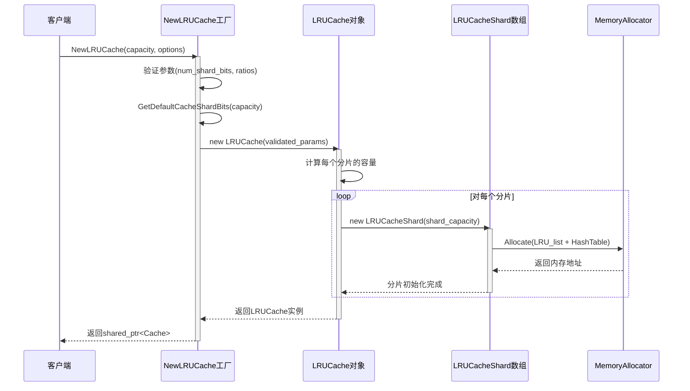

**详细说明**

- **目的**：该API是创建Block Cache的主要入口，支持丰富的配置选项以适应不同的工作负载。
- **边界条件**：
  - capacity为0时创建空缓存，所有插入立即淘汰
  - num_shard_bits超过20时返回nullptr避免过多分片
  - 优先级池比例之和超过1.0时返回nullptr
- **异常路径**：参数验证失败返回nullptr，调用方需检查返回值
- **性能考量**：
  - 分片数建议为CPU核心数的2-4倍，减少锁竞争
  - 高优先级池用于索引块和过滤器块，确保热数据不被淘汰
  - 自适应互斥锁在高并发场景下提升性能
- **容量假设**：推荐配置为SST文件总大小的10-50%，典型值8GB-64GB
- **版本兼容性**：从RocksDB 4.0开始支持，所有后续版本保持兼容

---

#### 2.1.2 NewHyperClockCache - 创建HyperClock缓存

**功能描述**

创建基于CLOCK淘汰算法的高性能缓存实例，针对高并发读密集场景优化，使用无锁/无等待设计。

**API签名**

```cpp
std::shared_ptr<Cache> HyperClockCacheOptions::MakeSharedCache() const;

// 配置结构体
struct HyperClockCacheOptions : public ShardedCacheOptions {
  size_t estimated_entry_charge = 0;
  bool use_secondary_cache_adapter_for_nvm_tier = true;
};
```

**请求参数结构体**

| 参数名 | 类型 | 说明 |
|--------|------|------|
| capacity | size_t | 缓存容量（字节） |
| estimated_entry_charge | size_t | 每个条目的平均大小估算（字节），用于优化内存分配 |
| num_shard_bits | int | 分片数的2次幂，-1表示自动 |
| strict_capacity_limit | bool | 是否严格限制容量 |
| memory_allocator | shared_ptr | 自定义内存分配器 |
| secondary_cache | shared_ptr | 二级缓存（NVM层） |

**响应结构体**

返回 `std::shared_ptr<Cache>` 指针，指向创建的HyperClockCache实例。

**核心实现代码**

```cpp
// cache/clock_cache.cc
std::shared_ptr<Cache> HyperClockCacheOptions::MakeSharedCache() const {
  // HyperClockCache要求固定大小的key（16字节）
  if (capacity == 0) {
    return nullptr;
  }

  // 计算分片数
  int actual_shard_bits = num_shard_bits;
  if (actual_shard_bits < 0) {
    actual_shard_bits = GetDefaultCacheShardBits(capacity);
  }

  // 计算每个分片的容量
  size_t per_shard_capacity = capacity >> actual_shard_bits;
  
  // 估算每个分片的槽位数
  size_t estimated_slots;
  if (estimated_entry_charge > 0) {
    estimated_slots = (per_shard_capacity + estimated_entry_charge - 1) /
                      estimated_entry_charge;
  } else {
    estimated_slots = per_shard_capacity / 256;  // 假设平均256字节
  }

  // 创建HyperClockCache实例
  return std::make_shared<HyperClockCache>(
      capacity, estimated_slots, actual_shard_bits,
      strict_capacity_limit, memory_allocator, secondary_cache);
}
```

**调用链路分析**

1. **配置层**：用户创建 `HyperClockCacheOptions` 并设置参数
2. **工厂层**：调用 `MakeSharedCache()` 创建缓存实例
3. **构造层**：`HyperClockCache` 构造函数初始化分片
4. **槽位分配层**：每个分片分配固定大小的槽位数组（CLOCK环）
5. **原子初始化层**：初始化无锁数据结构（原子计数器、标志位）

**上游调用函数**

```cpp
// options/options_helper.cc - 从配置字符串创建缓存
Status GetCacheFromString(const ConfigOptions& config_options,
                          const std::string& value,
                          std::shared_ptr<Cache>* cache) {
  if (value.find("hyper_clock_cache") != std::string::npos) {
    HyperClockCacheOptions hc_options;
    ParseOptionsFromString(value, &hc_options);
    *cache = hc_options.MakeSharedCache();
    return Status::OK();
  }
  // ...其他缓存类型
}
```

**时序图**

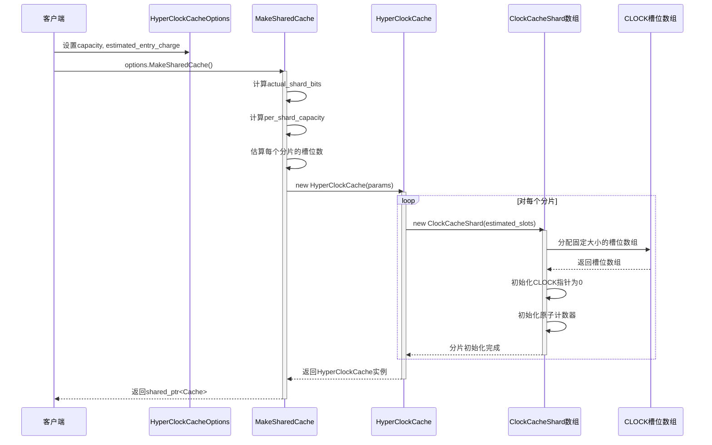

**详细说明**

- **目的**：为读密集、高并发场景提供低延迟缓存，避免互斥锁开销。
- **边界条件**：
  - estimated_entry_charge为0时使用默认值256字节
  - 槽位数过少时可能导致频繁淘汰
  - 仅支持16字节固定大小的key（Block Cache key格式）
- **异常路径**：capacity为0或参数不合法时返回nullptr
- **性能考量**：
  - 无锁设计：Lookup操作无需加锁，仅使用原子操作
  - CLOCK淘汰：比LRU更快，避免维护链表
  - 固定槽位：避免动态内存分配
- **容量假设**：推荐用于8GB以上的大容量缓存
- **版本兼容性**：RocksDB 7.0+ 引入，7.10+ 稳定推荐使用

---

### 2.2 数据操作API

#### 2.2.1 Insert - 插入缓存条目

**功能描述**

将键值对插入缓存，指定charge（计费大小）和优先级。如果缓存已满，根据淘汰策略移除旧条目。

**API签名**

```cpp
Status Cache::Insert(
    const Slice& key,
    ObjectPtr value,
    const CacheItemHelper* helper,
    size_t charge,
    Handle** handle = nullptr,
    Priority priority = Priority::LOW,
    const Slice& compressed_value = Slice(),
    CompressionType type = CompressionType::kNoCompression
);
```

**请求参数结构体**

| 参数名 | 类型 | 说明 |
|--------|------|------|
| key | const Slice& | 缓存键（Block Cache中为16字节：file_number + offset） |
| value | ObjectPtr | 指向缓存对象的指针（void*） |
| helper | const CacheItemHelper* | 帮助器，包含deleter和size函数 |
| charge | size_t | 该条目占用的容量（字节） |
| handle | Handle** | 可选输出参数，返回插入条目的句柄（需调用Release） |
| priority | Priority | 优先级：HIGH/LOW/BOTTOM，影响淘汰顺序 |
| compressed_value | const Slice& | 压缩后的值（用于二级缓存） |
| type | CompressionType | 压缩类型 |

**响应结构体**

| 字段 | 类型 | 说明 |
|------|------|------|
| 返回值 | Status | OK表示成功，Incomplete表示容量不足且strict_capacity_limit=true |
| handle | Handle* | 指向插入条目的句柄，nullptr表示未请求句柄 |

**核心实现代码**

```cpp
// cache/lru_cache.cc - LRUCacheShard::Insert
Status LRUCacheShard::Insert(const Slice& key, uint32_t hash,
                              ObjectPtr value, size_t charge,
                              Cache::DeleterFn deleter,
                              Cache::Handle** handle,
                              Cache::Priority priority) {
  // 创建新的LRU句柄
  LRUHandle* e = reinterpret_cast<LRUHandle*>(
      new char[sizeof(LRUHandle) - 1 + key.size()]);
  e->value = value;
  e->deleter = deleter;
  e->charge = charge;
  e->key_length = key.size();
  e->hash = hash;
  e->refs = 0;  // 引用计数
  e->next = e->prev = nullptr;
  e->SetInCache(true);
  e->SetPriority(priority);
  memcpy(e->key_data, key.data(), key.size());

  // 持有互斥锁进行插入
  autovector<LRUHandle*> last_reference_list;
  {
    DMutexLock l(&mutex_);
    
    // 如果缓存已满，进行淘汰
    while (usage_ + charge > capacity_ && lru_.next != &lru_) {
      LRUHandle* old = lru_.next;
      LRU_Remove(old);
      table_.Remove(old->key(), old->hash);
      old->SetInCache(false);
      usage_ -= old->charge;
      last_reference_list.push_back(old);
    }

    // 检查是否有足够空间
    if (strict_capacity_limit_ && usage_ + charge > capacity_) {
      e->SetInCache(false);
      delete[] reinterpret_cast<char*>(e);
      return Status::Incomplete("Cache capacity insufficient");
    }

    // 插入到哈希表和LRU链表
    LRUHandle* old = table_.Insert(e);
    usage_ += charge;
    if (old != nullptr) {
      // 已存在同key条目，移除旧条目
      LRU_Remove(old);
      old->SetInCache(false);
      usage_ -= old->charge;
      last_reference_list.push_back(old);
    }

    // 插入到LRU链表的适当位置
    if (priority == Cache::Priority::HIGH) {
      LRU_Insert(&lru_high_pri_, e);
    } else if (priority == Cache::Priority::LOW) {
      LRU_Insert(&lru_low_pri_, e);
    } else {
      LRU_Insert(&lru_, e);
    }

    // 如果调用方需要句柄，增加引用计数
    if (handle != nullptr) {
      e->refs++;
      *handle = reinterpret_cast<Cache::Handle*>(e);
    }
  }

  // 在锁外删除淘汰的条目（避免死锁）
  for (auto entry : last_reference_list) {
    entry->Free();
  }

  return Status::OK();
}
```

**调用链路分析**

1. **BlockBasedTable::GetDataBlockFromCache** - 尝试从缓存获取数据块
2. **BlockBasedTable::PutDataBlockToCache** - 读取SST文件后插入缓存
3. **Cache::Insert** - 通用缓存插入接口
4. **LRUCacheShard::Insert** - 分片级插入实现（根据key hash路由）
5. **HashTable::Insert** - 哈希表插入条目
6. **LRU_Insert** - 链表插入到头部或尾部

**上游调用函数**

```cpp
// table/block_based/block_based_table_reader.cc
Status BlockBasedTable::GetDataBlockFromCache(
    const ReadOptions& ro, const BlockHandle& handle,
    CachableEntry<Block>* block) {
  
  // 构造cache key
  char cache_key_buf[kMaxCacheKeyPrefixSize + kMaxVarint64Length];
  Slice cache_key = GetCacheKey(cache_key_buf, handle);

  // 尝试查找
  Cache::Handle* cache_handle = block_cache_->Lookup(cache_key);
  if (cache_handle == nullptr) {
    // 未命中，从SST文件读取
    BlockContents contents;
    Status s = ReadBlockFromFile(handle, &contents);
    
    // 解析Block
    Block* block = new Block(std::move(contents));
    
    // 插入缓存
    size_t charge = block->ApproximateMemoryUsage();
    Cache::Priority priority = Cache::Priority::LOW;
    s = block_cache_->Insert(cache_key, block, charge,
                              &DeleteCachedEntry<Block>,
                              &cache_handle, priority);
  }
  
  return Status::OK();
}
```

**时序图**

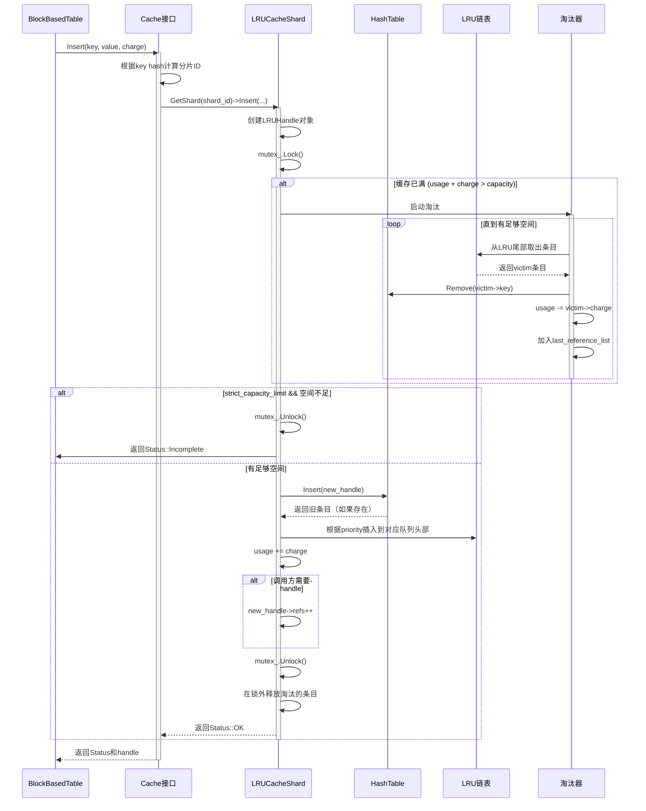

**详细说明**

- **目的**：将读取的数据块或索引块插入缓存，提升后续读取性能。
- **边界条件**：
  - charge为0的条目不占用容量但仍占用哈希表槽位
  - key已存在时替换旧值（LRU）或可能失败（HyperClock）
  - strict_capacity_limit时优先返回失败而非淘汰高优先级条目
- **异常路径**：
  - 容量不足且strict_capacity_limit=true：返回Incomplete
  - 内存分配失败：返回MemoryLimit错误
- **性能考量**：
  - 分片设计：每个分片独立加锁，减少竞争
  - 锁外释放：被淘汰条目在锁外调用deleter，避免死锁
  - 引用计数：正在使用的条目不会被淘汰
- **容量假设**：charge应为实际内存使用量，包括元数据和数据
- **版本兼容性**：从RocksDB 3.0开始支持Priority参数

---

#### 2.2.2 Lookup - 查找缓存条目

**功能描述**

根据key查找缓存条目。如果找到，返回句柄并增加引用计数；如果未找到，返回nullptr。

**API签名**

```cpp
Cache::Handle* Cache::Lookup(
    const Slice& key,
    const CacheItemHelper* helper = nullptr,
    CreateContext* create_context = nullptr,
    Priority priority = Priority::LOW,
    Statistics* stats = nullptr
);
```

**请求参数结构体**

| 参数名 | 类型 | 说明 |
|--------|------|------|
| key | const Slice& | 要查找的缓存键 |
| helper | const CacheItemHelper* | 帮助器（可选，用于二级缓存） |
| create_context | CreateContext* | 创建上下文（可选，用于二级缓存） |
| priority | Priority | 优先级提示（未命中时插入的优先级） |
| stats | Statistics* | 统计对象，记录命中/未命中 |

**响应结构体**

| 字段 | 类型 | 说明 |
|------|------|------|
| 返回值 | Handle* | 缓存句柄，nullptr表示未找到 |
| 引用计数 | 内部 | 找到时refs+1，必须调用Release释放 |

**核心实现代码**

```cpp
// cache/lru_cache.cc - LRUCacheShard::Lookup
Cache::Handle* LRUCacheShard::Lookup(const Slice& key, uint32_t hash) {
  LRUHandle* e = nullptr;
  {
    DMutexLock l(&mutex_);
    e = table_.Lookup(key, hash);
    if (e != nullptr) {
      assert(e->InCache());
      // 增加引用计数
      e->refs++;
      // 更新LRU位置（移到队列头部）
      LRU_Remove(e);
      if (e->GetPriority() == Cache::Priority::HIGH) {
        LRU_Insert(&lru_high_pri_, e);
      } else if (e->GetPriority() == Cache::Priority::LOW) {
        LRU_Insert(&lru_low_pri_, e);
      } else {
        LRU_Insert(&lru_, e);
      }
    }
  }
  
  // 更新统计信息
  if (e != nullptr) {
    RecordTick(statistics_, BLOCK_CACHE_HIT);
  } else {
    RecordTick(statistics_, BLOCK_CACHE_MISS);
  }
  
  return reinterpret_cast<Cache::Handle*>(e);
}
```

**调用链路分析**

1. **DBImpl::Get** - 用户发起Get请求
2. **BlockBasedTable::Get** - 读取SST文件
3. **BlockBasedTable::GetDataBlockFromCache** - 尝试从缓存获取
4. **Cache::Lookup** - 通用缓存查找接口
5. **LRUCacheShard::Lookup** - 分片级查找实现
6. **HashTable::Lookup** - 哈希表查找
7. **LRU_Remove + LRU_Insert** - 更新LRU位置（命中时移到头部）

**上游调用函数**

```cpp
// table/block_based/block_based_table_reader.cc
Status BlockBasedTable::GetDataBlockFromCache(
    const ReadOptions& ro, const BlockHandle& handle,
    CachableEntry<Block>* block) {
  
  // 构造cache key
  char cache_key_buf[kMaxCacheKeyPrefixSize + kMaxVarint64Length];
  Slice cache_key = GetCacheKey(cache_key_buf, handle);

  // 查找缓存
  Cache::Handle* cache_handle = block_cache_->Lookup(cache_key, statistics_);
  
  if (cache_handle != nullptr) {
    // 命中：从句柄获取Block指针
    Block* cached_block = reinterpret_cast<Block*>(
        block_cache_->Value(cache_handle));
    block->SetCachedValue(cached_block, block_cache_, cache_handle);
    return Status::OK();
  } else {
    // 未命中：从文件读取
    BlockContents contents;
    Status s = ReadBlockFromFile(handle, &contents);
    // ... 插入缓存 ...
    return s;
  }
}
```

**时序图**

```mermaid
sequenceDiagram
    participant Client as BlockBasedTable
    participant Cache as Cache接口
    participant Shard as LRUCacheShard
    participant HashTable as HashTable
    participant LRUList as LRU链表
    participant Stats as Statistics

    Client->>Cache: Lookup(key, stats)
    activate Cache
    Cache->>Cache: 计算key hash和分片ID
    Cache->>Shard: GetShard(shard_id)->Lookup(key, hash)
    activate Shard
    
    Shard->>Shard: mutex_.Lock()
    Shard->>HashTable: Lookup(key, hash)
    activate HashTable
    HashTable->>HashTable: 根据hash找到bucket
    HashTable->>HashTable: 遍历链表查找key
    
    alt 找到条目
        HashTable-->>Shard: 返回LRUHandle*
        deactivate HashTable
        
        Shard->>Shard: e->refs++ (增加引用计数)
        Shard->>LRUList: LRU_Remove(e) (从当前位置移除)
        Shard->>LRUList: LRU_Insert(head, e) (插入到队列头部)
        Shard->>Stats: RecordTick(BLOCK_CACHE_HIT)
        
        Shard->>Shard: mutex_.Unlock()
        Shard-->>Cache: 返回Handle*
        Cache-->>Client: 返回Handle*
        
        Note over Client: 使用Value(handle)获取数据
        Note over Client: 使用完后必须调用Release(handle)
        
    else 未找到
        HashTable-->>Shard: 返回nullptr
        deactivate HashTable
        
        Shard->>Stats: RecordTick(BLOCK_CACHE_MISS)
        Shard->>Shard: mutex_.Unlock()
        Shard-->>Cache: 返回nullptr
        Cache-->>Client: 返回nullptr
        
        Note over Client: 从SST文件读取数据
        Note over Client: 调用Insert插入缓存
    end
    
    deactivate Shard
    deactivate Cache
```

**详细说明**

- **目的**：快速查找缓存条目，避免磁盘I/O，提升读取性能。
- **边界条件**：
  - key不存在时返回nullptr
  - 条目正在被淘汰时（refs=0且InCache=false）视为不存在
- **异常路径**：无异常，nullptr是合法返回值表示未命中
- **性能考量**：
  - LRU更新：命中时需要移动链表节点，O(1)时间
  - HyperClockCache：Lookup无需加锁，仅使用原子操作，更快
  - 引用计数：防止条目在使用中被淘汰
- **容量假设**：无特殊要求
- **版本兼容性**：所有版本支持

---

#### 2.2.3 Release - 释放缓存句柄

**功能描述**

释放通过Lookup或Insert获取的缓存句柄，减少引用计数。当引用计数降为0且条目已被标记为淘汰时，释放内存。

**API签名**

```cpp
bool Cache::Release(
    Handle* handle,
    bool useful = true,
    bool erase_if_last_ref = false
);
```

**请求参数结构体**

| 参数名 | 类型 | 说明 |
|--------|------|------|
| handle | Handle* | 要释放的缓存句柄（由Lookup或Insert返回） |
| useful | bool | 该条目是否有用（影响优先级调整） |
| erase_if_last_ref | bool | 如果这是最后一个引用，是否立即删除条目 |

**响应结构体**

| 字段 | 类型 | 说明 |
|------|------|------|
| 返回值 | bool | true表示条目已被删除，false表示仍在缓存中 |

**核心实现代码**

```cpp
// cache/lru_cache.cc - LRUCacheShard::Release
bool LRUCacheShard::Release(Handle* handle, bool useful,
                            bool erase_if_last_ref) {
  if (handle == nullptr) {
    return false;
  }
  
  LRUHandle* e = reinterpret_cast<LRUHandle*>(handle);
  bool last_reference = false;
  bool erased = false;
  
  {
    DMutexLock l(&mutex_);
    // 减少引用计数
    e->refs--;
    assert(e->refs >= 0);
    
    // 如果useful=false，降低优先级
    if (!useful && e->GetPriority() == Cache::Priority::HIGH) {
      e->SetPriority(Cache::Priority::LOW);
      LRU_Remove(e);
      LRU_Insert(&lru_low_pri_, e);
    }
    
    // 检查是否是最后一个引用
    if (e->refs == 0) {
      last_reference = true;
      if (!e->InCache() || erase_if_last_ref) {
        // 条目已不在缓存中或需要立即删除
        usage_ -= e->charge;
        if (e->InCache()) {
          LRU_Remove(e);
          table_.Remove(e->key(), e->hash);
          e->SetInCache(false);
        }
        erased = true;
      }
    }
  }
  
  // 在锁外释放内存
  if (last_reference && erased) {
    e->Free();
  }
  
  return erased;
}
```

**调用链路分析**

1. **BlockBasedTable::GetDataBlockFromCache** - 使用完缓存条目
2. **CachableEntry::~CachableEntry** - 析构函数自动释放
3. **Cache::Release** - 通用释放接口
4. **LRUCacheShard::Release** - 分片级释放实现
5. **LRUHandle::Free** - 调用deleter释放value内存

**上游调用函数**

```cpp
// table/block_based/block_based_table_reader.cc
// CachableEntry的RAII封装自动管理Release
template <typename T>
class CachableEntry {
 public:
  ~CachableEntry() {
    if (cache_handle_ != nullptr && cache_ != nullptr) {
      cache_->Release(cache_handle_);
    }
  }
  
  void SetCachedValue(T* value, Cache* cache, Cache::Handle* handle) {
    value_ = value;
    cache_ = cache;
    cache_handle_ = handle;
  }
  
 private:
  T* value_ = nullptr;
  Cache* cache_ = nullptr;
  Cache::Handle* cache_handle_ = nullptr;
};

// 使用示例
Status BlockBasedTable::Get(const ReadOptions& ro, const Slice& key,
                             GetContext* get_context) {
  CachableEntry<Block> block;
  // Lookup会设置cache_handle_
  Status s = GetDataBlockFromCache(ro, handle, &block);
  
  if (s.ok()) {
    // 使用block.GetValue()访问数据
    s = block.GetValue()->Get(key, get_context);
  }
  
  // 析构函数自动调用Release
  return s;
}
```

**时序图**

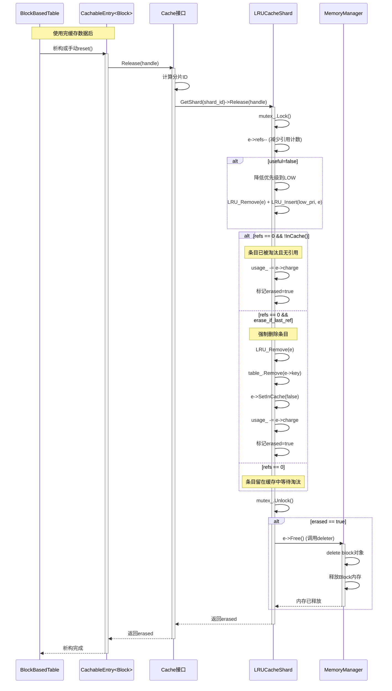

**详细说明**

- **目的**：安全释放缓存条目，管理引用计数，避免内存泄漏和悬垂指针。
- **边界条件**：
  - handle为nullptr时直接返回false
  - refs为0且InCache=false时释放内存
  - erase_if_last_ref强制删除（用于显式驱逐场景）
- **异常路径**：无异常，对nullptr的容错处理
- **性能考量**：
  - 锁外释放：在锁外调用deleter，避免在持锁时执行耗时操作
  - RAII封装：CachableEntry自动管理生命周期，防止忘记Release
  - 引用计数：防止条目在使用中被释放
- **容量假设**：无特殊要求
- **版本兼容性**：所有版本支持

---

#### 2.2.4 Erase - 删除缓存条目

**功能描述**

根据key立即从缓存中删除条目。如果条目正在被引用（refs > 0），标记为不在缓存中，等待最后一个引用释放后才释放内存。

**API签名**

```cpp
void Cache::Erase(const Slice& key);
```

**请求参数结构体**

| 参数名 | 类型 | 说明 |
|--------|------|------|
| key | const Slice& | 要删除的缓存键 |

**响应结构体**

无返回值（void），总是成功（即使key不存在）。

**核心实现代码**

```cpp
// cache/lru_cache.cc - LRUCacheShard::Erase
void LRUCacheShard::Erase(const Slice& key, uint32_t hash) {
  LRUHandle* e = nullptr;
  bool last_reference = false;
  
  {
    DMutexLock l(&mutex_);
    e = table_.Remove(key, hash);
    if (e != nullptr) {
      assert(e->InCache());
      e->SetInCache(false);
      LRU_Remove(e);
      usage_ -= e->charge;
      
      // 减少引用计数（去除缓存本身的引用）
      e->refs--;
      if (e->refs == 0) {
        last_reference = true;
      }
    }
  }
  
  // 在锁外释放内存
  if (last_reference) {
    e->Free();
  }
}
```

**调用链路分析**

1. **DBImpl::CompactRange** - 压缩完成后
2. **TableCache::Evict** - 驱逐已删除的SST文件对应的缓存
3. **Cache::Erase** - 通用删除接口
4. **LRUCacheShard::Erase** - 分片级删除实现
5. **HashTable::Remove** - 从哈希表移除
6. **LRU_Remove** - 从LRU链表移除

**上游调用函数**

```cpp
// db/table_cache.cc - 文件删除后清理缓存
void TableCache::Evict(uint64_t file_number) {
  char cache_key_buf[16];
  EncodeFixed64(cache_key_buf, file_number);
  Slice cache_key(cache_key_buf, sizeof(cache_key_buf));
  
  // 从table cache中删除
  cache_->Erase(cache_key);
}
```

**时序图**

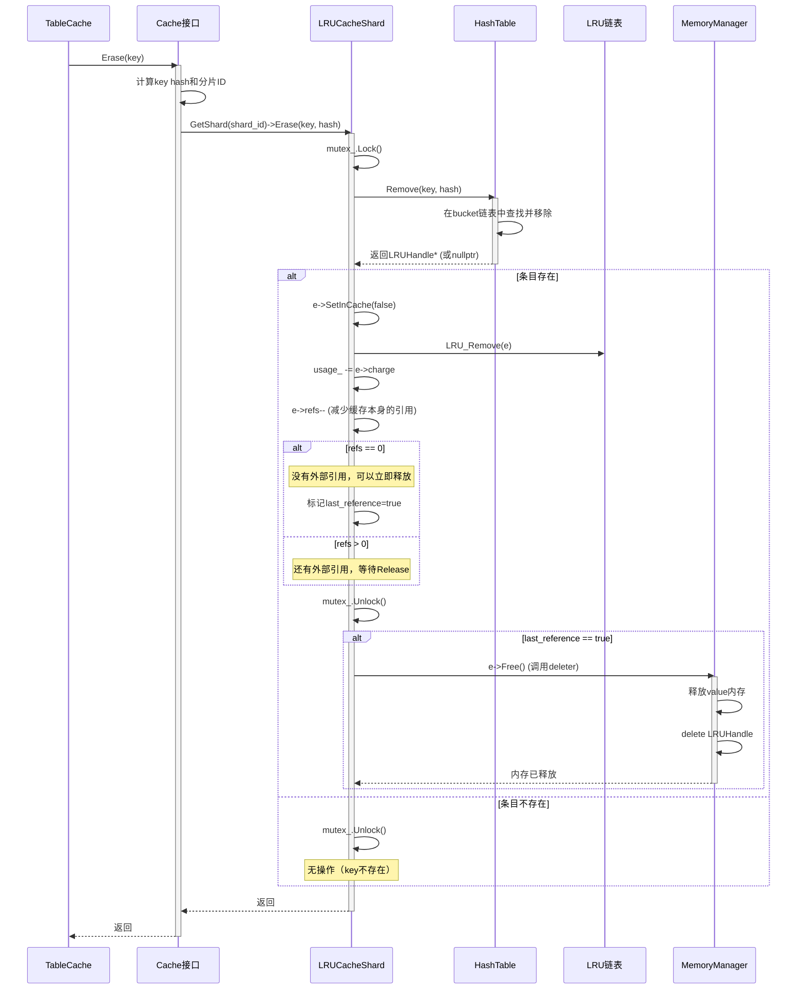

**详细说明**

- **目的**：显式删除缓存条目，用于文件删除、表淘汰等场景。
- **边界条件**：
  - key不存在时无操作
  - 条目正在使用时（refs > 0）延迟释放内存
- **异常路径**：无异常，总是成功
- **性能考量**：
  - 延迟释放：正在使用的条目标记为!InCache，等待Release时释放
  - 锁外操作：在锁外调用deleter，避免死锁
- **容量假设**：无特殊要求
- **版本兼容性**：所有版本支持

---

### 2.3 管理API

#### 2.3.1 SetCapacity - 动态调整容量

**功能描述**

在运行时动态调整缓存容量，可以扩大或缩小。缩小时会触发淘汰以满足新容量限制。

**API签名**

```cpp
void Cache::SetCapacity(size_t capacity);
```

**请求参数结构体**

| 参数名 | 类型 | 说明 |
|--------|------|------|
| capacity | size_t | 新的缓存容量（字节） |

**响应结构体**

无返回值（void），总是成功。

**核心实现代码**

```cpp
// cache/lru_cache.cc - LRUCacheShard::SetCapacity
void LRUCacheShard::SetCapacity(size_t capacity) {
  autovector<LRUHandle*> last_reference_list;
  
  {
    DMutexLock l(&mutex_);
    capacity_ = capacity;
    
    // 如果新容量更小，淘汰多余条目
    while (usage_ > capacity_ && lru_.next != &lru_) {
      LRUHandle* old = lru_.next;
      assert(old->refs == 0);  // 只淘汰无引用的条目
      
      LRU_Remove(old);
      table_.Remove(old->key(), old->hash);
      old->SetInCache(false);
      usage_ -= old->charge;
      last_reference_list.push_back(old);
    }
  }
  
  // 在锁外释放淘汰的条目
  for (auto entry : last_reference_list) {
    entry->Free();
  }
}
```

**调用链路分析**

1. **DBImpl::SetOptions** - 用户动态修改配置
2. **Options::block_cache->SetCapacity** - 调整缓存容量
3. **ShardedCache::SetCapacity** - 更新所有分片容量
4. **LRUCacheShard::SetCapacity** - 分片级容量调整

**时序图**

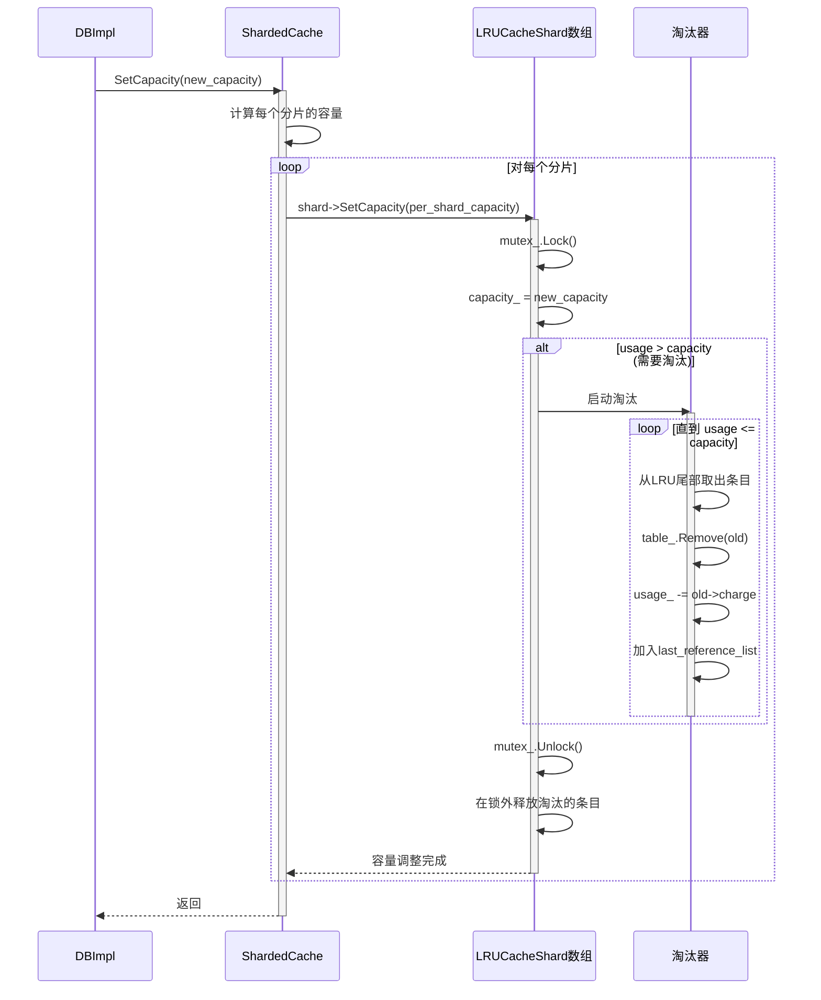

**详细说明**

- **目的**：根据工作负载动态调整缓存大小，优化内存使用。
- **边界条件**：
  - 扩大容量时立即生效，不触发淘汰
  - 缩小容量时淘汰LRU尾部的无引用条目
  - 正在使用的条目（refs > 0）不会被淘汰，可能导致usage > capacity
- **异常路径**：无异常
- **性能考量**：
  - 锁粒度：每个分片独立调整，不阻塞其他分片
  - 淘汰开销：缩小容量时可能需要淘汰大量条目
- **容量假设**：新容量应大于0
- **版本兼容性**：所有版本支持

---

#### 2.3.2 GetUsage - 获取当前使用量

**功能描述**

返回缓存当前的内存使用量（所有条目charge的总和）。

**API签名**

```cpp
size_t Cache::GetUsage() const;
```

**请求参数结构体**

无参数。

**响应结构体**

| 字段 | 类型 | 说明 |
|------|------|------|
| 返回值 | size_t | 当前使用的内存量（字节） |

**核心实现代码**

```cpp
// cache/lru_cache.cc - LRUCacheShard::GetUsage
size_t LRUCacheShard::GetUsage() const {
  DMutexLock l(&mutex_);
  return usage_;
}

// cache/sharded_cache.h - ShardedCache::GetUsage
size_t ShardedCache::GetUsage() const {
  size_t total_usage = 0;
  for (int i = 0; i < num_shards_; i++) {
    total_usage += shards_[i]->GetUsage();
  }
  return total_usage;
}
```

**详细说明**

- **目的**：监控缓存使用情况，用于统计和容量规划。
- **边界条件**：可能略大于capacity（当有条目正在使用时）
- **异常路径**：无异常
- **性能考量**：需要遍历所有分片并加锁，开销较小
- **容量假设**：无
- **版本兼容性**：所有版本支持

---

#### 2.3.3 GetPinnedUsage - 获取固定内存使用量

**功能描述**

返回当前被外部引用（pinned）的条目占用的内存量。

**API签名**

```cpp
size_t Cache::GetPinnedUsage() const;
```

**响应结构体**

| 字段 | 类型 | 说明 |
|------|------|------|
| 返回值 | size_t | 被引用条目的内存总量（字节） |

**核心实现代码**

```cpp
// cache/lru_cache.cc - LRUCacheShard::GetPinnedUsage
size_t LRUCacheShard::GetPinnedUsage() const {
  DMutexLock l(&mutex_);
  
  // 遍历哈希表统计refs>0的条目
  size_t pinned_usage = 0;
  for (LRUHandle* e : table_) {
    if (e->refs > 0) {
      pinned_usage += e->charge;
    }
  }
  return pinned_usage;
}
```

**详细说明**

- **目的**：监控有多少内存被外部持有，无法淘汰。
- **边界条件**：pinned_usage <= usage
- **异常路径**：无异常
- **性能考量**：需要遍历哈希表，开销较大，不建议频繁调用
- **容量假设**：无
- **版本兼容性**：RocksDB 5.0+ 支持

---

## 三、数据结构详解

### 3.1 LRUHandle - LRU句柄

**UML类图**

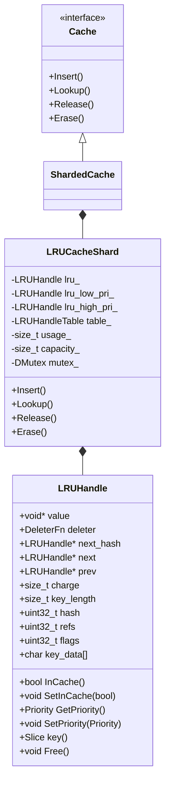

**字段说明**

| 字段 | 类型 | 说明 | 约束 |
|------|------|------|------|
| value | void* | 指向实际缓存对象的指针 | 非空 |
| deleter | DeleterFn | 释放value的函数指针 | 非空 |
| next_hash | LRUHandle* | 哈希表链表指针 | 可空 |
| next/prev | LRUHandle* | LRU链表前后指针 | 非空 |
| charge | size_t | 该条目占用的容量 | >= 0 |
| key_length | size_t | key的长度 | > 0 |
| hash | uint32_t | key的哈希值 | - |
| refs | uint32_t | 引用计数 | >= 0 |
| flags | uint32_t | 标志位（InCache, Priority） | - |
| key_data | char[] | 柔性数组，存储key内容 | - |

**关键约束**

- refs > 0时条目不会被淘汰
- InCache=false时条目不在缓存中，等待释放
- key_length必须与key_data实际长度一致

---

### 3.2 HyperClockHandle - HyperClock句柄

**UML类图**

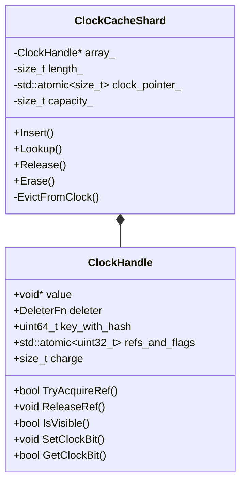

**字段说明**

| 字段 | 类型 | 说明 | 约束 |
|------|------|------|------|
| value | void* | 缓存对象指针 | 非空 |
| key_with_hash | uint64_t | 压缩的key（16字节压缩为8字节） | 固定格式 |
| refs_and_flags | atomic<uint32_t> | 原子引用计数+标志位 | 无锁 |
| charge | size_t | 容量占用 | >= 0 |

**关键约束**

- key必须为16字节固定长度
- refs_and_flags低28位为引用计数，高4位为标志位
- 所有修改使用原子操作，无需互斥锁

---

## 四、使用示例与最佳实践

### 4.1 基本使用示例

```cpp
#include "rocksdb/db.h"
#include "rocksdb/cache.h"

// 示例1：创建LRU缓存并配置到数据库
void Example1_CreateLRUCache() {
  // 创建8GB的LRU缓存
  std::shared_ptr<rocksdb::Cache> cache = rocksdb::NewLRUCache(
      8 * 1024 * 1024 * 1024ULL,  // 8GB
      -1,                         // 自动选择分片数
      false,                      // 非严格容量限制
      0.5                         // 50%高优先级池
  );
  
  // 配置到BlockBasedTableOptions
  rocksdb::BlockBasedTableOptions table_options;
  table_options.block_cache = cache;
  table_options.cache_index_and_filter_blocks = true;  // 索引和过滤器也缓存
  table_options.pin_l0_filter_and_index_blocks_in_cache = true;  // L0文件固定
  
  // 应用到Options
  rocksdb::Options options;
  options.table_factory.reset(
      rocksdb::NewBlockBasedTableFactory(table_options));
  
  // 打开数据库
  rocksdb::DB* db;
  rocksdb::Status s = rocksdb::DB::Open(options, "/path/to/db", &db);
}

// 示例2：创建HyperClockCache
void Example2_CreateHyperClockCache() {
  rocksdb::HyperClockCacheOptions hc_options;
  hc_options.capacity = 16 * 1024 * 1024 * 1024ULL;  // 16GB
  hc_options.estimated_entry_charge = 16 * 1024;     // 估算16KB每个条目
  hc_options.num_shard_bits = 6;                     // 64个分片
  
  std::shared_ptr<rocksdb::Cache> cache = hc_options.MakeSharedCache();
  
  rocksdb::BlockBasedTableOptions table_options;
  table_options.block_cache = cache;
  
  // ... 其他配置 ...
}

// 示例3：动态调整缓存容量
void Example3_DynamicResize(rocksdb::DB* db) {
  // 获取当前BlockBasedTableOptions
  auto table_options = db->GetOptions().table_factory->GetOptions<
      rocksdb::BlockBasedTableOptions>();
  
  // 调整缓存容量为4GB
  table_options->block_cache->SetCapacity(4 * 1024 * 1024 * 1024ULL);
  
  // 查看当前使用量
  size_t usage = table_options->block_cache->GetUsage();
  size_t pinned = table_options->block_cache->GetPinnedUsage();
  
  std::cout << "Cache usage: " << usage << " bytes\n";
  std::cout << "Pinned usage: " << pinned << " bytes\n";
}

// 示例4：手动使用Cache接口（高级用法）
void Example4_ManualCacheUsage() {
  std::shared_ptr<rocksdb::Cache> cache = rocksdb::NewLRUCache(1024 * 1024);
  
  // 插入条目
  std::string* value = new std::string("hello world");
  auto deleter = [](const rocksdb::Slice& /*key*/, void* val) {
    delete static_cast<std::string*>(val);
  };
  
  rocksdb::Cache::Handle* handle = nullptr;
  rocksdb::Status s = cache->Insert(
      "my_key", value, sizeof(std::string) + value->size(),
      deleter, &handle, rocksdb::Cache::Priority::HIGH);
  
  if (s.ok() && handle != nullptr) {
    // 使用value
    std::string* cached_val = static_cast<std::string*>(cache->Value(handle));
    std::cout << *cached_val << "\n";
    
    // 释放句柄
    cache->Release(handle);
  }
  
  // 查找条目
  handle = cache->Lookup("my_key");
  if (handle != nullptr) {
    std::string* cached_val = static_cast<std::string*>(cache->Value(handle));
    std::cout << *cached_val << "\n";
    cache->Release(handle);
  }
  
  // 删除条目
  cache->Erase("my_key");
}
```

### 4.2 最佳实践

#### 4.2.1 容量规划

```cpp
// 推荐配置：根据工作负载特点选择缓存大小

// 场景1：读密集、热数据集中（如在线服务）
// 推荐：缓存容量 = 热数据集大小 * 1.2
// 示例：热数据10GB，配置12GB缓存
std::shared_ptr<Cache> cache = NewLRUCache(12 * 1024 * 1024 * 1024ULL);

// 场景2：读写混合、数据集较大（如分析工作负载）
// 推荐：缓存容量 = 总数据大小 * 0.1 ~ 0.3
// 示例：总数据100GB，配置20GB缓存
cache = NewLRUCache(20 * 1024 * 1024 * 1024ULL);

// 场景3：写密集、读随机（如日志系统）
// 推荐：较小缓存，主要缓存索引和过滤器
// 示例：配置2GB缓存，开启索引过滤器缓存
cache = NewLRUCache(2 * 1024 * 1024 * 1024ULL);
table_options.cache_index_and_filter_blocks = true;
```

#### 4.2.2 LRU vs HyperClock 选择

```cpp
// 选择LRU的场景：
// 1. 需要精确的LRU语义（最近最少使用）
// 2. 工作负载不是极端读密集
// 3. 缓存容量较小（<8GB）
// 4. 需要更好的优先级控制

LRUCacheOptions lru_opts;
lru_opts.capacity = 4 * 1024 * 1024 * 1024ULL;
lru_opts.high_pri_pool_ratio = 0.5;  // 50%高优先级池
lru_opts.low_pri_pool_ratio = 0.1;   // 10%低优先级池
auto lru_cache = lru_opts.MakeSharedCache();

// 选择HyperClock的场景：
// 1. 极端读密集工作负载（99%读操作）
// 2. 高并发读（数百个并发线程）
// 3. 大容量缓存（>8GB）
// 4. 可以接受略宽松的淘汰策略

HyperClockCacheOptions hc_opts;
hc_opts.capacity = 32 * 1024 * 1024 * 1024ULL;
hc_opts.estimated_entry_charge = 16 * 1024;  // 根据实际块大小调整
auto hc_cache = hc_opts.MakeSharedCache();
```

#### 4.2.3 分片数配置

```cpp
// 最佳分片数 = CPU核心数 * 2 ~ 4
// 分片过少：锁竞争严重
// 分片过多：哈希表开销大，内存碎片

int num_cores = std::thread::hardware_concurrency();
int num_shard_bits = static_cast<int>(std::log2(num_cores * 4));

LRUCacheOptions opts;
opts.capacity = 16 * 1024 * 1024 * 1024ULL;
opts.num_shard_bits = num_shard_bits;  // 例如：8核 -> 5 (32分片)
auto cache = opts.MakeSharedCache();
```

#### 4.2.4 优先级使用

```cpp
// 高优先级：索引块、过滤器块（访问频繁，体积小）
// 低优先级：数据块（访问较少的）
// 底部优先级：临时数据（如压缩中的块）

BlockBasedTableOptions table_options;
table_options.cache_index_and_filter_blocks = true;
table_options.cache_index_and_filter_blocks_with_high_priority = true;  // 高优先级

// 手动插入时指定优先级
cache->Insert(key, value, charge, deleter, &handle,
              Cache::Priority::HIGH);  // 索引块
cache->Insert(key, value, charge, deleter, &handle,
              Cache::Priority::LOW);   // 数据块
```

#### 4.2.5 监控与调优

```cpp
// 定期监控缓存统计信息
void MonitorCache(rocksdb::DB* db) {
  auto table_options = db->GetOptions().table_factory->GetOptions<
      BlockBasedTableOptions>();
  auto cache = table_options->block_cache;
  
  size_t capacity = cache->GetCapacity();
  size_t usage = cache->GetUsage();
  size_t pinned = cache->GetPinnedUsage();
  
  // 计算缓存利用率
  double utilization = static_cast<double>(usage) / capacity;
  double pinned_ratio = static_cast<double>(pinned) / usage;
  
  std::cout << "Cache Capacity: " << capacity / (1024*1024) << " MB\n";
  std::cout << "Cache Usage: " << usage / (1024*1024) << " MB "
            << "(" << utilization * 100 << "%)\n";
  std::cout << "Pinned Usage: " << pinned / (1024*1024) << " MB "
            << "(" << pinned_ratio * 100 << "%)\n";
  
  // 调优建议
  if (utilization > 0.95) {
    std::cout << "建议：缓存使用率过高，考虑增大容量\n";
  }
  if (pinned_ratio > 0.5) {
    std::cout << "警告：过多条目被固定，可能影响淘汰效率\n";
  }
}
```

---

## 五、总结

### 5.1 关键要点

1. **两种实现**：LRUCache适合通用场景，HyperClockCache适合读密集高并发
2. **分片设计**：通过分片减少锁竞争，提升并发性能
3. **优先级队列**：支持多级优先级，保护重要数据不被淘汰
4. **引用计数**：防止使用中的条目被淘汰，确保内存安全
5. **RAII封装**：CachableEntry自动管理生命周期，简化使用

### 5.2 性能优化建议

- 根据工作负载选择合适的缓存类型
- 合理配置分片数（2-4倍CPU核心数）
- 为热数据设置高优先级
- 监控缓存命中率和使用率
- 定期调整容量以适应工作负载变化

### 5.3 常见陷阱

- 忘记调用Release导致内存泄漏
- strict_capacity_limit设置不当导致写入失败
- HyperClockCache使用非16字节key导致失败
- 分片数过多或过少影响性能
- 缓存容量过小导致频繁淘汰

---

## 附录

### A.1 相关源文件

- `include/rocksdb/cache.h` - 公共接口定义
- `include/rocksdb/advanced_cache.h` - 高级接口
- `cache/lru_cache.h/.cc` - LRUCache实现
- `cache/clock_cache.h/.cc` - HyperClockCache实现
- `cache/sharded_cache.h/.cc` - 分片基类
- `cache/typed_cache.h` - 类型安全封装

### A.2 性能数据参考

| 缓存类型 | Lookup延迟 | Insert延迟 | 并发读吞吐 | 内存开销 |
|---------|-----------|-----------|-----------|---------|
| LRUCache | ~100ns | ~200ns | 中 | 较高 |
| HyperClockCache | ~50ns | ~150ns | 极高 | 较低 |

### A.3 版本兼容性矩阵

| API | 引入版本 | 废弃版本 | 备注 |
|-----|---------|---------|------|
| NewLRUCache | 1.0 | - | 稳定 |
| HyperClockCache | 7.0 | - | 7.10+推荐 |
| SetCapacity | 3.0 | - | 稳定 |
| GetPinnedUsage | 5.0 | - | 稳定 |

---

**文档版本**: v1.0  
**最后更新**: 2025-10-04  
**适用RocksDB版本**: 7.0+

---

## 时序图

## 一、概述

本文档通过详细的时序图展示Cache模块的核心操作流程，包括缓存插入、查找、淘汰、释放等关键场景，帮助读者深入理解Cache模块的动态行为和内部交互。

---

## 二、核心操作时序图

### 2.1 Cache Insert 完整流程

#### 2.1.1 时序图

```mermaid
sequenceDiagram
    participant Client as BlockBasedTable::Reader
    participant Cache as ShardedCache
    participant Shard as LRUCacheShard
    participant HashTable as LRUHandleTable
    participant LRUList as LRU链表管理器
    participant Evictor as 淘汰引擎
    participant Memory as 内存管理器
    participant Stats as Statistics

    Note over Client: 从SST文件读取块后
    Client->>Client: 1. 计算块大小和charge
    Client->>Client: 2. 构造cache_key (file_num + offset)
    
    Client->>Cache: 3. Insert(key, block, charge, deleter, handle, priority)
    activate Cache
    
    Cache->>Cache: 4. 计算key的hash值
    Cache->>Cache: 5. shard_id = hash >> (32 - num_shard_bits)
    
    Cache->>Shard: 6. shards_[shard_id]->Insert(...)
    activate Shard
    
    Shard->>Memory: 7. 分配LRUHandle内存
    activate Memory
    Memory->>Memory: new char[sizeof(LRUHandle) + key_len]
    Memory-->>Shard: 8. 返回handle指针
    deactivate Memory
    
    Shard->>Shard: 9. 初始化handle字段
    Note over Shard: value, deleter, charge,<br/>key_length, hash, refs=0
    Shard->>Shard: 10. memcpy(key_data, key)
    
    Shard->>Shard: 11. mutex_.Lock()
    
    alt usage + charge > capacity
        Note over Shard,Evictor: 缓存已满，需要淘汰
        
        Shard->>Evictor: 12. 启动淘汰流程
        activate Evictor
        
        loop 直到有足够空间或无法淘汰
            Evictor->>LRUList: 13. 从lru_尾部取出victim
            activate LRUList
            LRUList->>LRUList: victim = lru_.prev
            alt victim->refs > 0
                Note over LRUList: 条目正在使用，跳过
                LRUList-->>Evictor: nullptr
            else victim->refs == 0
                LRUList->>LRUList: LRU_Remove(victim)
                LRUList-->>Evictor: 返回victim
            end
            deactivate LRUList
            
            alt victim != nullptr
                Evictor->>HashTable: 14. Remove(victim->key, victim->hash)
                activate HashTable
                HashTable->>HashTable: 在bucket中查找并移除
                HashTable-->>Evictor: 移除成功
                deactivate HashTable
                
                Evictor->>Evictor: 15. victim->SetInCache(false)
                Evictor->>Evictor: 16. usage_ -= victim->charge
                Evictor->>Evictor: 17. 加入last_reference_list
                Evictor->>Stats: 18. RecordTick(BLOCK_CACHE_EVICTION)
            end
            
            alt usage + charge <= capacity
                Note over Evictor: 有足够空间，退出循环
                Evictor->>Shard: 19. 淘汰完成
            end
        end
        deactivate Evictor
    end
    
    alt strict_capacity_limit && usage + charge > capacity
        Note over Shard: 严格容量限制且空间不足
        Shard->>Shard: 20. e->SetInCache(false)
        Shard->>Memory: 21. delete[] e
        Shard->>Shard: 22. mutex_.Unlock()
        Shard-->>Cache: 23. Status::Incomplete("capacity insufficient")
        Cache-->>Client: Status::Incomplete
        Note over Client: 插入失败，可能重试或报错
    else 有足够空间
        Shard->>HashTable: 24. Insert(new_handle)
        activate HashTable
        HashTable->>HashTable: 25. 计算bucket = hash % length
        HashTable->>HashTable: 26. 插入到bucket链表头部
        HashTable-->>Shard: 27. 返回old_handle (如果存在同key)
        deactivate HashTable
        
        alt old_handle != nullptr
            Note over Shard: 已存在同key条目，替换
            Shard->>LRUList: 28. LRU_Remove(old_handle)
            Shard->>Shard: 29. old_handle->SetInCache(false)
            Shard->>Shard: 30. usage_ -= old_handle->charge
            Shard->>Shard: 31. 加入last_reference_list
        end
        
        Shard->>Shard: 32. usage_ += charge
        
        alt priority == HIGH
            Shard->>LRUList: 33. LRU_Insert(&lru_high_pri_, e)
            Note over LRUList: 插入到高优先级队列头部
        else priority == LOW
            Shard->>LRUList: 34. LRU_Insert(&lru_low_pri_, e)
            Note over LRUList: 插入到低优先级队列头部
        else priority == BOTTOM
            Shard->>LRUList: 35. LRU_Insert(&lru_, e)
            Note over LRUList: 插入到底部优先级队列头部
        end
        
        alt handle参数非nullptr
            Note over Shard: 调用方需要句柄
            Shard->>Shard: 36. e->refs++ (增加引用计数)
            Shard->>Shard: 37. *handle = e
        end
        
        Shard->>Stats: 38. RecordTick(BLOCK_CACHE_ADD)
        Shard->>Shard: 39. mutex_.Unlock()
        
        Note over Shard: 在锁外释放淘汰的条目
        loop 对last_reference_list中的每个条目
            Shard->>Memory: 40. entry->Free()
            activate Memory
            Memory->>Memory: 41. deleter(key, value)
            Note over Memory: 调用deleter释放value<br/>例如：delete Block*
            Memory->>Memory: 42. delete[] LRUHandle
            Memory-->>Shard: 释放完成
            deactivate Memory
        end
        
        Shard-->>Cache: 43. Status::OK(), handle
    end
    
    deactivate Shard
    Cache-->>Client: 44. 返回Status和handle
    deactivate Cache
    
    alt 插入成功且获得handle
        Note over Client: 使用cache->Value(handle)获取块数据
        Client->>Client: 45. block = cache->Value(handle)
        Note over Client: 使用完后必须Release
    end
```

#### 2.1.2 详细说明

**流程目的**

将从SST文件读取的数据块插入缓存，以便后续读取可以直接从内存获取，避免磁盘I/O。

**关键步骤说明**

- **步骤1-5**：准备阶段，计算key的hash并确定分片
- **步骤6-10**：分配并初始化LRUHandle结构
- **步骤11-19**：持锁阶段的淘汰逻辑，根据LRU策略释放空间
- **步骤20-23**：严格容量限制的失败路径
- **步骤24-37**：成功路径，插入哈希表和LRU链表
- **步骤38-42**：锁外清理，释放被淘汰条目的内存

**边界条件**

- **缓存已满**：触发淘汰流程，从LRU尾部开始淘汰refs=0的条目
- **同key存在**：替换旧值，旧值加入淘汰列表
- **strict_capacity_limit**：淘汰后仍无足够空间时返回失败
- **调用方不需要handle**：插入后refs=0，可被立即淘汰

**异常路径**

- **容量不足**：strict_capacity_limit=true时返回Incomplete状态
- **内存分配失败**：抛出bad_alloc异常（极少发生）
- **所有条目都被引用**：无法淘汰，可能导致usage > capacity

**性能考量**

- **锁粒度**：每个分片独立加锁，不同分片可并发插入
- **淘汰成本**：需要遍历LRU链表尾部，最坏O(n)
- **锁外释放**：deleter在锁外调用，避免持锁时执行耗时操作
- **引用计数**：正在使用的条目不会被淘汰，保证内存安全

**容量假设**

- charge应为实际内存使用量，包括Block对象和数据
- 推荐charge = sizeof(Block) + data.size()

**版本兼容性**

从RocksDB 3.0开始支持Priority参数，之前版本统一使用默认优先级。

---

### 2.2 Cache Lookup 完整流程

#### 2.2.1 时序图

```mermaid
sequenceDiagram
    participant Client as BlockBasedTable::Get
    participant Cache as ShardedCache
    participant Shard as LRUCacheShard
    participant HashTable as LRUHandleTable
    participant LRUList as LRU链表管理器
    participant Stats as Statistics
    participant SecCache as SecondaryCache

    Note over Client: 读取key时先查缓存
    Client->>Client: 1. 构造cache_key (file_num + offset)
    
    Client->>Cache: 2. Lookup(key, helper, stats)
    activate Cache
    
    Cache->>Cache: 3. 计算key的hash值
    Cache->>Cache: 4. shard_id = hash >> (32 - num_shard_bits)
    
    Cache->>Shard: 5. shards_[shard_id]->Lookup(key, hash)
    activate Shard
    
    Shard->>Shard: 6. mutex_.Lock()
    
    Shard->>HashTable: 7. Lookup(key, hash)
    activate HashTable
    HashTable->>HashTable: 8. bucket_id = hash % num_buckets
    HashTable->>HashTable: 9. 遍历bucket链表查找key
    
    loop 遍历链表
        HashTable->>HashTable: if (e->hash == hash && e->key() == key)
        alt 找到匹配
            HashTable-->>Shard: 10. 返回LRUHandle*
        end
    end
    
    alt 未找到
        HashTable-->>Shard: nullptr
    end
    deactivate HashTable
    
    alt handle != nullptr (命中)
        Note over Shard: 缓存命中
        Shard->>Shard: 11. assert(handle->InCache())
        Shard->>Shard: 12. handle->refs++ (增加引用计数)
        
        Shard->>LRUList: 13. LRU_Remove(handle)
        Note over LRUList: 从当前位置移除
        
        alt handle->GetPriority() == HIGH
            Shard->>LRUList: 14. LRU_Insert(&lru_high_pri_, handle)
        else handle->GetPriority() == LOW
            Shard->>LRUList: 15. LRU_Insert(&lru_low_pri_, handle)
        else
            Shard->>LRUList: 16. LRU_Insert(&lru_, handle)
        end
        Note over LRUList: 移到对应队列头部（最近使用）
        
        Shard->>Stats: 17. RecordTick(BLOCK_CACHE_HIT)
        Shard->>Stats: 18. RecordTick(BLOCK_CACHE_BYTES_READ, charge)
        Shard->>Shard: 19. mutex_.Unlock()
        
        Shard-->>Cache: 20. 返回Handle*
        Cache-->>Client: 21. 返回Handle*
        
        Note over Client: 命中路径
        Client->>Cache: 22. Value(handle)获取Block*
        Cache-->>Client: 23. 返回Block*
        
        Client->>Client: 24. 使用Block进行点查或范围扫描
        
        Note over Client: 使用完后释放
        Client->>Cache: 25. Release(handle)
        Note over Cache,Shard: 详见Release时序图
        
    else handle == nullptr (未命中)
        Note over Shard: 缓存未命中
        Shard->>Stats: 26. RecordTick(BLOCK_CACHE_MISS)
        Shard->>Shard: 27. mutex_.Unlock()
        
        Shard-->>Cache: 28. 返回nullptr
        deactivate Shard
        Cache-->>Client: 29. 返回nullptr
        deactivate Cache
        
        Note over Client: 未命中路径 - 检查二级缓存
        alt 配置了SecondaryCache
            Client->>SecCache: 30. Lookup(key)
            activate SecCache
            
            alt 二级缓存命中
                SecCache->>SecCache: 31. 从NVM读取数据
                SecCache->>SecCache: 32. 解压缩（如果需要）
                SecCache-->>Client: 33. 返回数据
                deactivate SecCache
                
                Note over Client: 将数据插入主缓存
                Client->>Cache: 34. Insert(key, data, charge)
                Note over Cache: 详见Insert时序图
            else 二级缓存也未命中
                SecCache-->>Client: nullptr
                deactivate SecCache
            end
        end
        
        Note over Client: 从SST文件读取
        Client->>Client: 35. ReadBlockFromFile(file, offset, size)
        Client->>Client: 36. 解析BlockContents
        Client->>Client: 37. 创建Block对象
        
        Note over Client: 插入缓存
        Client->>Cache: 38. Insert(key, block, charge)
        Note over Cache: 详见Insert时序图
    end
```

#### 2.2.2 详细说明

**流程目的**

快速查找缓存条目，如果命中则返回数据并更新LRU位置；如果未命中则从二级缓存或SST文件读取。

**关键步骤说明**

- **步骤1-5**：准备阶段，构造key并路由到分片
- **步骤6-10**：持锁在哈希表中查找key
- **步骤11-20**：命中路径，增加引用计数并更新LRU位置
- **步骤26-29**：未命中路径，记录统计信息
- **步骤30-38**：未命中后的补救措施（二级缓存、文件读取、重新插入）

**边界条件**

- **key不存在**：返回nullptr，触发文件读取
- **条目正在淘汰**：InCache=false时视为不存在
- **并发Lookup**：多个线程可同时Lookup，通过refs防止淘汰

**异常路径**

- **二级缓存读取失败**：回退到文件读取
- **文件读取失败**：向上层返回错误状态

**性能考量**

- **LRU更新开销**：命中时需要移动链表节点，O(1)操作
- **哈希查找**：平均O(1)，最坏O(n)（哈希冲突严重时）
- **锁竞争**：热点key会导致同一分片的锁竞争
- **HyperClockCache优化**：Lookup无需加锁，仅使用原子操作

**容量假设**

无特殊要求。

**版本兼容性**

所有版本支持，7.0+支持二级缓存。

---

### 2.3 Cache Release 完整流程

#### 2.3.1 时序图

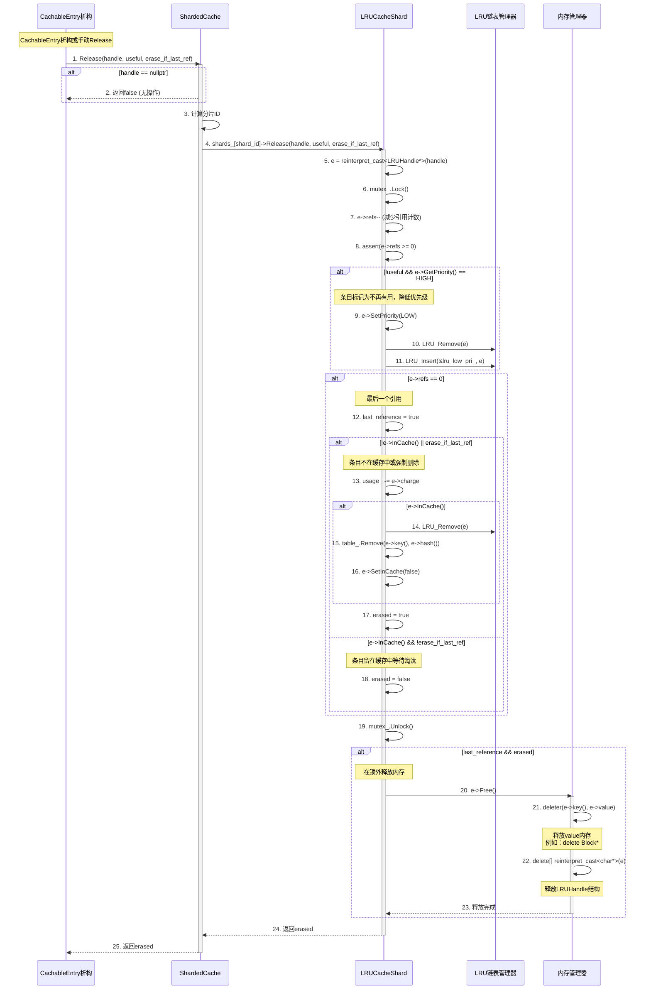

#### 2.3.2 详细说明

**流程目的**

安全释放缓存句柄，减少引用计数，当引用计数归零且条目已被淘汰时释放内存。

**关键步骤说明**

- **步骤1-4**：参数检查和分片路由
- **步骤5-8**：减少引用计数
- **步骤9-11**：根据useful参数调整优先级
- **步骤12-18**：判断是否需要释放内存
- **步骤19-23**：在锁外调用deleter释放内存

**边界条件**

- **handle为nullptr**：直接返回false
- **refs降为0且InCache=false**：立即释放内存
- **refs降为0且InCache=true**：留在缓存中等待淘汰
- **erase_if_last_ref=true**：强制删除（用于显式驱逐）

**异常路径**

无异常，对nullptr的容错处理。

**性能考量**

- **锁外释放**：deleter在锁外调用，避免持锁时执行耗时操作
- **延迟释放**：refs>0时不释放内存，防止悬垂指针
- **优先级降级**：useful=false时降低优先级，加速淘汰

**容量假设**

无特殊要求。

**版本兼容性**

所有版本支持。

---

### 2.4 Cache Eviction 淘汰流程

#### 2.4.1 时序图

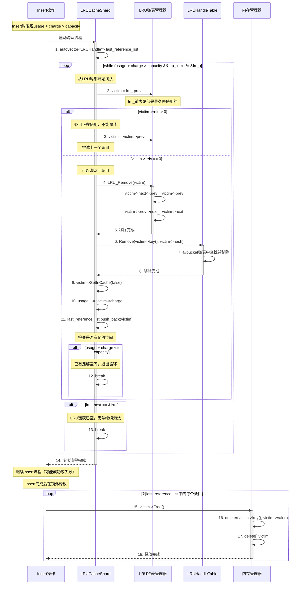

#### 2.4.2 详细说明

**流程目的**

当缓存使用量超过容量时，根据LRU策略淘汰最久未使用的条目，为新条目腾出空间。

**关键步骤说明**

- **步骤1-3**：初始化淘汰列表，从LRU尾部开始
- **步骤4-11**：移除条目（从LRU链表、哈希表）并更新使用量
- **步骤12-13**：判断是否有足够空间或无法继续淘汰
- **步骤14-18**：在锁外释放被淘汰条目的内存

**边界条件**

- **所有条目都被引用**：无法淘汰，循环结束，usage可能仍超过capacity
- **LRU链表为空**：无条目可淘汰
- **strict_capacity_limit**：淘汰后仍不足时Insert返回失败

**异常路径**

无异常，最坏情况是无法淘汰足够空间。

**性能考量**

- **最坏复杂度**：O(n)，需要遍历所有条目（当大部分都被引用时）
- **平均复杂度**：O(k)，k是需要淘汰的条目数
- **锁外释放**：deleter在锁外调用，减少持锁时间

**容量假设**

无特殊要求。

**版本兼容性**

所有版本支持。

---

### 2.5 HyperClockCache Lookup 流程

#### 2.5.1 时序图

```mermaid
sequenceDiagram
    participant Client as BlockBasedTable
    participant Cache as HyperClockCache
    participant Shard as ClockCacheShard
    participant SlotArray as 槽位数组
    participant Atomic as 原子操作

    Note over Client: HyperClockCache的无锁查找
    Client->>Cache: 1. Lookup(key)
    activate Cache
    
    Cache->>Cache: 2. hash = Hash(key)
    Cache->>Cache: 3. shard_id = hash % num_shards
    
    Cache->>Shard: 4. shards_[shard_id]->Lookup(key, hash)
    activate Shard
    
    Note over Shard: 无需加锁，使用原子操作
    Shard->>Shard: 5. slot_id = hash % length_
    
    Shard->>SlotArray: 6. slot = &array_[slot_id]
    activate SlotArray
    
    loop 线性探测 (最多探测max_probes次)
        SlotArray->>Atomic: 7. refs_and_flags = slot->refs_and_flags.load(acquire)
        
        alt slot为空 (refs_and_flags == 0)
            SlotArray-->>Shard: 8. 未找到
        else slot->key_with_hash == key_hash
            Note over Shard: 找到匹配的槽位
            
            Shard->>Atomic: 9. TryAcquireRef(slot)
            Note over Atomic: CAS操作：refs_and_flags++
            
            alt CAS成功
                Atomic-->>Shard: 10. 引用成功
                
                Shard->>Atomic: 11. SetClockBit(slot)
                Note over Atomic: 原子设置clock bit为1
                
                Shard->>Shard: 12. RecordTick(BLOCK_CACHE_HIT)
                Shard-->>Cache: 13. 返回Handle*
                deactivate SlotArray
                Cache-->>Client: 14. 返回Handle*
                deactivate Shard
                deactivate Cache
                
                Note over Client: 命中，使用数据
                Client->>Client: 15. block = cache->Value(handle)
                Client->>Client: 16. 使用Block数据
                Client->>Cache: 17. Release(handle)
                Note over Cache: 原子减少refs
                
            else CAS失败
                Note over Shard: 条目正在被淘汰或已满
                Atomic-->>Shard: 获取失败
                Note over Shard: 继续线性探测下一个槽位
            end
            
        else slot->key_with_hash != key_hash
            Note over Shard: 哈希冲突，继续探测
            SlotArray->>SlotArray: slot_id = (slot_id + 1) % length_
        end
    end
    
    Note over Shard: 探测max_probes次后仍未找到
    Shard->>Shard: 18. RecordTick(BLOCK_CACHE_MISS)
    Shard-->>Cache: 19. 返回nullptr
    deactivate Shard
    Cache-->>Client: 20. 返回nullptr
    deactivate Cache
    
    Note over Client: 未命中，从文件读取
    Client->>Client: 21. ReadBlockFromFile(...)
    Client->>Cache: 22. Insert(key, block)
```

#### 2.5.2 详细说明

**流程目的**

在HyperClockCache中执行无锁查找，使用原子操作和线性探测实现高并发读取。

**关键步骤说明**

- **步骤1-6**：计算hash和槽位，直接访问槽位数组（无需加锁）
- **步骤7-11**：使用CAS原子操作尝试获取引用
- **步骤12-17**：命中路径，设置clock bit并返回数据
- **步骤18-22**：未命中路径，从文件读取并插入

**边界条件**

- **线性探测上限**：最多探测max_probes次（通常为4-8）
- **CAS失败**：条目正在被并发淘汰，继续探测下一个槽位
- **槽位为空**：未找到匹配key

**异常路径**

无异常，nullptr是合法返回值。

**性能考量**

- **无锁设计**：Lookup完全无锁，仅使用原子操作，延迟极低（~50ns）
- **缓存行优化**：槽位对齐到缓存行，减少false sharing
- **线性探测**：哈希冲突时线性探测，利用缓存局部性

**容量假设**

无特殊要求。

**版本兼容性**

RocksDB 7.0+ 支持，7.10+ 推荐使用。

---

### 2.6 SetCapacity 动态调整容量流程

#### 2.6.1 时序图

```mermaid
sequenceDiagram
    participant Client as DBImpl::SetOptions
    participant Cache as ShardedCache
    participant Shards as LRUCacheShard数组
    participant Evictor as 淘汰引擎
    participant Memory as 内存管理器

    Client->>Cache: 1. SetCapacity(new_capacity)
    activate Cache
    
    Cache->>Cache: 2. per_shard_capacity = new_capacity >> num_shard_bits
    
    loop 对每个分片 (i = 0; i < num_shards; i++)
        Cache->>Shards: 3. shards_[i]->SetCapacity(per_shard_capacity)
        activate Shards
        
        Shards->>Shards: 4. autovector<LRUHandle*> last_reference_list
        Shards->>Shards: 5. mutex_.Lock()
        
        Shards->>Shards: 6. old_capacity = capacity_
        Shards->>Shards: 7. capacity_ = new_capacity
        
        alt new_capacity < old_capacity
            Note over Shards: 容量缩小，需要淘汰
            
            loop while (usage_ > capacity_ && lru_.next != &lru_)
                Shards->>Evictor: 8. 启动淘汰流程
                activate Evictor
                
                Evictor->>Evictor: 9. old = lru_.prev (LRU尾部)
                
                alt old->refs > 0
                    Note over Evictor: 条目正在使用，跳过
                    Evictor->>Evictor: old = old->prev
                else old->refs == 0
                    Evictor->>Evictor: 10. LRU_Remove(old)
                    Evictor->>Evictor: 11. table_.Remove(old)
                    Evictor->>Evictor: 12. old->SetInCache(false)
                    Evictor->>Evictor: 13. usage_ -= old->charge
                    Evictor->>Evictor: 14. last_reference_list.push_back(old)
                end
                
                deactivate Evictor
            end
            
        else new_capacity > old_capacity
            Note over Shards: 容量扩大，无需淘汰
        end
        
        Shards->>Shards: 15. mutex_.Unlock()
        
        Note over Shards: 在锁外释放淘汰的条目
        loop 对last_reference_list中的每个条目
            Shards->>Memory: 16. entry->Free()
            activate Memory
            Memory->>Memory: 17. deleter(key, value)
            Memory->>Memory: 18. delete[] entry
            Memory-->>Shards: 释放完成
            deactivate Memory
        end
        
        Shards-->>Cache: 19. 分片容量调整完成
        deactivate Shards
    end
    
    Cache-->>Client: 20. 所有分片调整完成
    deactivate Cache
```

#### 2.6.2 详细说明

**流程目的**

动态调整缓存容量，适应运行时工作负载变化。缩小时触发淘汰，扩大时立即生效。

**关键步骤说明**

- **步骤1-3**：计算每个分片的新容量并逐个调整
- **步骤4-7**：更新capacity字段
- **步骤8-14**：容量缩小时淘汰超出部分
- **步骤15-19**：锁外释放被淘汰条目的内存

**边界条件**

- **扩大容量**：立即生效，无需淘汰
- **缩小容量**：淘汰LRU尾部的无引用条目
- **所有条目被引用**：无法淘汰，usage可能大于capacity

**异常路径**

无异常。

**性能考量**

- **逐分片调整**：每个分片独立调整，不阻塞其他分片
- **淘汰开销**：缩小容量时可能需要淘汰大量条目，耗时较长
- **锁外释放**：减少持锁时间

**容量假设**

new_capacity应大于0。

**版本兼容性**

所有版本支持。

---

## 三、复杂场景时序图

### 3.1 并发Insert冲突场景

#### 3.1.1 时序图

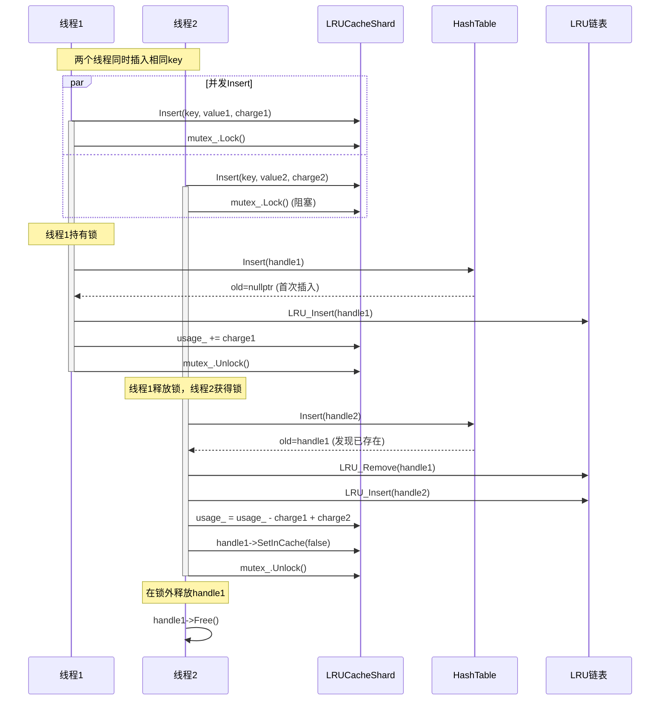

**详细说明**

- **并发控制**：通过mutex保证同一分片的串行化
- **后插入胜出**：线程2的value2会替换线程1的value1
- **内存安全**：旧值在锁外释放，避免死锁

---

### 3.2 Lookup期间条目被淘汰场景

#### 3.2.1 时序图

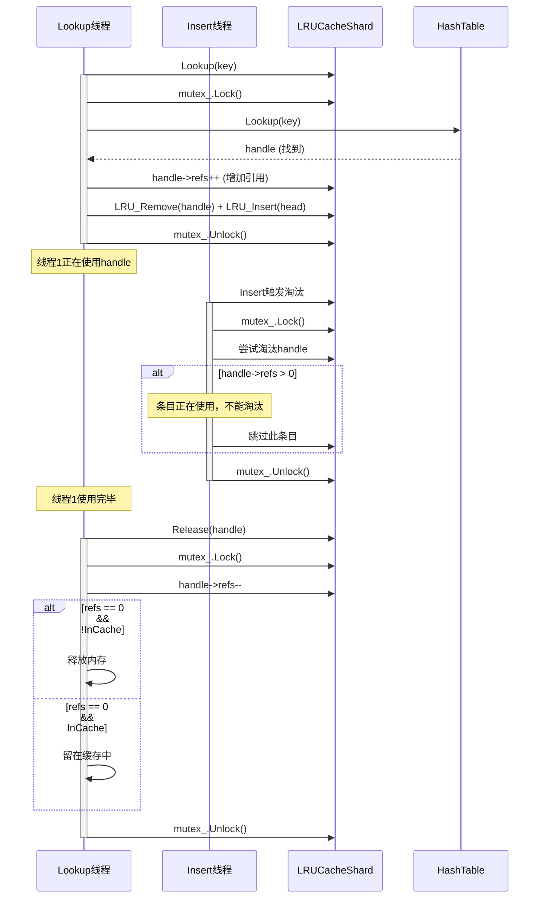

**详细说明**

- **引用计数保护**：refs>0的条目不会被淘汰
- **延迟释放**：条目可以标记为!InCache但仍保留在内存中
- **最终释放**：最后一个引用释放时才真正释放内存

---

## 四、总结

### 4.1 时序图要点

1. **Insert流程**：包含淘汰逻辑，支持优先级，锁外释放内存
2. **Lookup流程**：命中时更新LRU位置，未命中时触发文件读取
3. **Release流程**：引用计数管理，延迟释放内存
4. **Eviction流程**：从LRU尾部淘汰，跳过正在使用的条目
5. **HyperClockCache**：无锁Lookup，使用原子操作和线性探测

### 4.2 并发控制要点

- **分片锁**：每个分片独立加锁，减少竞争
- **引用计数**：防止使用中的条目被淘汰
- **锁外释放**：deleter在锁外调用，避免死锁
- **原子操作**：HyperClockCache使用CAS实现无锁并发

### 4.3 性能优化要点

- **减少持锁时间**：淘汰列表在锁外释放
- **LRU优化**：命中时O(1)更新位置
- **哈希优化**：哈希表平均O(1)查找
- **无锁设计**：HyperClockCache的Lookup无锁

---

**文档版本**: v1.0  
**最后更新**: 2025-10-04  
**适用RocksDB版本**: 7.0+

---
