# RocksDB-03-Table模块-概览

## 1. 模块职责与边界

### 核心职责
Table模块负责RocksDB的SST（Sorted String Table）文件的创建和读取，是持久化存储的核心组件：

- **SST文件构建**：将MemTable数据序列化为不可变的SST文件
- **SST文件读取**：从磁盘读取SST文件数据并解析
- **数据块管理**：数据块、索引块、过滤器块的组织和访问
- **压缩与解压缩**：支持多种压缩算法优化存储空间
- **过滤器集成**：布隆过滤器加速键查找
- **多种表格式**：支持BlockBasedTable、PlainTable、CuckooTable等格式

### 输入输出接口
- **输入**：
  - MemTable迭代器（构建时）
  - 键值对数据流
  - 表选项（TableOptions）
  - 压缩选项（CompressionOptions）
- **输出**：
  - SST文件（持久化存储）
  - TableReader（文件读取器）
  - 迭代器（数据遍历）
  - 统计信息（文件大小、键数量等）

### 上下游依赖关系
- **上游调用方**：
  - DB模块：Flush和Compaction操作
  - Iterator模块：数据遍历
  - Get操作：单键查找
- **下游依赖**：
  - File模块：文件I/O操作
  - Cache模块：数据块缓存
  - Compression模块：数据压缩
  - Filter模块：布隆过滤器

### 生命周期管理
1. **构建阶段**：
   - 创建TableBuilder实例
   - 逐个添加排序后的键值对
   - 写入数据块、索引块、过滤器块
   - 完成文件并同步到磁盘
2. **读取阶段**：
   - 打开SST文件并读取Footer
   - 加载索引和过滤器到缓存
   - 响应查找和迭代请求
3. **关闭阶段**：
   - 释放缓存的数据块
   - 关闭文件句柄
   - 清理资源

## 2. 模块架构图

```mermaid
flowchart TB
    subgraph "Table Module Architecture"
        subgraph "Table Factory Layer"
            TableFactory[Table Factory Interface]
            BBTFactory[BlockBased Table Factory]
            PlainFactory[Plain Table Factory]
            CuckooFactory[Cuckoo Table Factory]
        end
        
        subgraph "Table Builder - Write Path"
            TableBuilder[Table Builder Interface]
            BBTBuilder[BlockBased Table Builder]
            subgraph "Block Building"
                DataBlockBuilder[Data Block Builder]
                IndexBlockBuilder[Index Block Builder]
                FilterBlockBuilder[Filter Block Builder]
                MetaBlockBuilder[Meta Block Builder]
            end
            subgraph "Compression"
                Compressor[Compressor]
                DictBuilder[Dictionary Builder]
            end
        end
        
        subgraph "Table Reader - Read Path"
            TableReader[Table Reader Interface]
            BBTReader[BlockBased Table Reader]
            subgraph "Block Reading"
                BlockFetcher[Block Fetcher]
                IndexReader[Index Reader]
                FilterReader[Filter Reader]
                DataBlockReader[Data Block Reader]
            end
            subgraph "Iterators"
                TableIterator[Table Iterator]
                BlockIterator[Block Iterator]
                TwoLevelIterator[Two Level Iterator]
            end
        end
        
        subgraph "Block Management"
            Block[Block]
            BlockHandle[Block Handle]
            BlockContents[Block Contents]
            Footer[Footer]
        end
        
        subgraph "Cache Integration"
            BlockCache[Block Cache]
            CachableEntry[Cachable Entry]
            BlockCacheKey[Block Cache Key]
        end
        
        subgraph "Format and Encoding"
            Format[Format]
            BlockTrailer[Block Trailer]
            Encoding[Encoding]
            Checksum[Checksum]
        end
    end
    
    subgraph "External Dependencies"
        FileWriter[Writable File Writer]
        FileReader[Random Access File Reader]
        MemTable[MemTable]
        Cache[Cache Module]
        FilterPolicy[Filter Policy]
    end
    
    %% Factory Connections
    TableFactory --> BBTFactory
    TableFactory --> PlainFactory
    TableFactory --> CuckooFactory
    
    %% Builder Connections
    BBTFactory --> BBTBuilder
    BBTBuilder --> DataBlockBuilder
    BBTBuilder --> IndexBlockBuilder
    BBTBuilder --> FilterBlockBuilder
    BBTBuilder --> MetaBlockBuilder
    BBTBuilder --> Compressor
    BBTBuilder --> FileWriter
    
    %% Reader Connections
    BBTFactory --> BBTReader
    BBTReader --> BlockFetcher
    BBTReader --> IndexReader
    BBTReader --> FilterReader
    BBTReader --> DataBlockReader
    BBTReader --> TableIterator
    BBTReader --> FileReader
    
    %% Block Management
    BBTBuilder --> BlockHandle
    BBTBuilder --> Footer
    BBTReader --> BlockHandle
    BBTReader --> Footer
    BlockFetcher --> Block
    BlockFetcher --> BlockContents
    
    %% Cache Integration
    BBTReader --> BlockCache
    BlockCache --> CachableEntry
    BlockCache --> BlockCacheKey
    CachableEntry --> Block
    
    %% Format
    DataBlockBuilder --> Format
    DataBlockReader --> Format
    Format --> BlockTrailer
    Format --> Checksum
    
    %% External
    MemTable --> TableBuilder
    Cache --> BlockCache
    FilterPolicy --> FilterBlockBuilder
    FilterPolicy --> FilterReader
    
    classDef factoryClass fill:#e3f2fd
    classDef builderClass fill:#f3e5f5
    classDef readerClass fill:#e8f5e8
    classDef blockClass fill:#fff3e0
    classDef cacheClass fill:#fce4ec
    classDef formatClass fill:#f1f8e9
    classDef externalClass fill:#ffebee
    
    class TableFactory,BBTFactory,PlainFactory,CuckooFactory factoryClass
    class TableBuilder,BBTBuilder,DataBlockBuilder,IndexBlockBuilder,FilterBlockBuilder,MetaBlockBuilder,Compressor,DictBuilder builderClass
    class TableReader,BBTReader,BlockFetcher,IndexReader,FilterReader,DataBlockReader,TableIterator,BlockIterator,TwoLevelIterator readerClass
    class Block,BlockHandle,BlockContents,Footer blockClass
    class BlockCache,CachableEntry,BlockCacheKey cacheClass
    class Format,BlockTrailer,Encoding,Checksum formatClass
    class FileWriter,FileReader,MemTable,Cache,FilterPolicy externalClass
```



### 架构图详细说明

#### 分层设计
- **工厂层**：提供不同类型表格式的创建接口，支持多种表实现
- **构建层**：负责SST文件的写入，包括数据块、索引、过滤器的构建
- **读取层**：负责SST文件的读取，支持查找和迭代访问
- **块管理层**：管理数据块的格式、缓存和访问

#### 写入路径
1. **数据块构建**：将键值对聚合到数据块
2. **索引构建**：为数据块创建索引
3. **过滤器构建**：构建布隆过滤器
4. **压缩处理**：对数据块进行压缩
5. **文件写入**：将所有块写入磁盘

#### 读取路径
1. **过滤器查询**：使用布隆过滤器快速判断键是否存在
2. **索引查找**：通过索引定位数据块
3. **块读取**：从文件或缓存读取数据块
4. **数据解析**：解压缩并解析数据块内容

## 3. BlockBasedTable格式

### 3.1 文件格式布局

```
BlockBasedTable Format:
┌─────────────────────────────────────────────────────────────┐
│                        Data Block 0                          │
│  (key-value pairs, sorted)                                   │
├─────────────────────────────────────────────────────────────┤
│                        Data Block 1                          │
├─────────────────────────────────────────────────────────────┤
│                           ...                                │
├─────────────────────────────────────────────────────────────┤
│                        Data Block N                          │
├─────────────────────────────────────────────────────────────┤
│                      Meta Block 1                            │
│  (Filter Block - Bloom Filter)                               │
├─────────────────────────────────────────────────────────────┤
│                      Meta Block 2                            │
│  (Compression Dictionary)                                    │
├─────────────────────────────────────────────────────────────┤
│                   Meta Index Block                           │
│  (Index to Meta Blocks)                                      │
├─────────────────────────────────────────────────────────────┤
│                     Index Block                              │
│  (Index to Data Blocks)                                      │
├─────────────────────────────────────────────────────────────┤
│                      Footer                                  │
│  (Meta Index Handle + Index Handle + Magic Number)          │
└─────────────────────────────────────────────────────────────┘
```

**格式详细说明**：

#### 数据块（Data Block）
- **作用**：存储实际的键值对数据
- **组织**：键值对按键排序存储
- **压缩**：可选的压缩算法（Snappy、LZ4、ZSTD等）
- **重启点**：每隔固定间隔设置重启点，支持二分查找
- **大小**：默认4KB，可配置

#### 过滤器块（Filter Block）
- **作用**：加速键查找，减少不必要的块读取
- **类型**：布隆过滤器（Bloom Filter）
- **粒度**：可以是全表过滤器或分区过滤器
- **误判率**：可配置，通常设置为1%

#### 索引块（Index Block）
- **作用**：快速定位数据块
- **格式**：键 → BlockHandle（offset + size）
- **类型**：
  - Binary Search Index：二分查找索引
  - Hash Search Index：哈希索引
  - Partitioned Index：分区索引

#### 元索引块（Meta Index Block）
- **作用**：索引所有元数据块
- **内容**：元块名称 → BlockHandle

#### Footer
- **大小**：固定48字节
- **内容**：
  - Meta Index BlockHandle：8字节offset + 变长size
  - Index BlockHandle：8字节offset + 变长size
  - Magic Number：8字节
  - Version：4字节

### 3.2 数据块格式

```
Data Block Format:
┌───────────────────────────────────────────────────────────┐
│ Record 0                                                   │
│   shared_key_len (varint32)                               │
│   unshared_key_len (varint32)                             │
│   value_len (varint32)                                    │
│   unshared_key_data (char[unshared_key_len])             │
│   value_data (char[value_len])                           │
├───────────────────────────────────────────────────────────┤
│ Record 1                                                   │
│   ...                                                     │
├───────────────────────────────────────────────────────────┤
│ Restart Point 0 (uint32) ──────────────┐                 │
├────────────────────────────────────────┼─────────────────┤
│ Restart Point 1 (uint32)               │                 │
├────────────────────────────────────────┼─────────────────┤
│ Num Restarts (uint32)                  │                 │
├────────────────────────────────────────┴─────────────────┤
│ Compression Type (1 byte)                                 │
├───────────────────────────────────────────────────────────┤
│ Checksum (uint32)                                         │
└───────────────────────────────────────────────────────────┘
```

**数据块格式说明**：

#### 前缀压缩
- **目的**：减少键的存储空间
- **方法**：后续键只存储与前一个键不同的部分
- **示例**：
  - Key1: "user001"
  - Key2: "user002" → shared=4, unshared=3, "002"
  - Key3: "user003" → shared=4, unshared=3, "003"

#### 重启点（Restart Points）
- **作用**：支持块内二分查找
- **设置**：每隔N个键（默认16）设置一个重启点
- **格式**：重启点是记录在块中的偏移量

#### 块尾（Block Trailer）
- **压缩类型**：1字节，标识压缩算法
- **校验和**：4字节CRC32校验和，保证数据完整性

## 4. 核心算法实现

### 4.1 TableBuilder - 构建SST文件

```cpp
// BlockBasedTableBuilder的核心实现
class BlockBasedTableBuilder : public TableBuilder {
private:
    struct Rep {
        BlockBuilder data_block;              // 当前数据块构建器
        IndexBuilder* index_builder;          // 索引构建器
        FilterBlockBuilder* filter_builder;   // 过滤器构建器
        WritableFileWriter* file;            // 文件写入器
        uint64_t offset = 0;                 // 当前文件偏移
        Status status;                       // 构建状态
        std::string compressed_output;       // 压缩缓冲区
        CompressionType compression_type;    // 压缩类型
        std::vector<std::unique_ptr<IntTblPropCollector>> table_properties_collectors;
    };
    
    std::unique_ptr<Rep> rep_;
    
public:
    // 添加键值对
    void Add(const Slice& key, const Slice& value) override {
        Rep* r = rep_.get();
        
        // 检查键是否有序
        assert(r->num_entries == 0 ||
               r->internal_comparator.Compare(key, Slice(r->last_key)) > 0);
        
        // 检查是否需要Flush当前数据块
        if (r->data_block.CurrentSizeEstimate() >= r->block_size) {
            Flush();
        }
        
        // 添加键值对到数据块
        r->data_block.Add(key, value);
        r->num_entries++;
        r->last_key.assign(key.data(), key.size());
        
        // 更新过滤器
        if (r->filter_builder != nullptr) {
            r->filter_builder->Add(ExtractUserKey(key));
        }
        
        // 更新表属性收集器
        for (auto& collector : r->table_properties_collectors) {
            Status s = collector->Add(key, value);
            if (!s.ok()) {
                r->status = s;
            }
        }
        
        // 估算文件大小
        r->estimated_uncompressed_size += key.size() + value.size();
    }
    
private:
    // Flush当前数据块到文件
    void Flush() {
        Rep* r = rep_.get();
        assert(!r->data_block.empty());
        
        // 1. 完成数据块构建
        Slice raw_block_contents = r->data_block.Finish();
        
        // 2. 压缩数据块（如果启用压缩）
        Slice block_contents;
        CompressionType type = r->compression_type;
        
        if (type != kNoCompression) {
            Status compress_status = CompressBlock(
                raw_block_contents, r->compression_opts, &type,
                kBlockBasedTableVersionFormat, &r->compressed_output);
            
            if (compress_status.ok() &&
                r->compressed_output.size() < raw_block_contents.size()) {
                block_contents = r->compressed_output;
            } else {
                // 压缩失败或效果不好，使用原始数据
                block_contents = raw_block_contents;
                type = kNoCompression;
            }
        } else {
            block_contents = raw_block_contents;
        }
        
        // 3. 写入数据块
        WriteBlock(block_contents, &r->pending_handle, type);
        
        // 4. 添加索引条目
        std::string handle_encoding;
        r->pending_handle.EncodeTo(&handle_encoding);
        r->index_builder->AddIndexEntry(
            &r->last_key, nullptr, handle_encoding);
        
        // 5. 重置数据块构建器
        r->data_block.Reset();
    }
    
    // 写入块到文件
    void WriteBlock(const Slice& block_contents, BlockHandle* handle,
                   CompressionType type) {
        Rep* r = rep_.get();
        
        // 记录块的位置和大小
        handle->set_offset(r->offset);
        handle->set_size(block_contents.size());
        
        // 写入块内容
        Status s = r->file->Append(block_contents);
        if (!s.ok()) {
            r->status = s;
            return;
        }
        
        // 写入块尾（压缩类型 + 校验和）
        char trailer[kBlockTrailerSize];
        trailer[0] = type;
        uint32_t crc = crc32c::Value(block_contents.data(), block_contents.size());
        crc = crc32c::Extend(crc, trailer, 1);  // 包含压缩类型
        EncodeFixed32(trailer + 1, crc32c::Mask(crc));
        
        s = r->file->Append(Slice(trailer, kBlockTrailerSize));
        if (!s.ok()) {
            r->status = s;
            return;
        }
        
        r->offset += block_contents.size() + kBlockTrailerSize;
    }
    
public:
    // 完成SST文件构建
    Status Finish() override {
        Rep* r = rep_.get();
        
        // 1. Flush最后一个数据块
        if (!r->data_block.empty()) {
            Flush();
        }
        
        // 2. 写入过滤器块
        BlockHandle filter_block_handle;
        if (r->filter_builder != nullptr) {
            Slice filter_content = r->filter_builder->Finish();
            WriteBlock(filter_content, &filter_block_handle, kNoCompression);
        }
        
        // 3. 写入元索引块
        MetaIndexBuilder meta_index_builder;
        if (r->filter_builder != nullptr) {
            std::string key = BlockBasedTable::kFilterBlockPrefix;
            key.append(r->filter_policy->Name());
            std::string handle_encoding;
            filter_block_handle.EncodeTo(&handle_encoding);
            meta_index_builder.Add(key, handle_encoding);
        }
        
        BlockHandle meta_index_block_handle;
        WriteBlock(meta_index_builder.Finish(), &meta_index_block_handle,
                  kNoCompression);
        
        // 4. 写入索引块
        BlockHandle index_block_handle;
        Slice index_block_contents = r->index_builder->Finish();
        WriteBlock(index_block_contents, &index_block_handle, kNoCompression);
        
        // 5. 写入Footer
        Footer footer(kBlockBasedTableMagicNumber, kBlockBasedTableVersionFormat);
        footer.set_metaindex_handle(meta_index_block_handle);
        footer.set_index_handle(index_block_handle);
        
        std::string footer_encoding;
        footer.EncodeTo(&footer_encoding);
        r->status = r->file->Append(footer_encoding);
        
        // 6. 同步文件到磁盘
        if (r->status.ok()) {
            r->status = r->file->Sync();
        }
        
        return r->status;
    }
};
```

**构建流程要点**：

- **增量构建**：逐个添加键值对，当数据块满时自动Flush
- **压缩优化**：自动选择是否压缩，如果压缩效果不好则使用原始数据
- **索引构建**：同步构建索引，每个数据块对应一个索引条目
- **原子性**：通过最后写入Footer保证文件的原子性和完整性

### 4.2 TableReader - 读取SST文件

```cpp
// BlockBasedTable的核心读取实现
class BlockBasedTable : public TableReader {
private:
    struct Rep {
        const ImmutableOptions& ioptions;
        const EnvOptions& env_options;
        const BlockBasedTableOptions table_options;
        const InternalKeyComparator& internal_comparator;
        
        std::unique_ptr<RandomAccessFileReader> file;
        Footer footer;
        std::unique_ptr<IndexReader> index_reader;
        std::unique_ptr<FilterBlockReader> filter;
        
        Cache* block_cache = nullptr;
        uint64_t file_size;
    };
    
    std::unique_ptr<Rep> rep_;
    
public:
    // 打开SST文件
    static Status Open(const ReadOptions& read_options,
                      const ImmutableOptions& ioptions,
                      const EnvOptions& env_options,
                      const BlockBasedTableOptions& table_options,
                      const InternalKeyComparator& internal_comparator,
                      std::unique_ptr<RandomAccessFileReader>&& file,
                      uint64_t file_size,
                      std::unique_ptr<TableReader>* table_reader) {
        
        // 1. 读取Footer
        Footer footer;
        Status s = ReadFooterFromFile(file.get(), file_size, &footer);
        if (!s.ok()) {
            return s;
        }
        
        // 2. 创建Rep对象
        std::unique_ptr<Rep> rep(new Rep(ioptions, env_options, table_options,
                                        internal_comparator));
        rep->file = std::move(file);
        rep->footer = footer;
        rep->file_size = file_size;
        
        // 3. 读取索引块
        BlockContents index_block_contents;
        s = ReadBlockFromFile(rep->file.get(), rep->footer.index_handle(),
                             &index_block_contents);
        if (!s.ok()) {
            return s;
        }
        
        rep->index_reader.reset(
            IndexReader::Create(index_block_contents, rep.get()));
        
        // 4. 读取过滤器块（如果存在）
        if (!table_options.skip_filters) {
            s = ReadFilter(rep.get());
        }
        
        // 5. 创建TableReader
        table_reader->reset(new BlockBasedTable(std::move(rep)));
        return Status::OK();
    }
    
    // Get操作 - 查找单个键
    Status Get(const ReadOptions& read_options, const Slice& key,
               GetContext* get_context, const SliceTransform* prefix_extractor,
               bool skip_filters) override {
        
        Status s;
        const bool no_io = read_options.read_tier == kBlockCacheTier;
        
        // 1. 检查过滤器
        if (!skip_filters && rep_->filter != nullptr) {
            bool may_match = true;
            FilterBlockReader* filter = rep_->filter.get();
            
            may_match = filter->KeyMayMatch(
                ExtractUserKey(key), kNotValid, no_io,
                prefix_extractor, get_context->GetReadCallback());
            
            if (!may_match) {
                // 过滤器判断键不存在
                return Status::OK();
            }
        }
        
        // 2. 通过索引找到可能包含该键的数据块
        IndexReader::ReadResult read_result;
        s = rep_->index_reader->Get(read_options, key, get_context,
                                    prefix_extractor, &read_result);
        if (!s.ok() && !s.IsIncomplete()) {
            return s;
        }
        
        // 3. 读取数据块
        BlockHandle handle = read_result.handle;
        CachableEntry<Block> block;
        s = RetrieveBlock(read_options, handle, &block);
        if (!s.ok()) {
            return s;
        }
        
        // 4. 在数据块中查找键
        DataBlockIter biter;
        NewDataBlockIterator(read_options, block.GetValue(), &biter);
        
        biter.Seek(key);
        if (biter.Valid() &&
            rep_->internal_comparator.Compare(biter.key(), key) == 0) {
            // 找到键，调用get_context处理
            s = get_context->SaveValue(biter.value());
        }
        
        return s;
    }
    
private:
    // 读取或缓存数据块
    Status RetrieveBlock(const ReadOptions& read_options,
                        const BlockHandle& handle,
                        CachableEntry<Block>* block) {
        
        // 1. 尝试从缓存获取
        if (rep_->block_cache != nullptr) {
            Cache::Handle* cache_handle = nullptr;
            Slice key = GetCacheKey(rep_->base_cache_key, handle);
            
            cache_handle = rep_->block_cache->Lookup(key);
            if (cache_handle != nullptr) {
                // 缓存命中
                block->SetCachedValue(
                    reinterpret_cast<Block*>(rep_->block_cache->Value(cache_handle)),
                    rep_->block_cache, cache_handle);
                return Status::OK();
            }
        }
        
        // 2. 从文件读取块
        BlockContents contents;
        Status s = ReadBlockFromFile(rep_->file.get(), handle, &contents);
        if (!s.ok()) {
            return s;
        }
        
        // 3. 解压缩（如果需要）
        if (contents.compression_type != kNoCompression) {
            UncompressionContext context(contents.compression_type);
            UncompressionInfo info(context, contents.data, contents.size);
            s = UncompressBlockData(info, &contents);
            if (!s.ok()) {
                return s;
            }
        }
        
        // 4. 创建Block对象
        std::unique_ptr<Block> block_ptr(new Block(std::move(contents)));
        
        // 5. 插入到缓存
        if (rep_->block_cache != nullptr) {
            Cache::Handle* cache_handle = nullptr;
            s = rep_->block_cache->Insert(
                GetCacheKey(rep_->base_cache_key, handle),
                block_ptr.get(), block_ptr->ApproximateMemoryUsage(),
                &cache_deleter, &cache_handle);
            
            if (s.ok()) {
                block->SetCachedValue(block_ptr.release(),
                                     rep_->block_cache, cache_handle);
            }
        } else {
            block->SetOwnedValue(block_ptr.release());
        }
        
        return Status::OK();
    }
};
```

**读取流程要点**：

- **延迟加载**：只在需要时才读取数据块
- **过滤器优化**：通过布隆过滤器快速排除不存在的键
- **缓存集成**：自动利用Block Cache减少磁盘I/O
- **解压缩处理**：透明地处理压缩数据

## 5. 性能优化

### 5.1 块大小配置

```cpp
// 块大小配置建议
struct BlockSizeOptimization {
    // 数据块大小优化
    static size_t GetOptimalDataBlockSize(const WorkloadPattern& pattern) {
        if (pattern.is_point_lookup_heavy) {
            // 点查询密集：使用较小的块（4KB-8KB）
            // 优势：减少每次查找读取的数据量
            return 4 * 1024;  // 4KB
        } else if (pattern.is_range_scan_heavy) {
            // 范围扫描密集：使用较大的块（32KB-64KB）
            // 优势：减少块边界跨越，提升扫描性能
            return 64 * 1024;  // 64KB
        } else {
            // 混合负载：使用默认大小
            return 16 * 1024;  // 16KB（默认）
        }
    }
    
    // 索引块大小优化
    static size_t GetOptimalIndexBlockSize() {
        // 索引块通常保持默认大小即可
        // 如果使用分区索引，可以调整
        return 16 * 1024;
    }
};
```

### 5.2 压缩策略

```cpp
// 压缩策略配置
struct CompressionStrategy {
    // 选择压缩算法
    static CompressionType SelectCompressionType(int level) {
        if (level == 0) {
            // Level 0：无压缩或轻量压缩
            // 原因：L0数据会很快被压缩到下一层
            return kNoCompression;
        } else if (level == 1) {
            // Level 1：快速压缩
            return kSnappyCompression;  // Snappy：速度快，压缩率中等
        } else {
            // Level 2+：高压缩率
            return kZSTD;  // ZSTD：压缩率高，速度适中
        }
    }
    
    // 压缩选项配置
    static CompressionOptions GetCompressionOptions(CompressionType type) {
        CompressionOptions opts;
        
        if (type == kZSTD) {
            opts.level = 3;  // ZSTD压缩级别（-5到22，默认3）
            opts.max_dict_bytes = 16 * 1024;  // 16KB字典
            opts.zstd_max_train_bytes = 100 * 16 * 1024;  // 训练数据大小
        } else if (type == kLZ4Compression) {
            opts.level = 1;  // LZ4压缩级别
        }
        
        return opts;
    }
};
```

### 5.3 过滤器优化

```cpp
// 过滤器配置优化
struct FilterOptimization {
    // 布隆过滤器配置
    static std::shared_ptr<const FilterPolicy> CreateOptimalFilter(
        double target_false_positive_rate) {
        
        // 计算所需的位数
        int bits_per_key = CalculateBitsPerKey(target_false_positive_rate);
        
        // 创建布隆过滤器
        // 使用现代的Ribbon过滤器可以获得更好的空间效率
        return NewBloomFilterPolicy(bits_per_key, false);
    }
    
    // 分区过滤器配置
    static BlockBasedTableOptions ConfigurePartitionedFilter() {
        BlockBasedTableOptions opts;
        
        // 启用分区过滤器
        opts.partition_filters = true;
        opts.index_type = BlockBasedTableOptions::kTwoLevelIndexSearch;
        
        // 设置分区大小
        opts.metadata_block_size = 4 * 1024;  // 4KB
        
        // 固定顶层索引和过滤器
        opts.pin_top_level_index_and_filter = true;
        opts.cache_index_and_filter_blocks = true;
        
        return opts;
    }
    
private:
    static int CalculateBitsPerKey(double false_positive_rate) {
        // bits_per_key = -log2(false_positive_rate) / ln(2)
        return static_cast<int>(-std::log(false_positive_rate) / std::log(2) * 1.44);
    }
};
```

**Table模块优化总结**：

1. **块大小调优**：根据工作负载选择合适的块大小
2. **压缩策略**：按层级选择不同的压缩算法
3. **过滤器优化**：使用分区过滤器和合适的误判率
4. **缓存配置**：合理设置Block Cache大小和类型
5. **预取策略**：针对扫描操作启用预取优化

通过这些优化措施，Table模块能够在不同场景下提供高效的SST文件读写性能，为RocksDB的整体性能提供坚实的基础。
