# RocksDB-04-MemTable模块-概览

## 1. 模块职责与边界

### 核心职责
MemTable模块是RocksDB的内存数据结构模块，负责缓存最近的写入操作并支持快速查找：

- **写入缓冲**：接收所有Put/Delete/Merge操作，作为第一级写入缓冲
- **有序存储**：维护键的有序性，支持范围扫描和前缀查找
- **并发读取**：支持无锁的并发读取操作
- **快速查找**：基于跳表（SkipList）等数据结构提供O(log N)查找性能
- **内存管理**：通过Arena分配器高效管理内存
- **Flush准备**：当MemTable满时，转为Immutable MemTable等待Flush到SST

### 输入输出接口
- **输入**：
  - Add操作：添加键值对（Put/Delete/Merge）
  - Get操作：查找键值对
  - Iterator：遍历MemTable中的数据
- **输出**：
  - 查找结果（键值对、时间戳、序列号）
  - MemTable迭代器（用于Flush或查询）
  - 统计信息（条目数、数据大小、删除数）

### 上下游依赖关系
- **上游调用方**：
  - DB模块：所有写入和读取操作
  - WriteBatch：批量写入操作
  - Compaction：读取MemTable数据
- **下游依赖**：
  - Arena分配器：内存分配
  - MemTableRep：底层数据结构（SkipList、HashSkipList等）
  - Bloom Filter：加速前缀查找
  - Comparator：键比较器

### 生命周期管理
1. **活跃阶段（Active MemTable)**：
   - 接收所有写入操作
   - 支持并发读取
   - 当大小达到阈值时转为Immutable
2. **不可变阶段（Immutable MemTable)**：
   - 不再接收写入
   - 仅支持读取
   - 等待后台Flush线程处理
3. **Flush阶段**：
   - 被后台线程遍历
   - 数据写入SST文件
   - 完成后释放内存

## 2. 模块架构图

```mermaid
flowchart TB
    subgraph "MemTable Module Architecture"
        subgraph "MemTable Interface Layer"
            ReadOnlyMemTable[Read Only MemTable]
            MemTable[MemTable - Write + Read]
            MemTableList[MemTable List]
        end
        
        subgraph "MemTableRep - Data Structure Layer"
            MemTableRep[MemTable Rep Interface]
            subgraph "SkipList Based"
                SkipListRep[SkipList Rep]
                InlineSkipList[Inline SkipList]
                HashSkipListRep[Hash SkipList Rep]
            end
            subgraph "Hash Based"
                HashLinkListRep[Hash Link List Rep]
            end
            subgraph "Vector Based"
                VectorRep[Vector Rep]
            end
        end
        
        subgraph "SkipList Implementation"
            SkipList[Skip List]
            subgraph "Node Management"
                SkipListNode[Skip List Node]
                NodeHeight[Random Height]
                NodePointers[Forward Pointers]
            end
        end
        
        subgraph "Memory Management"
            Arena[Arena Allocator]
            ConcurrentArena[Concurrent Arena]
            WriteBuffer[Write Buffer Manager]
        end
        
        subgraph "Optimization Components"
            BloomFilter[MemTable Bloom Filter]
            InsertHint[Insert Hint Cache]
            PrefixExtractor[Prefix Extractor]
        end
        
        subgraph "Iterator Support"
            MemTableIterator[MemTable Iterator]
            DynamicPrefixIterator[Dynamic Prefix Iterator]
        end
        
        subgraph "Entry Format"
            EntryEncoder[Entry Encoder]
            InternalKey[Internal Key Format]
            ProtectionInfo[Protection Info - Checksum]
        end
    end
    
    subgraph "External Dependencies"
        DBImpl[DB Implementation]
        WriteBatch[Write Batch]
        FlushJob[Flush Job]
        Comparator[Internal Key Comparator]
    end
    
    %% Interface Connections
    MemTable --> ReadOnlyMemTable
    MemTableList --> MemTable
    
    %% MemTable to Rep
    MemTable --> MemTableRep
    MemTableRep --> SkipListRep
    MemTableRep --> HashSkipListRep
    MemTableRep --> HashLinkListRep
    MemTableRep --> VectorRep
    
    %% SkipList Implementation
    SkipListRep --> InlineSkipList
    HashSkipListRep --> SkipList
    InlineSkipList --> SkipListNode
    SkipList --> SkipListNode
    SkipListNode --> NodeHeight
    SkipListNode --> NodePointers
    
    %% Memory Management
    MemTableRep --> Arena
    Arena --> ConcurrentArena
    MemTable --> WriteBuffer
    WriteBuffer --> Arena
    
    %% Optimization
    MemTable --> BloomFilter
    MemTable --> InsertHint
    BloomFilter --> PrefixExtractor
    InsertHint --> PrefixExtractor
    
    %% Iterator
    MemTable --> MemTableIterator
    MemTableRep --> DynamicPrefixIterator
    
    %% Entry Format
    MemTable --> EntryEncoder
    EntryEncoder --> InternalKey
    EntryEncoder --> ProtectionInfo
    
    %% External
    DBImpl --> MemTable
    WriteBatch --> MemTable
    FlushJob --> MemTableIterator
    MemTable --> Comparator
    
    classDef interfaceClass fill:#e3f2fd
    classDef repClass fill:#f3e5f5
    classDef skiplistClass fill:#e8f5e8
    classDef memoryClass fill:#fff3e0
    classDef optClass fill:#fce4ec
    classDef iterClass fill:#f1f8e9
    classDef formatClass fill:#ede7f6
    classDef externalClass fill:#ffebee
    
    class ReadOnlyMemTable,MemTable,MemTableList interfaceClass
    class MemTableRep,SkipListRep,HashSkipListRep,HashLinkListRep,VectorRep repClass
    class SkipList,InlineSkipList,SkipListNode,NodeHeight,NodePointers skiplistClass
    class Arena,ConcurrentArena,WriteBuffer memoryClass
    class BloomFilter,InsertHint,PrefixExtractor optClass
    class MemTableIterator,DynamicPrefixIterator iterClass
    class EntryEncoder,InternalKey,ProtectionInfo formatClass
    class DBImpl,WriteBatch,FlushJob,Comparator externalClass
```



### 架构图详细说明

#### 分层设计
- **接口层**：提供统一的MemTable接口，区分只读和可写MemTable
- **Rep层**：抽象底层数据结构，支持多种实现（SkipList、Hash、Vector等）
- **SkipList实现层**：核心数据结构，提供有序存储和快速查找
- **内存管理层**：通过Arena高效分配内存，支持并发写入

#### 数据流
1. **写入流程**：DBImpl → MemTable → MemTableRep → SkipList → Arena
2. **读取流程**：DBImpl → MemTable → MemTableRep → SkipList查找
3. **Flush流程**：FlushJob → MemTableIterator → 遍历SkipList → SST Writer

#### MemTableRep实现
- **SkipListRep**：默认实现，基于跳表，适合通用场景
- **HashSkipListRep**：哈希+跳表，优化前缀查询性能
- **HashLinkListRep**：哈希+链表，适合大量重复前缀的场景
- **VectorRep**：向量实现，适合顺序插入场景（如bulk load）

## 3. SkipList核心实现

### 3.1 SkipList数据结构

Skip List（跳表）是一种概率型数据结构，通过多层链表实现快速查找：

```
Level 3:  head ----------------> 30 ----------------> 70 ------------> NULL
Level 2:  head ------> 10 -----> 30 -----> 50 -----> 70 ------------> NULL  
Level 1:  head -> 5 -> 10 -> 20 -> 30 -> 40 -> 50 -> 60 -> 70 -> 90 -> NULL
Level 0:  head -> 5 -> 10 -> 20 -> 30 -> 40 -> 50 -> 60 -> 70 -> 90 -> NULL
```

**跳表特性**：

- **多层索引**：每层都是下一层的"快捷方式"
- **随机高度**：新节点的高度通过随机数确定，平均为log N
- **查找复杂度**：O(log N)，与平衡树相当
- **插入复杂度**：O(log N)，但不需要旋转操作
- **无锁读取**：通过内存屏障（memory barrier）支持并发读

### 3.2 SkipList核心实现代码

```cpp
template <typename Key, class Comparator>
class SkipList {
private:
    struct Node {
        Key const key;
        
        // 获取下一个节点（带内存屏障）
        Node* Next(int level) {
            assert(level >= 0);
            // 使用acquire语义，确保读取到完全初始化的节点
            return next_[level].load(std::memory_order_acquire);
        }
        
        // 设置下一个节点（带内存屏障）
        void SetNext(int level, Node* x) {
            assert(level >= 0);
            // 使用release语义，确保节点完全初始化后才被其他线程看到
            next_[level].store(x, std::memory_order_release);
        }
        
        // 无屏障版本（用于不需要同步的场景）
        Node* NoBarrier_Next(int level) {
            assert(level >= 0);
            return next_[level].load(std::memory_order_relaxed);
        }
        
        void NoBarrier_SetNext(int level, Node* x) {
            assert(level >= 0);
            next_[level].store(x, std::memory_order_relaxed);
        }
        
    private:
        // 柔性数组：每个节点的高度不同，next_数组大小在运行时确定
        std::atomic<Node*> next_[1];
    };
    
    // 跳表参数
    const uint16_t kMaxHeight_;            // 最大高度（默认12）
    const uint16_t kBranching_;            // 分支因子（默认4）
    
    Comparator const compare_;             // 键比较器
    Allocator* const allocator_;           // Arena分配器
    Node* const head_;                     // 头节点
    RelaxedAtomic<int> max_height_;        // 当前最大高度
    
public:
    explicit SkipList(Comparator cmp, Allocator* allocator,
                     int32_t max_height = 12, int32_t branching_factor = 4)
        : kMaxHeight_(max_height),
          kBranching_(branching_factor),
          compare_(cmp),
          allocator_(allocator),
          head_(NewNode(0, max_height)),
          max_height_(1) {
        // 初始化头节点的所有层为NULL
        for (int i = 0; i < max_height; i++) {
            head_->NoBarrier_SetNext(i, nullptr);
        }
    }
    
    // 插入键
    void Insert(const Key& key) {
        // 1. 找到每一层的前驱节点
        Node* prev[kMaxHeight_];
        Node* x = FindGreaterOrEqual(key, prev);
        
        // 2. 键不应该已经存在（由调用者保证）
        assert(x == nullptr || !Equal(key, x->key));
        
        // 3. 随机确定新节点的高度
        int height = RandomHeight();
        if (height > GetMaxHeight()) {
            // 如果新高度超过当前最大高度，将超出部分的前驱设为head
            for (int i = GetMaxHeight(); i < height; i++) {
                prev[i] = head_;
            }
            // 更新最大高度（无需同步，因为只有一个写线程）
            max_height_.StoreRelaxed(height);
        }
        
        // 4. 创建新节点
        x = NewNode(key, height);
        
        // 5. 插入新节点到每一层
        for (int i = 0; i < height; i++) {
            // NoBarrier_SetNext()足够，因为SetNext()在下面会提供屏障
            x->NoBarrier_SetNext(i, prev[i]->NoBarrier_Next(i));
            prev[i]->SetNext(i, x);
        }
    }
    
    // 查找键是否存在
    bool Contains(const Key& key) const {
        Node* x = FindGreaterOrEqual(key, nullptr);
        if (x != nullptr && Equal(key, x->key)) {
            return true;
        } else {
            return false;
        }
    }
    
private:
    // 创建新节点
    Node* NewNode(const Key& key, int height) {
        // 计算节点大小：Node结构 + (height-1)个额外的next指针
        char* mem = allocator_->AllocateAligned(
            sizeof(Node) + sizeof(std::atomic<Node*>) * (height - 1));
        // placement new：在已分配的内存上构造Node对象
        return new (mem) Node(key);
    }
    
    // 随机生成节点高度
    int RandomHeight() {
        static const unsigned int kBranching = 4;
        int height = 1;
        // 以1/kBranching的概率增加高度
        while (height < kMaxHeight_ && rnd_.Next() % kBranching == 0) {
            height++;
        }
        assert(height > 0);
        assert(height <= kMaxHeight_);
        return height;
    }
    
    // 查找大于等于key的第一个节点
    // 如果prev不为空，填充每一层的前驱节点
    Node* FindGreaterOrEqual(const Key& key, Node** prev) const {
        Node* x = head_;
        int level = GetMaxHeight() - 1;
        
        while (true) {
            Node* next = x->Next(level);
            if (KeyIsAfterNode(key, next)) {
                // key在next之后，继续在当前层向右查找
                x = next;
            } else {
                // key在next之前或等于next，记录前驱并下降到下一层
                if (prev != nullptr) prev[level] = x;
                if (level == 0) {
                    return next;
                } else {
                    level--;
                }
            }
        }
    }
    
    // 判断key是否在节点n之后
    bool KeyIsAfterNode(const Key& key, Node* n) const {
        return (n != nullptr) && (compare_(n->key, key) < 0);
    }
    
    bool Equal(const Key& a, const Key& b) const {
        return (compare_(a, b) == 0);
    }
};
```

**SkipList实现要点**：

#### 并发安全性
- **写入同步**：要求外部同步（通常是写锁）
- **读取无锁**：通过memory barrier保证读取到一致的数据
- **Memory Order**：
  - `acquire`：读取时确保之前的写入对当前线程可见
  - `release`：写入时确保当前写入对其他线程可见
  - `relaxed`：不需要同步的操作（如单线程环境）

#### 性能优化
- **Arena分配器**：避免频繁的malloc/free开销
- **Placement New**：在预分配的内存上构造对象
- **柔性数组**：根据节点高度动态分配next数组大小
- **缓存友好**：节点内存连续分配，提升缓存命中率

## 4. MemTable核心实现

### 4.1 MemTable条目格式

```cpp
// MemTable条目的编码格式：
//
//  +----------------+-------------------+-------------+--------------+--------------+
//  | internal_key   | internal_key      | user key    | seq + type   | value_size   |
//  | size (varint)  | (internal_key_sz) | (key bytes) | (8 bytes)    | (varint)     |
//  +----------------+-------------------+-------------+--------------+--------------+
//  | value          | checksum (optional)                                            |
//  | (value bytes)  | (protection_bytes_per_key)                                     |
//  +----------------+----------------------------------------------------------------+
//
// 其中：
// - internal_key_size = user_key.size() + 8 (seq+type)
// - seq + type: 56位序列号 + 8位操作类型，打包成64位整数
// - checksum: 可选的完整性校验（如果启用protection_bytes_per_key）
```

### 4.2 MemTable Add操作

```cpp
Status MemTable::Add(SequenceNumber s, ValueType type,
                     const Slice& key,  // 用户键
                     const Slice& value,
                     const ProtectionInfoKVOS64* kv_prot_info,
                     bool allow_concurrent,
                     MemTablePostProcessInfo* post_process_info,
                     void** hint) {
    
    // 1. 计算条目编码后的大小
    uint32_t key_size = static_cast<uint32_t>(key.size());
    uint32_t val_size = static_cast<uint32_t>(value.size());
    uint32_t internal_key_size = key_size + 8;  // 用户键 + 序列号+类型
    
    const uint32_t encoded_len =
        VarintLength(internal_key_size) +    // internal_key_size的varint编码长度
        internal_key_size +                   // internal_key本身
        VarintLength(val_size) +              // value_size的varint编码长度
        val_size +                            // value本身
        moptions_.protection_bytes_per_key;   // 可选的校验和
    
    // 2. 从Arena分配内存
    char* buf = nullptr;
    std::unique_ptr<MemTableRep>& table =
        type == kTypeRangeDeletion ? range_del_table_ : table_;
    KeyHandle handle = table->Allocate(encoded_len, &buf);
    
    // 3. 编码internal_key_size
    char* p = EncodeVarint32(buf, internal_key_size);
    
    // 4. 编码user key
    memcpy(p, key.data(), key_size);
    Slice key_slice(p, key_size);
    p += key_size;
    
    // 5. 编码sequence number和type（打包成64位）
    uint64_t packed = PackSequenceAndType(s, type);
    EncodeFixed64(p, packed);
    p += 8;
    
    // 6. 编码value_size
    p = EncodeVarint32(p, val_size);
    
    // 7. 编码value
    memcpy(p, value.data(), val_size);
    
    // 8. 计算并写入校验和（如果启用）
    if (moptions_.protection_bytes_per_key > 0) {
        UpdateEntryChecksum(kv_prot_info, key, value, type, s,
                           buf + encoded_len - moptions_.protection_bytes_per_key);
    }
    
    // 9. 插入到MemTableRep（SkipList）
    Slice key_without_ts = StripTimestampFromUserKey(key, ts_sz_);
    
    if (!allow_concurrent) {
        // 非并发模式：尝试使用insert hint优化插入性能
        if (insert_with_hint_prefix_extractor_ != nullptr &&
            insert_with_hint_prefix_extractor_->InDomain(key_slice)) {
            Slice prefix = insert_with_hint_prefix_extractor_->Transform(key_slice);
            bool res = table->InsertKeyWithHint(handle, &insert_hints_[prefix]);
            if (UNLIKELY(!res)) {
                return Status::TryAgain("key+seq exists");
            }
        } else {
            bool res = table->InsertKey(handle);
            if (UNLIKELY(!res)) {
                return Status::TryAgain("key+seq exists");
            }
        }
        
        // 10. 更新统计信息
        num_entries_.StoreRelaxed(num_entries_.LoadRelaxed() + 1);
        data_size_.StoreRelaxed(data_size_.LoadRelaxed() + encoded_len);
        
        if (type == kTypeDeletion || type == kTypeSingleDeletion ||
            type == kTypeDeletionWithTimestamp) {
            num_deletes_.StoreRelaxed(num_deletes_.LoadRelaxed() + 1);
        } else if (type == kTypeRangeDeletion) {
            num_range_deletes_.StoreRelaxed(num_range_deletes_.LoadRelaxed() + 1);
        }
        
        // 11. 更新Bloom Filter（如果启用）
        if (bloom_filter_ && prefix_extractor_ &&
            prefix_extractor_->InDomain(key_without_ts)) {
            bloom_filter_->Add(prefix_extractor_->Transform(key_without_ts));
        }
        if (bloom_filter_ && moptions_.memtable_whole_key_filtering) {
            bloom_filter_->Add(key_without_ts);
        }
    } else {
        // 并发模式：使用并发插入
        table->InsertConcurrently(handle);
    }
    
    // 12. 记录第一个序列号
    if (first_seqno_ == 0) {
        first_seqno_.store(s, std::memory_order_relaxed);
    }
    
    return Status::OK();
}
```

**Add操作要点**：

- **编码格式**：使用varint压缩整数，节省空间
- **序列号打包**：56位序列号+8位类型打包成64位，节省8字节
- **Arena分配**：从Arena一次性分配整个条目的内存，避免碎片化
- **Insert Hint**：针对顺序插入或前缀相同的插入优化查找路径
- **Bloom Filter**：同步更新布隆过滤器，加速后续的前缀查找
- **统计信息**：维护条目数、数据大小、删除数等统计

### 4.3 MemTable Get操作

```cpp
bool MemTable::Get(const LookupKey& key, std::string* value,
                   PinnableWideColumns* columns, std::string* timestamp,
                   Status* s, MergeContext* merge_context,
                   SequenceNumber* max_covering_tombstone_seq,
                   SequenceNumber* seq, const ReadOptions& read_opts,
                   bool immutable_memtable, ReadCallback* callback,
                   bool* is_blob_index, bool do_merge) {
    
    // 1. 快速路径：检查Bloom Filter
    if (bloom_filter_) {
        // 提取前缀或完整键
        Slice user_key_without_ts = StripTimestampFromUserKey(key.user_key(), ts_sz_);
        
        bool may_contain = true;
        if (moptions_.memtable_whole_key_filtering) {
            may_contain = bloom_filter_->MayContain(user_key_without_ts);
        } else if (prefix_extractor_ &&
                   prefix_extractor_->InDomain(user_key_without_ts)) {
            may_contain = bloom_filter_->MayContain(
                prefix_extractor_->Transform(user_key_without_ts));
        }
        
        if (!may_contain) {
            // Bloom Filter判断键不存在
            return false;
        }
    }
    
    // 2. 创建GetContext来处理查找结果
    GetContext get_context(
        user_comparator_, merge_operator_, info_log_, db_statistics_,
        GetContext::kNotFound, key.user_key(), value, columns, timestamp, s,
        merge_context, do_merge, max_covering_tombstone_seq,
        immutable_memtable ? kMaxSequenceNumber : GetInternalKeySeqno(key.internal_key()),
        callback, is_blob_index, nullptr);
    
    // 3. 在MemTableRep中查找（委托给SkipList）
    table_->Get(key, &get_context, read_opts);
    
    // 4. 检查查找结果
    if (get_context.GetState() == GetContext::kFound ||
        get_context.GetState() == GetContext::kMerge) {
        // 找到键或找到需要merge的operand
        if (seq != nullptr) {
            *seq = get_context.GetSeq();
        }
        return true;
    }
    
    return false;
}
```

**Get操作要点**：

- **Bloom Filter优化**：先查询布隆过滤器，快速排除不存在的键
- **GetContext**：封装查找上下文，处理找到、未找到、需要merge等多种情况
- **MemTableRep查找**：委托给底层的SkipList进行实际查找
- **序列号处理**：根据是否immutable memtable处理序列号可见性

### 4.4 MemTableRep的Get实现（SkipList版本）

```cpp
void SkipListRep::Get(const LookupKey& k, void* callback_args,
                     bool (*callback_func)(void* arg, const char* entry)) {
    // 1. 创建SkipList迭代器
    SkipListRep::Iterator iter(&skip_list_);
    
    // 2. 定位到目标键
    Slice memkey = k.memtable_key();
    iter.Seek(memkey.data());
    
    // 3. 遍历所有匹配的键（可能有多个版本）
    while (iter.Valid()) {
        const char* entry = iter.key();
        
        // 解码entry以获取user key
        uint32_t key_length;
        const char* key_ptr = GetVarint32Ptr(entry, entry + 5, &key_length);
        
        // 比较user key
        if (comparator_.comparator.user_comparator()->Compare(
                Slice(key_ptr, key_length - 8),
                k.user_key()) == 0) {
            // User key匹配，调用回调函数处理
            const bool dont_care = callback_func(callback_args, entry);
            if (!dont_care) {
                // 回调函数指示停止查找
                break;
            }
        } else {
            // User key不匹配，已经超过目标键，停止查找
            break;
        }
        
        iter.Next();
    }
}
```

**SkipList查找要点**：

- **Seek操作**：利用SkipList的多层索引快速定位
- **版本遍历**：可能存在同一个user key的多个版本（不同序列号）
- **回调处理**：通过回调函数让GetContext处理每个找到的条目
- **提前终止**：一旦找到满足条件的版本或超过目标键，立即停止

## 5. 内存管理与优化

### 5.1 Arena分配器

```cpp
// Arena为MemTable提供高效的内存分配
class Arena : public Allocator {
private:
    char* alloc_ptr_;       // 当前块的分配指针
    size_t alloc_bytes_remaining_;  // 当前块剩余字节
    std::vector<char*> blocks_;     // 所有分配的块
    size_t blocks_memory_;          // 总分配内存
    
public:
    char* Allocate(size_t bytes) {
        if (bytes <= alloc_bytes_remaining_) {
            // 快速路径：当前块有足够空间
            char* result = alloc_ptr_;
            alloc_ptr_ += bytes;
            alloc_bytes_remaining_ -= bytes;
            return result;
        }
        // 慢速路径：需要分配新块
        return AllocateFallback(bytes);
    }
    
    char* AllocateAligned(size_t bytes) {
        // 对齐到指针大小（通常8字节）
        const int align = (sizeof(void*) > 8) ? sizeof(void*) : 8;
        size_t current_mod = reinterpret_cast<uintptr_t>(alloc_ptr_) & (align - 1);
        size_t slop = (current_mod == 0 ? 0 : align - current_mod);
        size_t needed = bytes + slop;
        
        char* result;
        if (needed <= alloc_bytes_remaining_) {
            result = alloc_ptr_ + slop;
            alloc_ptr_ += needed;
            alloc_bytes_remaining_ -= needed;
        } else {
            result = AllocateFallback(bytes);
        }
        return result;
    }
    
private:
    char* AllocateFallback(size_t bytes) {
        if (bytes > kBlockSize / 4) {
            // 大分配：直接分配独立块
            return AllocateNewBlock(bytes);
        }
        
        // 小分配：分配标准大小的新块
        alloc_ptr_ = AllocateNewBlock(kBlockSize);
        alloc_bytes_remaining_ = kBlockSize;
        
        char* result = alloc_ptr_;
        alloc_ptr_ += bytes;
        alloc_bytes_remaining_ -= bytes;
        return result;
    }
    
    char* AllocateNewBlock(size_t block_bytes) {
        char* result = new char[block_bytes];
        blocks_.push_back(result);
        blocks_memory_.fetch_add(block_bytes + sizeof(char*),
                                std::memory_order_relaxed);
        return result;
    }
};
```

**Arena优化要点**：

- **批量分配**：一次分配大块内存，减少系统调用
- **碎片优化**：小分配从当前块分配，大分配独立块
- **对齐分配**：确保指针对齐，提升访问性能
- **延迟释放**：所有内存在Arena析构时一次性释放

### 5.2 MemTable性能优化

```cpp
// MemTable性能优化配置
struct MemTableOptimization {
    // 1. 选择合适的MemTableRep
    static std::shared_ptr<MemTableRepFactory> SelectMemTableRep(
        const WorkloadPattern& pattern) {
        
        if (pattern.has_prefix_queries) {
            // 前缀查询：使用HashSkipList
            return NewHashSkipListRepFactory(
                50000,  // bucket_count
                4,      // skiplist_height
                4);     // skiplist_branching_factor
        } else if (pattern.is_sequential_write) {
            // 顺序写入：使用Vector
            return std::make_shared<VectorRepFactory>(100);
        } else {
            // 通用场景：使用SkipList
            return std::make_shared<SkipListFactory>();
        }
    }
    
    // 2. 配置MemTable大小
    static size_t GetOptimalWriteBufferSize(size_t available_memory) {
        // 建议：可用内存的15-25%
        size_t write_buffer_size = available_memory / 5;  // 20%
        
        // 限制范围：64MB - 512MB
        write_buffer_size = std::max<size_t>(64 * 1024 * 1024, write_buffer_size);
        write_buffer_size = std::min<size_t>(512 * 1024 * 1024, write_buffer_size);
        
        return write_buffer_size;
    }
    
    // 3. 配置Bloom Filter
    static bool ShouldEnableBloomFilter(const WorkloadPattern& pattern) {
        // 点查询密集：启用Bloom Filter
        return pattern.point_lookup_ratio > 0.2;  // 20%以上点查询
    }
    
    // 4. 配置Insert Hint
    static const SliceTransform* GetInsertHintPrefixExtractor(
        const WorkloadPattern& pattern) {
        
        if (pattern.is_sequential_write || pattern.has_common_prefix) {
            // 顺序写入或共同前缀：使用前缀提取器
            return NewFixedPrefixTransform(8);  // 8字节前缀
        }
        return nullptr;
    }
    
    // 5. 配置并发写入
    static bool ShouldEnableConcurrentWrite(int num_writers) {
        // 多写入线程：启用并发写入
        return num_writers > 1;
    }
};
```

**MemTable优化总结**：

1. **数据结构选择**：根据访问模式选择合适的MemTableRep
2. **大小配置**：根据可用内存和写入速度配置write_buffer_size
3. **Bloom Filter**：针对点查询密集场景启用
4. **Insert Hint**：针对顺序写入或相似前缀优化
5. **并发优化**：启用allow_concurrent_memtable_write提升吞吐量

通过合理配置和优化，MemTable模块能够高效地缓存写入数据，为RocksDB提供优异的写入和读取性能。
