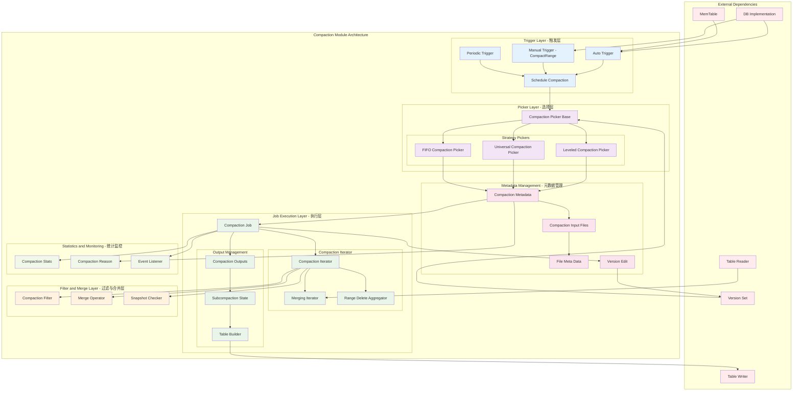
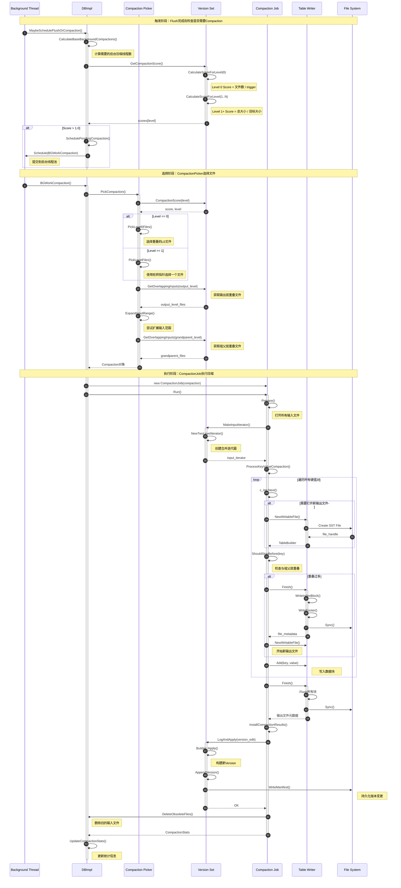
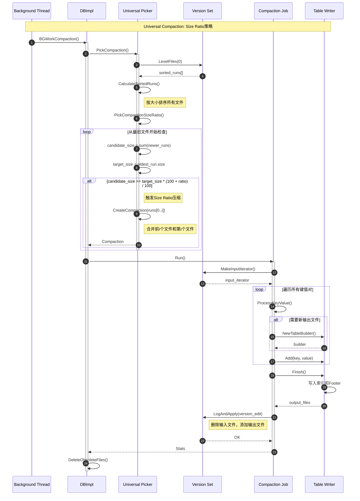
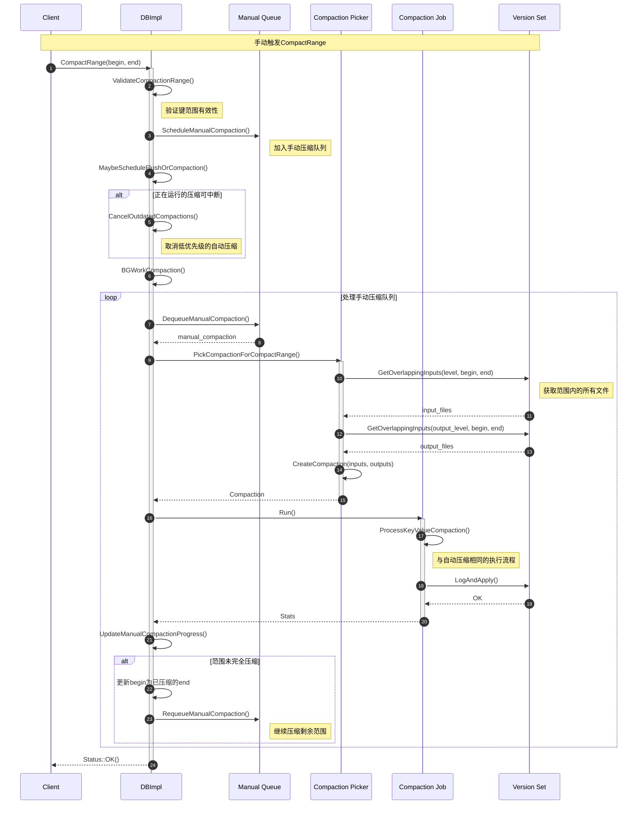
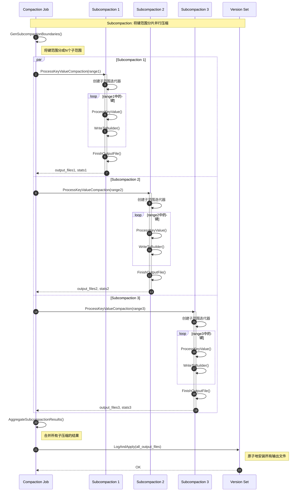

# RocksDB-05-Compaction模块

## 模块概览

## 1. 模块职责与边界

### 核心职责
Compaction模块是RocksDB的后台压缩合并模块，负责维护LSM-Tree的健康状态：

- **文件合并**：将多个SST文件合并成更少的文件
- **垃圾回收**：删除过期数据、被覆盖的旧版本数据
- **读放大优化**：减少需要查找的SST文件数量
- **空间回收**：清理删除标记和过期数据，回收磁盘空间
- **写放大控制**：通过合理的压缩策略平衡写放大和读放大
- **多策略支持**：Leveled Compaction、Universal Compaction、FIFO Compaction

### 输入输出接口
- **输入**：
  - 待压缩的SST文件列表
  - Compaction触发条件（大小、文件数、分数）
  - Compaction选项（CompactionOptions）
- **输出**：
  - 新生成的SST文件
  - 版本变更（VersionEdit）
  - 统计信息（压缩字节数、删除键数等）

### 上下游依赖关系
- **上游调用方**：
  - DB模块：后台任务调度
  - CompactionScheduler：压缩任务调度器
  - ManualCompaction：手动触发压缩
- **下游依赖**：
  - Table模块：读取输入SST，写入输出SST
  - VersionSet：版本管理和文件元数据
  - CompactionFilter：用户自定义过滤逻辑
  - MergeOperator：合并操作符

### 生命周期管理
1. **触发阶段**：
   - 自动触发：Flush完成、分数达到阈值、文件数超限
   - 手动触发：用户调用CompactRange
   - 定期触发：周期性压缩（删除过期数据）
2. **选择阶段**：
   - CompactionPicker选择待压缩文件
   - 确定输入层和输出层
   - 计算压缩范围和祖父文件
3. **执行阶段**：
   - CompactionJob执行压缩
   - 迭代输入文件，合并排序键
   - 应用CompactionFilter和MergeOperator
   - 生成输出SST文件
4. **完成阶段**：
   - 安装新版本（VersionEdit）
   - 删除旧文件
   - 更新统计信息

## 2. 模块架构图



### 架构图详细说明

#### 分层设计
- **触发层**：响应各种触发条件，启动压缩任务
- **选择层**：根据压缩策略选择待压缩文件
- **执行层**：实际执行压缩，读取输入文件，生成输出文件
- **过滤层**：应用用户自定义过滤和合并逻辑

#### 压缩策略
1. **Leveled Compaction**：默认策略，分层压缩，每层大小呈指数增长
2. **Universal Compaction**：通用压缩，适合写密集场景
3. **FIFO Compaction**：先进先出，只删除旧文件，适合时序数据

## 3. Leveled Compaction策略

### 3.1 Leveled Compaction原理

Leveled Compaction是RocksDB的默认压缩策略，其核心思想是将数据组织成多个层级：

```
Level 0:  [10MB] [10MB] [10MB] [10MB]  ← 文件可能重叠
Level 1:  [------------- 100MB -------------]  ← 文件不重叠
Level 2:  [------------- 1000MB ------------]
Level 3:  [------------- 10GB --------------]
...
```

**特点**：

- **Level 0特殊**：由Flush直接生成，文件间可能重叠
- **Level 1+有序**：文件按键范围排序，互不重叠
- **层级放大**：每层大小约为上一层的10倍（可配置）
- **目标**：优化读放大，读取时最多查找每层一个文件

### 3.2 Leveled Compaction实现

```cpp
// Leveled Compaction的核心实现
class LevelCompactionPicker : public CompactionPicker {
public:
    Compaction* PickCompaction(
        const std::string& cf_name,
        const MutableCFOptions& mutable_cf_options,
        const MutableDBOptions& mutable_db_options,
        VersionStorageInfo* vstorage,
        LogBuffer* log_buffer) override {
        
        // 1. 找到需要压缩的层级
        //    根据score（压缩紧迫度）排序
        int level = -1;
        int output_level = -1;
        
        // 遍历所有层级，找到score最高的层
        for (int i = 0; i < vstorage->num_levels() - 1; i++) {
            double score = vstorage->CompactionScore(i);
            if (score > 1.0) {  // score > 1 表示需要压缩
                level = i;
                output_level = (level == 0) ?
                    mutable_cf_options.level0_file_num_compaction_trigger : level + 1;
                break;
            }
        }
        
        if (level == -1) {
            // 没有需要压缩的层级
            return nullptr;
        }
        
        // 2. 选择输入文件
        std::vector<FileMetaData*> inputs;
        if (level == 0) {
            // Level 0特殊处理：选择所有文件或部分文件
            PickLevel0Files(vstorage, mutable_cf_options, &inputs);
        } else {
            // Level 1+：选择一个文件（轮转策略）
            PickLevelFiles(vstorage, level, &inputs);
        }
        
        if (inputs.empty()) {
            return nullptr;
        }
        
        // 3. 确定输出层的重叠文件
        std::vector<FileMetaData*> output_level_inputs;
        InternalKey smallest, largest;
        GetRange(inputs, &smallest, &largest);
        
        vstorage->GetOverlappingInputs(
            output_level, &smallest, &largest, &output_level_inputs);
        
        // 4. 检查祖父层（output_level + 1）的重叠情况
        //    如果重叠过多，可能需要调整输入范围
        std::vector<FileMetaData*> grandparents;
        vstorage->GetOverlappingInputs(
            output_level + 1, &smallest, &largest, &grandparents);
        
        uint64_t grandparent_overlap = TotalFileSize(grandparents);
        
        // 5. 检查是否需要扩展输入范围
        //    如果可以在不增加太多额外工作的情况下包含更多文件，就扩展
        if (!ExpandInputRange(vstorage, level, output_level, &inputs,
                              &output_level_inputs, &smallest, &largest)) {
            return nullptr;
        }
        
        // 6. 创建Compaction对象
        CompactionInputFiles input_files_l0, input_files_output;
        input_files_l0.level = level;
        input_files_l0.files = inputs;
        input_files_output.level = output_level;
        input_files_output.files = output_level_inputs;
        
        std::vector<CompactionInputFiles> inputs_vec;
        inputs_vec.push_back(input_files_l0);
        if (!output_level_inputs.empty()) {
            inputs_vec.push_back(input_files_output);
        }
        
        Compaction* c = new Compaction(
            vstorage, ioptions_, mutable_cf_options, mutable_db_options,
            std::move(inputs_vec), output_level,
            mutable_cf_options.target_file_size_base,
            mutable_cf_options.max_compaction_bytes,
            /* output_path_id */ 0,
            GetCompressionType(mutable_cf_options, output_level),
            GetCompressionOptions(mutable_cf_options, output_level),
            /* max_subcompactions */ 0,
            std::move(grandparents),
            /* manual_compaction */ false,
            /* score */ vstorage->CompactionScore(level),
            /* deletion_compaction */ false,
            CompactionReason::kLevelL0FilesNum);
        
        return c;
    }
    
private:
    // 选择Level 0的文件
    void PickLevel0Files(VersionStorageInfo* vstorage,
                        const MutableCFOptions& mutable_cf_options,
                        std::vector<FileMetaData*>* inputs) {
        
        // Level 0文件可能重叠，需要选择互相重叠的所有文件
        // 策略：从最旧的文件开始，扩展到所有重叠文件
        
        for (size_t i = 0; i < vstorage->LevelFiles(0).size(); ++i) {
            FileMetaData* f = vstorage->LevelFiles(0)[i];
            
            // 检查是否满足触发条件
            if (inputs->empty()) {
                inputs->push_back(f);
            } else {
                // 检查是否与已选文件重叠
                InternalKey smallest, largest;
                GetRange(*inputs, &smallest, &largest);
                
                if (f->largest.Compare(smallest) >= 0 &&
                    f->smallest.Compare(largest) <= 0) {
                    // 重叠，加入
                    inputs->push_back(f);
                }
            }
            
            // 限制文件数量
            if (inputs->size() >=
                static_cast<size_t>(mutable_cf_options.max_compaction_bytes /
                                   mutable_cf_options.target_file_size_base)) {
                break;
            }
        }
    }
    
    // 选择Level 1+的文件（轮转策略）
    void PickLevelFiles(VersionStorageInfo* vstorage, int level,
                       std::vector<FileMetaData*>* inputs) {
        
        // 使用轮转策略：记录上次压缩的结束键，从下一个文件开始
        // 这样可以均匀地压缩整个层级
        
        const std::vector<FileMetaData*>& level_files = vstorage->LevelFiles(level);
        
        // 找到上次压缩结束位置之后的第一个文件
        size_t start_index = 0;
        InternalKey* start_key = vstorage->GetCompactionPointer(level);
        
        if (start_key != nullptr) {
            for (size_t i = 0; i < level_files.size(); i++) {
                if (level_files[i]->largest.Compare(*start_key) > 0) {
                    start_index = i;
                    break;
                }
            }
        }
        
        // 选择一个文件
        if (start_index < level_files.size()) {
            inputs->push_back(level_files[start_index]);
        } else if (!level_files.empty()) {
            // 如果已经到末尾，从头开始
            inputs->push_back(level_files[0]);
        }
    }
    
    // 扩展输入范围以减少未来的压缩工作
    bool ExpandInputRange(VersionStorageInfo* vstorage,
                         int level, int output_level,
                         std::vector<FileMetaData*>* inputs,
                         std::vector<FileMetaData*>* output_level_inputs,
                         InternalKey* smallest, InternalKey* largest) {
        
        // 尝试扩展输入文件范围，条件是：
        // 1. 不增加太多额外的数据量
        // 2. 可以减少未来的压缩次数
        
        uint64_t original_size = TotalFileSize(*inputs) +
                                TotalFileSize(*output_level_inputs);
        
        std::vector<FileMetaData*> expanded_inputs = *inputs;
        InternalKey expanded_smallest, expanded_largest;
        
        // 尝试向左右扩展
        vstorage->GetOverlappingInputs(level, smallest, largest,
                                      &expanded_inputs);
        
        GetRange(expanded_inputs, &expanded_smallest, &expanded_largest);
        
        std::vector<FileMetaData*> expanded_output_inputs;
        vstorage->GetOverlappingInputs(output_level, &expanded_smallest,
                                      &expanded_largest, &expanded_output_inputs);
        
        uint64_t expanded_size = TotalFileSize(expanded_inputs) +
                                TotalFileSize(expanded_output_inputs);
        
        // 只有在增加的数据量不超过25%时才扩展
        if (expanded_size <= original_size * 1.25) {
            *inputs = expanded_inputs;
            *output_level_inputs = expanded_output_inputs;
            *smallest = expanded_smallest;
            *largest = expanded_largest;
        }
        
        return true;
    }
};
```

**Leveled Compaction要点**：

- **Score计算**：Level 0按文件数计算，Level 1+按总大小计算
- **轮转策略**：Level 1+使用轮转指针，确保均匀压缩
- **扩展优化**：在合理范围内扩展输入，减少未来压缩次数
- **祖父层检查**：避免产生过多与祖父层重叠的输出

## 4. Universal Compaction策略

### 4.1 Universal Compaction原理

Universal Compaction适合写密集场景，其特点是：

- **所有文件按时间排序**：不分层级（或只有两层）
- **Sorted Runs**：每个文件或文件组是一个sorted run
- **触发条件**：根据大小比例、文件数等触发压缩
- **目标**：减少写放大，但可能增加读放大

```
Time →
[100MB] [90MB] [80MB] [70MB] [500MB]
  ↓       ↓      ↓      ↓       ↓
  较新文件                      最旧文件

压缩策略：

1. Size Ratio: 如果较新文件总大小 > 最旧文件 * ratio，则合并
2. File Count: 如果文件数超过阈值，合并较小文件
3. Space Amplification: 如果空间放大超过阈值，全量压缩

```

### 4.2 Universal Compaction实现

```cpp
// Universal Compaction的核心实现
class UniversalCompactionPicker : public CompactionPicker {
public:
    Compaction* PickCompaction(
        const std::string& cf_name,
        const MutableCFOptions& mutable_cf_options,
        VersionStorageInfo* vstorage,
        LogBuffer* log_buffer) override {
        
        // 1. 计算sorted runs
        std::vector<SortedRun> sorted_runs;
        for (FileMetaData* f : vstorage->LevelFiles(0)) {
            sorted_runs.push_back({f->fd.GetFileSize(), f});
        }
        
        // 按大小排序
        std::sort(sorted_runs.begin(), sorted_runs.end(),
                 [](const SortedRun& a, const SortedRun& b) {
                     return a.size > b.size;
                 });
        
        int file_num_compaction_trigger =
            mutable_cf_options.level0_file_num_compaction_trigger;
        
        if (sorted_runs.size() < file_num_compaction_trigger) {
            // 文件数不足，无需压缩
            return nullptr;
        }
        
        // 2. 尝试不同的压缩策略
        Compaction* c = nullptr;
        
        // 策略1：空间放大压缩
        c = PickCompactionSpaceAmplification(cf_name, mutable_cf_options,
                                            vstorage, sorted_runs, log_buffer);
        if (c != nullptr) return c;
        
        // 策略2：大小比例压缩
        c = PickCompactionSizeRatio(cf_name, mutable_cf_options, vstorage,
                                   sorted_runs, log_buffer);
        if (c != nullptr) return c;
        
        // 策略3：减少文件数压缩
        c = PickCompactionReduceNumSortedRuns(cf_name, mutable_cf_options,
                                             vstorage, sorted_runs, log_buffer);
        
        return c;
    }
    
private:
    // 空间放大压缩：当空间放大超过阈值时，全量压缩
    Compaction* PickCompactionSpaceAmplification(
        const std::string& cf_name,
        const MutableCFOptions& mutable_cf_options,
        VersionStorageInfo* vstorage,
        const std::vector<SortedRun>& sorted_runs,
        LogBuffer* log_buffer) {
        
        // 计算空间放大
        // space_amp = (total_size - newest_run_size) / newest_run_size
        
        uint64_t total_size = 0;
        for (const auto& run : sorted_runs) {
            total_size += run.size;
        }
        
        uint64_t newest_run_size = sorted_runs[0].size;
        double space_amp = static_cast<double>(total_size - newest_run_size) /
                          newest_run_size;
        
        int space_amp_threshold =
            mutable_cf_options.compaction_options_universal.max_size_amplification_percent;
        
        if (space_amp * 100 < space_amp_threshold) {
            // 空间放大未超过阈值
            return nullptr;
        }
        
        // 触发全量压缩
        ROCKS_LOG_BUFFER(log_buffer,
            "[%s] Universal: space amplification %.2f%% triggers compaction\n",
            cf_name.c_str(), space_amp * 100);
        
        // 选择所有文件进行压缩
        std::vector<CompactionInputFiles> inputs(1);
        inputs[0].level = 0;
        for (const auto& run : sorted_runs) {
            inputs[0].files.push_back(run.file);
        }
        
        return new Compaction(
            vstorage, ioptions_, mutable_cf_options, mutable_db_options,
            std::move(inputs), /* output_level */ 0,
            mutable_cf_options.target_file_size_base,
            mutable_cf_options.max_compaction_bytes,
            /* output_path_id */ 0,
            GetCompressionType(mutable_cf_options, 0),
            GetCompressionOptions(mutable_cf_options, 0),
            /* max_subcompactions */ 0,
            /* grandparents */ {},
            /* manual_compaction */ false,
            /* score */ space_amp,
            /* deletion_compaction */ false,
            CompactionReason::kUniversalSizeAmplification);
    }
    
    // 大小比例压缩：如果较新文件总大小 > 最旧文件 * ratio，则合并
    Compaction* PickCompactionSizeRatio(
        const std::string& cf_name,
        const MutableCFOptions& mutable_cf_options,
        VersionStorageInfo* vstorage,
        const std::vector<SortedRun>& sorted_runs,
        LogBuffer* log_buffer) {
        
        unsigned int ratio =
            mutable_cf_options.compaction_options_universal.size_ratio;
        
        // 从最旧的文件开始检查
        for (size_t i = sorted_runs.size() - 1; i > 0; i--) {
            uint64_t candidate_size = 0;
            for (size_t j = 0; j < i; j++) {
                candidate_size += sorted_runs[j].size;
            }
            
            uint64_t target_size = sorted_runs[i].size;
            
            // 检查大小比例
            if (candidate_size >= target_size * (100 + ratio) / 100) {
                // 触发压缩：合并前i个文件和第i个文件
                ROCKS_LOG_BUFFER(log_buffer,
                    "[%s] Universal: size ratio triggers compaction: "
                    "candidate_size %" PRIu64 " target_size %" PRIu64 "\n",
                    cf_name.c_str(), candidate_size, target_size);
                
                std::vector<CompactionInputFiles> inputs(1);
                inputs[0].level = 0;
                for (size_t j = 0; j <= i; j++) {
                    inputs[0].files.push_back(sorted_runs[j].file);
                }
                
                return new Compaction(
                    vstorage, ioptions_, mutable_cf_options, mutable_db_options,
                    std::move(inputs), /* output_level */ 0,
                    mutable_cf_options.target_file_size_base,
                    mutable_cf_options.max_compaction_bytes,
                    /* output_path_id */ 0,
                    GetCompressionType(mutable_cf_options, 0),
                    GetCompressionOptions(mutable_cf_options, 0),
                    /* max_subcompactions */ 0,
                    /* grandparents */ {},
                    /* manual_compaction */ false,
                    /* score */ static_cast<double>(candidate_size) / target_size,
                    /* deletion_compaction */ false,
                    CompactionReason::kUniversalSizeRatio);
            }
        }
        
        return nullptr;
    }
    
    // 减少文件数压缩：如果文件数过多，合并较小文件
    Compaction* PickCompactionReduceNumSortedRuns(
        const std::string& cf_name,
        const MutableCFOptions& mutable_cf_options,
        VersionStorageInfo* vstorage,
        const std::vector<SortedRun>& sorted_runs,
        LogBuffer* log_buffer) {
        
        unsigned int min_merge_width =
            mutable_cf_options.compaction_options_universal.min_merge_width;
        unsigned int max_merge_width =
            mutable_cf_options.compaction_options_universal.max_merge_width;
        
        // 找到大小相近的连续文件进行合并
        for (size_t i = 0; i < sorted_runs.size(); i++) {
            unsigned int merge_width = 0;
            uint64_t total_size = 0;
            
            for (size_t j = i; j < sorted_runs.size(); j++) {
                // 检查大小是否相近
                if (j > i && sorted_runs[j].size * 1.2 < sorted_runs[j-1].size) {
                    // 大小差异过大，停止
                    break;
                }
                
                merge_width++;
                total_size += sorted_runs[j].size;
                
                if (merge_width >= min_merge_width &&
                    merge_width <= max_merge_width) {
                    // 找到合适的合并范围
                    std::vector<CompactionInputFiles> inputs(1);
                    inputs[0].level = 0;
                    for (size_t k = i; k <= j; k++) {
                        inputs[0].files.push_back(sorted_runs[k].file);
                    }
                    
                    ROCKS_LOG_BUFFER(log_buffer,
                        "[%s] Universal: reducing sorted runs triggers compaction: "
                        "merge_width %u\n",
                        cf_name.c_str(), merge_width);
                    
                    return new Compaction(
                        vstorage, ioptions_, mutable_cf_options, mutable_db_options,
                        std::move(inputs), /* output_level */ 0,
                        mutable_cf_options.target_file_size_base,
                        mutable_cf_options.max_compaction_bytes,
                        /* output_path_id */ 0,
                        GetCompressionType(mutable_cf_options, 0),
                        GetCompressionOptions(mutable_cf_options, 0),
                        /* max_subcompactions */ 0,
                        /* grandparents */ {},
                        /* manual_compaction */ false,
                        /* score */ 1.0,
                        /* deletion_compaction */ false,
                        CompactionReason::kUniversalSortedRunNum);
                }
            }
        }
        
        return nullptr;
    }
};
```

**Universal Compaction要点**：

- **空间放大优先**：优先处理空间放大问题，避免磁盘浪费
- **大小比例触发**：根据文件大小比例触发，平衡写放大
- **文件数控制**：合并大小相近的文件，减少sorted runs数量
- **写优化**：相比Leveled Compaction，写放大更低

## 5. CompactionJob执行流程

### 5.1 CompactionJob核心实现

```cpp
// CompactionJob的核心执行流程
class CompactionJob {
private:
    Compaction* compact_;
    VersionSet* versions_;
    const ImmutableDBOptions& db_options_;
    
public:
    Status Run() {
        // 1. 准备压缩
        Status status = Prepare();
        if (!status.ok()) {
            return status;
        }
        
        // 2. 执行压缩
        status = ProcessKeyValueCompaction();
        if (!status.ok()) {
            return status;
        }
        
        // 3. 安装结果
        status = Install();
        
        // 4. 清理
        CleanupCompaction();
        
        return status;
    }
    
private:
    Status ProcessKeyValueCompaction() {
        // 1. 创建合并迭代器，遍历所有输入文件
        std::unique_ptr<InternalIterator> input_iter(
            versions_->MakeInputIterator(compact_));
        
        // 2. 创建压缩迭代器，处理删除、合并等逻辑
        CompactionIterator c_iter(
            input_iter.get(), compact_->column_family_data()->user_comparator(),
            &merge_helper_, compact_->compaction_filter(),
            db_options_.info_log.get(), compact_->column_family_data()->GetName());
        
        c_iter.SeekToFirst();
        
        // 3. 遍历所有键值对
        while (c_iter.Valid()) {
            // 检查是否需要创建新的输出文件
            if (ShouldOpenNewOutputFile()) {
                status = OpenCompactionOutputFile();
                if (!status.ok()) {
                    break;
                }
            }
            
            // 写入键值对到输出文件
            status = AddToBuilder(c_iter.key(), c_iter.value());
            if (!status.ok()) {
                break;
            }
            
            c_iter.Next();
            
            // 定期检查是否需要暂停（手动压缩优先级等）
            if (ShouldYield()) {
                // 暂停并yield给其他任务
                c_iter.PrepareToYield();
                Yield();
            }
        }
        
        // 4. 完成最后一个输出文件
        status = FinishCompactionOutputFile();
        
        return status;
    }
    
    bool ShouldOpenNewOutputFile() {
        if (builder_ == nullptr) {
            return true;
        }
        
        // 检查文件大小
        if (builder_->FileSize() >= compact_->max_output_file_size()) {
            return true;
        }
        
        // 检查与祖父层的重叠
        //避免产生与祖父层重叠过多的文件
        if (GrandparentOverlapTooMuch()) {
            return true;
        }
        
        return false;
    }
};
```

**CompactionJob要点**：

- **流式处理**：使用迭代器流式处理数据，内存占用可控
- **Yield机制**：支持暂停和恢复，避免长时间阻塞
- **Subcompaction**：支持并行子压缩，提升性能
- **祖父层检查**：避免产生过多与祖父层重叠的输出

## 6. 性能优化与最佳实践

### 6.1 压缩策略选择

```cpp
// 压缩策略选择指南
struct CompactionStrategySelector {
    // 选择合适的压缩策略
    static CompactionStyle SelectStrategy(const WorkloadPattern& pattern) {
        if (pattern.write_heavy && pattern.sequential_keys) {
            // 写密集 + 顺序键：Universal Compaction
            return kCompactionStyleUniversal;
        } else if (pattern.time_series_data) {
            // 时序数据：FIFO Compaction
            return kCompactionStyleFIFO;
        } else {
            // 通用场景：Leveled Compaction
            return kCompactionStyleLevel;
        }
    }
    
    // 配置Leveled Compaction
    static void ConfigureLeveledCompaction(ColumnFamilyOptions* cf_opts,
                                          size_t write_buffer_size) {
        // Level 0触发阈值
        cf_opts->level0_file_num_compaction_trigger = 4;
        cf_opts->level0_slowdown_writes_trigger = 20;
        cf_opts->level0_stop_writes_trigger = 36;
        
        // 目标文件大小
        cf_opts->target_file_size_base = 64 * 1024 * 1024;  // 64MB
        cf_opts->target_file_size_multiplier = 1;
        
        // Level大小
        cf_opts->max_bytes_for_level_base = 256 * 1024 * 1024;  // 256MB
        cf_opts->max_bytes_for_level_multiplier = 10;
        
        // 压缩线程数
        cf_opts->max_background_compactions = 4;
        
        // 子压缩数（并行度）
        cf_opts->max_subcompactions = 4;
    }
    
    // 配置Universal Compaction
    static void ConfigureUniversalCompaction(ColumnFamilyOptions* cf_opts) {
        cf_opts->compaction_style = kCompactionStyleUniversal;
        
        // Universal Compaction选项
        cf_opts->compaction_options_universal.size_ratio = 1;  // 1%
        cf_opts->compaction_options_universal.min_merge_width = 2;
        cf_opts->compaction_options_universal.max_merge_width = UINT_MAX;
        cf_opts->compaction_options_universal.max_size_amplification_percent = 200;  // 2x
        cf_opts->compaction_options_universal.compression_size_percent = -1;
        
        // 触发阈值
        cf_opts->level0_file_num_compaction_trigger = 2;
    }
};
```

### 6.2 性能监控

```cpp
// 压缩性能监控
struct CompactionMetrics {
    uint64_t total_compaction_bytes_read;
    uint64_t total_compaction_bytes_written;
    uint64_t total_compaction_time_micros;
    uint32_t num_compactions;
    
    // 写放大 = 写入字节数 / 用户写入字节数
    double WriteAmplification() const {
        if (user_bytes_written == 0) return 0;
        return static_cast<double>(total_compaction_bytes_written + user_bytes_written) /
               user_bytes_written;
    }
    
    // 读放大 = 每次查询读取的SST文件数
    double ReadAmplification(int num_levels) const {
        // Level 0可能有多个文件，其他层每层最多1个
        return level0_file_count + (num_levels - 1);
    }
    
    // 空间放大 = 实际占用空间 / 有效数据空间
    double SpaceAmplification() const {
        if (live_data_size == 0) return 0;
        return static_cast<double>(total_size) / live_data_size;
    }
};
```

**Compaction模块优化总结**：

1. **策略选择**：根据工作负载选择合适的压缩策略
2. **参数调优**：调整触发阈值、文件大小、层级放大倍数
3. **并行压缩**：启用subcompaction和多线程压缩
4. **监控指标**：持续监控写放大、读放大、空间放大
5. **手动压缩**：在低峰期手动触发压缩，优化存储

通过合理配置和优化Compaction策略，可以平衡读写性能和空间效率，为不同场景提供最优的性能表现。

---

## 时序图

## 1. 文档说明

本文档详细描述RocksDB Compaction模块的典型操作时序图，涵盖自动触发压缩、手动压缩、以及压缩执行的完整流程。

### 时序图规范
- 使用Mermaid格式绘制时序图
- 每个时序图都配有详细的步骤说明
- 包含正常流程和异常处理路径
- 标注关键的同步点和性能要点

---

## 2. Leveled Compaction触发与执行时序图

### 2.1 自动触发Leveled Compaction



### 2.2 时序图详细说明

#### 触发阶段（步骤1-7）
**目的**：确定是否需要压缩以及哪个层级需要压缩

**关键逻辑**：

1. **Score计算**：
   - Level 0: `score = 文件数 / level0_file_num_compaction_trigger`
   - Level 1+: `score = 层级总大小 / max_bytes_for_level_base * (multiplier ^ (level-1))`
2. **触发条件**：任何层级的score > 1.0
3. **优先级**：选择score最高的层级

**性能要点**：

- Score计算在每次Flush后触发，开销很小
- 后台线程池可并发执行多个压缩任务
- 优先级队列确保score最高的任务先执行

#### 选择阶段（步骤8-20）
**目的**：选择需要压缩的输入文件和输出层文件

**关键逻辑**：

1. **Level 0特殊处理**：
   - 文件可能重叠，需要选择所有重叠文件
   - 从最旧文件开始选择
   
2. **Level 1+轮转策略**：
   - 维护每层的compaction pointer（上次压缩结束位置）
   - 从pointer之后的第一个文件开始
   - 确保整个层级被均匀压缩
   
3. **输出层重叠文件**：
   - 根据输入文件的键范围查找输出层重叠文件
   - 所有重叠文件都需要参与压缩
   
4. **扩展优化**：
   - 如果可以在不增加太多工作量的情况下包含更多文件，就扩展
   - 条件：扩展后的总大小 <= 原大小 * 1.25
   
5. **祖父层检查**：
   - 查找与祖父层（output_level + 1）的重叠
   - 用于限制输出文件大小，避免未来压缩工作过重

**边界条件**：

- 如果层级已经在压缩中，跳过
- 如果没有合适的文件，返回nullptr
- 手动压缩优先于自动压缩

#### 执行阶段（步骤21-47）
**目的**：读取输入文件，合并排序，生成输出文件

**关键流程**：

1. **准备阶段**：
   - 打开所有输入文件的TableReader
   - 创建合并迭代器（MergingIterator）
   - 初始化CompactionFilter和MergeOperator
   
2. **迭代处理**：
   - 按键顺序遍历所有输入
   - 应用CompactionFilter过滤不需要的键
   - 处理Merge操作和删除标记
   - 写入到输出文件
   
3. **输出文件切换**：
   - 文件大小达到target_file_size_base
   - 与祖父层重叠超过max_grandparent_overlap_bytes
   - 确保输出文件不会过大
   
4. **版本安装**：
   - 构建VersionEdit（删除输入文件，添加输出文件）
   - 写入Manifest文件持久化
   - 原子地切换到新Version
   
5. **清理阶段**：
   - 删除旧的输入文件
   - 更新统计信息
   - 通知EventListener

**性能优化**：

- **Subcompaction**：将键范围分片，并行压缩
- **Direct I/O**：减少page cache开销
- **Prefetch**：预读输入文件的索引和过滤器
- **Yield机制**：定期检查是否需要让出CPU给高优先级任务

**异常处理**：

- **I/O错误**：标记文件为损坏，停止压缩
- **空间不足**：暂停压缩，等待空间释放
- **Cancel请求**：手动压缩可取消自动压缩

---

## 3. Universal Compaction时序图

### 3.1 Size Ratio触发的Universal Compaction



### 3.2 Universal Compaction说明

#### Size Ratio策略
**触发条件**：

```
candidate_size >= target_size * (100 + size_ratio) / 100

其中：

- candidate_size = 较新文件的总大小
- target_size = 目标（最旧）文件的大小
- size_ratio = 配置的比例（默认1%）

```

**示例**：

```
Sorted Runs: [100MB, 90MB, 80MB, 500MB]
            (新)              (旧)

检查是否压缩最旧的500MB文件：
candidate_size = 100 + 90 + 80 = 270MB
target_size = 500MB
ratio = 1%

270MB >= 500MB * 1.01 ?
270MB >= 505MB ? 否

继续检查80MB文件：
candidate_size = 100 + 90 = 190MB
target_size = 80MB

190MB >= 80MB * 1.01 ?
190MB >= 80.8MB ? 是 ✓

触发压缩：合并[100MB, 90MB, 80MB]
```

**优点**：

- 减少写放大：只在大小比例合适时才压缩
- 平衡性能：避免频繁的小文件合并

**缺点**：

- 读放大较高：可能存在多个sorted runs
- 空间放大：旧数据可能长期保留

---

## 4. Manual Compaction时序图

### 4.1 CompactRange手动压缩



### 4.2 Manual Compaction说明

#### 手动压缩特点
1. **优先级高**：可以中断正在进行的自动压缩
2. **范围精确**：可以指定精确的键范围
3. **逐层压缩**：可以指定输入层和输出层
4. **阻塞调用**：调用线程会等待压缩完成

#### 分片处理
如果指定的范围很大，可能需要分多次压缩：

```
CompactRange([key1, key1000])

第一轮：压缩 [key1, key300]
第二轮：压缩 [key301, key600]
第三轮：压缩 [key601, key1000]
```

**分片原因**：

- 避免单次压缩工作量过大
- 限制输出文件大小
- 允许其他任务穿插执行

#### 使用场景
1. **数据清理**：删除大量过期数据后，强制压缩回收空间
2. **性能优化**：在低峰期主动压缩，减少读放大
3. **故障恢复**：修复损坏的SST文件
4. **测试验证**：测试压缩功能

---

## 5. Subcompaction并行压缩时序图

### 5.1 Subcompaction执行流程



### 5.2 Subcompaction详细说明

#### 键范围分片策略

```cpp
// 生成子压缩边界
std::vector<Slice> boundaries;

// 1. 估算总数据量
uint64_t total_size = CalculateTotalInputSize();

// 2. 确定子压缩数量
int max_subcompactions = options.max_subcompactions;
uint64_size_per_subcompaction = total_size / max_subcompactions;

// 3. 扫描输入文件，在合适位置切分
for (file in input_files) {
    if (accumulated_size >= size_per_subcompaction) {
        boundaries.push_back(file.largest_key);
        accumulated_size = 0;
    }
    accumulated_size += file.size;
}
```

#### 并行执行要点
1. **独立性**：每个子压缩处理不重叠的键范围
2. **资源隔离**：每个子压缩有独立的TableBuilder和缓冲区
3. **结果合并**：所有输出文件在最后一起安装到Version

#### 性能收益
- **CPU利用率**：充分利用多核CPU
- **I/O并行**：多个线程同时读写，提升吞吐
- **延迟优化**：压缩时间缩短到原来的1/N

#### 适用场景
- 大范围的手动压缩
- 大文件的Level 0到Level 1压缩
- 高层级（Level 3+）的大规模压缩

#### 不适用场景
- 小文件压缩（overhead大于收益）
- Level 0内部压缩（文件重叠复杂）
- 输出文件数很少的场景

---

## 6. 性能监控与调优

### 6.1 Compaction性能指标

```cpp
// 关键性能指标
struct CompactionMetrics {
    // 吞吐量指标
    uint64_t bytes_read;          // 读取字节数
    uint64_t bytes_written;        // 写入字节数
    uint64_t duration_micros;      // 压缩耗时（微秒）
    
    // 效率指标
    double write_amplification() {
        return (double)(bytes_written + user_bytes_written) / user_bytes_written;
    }
    
    double throughput_mb_per_sec() {
        return (bytes_read + bytes_written) / duration_micros;
    }
    
    // 调度指标
    uint64_t wait_micros;          // 等待调度时间
    uint64_t cpu_micros;           // CPU时间
    uint64_t io_micros;            // I/O等待时间
    
    // 文件指标
    int num_input_files;
    int num_output_files;
    int num_input_records;
    int num_output_records;
    int num_dropped_records;       // 被CompactionFilter过滤的记录数
};
```

### 6.2 调优建议

#### 减少压缩频率

```cpp
// 增大触发阈值
options.level0_file_num_compaction_trigger = 8;  // 默认4
options.max_bytes_for_level_base = 512 * 1024 * 1024;  // 默认256MB

// 增大层级放大倍数
options.max_bytes_for_level_multiplier = 10;  // 默认10
```

#### 提升压缩速度

```cpp
// 增加压缩线程
options.max_background_compactions = 8;  // 默认1

// 启用并行子压缩
options.max_subcompactions = 4;  // 默认1

// 使用更快的压缩算法
options.compression_per_level[0] = kNoCompression;  // L0不压缩
options.compression_per_level[1] = kLZ4Compression;  // L1用LZ4
// L2+用Zstd
```

#### 控制写放大

```cpp
// 使用Universal Compaction
options.compaction_style = kCompactionStyleUniversal;
options.compaction_options_universal.size_ratio = 1;

// 或调整Leveled参数
options.target_file_size_base = 128 * 1024 * 1024;  // 增大文件
options.level0_file_num_compaction_trigger = 2;  // 更早触发
```

---

## 7. 时序图总结

### 7.1 关键时序特征

| 压缩类型 | 触发方式 | 文件选择策略 | 输出层级 | 适用场景 |
|---------|---------|------------|---------|---------|
| Leveled Auto | Score > 1.0 | 轮转选择 | Level + 1 | 通用场景 |
| Universal Size Ratio | 大小比例 | 连续文件 | Level 0 | 写密集 |
| Universal Space Amp | 空间放大 > 阈值 | 全部文件 | Level 0 | 空间优化 |
| Manual CompactRange | 用户调用 | 范围覆盖 | 指定层 | 维护操作 |
| Subcompaction | 大范围压缩 | 键范围分片 | 同上 | 性能优化 |

### 7.2 性能优化要点

1. **选择阶段优化**：
   - 快速计算Score，避免阻塞写入
   - 轮转策略确保均匀压缩
   - 扩展优化减少未来压缩次数

2. **执行阶段优化**：
   - 流式处理，内存占用可控
   - 并行子压缩，充分利用多核
   - Prefetch预读，减少I/O等待
   - Yield机制，避免长时间阻塞

3. **安装阶段优化**：
   - 批量更新Manifest，减少I/O
   - 原子切换Version，保证一致性
   - 异步删除文件，不阻塞前台

通过理解这些时序流程和优化要点，可以更好地配置和调优RocksDB的Compaction行为，在不同场景下取得最佳性能。

---
