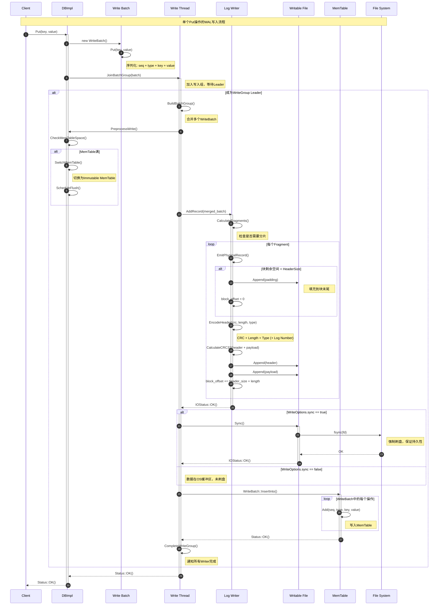
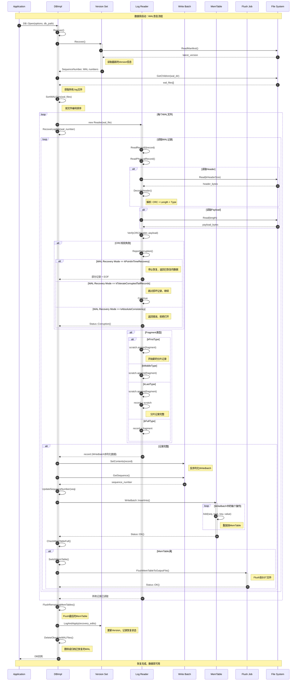
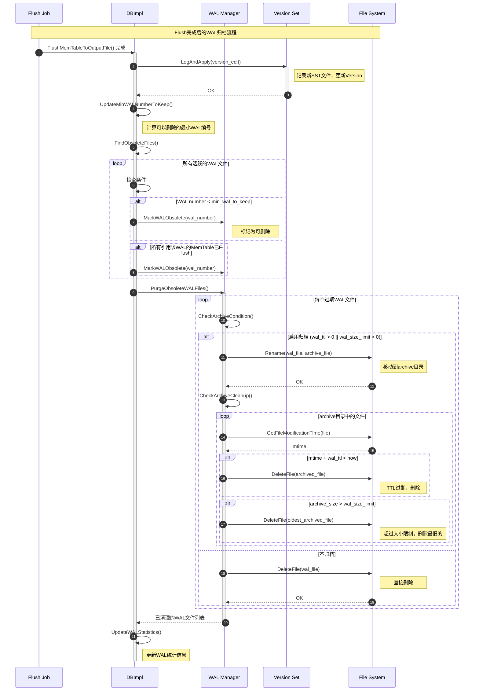
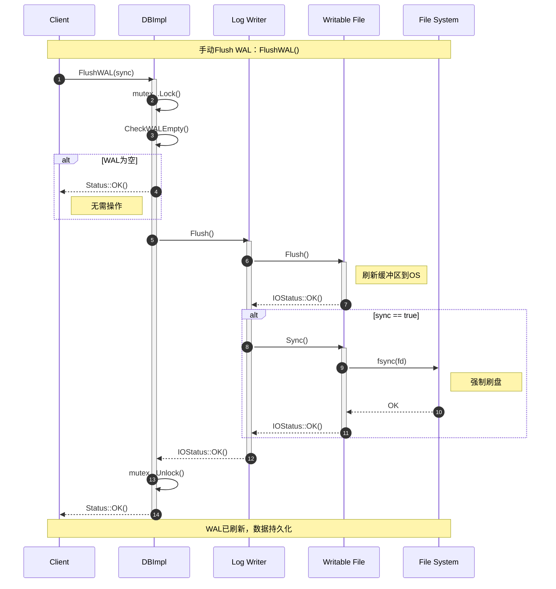

# RocksDB-06-WAL模块

## 模块概览

## 1. 模块职责与边界

### 核心职责
WAL（Write-Ahead Log）模块是RocksDB的预写日志模块，负责保证数据持久性和故障恢复：

- **持久性保证**：在数据写入MemTable前先写入WAL，保证crash后可恢复
- **故障恢复**：数据库启动时重放WAL日志，恢复未持久化的数据
- **原子性保证**：WriteBatch作为一个整体写入WAL，保证原子性
- **顺序写优化**：WAL采用顺序追加写入，性能优异
- **日志管理**：自动归档和删除旧的WAL文件
- **校验与验证**：CRC校验确保日志完整性

### 输入输出接口
- **输入**：
  - WriteBatch：批量写入操作
  - WriteOptions：写入选项（是否sync等）
  - SequenceNumber：序列号
- **输出**：
  - WAL文件：日志文件（`.log`）
  - Recovery Iterator：恢复时的日志迭代器
  - 统计信息：写入字节数、sync次数等

### 上下游依赖关系
- **上游调用方**：
  - DB模块：所有写入操作
  - WriteThread：写入线程管理
  - Transaction：事务写入
- **下游依赖**：
  - File模块：文件I/O操作
  - WritableFileWriter：缓冲写入
  - CRC32：校验和计算

### 生命周期管理
1. **创建阶段**：
   - 数据库打开时创建新WAL文件
   - 文件命名：`<number>.log`
   - 预分配空间（如果启用）
2. **写入阶段**：
   - WriteBatch序列化为日志记录
   - 追加到WAL文件
   - 可选fsync刷盘
3. **归档阶段**：
   - MemTable Flush完成后，WAL文件可归档
   - 移动到`archive/`目录或直接删除
4. **恢复阶段**：
   - 数据库启动时扫描WAL文件
   - 按序列号排序后逐个重放
   - 恢复MemTable数据

## 2. 模块架构图

```mermaid
flowchart TB
    subgraph "WAL Module Architecture"
        subgraph "Writer Layer - 写入层"
            LogWriter[Log Writer]
            subgraph "Write Operations"
                AddRecord[Add Record]
                AddRecordWithTimestamp[Add Record With Timestamp]
                MaybeAddUserDefinedTimestamp[Maybe Add UDT Size Record]
            end
            subgraph "Buffering"
                WriteBuffer[Write Buffer]
                FlushBuffer[Flush Buffer]
            end
        end
        
        subgraph "Reader Layer - 读取层"
            LogReader[Log Reader]
            subgraph "Read Operations"
                ReadRecord[Read Record]
                ReadPhysicalRecord[Read Physical Record]
                ReportCorruption[Report Corruption]
            end
            subgraph "Recovery"
                RecoveryReader[Recovery Reader]
                ReplayWAL[Replay WAL]
            end
        end
        
        subgraph "Format Layer - 格式层"
            RecordFormat[Record Format]
            subgraph "Record Types"
                FullType[Full Type]
                FragmentTypes[Fragment Types: First/Middle/Last]
                RecyclableTypes[Recyclable Types]
                MetadataTypes[Metadata Types]
            end
            subgraph "Encoding"
                HeaderEncoding[Header Encoding]
                CRCCalculation[CRC Calculation]
                Payload[Payload]
            end
        end
        
        subgraph "File Management - 文件管理"
            WALManager[WAL Manager]
            subgraph "File Operations"
                CreateWAL[Create WAL]
                ArchiveWAL[Archive WAL]
                DeleteWAL[Delete WAL]
            end
            subgraph "File Tracking"
                AliveWALFiles[Alive WAL Files]
                ArchivedFiles[Archived Files]
                MinWALNumber[Min WAL Number to Keep]
            end
        end
        
        subgraph "Integration - 集成层"
            WriteBatch[Write Batch]
            MemTable[MemTable]
            VersionEdit[Version Edit]
        end
        
        subgraph "Options and Config - 配置层"
            WALRecoveryMode[WAL Recovery Mode]
            ManualWALFlush[Manual WAL Flush]
            WALSizeLimitMB[WAL Size Limit MB]
            WALTTLSeconds[WAL TTL Seconds]
        end
    end
    
    subgraph "External Dependencies"
        WritableFileWriter[Writable File Writer]
        SequentialFileReader[Sequential File Reader]
        FileSystem[File System]
        DBImpl[DB Implementation]
    end
    
    %% Writer Connections
    LogWriter --> AddRecord
    LogWriter --> AddRecordWithTimestamp
    LogWriter --> MaybeAddUserDefinedTimestamp
    AddRecord --> WriteBuffer
    WriteBuffer --> FlushBuffer
    FlushBuffer --> WritableFileWriter
    
    %% Reader Connections
    LogReader --> ReadRecord
    ReadRecord --> ReadPhysicalRecord
    ReadPhysicalRecord --> ReportCorruption
    LogReader --> RecoveryReader
    RecoveryReader --> ReplayWAL
    LogReader --> SequentialFileReader
    
    %% Format Connections
    AddRecord --> RecordFormat
    ReadRecord --> RecordFormat
    RecordFormat --> FullType
    RecordFormat --> FragmentTypes
    RecordFormat --> RecyclableTypes
    RecordFormat --> MetadataTypes
    RecordFormat --> HeaderEncoding
    HeaderEncoding --> CRCCalculation
    HeaderEncoding --> Payload
    
    %% File Management
    WALManager --> CreateWAL
    WALManager --> ArchiveWAL
    WALManager --> DeleteWAL
    WALManager --> AliveWALFiles
    WALManager --> ArchivedFiles
    WALManager --> MinWALNumber
    CreateWAL --> LogWriter
    
    %% Integration
    WriteBatch --> AddRecord
    ReplayWAL --> MemTable
    ReplayWAL --> VersionEdit
    
    %% Options
    WALRecoveryMode --> RecoveryReader
    ManualWALFlush --> FlushBuffer
    WALSizeLimitMB --> ArchiveWAL
    WALTTLSeconds --> DeleteWAL
    
    %% External
    DBImpl --> LogWriter
    DBImpl --> WALManager
    WritableFileWriter --> FileSystem
    SequentialFileReader --> FileSystem
    
    classDef writerClass fill:#e3f2fd
    classDef readerClass fill:#f3e5f5
    classDef formatClass fill:#e8f5e8
    classDef fileClass fill:#fff3e0
    classDef integrationClass fill:#fce4ec
    classDef configClass fill:#f1f8e9
    classDef externalClass fill:#ffebee
    
    class LogWriter,AddRecord,AddRecordWithTimestamp,MaybeAddUserDefinedTimestamp,WriteBuffer,FlushBuffer writerClass
    class LogReader,ReadRecord,ReadPhysicalRecord,ReportCorruption,RecoveryReader,ReplayWAL readerClass
    class RecordFormat,FullType,FragmentTypes,RecyclableTypes,MetadataTypes,HeaderEncoding,CRCCalculation,Payload formatClass
    class WALManager,CreateWAL,ArchiveWAL,DeleteWAL,AliveWALFiles,ArchivedFiles,MinWALNumber fileClass
    class WriteBatch,MemTable,VersionEdit integrationClass
    class WALRecoveryMode,ManualWALFlush,WALSizeLimitMB,WALTTLSeconds configClass
    class WritableFileWriter,SequentialFileReader,FileSystem,DBImpl externalClass
```



### 架构图详细说明

#### 分层设计
- **写入层**：负责将WriteBatch写入WAL文件
- **读取层**：负责读取和解析WAL文件，支持故障恢复
- **格式层**：定义WAL记录格式和编码规则
- **文件管理层**：管理WAL文件的创建、归档和删除

#### 写入流程
1. **序列化**：WriteBatch序列化为字节流
2. **分片**：如果记录过大，分片为多个fragment
3. **编码**：添加header（CRC + length + type）
4. **写入**：追加到WAL文件的write buffer
5. **Flush**：根据策略刷新buffer到文件
6. **Sync**：可选的fsync刷盘操作

#### 恢复流程
1. **扫描**：扫描WAL目录，找到所有`.log`文件
2. **排序**：按文件编号排序
3. **读取**：逐个读取WAL记录
4. **验证**：CRC校验，检测损坏
5. **重放**：将WriteBatch重放到MemTable
6. **清理**：恢复完成后可删除或归档WAL

## 3. WAL文件格式

### 3.1 文件结构

```
WAL File Structure:
┌───────────────────────────────────────────────────────────────┐
│                        Block 0 (32KB)                         │
│  ┌──────────┬──────────┬──────────┬──────────┬──────────┐   │
│  │ Record 1 │ Record 2 │ Record 3 │  ...     │ Padding  │   │
│  └──────────┴──────────┴──────────┴──────────┴──────────┘   │
├───────────────────────────────────────────────────────────────┤
│                        Block 1 (32KB)                         │
│  ┌──────────┬──────────┬──────────┬──────────┬──────────┐   │
│  │ Record N │  ...     │          │          │ Padding  │   │
│  └──────────┴──────────┴──────────┴──────────┴──────────┘   │
├───────────────────────────────────────────────────────────────┤
│                           ...                                 │
└───────────────────────────────────────────────────────────────┘
```

**块（Block）**：

- **大小**：固定32KB（`kBlockSize = 32768`）
- **边界**：记录不跨块，剩余空间用`\0`填充
- **对齐**：便于direct I/O和错误恢复

### 3.2 记录格式

#### Legacy Record Format（旧格式）

```
┌─────────┬───────────┬───────────┬─────────────┐
│ CRC     │ Length    │ Type      │ Payload     │
│ (4B)    │ (2B)      │ (1B)      │ (Length B)  │
└─────────┴───────────┴───────────┴─────────────┘
```

#### Recyclable Record Format（可回收格式）

```
┌─────────┬───────────┬───────────┬────────────┬─────────────┐
│ CRC     │ Length    │ Type      │ Log Number │ Payload     │
│ (4B)    │ (2B)      │ (1B)      │ (4B)       │ (Length B)  │
└─────────┴───────────┴───────────┴────────────┴─────────────┘
```

**字段说明**：

- **CRC (4 bytes)**：
  - 32位CRC32校验和
  - 计算范围：Type + Log Number（如果有）+ Payload
  - 用于检测数据损坏
  
- **Length (2 bytes)**：
  - Payload的长度
  - 最大65535字节
  - 如果记录超过此长度，需要分片
  
- **Type (1 byte)**：
  - 记录类型标识
  - 见下文"记录类型"
  
- **Log Number (4 bytes, 仅Recyclable格式)**：
  - WAL文件编号
  - 用于区分不同WAL文件的记录
  - 支持WAL文件回收复用
  
- **Payload (variable)**：
  - 实际数据（WriteBatch序列化后的字节流）

### 3.3 记录类型

```cpp
enum RecordType : uint8_t {
    // 完整记录（不需要分片）
    kFullType = 1,
    
    // 分片记录（记录太大，跨多个物理记录）
    kFirstType = 2,      // 第一个分片
    kMiddleType = 3,     // 中间分片
    kLastType = 4,       // 最后一个分片
    
    // 可回收格式（支持WAL文件复用）
    kRecyclableFullType = 5,
    kRecyclableFirstType = 6,
    kRecyclableMiddleType = 7,
    kRecyclableLastType = 8,
    
    // 元数据记录
    kSetCompressionType = 9,  // 设置压缩类型
    kUserDefinedTimestampSizeType = 10,  // 用户定义时间戳大小
    kRecyclableUserDefinedTimestampSizeType = 11,
    
    // 预留用于预分配文件
    kZeroType = 0,
};
```

**记录类型说明**：

- **Full Type**：记录完整在一个物理记录中
- **Fragment Types**：记录被分成多个分片，First → Middle* → Last
- **Recyclable Types**：可回收格式，包含Log Number字段
- **Metadata Types**：元数据记录，不包含用户数据

### 3.4 分片示例

当WriteBatch大小超过块剩余空间时，需要分片：

```
Block N:
┌────────────────────────────────┬──────────┐
│ ...existing records...         │ 5KB left │
└────────────────────────────────┴──────────┘

需要写入10KB的WriteBatch:
┌──────────────────────────────────────────┐
│ WriteBatch (10KB)                        │
└──────────────────────────────────────────┘

分片后:
Block N:
┌─────────────────────┬──────────────────┬───┐
│ ...existing...      │ First (5KB-7B)   │ 0 │
└─────────────────────┴──────────────────┴───┘
                        ↓
Block N+1:
┌─────────────────────────────┬──────────────┐
│ Last (remaining data)       │ Padding      │
└─────────────────────────────┴──────────────┘
```

## 4. WAL Writer核心实现

### 4.1 LogWriter实现

```cpp
namespace log {

class Writer {
private:
    WritableFileWriter* dest_;     // 目标文件
    uint64_t block_offset_;        // 当前块内偏移
    uint32_t log_number_;          // WAL文件编号
    bool recycle_log_files_;       // 是否回收WAL文件
    
public:
    explicit Writer(WritableFileWriter* dest, uint64_t log_number,
                   bool recycle_log_files)
        : dest_(dest),
          block_offset_(0),
          log_number_(log_number),
          recycle_log_files_(recycle_log_files) {}
    
    // 添加记录
    IOStatus AddRecord(const WriteOptions& write_options,
                      const Slice& slice,
                      SequenceNumber seq = kMaxSequenceNumber) {
        
        const char* ptr = slice.data();
        size_t left = slice.size();
        
        IOStatus s;
        bool begin = true;
        
        // 循环写入，可能需要分片
        do {
            // 计算块剩余空间
            const int leftover = kBlockSize - block_offset_;
            assert(leftover >= 0);
            
            // 如果剩余空间不足以容纳header，切换到新块
            if (leftover < kHeaderSize) {
                if (leftover > 0) {
                    // 填充0到块末尾
                    static_assert(kHeaderSize == 7, "");
                    s = dest_->Append(write_options,
                                     Slice("\x00\x00\x00\x00\x00\x00", leftover));
                    if (!s.ok()) {
                        return s;
                    }
                }
                block_offset_ = 0;
            }
            
            // 计算当前分片大小
            const size_t avail = kBlockSize - block_offset_ - kHeaderSize;
            const size_t fragment_length = (left < avail) ? left : avail;
            
            // 确定记录类型
            RecordType type;
            const bool end = (left == fragment_length);
            if (begin && end) {
                type = recycle_log_files_ ? kRecyclableFullType : kFullType;
            } else if (begin) {
                type = recycle_log_files_ ? kRecyclableFirstType : kFirstType;
            } else if (end) {
                type = recycle_log_files_ ? kRecyclableLastType : kLastType;
            } else {
                type = recycle_log_files_ ? kRecyclableMiddleType : kMiddleType;
            }
            
            // 写入物理记录
            s = EmitPhysicalRecord(write_options, type, ptr, fragment_length);
            if (!s.ok()) {
                return s;
            }
            
            ptr += fragment_length;
            left -= fragment_length;
            begin = false;
        } while (left > 0);
        
        return s;
    }
    
private:
    IOStatus EmitPhysicalRecord(const WriteOptions& write_options,
                               RecordType type,
                               const char* ptr,
                               size_t length) {
        
        assert(length <= 0xffff);  // 2字节length字段限制
        
        // 构造header
        char buf[kRecyclableHeaderSize];
        
        // Length (2 bytes)
        buf[4] = static_cast<char>(length & 0xff);
        buf[5] = static_cast<char>(length >> 8);
        
        // Type (1 byte)
        buf[6] = static_cast<char>(type);
        
        // Log Number (4 bytes, 仅Recyclable格式)
        uint32_t crc;
        if (type >= kRecyclableFullType) {
            EncodeFixed32(buf + 7, log_number_);
            crc = crc32c::Extend(type_crc_[type], buf + 7, 4);
            crc = crc32c::Extend(crc, ptr, length);
            crc = crc32c::Mask(crc);
        } else {
            crc = crc32c::Value(ptr, length);
            crc = crc32c::Extend(type_crc_[type], crc);
            crc = crc32c::Mask(crc);
        }
        
        // CRC (4 bytes)
        EncodeFixed32(buf, crc);
        
        // 写入header
        IOStatus s = dest_->Append(write_options,
            Slice(buf, type >= kRecyclableFullType ? kRecyclableHeaderSize : kHeaderSize));
        if (!s.ok()) {
            return s;
        }
        
        // 写入payload
        s = dest_->Append(write_options, Slice(ptr, length));
        if (!s.ok()) {
            return s;
        }
        
        // 更新块偏移
        block_offset_ += (type >= kRecyclableFullType ? kRecyclableHeaderSize : kHeaderSize) + length;
        
        return s;
    }
};

}  // namespace log
```

**Writer实现要点**：

- **分片逻辑**：自动处理跨块分片
- **填充处理**：块末尾不足7字节时填充0
- **CRC计算**：包含Type和Payload的完整性校验
- **Recyclable格式**：支持WAL文件复用，减少文件创建开销

### 4.2 WriteBatch到WAL的流程

```cpp
// DBImpl中将WriteBatch写入WAL的流程
IOStatus DBImpl::WriteToWAL(const WriteBatch& merged_batch,
                            const WriteOptions& write_options,
                            log::Writer* log_writer,
                            uint64_t* log_size,
                            SequenceNumber sequence) {
    
    // 1. 获取WriteBatch的序列化内容
    Slice log_entry = WriteBatchInternal::Contents(&merged_batch);
    
    // 2. 校验WriteBatch的checksum（如果启用）
    Status s = merged_batch.VerifyChecksum();
    if (!s.ok()) {
        return status_to_io_status(std::move(s));
    }
    
    *log_size = log_entry.size();
    
    // 3. 可能需要添加用户定义时间戳大小记录
    IOStatus io_s = log_writer->MaybeAddUserDefinedTimestampSizeRecord(
        write_options,
        versions_->GetColumnFamiliesTimestampSizeForRecord());
    if (!io_s.ok()) {
        return io_s;
    }
    
    // 4. 写入实际的WriteBatch记录
    io_s = log_writer->AddRecord(write_options, log_entry, sequence);
    if (!io_s.ok()) {
        return io_s;
    }
    
    // 5. 更新WAL大小统计
    wals_total_size_.FetchAddRelaxed(log_entry.size());
    wal_empty_ = false;
    
    return io_s;
}
```

**写入流程要点**：

- **WriteBatch序列化**：WriteBatch已经是序列化格式，直接写入
- **Checksum验证**：写入前验证WriteBatch的完整性
- **元数据记录**：可能需要先写入时间戳大小等元数据
- **统计更新**：维护WAL大小等统计信息

## 5. WAL Reader与恢复

### 5.1 LogReader实现

```cpp
namespace log {

class Reader {
private:
    SequentialFileReader* file_;   // 文件读取器
    Reporter* const reporter_;     // 错误报告器
    uint64_t const initial_offset_; // 起始偏移
    
    // 当前读取状态
    char* const backing_store_;    // 读缓冲区
    Slice buffer_;                 // 当前buffer
    bool eof_;                     // 是否到达文件末尾
    uint64_t last_record_offset_;  // 最后记录偏移
    uint64_t end_of_buffer_offset_; // buffer末尾偏移
    
public:
    // 读取下一条记录
    bool ReadRecord(Slice* record, std::string* scratch,
                   WALRecoveryMode wal_recovery_mode) {
        
        scratch->clear();
        record->clear();
        
        bool in_fragmented_record = false;
        uint64_t prospective_record_offset = 0;
        
        Slice fragment;
        while (true) {
            // 读取物理记录
            uint64_t physical_record_offset = end_of_buffer_offset_ - buffer_.size();
            unsigned int record_type = ReadPhysicalRecord(&fragment,
                                                          &physical_record_offset);
            
            switch (record_type) {
                case kFullType:
                case kRecyclableFullType:
                    // 完整记录
                    if (in_fragmented_record) {
                        // 前一个分片记录不完整，报告错误
                        ReportCorruption(scratch->size(), "partial record without end");
                    }
                    *record = fragment;
                    last_record_offset_ = physical_record_offset;
                    return true;
                    
                case kFirstType:
                case kRecyclableFirstType:
                    // 第一个分片
                    if (in_fragmented_record) {
                        ReportCorruption(scratch->size(), "partial record without end");
                    }
                    prospective_record_offset = physical_record_offset;
                    scratch->assign(fragment.data(), fragment.size());
                    in_fragmented_record = true;
                    break;
                    
                case kMiddleType:
                case kRecyclableMiddleType:
                    // 中间分片
                    if (!in_fragmented_record) {
                        ReportCorruption(fragment.size(),
                                        "missing start of fragmented record");
                    } else {
                        scratch->append(fragment.data(), fragment.size());
                    }
                    break;
                    
                case kLastType:
                case kRecyclableLastType:
                    // 最后一个分片
                    if (!in_fragmented_record) {
                        ReportCorruption(fragment.size(),
                                        "missing start of fragmented record");
                    } else {
                        scratch->append(fragment.data(), fragment.size());
                        *record = Slice(*scratch);
                        last_record_offset_ = prospective_record_offset;
                        return true;
                    }
                    break;
                    
                case kEof:
                    // 文件结束
                    if (in_fragmented_record) {
                        scratch->clear();
                    }
                    return false;
                    
                case kBadRecord:
                    // 损坏的记录
                    if (in_fragmented_record) {
                        ReportCorruption(scratch->size(), "error in middle of record");
                        in_fragmented_record = false;
                        scratch->clear();
                    }
                    break;
                    
                default:
                    ReportCorruption((fragment.size() + (in_fragmented_record ? scratch->size() : 0)),
                                    "unknown record type");
                    in_fragmented_record = false;
                    scratch->clear();
                    break;
            }
        }
        
        return false;
    }
    
private:
    unsigned int ReadPhysicalRecord(Slice* result, uint64_t* drop_size) {
        while (true) {
            // 确保buffer中有足够数据
            if (buffer_.size() < kHeaderSize) {
                if (!ReadMore()) {
                    return kEof;
                }
                continue;
            }
            
            // 解析header
            const char* header = buffer_.data();
            const uint32_t expected_crc = crc32c::Unmask(DecodeFixed32(header));
            const uint16_t length = DecodeFixed16(header + 4);
            const uint8_t type = header[6];
            
            unsigned int header_size;
            if (type >= kRecyclableFullType && type <= kRecyclableLastType) {
                header_size = kRecyclableHeaderSize;
                if (buffer_.size() < header_size) {
                    if (!ReadMore()) {
                        return kEof;
                    }
                    continue;
                }
            } else {
                header_size = kHeaderSize;
            }
            
            // 检查是否有完整的payload
            if (buffer_.size() < header_size + length) {
                if (!ReadMore()) {
                    return kEof;
                }
                continue;
            }
            
            // 验证CRC
            const char* data = buffer_.data() + header_size;
            if (!checksum_) {
                // CRC校验被禁用
            } else if (type >= kRecyclableFullType && type <= kRecyclableLastType) {
                // Recyclable格式：CRC包含type + log_number + payload
                uint32_t log_num = DecodeFixed32(header + 7);
                uint32_t actual_crc = crc32c::Value(header + 6, 1 + 4);
                actual_crc = crc32c::Extend(actual_crc, data, length);
                if (actual_crc != expected_crc) {
                    *drop_size = buffer_.size();
                    ReportCorruption(length, "checksum mismatch");
                    return kBadRecord;
                }
            } else {
                // Legacy格式：CRC只包含payload
                uint32_t actual_crc = crc32c::Value(data, length);
                if (actual_crc != expected_crc) {
                    *drop_size = buffer_.size();
                    ReportCorruption(length, "checksum mismatch");
                    return kBadRecord;
                }
            }
            
            // 返回payload
            buffer_.remove_prefix(header_size + length);
            *result = Slice(data, length);
            return type;
        }
    }
};

}  // namespace log
```

**Reader实现要点**：

- **分片重组**：自动处理分片记录的重组
- **CRC验证**：每个物理记录都进行CRC校验
- **错误处理**：遇到损坏记录时报告但继续读取（取决于恢复模式）
- **缓冲读取**：使用缓冲区批量读取，提升性能

### 5.2 WAL恢复流程

```cpp
// DBImpl中的WAL恢复流程
Status DBImpl::RecoverLogFiles(
    const std::vector<uint64_t>& wal_numbers,
    SequenceNumber* next_sequence,
    bool read_only) {
    
    Status status;
    
    // 1. 按序处理每个WAL文件
    for (uint64_t wal_number : wal_numbers) {
        // 打开WAL文件
        std::unique_ptr<SequentialFileReader> file_reader;
        status = OpenWALFile(wal_number, &file_reader);
        if (!status.ok()) {
            return status;
        }
        
        // 创建Reader
        log::Reader reader(file_reader.get(), &reporter_, true /* checksum */,
                          wal_number);
        
        // 2. 逐条读取记录
        Slice record;
        std::string scratch;
        WriteBatch batch;
        
        while (reader.ReadRecord(&record, &scratch,
                                immutable_db_options_.wal_recovery_mode)) {
            
            // 3. 反序列化WriteBatch
            status = WriteBatchInternal::SetContents(&batch, record);
            if (!status.ok()) {
                return status;
            }
            
            // 4. 获取序列号
            SequenceNumber sequence = WriteBatchInternal::Sequence(&batch);
            
            // 5. 将WriteBatch中的操作重放到MemTable
            status = WriteBatchInternal::InsertInto(
                &batch, column_family_memtables_.get(),
                nullptr /* flush_scheduler */, nullptr /* trim_history_scheduler */,
                true /* ignore_missing_column_families */,
                0 /* recovery_log_number */, this);
            
            if (!status.ok()) {
                return status;
            }
            
            // 6. 更新序列号
            const SequenceNumber last_seq = sequence +
                WriteBatchInternal::Count(&batch) - 1;
            if (last_seq > *next_sequence) {
                *next_sequence = last_seq + 1;
            }
            
            // 7. 检查是否需要Flush
            if (NeedToFlushDuringRecovery()) {
                status = FlushMemTableToOutputFile(/* force */ true);
                if (!status.ok()) {
                    return status;
                }
            }
        }
        
        // 8. 最后flush一次
        if (!batch.Count() == 0) {
            status = FlushMemTableToOutputFile(/* force */ false);
        }
    }
    
    return Status::OK();
}
```

**恢复流程要点**：

- **顺序恢复**：按WAL文件编号顺序恢复
- **批量重放**：WriteBatch作为原子单元重放
- **序列号更新**：根据WAL中的序列号更新数据库状态
- **内存控制**：恢复过程中可能触发Flush，避免内存溢出

## 6. WAL文件管理

### 6.1 WAL归档与删除

```cpp
// WAL文件管理
struct WALManager {
    // 检查是否可以删除WAL文件
    static bool CanDeleteWAL(uint64_t wal_number,
                            uint64_t min_wal_number_to_keep,
                            uint64_t oldest_alive_log) {
        // 条件1：WAL已被所有MemTable flush
        if (wal_number < min_wal_number_to_keep) {
            return true;
        }
        
        // 条件2：WAL早于最旧的活跃日志
        if (wal_number < oldest_alive_log) {
            return true;
        }
        
        return false;
    }
    
    // 归档WAL文件
    static Status ArchiveWAL(const std::string& fname,
                            const std::string& archive_dir) {
        // 将WAL文件移动到archive目录
        std::string archived_log_name = archive_dir + "/" +
                                        ParseFileName(fname).name;
        return env_->RenameFile(fname, archived_log_name);
    }
    
    // 删除旧的WAL文件
    static Status PurgeObsoleteWALFiles() {
        // 根据WAL大小限制或TTL删除
        std::vector<std::string> candidates;
        
        // 收集候选文件
        for (const auto& file : wal_files_) {
            if (CanDeleteWAL(file.number, min_wal_number_to_keep_,
                           oldest_alive_log_)) {
                candidates.push_back(file.path);
            }
        }
        
        // 删除或归档
        for (const auto& fname : candidates) {
            if (immutable_db_options_.wal_ttl_seconds > 0 ||
                immutable_db_options_.wal_size_limit_mb > 0) {
                Status s = ArchiveWAL(fname, archive_dir_);
            } else {
                Status s = env_->DeleteFile(fname);
            }
        }
        
        return Status::OK();
    }
};
```

**文件管理要点**：

- **删除条件**：所有MemTable已Flush且没有快照引用
- **归档策略**：根据TTL或大小限制归档
- **安全性**：确保不删除仍在使用的WAL

## 7. 性能优化与最佳实践

### 7.1 WAL配置优化

```cpp
// WAL性能优化配置
struct WALOptimization {
    // 基础配置
    static void ConfigureWAL(DBOptions* db_opts, ColumnFamilyOptions* cf_opts) {
        // 1. WAL目录
        // 建议：将WAL放在单独的快速设备上（如SSD）
        db_opts->wal_dir = "/fast_disk/rocksdb_wal";
        
        // 2. WAL大小
        // 建议：与write_buffer_size相当或略大
        db_opts->max_total_wal_size =
            cf_opts->write_buffer_size * cf_opts->max_write_buffer_number * 2;
        
        // 3. Sync策略
        // 默认：每次写入都sync（最安全但最慢）
        // 优化：手动flush WAL或使用后台sync
        db_opts->manual_wal_flush = true;  // 手动控制flush时机
        
        // 4. WAL回收
        // 启用WAL文件回收，减少文件创建开销
        db_opts->recycle_log_file_num = 4;
        
        // 5. WAL TTL和大小限制
        db_opts->wal_ttl_seconds = 3600;  // 1小时
        db_opts->wal_size_limit_mb = 1024;  // 1GB
    }
    
    // 性能vs持久性权衡
    static void ConfigureWriteDurability(WriteOptions* write_opts,
                                        DurabilityLevel level) {
        switch (level) {
            case kHighPerformance:
                // 高性能：不sync，可能丢失最近几秒数据
                write_opts->sync = false;
                write_opts->disableWAL = false;  // 仍写WAL但不sync
                break;
                
            case kBalanced:
                // 平衡：每N次写入sync一次
                write_opts->sync = false;  // 大多数写入不sync
                // 配合background WAL sync thread使用
                break;
                
            case kHighDurability:
                // 高持久性：每次写入都sync
                write_opts->sync = true;
                write_opts->disableWAL = false;
                break;
                
            case kNoWAL:
                // 无WAL：最快但crash会丢数据
                // 适合可重建的数据或有外部持久化
                write_opts->disableWAL = true;
                break;
        }
    }
};
```

### 7.2 WAL监控指标

```cpp
// WAL监控指标
struct WALMetrics {
    // WAL写入性能
    uint64_t wal_bytes_written;
    uint64_t wal_writes;
    uint64_t wal_syncs;
    uint64_t wal_sync_micros;
    
    // WAL文件管理
    uint64_t alive_wal_count;
    uint64_t archived_wal_count;
    uint64_t total_wal_size;
    
    // 恢复性能
    uint64_t recovery_time_micros;
    uint64_t recovered_records;
    uint64_t corrupted_records;
    
    // 关键指标计算
    double AverageWALSyncLatency() const {
        return wal_syncs == 0 ? 0 :
            static_cast<double>(wal_sync_micros) / wal_syncs;
    }
    
    double WALWriteAmplification() const {
        // WAL写入字节数 / 用户数据字节数
        return static_cast<double>(wal_bytes_written) / user_bytes_written;
    }
};
```

**WAL优化总结**：

1. **独立设备**：WAL放在单独的快速设备上
2. **Sync策略**：根据持久性需求选择sync频率
3. **文件回收**：启用WAL回收减少创建开销
4. **容量管理**：合理设置WAL大小限制和TTL
5. **监控告警**：持续监控WAL写入延迟和大小

通过合理配置WAL策略，可以在性能和数据持久性之间取得最佳平衡，为不同场景提供适配的解决方案。

---

## 时序图

## 1. 文档说明

本文档详细描述RocksDB WAL（Write-Ahead Log）模块的典型操作时序图，涵盖写入WAL、故障恢复、WAL归档等完整流程。

### 时序图规范
- 使用Mermaid格式绘制时序图
- 每个时序图都配有详细的步骤说明
- 包含正常流程和异常处理路径
- 标注关键的同步点和持久性保证

---

## 2. WAL写入时序图

### 2.1 Put操作的完整WAL写入流程



### 2.2 WAL写入详细说明

#### 写入组（Write Group）优化
**目的**：批量处理多个并发写入，提升吞吐量

**机制**：

1. 多个线程同时调用Put/Write
2. 第一个到达的线程成为Leader
3. Leader收集其他等待线程的WriteBatch
4. Leader一次性写入WAL和MemTable
5. Leader通知所有Writer完成

**性能收益**：

```
单独写入：每个Put独立写WAL
合并写入：N个Put一次写WAL

吞吐量提升：5-10倍
延迟：略微增加（等待合并）
```

#### WAL分片逻辑
**场景**：WriteBatch大小 > 块剩余空间

**示例**：

```
块大小：32KB
块剩余：5KB
WriteBatch：10KB

分片：

- Fragment 1 (kFirstType): 5KB - 7B (header)
- Fragment 2 (kLastType): 10KB - 5KB = 5KB

```

**类型标记**：

- `kFullType`: 完整记录
- `kFirstType`: 第一个分片
- `kMiddleType`: 中间分片
- `kLastType`: 最后一个分片

#### Sync策略
**三种持久性级别**：

1. **同步写入（sync=true）**：

   ```cpp
   WriteOptions opts;
   opts.sync = true;  // 每次写入都fsync
   db->Put(opts, key, value);
```

   - **持久性**：最高，crash不丢数据
   - **性能**：最慢，每次写入等待fsync
   - **适用**：金融、关键数据

2. **异步写入（sync=false）**：

   ```cpp
   WriteOptions opts;
   opts.sync = false;  // 不立即fsync
   db->Put(opts, key, value);
```

   - **持久性**：中等，crash可能丢失OS缓冲区数据
   - **性能**：快，不等待磁盘
   - **适用**：通用场景

3. **禁用WAL（disableWAL=true）**：

   ```cpp
   WriteOptions opts;
   opts.disableWAL = true;  // 不写WAL
   db->Put(opts, key, value);
```

   - **持久性**：最低，crash丢失所有未Flush数据
   - **性能**：最快，无WAL开销
   - **适用**：可重建数据、批量导入

---

## 3. WAL故障恢复时序图

### 3.1 数据库启动时的WAL恢复



### 3.2 WAL恢复详细说明

#### 恢复模式
**三种WAL恢复模式**：

1. **kPointInTimeRecovery（默认）**：

   ```cpp
   options.wal_recovery_mode = WALRecoveryMode::kPointInTimeRecovery;
```

   - **行为**：遇到损坏记录时停止恢复
   - **结果**：恢复到损坏点之前的状态
   - **适用**：保证数据一致性

2. **kTolerateCorruptedTailRecords**：

   ```cpp
   options.wal_recovery_mode = WALRecoveryMode::kTolerateCorruptedTailRecords;
```

   - **行为**：跳过WAL文件末尾的损坏记录
   - **结果**：尽可能恢复更多数据
   - **适用**：crash后的最大化数据恢复

3. **kAbsoluteConsistency**：

   ```cpp
   options.wal_recovery_mode = WALRecoveryMode::kAbsoluteConsistency;
```

   - **行为**：任何损坏都返回错误，拒绝打开
   - **结果**：保证绝对一致性或失败
   - **适用**：严格的数据完整性要求

#### CRC校验
**校验范围**：

- Legacy格式：CRC(payload)
- Recyclable格式：CRC(type + log_number + payload)

**校验失败处理**：

```
步骤1：计算实际CRC
步骤2：与header中的期望CRC比较
步骤3：不匹配 → 记录损坏
步骤4：根据恢复模式决定：

       - 停止恢复
       - 跳过继续
       - 返回错误

```

#### MemTable Flush触发
**触发条件**：

```cpp
if (mem_table->ApproximateMemoryUsage() >= write_buffer_size) {
    SwitchMemTable();
    ScheduleFlush();
}
```

**目的**：

- 控制内存占用
- 避免恢复时OOM
- 加速恢复进度

#### 序列号更新

```cpp
// 每个WriteBatch都有序列号
sequence = WriteBatchInternal::Sequence(batch);
count = WriteBatchInternal::Count(batch);

// 更新全局序列号
last_sequence = sequence + count - 1;
db->SetLastSequence(std::max(db->GetLastSequence(), last_sequence + 1));
```

---

## 4. WAL归档与删除时序图

### 4.1 Flush完成后的WAL管理



### 4.2 WAL管理详细说明

#### MinWALNumberToKeep计算

```cpp
uint64_t min_wal_to_keep = UINT64_MAX;

// 遍历所有列族
for (auto cfd : column_families) {
    // 检查活跃MemTable引用的WAL
    uint64_t wal_num = cfd->GetLogNumber();
    min_wal_to_keep = std::min(min_wal_to_keep, wal_num);
    
    // 检查Immutable MemTable引用的WAL
    for (auto mem : cfd->imm()) {
        wal_num = mem->GetLogNumber();
        min_wal_to_keep = std::min(min_wal_to_keep, wal_num);
    }
}

// 考虑快照
for (auto snapshot : snapshots) {
    uint64_t wal_num = snapshot->GetWALNumber();
    min_wal_to_keep = std::min(min_wal_to_keep, wal_num);
}
```

#### 归档策略
**三种情况**：

1. **不归档**：

   ```cpp
   options.wal_ttl_seconds = 0;
   options.wal_size_limit_mb = 0;
```

   - 直接删除WAL文件

2. **基于TTL归档**：

   ```cpp
   options.wal_ttl_seconds = 3600;  // 1小时
```

   - WAL移动到archive/
   - 1小时后自动删除

3. **基于大小归档**：

   ```cpp
   options.wal_size_limit_mb = 1024;  // 1GB
```

   - WAL移动到archive/
   - 总大小超过1GB时删除最旧的

#### 删除安全性
**检查项**：

1. 所有引用该WAL的MemTable已Flush
2. 没有快照引用该WAL
3. WAL编号 < min_wal_number_to_keep
4. WAL文件不在使用中

**原子性**：

- Version变更后才删除WAL
- Manifest先持久化
- 确保crash后可恢复

---

## 5. Manual WAL Flush时序图

### 5.1 手动Flush WAL



### 5.2 Manual WAL Flush说明

#### 使用场景
1. **手动控制持久性**：

   ```cpp
   // 写入数据（不sync）
   WriteOptions opts;
   opts.sync = false;
   db->Put(opts, key1, value1);
   db->Put(opts, key2, value2);
   
   // 批量完成后手动flush
   db->FlushWAL(true);  // sync=true
```

2. **定时持久化**：

   ```cpp
   // 后台线程定期flush
   while (running) {
       sleep(1);  // 每秒
       db->FlushWAL(false);  // 刷到OS缓冲区
   }
```

3. **手动控制模式**：

   ```cpp
   DBOptions options;
   options.manual_wal_flush = true;  // 禁用自动flush
   DB* db;
   DB::Open(options, path, &db);
   
   // 应用程序负责调用FlushWAL
```

#### Flush vs Sync
- **Flush**：刷新应用缓冲区到OS缓冲区
- **Sync**：强制OS缓冲区刷到磁盘

```
应用缓冲区 --Flush--> OS缓冲区 --Sync--> 磁盘
```

#### 性能vs持久性权衡

```cpp
// 方案1：每次写入都sync（最慢，最安全）
opts.sync = true;
db->Put(opts, key, value);

// 方案2：定时flush（平衡）
opts.sync = false;
db->Put(opts, key, value);
每秒调用: db->FlushWAL(false);

// 方案3：定时sync（较慢，较安全）
opts.sync = false;
db->Put(opts, key, value);
每秒调用: db->FlushWAL(true);

// 方案4：无WAL（最快，crash丢数据）
opts.disableWAL = true;
db->Put(opts, key, value);
```

---

## 6. WAL性能监控

### 6.1 关键性能指标

```cpp
// WAL性能监控指标
struct WALMetrics {
    // 写入性能
    Histogram wal_write_latency;       // WAL写入延迟
    Histogram wal_sync_latency;        // Sync延迟
    Counter wal_bytes_written;         // 写入字节数
    Counter wal_writes;                // 写入次数
    Counter wal_syncs;                 // Sync次数
    
    // 恢复性能
    uint64_t recovery_duration_ms;     // 恢复总耗时
    uint64_t wal_records_recovered;    // 恢复的记录数
    uint64_t wal_bytes_read;           // 读取的字节数
    Counter wal_corrupted_records;     // 损坏的记录数
    
    // 文件管理
    Gauge alive_wal_files;             // 活跃WAL文件数
    Gauge archived_wal_files;          // 归档WAL文件数
    Counter wal_files_deleted;         // 删除的WAL文件数
    uint64_t total_wal_size;           // WAL总大小
    
    // 计算指标
    double avg_wal_write_latency_ms() {
        return wal_write_latency.Average() / 1000.0;
    }
    
    double avg_wal_sync_latency_ms() {
        return wal_sync_latency.Average() / 1000.0;
    }
    
    double wal_write_throughput_mb_per_sec() {
        return wal_bytes_written / (wal_write_latency.Sum() / 1e6);
    }
};
```

### 6.2 性能分析

#### 写入延迟分解

```
总延迟 = WAL写入 + Sync + MemTable写入

WAL写入：

- 序列化WriteBatch：~10μs
- 写入缓冲区：~5μs
- 分片处理：~2μs

Sync（如果启用）：

- fsync()：1-10ms（取决于设备）

MemTable写入：

- SkipList插入：~5μs
- Bloom Filter更新：~2μs

```

#### 优化建议
1. **批量写入**：

   ```cpp
   // 差：单独写入
   for (int i = 0; i < 1000; i++) {
       db->Put(opts, key[i], value[i]);
   }
   
   // 好：批量写入
   WriteBatch batch;
   for (int i = 0; i < 1000; i++) {
       batch.Put(key[i], value[i]);
   }
   db->Write(opts, &batch);
```

2. **调整Sync频率**：

   ```cpp
   // 每秒sync一次
   options.manual_wal_flush = true;
   
   // 后台线程
   while (true) {
       sleep(1);
       db->FlushWAL(true);
   }
```

3. **WAL独立设备**：

   ```cpp
   options.wal_dir = "/fast_ssd/wal";  // 单独的SSD
```

---

## 7. 时序图总结

### 7.1 关键时序特征

| 操作类型 | WAL操作 | MemTable操作 | Sync | 持久性 | 性能 |
|---------|---------|-------------|------|-------|------|
| Put (sync=true) | 写入 | 写入 | 是 | 最高 | 最慢 |
| Put (sync=false) | 写入 | 写入 | 否 | 中等 | 快 |
| Put (disableWAL) | 无 | 写入 | 否 | 最低 | 最快 |
| FlushWAL(sync=true) | - | - | 是 | 高 | 慢 |
| FlushWAL(sync=false) | - | - | 否 | 中 | 快 |
| Recovery | 读取 | 重放 | - | - | - |

### 7.2 最佳实践

1. **写入策略**：
   - 关键数据：sync=true
   - 普通数据：sync=false + 定时FlushWAL
   - 可重建数据：disableWAL=true

2. **恢复策略**：
   - 正常场景：kPointInTimeRecovery
   - Crash后：kTolerateCorruptedTailRecords
   - 严格场景：kAbsoluteConsistency

3. **归档策略**：
   - 需要回溯：启用归档，设置TTL
   - 不需要回溯：禁用归档，直接删除

通过理解这些时序流程，可以更好地配置WAL参数，在性能和持久性之间取得最佳平衡。

---
