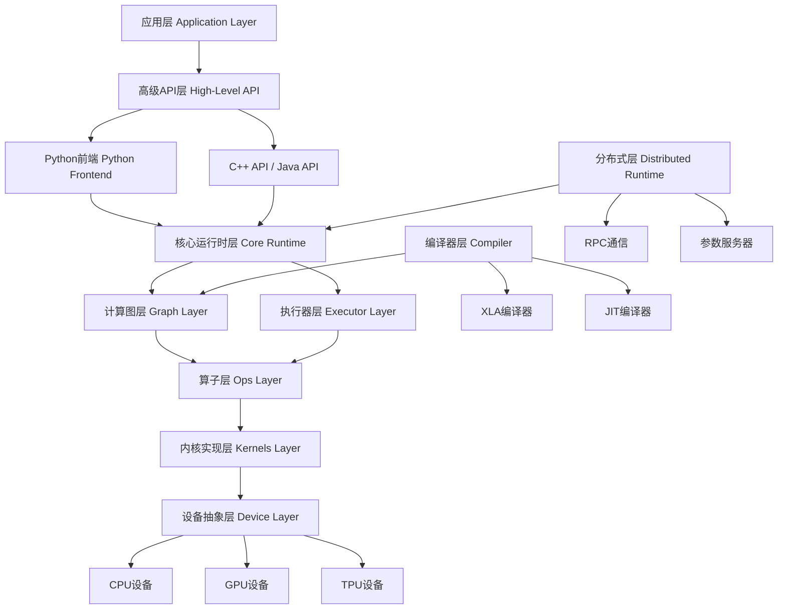
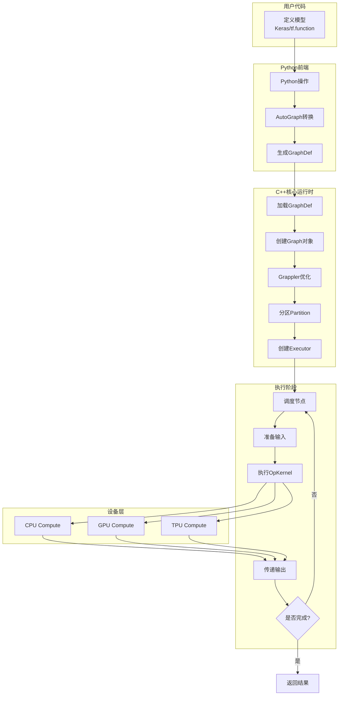
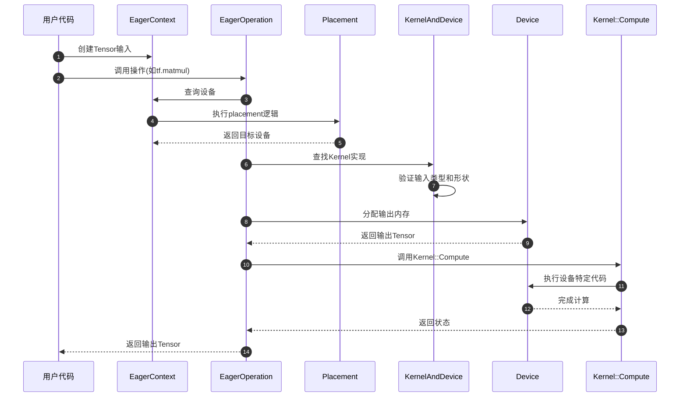
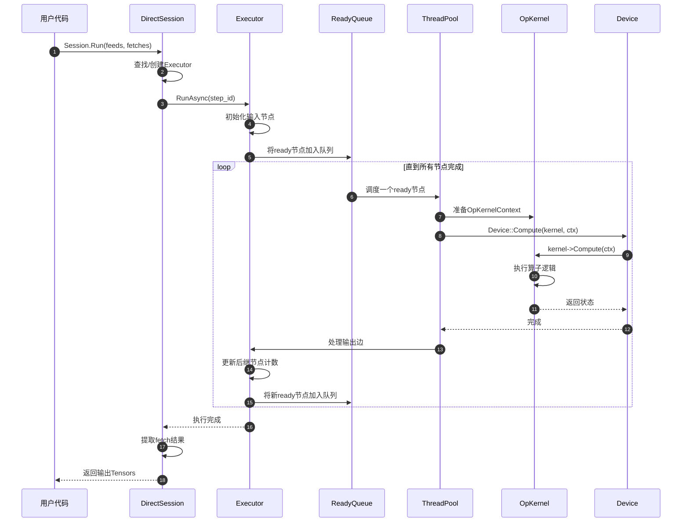
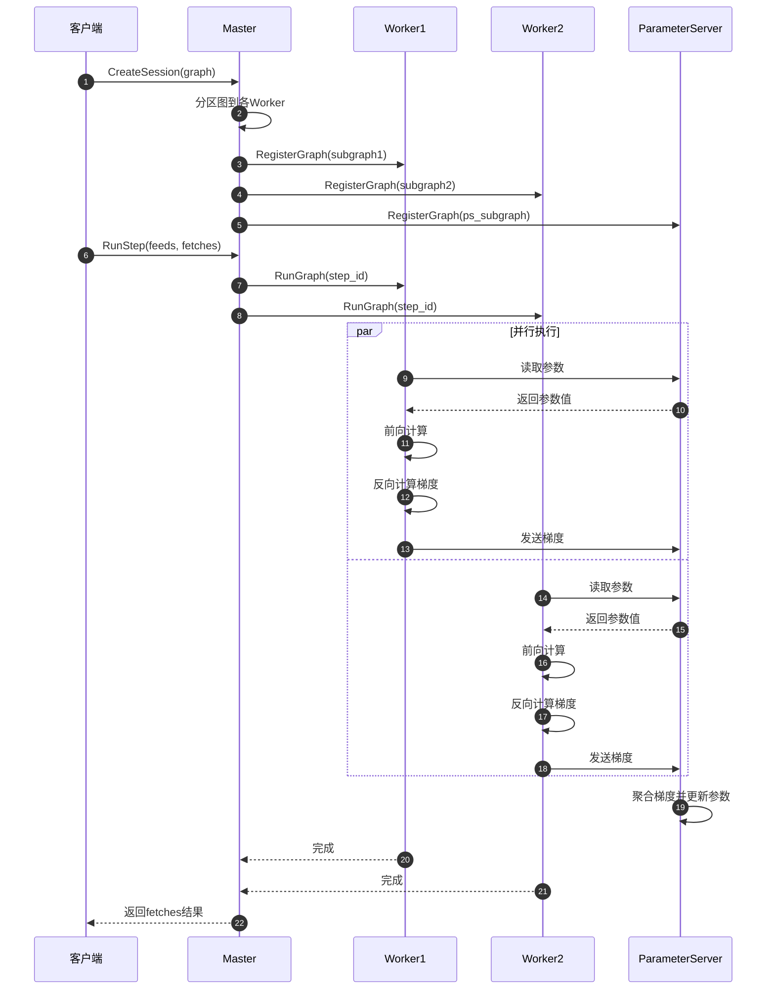

# TensorFlow 源码剖析 - 总览

## 摘要

### 目标

TensorFlow是一个端到端的开源机器学习平台，提供灵活、可扩展的生态系统用于构建和部署机器学习应用。核心目标包括：

- **计算图抽象**：将机器学习计算表示为有向无环图（DAG），节点代表操作，边代表数据流
- **设备无关执行**：支持CPU、GPU、TPU等多种计算设备的统一执行模型
- **自动微分**：提供自动计算梯度的能力支持深度学习训练
- **分布式计算**：支持跨多设备、多机器的分布式训练和推理
- **多语言接口**：提供Python、C++、Java等多种编程语言接口

### 边界

- **适用场景**：深度学习、传统机器学习、数值计算、数据处理管道
- **设备支持**：CPU（x86、ARM）、NVIDIA GPU、Google TPU、移动设备
- **编程范式**：支持声明式（Graph模式）和命令式（Eager模式）执行

### 非目标

- 不是通用分布式计算框架（如Spark）
- 不是专门的图像处理库（虽然支持图像操作）
- 不提供数据存储解决方案（需外部数据源）

### 运行环境

- **操作系统**：Linux、macOS、Windows、Android、iOS
- **语言运行时**：Python 3.7+、C++14/17
- **依赖库**：Protocol Buffers、Eigen、CUDA（GPU支持）、cuDNN（GPU加速）

### 部署形态

- **服务端训练**：单机单卡、单机多卡、多机分布式
- **服务端推理**：TensorFlow Serving、云端部署
- **移动端推理**：TensorFlow Lite（Android/iOS）
- **浏览器推理**：TensorFlow.js
- **嵌入式设备**：TensorFlow Lite Micro

## 整体架构

### 架构分层

TensorFlow采用分层架构设计，从上至下分为以下层次：



### 架构说明

#### 1. 应用层与高级API层

应用层为用户提供高层抽象，主要包括：

- **Keras**：高级神经网络API，提供Sequential、Functional、Subclassing三种建模方式
- **Estimator**：高级训练和评估框架（TF1.x遗留，逐步废弃）
- **tf.data**：高效数据输入管道
- **tf.distribute**：分布式训练策略

#### 2. Python前端层

Python前端是TensorFlow最主要的用户接口：

- **Eager Execution**：命令式执行模式，操作立即执行并返回结果
- **AutoGraph**：将Python代码自动转换为TensorFlow图
- **tf.function装饰器**：将Python函数转换为图执行以提升性能
- **GradientTape**：自动微分API

#### 3. 核心运行时层（Core Runtime）

核心运行时负责图的构建、优化和执行：

- **Graph构建**：将操作组织成计算图
- **Graph优化**：常量折叠、算子融合、内存优化等
- **Session管理**：管理图的执行上下文（TF1.x风格）
- **Executor**：实际执行图中的操作
- **Rendezvous**：用于节点间数据交换的同步机制

#### 4. 计算图层（Graph Layer）

表示和管理计算图：

- **Node**：图中的节点，代表一个操作
- **Edge**：图中的边，代表数据或控制依赖
- **Graph**：完整的计算图结构
- **GraphDef**：图的Protocol Buffer表示
- **FunctionDef**：函数的图表示

#### 5. 算子层（Ops Layer）

定义所有操作的接口：

- **OpDef**：操作的元数据定义（输入输出、属性）
- **OpRegistry**：全局操作注册表
- **OpKernel接口**：操作的执行接口
- **形状推断**：计算操作输出的形状

#### 6. 内核实现层（Kernels Layer）

各操作在不同设备上的具体实现：

- **数学操作**：MatMul、Add、Conv2D等
- **神经网络操作**：Relu、Softmax、BatchNorm等
- **数据操作**：Reshape、Concat、Slice等
- **设备特定优化**：CUDA kernel、Eigen实现、MKL-DNN集成

#### 7. 设备抽象层（Device Layer）

提供统一的设备接口：

- **Device接口**：抽象计算设备
- **ThreadPoolDevice**：CPU设备实现
- **GPUDevice**：GPU设备实现
- **Allocator**：设备内存分配器
- **DeviceContext**：设备执行上下文

#### 8. 编译器层（Compiler）

负责图的编译优化：

- **XLA（Accelerated Linear Algebra）**：面向线性代数的领域特定编译器
- **JIT编译**：运行时将子图编译为优化代码
- **Grappler**：图优化框架
- **AutoClustering**：自动识别可优化的子图

#### 9. 分布式层（Distributed Runtime）

支持跨设备和机器的分布式执行：

- **Master Session**：协调分布式执行
- **Worker Service**：在各机器上执行子图
- **RPC机制**：gRPC通信
- **AllReduce**：集合通信原语
- **分布式策略**：MirroredStrategy、MultiWorkerMirroredStrategy等

### 边界与约束

#### 并发模型

- **图级并发**：支持同一图的多个并发执行
- **节点级并发**：无依赖的节点可并行执行
- **算子级并发**：单个算子内部可使用线程池并行
- **数据并行**：跨多设备复制模型并行训练

#### 异常处理

- **构建时错误**：类型不匹配、形状不兼容在图构建时抛出
- **运行时错误**：设备内存不足、数值溢出在执行时通过Status传播
- **分布式错误**：节点失败、网络超时通过错误回调机制处理

#### 性能特性

- **内存管理**：引用计数、内存池、内存规划器减少碎片
- **执行优化**：算子融合、常量折叠、死代码消除
- **自动混合精度**：自动使用FP16加速训练
- **数据管道并行**：预取、并行解码、缓存

#### 版本兼容性

- **前向兼容**：新版本运行时可执行旧版本生成的GraphDef
- **后向兼容**：通过GraphDef版本号和算子版本管理
- **SavedModel格式**：跨版本的模型序列化格式

## 全局架构图

### 端到端执行流程



### 流程说明

#### 图构建阶段

1. **模型定义**：用户使用Keras或tf.function定义计算
2. **操作追踪**：Python前端记录所有操作调用
3. **图转换**：AutoGraph将Python控制流转换为图操作
4. **序列化**：生成GraphDef Protocol Buffer

#### 图优化阶段

5. **加载GraphDef**：C++运行时解析Protocol Buffer
6. **构建Graph**：创建内部Graph数据结构
7. **Grappler优化**：
   - 常量折叠：编译期计算常量表达式
   - 算子融合：合并相邻操作减少开销
   - 布局优化：选择最优数据布局格式
   - 内存优化：重用缓冲区减少内存占用
8. **图分区**：按设备划分子图

#### 执行准备阶段

9. **创建Executor**：为每个子图创建执行器
10. **内核注册**：查找并绑定每个操作对应的Kernel实现

#### 运行时执行阶段

11. **调度节点**：按拓扑序选择可执行节点
12. **准备输入**：收集节点的所有输入Tensor
13. **执行OpKernel**：
    - 分配输出内存
    - 调用设备特定实现（CPU/GPU/TPU）
    - 处理异步操作
14. **传递输出**：将输出Tensor发送给依赖节点
15. **循环执行**：重复直到所有节点完成

### 关键设计决策

#### 计算图抽象

**决策**：采用静态图表示计算，先定义后执行

**优势**：
- 全局优化：可对整图进行优化（算子融合、内存规划）
- 跨语言：图的中间表示与前端语言无关
- 部署友好：图可序列化后独立部署

**权衡**：
- 调试困难：图模式下Python调试器无法单步执行
- 动态性受限：条件分支和循环需要特殊操作
- 解决方案：引入Eager模式和AutoGraph平衡开发效率

#### 异步执行模型

**决策**：Executor采用异步数据流执行

**优势**：
- 高并发：无依赖节点自动并行执行
- 设备异步：CPU和GPU可流水线执行
- 通信隐藏：计算与数据传输重叠

**权衡**：
- 调试复杂：错误可能在远离根因的位置暴露
- 确定性弱：执行顺序可能因调度而变化

#### 设备抽象

**决策**：统一的Device接口封装不同硬件

**优势**：
- 可扩展：新硬件只需实现Device接口
- 透明性：用户代码无需关心设备细节
- 自动放置：框架可自动选择操作放置位置

**权衡**：
- 性能开销：抽象层引入额外函数调用
- 优化受限：通用接口难以暴露硬件特性

#### 内存管理

**决策**：引用计数 + BFC（Best-Fit with Coalescing）分配器

**优势**：
- 自动回收：Tensor在无引用时自动释放
- 减少碎片：BFC分配器合并空闲块
- 内存复用：输出可原位（in-place）修改输入

**权衡**：
- 内存峰值：保守的生命周期可能延迟释放
- 碎片问题：长时间运行仍可能产生碎片

## 全局时序图

### Eager模式执行



### Graph模式执行



### 分布式训练执行



## 模块交互矩阵

| 调用方 | 被调方 | 调用方式 | 错误语义 | 一致性要求 |
|--------|--------|----------|----------|------------|
| Python Frontend | Core Runtime | FFI/Pybind11 | 异常转Status | 同步调用 |
| Core Runtime | Graph Layer | 直接函数调用 | Status返回 | 强一致 |
| Executor | OpKernel | 虚函数调用 | Status设置到Context | 事务性 |
| OpKernel | Device | 虚函数调用 | Status返回 | 设备同步 |
| Master | Worker | gRPC | RPC错误 | 最终一致 |
| Worker | ParameterServer | gRPC/RDMA | RPC错误/重试 | 最终一致 |
| Graph Optimizer | Graph Layer | 直接函数调用 | Status返回 | 强一致 |
| XLA Compiler | Kernels Layer | 编译时绑定 | 编译错误 | 静态保证 |
| tf.data | Core Runtime | C++ API | Status返回 | 流式一致 |
| Eager Execution | Kernels Layer | 直接调用 | 立即抛出异常 | 立即一致 |

### 交互说明

#### Python Frontend → Core Runtime

- **调用方式**：通过Pybind11封装的C++ API
- **数据传递**：Python对象转换为C++ Tensor
- **错误处理**：C++ Status转换为Python异常
- **性能考虑**：GIL释放避免阻塞其他Python线程

#### Executor → OpKernel

- **调用方式**：通过OpKernel虚函数表
- **上下文传递**：OpKernelContext携带输入输出和元数据
- **同步模型**：同步Kernel直接返回，异步Kernel通过回调
- **错误传播**：通过Context的SetStatus设置错误

#### Master → Worker（分布式）

- **通信协议**：gRPC（默认）或自定义RPC
- **消息格式**：Protocol Buffers
- **容错机制**：超时重试、Worker心跳检测
- **一致性**：参数更新采用最终一致性

## 关键设计与权衡

### 一致性与事务

#### Graph级一致性

- **保证**：单个Graph内部操作的执行顺序由依赖边严格定义
- **实现**：拓扑排序 + 引用计数确保数据依赖
- **限制**：跨Graph的操作无强一致性保证

#### 分布式一致性

- **同步训练**：所有Worker完成一步后才开始下一步，强一致但吞吐低
- **异步训练**：Worker独立更新参数，高吞吐但收敛性弱
- **混合策略**：Bounded Staleness限制参数新旧程度

### 锁与并发

#### 细粒度锁

- **Graph锁**：Graph修改时加写锁，执行时加读锁
- **Node锁**：节点级锁保护引用计数和状态
- **Device锁**：保护设备资源（如GPU stream）

#### 无锁设计

- **Executor调度**：使用原子操作管理节点ready计数
- **内存分配**：线程局部缓存减少锁竞争
- **环形缓冲**：tf.data使用无锁队列传递数据

### 性能关键路径

#### 热路径优化

1. **OpKernel查找**：缓存Kernel指针避免重复查找
2. **内存分配**：预分配输出避免运行时分配
3. **数据拷贝**：零拷贝传递Tensor（共享底层缓冲）
4. **设备同步**：批量提交Kernel减少同步次数

#### 内存优化

- **内存规划**：静态分析图确定内存复用方案
- **梯度检查点**：重计算代替存储减少内存峰值
- **动态内存增长**：GPU内存按需增长避免OOM

### 可观测性

#### 日志与追踪

- **VLOG分级日志**：不同级别记录详细执行信息
- **Timeline追踪**：记录每个操作的执行时间和设备
- **TensorBoard集成**：可视化训练过程和计算图

#### 性能分析

- **Profiler API**：采样CPU和GPU执行时间
- **XProf工具**：分析分布式训练的通信瓶颈
- **Op统计**：记录每个操作的调用次数和耗时

### 配置与调优

#### 关键配置项

```python
# 示例配置
config = tf.ConfigProto()
config.allow_soft_placement = True  # 设备自动选择
config.log_device_placement = False  # 不记录设备分配
config.gpu_options.allow_growth = True  # GPU内存动态增长
config.intra_op_parallelism_threads = 0  # 算子内并行度（0=自动）
config.inter_op_parallelism_threads = 0  # 算子间并行度（0=自动）
```

#### 性能调优策略

- **混合精度训练**：使用FP16加速计算，FP32保持数值稳定
- **XLA编译**：对计算密集子图启用XLA获得额外加速
- **数据管道优化**：并行数据读取和预处理
- **分布式策略选择**：根据模型和集群特点选择合适策略

## 总结

TensorFlow是一个复杂但设计精良的系统，通过分层架构、设备抽象、异步执行等设计实现了高性能、可扩展的机器学习平台。核心设计理念包括：

1. **声明式与命令式混合**：Graph模式用于生产部署，Eager模式用于开发调试
2. **设备无关抽象**：统一的编程模型支持异构硬件
3. **编译优化**：通过Grappler和XLA在图级和算子级优化性能
4. **分布式优先**：内置分布式支持，无缝扩展到多机训练

理解这些设计决策和权衡，有助于高效使用TensorFlow并进行深度定制。

