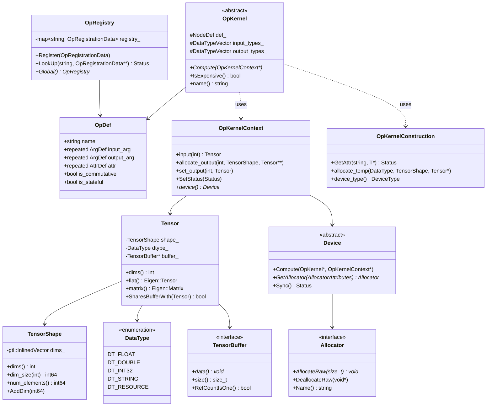
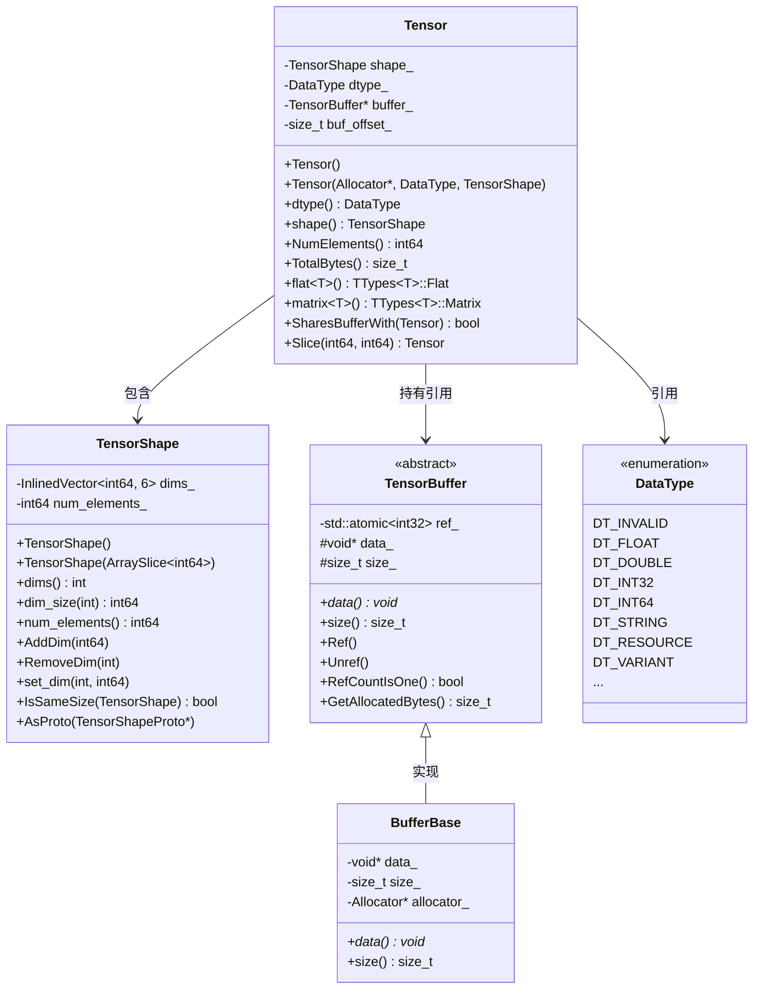
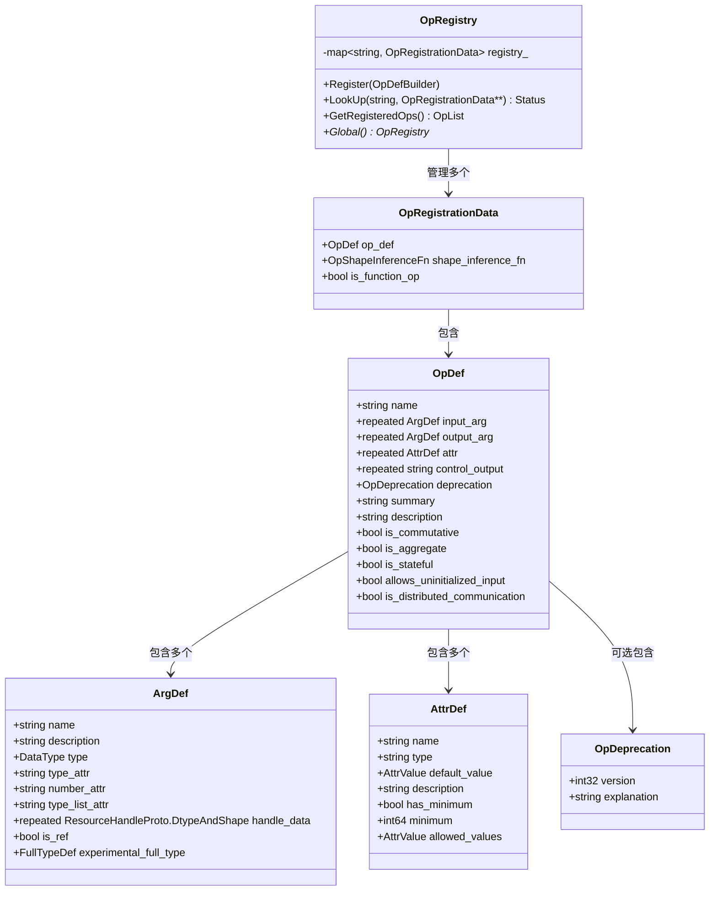
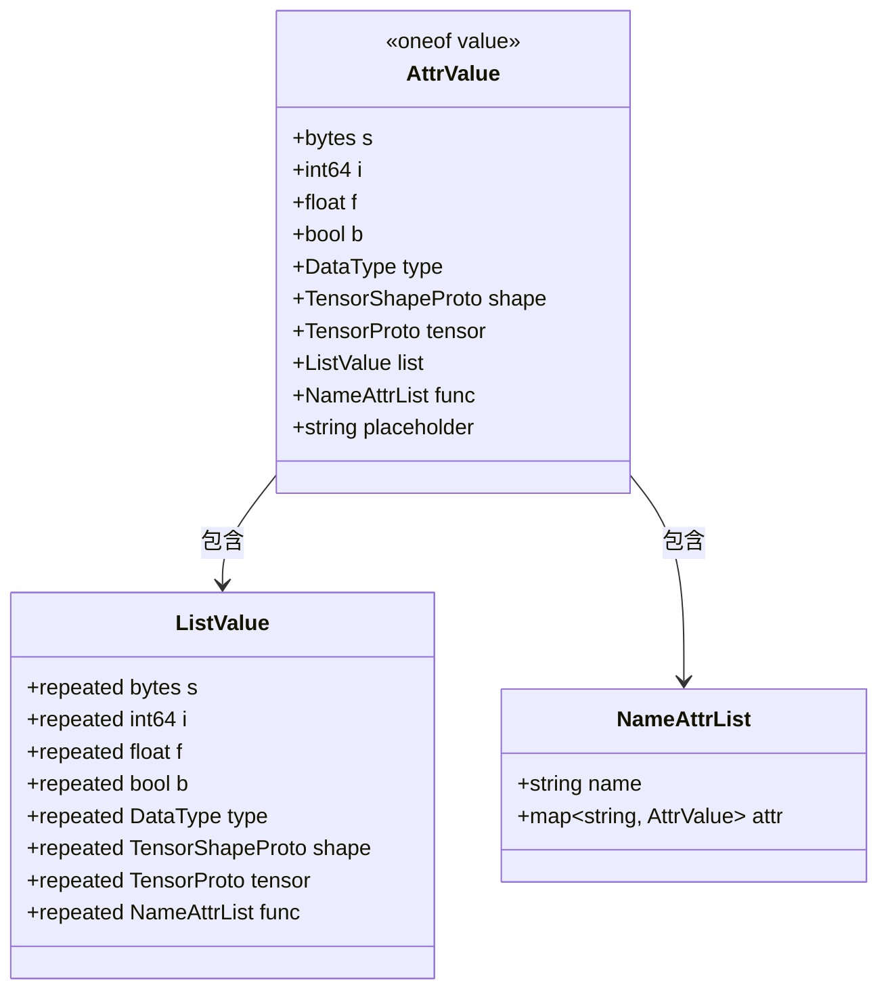
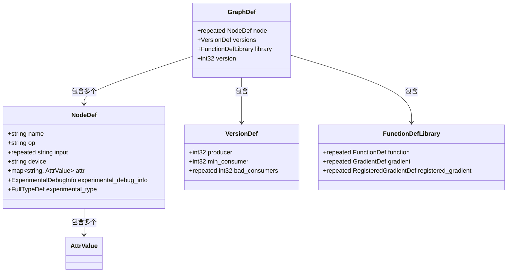
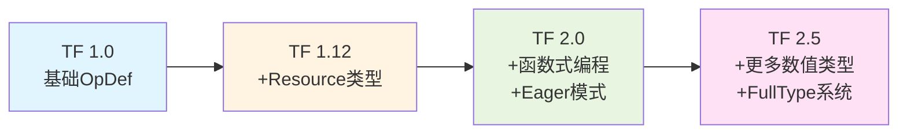
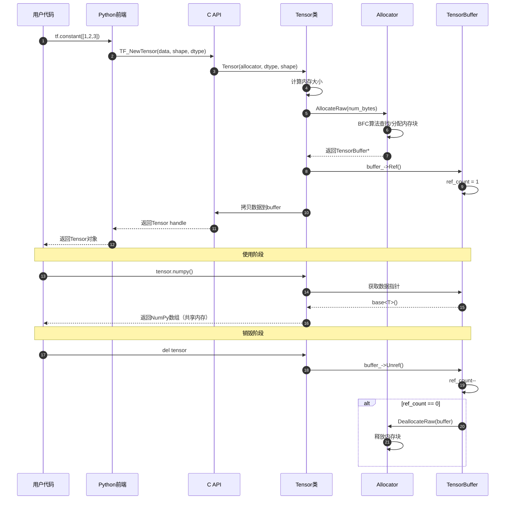
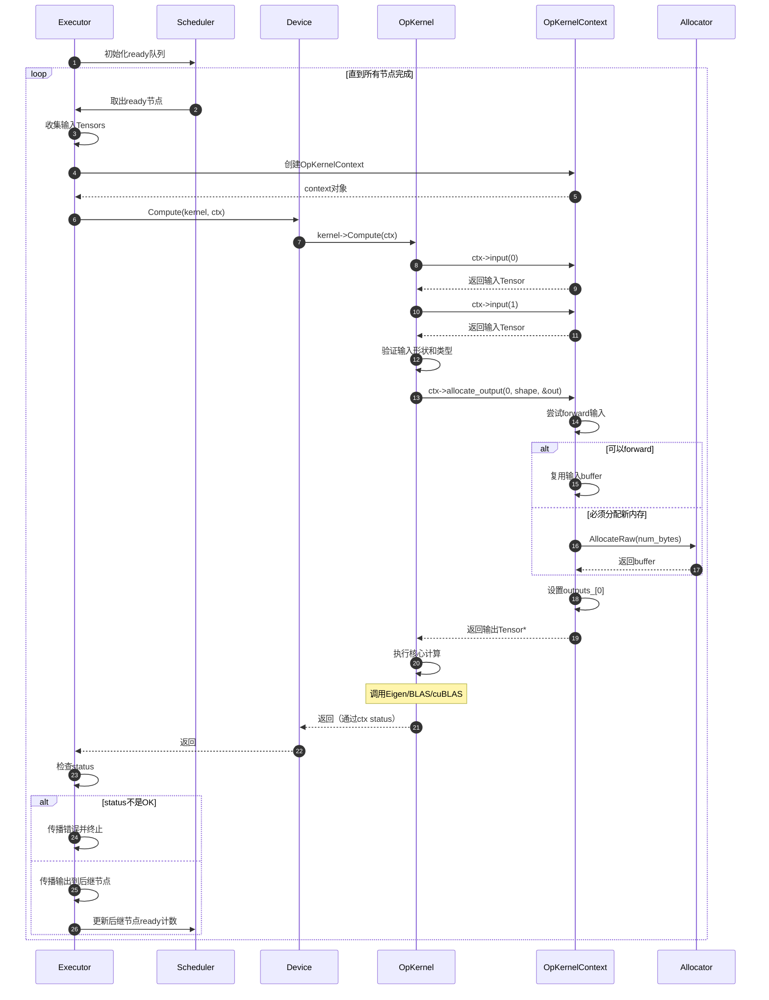
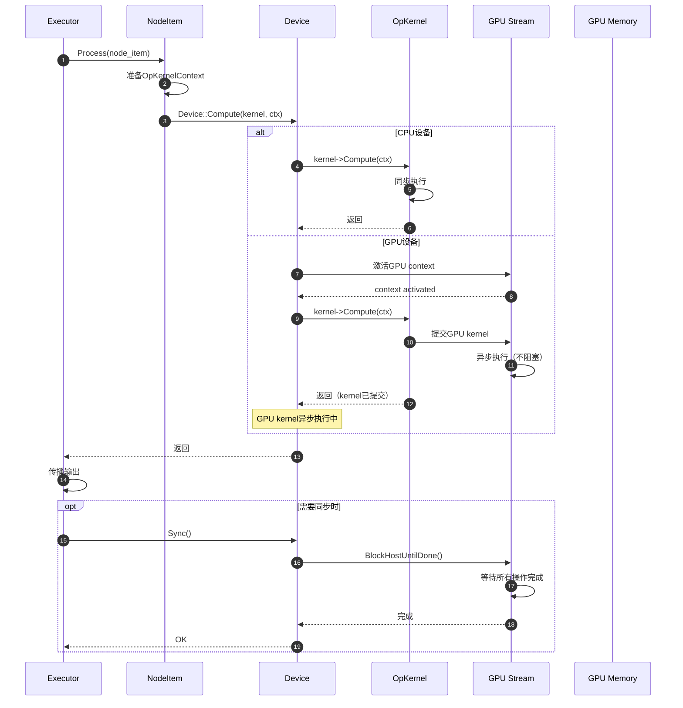

# TensorFlow 源码剖析 - Core Framework 模块完整文档

---
title: "TensorFlow 源码剖析 - Core Framework 模块"
date: 2025-10-05
draft: false
tags: ["TensorFlow", "源码剖析", "Core Framework", "深度学习框架"]
categories: ["深度学习", "源码分析"]
---

## 模块职责

Core Framework模块是TensorFlow的核心基础层，负责定义和管理整个框架的基本抽象和数据结构。主要职责包括：

### 核心职责

1. **类型系统**：定义所有支持的数据类型（DataType）和类型转换规则
2. **张量抽象**：提供Tensor数据结构，封装多维数组及其元数据
3. **算子定义**：定义Operation的接口规范（OpDef）和属性系统
4. **算子执行**：提供OpKernel执行接口和上下文环境
5. **设备抽象**：定义Device接口，隔离不同硬件实现细节
6. **内存管理**：提供Allocator接口和各种内存分配策略
7. **注册机制**：提供全局注册表（OpRegistry、KernelRegistry）

### 输入与输出

**输入**：
- OpDef定义（从ops模块）
- Kernel实现（从kernels模块）
- 设备配置信息
- 用户数据和参数

**输出**：
- Tensor对象（给executor执行）
- OpKernel实例（给executor调用）
- 类型和形状信息（用于优化和验证）
- 错误状态（Status对象）

### 上下游依赖

**上游模块（调用者）**：
- Graph层：使用OpDef构建图节点
- Executor层：使用OpKernel执行计算
- Python Frontend：通过Pybind11使用Tensor和Op
- Compiler层：使用类型信息进行编译优化

**下游模块（被调用）**：
- Platform层：使用平台抽象（Env、Thread等）
- Protobuf层：使用proto定义进行序列化
- Eigen库：使用张量运算库

### 生命周期

1. **启动时**：注册所有OpDef和Kernel到全局注册表
2. **图构建**：创建Node时查找OpDef验证参数
3. **图初始化**：为每个Node创建对应的OpKernel实例
4. **执行时**：Executor调用OpKernel::Compute执行计算
5. **销毁时**：引用计数管理Tensor生命周期，OpKernel随Session销毁

## 架构图

### 核心类关系



### 架构说明

#### 核心数据结构层次

**Tensor体系**：
- **Tensor**：高层张量对象，用户直接操作的数据容器
- **TensorBuffer**：底层内存缓冲区，支持引用计数和共享
- **TensorShape**：形状描述，使用InlinedVector优化小维度情况
- **DataType**：类型枚举，定义支持的数据类型

**OpDef体系**：
- **OpDef**：操作的元数据定义，描述输入输出和属性
- **ArgDef**：参数定义，描述单个输入/输出的类型和形状约束
- **AttrDef**：属性定义，描述操作的配置参数

**OpKernel体系**：
- **OpKernel**：操作的执行实现，定义Compute纯虚函数
- **OpKernelContext**：执行上下文，提供输入访问和输出分配
- **OpKernelConstruction**：构造上下文，提供属性访问和临时内存

**注册体系**：
- **OpRegistry**：全局Op注册表，按名称索引OpDef
- **KernelRegistry**：全局Kernel注册表，按(op, device, constraints)索引

#### 边界条件

**并发安全**：
- Tensor对象：浅拷贝线程安全（共享底层缓冲），深拷贝需手动同步
- OpKernel::Compute：必须线程安全，可能被多线程并发调用
- OpRegistry：启动后只读，线程安全
- Allocator：实现必须线程安全

**内存模型**：
- Tensor采用引用计数，最后一个引用释放时自动回收内存
- TensorBuffer支持共享，避免不必要的拷贝
- 输出Tensor可原位（in-place）修改输入，需OpKernel显式支持

**类型约束**：
- 输入输出类型必须匹配OpDef定义
- 类型可通过属性参数化（如T=float32）
- 类型列表支持可变长度输入/输出

#### 异常处理

**构造时错误**：
- OpKernel构造失败：通过OpKernelConstruction的Status返回
- 属性缺失或类型错误：在GetAttr时返回InvalidArgument
- 不支持的设备：在Kernel查找时返回NotFound

**执行时错误**：
- 形状不匹配：通过OpKernelContext::SetStatus设置
- 内存不足：Allocator返回nullptr，Kernel检查并报错
- 数值错误（如除零）：在Kernel实现中检测并设置错误状态

#### 性能特性

**零拷贝优化**：
- Tensor赋值和传递不拷贝数据，只增加引用计数
- Slice和Reshape等操作返回视图，共享底层缓冲
- 输出可别名输入（forwarding）避免拷贝

**内存池优化**：
- BFCAllocator使用Best-Fit with Coalescing算法减少碎片
- 内存块复用，避免频繁系统调用
- 对齐分配满足SIMD和GPU要求

**类型特化**：
- Eigen库对不同类型提供优化实现
- BLAS库加速矩阵运算
- GPU Kernel针对不同类型生成专门代码

#### 版本兼容

**OpDef版本管理**：
- 添加新属性必须有默认值保持后向兼容
- 删除属性通过deprecation字段标记废弃
- 修改语义需定义新Op保持兼容

**序列化格式**：
- TensorProto支持多种编码方式（tensor_content、typed arrays）
- 压缩和稀疏编码用于大Tensor
- 保持Protocol Buffers前向兼容性

## 核心数据结构详解

### 一、Tensor及相关结构

#### 1.1 类图



#### 1.2 字段语义详解

**Tensor字段**

| 字段名 | 类型 | 可选 | 语义 | 约束 |
|--------|------|------|------|------|
| shape_ | TensorShape | 必须 | Tensor的形状（维度） | dims() <= 255 |
| dtype_ | DataType | 必须 | 元素数据类型 | 枚举值，见DataType定义 |
| buffer_ | TensorBuffer* | 可选 | 底层数据缓冲区 | nullptr表示空tensor |
| buf_offset_ | size_t | 可选 | 数据在buffer中的偏移 | 用于Slice等操作 |

**语义说明**：
- **shape_**：描述Tensor的形状，如 [2, 3, 4] 表示三维tensor，维度大小分别为2、3、4
- **dtype_**：决定每个元素的类型和大小，如DT_FLOAT表示32位浮点数
- **buffer_**：实际存储数据的内存块，采用引用计数管理生命周期
- **buf_offset_**：支持零拷贝slice，多个Tensor可共享一个buffer的不同部分

**TensorShape字段**

| 字段名 | 类型 | 语义 | 约束 |
|--------|------|------|------|
| dims_ | InlinedVector<int64, 6> | 各维度的大小 | 每个值 >= 0 |
| num_elements_ | int64 | 缓存的元素总数 | dims_所有值的乘积 |

**设计考虑**：
- 使用InlinedVector优化常见情况（<=6维），避免堆分配
- 缓存num_elements_避免重复计算
- 支持未知维度（值为-1，用于形状推断）

**TensorBuffer字段**

| 字段名 | 类型 | 语义 | 约束 |
|--------|------|------|------|
| ref_ | atomic<int32> | 引用计数 | >= 0，0时回收 |
| data_ | void* | 数据指针 | 根据allocator对齐 |
| size_ | size_t | 缓冲区大小（字节） | >= 0 |

**引用计数规则**：
- 创建时 ref_ = 1
- 拷贝构造或赋值时 Ref()，ref_++
- 析构时 Unref()，ref_--，若ref_ == 0则释放内存

#### 1.3 Proto消息定义（序列化格式）

```protobuf
// tensor.proto
message TensorProto {
  DataType dtype = 1;
  TensorShapeProto tensor_shape = 2;
  
  // 版本号（用于兼容性）
  int32 version_number = 3;
  
  // 原始字节数组（推荐用于大tensor）
  bytes tensor_content = 4;
  
  // 类型特定数组（方便小tensor）
  repeated int32 half_val = 13 [packed = true];   // DT_HALF, DT_BFLOAT16
  repeated float float_val = 5 [packed = true];   // DT_FLOAT
  repeated double double_val = 6 [packed = true]; // DT_DOUBLE
  repeated int32 int_val = 7 [packed = true];     // DT_INT32
  repeated bytes string_val = 8;                  // DT_STRING
  // ...更多类型
}

message TensorShapeProto {
  message Dim {
    int64 size = 1;     // 维度大小，-1表示未知
    string name = 2;    // 可选的维度名称
  }
  repeated Dim dim = 2;
  bool unknown_rank = 3;  // true表示秩未知
}
```

**字段映射规则**：
1. dtype和tensor_shape必须设置
2. tensor_content优先用于大tensor（减少序列化开销）
3. 类型特定数组用于小tensor或手动构造
4. 只能设置一种数据表示（tensor_content或typed arrays之一）

#### 1.4 版本演进

| 版本 | 变更 | 兼容性 |
|------|------|--------|
| 1.0 | 初始定义 | - |
| 1.12 | 添加DT_RESOURCE类型 | 前向兼容 |
| 2.0 | 添加float8类型（DT_FLOAT8_*） | 前向兼容 |
| 2.5 | 添加int4/uint4类型 | 前向兼容 |

**兼容性保证**：
- 新增DataType时分配新的枚举值，旧代码可忽略未知类型
- Proto字段只新增不删除，通过version_number标识格式版本

### 二、OpDef及相关结构

#### 2.1 类图



#### 2.2 字段语义详解

**OpDef字段**

| 字段 | 类型 | 必填 | 语义 | 约束 |
|------|------|------|------|------|
| name | string | 是 | Op名称，全局唯一 | 正则：[A-Z][a-zA-Z0-9>_]* |
| input_arg | repeated ArgDef | 否 | 输入参数列表 | 按顺序匹配输入 |
| output_arg | repeated ArgDef | 否 | 输出参数列表 | 按顺序匹配输出 |
| attr | repeated AttrDef | 否 | 属性定义列表 | 用于参数化类型和行为 |
| control_output | repeated string | 否 | 命名的控制输出 | 用于函数Op |
| summary | string | 否 | 单行描述 | 用于文档生成 |
| description | string | 否 | 详细描述 | 可包含示例代码 |
| is_commutative | bool | 否 | 是否可交换 | op(a,b)==op(b,a) |
| is_aggregate | bool | 否 | 是否为聚合操作 | 如Add可聚合 |
| is_stateful | bool | 否 | 是否有状态 | 有状态op不能被CSE消除 |
| allows_uninitialized_input | bool | 否 | 是否允许未初始化输入 | 如Assign首次赋值 |
| is_distributed_communication | bool | 否 | 是否涉及分布式通信 | 用于错误处理策略 |

**ArgDef字段**

| 字段 | 类型 | 必填 | 语义 | 约束 |
|------|------|------|------|------|
| name | string | 是 | 参数名称 | 正则：[a-z][a-z0-9_]* |
| description | string | 否 | 参数描述 | 用于文档 |
| type | DataType | 条件 | 具体类型 | 与type_attr/type_list_attr互斥 |
| type_attr | string | 条件 | 类型属性名 | 引用attr中的type类型属性 |
| number_attr | string | 条件 | 数量属性名 | 用于可变长度输入 |
| type_list_attr | string | 条件 | 类型列表属性名 | 用于异构类型列表 |
| is_ref | bool | 否 | 是否为引用类型 | TF1.x变量系统使用 |

**类型指定规则**：
- **单个tensor固定类型**：只设置type字段
- **单个tensor参数化类型**：设置type_attr指向类型属性（如T）
- **同类型序列**：设置type_attr + number_attr
- **异构类型序列**：设置type_list_attr

**示例**：
```cpp
// MatMul定义
OpDef {
  name: "MatMul"
  input_arg {
    name: "a"
    type_attr: "T"  // 类型由属性T确定
  }
  input_arg {
    name: "b"
    type_attr: "T"  // 同样的类型T
  }
  output_arg {
    name: "product"
    type_attr: "T"
  }
  attr {
    name: "T"
    type: "type"
    allowed_values { list { type: [DT_FLOAT, DT_DOUBLE] } }
  }
  attr {
    name: "transpose_a"
    type: "bool"
    default_value { b: false }
  }
}
```

**AttrDef字段**

| 字段 | 类型 | 必填 | 语义 | 约束 |
|------|------|------|------|------|
| name | string | 是 | 属性名称 | 正则：[a-z][a-z0-9_]+ |
| type | string | 是 | 属性类型 | string/int/float/bool/type/shape/tensor/list(...)/func |
| default_value | AttrValue | 否 | 默认值 | 未设置则为必填属性 |
| description | string | 否 | 属性描述 | 用于文档 |
| has_minimum | bool | 否 | 是否有最小值约束 | 配合minimum使用 |
| minimum | int64 | 条件 | 最小值 | 对int或list长度约束 |
| allowed_values | AttrValue | 否 | 允许的值集合 | 限制属性取值范围 |

#### 2.3 OpRegistry数据结构

```cpp
class OpRegistry {
 public:
  // 注册Op定义
  void Register(const OpRegistrationDataFactory& op_data_factory);
  
  // 查找Op定义
  const OpRegistrationData* LookUp(const string& op_type_name) const;
  Status LookUp(const string& op_type_name, 
                const OpRegistrationData** op_reg_data) const;
  
  // 获取所有注册的Op
  void Export(bool include_internal, OpList* ops) const;
  OpList GetRegisteredOps();
  
  // 全局单例
  static OpRegistry* Global();
  
 private:
  // 核心数据结构：op名称 -> 注册数据
  std::unordered_map<string, std::unique_ptr<OpRegistrationData>> registry_;
  
  mutable mutex mu_;  // 保护registry_
  std::function<Status(const Status&, const OpDef&)> watcher_;
};

struct OpRegistrationData {
  OpDef op_def;  // Op元数据定义
  OpShapeInferenceFn shape_inference_fn;  // 形状推断函数
  OpTypeConstructor type_ctor;  // 类型构造函数（实验性）
  bool is_function_op;  // 是否为函数Op
};
```

**使用模式**：
```cpp
// 注册时（启动时自动调用）
REGISTER_OP("MyOp")
    .Input("input: T")
    .Output("output: T")
    .Attr("T: {float, int32}")
    .SetShapeFn(shape_inference::UnchangedShape);

// 查找时（图构建时）
const OpRegistrationData* op_reg_data;
Status s = OpRegistry::Global()->LookUp("MyOp", &op_reg_data);
if (s.ok()) {
  const OpDef& op_def = op_reg_data->op_def;
  // 验证NodeDef与OpDef兼容
}
```

#### 2.4 Proto消息定义

```protobuf
// op_def.proto
message OpDef {
  string name = 1;
  
  message ArgDef {
    string name = 1;
    string description = 2;
    DataType type = 3;
    string type_attr = 4;
    string number_attr = 5;
    string type_list_attr = 6;
    repeated ResourceHandleProto.DtypeAndShape handle_data = 7;
    bool is_ref = 16;
    FullTypeDef experimental_full_type = 17;
  }
  repeated ArgDef input_arg = 2;
  repeated ArgDef output_arg = 3;
  repeated string control_output = 20;
  
  message AttrDef {
    string name = 1;
    string type = 2;
    AttrValue default_value = 3;
    string description = 4;
    bool has_minimum = 5;
    int64 minimum = 6;
    AttrValue allowed_values = 7;
  }
  repeated AttrDef attr = 4;
  
  OpDeprecation deprecation = 8;
  string summary = 5;
  string description = 6;
  bool is_commutative = 18;
  bool is_aggregate = 16;
  bool is_stateful = 17;
  bool allows_uninitialized_input = 19;
  bool is_distributed_communication = 21;
}

message OpDeprecation {
  int32 version = 1;  // 废弃的GraphDef版本
  string explanation = 2;  // 废弃原因和替代方案
}

message OpList {
  repeated OpDef op = 1;
}
```

#### 2.5 版本演进

| 版本 | 变更 | 影响 | 兼容性策略 |
|------|------|------|------------|
| 1.0 | 初始定义 | - | - |
| 1.1 | 添加control_output | 支持函数Op的控制流 | 后向兼容（旧图不使用） |
| 1.12 | 添加is_distributed_communication | 分布式错误处理 | 后向兼容 |
| 2.0 | 添加experimental_full_type | 更精确的类型系统 | 前向兼容（渐进式采用） |

**兼容性规则**：
1. **添加新属性**：必须有default_value，旧版本图自动使用默认值
2. **删除属性**：先标记deprecation，至少保留一个大版本
3. **修改语义**：定义新Op，保留旧Op并标记废弃
4. **重命名**：注册alias，保持两个名称可用

### 三、AttrValue结构

#### 3.1 类图



#### 3.2 字段语义

AttrValue是一个联合类型（oneof），只能设置一个字段：

| 字段 | 对应attr type | C++类型 | 用途 |
|------|---------------|---------|------|
| s | "string" | bytes | 字符串值 |
| i | "int" | int64 | 整数值 |
| f | "float" | float | 浮点数值 |
| b | "bool" | bool | 布尔值 |
| type | "type" | DataType | 类型枚举 |
| shape | "shape" | TensorShapeProto | 形状描述 |
| tensor | "tensor" | TensorProto | Tensor常量 |
| list | "list(...)" | ListValue | 列表值 |
| func | "func" | NameAttrList | 函数引用 |
| placeholder | - | string | 函数参数占位符 |

**使用示例**：
```cpp
// 设置int属性
AttrValue attr_value;
attr_value.set_i(128);

// 设置type属性
attr_value.set_type(DT_FLOAT);

// 设置list(int)属性
auto* list = attr_value.mutable_list();
list->add_i(1);
list->add_i(2);
list->add_i(3);

// 设置shape属性
auto* shape = attr_value.mutable_shape();
shape->add_dim()->set_size(224);
shape->add_dim()->set_size(224);
shape->add_dim()->set_size(3);
```

### 四、NodeDef与GraphDef结构

#### 4.1 类图



#### 4.2 字段语义

**NodeDef字段**

| 字段 | 类型 | 必填 | 语义 | 约束 |
|------|------|------|------|------|
| name | string | 是 | 节点唯一名称 | 图内唯一，正则：[A-Za-z0-9.][A-Za-z0-9_./>-]* |
| op | string | 是 | 操作类型名 | 必须在OpRegistry中注册 |
| input | repeated string | 否 | 输入边列表 | 格式：`<node>:<port>` 或 `^<node>`（控制依赖） |
| device | string | 否 | 放置的设备 | 如 "/job:worker/replica:0/task:0/device:GPU:0" |
| attr | map<string, AttrValue> | 否 | 属性值映射 | 键必须在OpDef.attr中定义 |

**input字段格式**：
- 数据边：`input_node_name:output_index`
- 数据边简写（index=0）：`input_node_name`
- 控制边：`^input_node_name`

**设备字符串格式**：
```
/job:<job>/replica:<replica>/task:<task>/device:<device_type>:<device_index>
```

**GraphDef字段**

| 字段 | 类型 | 必填 | 语义 | 约束 |
|------|------|------|------|------|
| node | repeated NodeDef | 否 | 计算图节点列表 | 拓扑序非强制要求 |
| versions | VersionDef | 否 | 版本信息 | 用于兼容性检查 |
| library | FunctionDefLibrary | 否 | 函数库 | 包含自定义函数定义 |
| version | int32 | 废弃 | 旧版本号 | 已由versions替代 |

#### 4.3 版本管理

```protobuf
message VersionDef {
  int32 producer = 1;  // 生成此GraphDef的TensorFlow版本
  int32 min_consumer = 2;  // 可执行此GraphDef的最低TensorFlow版本
  repeated int32 bad_consumers = 3;  // 禁止的版本列表
}
```

**版本号定义**：
- TensorFlow版本号定义在core/public/version.h
- 当前版本：`TF_GRAPH_DEF_VERSION`
- 最低兼容版本：`TF_GRAPH_DEF_VERSION_MIN_CONSUMER`

**兼容性检查**：
```cpp
bool IsCompatible(const VersionDef& versions) {
  // 检查producer版本不超过当前版本
  if (versions.producer() > TF_GRAPH_DEF_VERSION) {
    return false;  // 图由更新版本生成
  }
  
  // 检查当前版本满足min_consumer要求
  if (TF_GRAPH_DEF_VERSION < versions.min_consumer()) {
    return false;  // 图要求更新的运行时
  }
  
  // 检查不在bad_consumers列表中
  for (int32 bad : versions.bad_consumers()) {
    if (TF_GRAPH_DEF_VERSION == bad) {
      return false;  // 已知不兼容版本
    }
  }
  
  return true;
}
```

### 五、数据结构演进总结

#### 5.1 设计原则

1. **前向兼容**：新版本可执行旧版本图
2. **渐进演进**：通过添加可选字段扩展功能
3. **明确废弃**：通过deprecation字段标记废弃特性
4. **版本控制**：通过VersionDef管理兼容性

#### 5.2 关键演进路径



#### 5.3 持久化格式

所有关键数据结构都有对应的Protocol Buffer定义，支持：

- **二进制序列化**：高效存储和传输
- **文本格式**：便于调试和版本控制
- **JSON格式**：便于Web集成

**序列化示例**：
```python
# 保存GraphDef
graph_def = sess.graph.as_graph_def()
with open('model.pb', 'wb') as f:
    f.write(graph_def.SerializeToString())

# 加载GraphDef
with open('model.pb', 'rb') as f:
    graph_def = tf.compat.v1.GraphDef()
    graph_def.ParseFromString(f.read())
```

## 核心API详解

### 一、Tensor API

#### 1.1 基本信息

- **名称**：`Tensor`
- **协议/方法**：C++ Class
- **用途**：作为TensorFlow中所有数据的统一容器

#### 1.2 数据结构定义

**Tensor类定义**

```cpp
class Tensor {
 public:
  // 构造函数
  Tensor();  // 空tensor
  Tensor(DataType type, const TensorShape& shape);  // 指定类型和形状
  Tensor(Allocator* a, DataType type, const TensorShape& shape);  // 指定分配器
  
  // 标量tensor构造（主机内存）
  explicit Tensor(float value);
  explicit Tensor(int32_t value);
  explicit Tensor(int64_t value);
  
  // 拷贝和移动
  Tensor(const Tensor& other);
  Tensor(Tensor&& other);
  Tensor& operator=(const Tensor& other);
  Tensor& operator=(Tensor&& other);
  
  ~Tensor();
  
  // 元数据访问
  DataType dtype() const;
  const TensorShape& shape() const;
  int dims() const;
  int64_t dim_size(int d) const;
  int64_t NumElements() const;
  size_t TotalBytes() const;
  size_t AllocatedBytes() const;
  
  // 数据访问（模板方法）
  template <typename T>
  typename TTypes<T>::Flat flat();  // 1D视图
  
  template <typename T>
  typename TTypes<T>::Matrix matrix();  // 2D视图
  
  template <typename T>
  typename TTypes<T>::Tensor tensor();  // ND视图
  
  template <typename T>
  T* flat_data();  // 原始指针
  
  // 只读数据访问
  template <typename T>
  typename TTypes<T>::ConstFlat flat() const;
  
  // 缓冲区操作
  bool SharesBufferWith(const Tensor& b) const;
  bool IsInitialized() const;
  bool IsAligned() const;
  
  // Slice操作
  Tensor Slice(int64_t start, int64_t limit) const;
  
 private:
  TensorShape shape_;  // 形状
  TensorBuffer* buffer_;  // 数据缓冲区
};
```

#### 1.3 核心方法详解

**构造函数实现**

```cpp
// Tensor::Tensor(Allocator* a, DataType type, const TensorShape& shape)
// 功能：创建指定类型和形状的Tensor，从指定分配器分配内存
// 
Tensor::Tensor(Allocator* a, DataType type, const TensorShape& shape)
    : shape_(shape), buffer_(nullptr) {
  
  set_dtype(type);  // 设置数据类型
  
  // 计算所需字节数
  size_t num_bytes = shape.num_elements() * DataTypeSize(type);
  
  if (num_bytes > 0 || a->ShouldAllocateEmptyTensors()) {
    // 分配TensorBuffer
    buffer_ = a->Allocate<TensorBuffer>(num_bytes, type);
    if (buffer_ != nullptr) {
      buffer_->Ref();  // 初始引用计数为1
    }
  }
}
```

| 参数 | 类型 | 必填 | 说明 |
|------|------|------|------|
| a | Allocator* | 是 | 内存分配器（CPU/GPU） |
| type | DataType | 是 | 数据类型枚举值 |
| shape | const TensorShape& | 是 | Tensor形状 |

**数据访问方法**

```cpp
// flat<T>(): 获取1D Eigen::Tensor视图
// 返回类型：Eigen::TensorMap<Eigen::Tensor<T, 1, ...>>
// 
template <typename T>
typename TTypes<T>::Flat Tensor::flat() {
  // 检查类型匹配
  CHECK_EQ(DataTypeToEnum<T>::value, dtype());
  // 检查已初始化
  CHECK(IsInitialized());
  
  // 返回Eigen::TensorMap，映射到底层内存
  return typename TTypes<T>::Flat(
      buffer_->base<T>(),  // 数据指针
      shape_.num_elements());  // 元素总数
}

// matrix<T>(): 获取2D Eigen::Tensor视图
// 前置条件：dims() == 2
//
template <typename T>
typename TTypes<T>::Matrix Tensor::matrix() {
  CHECK_EQ(DataTypeToEnum<T>::value, dtype());
  CHECK_EQ(dims(), 2);  // 必须是2维
  CHECK(IsInitialized());
  
  return typename TTypes<T>::Matrix(
      buffer_->base<T>(),
      shape_.dim_size(0),  // 行数
      shape_.dim_size(1));  // 列数
}
```

| 方法 | 模板参数 | 返回类型 | 功能 | 前置条件 |
|------|----------|----------|------|----------|
| flat<T>() | T: 元素类型 | TTypes<T>::Flat | 获取1D视图 | dtype() == T |
| matrix<T>() | T: 元素类型 | TTypes<T>::Matrix | 获取2D视图 | dims() == 2 && dtype() == T |
| tensor<T>() | T: 元素类型 | TTypes<T>::Tensor | 获取ND视图 | dtype() == T |
| flat_data<T>() | T: 元素类型 | T* | 获取原始指针 | dtype() == T |

**Slice操作**

```cpp
// Slice(start, limit): 创建子tensor视图
// 功能：返回沿第0维的切片 [start, limit)
// 特点：零拷贝，共享底层缓冲区
//
Tensor Tensor::Slice(int64_t start, int64_t limit) const {
  // 验证参数
  CHECK_GE(dims(), 1);  // 至少1维
  CHECK_GE(start, 0);
  CHECK_LE(limit, dim_size(0));
  CHECK_LE(start, limit);
  
  // 创建新Tensor，共享buffer
  Tensor result(dtype());
  
  // 计算切片形状（第0维缩小）
  TensorShape slice_shape = shape_;
  slice_shape.set_dim(0, limit - start);
  result.shape_ = slice_shape;
  
  // 共享缓冲区，偏移起始地址
  if (buffer_) {
    result.buffer_ = buffer_;
    result.buffer_->Ref();  // 增加引用计数
    
    // 计算字节偏移
    size_t bytes_per_slice = DataTypeSize(dtype());
    for (int d = 1; d < dims(); ++d) {
      bytes_per_slice *= dim_size(d);
    }
    result.buf_offset_ = buf_offset_ + start * bytes_per_slice;
  }
  
  return result;  // 返回切片视图
}
```

| 参数 | 类型 | 约束 | 说明 |
|------|------|------|------|
| start | int64_t | [0, dim_size(0)) | 起始索引（含） |
| limit | int64_t | (start, dim_size(0)] | 结束索引（不含） |

#### 1.4 调用链路分析

**Tensor创建调用链**

```
用户代码
  └─> tf.constant(value, dtype, shape)  [Python]
      └─> pywrap_tensorflow.TF_NewTensor()  [C API]
          └─> Tensor::Tensor(a, dtype, shape)  [C++]
              ├─> Allocator::AllocateRaw()  [分配内存]
              ├─> TensorBuffer::Ref()  [初始化引用计数]
              └─> 返回Tensor对象
```

**Tensor访问调用链**

```
OpKernel::Compute(ctx)
  └─> const Tensor& input = ctx->input(0)
      └─> OpKernelContext::input(index)
          └─> 返回inputs_[index].tensor
              [已在Executor准备阶段设置]
```

**Tensor输出调用链**

```
OpKernel::Compute(ctx)
  └─> Tensor* output = nullptr;
      ctx->allocate_output(0, shape, &output)
      └─> OpKernelContext::allocate_output(index, shape, output)
          ├─> 尝试Forward输入（复用缓冲区）
          │   └─> OpKernel::forward_from_array()
          ├─> 如果无法forward，分配新内存
          │   └─> Allocator::AllocateRaw()
          └─> 设置outputs_[index] = new_tensor
```

#### 1.5 时序图



### 二、OpKernel API

#### 2.1 基本信息

- **名称**：`OpKernel`
- **协议/方法**：C++ Abstract Class
- **用途**：定义操作的执行接口，由具体Kernel实现

#### 2.2 类定义

**OpKernel基类**

```cpp
class OpKernel {
 public:
  // 构造函数（在图初始化时调用）
  explicit OpKernel(OpKernelConstruction* context);
  OpKernel(OpKernelConstruction* context, bool is_deferred);
  
  virtual ~OpKernel();
  
  // 核心执行方法（纯虚函数，必须实现）
  virtual void Compute(OpKernelContext* context) = 0;
  
  // 异步Kernel支持
  virtual AsyncOpKernel* AsAsync() { return nullptr; }
  
  // 性能标记
  virtual bool IsExpensive() { return expensive_; }
  
  // 元数据访问
  const NodeDef& def() const { return props_->node_def; }
  const string& name() const { return props_->node_def.name(); }
  const string& type_string() const { return props_->node_def.op(); }
  const string& requested_device() const { 
    return props_->node_def.device(); 
  }
  
  // 输入输出信息
  int num_inputs() const { return props_->input_types.size(); }
  DataType input_type(int i) const { return props_->input_types[i]; }
  int num_outputs() const { return props_->output_types.size(); }
  DataType output_type(int o) const { return props_->output_types[o]; }
  
 protected:
  bool expensive_;  // 是否为昂贵操作
  
 private:
  std::shared_ptr<const NodeProperties> props_;  // 节点属性
  MemoryTypeVector input_memory_types_;  // 输入内存类型（主机/设备）
  MemoryTypeVector output_memory_types_;  // 输出内存类型
};
```

**OpKernelConstruction上下文**

```cpp
class OpKernelConstruction {
 public:
  // 属性访问
  template <typename T>
  Status GetAttr(StringPiece attr_name, T* value) const;
  
  // 设备信息
  DeviceType device_type() const { return device_type_; }
  
  // 临时内存分配
  Status allocate_temp(DataType type, const TensorShape& shape,
                       Tensor* out_temp);
  
  // 设置错误状态
  void SetStatus(const Status& status);
  Status status() const { return *status_; }
  
 private:
  const DeviceType device_type_;
  Allocator* allocator_;
  const FunctionLibraryRuntime* flib_;
  const std::shared_ptr<const NodeProperties> props_;
  Status* status_;
};
```

**OpKernelContext上下文**

```cpp
class OpKernelContext {
 public:
  // 输入访问
  int num_inputs() const { return params_->inputs->size(); }
  const Tensor& input(int index) const { return (*params_->inputs)[index]; }
  
  // 输出分配
  Status allocate_output(int index, const TensorShape& shape,
                         Tensor** output);
  Status set_output(int index, const Tensor& tensor);
  Tensor* mutable_output(int index);
  
  // 临时内存
  Status allocate_temp(DataType type, const TensorShape& shape,
                       Tensor* out_temp, AllocatorAttributes attr = {});
  
  // 设备访问
  Device* device() const { return params_->device; }
  Allocator* get_allocator(AllocatorAttributes attr);
  
  // 状态管理
  void SetStatus(const Status& status);
  Status status() const { return status_; }
  
  // 函数库（用于调用其他操作）
  FunctionLibraryRuntime* function_library() const { 
    return params_->function_library; 
  }
  
  // 取消管理
  CancellationManager* cancellation_manager() const {
    return params_->cancellation_manager;
  }
  
 private:
  const Params* params_;  // 外部传入的参数
  gtl::InlinedVector<TensorValue, 4> outputs_;  // 输出tensors
  Status status_;  // 执行状态
};
```

#### 2.3 OpKernel实现示例

**简单Kernel：Add操作**

```cpp
// 注册OpDef
REGISTER_OP("Add")
    .Input("x: T")
    .Input("y: T")
    .Output("z: T")
    .Attr("T: {float, int32, int64}")
    .SetIsCommutative()
    .SetShapeFn(shape_inference::UnchangedShape);

// CPU Kernel实现
template <typename T>
class AddOp : public OpKernel {
 public:
  explicit AddOp(OpKernelConstruction* ctx) : OpKernel(ctx) {}
  
  void Compute(OpKernelContext* ctx) override {
    // 1. 获取输入
    const Tensor& x_tensor = ctx->input(0);
    const Tensor& y_tensor = ctx->input(1);
    
    // 2. 验证形状
    OP_REQUIRES(ctx, x_tensor.shape() == y_tensor.shape(),
                errors::InvalidArgument(
                    "x and y must have the same shape. ",
                    "x shape: ", x_tensor.shape().DebugString(),
                    " y shape: ", y_tensor.shape().DebugString()));
    
    // 3. 分配输出
    Tensor* z_tensor = nullptr;
    OP_REQUIRES_OK(ctx, 
        ctx->allocate_output(0, x_tensor.shape(), &z_tensor));
    
    // 4. 执行计算
    auto x = x_tensor.flat<T>();
    auto y = y_tensor.flat<T>();
    auto z = z_tensor->flat<T>();
    
    // 使用Eigen并行执行
    const Eigen::ThreadPoolDevice& d = 
        ctx->eigen_device<Eigen::ThreadPoolDevice>();
    z.device(d) = x + y;
    
    // 输出已设置，无需return
  }
};

// 注册Kernel（针对不同类型）
REGISTER_KERNEL_BUILDER(
    Name("Add").Device(DEVICE_CPU).TypeConstraint<float>("T"),
    AddOp<float>);
REGISTER_KERNEL_BUILDER(
    Name("Add").Device(DEVICE_CPU).TypeConstraint<int32>("T"),
    AddOp<int32>);
```

**复杂Kernel：MatMul操作**

```cpp
class MatMulOp : public OpKernel {
 public:
  explicit MatMulOp(OpKernelConstruction* ctx) : OpKernel(ctx) {
    // 构造时读取并缓存属性
    OP_REQUIRES_OK(ctx, ctx->GetAttr("transpose_a", &transpose_a_));
    OP_REQUIRES_OK(ctx, ctx->GetAttr("transpose_b", &transpose_b_));
  }
  
  void Compute(OpKernelContext* ctx) override {
    // 1. 获取输入矩阵
    const Tensor& a = ctx->input(0);
    const Tensor& b = ctx->input(1);
    
    // 2. 验证输入是矩阵
    OP_REQUIRES(ctx, a.dims() == 2,
                errors::InvalidArgument("a must be a matrix"));
    OP_REQUIRES(ctx, b.dims() == 2,
                errors::InvalidArgument("b must be a matrix"));
    
    // 3. 获取维度
    const int m = transpose_a_ ? a.dim_size(1) : a.dim_size(0);
    const int k_a = transpose_a_ ? a.dim_size(0) : a.dim_size(1);
    const int k_b = transpose_b_ ? b.dim_size(1) : b.dim_size(0);
    const int n = transpose_b_ ? b.dim_size(0) : b.dim_size(1);
    
    // 4. 验证内积维度匹配
    OP_REQUIRES(ctx, k_a == k_b,
                errors::InvalidArgument(
                    "Matrix size-incompatible: In[0]: ", a.shape().DebugString(),
                    ", In[1]: ", b.shape().DebugString()));
    
    // 5. 分配输出
    Tensor* output = nullptr;
    OP_REQUIRES_OK(ctx, ctx->allocate_output(0, TensorShape({m, n}), &output));
    
    // 6. 处理空矩阵
    if (output->NumElements() == 0) {
      return;
    }
    
    // 7. 调用BLAS库执行矩阵乘法
    auto a_matrix = a.matrix<float>();
    auto b_matrix = b.matrix<float>();
    auto output_matrix = output->matrix<float>();
    
    LaunchMatMul<float>::launch(
        ctx, a_matrix, b_matrix, transpose_a_, transpose_b_, output_matrix);
  }
  
 private:
  bool transpose_a_;
  bool transpose_b_;
};

// 注册GPU Kernel（如果支持GPU）
#if GOOGLE_CUDA
REGISTER_KERNEL_BUILDER(
    Name("MatMul").Device(DEVICE_GPU).TypeConstraint<float>("T"),
    MatMulOp<GPUDevice, float>);
#endif
```

#### 2.4 调用链路分析

**Kernel创建调用链**

```
DirectSession::Run()
  └─> GetOrCreateExecutors()
      └─> CreateExecutors()
          └─> Graph::ToGraphDef()
          └─> Executor::NewLocalExecutor(graph)
              └─> ExecutorImpl::Initialize()
                  └─> 遍历每个节点
                      └─> CreateNonCachedKernel(node)
                          ├─> FindKernelDef(device, node, &kernel_def)
                          │   └─> GlobalKernelRegistry()->FindKernel()
                          ├─> CreateOpKernel(device, kernel_def, &kernel)
                          │   ├─> OpKernelConstruction ctx(...)
                          │   └─> kernel_def->factory->Create(&ctx)
                          │       [调用注册的工厂函数]
                          │       └─> new MatMulOp(ctx)
                          │           └─> MatMulOp::MatMulOp(ctx)
                          │               [读取并缓存属性]
                          └─> 缓存kernel到NodeItem
```

**Kernel执行调用链**

```
DirectSession::Run(feeds, fetches)
  └─> RunInternal(executors_and_keys)
      └─> Executor::RunAsync(args)
          └─> ExecutorState::RunAsync()
              ├─> 初始化ready队列
              └─> 循环处理ready节点
                  └─> Process(node_item)
                      ├─> 收集输入tensors
                      ├─> 创建OpKernelContext
                      │   └─> OpKernelContext ctx(&params)
                      ├─> Device::Compute(kernel, &ctx)
                      │   └─> kernel->Compute(&ctx)  [虚函数调用]
                      │       [具体Kernel实现]
                      │       └─> MatMulOp::Compute(&ctx)
                      │           ├─> ctx->input(0)  [获取输入]
                      │           ├─> ctx->allocate_output(0, shape, &out)
                      │           ├─> 执行矩阵乘法计算
                      │           └─> return [输出已设置]
                      ├─> 检查ctx->status()
                      └─> 将输出传播给后继节点
```

#### 2.5 时序图



### 三、Device API

#### 3.1 基本信息

- **名称**：`Device`
- **协议/方法**：C++ Abstract Class
- **用途**：抽象计算设备（CPU/GPU/TPU），提供统一执行接口

#### 3.2 类定义

```cpp
class Device {
 public:
  Device(Env* env, const DeviceAttributes& attributes);
  virtual ~Device();
  
  // 核心执行方法
  virtual void Compute(OpKernel* op_kernel, OpKernelContext* context) = 0;
  virtual void ComputeAsync(AsyncOpKernel* op_kernel, 
                           OpKernelContext* context,
                           AsyncOpKernel::DoneCallback done) = 0;
  
  // 内存管理
  virtual Allocator* GetAllocator(AllocatorAttributes attr) = 0;
  virtual Allocator* GetScopedAllocator(AllocatorAttributes attr, 
                                       int64_t step_id) = 0;
  
  // Tensor操作
  virtual Status MakeTensorFromProto(const TensorProto& tensor_proto,
                                    const AllocatorAttributes alloc_attrs,
                                    Tensor* tensor) = 0;
  
  virtual void CopyTensorInSameDevice(const Tensor* input_tensor,
                                     Tensor* output_tensor,
                                     const DeviceContext* device_context,
                                     StatusCallback done) = 0;
  
  // 同步
  virtual Status Sync() = 0;
  
  // 设备信息
  const string& name() const { return attributes_.name(); }
  const DeviceType& device_type() const { return device_type_; }
  int64_t memory_limit() const { return attributes_.memory_limit(); }
  const DeviceLocality& locality() const { return attributes_.locality(); }
  
 private:
  const DeviceAttributes attributes_;
  DeviceType device_type_;
  Env* env_;  // 平台环境
};
```

#### 3.3 CPU设备实现

```cpp
class ThreadPoolDevice : public LocalDevice {
 public:
  ThreadPoolDevice(const SessionOptions& options, const string& name,
                   Bytes memory_limit, const DeviceLocality& locality,
                   Allocator* allocator)
      : LocalDevice(options, name, memory_limit, locality),
        allocator_(allocator),
        scoped_allocator_mgr_(new ScopedAllocatorMgr(name)) {}
  
  void Compute(OpKernel* op_kernel, OpKernelContext* context) override {
    // CPU设备直接同步执行
    
    // （此处省略日志和监控）
    
    // 调用OpKernel的Compute方法
    op_kernel->Compute(context);
    
    // （此处省略性能统计）
  }
  
  void ComputeAsync(AsyncOpKernel* op_kernel, OpKernelContext* context,
                   AsyncOpKernel::DoneCallback done) override {
    // 异步Kernel通过回调通知完成
    op_kernel->ComputeAsync(context, done);
  }
  
  Allocator* GetAllocator(AllocatorAttributes attr) override {
    // CPU使用普通分配器
    return allocator_;
  }
  
  Status Sync() override {
    // CPU设备无需显式同步
    return Status::OK();
  }
  
  Status MakeTensorFromProto(const TensorProto& proto,
                            const AllocatorAttributes alloc_attrs,
                            Tensor* tensor) override {
    // 从Proto反序列化Tensor
    return tensor->FromProto(allocator_, proto);
  }
  
 private:
  Allocator* allocator_;  // CPU内存分配器
  std::unique_ptr<ScopedAllocatorMgr> scoped_allocator_mgr_;
};
```

#### 3.4 GPU设备实现（简化）

```cpp
class BaseGPUDevice : public LocalDevice {
 public:
  void Compute(OpKernel* op_kernel, OpKernelContext* context) override {
    // 获取GPU执行流
    GPUDeviceContext* gpu_device_context = 
        static_cast<GPUDeviceContext*>(context->op_device_context());
    se::Stream* stream = gpu_device_context->stream();
    
    // 激活GPU上下文
    std::unique_ptr<se::ActivateContext> activation = 
        stream->parent()->Activate();
    
    // （此处省略日志和profiling）
    
    // 执行Kernel（可能是异步的）
    op_kernel->Compute(context);
    
    // （此处省略错误检查）
  }
  
  Allocator* GetAllocator(AllocatorAttributes attr) override {
    if (attr.on_host()) {
      // 分配主机固定内存（pinned memory）
      return gpu_host_allocator_;
    } else {
      // 分配GPU显存
      return gpu_allocator_;
    }
  }
  
  Status Sync() override {
    // 等待GPU执行流完成
    se::Stream* stream = device_context_->stream();
    if (!stream->BlockHostUntilDone()) {
      return errors::Internal("GPU sync failed");
    }
    return Status::OK();
  }
  
 private:
  GPUDeviceContext* device_context_;
  Allocator* gpu_allocator_;  // GPU显存分配器
  Allocator* gpu_host_allocator_;  // 固定内存分配器
};
```

#### 3.5 调用链路与时序图



## 核心算法与流程

### Tensor创建与内存分配

```cpp
// Tensor构造流程（核心逻辑）
Tensor::Tensor(Allocator* a, DataType type, const TensorShape& shape) 
  : shape_(shape), dtype_(type) {
  
  // 1. 计算所需内存大小
  size_t num_bytes = shape.num_elements() * DataTypeSize(type);
  
  // 2. 处理零元素情况
  if (num_bytes == 0) {
    buffer_ = nullptr;  // 零元素tensor不分配内存
    return;
  }
  
  // 3. 分配TensorBuffer
  buffer_ = a->AllocateRaw(Allocator::kAllocatorAlignment, num_bytes);
  
  // 4. 检查分配失败
  if (buffer_ == nullptr) {
    // （此处省略错误处理）
  }
  
  // 5. 初始化引用计数
  buffer_->Ref();
}

// 复制构造（浅拷贝）
Tensor::Tensor(const Tensor& other) 
  : shape_(other.shape_), dtype_(other.dtype_), buffer_(other.buffer_) {
  
  if (buffer_) buffer_->Ref();  // 增加引用计数
}

// 析构函数
Tensor::~Tensor() {
  if (buffer_) {
    buffer_->Unref();  // 减少引用计数，可能触发内存释放
  }
}
```

**算法说明**：

**目的**：高效创建和管理多维数组，支持零拷贝共享

**输入**：
- Allocator：内存分配器（CPU/GPU）
- DataType：数据类型枚举
- TensorShape：形状描述符

**输出**：
- Tensor对象，内部持有TensorBuffer引用

**复杂度**：
- 时间：O(1)（仅分配内存，不初始化数据）
- 空间：O(N)，N为元素总数

**上界**：
- 单个Tensor大小受Allocator限制（通常GPU为显存大小）
- TensorShape维度数限制为255（实现优化考虑）

### OpKernel注册与查找

```cpp
// OpKernel注册（核心流程）
#define REGISTER_KERNEL_BUILDER(kernel_builder, kernel_class) \
  namespace {  \
    static ::tensorflow::kernel_factory::OpKernelRegistrar \
        registrar__##ctr(                                     \
            (kernel_builder).Build(),                         \
            #kernel_class,                                    \
            [](::tensorflow::OpKernelConstruction* context)   \
                -> ::tensorflow::OpKernel* {                  \
              return new kernel_class(context);               \
            });                                               \
  }

// 查找Kernel实现（核心逻辑）
Status FindKernelDef(
    const DeviceType& device_type,
    const NodeDef& node_def,
    const KernelDef** kernel_def) {
  
  // 1. 获取全局Kernel注册表
  const KernelRegistry* registry = GlobalKernelRegistry();
  
  // 2. 构造查找键（op_name + device_type + constraints）
  KernelCacheKey key;
  key.op_name = node_def.op();
  key.device_type = device_type;
  
  // 3. 提取属性约束
  for (const auto& attr : node_def.attr()) {
    if (IsTypeAttr(attr.first)) {
      key.type_constraints[attr.first] = attr.second.type();
    }
  }
  
  // 4. 在注册表中查找
  *kernel_def = registry->FindKernel(key);
  
  // 5. 返回查找结果
  if (*kernel_def == nullptr) {
    return errors::NotFound("No kernel found for op ", key.op_name);
  }
  
  return Status::OK();
}
```

**算法说明**：

**目的**：根据操作名、设备类型和属性约束找到对应的Kernel实现

**输入**：
- DeviceType：目标设备（CPU/GPU/TPU）
- NodeDef：图节点定义，包含op名称和属性
- 输出参数：KernelDef指针

**输出**：
- Status：成功或NotFound错误
- KernelDef：匹配的Kernel定义

**复杂度**：
- 时间：O(K)，K为该Op注册的Kernel数量（通常<10）
- 空间：O(1)（查询操作）

**匹配策略**：
1. 精确匹配：op名 + device + 所有类型约束
2. 优先级匹配：注册时可指定优先级，高优先级优先
3. 默认Kernel：无类型约束的Kernel作为fallback

### OpKernel执行流程

```cpp
// Executor中的Kernel执行（核心逻辑）
Status ExecutorImpl::Process(const NodeItem& item) {
  
  // 1. 准备OpKernelContext参数
  OpKernelContext::Params params;
  params.device = device_;
  params.op_kernel = item.kernel;
  params.inputs = PrepareInputs(item);  // 收集所有输入Tensor
  params.output_attr_array = item.output_attrs;
  
  // 2. 创建OpKernelContext
  OpKernelContext ctx(&params, item.num_outputs);
  
  // 3. 调用Kernel的Compute方法
  item.kernel->Compute(&ctx);
  
  // 4. 检查执行状态
  Status s = ctx.status();
  if (!s.ok()) {
    return s;  // 传播错误
  }
  
  // 5. 处理输出
  for (int i = 0; i < item.num_outputs; ++i) {
    Tensor* output = ctx.mutable_output(i);
    PropagateOutput(item, i, output);  // 传递给后继节点
  }
  
  return Status::OK();
}

// 典型OpKernel实现示例（MatMul）
class MatMulOp : public OpKernel {
 public:
  explicit MatMulOp(OpKernelConstruction* ctx) : OpKernel(ctx) {
    // 构造时读取属性
    OP_REQUIRES_OK(ctx, ctx->GetAttr("transpose_a", &transpose_a_));
    OP_REQUIRES_OK(ctx, ctx->GetAttr("transpose_b", &transpose_b_));
  }
  
  void Compute(OpKernelContext* ctx) override {
    // 1. 获取输入
    const Tensor& a = ctx->input(0);
    const Tensor& b = ctx->input(1);
    
    // 2. 验证形状
    OP_REQUIRES(ctx, a.dims() == 2 && b.dims() == 2,
                errors::InvalidArgument("Inputs must be matrices"));
    
    // 3. 计算输出形状
    int m = transpose_a_ ? a.dim_size(1) : a.dim_size(0);
    int n = transpose_b_ ? b.dim_size(0) : b.dim_size(1);
    TensorShape output_shape({m, n});
    
    // 4. 分配输出
    Tensor* output = nullptr;
    OP_REQUIRES_OK(ctx, ctx->allocate_output(0, output_shape, &output));
    
    // 5. 执行矩阵乘法
    auto a_matrix = a.matrix<float>();
    auto b_matrix = b.matrix<float>();
    auto output_matrix = output->matrix<float>();
    
    // 调用Eigen库或BLAS库
    output_matrix = a_matrix * b_matrix;
    
    // 6. 返回（输出已通过allocate_output设置）
  }
  
 private:
  bool transpose_a_;
  bool transpose_b_;
};
```

**算法说明**：

**目的**：在统一框架下执行各种操作，隔离公共逻辑和操作特定逻辑

**输入**：
- OpKernel实例
- 输入Tensor数组
- 设备和分配器

**输出**：
- 输出Tensor数组
- Status状态码

**复杂度**：
- 依赖具体Kernel实现
- 矩阵乘法：O(M×N×K)，M、N为输出维度，K为内积维度

**关键步骤**：
1. 输入验证：检查类型和形状
2. 输出分配：根据输入形状计算输出形状并分配内存
3. 核心计算：调用高性能库（Eigen、BLAS、cuBLAS）
4. 错误处理：使用OP_REQUIRES宏简化检查

### 类型推断与形状推断

```cpp
// OpDef的形状推断函数注册
REGISTER_OP("MatMul")
    .Input("a: T")
    .Input("b: T")
    .Output("product: T")
    .Attr("T: {float, double, int32}")
    .Attr("transpose_a: bool = false")
    .Attr("transpose_b: bool = false")
    .SetShapeFn([](shape_inference::InferenceContext* c) {
      // 1. 获取输入形状
      shape_inference::ShapeHandle a_shape;
      shape_inference::ShapeHandle b_shape;
      TF_RETURN_IF_ERROR(c->WithRank(c->input(0), 2, &a_shape));
      TF_RETURN_IF_ERROR(c->WithRank(c->input(1), 2, &b_shape));
      
      // 2. 读取属性
      bool transpose_a, transpose_b;
      TF_RETURN_IF_ERROR(c->GetAttr("transpose_a", &transpose_a));
      TF_RETURN_IF_ERROR(c->GetAttr("transpose_b", &transpose_b));
      
      // 3. 计算输出维度
      auto m_dim = c->Dim(a_shape, transpose_a ? 1 : 0);
      auto k_dim_a = c->Dim(a_shape, transpose_a ? 0 : 1);
      auto k_dim_b = c->Dim(b_shape, transpose_b ? 1 : 0);
      auto n_dim = c->Dim(b_shape, transpose_b ? 0 : 1);
      
      // 4. 验证内积维度一致
      shape_inference::DimensionHandle merged_k;
      TF_RETURN_IF_ERROR(c->Merge(k_dim_a, k_dim_b, &merged_k));
      
      // 5. 设置输出形状
      c->set_output(0, c->Matrix(m_dim, n_dim));
      
      return Status::OK();
    });
```

**算法说明**：

**目的**：在图构建时推断操作输出的形状，用于验证和优化

**输入**：
- 输入Tensor的形状
- Op的属性参数
- InferenceContext上下文

**输出**：
- 输出Tensor的形状
- Status状态（成功或形状不兼容错误）

**复杂度**：
- 时间：O(R)，R为最大秩（维度数）
- 空间：O(R)

**推断规则**：
- **元素级操作**（Add、Relu）：输入输出形状相同
- **降维操作**（ReduceSum）：沿指定轴降维
- **广播操作**（BroadcastTo）：按广播规则扩展
- **矩阵操作**（MatMul）：按矩阵乘法规则计算

## 总结

Core Framework模块是TensorFlow的基石，提供了类型系统、张量抽象、算子框架等核心机制。关键设计特点：

1. **引用计数内存管理**：零拷贝共享，自动回收
2. **类型安全**：编译期和运行期双重类型检查
3. **设备无关**：OpKernel接口隔离设备差异
4. **注册驱动**：全局注册表实现Op和Kernel的解耦
5. **分层抽象**：运行时对象（Tensor）与序列化格式（TensorProto）分离
6. **可扩展性**：通过属性系统实现操作参数化
7. **版本管理**：通过VersionDef和OpDeprecation管理演进

理解这些核心抽象和API是深入TensorFlow源码的关键，它们共同构成了TensorFlow生态系统的核心协议。

