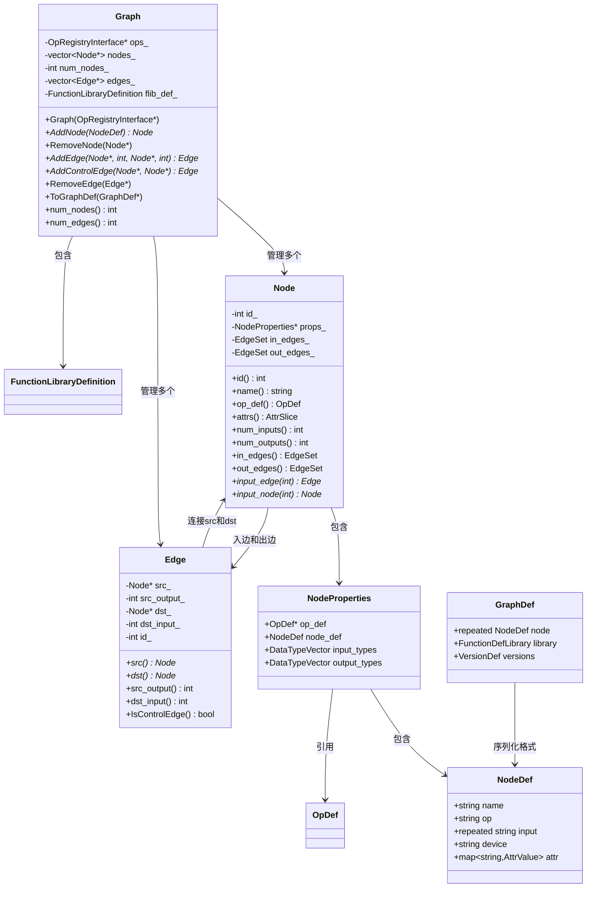
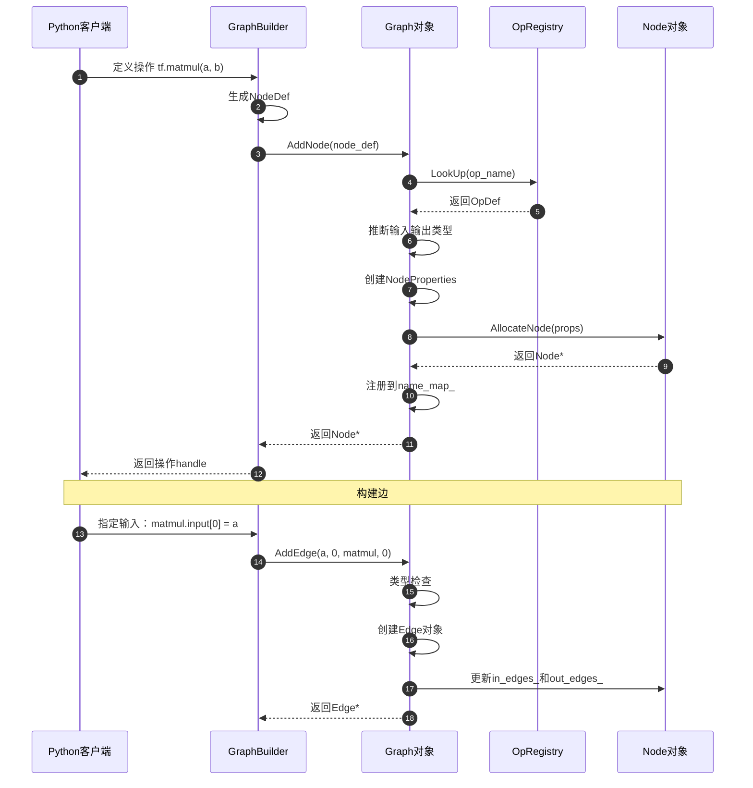
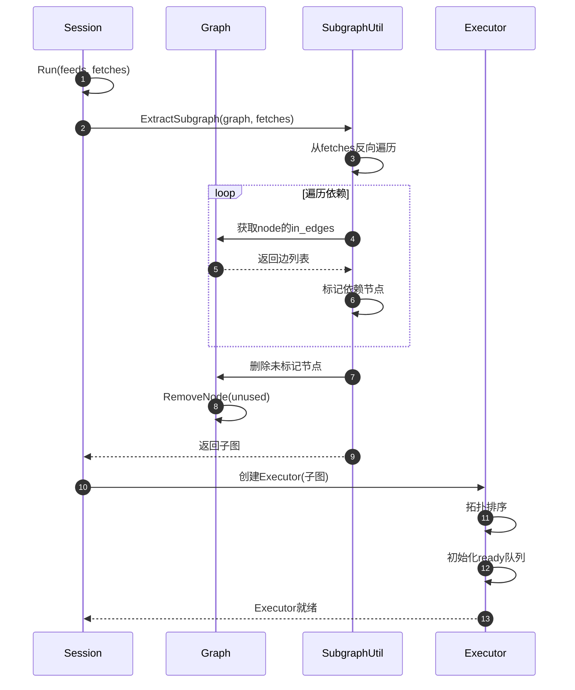

# TensorFlow 源码剖析 - Core Graph 模块概览

## 模块职责

Core Graph模块负责表示、构建和管理TensorFlow的计算图。计算图是TensorFlow的核心抽象，将机器学习计算表示为有向无环图（DAG）。

### 核心职责

1. **图结构管理**：维护节点（Node）和边（Edge）的拓扑关系
2. **节点生命周期**：创建、修改、删除图中的节点
3. **边管理**：建立节点间的数据依赖和控制依赖
4. **图验证**：检查图的合法性（类型匹配、形状兼容等）
5. **子图提取**：从完整图中提取执行所需的子图
6. **图优化准备**：为Grappler优化器提供图的可修改表示
7. **序列化支持**：与GraphDef Protocol Buffer相互转换

### 输入与输出

**输入**：
- NodeDef（来自Python前端或GraphDef）
- OpDef（来自OpRegistry）
- 边的连接信息

**输出**：
- Graph对象（内存中的图表示）
- GraphDef（序列化的图定义）
- 子图（用于执行或优化）

### 上下游依赖

**上游模块（调用者）**：
- Python前端：通过C API构建图
- Session：加载GraphDef并创建Graph对象
- Grappler：优化图结构
- Executor：执行图计算

**下游模块（被调用）**：
- OpRegistry：查找操作定义
- Framework：使用Tensor、DataType等基础类型
- Platform：使用内存分配和线程支持

### 生命周期

1. **图创建**：`Graph::Graph(ops)`创建空图，包含SOURCE和SINK节点
2. **节点添加**：`Graph::AddNode(node_def)`逐个添加节点
3. **边构建**：`Graph::AddEdge(src, dst)`或`Graph::AddControlEdge(src, dst)`
4. **图完成**：所有节点和边添加完毕，图进入只读状态
5. **图执行**：Executor遍历图并执行节点
6. **图销毁**：Session关闭时Graph对象被销毁

## 架构图

### 核心类关系



### 架构说明

#### 核心数据结构

**Graph类**：
- 持有所有Node和Edge的容器
- 提供节点和边的增删改查接口
- 管理函数库（FunctionLibraryDefinition）
- 负责与GraphDef的相互转换

**Node类**：
- 代表图中的一个操作节点
- 包含NodeProperties（操作元数据）
- 维护入边集合（in_edges_）和出边集合（out_edges_）
- 每个节点有全局唯一ID

**Edge类**：
- 代表节点间的连接
- 数据边：src_output_ >= 0, dst_input_ >= 0
- 控制边：src_output_ = kControlSlot (-1)
- 轻量级对象，不可修改（只能删除重建）

**NodeProperties**：
- 封装节点的不可变属性
- 持有OpDef指针（来自OpRegistry）
- 持有NodeDef（用户定义的节点配置）
- 缓存输入输出类型向量

#### 边界条件

**节点约束**：
- 节点名称在图内必须唯一
- 每个图固定包含SOURCE（id=0）和SINK（id=1）节点
- 节点ID密集分配（0..max_id），但可能有空洞（删除节点后）

**边约束**：
- 数据边的src_output和dst_input必须在有效范围内
- 同一对(src, src_output, dst, dst_input)只能有一条边
- 控制边不能形成环（图必须是DAG）

**拓扑约束**：
- SOURCE节点无入边，只有出边到SINK
- SINK节点无出边，只有入边从SOURCE
- 所有节点必须通过某种路径连接到SOURCE和SINK

#### 异常处理

**节点添加失败**：
- Op未注册：返回NotFound错误
- 名称冲突：返回AlreadyExists错误
- 属性验证失败：返回InvalidArgument错误

**边添加失败**：
- 节点不存在：返回InvalidArgument错误
- 端口越界：返回InvalidArgument错误
- 类型不匹配：返回InvalidArgument错误（如果启用类型检查）

**图加载失败**：
- GraphDef格式错误：返回InvalidArgument错误
- 版本不兼容：返回InvalidArgument错误，说明版本要求

#### 性能特性

**内存布局**：
- Node对象从Arena分配器分配，批量回收
- Edge使用对象池，减少分配开销
- 小图(<1000节点)优化路径，使用InlinedVector

**查找性能**：
- 按名称查找节点：O(1) - 使用unordered_map
- 按ID查找节点：O(1) - 使用vector索引
- 遍历邻居：O(degree) - EdgeSet是intrusive list

**内存占用**：
- Node：~200字节 + NodeDef大小
- Edge：~48字节
- 典型图（10K节点，30K边）：约10MB

#### 版本兼容

**GraphDef版本**：
- producer：生成GraphDef的TensorFlow版本
- min_consumer：可执行此GraphDef的最低版本
- 运行时检查版本兼容性，拒绝不兼容的图

**向后兼容**：
- 新版本可执行旧版本生成的GraphDef
- 通过OpDef的default_value保证属性兼容
- 废弃的Op通过OpDeprecation标记

## 核心算法与流程

### 图构建流程

```cpp
// Graph构建核心流程
Graph::Graph(const OpRegistryInterface* ops)
    : ops_(ops, FunctionDefLibrary()),
      arena_(8 << 10) {  // 8KB arena
  
  // 1. 设置版本信息
  versions_->set_producer(TF_GRAPH_DEF_VERSION);
  versions_->set_min_consumer(TF_GRAPH_DEF_VERSION_MIN_CONSUMER);
  
  // 2. 创建SOURCE节点（id=0）
  NodeDef source_def;
  source_def.set_name("_SOURCE");
  source_def.set_op("NoOp");
  Node* source = AddNode(source_def, &status);
  CHECK_EQ(source->id(), kSourceId);
  
  // 3. 创建SINK节点（id=1）
  NodeDef sink_def;
  sink_def.set_name("_SINK");
  sink_def.set_op("NoOp");
  Node* sink = AddNode(sink_def, &status);
  CHECK_EQ(sink->id(), kSinkId);
  
  // 4. 连接SOURCE到SINK的控制边
  AddControlEdge(source, sink);
}
```

**算法说明**：

**目的**：创建空图，初始化基础结构

**关键步骤**：
1. 初始化OpRegistry和Arena分配器
2. 创建SOURCE和SINK哨兵节点
3. 建立初始控制边

**不变式**：
- SOURCE始终是id=0的节点
- SINK始终是id=1的节点
- 两者间始终有控制边连接

### 节点添加流程

```cpp
// AddNode核心实现
Node* Graph::AddNode(NodeDef node_def, Status* status) {
  // 1. 查找OpDef
  const OpRegistrationData* op_reg_data;
  status->Update(ops_.LookUp(node_def.op(), &op_reg_data));
  if (!status->ok()) return nullptr;
  
  // 2. 推断输入输出类型
  DataTypeVector inputs, outputs;
  status->Update(
      InOutTypesForNode(node_def, op_reg_data->op_def, &inputs, &outputs));
  if (!status->ok()) return nullptr;
  
  // 3. 创建NodeProperties
  auto props = std::make_shared<NodeProperties>(
      &op_reg_data->op_def, std::move(node_def), inputs, outputs);
  
  // 4. 分配Node对象（从Arena）
  Node::NodeClass node_class = Node::GetNodeClassForOp(node_def.op());
  Node* node = AllocateNode(props, nullptr, node_class);
  
  // 5. 注册到name_map_
  name_map_[node->name()] = node;
  
  return node;
}
```

**算法说明**：

**目的**：根据NodeDef创建Node对象并添加到图中

**输入**：
- NodeDef：节点定义（op类型、名称、属性）
- Status*：输出参数，返回错误信息

**输出**：
- Node*：新创建的节点，失败时为nullptr

**复杂度**：
- 时间：O(1) 平均情况（hash查找Op，常数时间分配）
- 空间：O(|NodeDef|)

**验证步骤**：
1. Op是否已注册
2. 属性是否符合OpDef定义
3. 名称是否唯一
4. 类型是否可推断

### 边添加流程

```cpp
// AddEdge核心实现
const Edge* Graph::AddEdge(Node* src, int src_output,
                          Node* dst, int dst_input) {
  // 1. 验证参数
  DCHECK_GE(src_output, 0);  // 数据边
  DCHECK_GE(dst_input, 0);
  DCHECK_LT(src_output, src->num_outputs());
  DCHECK_LT(dst_input, dst->num_inputs());
  
  // 2. 类型检查（可选）
  if (validate_) {
    DataType src_type = src->output_type(src_output);
    DataType dst_type = dst->input_type(dst_input);
    if (!TypesCompatible(src_type, dst_type)) {
      // （此处省略错误处理）
    }
  }
  
  // 3. 分配Edge对象
  Edge* edge = new (arena_.Alloc(sizeof(Edge))) Edge;
  edge->id_ = edges_.size();
  edge->src_ = src;
  edge->dst_ = dst;
  edge->src_output_ = src_output;
  edge->dst_input_ = dst_input;
  
  // 4. 更新节点的边集合
  src->out_edges_.push_back(edge);
  dst->in_edges_.push_back(edge);
  
  // 5. 注册到全局边列表
  edges_.push_back(edge);
  ++num_edges_;
  
  return edge;
}

// AddControlEdge实现
const Edge* Graph::AddControlEdge(Node* src, Node* dst) {
  // 控制边使用特殊的kControlSlot标记
  return AddEdge(src, kControlSlot, dst, kControlSlot);
}
```

**算法说明**：

**目的**：在两个节点间建立连接

**输入**：
- src, dst：源节点和目标节点
- src_output, dst_input：输出和输入端口索引

**输出**：
- Edge*：新创建的边对象

**复杂度**：
- 时间：O(1)
- 空间：O(1)

**类型兼容规则**：
- 精确匹配：DT_FLOAT只能连接DT_FLOAT
- 引用类型：DT_FLOAT_REF可以连接DT_FLOAT
- 任意类型：DT_VARIANT可以连接任何类型

### 子图提取（Pruning）

```cpp
// 提取执行所需的最小子图
Status PruneForTargets(Graph* graph,
                      const std::vector<Node*>& fetch_nodes,
                      const std::vector<string>& target_node_names) {
  // 1. 反向遍历：从fetch节点出发，标记所有依赖节点
  std::unordered_set<const Node*> visited;
  std::deque<const Node*> queue(fetch_nodes.begin(), fetch_nodes.end());
  
  while (!queue.empty()) {
    const Node* node = queue.front();
    queue.pop_front();
    
    if (!visited.insert(node).second) continue;  // 已访问
    
    // 遍历所有输入边
    for (const Edge* edge : node->in_edges()) {
      queue.push_back(edge->src());
    }
  }
  
  // 2. 添加target节点（即使没有输出）
  for (const string& target_name : target_node_names) {
    Node* target = graph->FindNodeByName(target_name);
    if (target) visited.insert(target);
  }
  
  // 3. 删除未访问的节点
  std::vector<Node*> nodes_to_remove;
  for (Node* node : graph->nodes()) {
    if (node->IsSource() || node->IsSink()) continue;  // 保留SOURCE/SINK
    if (visited.count(node) == 0) {
      nodes_to_remove.push_back(node);
    }
  }
  
  for (Node* node : nodes_to_remove) {
    graph->RemoveNode(node);
  }
  
  return Status::OK();
}
```

**算法说明**：

**目的**：从完整图中提取执行所需的最小子图，删除不影响fetch输出的节点

**输入**：
- Graph*：完整的计算图
- fetch_nodes：需要计算的输出节点
- target_node_names：必须执行的节点（即使无输出）

**输出**：
- 修改后的图（仅保留必要节点）

**复杂度**：
- 时间：O(V + E)，V为节点数，E为边数
- 空间：O(V)（visited集合）

**算法步骤**：
1. 从fetch节点反向BFS遍历
2. 标记所有可达节点（依赖路径上的节点）
3. 添加target节点（用户指定必须执行）
4. 删除未标记的节点

### GraphDef与Graph转换

```cpp
// GraphDef转Graph
Status Graph::FromGraphDef(const GraphDef& graph_def) {
  // 1. 检查版本兼容性
  if (graph_def.versions().producer() > TF_GRAPH_DEF_VERSION) {
    return errors::InvalidArgument("GraphDef produced by newer version");
  }
  
  // 2. 加载函数库
  TF_RETURN_IF_ERROR(
      flib_def_.AddLibrary(graph_def.library()));
  
  // 3. 添加所有节点
  for (const NodeDef& node_def : graph_def.node()) {
    Status s;
    Node* node = AddNode(node_def, &s);
    TF_RETURN_IF_ERROR(s);
  }
  
  // 4. 构建所有边
  for (Node* node : nodes()) {
    // 解析input字段（格式："node:port"或"^node"）
    for (int i = 0; i < node->num_inputs(); ++i) {
      const string& input_name = node->def().input(i);
      
      TensorId tensor_id = ParseTensorName(input_name);
      Node* src_node = FindNodeByName(tensor_id.node());
      
      if (tensor_id.index() == kControlSlot) {
        // 控制边
        AddControlEdge(src_node, node);
      } else {
        // 数据边
        AddEdge(src_node, tensor_id.index(), node, i);
      }
    }
  }
  
  return Status::OK();
}

// Graph转GraphDef
void Graph::ToGraphDef(GraphDef* graph_def) const {
  // 1. 设置版本信息
  *graph_def->mutable_versions() = versions();
  
  // 2. 导出函数库
  *graph_def->mutable_library() = flib_def_.ToProto();
  
  // 3. 导出所有节点（排除SOURCE和SINK）
  for (const Node* node : nodes()) {
    if (node->IsSource() || node->IsSink()) continue;
    
    NodeDef* node_def = graph_def->add_node();
    *node_def = node->def();
  }
}
```

**算法说明**：

**目的**：在运行时Graph对象和序列化GraphDef间转换

**FromGraphDef复杂度**：
- 时间：O(V + E)
- 空间：O(V + E)

**ToGraphDef复杂度**：
- 时间：O(V + E)
- 空间：O(V + E)（输出GraphDef大小）

**input字段解析规则**：
- `"node_name"`：node_name的第0个输出
- `"node_name:3"`：node_name的第3个输出
- `"^node_name"`：控制依赖（不传递数据）

## 时序图

### 图构建时序



### 图执行前的子图提取



## 总结

Core Graph模块是TensorFlow的核心抽象，关键设计特点：

1. **DAG表示**：图必须是有向无环图，保证执行顺序
2. **SOURCE/SINK哨兵**：简化图遍历和边界处理
3. **轻量级Edge**：边是轻量对象，支持高效遍历
4. **Arena分配**：批量分配内存提升性能
5. **类型系统集成**：在构图时验证类型兼容性
6. **函数支持**：内置函数库支持高阶操作

理解Graph模块是深入TensorFlow执行机制的关键，它连接了前端API和底层执行引擎。

