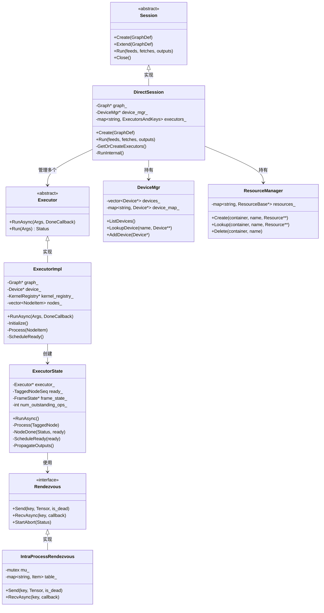
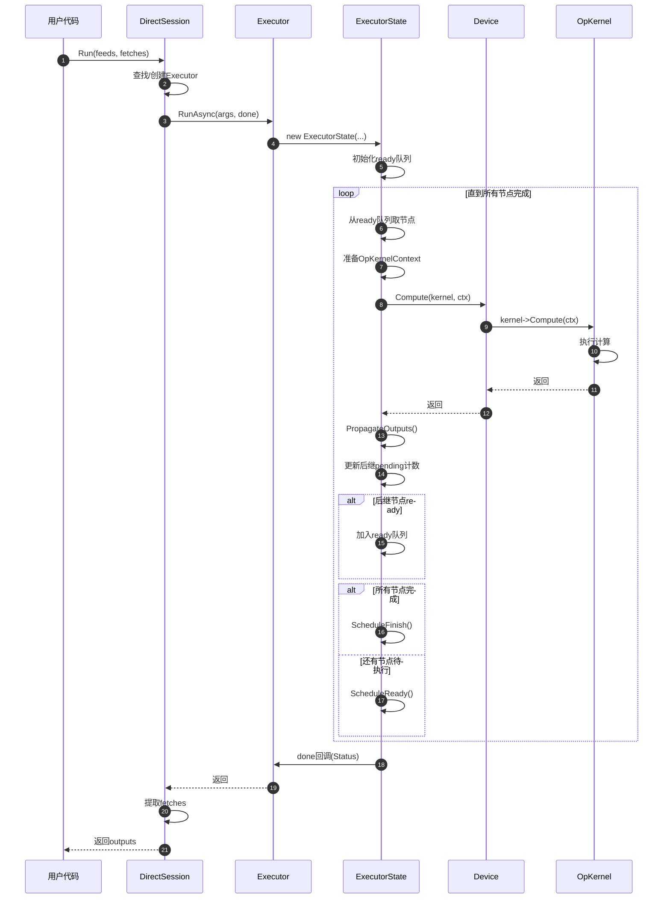
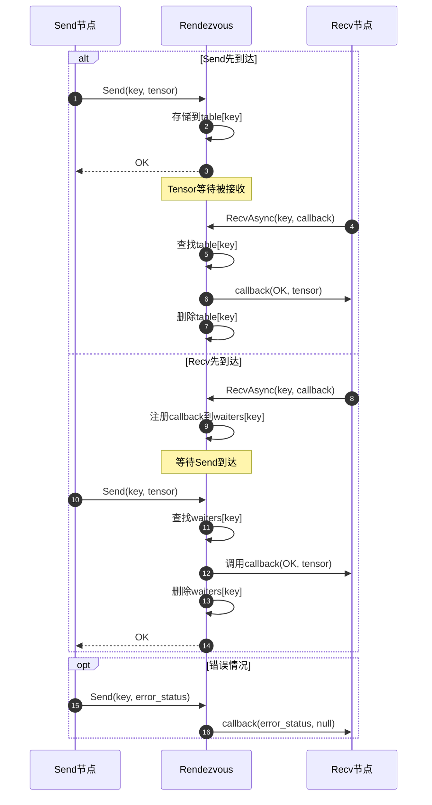
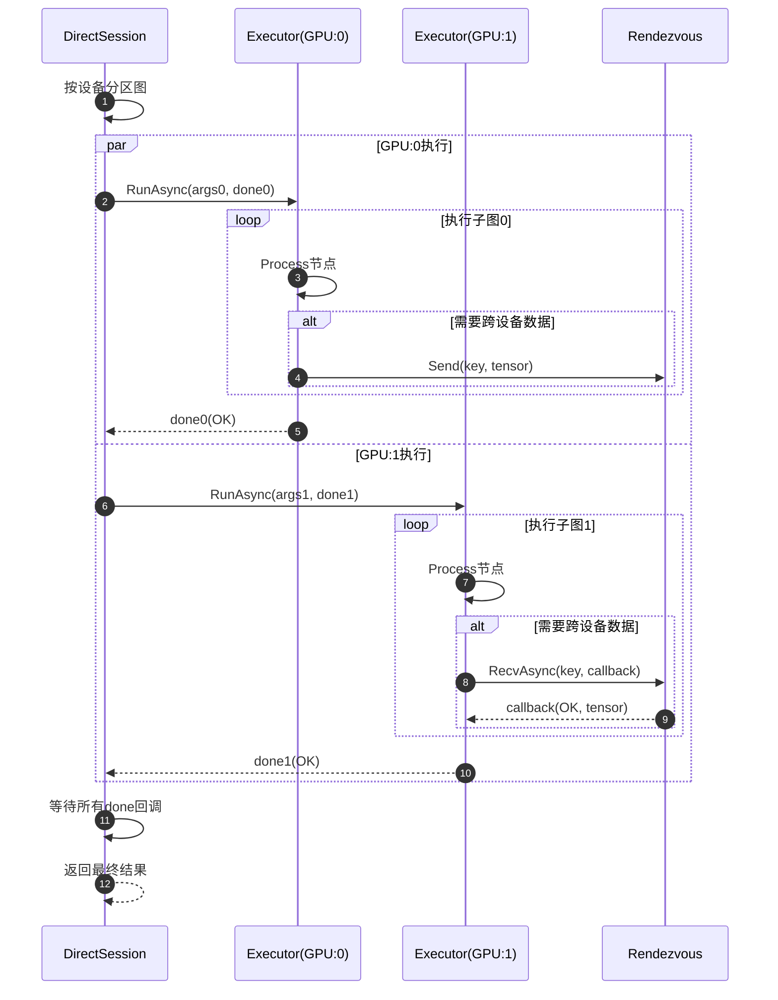

# TensorFlow 源码剖析 - Core Runtime 模块概览

## 模块职责

Core Runtime模块是TensorFlow的执行引擎核心，负责实际执行计算图中的操作。它协调设备、内存、调度等资源，将静态的图转化为动态的执行过程。

### 核心职责

1. **图执行编排**：Executor负责按拓扑顺序调度和执行图中的节点
2. **会话管理**：Session管理图的创建、优化和执行生命周期
3. **设备管理**：DeviceManager管理多个计算设备（CPU/GPU/TPU）
4. **数据交换**：Rendezvous提供节点间和设备间的数据传递机制
5. **资源管理**：ResourceManager管理持久化资源（变量、队列等）
6. **并发控制**：线程池管理和任务调度
7. **内存规划**：MemoryPlanner优化内存分配和复用

### 输入与输出

**输入**：
- Graph对象（已优化的计算图）
- 输入Tensor（feeds）
- 执行参数（step_id、配置等）

**输出**：
- 输出Tensor（fetches）
- 执行统计（时间、内存等）
- 错误状态

### 上下游依赖

**上游模块（调用者）**：
- Python前端：通过Session API执行图
- C++ API：直接调用Session和Executor
- 分布式Runtime：协调跨设备执行

**下游模块（被调用）**：
- Graph层：获取图结构
- OpKernel层：执行具体操作
- Device层：分配内存和执行Kernel
- Platform层：线程池和同步原语

### 生命周期

1. **Session创建**：解析GraphDef，创建Graph，初始化设备
2. **图优化**：Grappler优化、内存规划、设备放置
3. **Executor创建**：为每个设备子图创建Executor
4. **步骤执行**：Run()触发一次完整的图执行
5. **Session关闭**：清理资源，销毁Executor

## 架构图

### 核心类关系



### 架构说明

#### Session层

**DirectSession**：
- TensorFlow的主要Session实现（单机版）
- 管理图的创建、优化和执行
- 为每组(feeds, fetches)创建和缓存Executor
- 协调多设备执行

**DistributedSession**：
- 分布式版本Session
- 协调Master和Worker之间的RPC
- 处理跨机器的数据传输

#### Executor层

**ExecutorImpl**：
- 图执行的核心实现
- 维护图的拓扑结构和依赖关系
- 提供同步和异步执行接口

**ExecutorState**：
- 单次执行的状态机
- 跟踪节点的执行状态（pending/ready/done）
- 管理ready队列和调度
- 处理节点间的数据传播

**调度策略**：
- 昂贵操作（expensive ops）：提交到线程池异步执行
- 廉价操作（inexpensive ops）：内联执行（避免调度开销）
- 自适应调度：根据历史执行时间动态分类

#### Rendezvous层

**功能**：
- 节点间数据交换的抽象
- 支持跨设备数据传输
- 提供Send/Recv语义

**IntraProcessRendezvous**：
- 同一进程内的数据交换
- 使用内存表存储待传递的Tensor
- 支持异步Recv（等待未来的Send）

**RpcRendezvous**：
- 跨进程的数据交换
- 通过gRPC传输Tensor
- 处理网络错误和重试

#### 设备管理层

**DeviceMgr**：
- 管理所有可用设备
- 提供设备查找和分配服务
- 支持动态设备注册

**ResourceManager**：
- 管理持久化资源（变量、队列、表等）
- 提供资源的创建、查找和删除
- 支持容器隔离（不同step间资源隔离）

### 边界条件

**并发模型**：
- 多个线程可以并发调用Session::Run()
- Executor内部使用线程池并行执行无依赖节点
- 使用原子操作和互斥锁保护共享状态

**错误处理**：
- 任何节点失败会终止整个Step
- 通过CancellationManager传播取消信号
- Rendezvous的StartAbort()通知所有等待的Recv

**内存管理**：
- Tensor通过引用计数自动回收
- ExecutorState在done回调后自动销毁
- 资源通过ResourceManager生命周期管理

**超时控制**：
- 支持设置Step的deadline
- 超时后通过CancellationManager取消执行
- Rendezvous支持超时的Recv

### 异常处理

**节点执行失败**：
```cpp
// 节点执行出错后的处理
if (!s.ok()) {
  // 1. 记录错误信息
  LOG(ERROR) << "Node " << node->name() << " failed: " << s;
  
  // 2. 设置整体状态为失败
  executor_state->SetStatus(s);
  
  // 3. 触发取消管理器
  if (cancellation_manager) {
    cancellation_manager->StartCancel();
  }
  
  // 4. 中止Rendezvous
  rendezvous->StartAbort(s);
  
  // 5. 调用done回调通知失败
  done(s);
}
```

**死锁检测**：
- Executor检测循环依赖
- Rendezvous检测Send/Recv配对
- 超时机制防止无限等待

### 性能特性

**调度开销**：
- 轻量操作内联执行，避免线程切换
- 批量调度ready节点，减少锁竞争
- 使用原子操作管理pending计数

**内存优化**：
- 输出可以forward输入（原位操作）
- MemoryPlanner预分配和复用缓冲区
- GPU使用流水线执行，重叠计算和传输

**并行度**：
- intra_op_parallelism_threads：单个Op内的并行度
- inter_op_parallelism_threads：Op间的并行度
- 两者独立配置，适应不同工作负载

### 版本兼容

**Executor版本**：
- 标准Executor：通用实现
- SingleThreadedExecutor：单线程执行（移动端）
- EagerExecutor：Eager模式的执行器

**优化器集成**：
- Grappler在Executor创建前优化图
- XLA JIT编译子图
- MLIR编译器集成

## 核心算法与流程

### Executor初始化

```cpp
// ExecutorImpl::Initialize 核心流程
Status ExecutorImpl::Initialize() {
  // 1. 按拓扑顺序遍历图
  std::vector<Node*> order;
  GetReversePostOrder(*graph_, &order, NodeComparatorName());
  
  // 2. 为每个节点创建NodeItem
  nodes_.resize(graph_->num_node_ids());
  for (Node* n : order) {
    NodeItem* item = &nodes_[n->id()];
    item->node = n;
    
    // 3. 查找并缓存OpKernel
    Status s = CreateNonCachedKernel(device_, params_.function_library,
                                     n, graph_def_version_, &item->kernel);
    if (!s.ok()) {
      return s;
    }
    
    // 4. 计算输入输出边
    for (const Edge* e : n->in_edges()) {
      if (e->IsControlEdge()) {
        item->num_control_inputs++;
      } else {
        item->input_start = min(item->input_start, e->dst_input());
      }
    }
    
    // 5. 标识root节点（无输入）
    if (n->num_inputs() == 0) {
      root_nodes_.push_back(item);
    }
    
    // 6. 分类expensive vs inexpensive
    kernel_stats_->RecordOpType(item);
  }
  
  return Status::OK();
}
```

**算法说明**：

**目的**：预处理图，为执行做准备

**关键步骤**：
1. 拓扑排序：确定执行的偏序
2. Kernel创建：查找并实例化每个Op的Kernel
3. 依赖分析：计算每个节点的输入数量
4. Root识别：找到可以立即执行的节点
5. 成本估计：分类操作的执行成本

**复杂度**：
- 时间：O(V + E)，V为节点数，E为边数
- 空间：O(V)

### 异步执行流程

```cpp
// ExecutorState::RunAsync 核心实现
void ExecutorState::RunAsync(DoneCallback done) {
  TaggedNodeSeq ready;
  
  // 1. 初始化设备上下文
  Device* device = immutable_state_.params().device;
  Status s = device->TryGetDeviceContext(&device_context_);
  if (!s.ok()) {
    delete this;
    done(s);
    return;
  }
  
  // 2. 激活root节点
  ready.reserve(immutable_state_.root_nodes().size());
  propagator_.ActivateRoots(immutable_state_.root_nodes(), &ready);
  num_outstanding_ops_ = ready.size();
  
  // 3. 检查是否有节点可执行
  if (ready.empty()) {
    delete this;
    done(Status::OK());
    return;
  }
  
  // 4. 保存done回调
  done_cb_ = std::move(done);
  
  // 5. 调度ready节点到线程池
  ScheduleReady(&ready, nullptr);
}
```

**算法说明**：

**目的**：启动图的异步执行

**输入**：
- DoneCallback：执行完成时的回调函数

**输出**：
- 通过done回调返回Status

**复杂度**：
- 时间：O(R)，R为root节点数
- 空间：O(R)

### 节点执行与传播

```cpp
// ExecutorState::Process 核心实现
void ExecutorState::Process(TaggedNode tagged_node, int64 scheduled_nsec) {
  const NodeItem& item = *tagged_node.node_item;
  
  // 1. 准备输入
  OpKernelContext::Params params;
  params.device = device_;
  params.op_kernel = item.kernel;
  params.inputs = GetInputTensors(item);
  // （此处省略其他参数设置）
  
  // 2. 创建OpKernelContext
  OpKernelContext ctx(&params, item.num_outputs);
  
  // 3. 执行Kernel
  device_->Compute(item.kernel, &ctx);
  
  // 4. 检查执行状态
  Status s = ctx.status();
  if (!s.ok()) {
    NodeDone(s, nullptr, nullptr);
    return;
  }
  
  // 5. 处理输出
  TaggedNodeSeq ready;
  PropagateOutputs(tagged_node, &ctx, &ready);
  
  // 6. 标记节点完成
  if (NodeDone(s, &ready, stats)) {
    // 所有节点完成，执行done回调
    ScheduleFinish();
  } else {
    // 调度新的ready节点
    ScheduleReady(&ready, &inline_ready);
  }
}
```

**算法说明**：

**目的**：执行单个节点并传播结果

**流程**：
1. 收集输入Tensor
2. 创建执行上下文
3. 调用Device::Compute()执行Kernel
4. 检查错误状态
5. 将输出传播给后继节点
6. 更新后继节点的pending计数
7. 调度新ready的节点

**PropagateOutputs逻辑**：
```cpp
void PropagateOutputs(const TaggedNode& tagged_node,
                     OpKernelContext* ctx,
                     TaggedNodeSeq* ready) {
  const NodeItem& item = *tagged_node.node_item;
  
  // 遍历所有输出边
  for (const Edge* edge : item.output_edges) {
    const int src_output = edge->src_output();
    const int dst_input = edge->dst_input();
    const Node* dst = edge->dst();
    
    // 1. 获取输出Tensor
    const Tensor* output_tensor = ctx->output(src_output);
    
    // 2. 发送到目标节点
    Entry& input_entry = input_tensors_[dst->id()][dst_input];
    input_entry.val = output_tensor;
    input_entry.state = Entry::State::HAS_VALUE;
    
    // 3. 减少目标节点的pending计数
    NodeItem* dst_item = &nodes_[dst->id()];
    if (--dst_item->pending_count == 0) {
      // 目标节点所有输入就绪，加入ready队列
      ready->push_back(TaggedNode{dst_item});
    }
  }
}
```

### 调度策略

```cpp
// ScheduleReady 核心实现
void ExecutorState::ScheduleReady(TaggedNodeSeq* ready,
                                 TaggedNodeReadyQueue* inline_ready) {
  if (run_all_kernels_inline_) {
    // 单线程模式：顺序执行
    for (auto& tagged_node : *ready) {
      inline_ready->push_back(tagged_node);
    }
  } else {
    // 多线程模式：根据成本分类
    for (auto& tagged_node : *ready) {
      const NodeItem& item = *tagged_node.node_item;
      
      if (kernel_stats_->IsExpensive(item)) {
        // 昂贵操作：提交到线程池
        RunTask([this, tagged_node, scheduled_nsec]() {
          Process(tagged_node, scheduled_nsec);
        });
      } else {
        // 廉价操作：内联执行
        inline_ready->push_back(tagged_node);
      }
    }
  }
  
  ready->clear();
}
```

**算法说明**：

**目的**：根据操作成本选择执行方式

**策略**：
- **内联执行**：避免线程调度开销（适合<1μs的操作）
- **异步执行**：利用线程池并行（适合>10μs的操作）
- **自适应**：根据历史执行时间动态调整阈值

**性能考虑**：
- 线程调度开销：~1-2μs
- 锁竞争开销：多线程读写共享状态
- 缓存局部性：内联执行更好的缓存命中

## 时序图

### Session执行流程



### Rendezvous数据交换



### 多设备执行协调



## 总结

Core Runtime模块是TensorFlow的执行引擎，关键设计特点：

1. **异步数据流执行**：节点按依赖关系自动并行执行
2. **自适应调度**：根据操作成本选择内联或异步执行
3. **Rendezvous机制**：统一的数据交换抽象，支持进程内和跨进程
4. **设备无关**：通过Device抽象支持异构硬件
5. **错误传播**：任何节点失败会快速终止整个Step
6. **内存优化**：引用计数和原位操作减少拷贝

理解Runtime层是掌握TensorFlow执行机制的关键，它将静态图转化为高效的动态执行。

