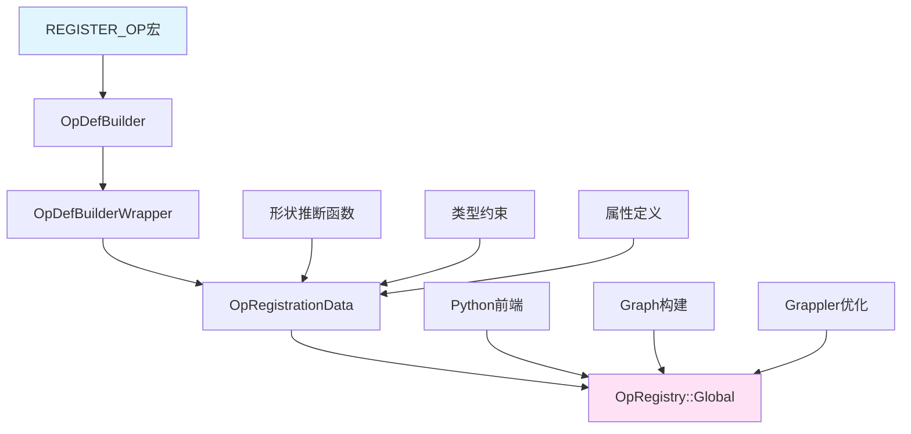
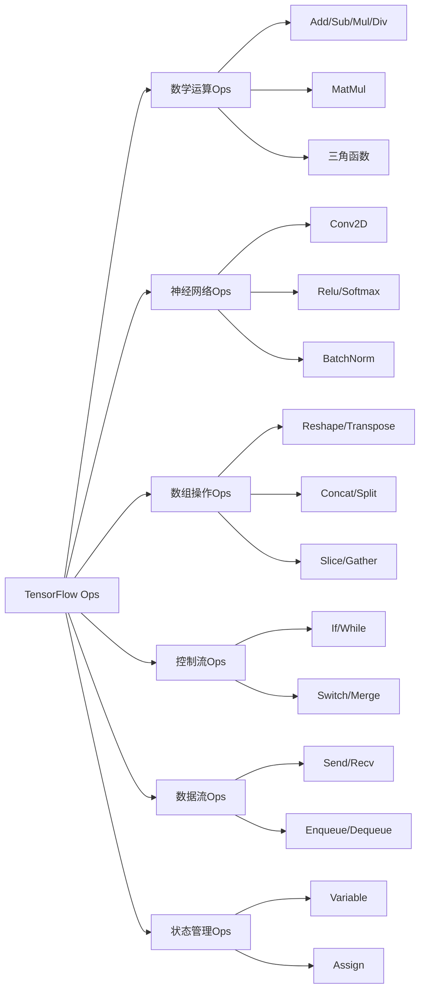
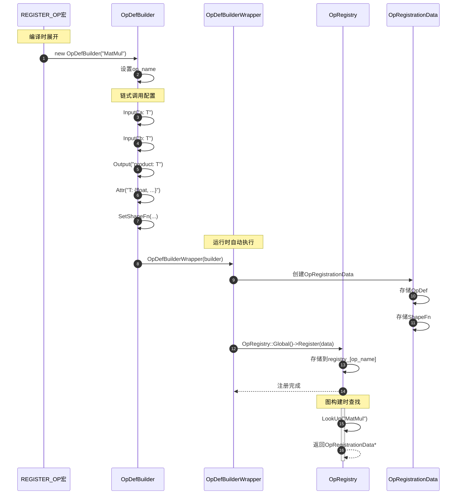

# TensorFlow 源码剖析 - Core Ops 模块概览

## 模块职责

Core Ops模块负责定义TensorFlow所有操作（Operations）的元数据和接口规范。Ops定义了操作的输入输出、属性、约束和形状推断规则，是连接用户API和底层Kernel实现的桥梁。

### 核心职责

1. **操作定义**：通过OpDef定义操作的签名（输入、输出、属性）
2. **类型约束**：指定操作支持的数据类型
3. **形状推断**：定义输出Tensor的形状计算规则
4. **操作注册**：将OpDef注册到全局OpRegistry
5. **文档生成**：提供操作的描述和使用说明
6. **语义标记**：标记操作的特殊属性（可交换、聚合、有状态等）

### 输入与输出

**输入**：
- 开发者编写的REGISTER_OP宏定义
- 形状推断函数
- 属性约束规则

**输出**：
- OpDef Protocol Buffer
- 注册到OpRegistry的OpRegistrationData
- 用于图构建时的验证规则

### 上下游依赖

**上游模块（调用者）**：
- Python API：生成Python wrapper
- Graph：构建图时验证节点
- Compiler：优化器使用Op元数据

**下游模块（被调用）**：
- Framework：使用OpDef和AttrValue基础类型
- Proto：依赖Protocol Buffers定义

### 生命周期

1. **编译时**：REGISTER_OP宏展开，生成注册代码
2. **启动时**：全局构造函数自动注册OpDef到OpRegistry
3. **图构建时**：查找OpDef验证NodeDef
4. **图执行时**：OpDef不参与执行，仅用于验证

## 架构图

### Ops注册架构



### Ops分类



## 核心组件

### REGISTER_OP宏

**定义**：
```cpp
#define REGISTER_OP(name) \
  REGISTER_OP_UNIQ_HELPER(__COUNTER__, name)

#define REGISTER_OP_UNIQ_HELPER(ctr, name) \
  REGISTER_OP_UNIQ(ctr, name)

#define REGISTER_OP_UNIQ(ctr, name)                           \
  static ::tensorflow::InitOnStartupMarker const              \
      register_op##ctr TF_ATTRIBUTE_UNUSED =                  \
          TF_INIT_ON_STARTUP_IF(SHOULD_REGISTER_OP(name))    \
          << ::tensorflow::register_op::OpDefBuilderWrapper(name)
```

**使用示例**：
```cpp
REGISTER_OP("MatMul")
    .Input("a: T")
    .Input("b: T")
    .Output("product: T")
    .Attr("T: {float, double, int32, complex64, complex128}")
    .Attr("transpose_a: bool = false")
    .Attr("transpose_b: bool = false")
    .SetShapeFn([](InferenceContext* c) {
      ShapeHandle a_shape, b_shape;
      TF_RETURN_IF_ERROR(c->WithRank(c->input(0), 2, &a_shape));
      TF_RETURN_IF_ERROR(c->WithRank(c->input(1), 2, &b_shape));
      
      bool transpose_a, transpose_b;
      TF_RETURN_IF_ERROR(c->GetAttr("transpose_a", &transpose_a));
      TF_RETURN_IF_ERROR(c->GetAttr("transpose_b", &transpose_b));
      
      DimensionHandle m = c->Dim(a_shape, transpose_a ? 1 : 0);
      DimensionHandle k_a = c->Dim(a_shape, transpose_a ? 0 : 1);
      DimensionHandle k_b = c->Dim(b_shape, transpose_b ? 1 : 0);
      DimensionHandle n = c->Dim(b_shape, transpose_b ? 0 : 1);
      
      DimensionHandle merged_k;
      TF_RETURN_IF_ERROR(c->Merge(k_a, k_b, &merged_k));
      
      c->set_output(0, c->Matrix(m, n));
      return Status::OK();
    });
```

### OpDefBuilder链式API

**核心方法**：

```cpp
class OpDefBuilder {
 public:
  // 设置Op名称
  explicit OpDefBuilder(string op_name);
  
  // 添加输入
  OpDefBuilder& Input(string spec);
  
  // 添加输出  
  OpDefBuilder& Output(string spec);
  
  // 添加属性
  OpDefBuilder& Attr(string spec);
  
  // 添加控制输出（函数Op）
  OpDefBuilder& ControlOutput(string name);
  
  // 设置文档
  OpDefBuilder& Doc(string text);
  
  // 设置形状推断函数
  OpDefBuilder& SetShapeFn(OpShapeInferenceFn fn);
  
  // 语义标记
  OpDefBuilder& SetIsCommutative();      // 可交换
  OpDefBuilder& SetIsAggregate();        // 可聚合
  OpDefBuilder& SetIsStateful();         // 有状态
  OpDefBuilder& SetIsDistributedCommunication();
  OpDefBuilder& SetAllowsUninitializedInput();
  
 private:
  OpDef* op_def_;
};
```

### 形状推断系统

**InferenceContext接口**：

```cpp
class InferenceContext {
 public:
  // 获取输入形状
  ShapeHandle input(int idx) const;
  
  // 设置输出形状
  void set_output(int idx, ShapeHandle shape);
  
  // 获取维度
  DimensionHandle Dim(ShapeHandle s, int idx);
  
  // 合并维度（验证兼容性）
  Status Merge(DimensionHandle d1, DimensionHandle d2, 
               DimensionHandle* out);
  
  // 合并形状
  Status Merge(ShapeHandle s1, ShapeHandle s2, ShapeHandle* out);
  
  // 创建形状
  ShapeHandle Matrix(DimensionHandle rows, DimensionHandle cols);
  ShapeHandle Vector(DimensionHandle dim);
  ShapeHandle MakeShape(std::vector<DimensionHandle> dims);
  
  // 获取属性
  Status GetAttr(absl::string_view attr_name, T* value);
  
  // 验证秩
  Status WithRank(ShapeHandle shape, int rank, ShapeHandle* out);
  Status WithRankAtLeast(ShapeHandle shape, int rank, ShapeHandle* out);
  Status WithRankAtMost(ShapeHandle shape, int rank, ShapeHandle* out);
  
  // 广播
  Status BroadcastBinaryOpOutputShapeFn(ShapeHandle s1, ShapeHandle s2,
                                       ShapeHandle* out);
};
```

**常用形状推断函数**：

```cpp
// 形状不变
Status UnchangedShape(InferenceContext* c) {
  c->set_output(0, c->input(0));
  return Status::OK();
}

// 矩阵乘法形状推断
Status MatMulShape(InferenceContext* c) {
  ShapeHandle a, b;
  TF_RETURN_IF_ERROR(c->WithRank(c->input(0), 2, &a));
  TF_RETURN_IF_ERROR(c->WithRank(c->input(1), 2, &b));
  
  DimensionHandle m = c->Dim(a, 0);
  DimensionHandle k_a = c->Dim(a, 1);
  DimensionHandle k_b = c->Dim(b, 0);
  DimensionHandle n = c->Dim(b, 1);
  
  DimensionHandle merged_k;
  TF_RETURN_IF_ERROR(c->Merge(k_a, k_b, &merged_k));
  
  c->set_output(0, c->Matrix(m, n));
  return Status::OK();
}

// 广播二元操作
Status BroadcastBinaryOpShapeFn(InferenceContext* c) {
  ShapeHandle shape_x = c->input(0);
  ShapeHandle shape_y = c->input(1);
  ShapeHandle output;
  TF_RETURN_IF_ERROR(
      c->BroadcastBinaryOpOutputShapeFn(shape_x, shape_y, &output));
  c->set_output(0, output);
  return Status::OK();
}
```

## 典型Ops定义

### 数学运算Ops

#### Add操作

```cpp
REGISTER_OP("Add")
    .Input("x: T")
    .Input("y: T")
    .Output("z: T")
    .Attr("T: {bfloat16, half, float, double, uint8, int8, int16, "
          "int32, int64, complex64, complex128, string}")
    .SetShapeFn(shape_inference::BroadcastBinaryOpShapeFn)
    .SetIsCommutative()  // add是可交换的
    .SetIsAggregate();   // add是可聚合的
```

**字段说明**：
- **Input**："x: T" 表示输入名为x，类型为T（泛型）
- **Output**："z: T" 表示输出名为z，类型与输入相同
- **Attr**："T: {...}" 定义类型属性T，限定支持的类型列表
- **SetShapeFn**：设置形状推断函数，使用广播规则
- **SetIsCommutative**：标记为可交换（x+y == y+x）
- **SetIsAggregate**：标记为可聚合（可优化为树形聚合）

#### MatMul操作

```cpp
REGISTER_OP("MatMul")
    .Input("a: T")
    .Input("b: T")
    .Output("product: T")
    .Attr("transpose_a: bool = false")
    .Attr("transpose_b: bool = false")
    .Attr("T: {bfloat16, half, float, double, int32, "
          "complex64, complex128}")
    .SetShapeFn([](InferenceContext* c) {
      // 验证输入是矩阵
      ShapeHandle a_shape, b_shape;
      TF_RETURN_IF_ERROR(c->WithRank(c->input(0), 2, &a_shape));
      TF_RETURN_IF_ERROR(c->WithRank(c->input(1), 2, &b_shape));
      
      // 读取转置属性
      bool transpose_a, transpose_b;
      TF_RETURN_IF_ERROR(c->GetAttr("transpose_a", &transpose_a));
      TF_RETURN_IF_ERROR(c->GetAttr("transpose_b", &transpose_b));
      
      // 计算输出维度
      DimensionHandle m = c->Dim(a_shape, transpose_a ? 1 : 0);
      DimensionHandle k_a = c->Dim(a_shape, transpose_a ? 0 : 1);
      DimensionHandle k_b = c->Dim(b_shape, transpose_b ? 1 : 0);
      DimensionHandle n = c->Dim(b_shape, transpose_b ? 0 : 1);
      
      // 验证内积维度匹配
      DimensionHandle merged_k;
      TF_RETURN_IF_ERROR(c->Merge(k_a, k_b, &merged_k));
      
      // 设置输出形状
      c->set_output(0, c->Matrix(m, n));
      return Status::OK();
    });
```

### 神经网络Ops

#### Conv2D操作

```cpp
REGISTER_OP("Conv2D")
    .Input("input: T")
    .Input("filter: T")
    .Output("output: T")
    .Attr("T: {half, bfloat16, float, double}")
    .Attr("strides: list(int)")
    .Attr("padding: {'SAME', 'VALID', 'EXPLICIT'}")
    .Attr("explicit_paddings: list(int) = []")
    .Attr("data_format: {'NHWC', 'NCHW'} = 'NHWC'")
    .Attr("dilations: list(int) = [1, 1, 1, 1]")
    .SetShapeFn([](InferenceContext* c) {
      // 复杂的形状推断逻辑
      // 根据strides、padding、dilations计算输出形状
      
      ShapeHandle input_shape;
      TF_RETURN_IF_ERROR(c->WithRank(c->input(0), 4, &input_shape));
      
      ShapeHandle filter_shape;
      TF_RETURN_IF_ERROR(c->WithRank(c->input(1), 4, &filter_shape));
      
      string data_format;
      TF_RETURN_IF_ERROR(c->GetAttr("data_format", &data_format));
      
      // 根据data_format提取维度
      int batch_dim = (data_format == "NHWC") ? 0 : 0;
      int height_dim = (data_format == "NHWC") ? 1 : 2;
      int width_dim = (data_format == "NHWC") ? 2 : 3;
      int channel_dim = (data_format == "NHWC") ? 3 : 1;
      
      // 计算输出维度...
      // （此处省略详细计算逻辑）
      
      return Status::OK();
    });
```

### 控制流Ops

#### Switch操作

```cpp
REGISTER_OP("Switch")
    .Input("data: T")
    .Input("pred: bool")
    .Output("output_false: T")
    .Output("output_true: T")
    .Attr("T: type")
    .SetShapeFn([](InferenceContext* c) {
      // 验证pred是scalar
      ShapeHandle pred_shape;
      TF_RETURN_IF_ERROR(c->WithRank(c->input(1), 0, &pred_shape));
      
      // 两个输出与输入形状相同
      ShapeHandle data_shape = c->input(0);
      c->set_output(0, data_shape);
      c->set_output(1, data_shape);
      return Status::OK();
    });
```

#### Merge操作

```cpp
REGISTER_OP("Merge")
    .Input("inputs: N * T")
    .Output("output: T")
    .Output("value_index: int32")
    .Attr("T: type")
    .Attr("N: int >= 1")
    .SetShapeFn([](InferenceContext* c) {
      // 所有输入形状必须兼容
      ShapeHandle merged = c->input(0);
      for (int i = 1; i < c->num_inputs(); ++i) {
        TF_RETURN_IF_ERROR(c->Merge(merged, c->input(i), &merged));
      }
      c->set_output(0, merged);
      c->set_output(1, c->Scalar());  // value_index是scalar
      return Status::OK();
    });
```

### 状态管理Ops

#### Variable操作

```cpp
REGISTER_OP("VariableV2")
    .Output("ref: Ref(dtype)")
    .Attr("shape: shape")
    .Attr("dtype: type")
    .Attr("container: string = ''")
    .Attr("shared_name: string = ''")
    .SetIsStateful()  // 标记为有状态
    .SetShapeFn(shape_inference::ExplicitShape);  // 形状来自shape属性
```

#### Assign操作

```cpp
REGISTER_OP("Assign")
    .Input("ref: Ref(T)")
    .Input("value: T")
    .Output("output_ref: Ref(T)")
    .Attr("T: type")
    .Attr("validate_shape: bool = true")
    .Attr("use_locking: bool = true")
    .SetAllowsUninitializedInput()  // 允许未初始化输入
    .SetShapeFn([](InferenceContext* c) {
      c->set_output(0, c->input(0));
      return Status::OK();
    });
```

## Ops注册流程

### 时序图



### 注册代码生成

```cpp
// 源代码
REGISTER_OP("Add")
    .Input("x: T")
    .Input("y: T")
    .Output("z: T")
    .Attr("T: numbertype");

// 宏展开后（简化）
static ::tensorflow::InitOnStartupMarker const register_op_123 = 
    ::tensorflow::InitOnStartup([]() {
      ::tensorflow::OpRegistry::Global()->Register(
          [](::tensorflow::OpRegistrationData* op_reg_data) -> Status {
            OpDefBuilder builder("Add");
            builder.Input("x: T");
            builder.Input("y: T");
            builder.Output("z: T");
            builder.Attr("T: numbertype");
            return builder.Finalize(op_reg_data);
          });
    });
```

### 启动时注册

```
程序启动
  ↓
全局构造函数执行
  ↓
InitOnStartupMarker触发
  ↓
调用lambda注册函数
  ↓
OpRegistry::Register()
  ├─ 创建OpRegistrationData
  ├─ 验证OpDef
  ├─ 存储到registry_[op_name]
  └─ 调用watcher（如果有）
  ↓
注册完成，OpDef可用
```

## 形状推断详解

### 形状推断的重要性

1. **编译期优化**：已知形状可进行内存预分配
2. **错误检测**：形状不兼容在构图时发现
3. **性能优化**：某些操作可根据形状选择算法
4. **设备放置**：某些设备对形状有要求

### 形状推断规则

#### 元素级操作

```cpp
// Relu、Sigmoid等
Status UnchangedShape(InferenceContext* c) {
  // 输出与输入形状完全相同
  c->set_output(0, c->input(0));
  return Status::OK();
}
```

#### 降维操作

```cpp
// ReduceSum、ReduceMean等
Status ReduceShapeFn(InferenceContext* c) {
  ShapeHandle input = c->input(0);
  ShapeHandle indices;
  TF_RETURN_IF_ERROR(c->WithRank(c->input(1), 1, &indices));
  
  bool keep_dims;
  TF_RETURN_IF_ERROR(c->GetAttr("keep_dims", &keep_dims));
  
  if (keep_dims) {
    // 保持维度，设置为1
    // 输出形状...
  } else {
    // 移除指定维度
    // 输出形状...
  }
  
  return Status::OK();
}
```

#### 广播操作

```cpp
// Add、Mul等二元操作
Status BroadcastBinaryOpShapeFn(InferenceContext* c) {
  ShapeHandle x = c->input(0);
  ShapeHandle y = c->input(1);
  ShapeHandle output;
  
  // 广播规则：
  // 1. 从右向左对齐
  // 2. 维度相同或其中一个为1时可广播
  TF_RETURN_IF_ERROR(
      c->BroadcastBinaryOpOutputShapeFn(x, y, &output));
  
  c->set_output(0, output);
  return Status::OK();
}

// 示例：
// x: [3, 1, 5]
// y: [   4, 5]
// 输出: [3, 4, 5]
```

### 复杂形状推断示例

```cpp
// BatchMatMul形状推断
Status BatchMatMulShapeFn(InferenceContext* c) {
  ShapeHandle x_shape;
  ShapeHandle y_shape;
  TF_RETURN_IF_ERROR(c->WithRankAtLeast(c->input(0), 2, &x_shape));
  TF_RETURN_IF_ERROR(c->WithRankAtLeast(c->input(1), 2, &y_shape));
  
  // 获取属性
  bool adj_x, adj_y;
  TF_RETURN_IF_ERROR(c->GetAttr("adj_x", &adj_x));
  TF_RETURN_IF_ERROR(c->GetAttr("adj_y", &adj_y));
  
  // 矩阵维度
  int x_rank = c->Rank(x_shape);
  int y_rank = c->Rank(y_shape);
  
  DimensionHandle x_m = c->Dim(x_shape, x_rank - (adj_x ? 1 : 2));
  DimensionHandle x_k = c->Dim(x_shape, x_rank - (adj_x ? 2 : 1));
  DimensionHandle y_k = c->Dim(y_shape, y_rank - (adj_y ? 1 : 2));
  DimensionHandle y_n = c->Dim(y_shape, y_rank - (adj_y ? 2 : 1));
  
  // 验证k维度匹配
  DimensionHandle merged_k;
  TF_RETURN_IF_ERROR(c->Merge(x_k, y_k, &merged_k));
  
  // 广播batch维度
  ShapeHandle x_batch_shape;
  ShapeHandle y_batch_shape;
  TF_RETURN_IF_ERROR(c->Subshape(x_shape, 0, x_rank - 2, &x_batch_shape));
  TF_RETURN_IF_ERROR(c->Subshape(y_shape, 0, y_rank - 2, &y_batch_shape));
  
  ShapeHandle batch_shape;
  TF_RETURN_IF_ERROR(
      BroadcastBinaryOpOutputShapeFnHelper(c, x_batch_shape, y_batch_shape,
                                          &batch_shape));
  
  // 组合batch + [m, n]
  ShapeHandle output;
  TF_RETURN_IF_ERROR(
      c->Concatenate(batch_shape, c->Matrix(x_m, y_n), &output));
  
  c->set_output(0, output);
  return Status::OK();
}
```

## Ops分类

### 按功能分类

| 类别 | 文件 | 典型Ops | 数量 |
|------|------|---------|------|
| 数学运算 | math_ops.cc | Add, MatMul, Sin, Exp | ~100 |
| 数组操作 | array_ops.cc | Reshape, Concat, Slice, Gather | ~80 |
| 神经网络 | nn_ops.cc | Conv2D, Relu, Softmax, BatchNorm | ~60 |
| 控制流 | control_flow_ops.cc | Switch, Merge, Enter, Exit | ~15 |
| 数据流 | data_flow_ops.cc | QueueEnqueue, Send, Recv | ~30 |
| 状态管理 | state_ops.cc | Variable, Assign, AssignAdd | ~20 |
| 图像处理 | image_ops.cc | ResizeBilinear, DecodeJpeg | ~40 |
| 字符串 | string_ops.cc | StringJoin, StringSplit | ~25 |
| IO操作 | io_ops.cc | ReadFile, WriteFile | ~20 |
| 随机数 | random_ops.cc | RandomUniform, RandomNormal | ~15 |

### 按语义分类

**无状态Ops**：
- 纯函数，相同输入总是产生相同输出
- 可被CSE（公共子表达式消除）优化
- 例如：Add、MatMul、Relu

**有状态Ops**：
- 维护内部状态或产生副作用
- 不能被CSE优化
- 例如：Variable、Assign、QueueEnqueue
- 通过`.SetIsStateful()`标记

**可交换Ops**：
- 交换输入顺序不影响结果
- 可被优化器重排
- 例如：Add、Mul
- 通过`.SetIsCommutative()`标记

**可聚合Ops**：
- 支持分布式聚合优化
- 例如：Add（可树形聚合）
- 通过`.SetIsAggregate()`标记

## 最佳实践

### 定义新Op

```cpp
// 1. 定义OpDef
REGISTER_OP("MyOp")
    .Input("input: T")
    .Output("output: T")
    .Attr("T: {float, int32}")
    .Attr("param: float")
    .Doc(R"doc(
MyOp的功能说明。

输入：
  input: 输入tensor

输出：
  output: 输出tensor

属性：
  param: 控制参数
)doc")
    .SetShapeFn([](InferenceContext* c) {
      // 实现形状推断
      c->set_output(0, c->input(0));
      return Status::OK();
    });
```

### 形状推断最佳实践

```cpp
// 1. 验证输入秩
ShapeHandle input;
TF_RETURN_IF_ERROR(c->WithRank(c->input(0), 2, &input));

// 2. 验证维度兼容性
DimensionHandle d1 = c->Dim(shape1, 0);
DimensionHandle d2 = c->Dim(shape2, 0);
DimensionHandle merged;
TF_RETURN_IF_ERROR(c->Merge(d1, d2, &merged));

// 3. 处理未知维度
if (!c->ValueKnown(c->Dim(input, 0))) {
  // 维度值未知，设置为UnknownDim
  c->set_output(0, c->UnknownShapeOfRank(rank));
}

// 4. 使用辅助函数
TF_RETURN_IF_ERROR(
    shape_inference::ReductionShapeFn(c));
```

### 常见错误

```cpp
// 错误：未验证输入秩
c->set_output(0, c->Matrix(c->Dim(c->input(0), 0), 
                          c->Dim(c->input(0), 1)));
// 正确：先验证
ShapeHandle input;
TF_RETURN_IF_ERROR(c->WithRank(c->input(0), 2, &input));
c->set_output(0, input);

// 错误：忘记验证维度兼容性
c->set_output(0, c->Matrix(c->Dim(a, 0), c->Dim(b, 1)));
// 正确：合并验证
DimensionHandle k;
TF_RETURN_IF_ERROR(c->Merge(c->Dim(a, 1), c->Dim(b, 0), &k));
```

## 总结

Core Ops模块是TensorFlow的接口规范层，关键特点：

1. **声明式定义**：通过REGISTER_OP宏声明操作签名
2. **类型安全**：编译期和运行期双重类型检查
3. **形状推断**：在图构建时计算输出形状
4. **可扩展**：添加新Op无需修改框架核心
5. **文档集成**：Op定义即文档，自动生成API参考

理解Ops定义是理解TensorFlow操作语义和扩展框架的基础。

---

**代码位置**：
```
tensorflow/core/ops/
├── math_ops.cc          # 数学运算Ops
├── nn_ops.cc            # 神经网络Ops
├── array_ops.cc         # 数组操作Ops
├── control_flow_ops.cc  # 控制流Ops
└── ...
```

