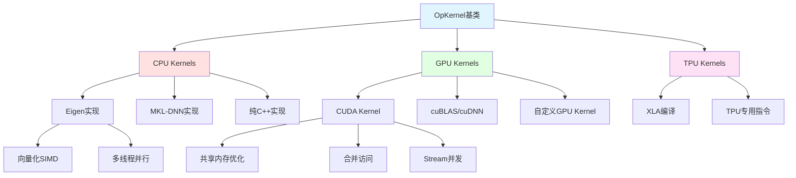
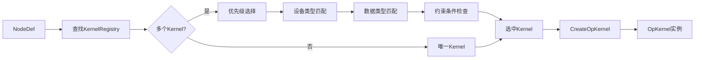
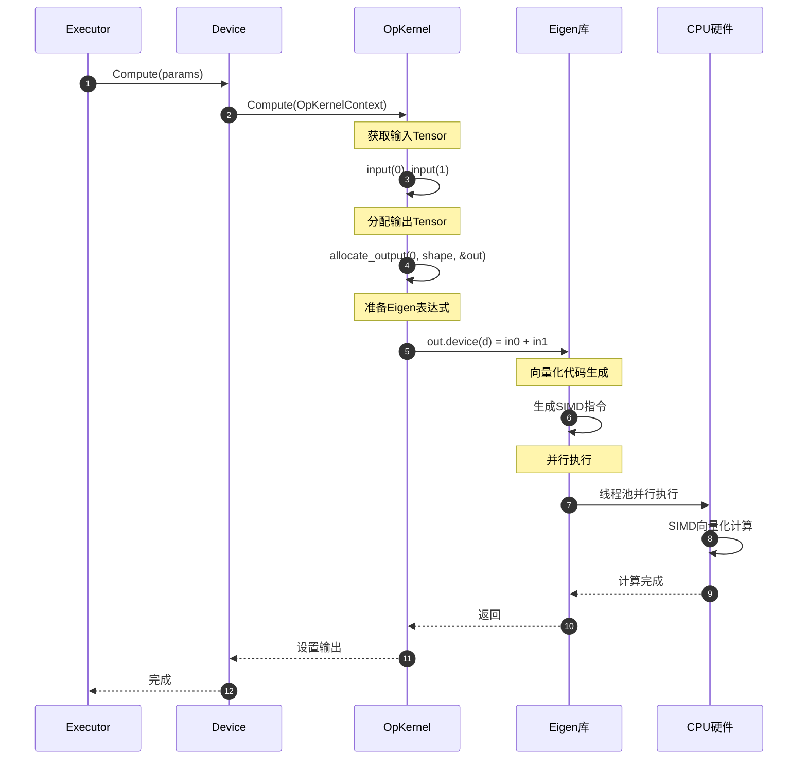
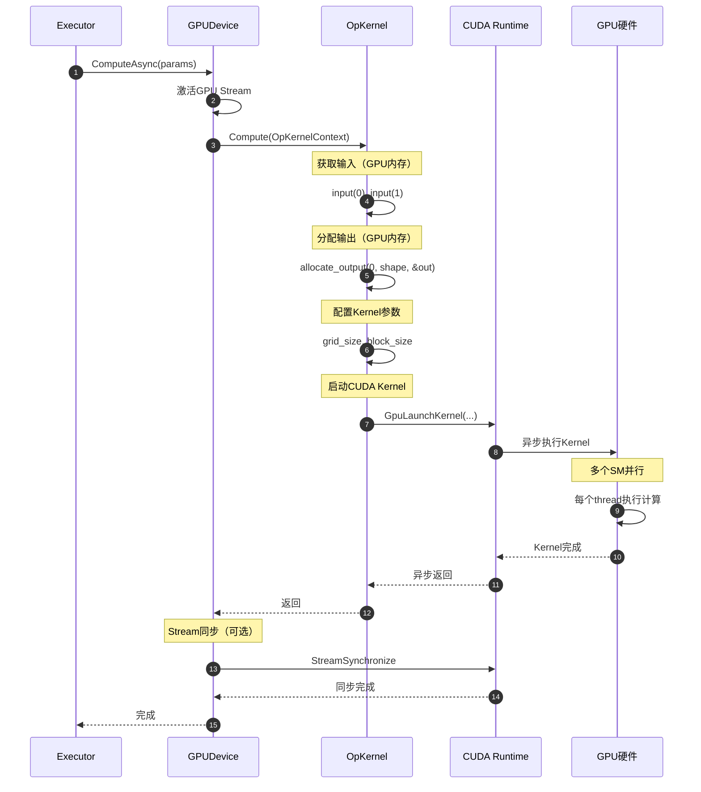

# TensorFlow 源码剖析 - Core Kernels 模块概览

## 模块职责

Core Kernels模块实现了TensorFlow所有操作的具体计算逻辑，是整个框架性能的关键所在。每个Op可以有多个Kernel实现，针对不同设备（CPU、GPU、TPU）和数据类型进行优化。

### 核心职责

1. **计算实现**：实现Op的具体计算逻辑
2. **设备适配**：为不同设备提供优化实现
3. **类型特化**：针对不同数据类型优化
4. **内存管理**：高效的Tensor分配和复用
5. **并行计算**：利用多核CPU、GPU并行能力
6. **性能优化**：SIMD向量化、算子融合等

### 输入与输出

**输入**：
- OpKernelContext：包含输入Tensor和执行上下文
- 输入Tensor：待处理的数据
- Attrs：操作属性参数

**输出**：
- 输出Tensor：计算结果
- Status：执行状态（成功或错误）

### 上下游依赖

**上游模块（调用者）**：
- Executor：调度Kernel执行
- Device：管理Kernel在设备上的执行
- Runtime：协调整体执行流程

**下游模块（被调用）**：
- Eigen库：CPU计算
- CUDA/cuBLAS/cuDNN：GPU计算
- MKL-DNN：Intel优化库
- 硬件驱动：底层设备访问

### 生命周期

1. **编译时**：REGISTER_KERNEL_BUILDER注册Kernel
2. **启动时**：Kernel工厂注册到全局Registry
3. **图优化时**：选择最优Kernel实现
4. **执行时**：CreateOpKernel实例化，Compute执行计算
5. **销毁时**：OpKernel析构，释放资源

## 架构图

### Kernels层次结构



### Kernel选择流程



## 核心组件

### OpKernel基类

**定义**：
```cpp
// tensorflow/core/framework/op_kernel.h
class OpKernel {
 public:
  // 构造函数，解析属性
  explicit OpKernel(OpKernelConstruction* context);
  
  // 纯虚函数，子类实现计算逻辑
  virtual void Compute(OpKernelContext* context) = 0;
  
  // 异步计算（可选）
  virtual AsyncOpKernel* AsAsync() { return nullptr; }
  
  // 判断是否消耗Ref输入
  virtual bool IsExpensive() { return true; }
  
  // 访问器
  const string& name() const;
  const string& type_string() const;
  const string& requested_device() const;
  const NodeDef& def() const;
  
 protected:
  // 析构函数
  virtual ~OpKernel();
};
```

### OpKernelConstruction

**功能**：在Kernel构造时提供上下文信息

```cpp
class OpKernelConstruction {
 public:
  // 获取属性
  Status GetAttr(StringPiece attr_name, T* value);
  
  // 验证输入/输出类型
  Status MatchSignature(const DataTypeSlice inputs,
                       const DataTypeSlice outputs);
  
  // 访问OpDef
  const OpDef& op_def() const;
  
  // 获取设备
  DeviceBase* device() const;
  
  // 分配持久化Tensor
  Status allocate_persistent(DataType type, const TensorShape& shape,
                             PersistentTensor* out_persistent,
                             Tensor** out_tensor);
};
```

### OpKernelContext

**功能**：在Kernel执行时提供运行时上下文

```cpp
class OpKernelContext {
 public:
  // 获取输入
  const Tensor& input(int index);
  int num_inputs() const;
  
  // 分配输出
  Status allocate_output(int index, const TensorShape& shape,
                        Tensor** output);
  
  // 尝试复用输入作为输出（原位操作）
  Status forward_input_or_allocate_output(
      gtl::ArraySlice<int> candidate_input_indices,
      int output_index,
      const TensorShape& output_shape,
      Tensor** output);
  
  // 获取设备
  template <typename EigenDeviceType>
  const EigenDeviceType& eigen_device() const;
  
  // 设置输出
  void set_output(int index, const Tensor& tensor);
  
  // 错误处理
  void CtxFailure(const Status& s);
  void CtxFailureWithWarning(const Status& s);
  
  // 获取资源
  Status GetAttr(StringPiece attr_name, T* value);
  
  // 分配临时Tensor
  Status allocate_temp(DataType type, const TensorShape& shape,
                      Tensor* out_temp);
};
```

## CPU Kernel实现

### 元素级操作Kernel

**Add操作CPU实现**：

```cpp
// tensorflow/core/kernels/cwise_ops_common.h
template <typename Device, typename Functor>
class BinaryOp : public BinaryOpShared {
 public:
  typedef typename Functor::in_type Tin;
  typedef typename Functor::out_type Tout;
  
  void Compute(OpKernelContext* ctx) override {
    const Tensor& input_0 = ctx->input(0);
    const Tensor& input_1 = ctx->input(1);
    
    // 快速路径1：相同形状，无广播
    if (input_0.shape() == input_1.shape()) {
      Tensor* out;
      OP_REQUIRES_OK(ctx, ctx->forward_input_or_allocate_output(
          {0, 1}, 0, input_0.shape(), &out));
      
      // 使用Eigen进行向量化计算
      const Device& eigen_device = ctx->eigen_device<Device>();
      functor::BinaryFunctor<Device, Functor, 1>()(
          eigen_device,
          out->template flat<Tout>(),
          input_0.template flat<Tin>(),
          input_1.template flat<Tin>(),
          nullptr);
      return;
    }
    
    // 快速路径2：标量 op Tensor
    else if (input_0.shape().dims() == 0) {
      Tensor* out;
      OP_REQUIRES_OK(ctx, ctx->forward_input_or_allocate_output(
          {1}, 0, input_1.shape(), &out));
      
      functor::BinaryFunctor<Device, Functor, 1>().Left(
          eigen_device,
          out->template flat<Tout>(),
          input_0.template scalar<Tin>(),
          input_1.template flat<Tin>(),
          nullptr);
      return;
    }
    
    // 通用路径：广播计算
    BinaryOpState state(ctx);
    if (!ctx->status().ok()) return;
    
    // 根据广播维度选择不同的实现
    if (state.ndims == 2) {
      functor::BinaryFunctor<Device, Functor, 2>().BCast(
          eigen_device,
          out->shaped<Tout, 2>(bcast.output_shape()),
          input_0.shaped<Tin, 2>(bcast.x_reshape()),
          input_1.shaped<Tin, 2>(bcast.y_reshape()),
          bcast.x_bcast(), bcast.y_bcast(),
          nullptr);
    }
    // 其他维度类似...
  }
};
```

**Add Functor定义**：

```cpp
// tensorflow/core/kernels/cwise_ops.h
namespace functor {

template <typename T>
struct add : base<T, T, T> {
  T operator()(const T& x, const T& y) const { return x + y; }
};

// CPU实现（Eigen）
template <typename T>
struct BinaryFunctor<CPUDevice, functor::add<T>, 1> {
  void operator()(const CPUDevice& d,
                  typename TTypes<T>::Flat out,
                  typename TTypes<T>::ConstFlat in0,
                  typename TTypes<T>::ConstFlat in1,
                  bool* error) {
    // Eigen会自动向量化
    out.device(d) = in0 + in1;
  }
};

}  // namespace functor
```

### 矩阵运算Kernel

**MatMul CPU实现**：

```cpp
// tensorflow/core/kernels/matmul_op.cc
template <typename Device, typename T>
class MatMulOp : public OpKernel {
 public:
  explicit MatMulOp(OpKernelConstruction* ctx) : OpKernel(ctx) {
    OP_REQUIRES_OK(ctx, ctx->GetAttr("transpose_a", &transpose_a_));
    OP_REQUIRES_OK(ctx, ctx->GetAttr("transpose_b", &transpose_b_));
  }
  
  void Compute(OpKernelContext* ctx) override {
    const Tensor& a = ctx->input(0);
    const Tensor& b = ctx->input(1);
    
    // 验证输入
    OP_REQUIRES(ctx, a.dims() == 2,
                errors::InvalidArgument("a must be 2-D"));
    OP_REQUIRES(ctx, b.dims() == 2,
                errors::InvalidArgument("b must be 2-D"));
    
    // 计算输出维度
    const int m = transpose_a_ ? a.dim_size(1) : a.dim_size(0);
    const int k = transpose_a_ ? a.dim_size(0) : a.dim_size(1);
    const int k2 = transpose_b_ ? b.dim_size(1) : b.dim_size(0);
    const int n = transpose_b_ ? b.dim_size(0) : b.dim_size(1);
    
    OP_REQUIRES(ctx, k == k2,
                errors::InvalidArgument(
                    "Matrix size incompatible: a: ", a.shape().DebugString(),
                    ", b: ", b.shape().DebugString()));
    
    // 分配输出
    Tensor* output = nullptr;
    OP_REQUIRES_OK(ctx, ctx->allocate_output(0, TensorShape({m, n}), &output));
    
    // 空矩阵快速返回
    if (output->NumElements() == 0) return;
    
    // 调用Eigen的矩阵乘法
    auto a_matrix = a.matrix<T>();
    auto b_matrix = b.matrix<T>();
    auto output_matrix = output->matrix<T>();
    
    Eigen::array<Eigen::IndexPair<Eigen::DenseIndex>, 1> dim_pair;
    dim_pair[0].first = transpose_a_ ? 0 : 1;
    dim_pair[0].second = transpose_b_ ? 1 : 0;
    
    functor::MatMulFunctor<Device, T>()(
        ctx->eigen_device<Device>(),
        output_matrix, a_matrix, b_matrix, transpose_a_, transpose_b_);
  }
  
 private:
  bool transpose_a_;
  bool transpose_b_;
};

// MatMul Functor（Eigen实现）
template <typename T>
struct MatMulFunctor<CPUDevice, T> {
  void operator()(
      const CPUDevice& d,
      typename TTypes<T>::Matrix out,
      typename TTypes<T>::ConstMatrix a,
      typename TTypes<T>::ConstMatrix b,
      bool transpose_a, bool transpose_b) {
    
    if (!transpose_a && !transpose_b) {
      // C = A * B
      out.device(d) = a.contract(b, dim_pair);
    } else if (transpose_a && !transpose_b) {
      // C = A^T * B
      out.device(d) = a.shuffle(shuffle).contract(b, dim_pair);
    } else if (!transpose_a && transpose_b) {
      // C = A * B^T
      out.device(d) = a.contract(b.shuffle(shuffle), dim_pair);
    } else {
      // C = A^T * B^T
      out.device(d) = a.shuffle(shuffle).contract(b.shuffle(shuffle), dim_pair);
    }
  }
};
```

## GPU Kernel实现

### CUDA Kernel示例

**Add GPU实现**：

```cpp
// tensorflow/core/kernels/cwise_ops_gpu_common.cu.h
// CUDA Kernel
template <typename T, typename Functor>
__global__ void BinaryOpKernel(int n, const T* in0, const T* in1, T* out) {
  int idx = blockIdx.x * blockDim.x + threadIdx.x;
  int stride = blockDim.x * gridDim.x;
  
  Functor func;
  for (int i = idx; i < n; i += stride) {
    out[i] = func(in0[i], in1[i]);
  }
}

// GPU Functor
template <typename T>
struct BinaryFunctor<GPUDevice, functor::add<T>, 1> {
  void operator()(const GPUDevice& d,
                  typename TTypes<T>::Flat out,
                  typename TTypes<T>::ConstFlat in0,
                  typename TTypes<T>::ConstFlat in1,
                  bool* error) {
    int n = out.size();
    if (n == 0) return;
    
    // 配置CUDA kernel参数
    int block_size = 256;
    int grid_size = (n + block_size - 1) / block_size;
    
    // 限制grid_size避免过多的block
    grid_size = std::min(grid_size, 1024);
    
    // 启动CUDA kernel
    TF_CHECK_OK(GpuLaunchKernel(
        BinaryOpKernel<T, functor::add<T>>,
        grid_size, block_size, 0, d.stream(),
        n, in0.data(), in1.data(), out.data()));
  }
};
```

**优化的GPU Add Kernel**：

```cpp
// 使用向量化访问优化
template <typename T>
__global__ void AddKernelVectorized(int n, const T* __restrict__ a,
                                   const T* __restrict__ b,
                                   T* __restrict__ c) {
  int idx = blockIdx.x * blockDim.x + threadIdx.x;
  
  // 使用float4进行向量化加载（4个float一次）
  if (sizeof(T) == sizeof(float) && n % 4 == 0) {
    const float4* a4 = reinterpret_cast<const float4*>(a);
    const float4* b4 = reinterpret_cast<const float4*>(b);
    float4* c4 = reinterpret_cast<float4*>(c);
    
    int n4 = n / 4;
    for (int i = idx; i < n4; i += blockDim.x * gridDim.x) {
      float4 va = a4[i];
      float4 vb = b4[i];
      float4 vc;
      vc.x = va.x + vb.x;
      vc.y = va.y + vb.y;
      vc.z = va.z + vb.z;
      vc.w = va.w + vb.w;
      c4[i] = vc;
    }
  } else {
    // 标量版本
    for (int i = idx; i < n; i += blockDim.x * gridDim.x) {
      c[i] = a[i] + b[i];
    }
  }
}
```

### Conv2D GPU实现

**cuDNN封装**：

```cpp
// tensorflow/core/kernels/conv_ops_gpu.h
template <typename T>
class ConvOpGPU : public OpKernel {
 public:
  void Compute(OpKernelContext* ctx) override {
    const Tensor& input = ctx->input(0);
    const Tensor& filter = ctx->input(1);
    
    // 创建cuDNN描述符
    cudnnTensorDescriptor_t input_desc;
    cudnnFilterDescriptor_t filter_desc;
    cudnnConvolutionDescriptor_t conv_desc;
    cudnnTensorDescriptor_t output_desc;
    
    cudnnCreate(&input_desc);
    cudnnCreate(&filter_desc);
    cudnnCreate(&conv_desc);
    cudnnCreate(&output_desc);
    
    // 设置描述符
    cudnnSetTensor4dDescriptor(
        input_desc, CUDNN_TENSOR_NCHW, GetCudnnDataType<T>(),
        batch, in_channels, in_height, in_width);
    
    cudnnSetFilter4dDescriptor(
        filter_desc, GetCudnnDataType<T>(), CUDNN_TENSOR_NCHW,
        out_channels, in_channels, filter_height, filter_width);
    
    cudnnSetConvolution2dDescriptor(
        conv_desc, pad_h, pad_w, stride_h, stride_w,
        dilation_h, dilation_w, CUDNN_CROSS_CORRELATION,
        GetCudnnDataType<T>());
    
    // 选择最优算法
    cudnnConvolutionFwdAlgo_t algo;
    cudnnGetConvolutionForwardAlgorithm(
        cudnn_handle, input_desc, filter_desc, conv_desc, output_desc,
        CUDNN_CONVOLUTION_FWD_PREFER_FASTEST, 0, &algo);
    
    // 查询workspace大小
    size_t workspace_size;
    cudnnGetConvolutionForwardWorkspaceSize(
        cudnn_handle, input_desc, filter_desc, conv_desc, output_desc,
        algo, &workspace_size);
    
    // 分配workspace
    Tensor workspace;
    OP_REQUIRES_OK(ctx, ctx->allocate_temp(
        DT_INT8, TensorShape({workspace_size}), &workspace));
    
    // 执行卷积
    float alpha = 1.0f, beta = 0.0f;
    cudnnConvolutionForward(
        cudnn_handle, &alpha,
        input_desc, input.flat<T>().data(),
        filter_desc, filter.flat<T>().data(),
        conv_desc, algo, workspace.flat<int8>().data(), workspace_size,
        &beta,
        output_desc, output->flat<T>().data());
    
    // 清理描述符
    cudnnDestroy(input_desc);
    cudnnDestroy(filter_desc);
    cudnnDestroy(conv_desc);
    cudnnDestroy(output_desc);
  }
};
```

## Kernel注册机制

### 注册宏

```cpp
// REGISTER_KERNEL_BUILDER宏
#define REGISTER_KERNEL_BUILDER(kernel_builder, ...) \
  REGISTER_KERNEL_BUILDER_UNIQ_HELPER(__COUNTER__, kernel_builder, __VA_ARGS__)

#define REGISTER_KERNEL_BUILDER_UNIQ_HELPER(ctr, kernel_builder, ...) \
  REGISTER_KERNEL_BUILDER_UNIQ(ctr, kernel_builder, __VA_ARGS__)

#define REGISTER_KERNEL_BUILDER_UNIQ(ctr, kernel_builder, ...)               \
  static ::tensorflow::kernel_factory::OpKernelRegistrar                      \
      registrar__body__##ctr##__object(                                       \
          SHOULD_REGISTER_OP_KERNEL(#__VA_ARGS__)                            \
              ? ::tensorflow::register_kernel::kernel_builder.Build()         \
              : nullptr,                                                      \
          #__VA_ARGS__,                                                       \
          [](::tensorflow::OpKernelConstruction* context)                    \
              -> ::tensorflow::OpKernel* {                                    \
            return new __VA_ARGS__(context);                                  \
          });
```

### 使用示例

```cpp
// 注册Add CPU Kernel（float类型）
REGISTER_KERNEL_BUILDER(
    Name("Add")
        .Device(DEVICE_CPU)
        .TypeConstraint<float>("T"),
    BinaryOp<CPUDevice, functor::add<float>>);

// 注册Add GPU Kernel（float类型）
REGISTER_KERNEL_BUILDER(
    Name("Add")
        .Device(DEVICE_GPU)
        .TypeConstraint<float>("T")
        .HostMemory("x")     // x必须在host内存
        .HostMemory("y"),    // y必须在host内存
    BinaryOp<GPUDevice, functor::add<float>>);

// 使用宏批量注册多种类型
#define REGISTER_CPU_KERNELS(type)                               \
  REGISTER_KERNEL_BUILDER(                                       \
      Name("Add").Device(DEVICE_CPU).TypeConstraint<type>("T"), \
      BinaryOp<CPUDevice, functor::add<type>>)

REGISTER_CPU_KERNELS(float);
REGISTER_CPU_KERNELS(double);
REGISTER_CPU_KERNELS(int32);
REGISTER_CPU_KERNELS(int64);
```

## Kernel执行时序图

### CPU Kernel执行流程



### GPU Kernel执行流程



## 优化技术详解

### CPU优化技术

#### SIMD向量化

```cpp
// Eigen自动向量化示例
void AddVectorized(const float* a, const float* b, float* c, int n) {
  // Eigen会生成类似这样的SIMD代码（AVX2）
  for (int i = 0; i < n; i += 8) {
    __m256 va = _mm256_load_ps(a + i);  // 加载8个float
    __m256 vb = _mm256_load_ps(b + i);
    __m256 vc = _mm256_add_ps(va, vb);   // 一次加8个
    _mm256_store_ps(c + i, vc);
  }
}
```

#### 多线程并行

```cpp
// Eigen线程池并行
template <typename T>
void ParallelAdd(const CPUDevice& d,
                typename TTypes<T>::Flat out,
                typename TTypes<T>::ConstFlat in0,
                typename TTypes<T>::ConstFlat in1) {
  
  int n = out.size();
  
  // Eigen自动分块并行
  // 成本估算：每个元素需要读2次、写1次、加1次
  Eigen::TensorOpCost cost(
      sizeof(T) * 2,  // bytes_loaded
      sizeof(T),      // bytes_stored
      1);             // compute_cycles
  
  // Eigen根据cost自动选择最优分块大小
  d.parallelFor(n, cost,
                [&](int64_t start, int64_t end) {
                  for (int64_t i = start; i < end; ++i) {
                    out(i) = in0(i) + in1(i);
                  }
                });
}
```

#### 内存复用（原位操作）

```cpp
void Compute(OpKernelContext* ctx) override {
  Tensor* out;
  
  // 尝试复用输入0或输入1的内存作为输出
  // 如果输入refcount=1且形状匹配，直接复用
  OP_REQUIRES_OK(ctx, ctx->forward_input_or_allocate_output(
      {0, 1},  // 候选输入索引
      0,       // 输出索引
      input_shape,
      &out));
  
  // 此时out可能指向input0或input1的内存，避免了拷贝
}
```

### GPU优化技术

#### 共享内存优化

```cuda
// 使用共享内存减少全局内存访问
template <typename T>
__global__ void MatMulShared(const T* A, const T* B, T* C,
                            int M, int N, int K) {
  __shared__ T As[BLOCK_SIZE][BLOCK_SIZE];
  __shared__ T Bs[BLOCK_SIZE][BLOCK_SIZE];
  
  int row = blockIdx.y * BLOCK_SIZE + threadIdx.y;
  int col = blockIdx.x * BLOCK_SIZE + threadIdx.x;
  
  T sum = 0;
  for (int tile = 0; tile < (K + BLOCK_SIZE - 1) / BLOCK_SIZE; ++tile) {
    // 协作加载到共享内存
    if (row < M && tile * BLOCK_SIZE + threadIdx.x < K)
      As[threadIdx.y][threadIdx.x] = A[row * K + tile * BLOCK_SIZE + threadIdx.x];
    else
      As[threadIdx.y][threadIdx.x] = 0;
    
    if (col < N && tile * BLOCK_SIZE + threadIdx.y < K)
      Bs[threadIdx.y][threadIdx.x] = B[(tile * BLOCK_SIZE + threadIdx.y) * N + col];
    else
      Bs[threadIdx.y][threadIdx.x] = 0;
    
    __syncthreads();
    
    // 使用共享内存计算
    #pragma unroll
    for (int k = 0; k < BLOCK_SIZE; ++k) {
      sum += As[threadIdx.y][k] * Bs[k][threadIdx.x];
    }
    
    __syncthreads();
  }
  
  if (row < M && col < N) {
    C[row * N + col] = sum;
  }
}
```

#### 合并内存访问

```cuda
// 好的访问模式：相邻thread访问相邻内存（coalesced）
__global__ void GoodAccess(float* data, int n) {
  int idx = blockIdx.x * blockDim.x + threadIdx.x;
  if (idx < n) {
    // thread 0访问data[0], thread 1访问data[1], ...
    // GPU可以合并为一次内存事务
    data[idx] = data[idx] * 2.0f;
  }
}

// 坏的访问模式：跨步访问（strided）
__global__ void BadAccess(float* data, int n, int stride) {
  int idx = blockIdx.x * blockDim.x + threadIdx.x;
  if (idx < n) {
    // thread 0访问data[0], thread 1访问data[stride], ...
    // 每次访问都是单独的内存事务，效率低
    data[idx * stride] = data[idx * stride] * 2.0f;
  }
}
```

#### Stream并发

```cpp
void ComputeMultiStream(OpKernelContext* ctx) {
  const GPUDevice& d = ctx->eigen_device<GPUDevice>();
  
  // 使用多个stream并发执行
  std::vector<se::Stream*> streams;
  for (int i = 0; i < num_streams; ++i) {
    streams.push_back(ctx->op_device_context()->stream());
  }
  
  // 将工作分配到不同stream
  for (int i = 0; i < num_chunks; ++i) {
    se::Stream* stream = streams[i % num_streams];
    
    // 在指定stream上启动kernel
    TF_CHECK_OK(GpuLaunchKernel(
        MyKernel, grid, block, 0, stream->platform_specific_handle(),
        ...));
  }
  
  // 等待所有stream完成
  for (auto* stream : streams) {
    stream->BlockHostUntilDone();
  }
}
```

## 性能分析与优化

### Profiling工具

```python
# 使用TensorFlow Profiler
with tf.profiler.experimental.Profile('logdir'):
    # 运行模型
    model.fit(x, y, epochs=1)

# 查看Kernel执行时间
# Chrome://tracing 可视化
```

### 常见性能瓶颈

| 瓶颈类型 | 表现 | 优化方法 |
|---------|------|---------|
| 内存带宽 | GPU利用率低 | 算子融合、减少中间结果 |
| 计算能力 | GPU利用率高 | 使用Tensor Core、混合精度 |
| Kernel启动开销 | 大量小Kernel | 算子融合、批处理 |
| CPU-GPU拷贝 | 数据传输时间长 | Pin memory、异步拷贝 |
| 同步等待 | Stream空闲 | 增加并发、流水线 |

### 优化案例

**案例1：算子融合**

```cpp
// 融合前：Conv + BiasAdd + Relu（3个Kernel）
y1 = Conv2D(x, filter);
y2 = BiasAdd(y1, bias);
y3 = Relu(y2);

// 融合后：FusedConv2D（1个Kernel）
y = FusedConv2D(x, filter, bias, activation='relu');
```

**性能提升**：
- 减少2次Kernel启动开销
- 减少2次中间结果写入
- 提升缓存命中率
- 实测加速1.5-2x

---

## 总结

Core Kernels模块是TensorFlow性能的核心，关键特点：

1. **多设备支持**：CPU、GPU、TPU统一接口
2. **高度优化**：SIMD、并行、GPU优化
3. **可扩展性**：添加新Kernel无需修改框架
4. **库集成**：Eigen、cuBLAS、cuDNN等
5. **性能关键**：直接影响模型训练和推理速度

理解Kernel实现是优化TensorFlow性能和添加自定义操作的基础。

**代码位置**：
```
tensorflow/core/kernels/
├── cwise_ops*.cc/cu.cc     # 元素级操作
├── matmul_op*.cc/cu.cc     # 矩阵乘法
├── conv_ops*.cc/cu.cc      # 卷积操作
├── reduction_ops*.cc       # 降维操作
└── training_ops*.cc        # 训练相关
```

