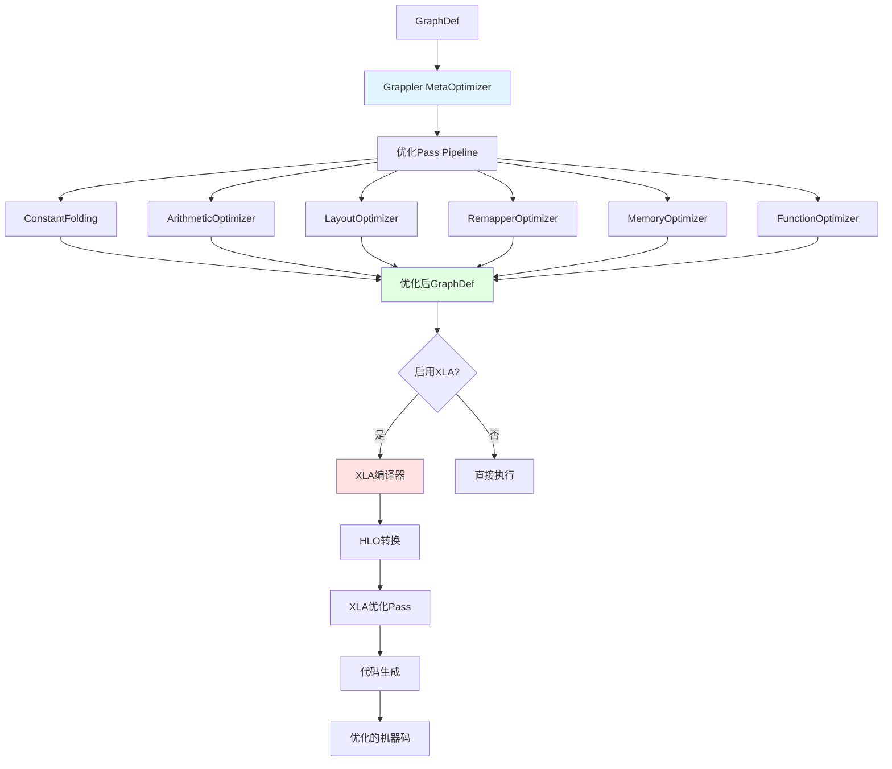
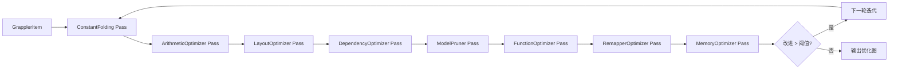
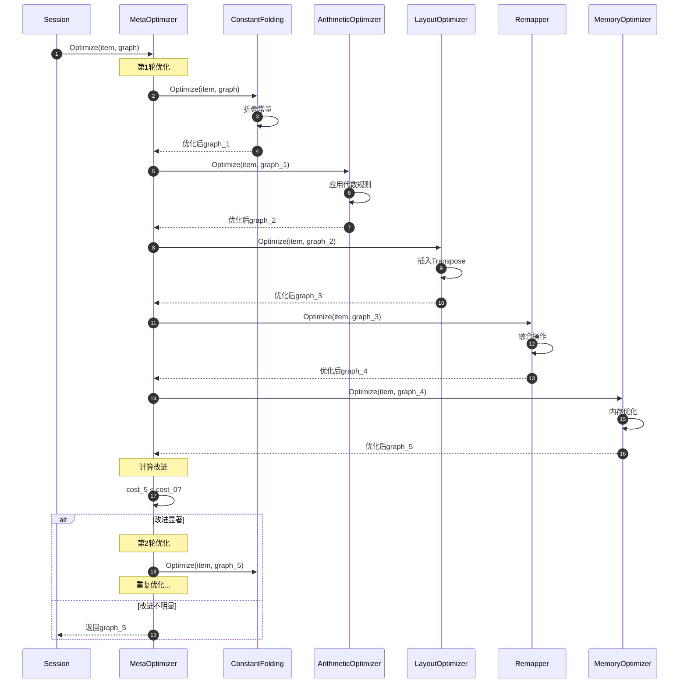
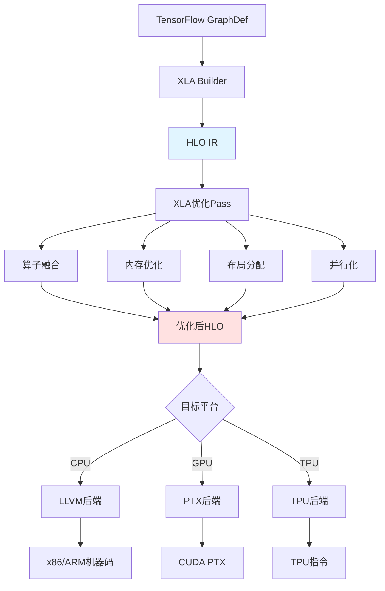

# TensorFlow 源码剖析 - Compiler 模块概览

## 模块职责

Compiler模块负责对TensorFlow计算图进行编译优化和代码生成，主要包括Grappler图优化器和XLA（Accelerated Linear Algebra）编译器。这些组件通过各种优化Pass显著提升模型训练和推理性能。

### 核心职责

1. **图优化**：Grappler执行多种图级优化（常量折叠、算子融合等）
2. **代码生成**：XLA将图编译为优化的机器码
3. **内存优化**：减少内存占用，启用内存复用
4. **性能提升**：通过多种优化技术加速执行
5. **自动调优**：根据硬件特性自动选择最优实现
6. **跨平台**：支持CPU、GPU、TPU等多种后端

### 输入与输出

**输入**：
- GraphDef：原始计算图
- GrapplerItem：包含图、feed/fetch信息
- ConfigProto：优化配置
- Cluster：硬件信息

**输出**：
- 优化后的GraphDef
- XLA编译后的可执行文件
- 性能分析报告

### 上下游依赖

**上游模块（调用者）**：
- Session：在Run前进行图优化
- DirectSession：调用Grappler优化
- DistributedRuntime：分布式执行前优化

**下游模块（被调用）**：
- Graph：读取和修改图结构
- OpRegistry：查询Op信息
- Device：获取硬件特性
- Runtime：执行优化后的图

## 架构图

### Compiler模块整体架构



### Grappler优化流程



## Grappler优化器

### MetaOptimizer核心

**职责**：协调所有优化Pass的执行

```cpp
// tensorflow/core/grappler/optimizers/meta_optimizer.h
class MetaOptimizer {
 public:
  explicit MetaOptimizer(DeviceBase* cpu_device, const ConfigProto& cfg);
  
  // 优化GrapplerItem
  Status Optimize(Cluster* cluster,
                 const GrapplerItem& item,
                 GraphDef* optimized_graph);
  
  // 优化并消费item（移动语义）
  Status OptimizeConsumeItem(Cluster* cluster,
                            GrapplerItem&& item,
                            GraphDef* optimized_graph);
  
  // 设置截止时间
  void set_deadline_usec(uint64 deadline_usec);
  
 private:
  // 初始化优化器列表
  Status InitializeOptimizers(std::vector<std::unique_ptr<GraphOptimizer>>* optimizers);
  
  // 运行优化器
  Status RunOptimizer(GraphOptimizer* optimizer,
                     Cluster* cluster,
                     GrapplerItem* item,
                     GraphDef* optimized_graph,
                     GraphOptimizationResult* optimization_result);
  
  // 配置
  DeviceBase* cpu_device_;
  ConfigProto config_proto_;
  RewriterConfig rewriter_config_;
  int num_iterations_;
};
```

### GrapplerItem数据结构

```cpp
// tensorflow/core/grappler/grappler_item.h
struct GrapplerItem {
  string id;  // 唯一标识符
  
  // 核心数据
  GraphDef graph;  // 计算图
  std::vector<std::pair<string, Tensor>> feed;  // 输入feed
  std::vector<string> fetch;  // 输出fetch
  
  // 初始化
  std::vector<string> init_ops;
  int64_t expected_init_time = 0;
  
  // 保存/恢复
  string save_op;
  string restore_op;
  string save_restore_loc_tensor;
  
  // 队列runner
  std::vector<QueueRunnerDef> queue_runners;
  
  // 需要保留的op
  std::vector<string> keep_ops;
  
  // 优化选项
  struct OptimizationOptions {
    bool allow_non_differentiable_rewrites = true;
    bool allow_pruning_stateful_and_dataset_ops = true;
    bool optimize_function_library = true;
    int intra_op_parallelism_threads = 0;
  } optimization_options_;
  
  // 设备列表
  std::unordered_set<string> devices_;
  
  // 获取需要保留的节点集合
  std::unordered_set<string> NodesToPreserve() const;
  
  // 获取主要Op的扇入
  std::vector<const NodeDef*> MainOpsFanin() const;
};
```

## 优化Pass详解

### 1. ConstantFolding（常量折叠）

**功能**：在编译期计算常量表达式，减少运行时计算

```cpp
// 示例优化
// 优化前
Const_a (value=2)
Const_b (value=3)
Add(Const_a, Const_b) -> output

// 优化后
Const_result (value=5) -> output
```

**实现核心**：

```cpp
class ConstantFolding : public GraphOptimizer {
 public:
  string name() const override { return "constant_folding"; }
  
  Status Optimize(Cluster* cluster,
                 const GrapplerItem& item,
                 GraphDef* optimized_graph) override {
    *optimized_graph = item.graph;
    
    // 查找可以折叠的节点
    std::unordered_set<string> nodes_to_fold;
    for (const NodeDef& node : optimized_graph->node()) {
      if (IsFoldable(node)) {
        nodes_to_fold.insert(node.name());
      }
    }
    
    // 执行折叠
    for (const string& node_name : nodes_to_fold) {
      NodeDef* node = FindNode(node_name, optimized_graph);
      
      // 计算常量值
      Tensor constant_value;
      TF_RETURN_IF_ERROR(EvaluateNode(*node, feed_dict, &constant_value));
      
      // 替换为Const节点
      ReplaceWithConstNode(*node, constant_value);
    }
    
    return Status::OK();
  }
  
 private:
  // 判断节点是否可折叠
  bool IsFoldable(const NodeDef& node) {
    // 所有输入都是常量
    // 无副作用
    // 不依赖设备状态
    return IsConstant(node) && !HasSideEffects(node);
  }
};
```

### 2. ArithmeticOptimizer（算术优化）

**功能**：应用代数简化规则

```cpp
// 优化规则示例
x + 0 → x
x * 1 → x
x * 0 → 0
x - x → 0
log(exp(x)) → x
exp(log(x)) → x
```

**实现核心**：

```cpp
class ArithmeticOptimizer : public GraphOptimizer {
 public:
  Status Optimize(Cluster* cluster,
                 const GrapplerItem& item,
                 GraphDef* optimized_graph) override {
    *optimized_graph = item.graph;
    
    // 注册优化阶段
    GraphOptimizerStagePipeline<string> pipeline;
    pipeline.AddStage<RemoveIdentityStage>();
    pipeline.AddStage<RemoveRedundantReshapeStage>();
    pipeline.AddStage<SimplifyAggregationStage>();
    pipeline.AddStage<HoistCommonFactorStage>();
    pipeline.AddStage<RemoveNegationStage>();
    pipeline.AddStage<MinimizeBroadcastsStage>();
    
    // 迭代优化
    bool changed = true;
    int iteration = 0;
    while (changed && iteration < max_iterations) {
      changed = false;
      
      for (NodeDef& node : *optimized_graph->mutable_node()) {
        string simplified_name;
        if (pipeline.PassThroughAllStages(&node, &simplified_name)) {
          changed = true;
        }
      }
      
      iteration++;
    }
    
    return Status::OK();
  }
};

// 示例：移除恒等操作
class RemoveIdentityStage : public GraphOptimizerStage<string> {
 public:
  Status TrySimplify(NodeDef* node, string* result) override {
    // x + 0 → x
    if (node->op() == "Add" && IsConstantZero(node->input(1))) {
      *result = node->input(0);
      return ReplaceNode(node, node->input(0));
    }
    
    // x * 1 → x
    if (node->op() == "Mul" && IsConstantOne(node->input(1))) {
      *result = node->input(0);
      return ReplaceNode(node, node->input(0));
    }
    
    return Status::OK();
  }
};
```

### 3. LayoutOptimizer（布局优化）

**功能**：自动在NHWC和NCHW之间转换，选择最优数据布局

```cpp
// NHWC: [batch, height, width, channels]  - CPU友好
// NCHW: [batch, channels, height, width]  - GPU友好

// 优化示例
// GPU执行：自动插入Transpose转为NCHW
Input (NHWC)
  ↓
Transpose (NHWC → NCHW)
  ↓
Conv2D (NCHW)  // GPU上更快
  ↓
Transpose (NCHW → NHWC)
  ↓
Output (NHWC)
```

**实现核心**：

```cpp
class LayoutOptimizer : public GraphOptimizer {
 public:
  Status Optimize(Cluster* cluster,
                 const GrapplerItem& item,
                 GraphDef* optimized_graph) override {
    *optimized_graph = item.graph;
    
    // 确定每个节点的最优布局
    std::unordered_map<string, string> optimal_layouts;
    for (const NodeDef& node : optimized_graph->node()) {
      if (IsConv2D(node) || IsPooling(node)) {
        // 检查设备类型
        if (IsGPU(node.device())) {
          optimal_layouts[node.name()] = "NCHW";  // GPU偏好
        } else {
          optimal_layouts[node.name()] = "NHWC";  // CPU偏好
        }
      }
    }
    
    // 插入Transpose节点
    for (auto& [node_name, target_layout] : optimal_layouts) {
      NodeDef* node = FindNode(node_name, optimized_graph);
      string current_layout = GetDataFormat(*node);
      
      if (current_layout != target_layout) {
        InsertTranspose(node, current_layout, target_layout);
      }
    }
    
    return Status::OK();
  }
};
```

### 4. RemapperOptimizer（算子融合）

**功能**：将多个操作融合为单个高效操作

```cpp
// 融合模式
Conv2D + BiasAdd + Relu → FusedConv2D
MatMul + BiasAdd → FusedMatMul
BatchNorm + Relu → FusedBatchNorm

// 优化前（3个kernel启动）
x = Conv2D(input, filter)
y = BiasAdd(x, bias)
z = Relu(y)

// 优化后（1个kernel启动）
z = FusedConv2D(input, filter, bias, activation='relu')
```

**实现核心**：

```cpp
class Remapper : public GraphOptimizer {
 public:
  Status Optimize(Cluster* cluster,
                 const GrapplerItem& item,
                 GraphDef* optimized_graph) override {
    *optimized_graph = item.graph;
    
    // 检测融合模式
    RemapperContext ctx;
    std::vector<FusionPattern> patterns;
    
    // 注册融合模式
    patterns.push_back(Conv2DWithBiasAndActivation());
    patterns.push_back(MatMulWithBiasAndActivation());
    patterns.push_back(BatchNormWithActivation());
    
    // 应用融合
    for (const FusionPattern& pattern : patterns) {
      std::vector<Match> matches = pattern.FindMatches(*optimized_graph);
      
      for (const Match& match : matches) {
        // 创建融合节点
        NodeDef fused_node;
        pattern.CreateFusedNode(match, &fused_node);
        
        // 替换原节点
        ReplaceSubgraph(match.nodes, fused_node, optimized_graph);
      }
    }
    
    return Status::OK();
  }
};

// Conv2D + BiasAdd + Relu融合模式
class Conv2DWithBiasAndActivation : public FusionPattern {
 public:
  std::vector<Match> FindMatches(const GraphDef& graph) override {
    std::vector<Match> matches;
    
    for (const NodeDef& node : graph.node()) {
      // 查找Relu节点
      if (node.op() == "Relu") {
        const NodeDef* bias_add = GetInputNode(node, 0, graph);
        
        // 检查是否是BiasAdd
        if (bias_add && bias_add->op() == "BiasAdd") {
          const NodeDef* conv2d = GetInputNode(*bias_add, 0, graph);
          
          // 检查是否是Conv2D
          if (conv2d && conv2d->op() == "Conv2D") {
            // 找到匹配模式
            Match match;
            match.nodes = {conv2d, bias_add, &node};
            matches.push_back(match);
          }
        }
      }
    }
    
    return matches;
  }
  
  void CreateFusedNode(const Match& match, NodeDef* fused_node) override {
    const NodeDef* conv2d = match.nodes[0];
    const NodeDef* bias_add = match.nodes[1];
    const NodeDef* relu = match.nodes[2];
    
    // 创建_FusedConv2D节点
    fused_node->set_op("_FusedConv2D");
    fused_node->set_name(relu->name());
    
    // 设置输入
    fused_node->add_input(conv2d->input(0));  // input
    fused_node->add_input(conv2d->input(1));  // filter
    fused_node->add_input(bias_add->input(1));  // bias
    
    // 设置属性
    SetAttrValue(conv2d->attr().at("strides"), 
                 (*fused_node->mutable_attr())["strides"]);
    SetAttrValue(conv2d->attr().at("padding"),
                 (*fused_node->mutable_attr())["padding"]);
    
    // 设置融合操作
    std::vector<string> fused_ops = {"BiasAdd", "Relu"};
    SetAttrValue(fused_ops, (*fused_node->mutable_attr())["fused_ops"]);
  }
};
```

### 5. MemoryOptimizer（内存优化）

**功能**：减少峰值内存占用

```cpp
// 优化技术
1. Recomputation（重计算）：丢弃中间结果，需要时重算
2. Swapping（交换）：将Tensor交换到CPU/磁盘
3. Memory reuse（内存复用）：复用已释放的内存
```

**实现核心**：

```cpp
class MemoryOptimizer : public GraphOptimizer {
 public:
  Status Optimize(Cluster* cluster,
                 const GrapplerItem& item,
                 GraphDef* optimized_graph) override {
    *optimized_graph = item.graph;
    
    // 分析内存使用
    MemoryUsageAnalysis analysis;
    TF_RETURN_IF_ERROR(analysis.Analyze(*optimized_graph));
    
    // 找出内存峰值
    std::vector<NodeDef*> peak_nodes = analysis.FindPeakMemoryNodes();
    
    // 应用优化策略
    for (NodeDef* node : peak_nodes) {
      if (CanRecompute(node)) {
        // 策略1：重计算
        ApplyRecomputation(node, optimized_graph);
      } else if (CanSwap(node)) {
        // 策略2：交换到CPU
        ApplySwapping(node, optimized_graph);
      }
    }
    
    return Status::OK();
  }
  
 private:
  // 应用重计算优化
  void ApplyRecomputation(NodeDef* node, GraphDef* graph) {
    // 在原节点后插入_Arg节点保存输出
    // 在需要时插入重计算节点
    
    NodeDef recompute_node = *node;
    recompute_node.set_name(node->name() + "/recompute");
    
    // 用重计算节点替换原节点的使用
    for (NodeDef& consumer : *graph->mutable_node()) {
      for (int i = 0; i < consumer.input_size(); ++i) {
        if (consumer.input(i) == node->name()) {
          consumer.set_input(i, recompute_node.name());
        }
      }
    }
    
    graph->add_node()->CopyFrom(recompute_node);
  }
};
```

### 6. FunctionOptimizer（函数优化）

**功能**：内联和优化tf.function

```cpp
class FunctionOptimizer : public GraphOptimizer {
 public:
  Status Optimize(Cluster* cluster,
                 const GrapplerItem& item,
                 GraphDef* optimized_graph) override {
    *optimized_graph = item.graph;
    
    // 遍历所有函数调用
    for (NodeDef& node : *optimized_graph->mutable_node()) {
      if (IsPartitionedCall(node)) {
        // 决定是否内联
        if (ShouldInline(node)) {
          TF_RETURN_IF_ERROR(InlineFunction(node, optimized_graph));
        }
      }
    }
    
    // 优化函数库中的函数
    if (item.optimization_options_.optimize_function_library) {
      FunctionLibraryDefinition* flib = optimized_graph->mutable_library();
      
      for (FunctionDef& func : *flib->mutable_function()) {
        TF_RETURN_IF_ERROR(OptimizeFunctionBody(&func));
      }
    }
    
    return Status::OK();
  }
  
 private:
  // 内联函数
  Status InlineFunction(const NodeDef& node, GraphDef* graph) {
    // 获取函数定义
    const FunctionDef& func = GetFunctionDef(node);
    
    // 实例化函数体
    GraphDef function_body;
    TF_RETURN_IF_ERROR(InstantiateFunctionBody(func, node, &function_body));
    
    // 替换函数调用
    ReplaceFunctionCall(node, function_body, graph);
    
    return Status::OK();
  }
  
  // 判断是否应该内联
  bool ShouldInline(const NodeDef& node) {
    // 小函数：直接内联
    // 大函数：如果只调用一次，内联
    // 非常大的函数：不内联
    
    int function_size = GetFunctionSize(node);
    int num_calls = GetNumCalls(node);
    
    return (function_size < 10) ||
           (function_size < 100 && num_calls == 1);
  }
};
```

## Grappler执行时序图



## XLA编译器

### XLA架构



### HLO（High-Level Operations）

**核心数据结构**：

```cpp
// XLA的中间表示
class HloInstruction {
 public:
  // Op类型
  HloOpcode opcode() const;
  
  // 输入操作数
  const std::vector<HloInstruction*>& operands() const;
  
  // 输出形状
  const Shape& shape() const;
  
  // 属性
  const HloComputation* parent() const;
  string name() const;
  
  // 融合相关
  bool IsFusible() const;
  bool IsFused() const;
  HloInstruction* FusedParameter(int64 index) const;
};

// HLO计算（类似于TensorFlow的FunctionDef）
class HloComputation {
 public:
  // 获取所有指令
  const std::vector<std::unique_ptr<HloInstruction>>& instructions() const;
  
  // 根指令（输出）
  HloInstruction* root_instruction() const;
  
  // 参数指令
  const std::vector<HloInstruction*>& parameter_instructions() const;
};

// HLO模块（完整程序）
class HloModule {
 public:
  // 入口计算
  HloComputation* entry_computation() const;
  
  // 所有计算（包括子函数）
  const std::vector<std::unique_ptr<HloComputation>>& computations() const;
  
  // 配置
  const HloModuleConfig& config() const;
};
```

### XLA编译流程

```cpp
// tensorflow/compiler/jit/xla_compile_on_demand_op.cc
class XlaCompileOnDemandOp : public OpKernel {
 public:
  void Compute(OpKernelContext* ctx) override {
    // 1. 构建XLA计算
    xla::XlaBuilder builder("computation");
    
    // 2. 转换TensorFlow Op到XLA HLO
    xla::XlaOp input = xla::Parameter(&builder, 0, input_shape, "input");
    xla::XlaOp output = BuildXlaComputation(input, &builder);
    
    // 3. 编译
    xla::XlaComputation computation = builder.Build().ValueOrDie();
    
    xla::LocalClient* client = xla::ClientLibrary::LocalClientOrDie();
    
    std::vector<xla::LocalExecutable*> executables = 
        client->Compile(computation, {&input_shape}, xla::ExecutableBuildOptions())
              .ValueOrDie();
    
    // 4. 执行
    xla::ScopedShapedBuffer result = 
        executables[0]->Run({input_literal}, xla::ExecutableRunOptions())
                      .ConsumeValueOrDie();
    
    // 5. 转换结果回TensorFlow
    ConvertXlaResultToTensor(result, ctx->output(0));
  }
};
```

### XLA优化示例

**算子融合**：

```python
# 原始代码
x = tf.matmul(a, b)
y = tf.nn.bias_add(x, bias)
z = tf.nn.relu(y)

# XLA编译后（伪代码）
# 融合为单个HLO指令
z = hlo.fusion(
    kind=kCustom,
    operands=[a, b, bias],
    fused_computation=lambda a, b, bias: relu(bias_add(matmul(a, b), bias))
)
```

**内存优化**：

```
# XLA自动进行内存复用
# 中间Tensor x和y的内存可以复用

原始内存布局：
a: [1000, 1000] - 4MB
b: [1000, 1000] - 4MB
x: [1000, 1000] - 4MB  ← 中间结果
y: [1000, 1000] - 4MB  ← 中间结果
z: [1000, 1000] - 4MB
总计: 20MB

XLA优化后：
a: [1000, 1000] - 4MB
b: [1000, 1000] - 4MB
temp: [1000, 1000] - 4MB  ← x和y复用同一块内存
z: [1000, 1000] - 4MB
总计: 16MB
```

## 性能优化效果

### Grappler优化效果

| 优化Pass | 典型加速 | 主要场景 |
|---------|---------|---------|
| ConstantFolding | 5-10% | 有常量计算的模型 |
| ArithmeticOptimizer | 3-8% | 复杂数学表达式 |
| LayoutOptimizer | 10-30% | GPU上的Conv/Pool |
| RemapperOptimizer | 15-25% | CNN模型 |
| MemoryOptimizer | 20-50% | 大模型（内存节省） |
| FunctionOptimizer | 5-15% | 使用tf.function的模型 |

### XLA编译效果

| 模型类型 | 加速比 | 内存节省 |
|---------|-------|---------|
| ResNet-50 | 1.3-1.8x | 10-20% |
| BERT | 1.5-2.5x | 15-30% |
| Transformer | 1.8-2.8x | 20-35% |
| RNN/LSTM | 1.2-1.5x | 5-15% |

## 使用示例

### 启用Grappler优化

```python
import tensorflow as tf

# 方法1：通过ConfigProto
config = tf.compat.v1.ConfigProto()
config.graph_options.rewrite_options.constant_folding = (
    tf.compat.v1.rewriter_config_pb2.RewriterConfig.ON
)
config.graph_options.rewrite_options.arithmetic_optimization = (
    tf.compat.v1.rewriter_config_pb2.RewriterConfig.ON
)
config.graph_options.rewrite_options.layout_optimizer = (
    tf.compat.v1.rewriter_config_pb2.RewriterConfig.ON
)

sess = tf.compat.v1.Session(config=config)

# 方法2：TF2.x（默认启用）
# Grappler在tf.function中自动运行
@tf.function
def model(x):
    return tf.nn.relu(tf.matmul(x, w) + b)
```

### 启用XLA编译

```python
# 方法1：全局启用
tf.config.optimizer.set_jit(True)

# 方法2：函数级启用
@tf.function(jit_compile=True)
def optimized_function(x):
    return tf.nn.relu(tf.matmul(x, w) + b)

# 方法3：手动标记XLA cluster
with tf.xla.experimental.jit_scope():
    result = model(input_data)

# 方法4：Keras模型编译时启用
model.compile(
    optimizer='adam',
    loss='sparse_categorical_crossentropy',
    jit_compile=True  # TF 2.4+
)
```

### 配置优化选项

```python
from tensorflow.core.protobuf import rewriter_config_pb2

config = tf.compat.v1.ConfigProto()
rewrite_options = config.graph_options.rewrite_options

# 设置优化级别
rewrite_options.meta_optimizer_iterations = (
    rewriter_config_pb2.RewriterConfig.TWO
)

# 启用/禁用特定优化
rewrite_options.constant_folding = rewriter_config_pb2.RewriterConfig.ON
rewrite_options.arithmetic_optimization = rewriter_config_pb2.RewriterConfig.ON
rewrite_options.remapping = rewriter_config_pb2.RewriterConfig.ON
rewrite_options.memory_optimization = rewriter_config_pb2.RewriterConfig.MANUAL

# 禁用特定优化（调试用）
rewrite_options.disable_meta_optimizer = False
```

## 调试和分析

### 查看优化后的图

```python
import tensorflow as tf
from tensorflow.python.framework import graph_util

@tf.function
def my_function(x):
    return tf.nn.relu(x + 1)

# 获取优化后的GraphDef
concrete_func = my_function.get_concrete_function(
    tf.TensorSpec(shape=[None, 10], dtype=tf.float32)
)

# 保存优化前的图
tf.io.write_graph(
    concrete_func.graph.as_graph_def(),
    '/tmp',
    'before_optimization.pbtxt'
)

# TensorFlow会自动应用Grappler优化
# 优化后的图在实际执行时使用
```

### XLA调试

```python
# 设置环境变量启用XLA日志
import os
os.environ['XLA_FLAGS'] = '--xla_dump_to=/tmp/xla_dumps'
os.environ['TF_XLA_FLAGS'] = '--tf_xla_auto_jit=2'

# 启用详细日志
tf.debugging.set_log_device_placement(True)

@tf.function(jit_compile=True)
def xla_function(x):
    return tf.nn.relu(tf.matmul(x, w) + b)

# 运行后检查/tmp/xla_dumps/目录
# 包含HLO IR和优化过程
```

## 总结

Compiler模块是TensorFlow性能优化的核心，关键特点：

1. **多层优化**：Grappler图级优化 + XLA编译器优化
2. **自动化**：大多数优化自动应用，无需手动干预
3. **可配置**：可灵活控制优化策略
4. **跨平台**：支持CPU、GPU、TPU等多种后端
5. **显著加速**：典型场景下20-100%性能提升

理解Compiler模块对于性能调优和高级优化至关重要。

**代码位置**：
```
tensorflow/core/grappler/          # Grappler优化器
tensorflow/compiler/xla/           # XLA编译器
tensorflow/compiler/jit/           # JIT编译
tensorflow/compiler/tf2xla/        # TF到XLA转换
```

