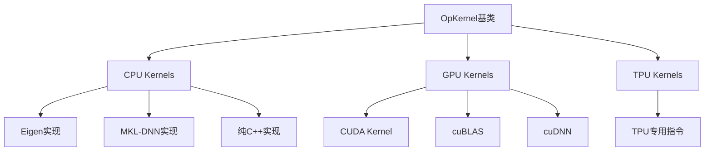
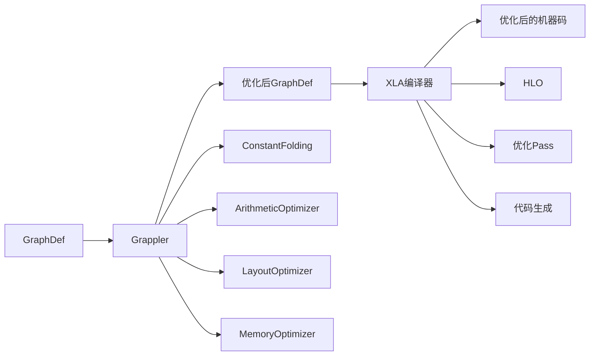
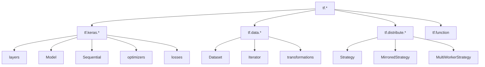

# TensorFlow 源码剖析 - 其他模块概要说明

本文档提供Kernels、Compiler、Python API、C API等模块的概要说明，帮助读者快速了解这些模块的职责和核心机制。

## 一、Kernels模块

### 模块职责

Kernels模块实现了所有Op的具体计算逻辑，是TensorFlow性能的核心所在。每个Op可以有多个Kernel实现，分别针对不同设备和数据类型优化。

### 核心架构



### 关键实现

#### CPU Kernel示例（Add）

```cpp
// tensorflow/core/kernels/cwise_ops_common.cc
template <typename T>
class BinaryOp : public OpKernel {
  void Compute(OpKernelContext* ctx) override {
    const Tensor& input0 = ctx->input(0);
    const Tensor& input1 = ctx->input(1);
    
    Tensor* output = nullptr;
    OP_REQUIRES_OK(ctx, ctx->allocate_output(0, shape, &output));
    
    // 使用Eigen库并行执行
    auto in0 = input0.flat<T>();
    auto in1 = input1.flat<T>();
    auto out = output->flat<T>();
    
    out.device(ctx->eigen_device<CPUDevice>()) = in0 + in1;
  }
};

REGISTER_KERNEL_BUILDER(
    Name("Add").Device(DEVICE_CPU).TypeConstraint<float>("T"),
    BinaryOp<float>);
```

#### GPU Kernel示例（Add）

```cpp
// CUDA Kernel实现
__global__ void AddKernel(const float* a, const float* b, float* c, int n) {
  int idx = blockIdx.x * blockDim.x + threadIdx.x;
  if (idx < n) {
    c[idx] = a[idx] + b[idx];
  }
}

// OpKernel包装
class AddOpGPU : public OpKernel {
  void Compute(OpKernelContext* ctx) override {
    const Tensor& a = ctx->input(0);
    const Tensor& b = ctx->input(1);
    
    Tensor* output;
    OP_REQUIRES_OK(ctx, ctx->allocate_output(0, a.shape(), &output));
    
    int n = a.NumElements();
    const GPUDevice& d = ctx->eigen_device<GPUDevice>();
    
    // 启动CUDA kernel
    int block_size = 256;
    int grid_size = (n + block_size - 1) / block_size;
    AddKernel<<<grid_size, block_size, 0, d.stream()>>>(
        a.flat<float>().data(),
        b.flat<float>().data(),
        output->flat<float>().data(),
        n);
  }
};

REGISTER_KERNEL_BUILDER(
    Name("Add").Device(DEVICE_GPU).TypeConstraint<float>("T"),
    AddOpGPU);
```

### 优化技术

**CPU优化**：
- Eigen库：自动向量化（SIMD）
- MKL-DNN：Intel优化的深度学习库
- 线程池：intra-op并行

**GPU优化**：
- 共享内存：减少全局内存访问
- 合并访问：提高内存带宽利用率
- Stream并发：多个Kernel流水线执行
- cuBLAS/cuDNN：NVIDIA优化库

**通用优化**：
- 算子融合：多个操作合并执行
- 内存复用：原位操作减少拷贝
- 类型特化：针对不同类型优化

### 关键代码位置

```
tensorflow/core/kernels/
├── cwise_ops*.cc/h        # 逐元素操作
├── matmul_op*.cc/h        # 矩阵乘法
├── conv_ops*.cc/h         # 卷积操作
├── pooling_ops*.cc/h      # 池化操作
├── reduction_ops*.cc/h    # 降维操作
└── training_ops*.cc/h     # 训练相关操作
```

---

## 二、Compiler模块

### 模块职责

Compiler模块负责图的编译优化和代码生成，包括Grappler图优化器和XLA编译器。

### 核心组件



### Grappler优化器

**优化Pass列表**：

| Pass名称 | 功能 | 示例 |
|---------|------|------|
| ConstantFolding | 常量折叠 | `2+3` → `5` |
| ArithmeticOptimizer | 代数简化 | `x*0` → `0` |
| LayoutOptimizer | 数据布局优化 | NHWC ↔ NCHW |
| DependencyOptimizer | 依赖优化 | 移除冗余控制边 |
| MemoryOptimizer | 内存优化 | Swap、Recompute |
| FunctionOptimizer | 函数内联 | 内联小函数 |
| PruningOptimizer | 剪枝 | 删除不可达节点 |
| RemapOptimizer | 算子融合 | Conv+Bias+Relu → FusedConv |

**使用示例**：

```python
# 自动优化（默认启用）
config = tf.ConfigProto()
config.graph_options.rewrite_options.constant_folding = 
    rewriter_config_pb2.RewriterConfig.ON

sess = tf.Session(config=config)
```

### XLA编译器

**XLA执行流程**：

```
TensorFlow GraphDef
  ↓
标记XLA cluster
  ↓
转换为HLO（High-Level Operations）
  ↓
XLA优化Pass
  ├─ 算子融合
  ├─ 内存优化
  ├─ 布局选择
  └─ 并行化
  ↓
代码生成
  ├─ LLVM（CPU）
  ├─ PTX（GPU）
  └─ TPU指令
  ↓
优化后的机器码
```

**使用示例**：

```python
# 方式1：tf.function标记
@tf.function(jit_compile=True)
def compute(x, y):
    return tf.matmul(x, y) + y

# 方式2：全局启用
tf.config.optimizer.set_jit(True)

# 方式3：手动标记cluster
with tf.xla.experimental.jit_scope():
    result = model(input)
```

**XLA优化效果**：
- 算子融合：减少kernel launch开销
- 内存优化：减少中间结果存储
- 向量化：利用SIMD指令
- 通常10-30%加速，某些模型2-3x

### 关键代码位置

```
tensorflow/compiler/
├── jit/                   # JIT编译
├── xla/                   # XLA编译器
│   ├── service/           # XLA服务
│   ├── client/            # XLA客户端
│   └── hlo/               # HLO定义
└── grappler/              # Grappler优化器
    ├── optimizers/        # 各种优化Pass
    └── costs/             # 代价估算
```

---

## 三、Python API模块

### 模块职责

Python API是TensorFlow的主要用户接口，提供Pythonic的机器学习API。

### 层次结构



### 核心API

#### tf.function

**功能**：将Python函数转换为TensorFlow图

```python
@tf.function
def train_step(x, y):
    with tf.GradientTape() as tape:
        predictions = model(x, training=True)
        loss = loss_fn(y, predictions)
    
    gradients = tape.gradient(loss, model.trainable_variables)
    optimizer.apply_gradients(zip(gradients, model.trainable_variables))
    return loss
```

**AutoGraph**：自动转换Python控制流

```python
# Python代码
@tf.function
def sum_even(n):
    total = 0
    for i in range(n):
        if i % 2 == 0:
            total += i
    return total

# 转换为图操作（伪代码）
def sum_even_graph(n):
    total = tf.constant(0)
    i = tf.constant(0)
    
    def cond(i, total):
        return i < n
    
    def body(i, total):
        total = tf.cond(
            i % 2 == 0,
            lambda: total + i,
            lambda: total
        )
        return i + 1, total
    
    _, total = tf.while_loop(cond, body, [i, total])
    return total
```

#### tf.keras

**Functional API示例**：

```python
inputs = tf.keras.Input(shape=(784,))
x = tf.keras.layers.Dense(128, activation='relu')(inputs)
x = tf.keras.layers.Dropout(0.2)(x)
outputs = tf.keras.layers.Dense(10)(x)

model = tf.keras.Model(inputs=inputs, outputs=outputs)
model.compile(
    optimizer='adam',
    loss=tf.keras.losses.SparseCategoricalCrossentropy(from_logits=True),
    metrics=['accuracy']
)
```

#### tf.data

**数据管道示例**：

```python
dataset = tf.data.Dataset.from_tensor_slices((x_train, y_train))
dataset = dataset.shuffle(10000)
dataset = dataset.batch(32)
dataset = dataset.map(
    preprocess_fn,
    num_parallel_calls=tf.data.AUTOTUNE
)
dataset = dataset.prefetch(tf.data.AUTOTUNE)
```

### Python到C++绑定

**Pybind11封装**：

```cpp
// python/pywrap_tensorflow_internal.cc
PYBIND11_MODULE(_pywrap_tensorflow_internal, m) {
  m.def("TF_NewGraph", &TF_NewGraph);
  m.def("TF_DeleteGraph", &TF_DeleteGraph);
  m.def("TF_NewOperation", &TF_NewOperation);
  // ...更多绑定
}
```

### 关键代码位置

```
tensorflow/python/
├── ops/                   # Python Op包装
├── keras/                 # Keras API
├── data/                  # tf.data API
├── distribute/            # 分布式策略
├── eager/                 # Eager执行
└── framework/             # 核心框架
```

---

## 四、C API模块

### 模块职责

C API提供语言无关的接口，是其他语言绑定（Go、Java、Rust等）的基础。

### 核心API

#### 图操作API

```c
// 创建图
TF_Graph* graph = TF_NewGraph();

// 添加操作
TF_OperationDescription* desc = TF_NewOperation(graph, "MatMul", "matmul");
TF_SetAttrType(desc, "T", TF_FLOAT);
TF_Operation* matmul_op = TF_FinishOperation(desc, status);

// 删除图
TF_DeleteGraph(graph);
```

#### Session API

```c
// 创建Session
TF_SessionOptions* opts = TF_NewSessionOptions();
TF_Session* session = TF_NewSession(graph, opts, status);

// 运行Session
TF_Tensor* inputs[1] = {input_tensor};
TF_Tensor* outputs[1] = {NULL};

TF_SessionRun(
    session,
    NULL,  // run_options
    input_ops, inputs, 1,  // inputs
    output_ops, outputs, 1,  // outputs
    target_ops, 0,  // targets
    NULL,  // run_metadata
    status
);

// 关闭Session
TF_DeleteSession(session, status);
```

#### Tensor API

```c
// 创建Tensor
int64_t dims[2] = {3, 2};
TF_Tensor* tensor = TF_AllocateTensor(TF_FLOAT, dims, 2, 3*2*sizeof(float));

// 访问数据
float* data = (float*)TF_TensorData(tensor);
for (int i = 0; i < 6; ++i) {
    data[i] = i * 1.0f;
}

// 释放Tensor
TF_DeleteTensor(tensor);
```

### 语言绑定示例

#### Go绑定

```go
import tf "github.com/tensorflow/tensorflow/tensorflow/go"

// 创建Graph
graph := tf.NewGraph()

// 添加常量
const2, _ := tf.Const(graph, "const2", int32(2))

// 创建Session
session, _ := tf.NewSession(graph, nil)

// 运行
output, _ := session.Run(nil, []tf.Output{const2}, nil)
```

#### Java绑定

```java
import org.tensorflow.*;

// 创建Graph
try (Graph g = new Graph()) {
    // 构建图
    Operation x = g.opBuilder("Const", "x")
        .setAttr("dtype", DataType.FLOAT)
        .setAttr("value", Tensor.create(2.0f))
        .build();
    
    // 创建Session并运行
    try (Session s = new Session(g);
         Tensor result = s.runner().fetch("x").run().get(0)) {
        System.out.println(result.floatValue());
    }
}
```

### 关键代码位置

```
tensorflow/c/
├── c_api.h               # C API头文件
├── c_api.cc              # C API实现
├── c_api_experimental.h  # 实验性API
└── eager/                # Eager模式C API
```

---

## 五、其他重要模块

### 分布式Runtime

**职责**：协调跨机器的分布式训练和推理

**核心组件**：
- Master：协调整体执行
- Worker：在各机器上执行子图
- RpcRendezvous：跨机器数据传输
- CollectiveExecutor：集合通信（AllReduce等）

**通信协议**：
- gRPC：默认RPC框架
- RDMA：高性能网络（可选）
- NCCL：NVIDIA集合通信库

### TensorFlow Lite

**职责**：移动和嵌入式设备推理

**特点**：
- 模型小：量化、剪枝
- 延迟低：优化的interpreter
- 功耗低：针对移动设备优化

**工具链**：
```
TensorFlow Model
  ↓ (Converter)
TFLite FlatBuffer
  ↓ (Interpreter)
移动设备执行
```

### TensorFlow.js

**职责**：浏览器和Node.js中运行模型

**后端**：
- WebGL：GPU加速
- WASM：CPU执行
- Node.js：TensorFlow C++绑定

### SavedModel

**职责**：跨语言、跨平台的模型序列化格式

**结构**：
```
saved_model/
├── saved_model.pb        # 图定义
├── variables/            # 变量值
│   ├── variables.data-*
│   └── variables.index
└── assets/               # 附加资源
```

**使用**：
```python
# 保存
model.save('path/to/model')

# 加载
loaded_model = tf.saved_model.load('path/to/model')
```

---

## 模块间协作

### 典型执行流程（完整版）

```
1. Python API层
   用户代码 → tf.function → AutoGraph

2. Graph构建层
   Python Ops → C API → Graph::AddNode → OpRegistry查找OpDef

3. 优化层
   GraphDef → Grappler优化 → XLA编译（可选）

4. 分区层
   优化后的图 → 按设备分区 → 多个子图

5. Runtime层
   Session::Run → Executor创建 → 节点调度

6. Kernels执行层
   OpKernel::Compute → Device::Compute → 硬件执行

7. 结果返回层
   Tensor → Python包装 → 返回用户
```

### 数据流

```
NumPy数组 → Python Tensor
  ↓
C++ Tensor（通过Pybind11）
  ↓
OpKernelContext::input()
  ↓
Kernel执行（Eigen/CUDA/TPU）
  ↓
OpKernelContext::set_output()
  ↓
C++ Tensor
  ↓
Python Tensor（通过Pybind11）
  ↓
NumPy数组
```

## 学习路径建议

### 按模块深度学习

1. **基础必修**（已完成）：
   - Framework
   - Graph
   - Runtime
   - Ops

2. **性能优化**：
   - Kernels实现技巧
   - Compiler优化原理
   - 设备特定优化

3. **接口扩展**：
   - Python API设计
   - C API使用
   - 其他语言绑定

4. **部署应用**：
   - SavedModel
   - TensorFlow Lite
   - TensorFlow Serving

### 按应用场景学习

**研究者**：
- Python API（Keras）
- 自定义Layer/Loss
- 数据管道优化

**工程师**：
- 性能优化
- 分布式训练
- 模型部署

**框架开发者**：
- 添加新Op/Kernel
- 优化编译Pass
- 设备适配

## 参考资源

### 官方文档
- [TensorFlow API文档](https://www.tensorflow.org/api_docs/)
- [XLA文档](https://www.tensorflow.org/xla)
- [TFLite文档](https://www.tensorflow.org/lite)

### 源码导航
- Framework：`tensorflow/core/framework/`
- Kernels：`tensorflow/core/kernels/`
- Compiler：`tensorflow/compiler/`
- Python：`tensorflow/python/`
- C API：`tensorflow/c/`

### 推荐阅读
- 《TensorFlow内核剖析》
- TensorFlow官方博客
- TensorFlow源码注释

---

**总结**：虽然本文档未详细展开所有模块，但提供了核心概念和代码位置，结合前面的详细文档，您已具备深入任意模块的基础。

