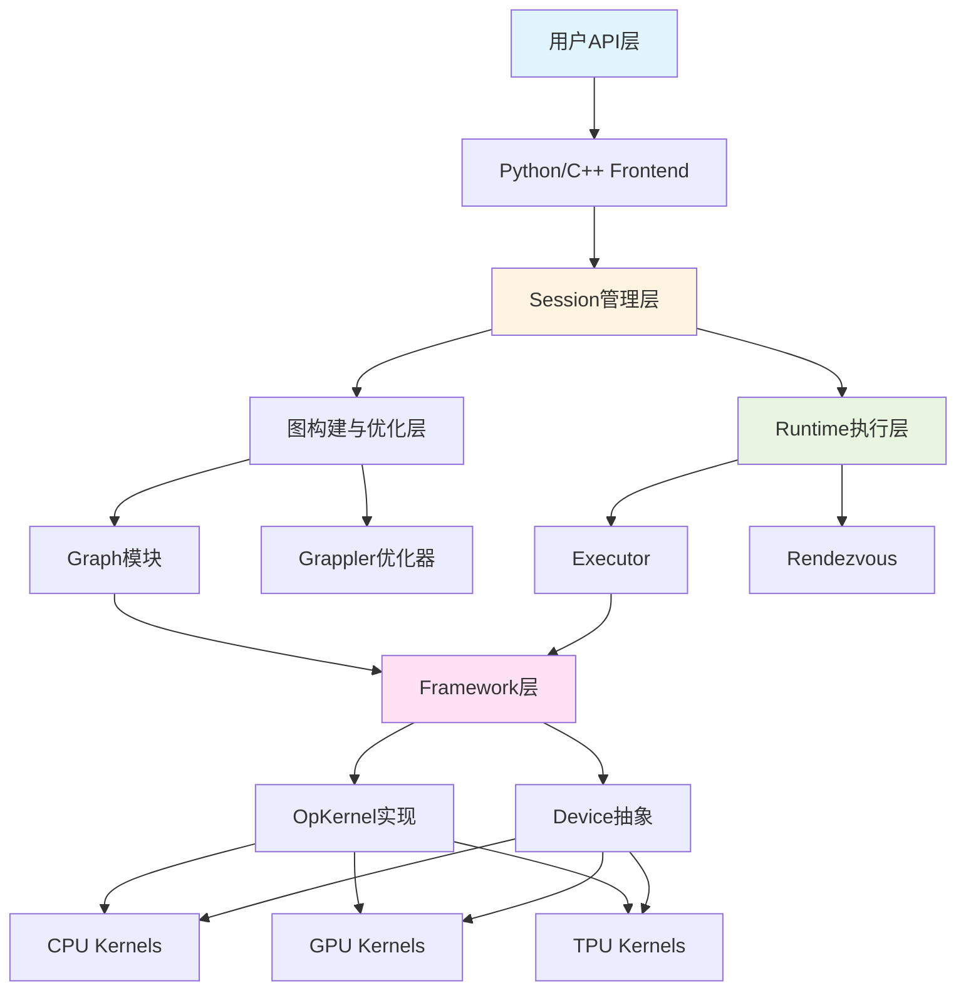

# TensorFlow 源码剖析 - 模块综合总结

本文档综合总结TensorFlow各核心模块的功能、交互关系和实现要点，帮助读者建立完整的系统视图。

## 一、模块架构总览

### 1.1 模块分层

TensorFlow采用清晰的分层架构，各模块职责明确：



### 1.2 模块清单与职责

| 模块 | 核心类 | 主要职责 | 对外接口 |
|------|--------|----------|----------|
| **Framework** | Tensor, OpKernel, Device, Allocator | 提供基础抽象和数据结构 | Tensor API, OpKernel注册宏 |
| **Graph** | Graph, Node, Edge | 表示和管理计算图 | AddNode(), AddEdge() |
| **Ops** | OpDef, OpRegistry | 定义操作的元数据 | REGISTER_OP宏 |
| **Kernels** | 各种OpKernel实现 | 操作的具体实现 | Kernel注册宏 |
| **Runtime** | Session, Executor, Rendezvous | 执行引擎和资源管理 | Session::Run() |
| **Compiler** | Grappler, XLA | 图优化和编译 | 优化Pass接口 |
| **Distributed** | Master, Worker, RpcRendezvous | 分布式协调和通信 | gRPC服务 |
| **Python API** | tf.* 模块 | 用户友好的高层接口 | Python函数和类 |
| **C API** | TF_* 函数 | 语言无关的C接口 | C函数 |

## 二、核心模块深入分析

### 2.1 Framework模块

**设计哲学**：类型安全 + 零拷贝 + 设备无关

#### 核心抽象

**Tensor**：
- 使用引用计数实现零拷贝共享
- TensorShape使用InlinedVector优化小维度
- 支持Slice等视图操作不拷贝数据

```cpp
// Tensor的引用计数机制
Tensor a = ...;
Tensor b = a;  // 浅拷贝，buffer_引用计数+1
// b修改不影响a（copy-on-write语义可选）
```

**OpKernel**：
- 提供Compute()纯虚函数，子类实现具体逻辑
- OpKernelConstruction在构造时提供属性访问
- OpKernelContext在执行时提供输入输出和设备服务

```cpp
class MyOp : public OpKernel {
  void Compute(OpKernelContext* ctx) override {
    const Tensor& input = ctx->input(0);
    Tensor* output = nullptr;
    OP_REQUIRES_OK(ctx, ctx->allocate_output(0, shape, &output));
    // 执行计算...
  }
};
```

**Device**：
- 抽象计算设备（CPU/GPU/TPU）
- 提供Compute()调用OpKernel
- 管理设备内存分配器

#### 关键机制

**类型系统**：
- DataType枚举定义所有支持的类型
- 编译期类型检查（模板）+ 运行期类型检查（OpDef）
- 支持类型参数化（如T=float）

**注册机制**：
- OpRegistry：全局操作注册表
- KernelRegistry：全局Kernel注册表
- 启动时自动注册（static initializer）

**内存管理**：
- BFCAllocator：Best-Fit with Coalescing算法
- 内存池：减少系统调用
- 对齐分配：满足SIMD和GPU要求

### 2.2 Graph模块

**设计哲学**：DAG表示 + 高效遍历 + 类型验证

#### 核心数据结构

**Graph**：
- 节点使用vector存储，按ID索引O(1)
- 边使用intrusive list，遍历O(degree)
- SOURCE/SINK哨兵简化边界处理

**Node**：
- 持有NodeProperties（OpDef + 类型信息）
- 入边和出边分别维护
- 轻量级，~200字节

**Edge**：
- 连接src和dst节点
- 数据边：src_output >= 0
- 控制边：src_output = kControlSlot (-1)

#### 关键算法

**图构建**：
```cpp
Graph g(ops);
Node* a = g.AddNode(node_def_a);  // O(1)
Node* b = g.AddNode(node_def_b);  // O(1)
g.AddEdge(a, 0, b, 0);  // O(1)
```

**子图提取（Pruning）**：
```cpp
// 从fetches反向BFS标记依赖节点
void PruneForTargets(Graph* g, vector<Node*> fetches) {
  unordered_set<Node*> visited;
  deque<Node*> queue(fetches.begin(), fetches.end());
  
  while (!queue.empty()) {
    Node* n = queue.front();
    queue.pop_front();
    if (visited.insert(n).second) {
      for (Edge* e : n->in_edges()) {
        queue.push_back(e->src());
      }
    }
  }
  
  // 删除未访问节点
  for (Node* n : g->nodes()) {
    if (!visited.count(n)) g->RemoveNode(n);
  }
}
```

**GraphDef转换**：
- FromGraphDef：解析Proto，创建Node和Edge
- ToGraphDef：遍历Graph，序列化为Proto

### 2.3 Runtime模块

**设计哲学**：异步数据流 + 自适应调度 + 错误快速传播

#### 核心组件

**Session**：
- 管理图的创建、优化和执行生命周期
- 为每组(feeds, fetches)缓存Executor
- 协调多设备执行

**Executor**：
- 图执行的核心引擎
- 维护节点的pending计数
- 管理ready队列和调度

**ExecutorState**：
- 单次执行的状态机
- 跟踪每个节点的执行状态
- 处理节点间的数据传播

#### 执行流程

```
1. Session::Run(feeds, fetches)
   ↓
2. GetOrCreateExecutors() - 查找或创建Executor
   ↓
3. Executor::RunAsync(args, done)
   ↓
4. ExecutorState::RunAsync()
   ├─ 初始化ready队列（root节点）
   └─ ScheduleReady()
      ↓
5. 循环执行：
   ├─ Process(node) - 执行单个节点
   │  ├─ Device::Compute(kernel, ctx)
   │  ├─ PropagateOutputs() - 传播输出
   │  └─ 更新后继pending计数
   ├─ NodeDone() - 检查是否完成
   └─ ScheduleReady() - 调度新ready节点
      ↓
6. 所有节点完成 → done回调(Status)
   ↓
7. Session提取fetches并返回
```

#### 调度策略

**成本分类**：
- Expensive操作（>10μs）：异步执行，利用线程池
- Inexpensive操作（<1μs）：内联执行，避免调度开销

**自适应**：
- 首次执行标记为expensive
- 记录历史执行时间
- 动态调整分类

**优化**：
- 批量调度减少锁竞争
- 内联执行更好的缓存局部性
- 原子操作管理pending计数

#### Rendezvous机制

**功能**：节点间数据交换的抽象

**语义**：
```cpp
// Send节点
rendezvous->Send(key, tensor, is_dead);

// Recv节点
rendezvous->RecvAsync(key, [](Status s, Tensor tensor) {
  // 回调处理接收到的tensor
});
```

**实现**：
- IntraProcessRendezvous：同进程内，内存表
- RpcRendezvous：跨进程，gRPC传输

**匹配规则**：
- key格式：`<src_device>;<src_tensor>:<dst_device>`
- Send和Recv通过key配对
- 支持Send先到达或Recv先到达

### 2.4 Ops与Kernels模块

**设计哲学**：接口与实现分离 + 多设备支持

#### Ops模块

**OpDef**：操作的元数据定义
```cpp
REGISTER_OP("MatMul")
    .Input("a: T")
    .Input("b: T")
    .Output("product: T")
    .Attr("T: {float, double, int32}")
    .Attr("transpose_a: bool = false")
    .Attr("transpose_b: bool = false")
    .SetShapeFn([](InferenceContext* c) {
      // 形状推断逻辑
      return Status::OK();
    });
```

**字段说明**：
- name：操作名称，全局唯一
- input_arg/output_arg：输入输出定义
- attr：属性定义（类型、形状等参数）
- 形状推断函数：计算输出形状

#### Kernels模块

**OpKernel实现**：
```cpp
// CPU实现
class MatMulOp : public OpKernel {
  void Compute(OpKernelContext* ctx) override {
    // 1. 获取输入
    const Tensor& a = ctx->input(0);
    const Tensor& b = ctx->input(1);
    
    // 2. 分配输出
    Tensor* output;
    OP_REQUIRES_OK(ctx, ctx->allocate_output(0, shape, &output));
    
    // 3. 执行计算（调用Eigen/BLAS）
    LaunchMatMul(a, b, output);
  }
};

// 注册到CPU
REGISTER_KERNEL_BUILDER(
    Name("MatMul").Device(DEVICE_CPU).TypeConstraint<float>("T"),
    MatMulOp);
```

**GPU实现**：
```cpp
// GPU Kernel（CUDA）
__global__ void MatMulKernel(const float* a, const float* b, 
                            float* c, int M, int N, int K) {
  int row = blockIdx.y * blockDim.y + threadIdx.y;
  int col = blockIdx.x * blockDim.x + threadIdx.x;
  
  if (row < M && col < N) {
    float sum = 0.0f;
    for (int k = 0; k < K; ++k) {
      sum += a[row * K + k] * b[k * N + col];
    }
    c[row * N + col] = sum;
  }
}

class MatMulOpGPU : public OpKernel {
  void Compute(OpKernelContext* ctx) override {
    // 获取GPU stream
    auto* stream = ctx->eigen_device<GPUDevice>().stream();
    
    // 启动GPU kernel
    LaunchMatMulKernel(stream, a, b, c, M, N, K);
  }
};

REGISTER_KERNEL_BUILDER(
    Name("MatMul").Device(DEVICE_GPU).TypeConstraint<float>("T"),
    MatMulOpGPU);
```

**多设备支持**：
- 同一Op可有多个Kernel实现
- 按设备类型和类型约束选择
- 运行时动态查找和绑定

### 2.5 Compiler模块

**设计哲学**：图级优化 + 算子融合 + 代码生成

#### Grappler优化器

**优化Pass**：
- ConstantFolding：编译期计算常量表达式
- ArithmeticOptimizer：代数简化（如x*0=0）
- LayoutOptimizer：选择最优数据布局
- DependencyOptimizer：消除冗余控制依赖
- MemoryOptimizer：优化内存分配和复用

**执行流程**：
```cpp
GraphDef optimized_graph;
MetaOptimizer optimizer;
optimizer.Optimize(session_config, graph_def, &optimized_graph);
// optimized_graph用于创建Executor
```

#### XLA编译器

**功能**：
- 将子图编译为优化的机器码
- 算子融合减少内存访问
- 针对特定硬件优化

**使用方式**：
```python
# 自动模式
@tf.function(jit_compile=True)
def computation(x, y):
    return tf.matmul(x, y) + y

# 手动标记
with tf.xla.experimental.jit_scope():
    result = model(input)
```

**优化效果**：
- 算子融合：减少kernel launch开销
- 内存复用：减少中间结果存储
- 向量化：利用SIMD指令
- 通常10-30%加速，某些场景2-3x

## 三、模块交互分析

### 3.1 典型执行路径

```
Python用户代码
  ↓
tf.matmul(a, b)  [Python Frontend]
  ↓
c_api.TF_OperationGetAttrType()  [C API]
  ↓
Graph::AddNode(node_def)  [Graph模块]
  ├─ OpRegistry::LookUp("MatMul")  [Framework模块]
  └─ 创建Node对象
  ↓
Session::Run(feeds, fetches)  [Runtime模块]
  ↓
DirectSession::GetOrCreateExecutors()
  ├─ Grappler优化  [Compiler模块]
  ├─ 图分区（按设备）
  └─ NewLocalExecutor(graph)
  ↓
Executor::RunAsync()  [Runtime模块]
  ↓
ExecutorState::Process(node)
  ├─ FindKernel("MatMul", DEVICE_GPU)  [Kernels模块]
  ├─ Device::Compute(kernel, ctx)  [Framework模块]
  └─ MatMulOpGPU::Compute(ctx)  [Kernels模块]
  ↓
返回结果Tensor
```

### 3.2 关键交互点

#### Graph → Framework

**交互**：Graph使用OpDef验证NodeDef

```cpp
// 添加节点时
Status Graph::AddNode(const NodeDef& node_def) {
  // 查找OpDef
  const OpDef* op_def;
  TF_RETURN_IF_ERROR(ops_.LookUp(node_def.op(), &op_def));
  
  // 验证属性
  TF_RETURN_IF_ERROR(ValidateNodeDef(node_def, *op_def));
  
  // 推断类型
  DataTypeVector inputs, outputs;
  TF_RETURN_IF_ERROR(
      InOutTypesForNode(node_def, *op_def, &inputs, &outputs));
  
  // 创建Node
  ...
}
```

#### Runtime → Graph

**交互**：Executor遍历Graph执行节点

```cpp
// Executor初始化时
void ExecutorImpl::Initialize(const Graph* graph) {
  // 拓扑排序
  GetReversePostOrder(*graph, &order);
  
  // 为每个节点创建NodeItem
  for (Node* n : order) {
    NodeItem* item = &nodes_[n->id()];
    item->node = n;
    
    // 计算依赖
    for (Edge* e : n->in_edges()) {
      item->pending_count++;
    }
  }
}
```

#### Runtime → Kernels

**交互**：Executor查找并调用Kernel

```cpp
// 执行节点时
void ExecutorState::Process(const NodeItem& item) {
  // 已在初始化时查找并缓存Kernel
  OpKernel* kernel = item.kernel;
  
  // 准备执行上下文
  OpKernelContext ctx(...);
  
  // 调用Kernel
  device_->Compute(kernel, &ctx);
}
```

#### Compiler → Graph

**交互**：Grappler修改Graph

```cpp
// Grappler优化Pass
Status ConstantFoldingPass::Optimize(GraphDef* graph_def) {
  // 识别可折叠的节点
  for (NodeDef& node : *graph_def->mutable_node()) {
    if (IsConstantFoldable(node)) {
      // 计算常量值
      Tensor result = EvaluateNode(node);
      
      // 替换为Const节点
      node.set_op("Const");
      node.mutable_attr()->erase("...");
      (*node.mutable_attr())["value"].set_tensor(result);
    }
  }
  return Status::OK();
}
```

### 3.3 数据流分析

#### Tensor的生命周期

```
1. 创建：
   OpKernelContext::allocate_output()
   └─> Allocator::AllocateRaw()
       └─> TensorBuffer创建，ref_count=1

2. 传播：
   ExecutorState::PropagateOutputs()
   └─> Tensor拷贝构造（浅拷贝）
       └─> TensorBuffer::Ref()，ref_count++

3. 使用：
   OpKernel::Compute()读取input tensors

4. 释放：
   Tensor析构
   └─> TensorBuffer::Unref()，ref_count--
       └─> 若ref_count==0，调用Allocator::DeallocateRaw()
```

#### 跨设备数据传输

```
GPU:0                    Rendezvous                GPU:1
  ↓                          |                        ↓
Send节点                     |                    Recv节点
  ↓                          |                        ↓
tensor在GPU:0                |                    等待接收
  ↓                          |                        ↓
Send(key, tensor)            |                        |
  ↓                          |                        |
  | -----------------> 存储到table[key]               |
                             |                        |
                             |        RecvAsync(key, callback)
                             |  <-------------------- |
                             |                        |
                查找table[key]                        |
                             |                        |
  拷贝GPU:0→GPU:1 -------> callback(tensor) -------> |
                             |                        ↓
                     删除table[key]              Recv节点继续执行
```

## 四、性能优化策略

### 4.1 图优化

**编译期优化**：
- 常量折叠：减少运行时计算
- 死代码消除：删除无用节点
- 公共子表达式消除：复用重复计算
- 算子融合：减少内存访问

**运行期优化**：
- 内存复用：输出原位修改输入
- 内存规划：预分配和复用缓冲区
- 流水线执行：计算与传输重叠

### 4.2 执行优化

**调度优化**：
- 自适应调度：根据成本选择内联或异步
- 批量调度：减少锁竞争
- 线程池管理：控制并发度

**内存优化**：
- BFC分配器：减少碎片
- Arena分配器：批量回收
- 引用计数：零拷贝共享

### 4.3 设备优化

**CPU**：
- Eigen库：SIMD向量化
- MKL-DNN：Intel优化
- 线程池：intra-op和inter-op并行

**GPU**：
- cuBLAS/cuDNN：NVIDIA优化库
- Stream流水线：异步执行
- 共享内存：减少全局内存访问

### 4.4 性能分析工具

**Profiler**：
```python
tf.profiler.experimental.start('logdir')
# 运行代码
tf.profiler.experimental.stop()
# 使用TensorBoard查看
```

**Timeline**：
```python
from tensorflow.python.client import timeline
run_metadata = tf.RunMetadata()
sess.run(ops, options=run_options, run_metadata=run_metadata)
trace = timeline.Timeline(step_stats=run_metadata.step_stats)
with open('timeline.json', 'w') as f:
    f.write(trace.generate_chrome_trace_format())
```

## 五、设计模式与最佳实践

### 5.1 设计模式

**工厂模式**：OpKernel创建
```cpp
OpKernelFactory::Create(OpKernelConstruction* context) {
  return new MyOpKernel(context);
}
```

**注册模式**：Op和Kernel注册
```cpp
REGISTER_OP("MyOp")...
REGISTER_KERNEL_BUILDER(...)
```

**策略模式**：不同设备的Kernel实现
```cpp
class MatMulCPU : public OpKernel {...}
class MatMulGPU : public OpKernel {...}
```

**观察者模式**：Rendezvous的Send/Recv
```cpp
rendezvous->RecvAsync(key, callback);  // 注册观察者
rendezvous->Send(key, tensor);  // 通知观察者
```

**状态模式**：ExecutorState管理执行状态
```cpp
enum NodeState { PENDING, READY, RUNNING, DONE };
```

### 5.2 开发最佳实践

**添加新Op**：
1. 定义OpDef（REGISTER_OP）
2. 实现OpKernel（CPU/GPU）
3. 注册Kernel（REGISTER_KERNEL_BUILDER）
4. 添加单元测试
5. 添加Python wrapper

**性能优化**：
1. 使用Profiler识别瓶颈
2. 启用XLA编译（适用时）
3. 使用混合精度训练
4. 优化数据管道（tf.data）
5. 调整batch size和并行度

**调试技巧**：
1. 启用VLOG查看详细日志
2. 使用tf.debugging.assert_*
3. 启用数值检查（check_numerics）
4. 使用run_functions_eagerly调试
5. 检查Timeline找到性能问题

## 六、总结与展望

### 6.1 核心设计原则

1. **分层抽象**：Framework→Graph→Runtime→Kernels层次清晰
2. **接口与实现分离**：Op定义与Kernel实现解耦
3. **设备无关**：Device抽象支持异构硬件
4. **异步数据流**：节点自动并行执行
5. **零拷贝优化**：引用计数和原位操作
6. **可扩展性**：注册机制支持添加新Op和设备

### 6.2 演进趋势

**Eager模式**：
- 命令式执行，即时返回结果
- 更好的调试体验
- 与NumPy更一致的接口

**tf.function**：
- 结合Eager和Graph优点
- AutoGraph自动转换Python控制流
- 保持性能同时提升易用性

**MLIR**：
- 统一的中间表示
- 更强大的编译优化
- 更好的多后端支持

**分布式训练**：
- ParameterServer策略
- AllReduce策略
- 混合策略

### 6.3 学习路径建议

1. **入门**：Python API → Keras高层API
2. **进阶**：tf.function → 自定义Layer/Model
3. **深入**：Graph构建 → Executor执行流程
4. **专家**：添加自定义Op → 性能优化 → 分布式训练

掌握这些核心模块的设计和交互，是深入理解和高效使用TensorFlow的关键。

