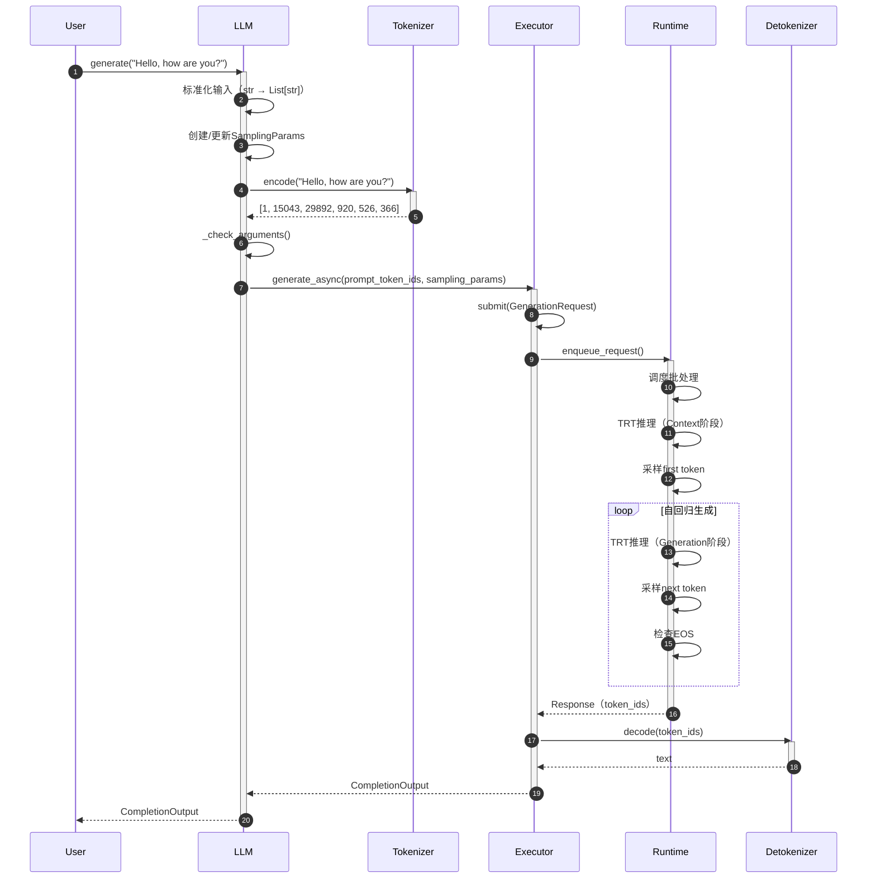
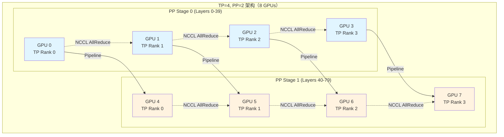
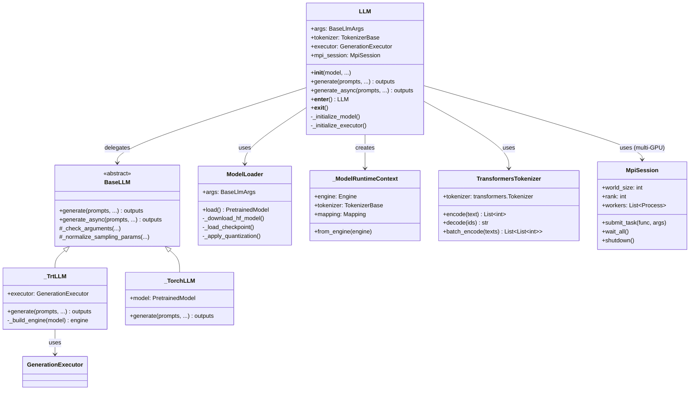
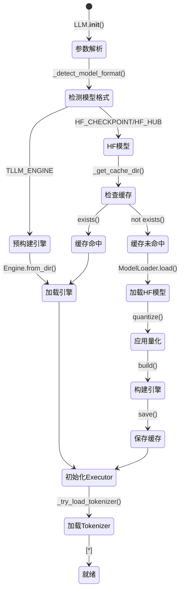

# TensorRT-LLM-01-LLMAPI模块-深度剖析

## 一、模块概览

### 1.1 模块定位

LLMAPI 模块是 TensorRT-LLM 的最高层用户接口，提供类似 HuggingFace Transformers 的简单易用API，屏蔽底层Builder、Runtime和Executor的复杂性。

**核心职责：**
- 统一接口：支持HF模型路径、本地路径、预构建引擎
- 自动构建：首次使用自动编译TensorRT引擎
- 缓存管理：引擎缓存和自动重用
- 后端抽象：支持TRT和PyTorch两种后端
- 生成管理：同步/异步/流式生成接口

### 1.2 模块架构

```
LLMAPI 模块架构：

tensorrt_llm/llmapi/
├── llm.py                         # 主接口
│   ├── LLM类                      # 统一入口
│   ├── BaseLLM（抽象）            # 基类
│   ├── _TrtLLM                    # TRT后端实现
│   └── _TorchLLM                  # PyTorch后端实现
│
├── llm_args.py                    # 参数定义
│   ├── BaseLlmArgs                # 基础参数
│   ├── TrtLlmArgs                 # TRT后端参数
│   └── TorchLlmArgs               # Torch后端参数
│
├── llm_utils.py                   # 工具类
│   ├── ModelLoader                # 模型加载器
│   ├── _ModelRuntimeContext       # 运行时上下文
│   ├── _build_engine()            # 引擎构建
│   └── _save_engine_for_runtime() # 引擎保存
│
├── tokenizer.py                   # Tokenizer封装
│   ├── TokenizerBase              # 抽象基类
│   └── TransformersTokenizer      # HF Tokenizer
│
└── mpi_session.py                 # MPI会话管理
    └── MpiSession                 # 多进程协调
```

### 1.3 核心数据流

```
用户输入 → LLM.generate() → Tokenize → Executor → TRT推理 → Detokenize → 输出文本
    ↓              ↓              ↓          ↓          ↓           ↓           ↓
  文本/IDs      统一接口      Token IDs   调度批处理   GPU推理   解码Token    完整文本
                   ↓
            首次调用：模型加载 → Builder → TRT引擎 → 缓存
            后续调用：加载缓存引擎
```

## 二、核心API详细剖析

### 2.1 LLM.__init__() 方法

#### 2.1.1 函数签名

```python
def __init__(
    self,
    model: str,                              # 模型路径或名称
    tokenizer: Optional[Union[str, TokenizerBase]] = None,
    *,
    # 构建配置
    build_config: Optional[BuildConfig] = None,
    # 运行时配置
    tensor_parallel_size: int = 1,
    pipeline_parallel_size: int = 1,
    max_batch_size: int = 256,
    max_num_tokens: int = None,
    # 量化配置
    quantization: Optional[str] = None,
    # 缓存配置
    skip_build_cache: bool = False,
    enable_build_cache: bool = True,
    # 高级配置
    enable_chunked_prefill: bool = False,
    enable_prefix_caching: bool = False,
    **kwargs
):
    """
    初始化LLM实例
    
    Args:
        model: HF模型名（如"meta-llama/Llama-3-8B"）、本地路径或TRT引擎路径
        tokenizer: Tokenizer路径或实例（默认与model相同）
        build_config: 引擎构建配置
        tensor_parallel_size: Tensor并行大小
        pipeline_parallel_size: Pipeline并行大小
        max_batch_size: 最大批次大小
        quantization: 量化类型（"fp8", "int4_awq", "int8_sq"等）
    """
```

#### 2.1.2 参数结构体详解

**BuildConfig**

| 字段 | 类型 | 默认值 | 说明 |
|-----|------|--------|------|
| max_input_len | int | 1024 | 最大输入长度 |
| max_seq_len | int | 2048 | 最大序列长度（输入+输出） |
| max_batch_size | int | 256 | 最大批次大小 |
| max_num_tokens | int | None | 最大Token数（Inflight Batching） |
| max_beam_width | int | 1 | 最大Beam宽度 |
| plugin_config | PluginConfig | auto | 插件配置 |
| gather_context_logits | bool | False | 是否收集Context阶段logits |
| gather_generation_logits | bool | False | 是否收集Generation阶段logits |
| use_refit | bool | False | 是否支持引擎Refit |
| weight_streaming | bool | False | 是否启用权重流式 |

**并行配置**

| 字段 | 类型 | 说明 |
|-----|------|------|
| tensor_parallel_size | int | Tensor并行度（TP），模型权重分片 |
| pipeline_parallel_size | int | Pipeline并行度（PP），层分片 |
| world_size | int | TP * PP，总GPU数 |

#### 2.1.3 核心代码实现

```python
def __init__(self, model, tokenizer=None, **kwargs):
    # 1. 参数解析和验证
    self.args = self._parse_args(model, tokenizer, **kwargs)
    
    # 2. 检测模型格式
    self._model_format = self._detect_model_format(model)
    # 可能的格式：
    # - HF_CHECKPOINT: HuggingFace模型
    # - HF_HUB: HuggingFace Hub模型名
    # - TLLM_ENGINE: 预构建TRT引擎
    # - TLLM_CHECKPOINT: TensorRT-LLM checkpoint
    
    # 3. 初始化MPI会话（多GPU场景）
    if self.args.parallel_config.world_size > 1:
        self.mpi_session = MpiSession(
            n_workers=self.args.parallel_config.world_size
        )
    else:
        self.mpi_session = None
    
    # 4. 加载或构建模型
    self._initialize_model()
    
    # 5. 初始化Executor
    self._initialize_executor()
    
    # 6. 加载Tokenizer
    self._tokenizer = self._try_load_tokenizer()
```

#### 2.1.4 _initialize_model() 详细流程

```python
def _initialize_model(self):
    """
    模型初始化：加载或构建引擎
    """
    # 1. 如果是预构建引擎，直接加载
    if self._model_format == _ModelFormatKind.TLLM_ENGINE:
        self._engine_dir = self.args.model
        self._engine = Engine.from_dir(self._engine_dir)
        return
    
    # 2. 检查缓存
    if self.args.enable_build_cache:
        cache_key = self._compute_cache_key()
        cache_dir = self._get_cache_dir(cache_key)
        
        if cache_dir.exists() and not self.args.skip_build_cache:
            # 缓存命中，直接加载
            self._engine_dir = cache_dir
            self._engine = Engine.from_dir(cache_dir)
            return
    
    # 3. 加载模型并构建引擎
    # 3.1 加载HF模型
    model_loader = ModelLoader(self.args)
    model = model_loader.load()
    
    # 3.2 构建TRT引擎
    self._engine = self._build_engine(model)
    
    # 3.3 保存到缓存
    if self.args.enable_build_cache:
        self._save_engine_to_cache(cache_dir)
        self._engine_dir = cache_dir

def _build_engine(self, model):
    """
    构建TRT引擎
    """
    from tensorrt_llm import build, BuildConfig
    
    # 1. 创建构建配置
    build_config = self.args.build_config or BuildConfig()
    
    # 2. 设置并行配置
    model.config.mapping = Mapping(
        world_size=self.args.parallel_config.world_size,
        tp_size=self.args.parallel_config.tp_size,
        pp_size=self.args.parallel_config.pp_size,
    )
    
    # 3. 调用Builder.build()
    engine = build(model, build_config)
    
    return engine
```

#### 2.1.5 调用链路

```
LLM.__init__()
  ├─→ _parse_args()                       # 参数解析
  ├─→ _detect_model_format()              # 检测模型格式
  ├─→ MpiSession() (if multi-GPU)         # 初始化MPI
  ├─→ _initialize_model()
  │     ├─→ _compute_cache_key()          # 计算缓存Key
  │     ├─→ _get_cache_dir()              # 获取缓存目录
  │     ├─→ Engine.from_dir() (缓存命中)
  │     └─→ _build_engine() (缓存未命中)
  │           ├─→ ModelLoader.load()      # 加载HF模型
  │           │     ├─→ from_pretrained()
  │           │     └─→ 应用量化
  │           ├─→ build(model, config)    # 构建引擎
  │           │     ├─→ Builder()
  │           │     ├─→ create_network()
  │           │     ├─→ optimize()
  │           │     └─→ build_engine()
  │           └─→ _save_engine_to_cache() # 保存缓存
  ├─→ _initialize_executor()
  │     └─→ GenerationExecutor.create()   # 创建Executor
  └─→ _try_load_tokenizer()
        └─→ TransformersTokenizer.from_pretrained()
```

### 2.2 LLM.generate() 方法

#### 2.2.1 函数签名

```python
def generate(
    self,
    prompts: Union[str, List[str]],          # 输入提示词
    *,
    sampling_params: Optional[SamplingParams] = None,
    # 生成参数（可选，会覆盖sampling_params中的对应字段）
    max_tokens: Optional[int] = None,
    temperature: float = 1.0,
    top_k: int = 0,
    top_p: float = 1.0,
    stop: Optional[List[str]] = None,
    # 其他参数
    streaming: bool = False,
    use_tqdm: bool = False,
) -> Union[CompletionOutput, List[CompletionOutput]]:
    """
    生成文本
    
    Args:
        prompts: 单个或批量提示词
        sampling_params: 采样配置
        max_tokens: 最大生成Token数
        temperature: 温度系数
        top_k/top_p: 采样参数
        stop: 停止词列表
        streaming: 是否流式返回
        
    Returns:
        CompletionOutput或列表，包含生成的文本、token_ids等
    """
```

#### 2.2.2 CompletionOutput结构体

| 字段 | 类型 | 说明 |
|-----|------|------|
| text | str | 生成的文本 |
| token_ids | List[int] | 生成的Token IDs |
| cumulative_logprob | float | 累积对数概率 |
| logprobs | LogProbsResult | Token级别的对数概率（可选） |
| finish_reason | str | 完成原因（"stop", "length", "eos_token"） |
| index | int | Beam索引（Beam Search时） |
| prompt_token_ids | List[int] | 输入Token IDs |

#### 2.2.3 核心代码实现

```python
def generate(self, prompts, sampling_params=None, **kwargs):
    # 1. 输入标准化
    unbatched = isinstance(prompts, str)
    if unbatched:
        prompts = [prompts]
    
    # 2. 创建或更新SamplingParams
    if sampling_params is None:
        sampling_params = SamplingParams()
    
    # 覆盖参数
    if kwargs.get('max_tokens') is not None:
        sampling_params.max_tokens = kwargs['max_tokens']
    if kwargs.get('temperature') is not None:
        sampling_params.temperature = kwargs['temperature']
    # ... 其他参数
    
    # 3. Tokenize
    prompt_token_ids_list = []
    for prompt in prompts:
        token_ids = self.tokenizer.encode(prompt)
        prompt_token_ids_list.append(token_ids)
    
    # 4. 参数校验
    for token_ids in prompt_token_ids_list:
        self._check_arguments(
            prompt_len=len(token_ids),
            query_len=0,
            sampling_params=sampling_params,
        )
    
    # 5. 调用Executor生成
    results = []
    for token_ids in prompt_token_ids_list:
        result = self.executor.generate_async(
            prompt_token_ids=token_ids,
            sampling_params=sampling_params,
            streaming=kwargs.get('streaming', False),
        )
        results.append(result)
    
    # 6. 等待完成
    outputs = []
    for result in results:
        if kwargs.get('streaming', False):
            # 流式：返回迭代器
            outputs.append(result)
        else:
            # 非流式：阻塞等待
            output = result.result()
            outputs.append(output)
    
    # 7. 返回结果
    if unbatched:
        return outputs[0]
    return outputs
```

#### 2.2.4 时序图



### 2.3 LLM.generate_async() 方法

#### 2.3.1 函数签名

```python
async def generate_async(
    self,
    prompts: Union[str, List[str]],
    sampling_params: Optional[SamplingParams] = None,
    **kwargs
) -> Union[CompletionOutput, List[CompletionOutput]]:
    """
    异步生成（支持async/await）
    
    Args:
        同generate()
        
    Returns:
        CompletionOutput或列表（协程）
    """
```

#### 2.3.2 核心实现

```python
async def generate_async(self, prompts, sampling_params=None, **kwargs):
    # 1-4步与generate()相同：输入标准化、Tokenize、校验
    # ...
    
    # 5. 异步调用Executor
    results = []
    for token_ids in prompt_token_ids_list:
        result = self.executor.generate_async(
            prompt_token_ids=token_ids,
            sampling_params=sampling_params,
            streaming=kwargs.get('streaming', False),
        )
        results.append(result)
    
    # 6. 异步等待完成
    outputs = []
    for result in results:
        if kwargs.get('streaming', False):
            # 流式：返回异步迭代器
            outputs.append(result)
        else:
            # 非流式：异步等待
            output = await result.aresult()
            outputs.append(output)
    
    return outputs
```

#### 2.3.3 使用示例

```python
import asyncio
from tensorrt_llm import LLM, SamplingParams

async def main():
    llm = LLM("meta-llama/Llama-3-8B")
    
    # 异步生成
    output = await llm.generate_async(
        "Hello, how are you?",
        sampling_params=SamplingParams(max_tokens=100),
    )
    print(output.text)

asyncio.run(main())
```

### 2.4 流式生成

#### 2.4.1 同步流式

```python
llm = LLM("meta-llama/Llama-3-8B")

# 流式生成
for output in llm.generate(
    "Tell me a story",
    max_tokens=200,
    streaming=True,
):
    # 每生成一个token调用一次
    print(output.text_diff, end='', flush=True)
```

#### 2.4.2 异步流式

```python
async def stream_generate():
    llm = LLM("meta-llama/Llama-3-8B")
    
    async for output in llm.generate_async(
        "Tell me a story",
        max_tokens=200,
        streaming=True,
    ):
        print(output.text_diff, end='', flush=True)

asyncio.run(stream_generate())
```

## 三、关键功能深度剖析

### 3.1 引擎缓存机制

#### 3.1.1 缓存Key计算

```python
def _compute_cache_key(self) -> str:
    """
    计算缓存Key（确保相同配置使用相同缓存）
    """
    # 1. 收集关键配置
    key_components = [
        self.args.model,                    # 模型路径
        self.args.build_config.max_input_len,
        self.args.build_config.max_seq_len,
        self.args.build_config.max_batch_size,
        self.args.parallel_config.tp_size,
        self.args.parallel_config.pp_size,
        self.args.quantization,
        # ... 其他影响引擎的参数
    ]
    
    # 2. 序列化并哈希
    key_str = json.dumps(key_components, sort_keys=True)
    cache_key = hashlib.sha256(key_str.encode()).hexdigest()
    
    return cache_key
```

#### 3.1.2 缓存目录结构

```
~/.cache/tensorrt_llm/
├── llama-3-8b-fp16-tp1-pp1-abc123def/
│   ├── config.json                    # 引擎配置
│   ├── rank0.engine                   # TRT引擎（Rank 0）
│   ├── rank1.engine                   # TRT引擎（Rank 1）
│   └── ...
├── llama-3-8b-fp8-tp2-pp1-def456abc/
│   └── ...
└── cache_metadata.json                # 缓存元数据
```

### 3.2 自动量化

#### 3.2.1 量化类型支持

| 量化类型 | 说明 | 精度 | 性能提升 |
|---------|------|------|---------|
| fp16 | 半精度浮点 | 基线 | 1x |
| bf16 | Brain Float16 | 基线 | 1x |
| fp8 | 8位浮点（需Hopper GPU） | ~FP16 | 1.5-2x |
| int8_sq | INT8平滑量化 | ~99% FP16 | 1.5-2x |
| int4_awq | INT4权重量化（AWQ） | ~95% FP16 | 2-3x |
| int4_gptq | INT4权重量化（GPTQ） | ~95% FP16 | 2-3x |

#### 3.2.2 量化使用

```python
# 方法1：初始化时指定
llm = LLM(
    "meta-llama/Llama-3-8B",
    quantization="fp8",  # 自动量化为FP8
)

# 方法2：BuildConfig指定
build_config = BuildConfig(
    quantization=QuantizationConfig(
        quant_algo=QuantAlgo.FP8,
        kv_cache_quant_algo=QuantAlgo.INT8,  # KV Cache量化
    )
)
llm = LLM("meta-llama/Llama-3-8B", build_config=build_config)
```

### 3.3 多GPU并行

#### 3.3.1 Tensor Parallel (TP)

```python
# TP=4: 模型权重分片到4个GPU
llm = LLM(
    "meta-llama/Llama-3-70B",
    tensor_parallel_size=4,
)

# 自动分配：
# GPU 0: heads 0-19, FFN部分0
# GPU 1: heads 20-39, FFN部分1
# GPU 2: heads 40-59, FFN部分2
# GPU 3: heads 60-79, FFN部分3
```

#### 3.3.2 Pipeline Parallel (PP)

```python
# PP=2: 模型层分片到2个GPU
llm = LLM(
    "meta-llama/Llama-3-70B",
    tensor_parallel_size=4,
    pipeline_parallel_size=2,
)

# 总共需要4*2=8个GPU
# GPU 0-3: Layers 0-39 (TP=4)
# GPU 4-7: Layers 40-79 (TP=4)
```

#### 3.3.3 并行架构图



## 四、数据结构UML图

### 4.1 LLMAPI核心类图



### 4.2 初始化流程状态图



## 五、使用示例

### 5.1 基础文本生成

```python
from tensorrt_llm import LLM

# 1. 初始化LLM
llm = LLM("meta-llama/Llama-3-8B")

# 2. 生成
output = llm.generate("Hello, how are you?")
print(output.text)

# 3. 批量生成
outputs = llm.generate([
    "Tell me a joke",
    "What is AI?",
    "Explain quantum computing",
])
for output in outputs:
    print(f"Output: {output.text}\n")
```

### 5.2 高级采样配置

```python
from tensorrt_llm import LLM, SamplingParams

llm = LLM("meta-llama/Llama-3-8B")

# Greedy解码
output = llm.generate(
    "Translate to French: Hello",
    sampling_params=SamplingParams(
        temperature=0.0,  # Greedy
        max_tokens=50,
    )
)

# Top-K Top-P采样
output = llm.generate(
    "Tell me a creative story",
    sampling_params=SamplingParams(
        temperature=0.8,
        top_k=50,
        top_p=0.95,
        max_tokens=200,
    )
)

# Beam Search
output = llm.generate(
    "Summarize: [long text]",
    sampling_params=SamplingParams(
        use_beam_search=True,
        best_of=4,
        max_tokens=100,
    )
)
```

### 5.3 多GPU推理

```python
# 8B模型单GPU
llm = LLM("meta-llama/Llama-3-8B")

# 70B模型TP=4
llm = LLM(
    "meta-llama/Llama-3-70B",
    tensor_parallel_size=4,
)

# 405B模型TP=8, PP=2
llm = LLM(
    "meta-llama/Llama-3.1-405B",
    tensor_parallel_size=8,
    pipeline_parallel_size=2,
)
```

### 5.4 量化推理

```python
# FP8量化（需H100/H200）
llm = LLM(
    "meta-llama/Llama-3-70B",
    quantization="fp8",
    tensor_parallel_size=4,
)

# INT4 AWQ量化
llm = LLM(
    "meta-llama/Llama-3-70B",
    quantization="int4_awq",
    tensor_parallel_size=2,
)
```

## 六、性能优化建议

### 6.1 构建时优化

```python
from tensorrt_llm import LLM, BuildConfig

llm = LLM(
    "meta-llama/Llama-3-8B",
    build_config=BuildConfig(
        max_batch_size=256,              # 更大批次
        max_num_tokens=8192,             # Inflight Batching
        enable_context_fmha=True,        # Flash Attention
        use_paged_context_fmha=True,     # Paged Attention
        plugin_config=PluginConfig(
            reduce_fusion=True,          # Reduce融合
        ),
    )
)
```

### 6.2 运行时优化

```python
# 批量请求
outputs = llm.generate(
    prompts=batch_prompts,  # 列表，而非逐个调用
    max_tokens=100,
)

# 预热（首次调用会触发CUDA Graph捕获等）
_ = llm.generate("warmup", max_tokens=10)

# 后续调用性能提升
output = llm.generate(prompt, max_tokens=100)
```

## 七、常见问题

**Q1：首次调用为什么很慢？**
- 需要下载模型、构建引擎、编译CUDA代码
- 解决：启用缓存，后续调用直接加载

**Q2：如何指定缓存目录？**
```python
import os
os.environ['TLLM_CACHE_DIR'] = '/path/to/cache'
llm = LLM("meta-llama/Llama-3-8B")
```

**Q3：如何禁用缓存？**
```python
llm = LLM(
    "meta-llama/Llama-3-8B",
    enable_build_cache=False,
)
```

**Q4：多GPU推理需要多少显存？**
- TP会均分模型权重和激活
- 70B模型FP16需要~140GB，TP=4每卡~35GB
- 使用FP8可减半至~17.5GB/卡

---

**文档版本：** 2.0（深度剖析版）  
**生成时间：** 2025-10-05  
**对应代码版本：** TensorRT-LLM v1.2.0rc1
