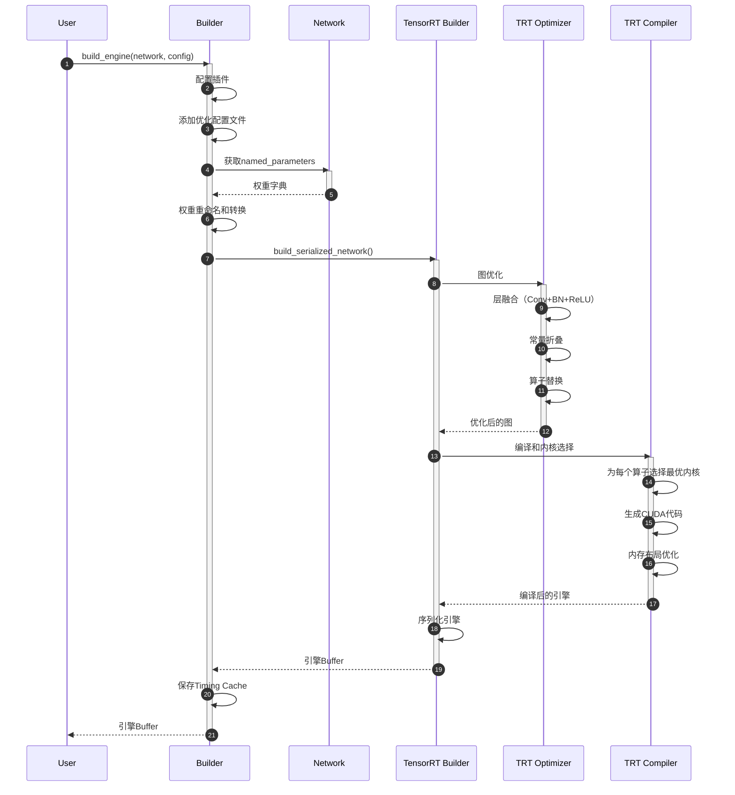
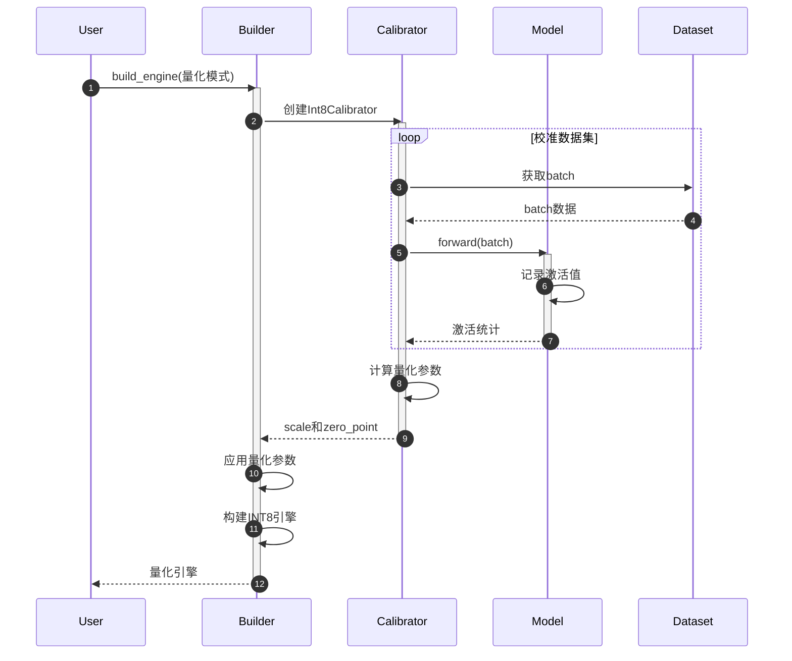
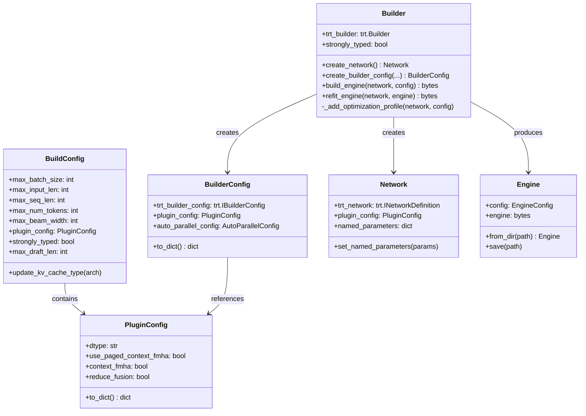
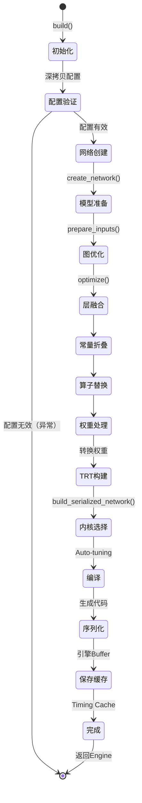

# TensorRT-LLM-02-Builder模块-深度剖析

## 一、模块概览

### 1.1 模块定位

Builder 模块是 TensorRT-LLM 的核心编译器，负责将 PyTorch/HuggingFace 格式的 LLM 模型转换为高度优化的 TensorRT 推理引擎。

**核心职责：**
- 模型图构建：创建 TensorRT 网络定义
- 图优化：层融合、算子替换、常量折叠
- 精度校准：混合精度和量化支持
- 内核调优：自动选择最优 CUDA 内核
- 引擎序列化：生成可部署的 .engine 文件

### 1.2 模块架构

```
Builder 模块架构：

tensorrt_llm/builder.py
├── Builder 类           # 主构建器类
│   ├── create_network()          # 创建网络
│   ├── create_builder_config()   # 创建配置
│   ├── build_engine()            # 构建引擎
│   └── refit_engine()            # 重新拟合引擎
│
├── BuildConfig 类       # 构建配置
│   ├── max_batch_size
│   ├── max_input_len
│   ├── max_seq_len
│   └── plugin_config
│
├── BuilderConfig 类     # TRT Builder配置
│   └── trt_builder_config
│
└── build() 函数        # 高层构建接口
    ├── 参数校验
    ├── 网络构建
    ├── 优化配置
    └── 引擎生成
```

### 1.3 核心数据流

```
HF Model → PretrainedModel → Network → TensorRT Builder → Engine
   ↓            ↓               ↓            ↓              ↓
 权重加载     模型定义       图定义      优化编译       序列化
```

## 二、核心API详细剖析

### 2.1 build() 函数

#### 2.1.1 函数签名

```python
def build(
    model: PretrainedModel,      # 预训练模型对象
    build_config: BuildConfig     # 构建配置
) -> Engine:                      # 返回引擎对象
    """
    从预训练模型构建 TensorRT 引擎
    
    警告：此函数可能修改模型对象状态，避免重复使用同一模型对象
    """
```

#### 2.1.2 参数结构体

**请求参数：PretrainedModel**

| 字段 | 类型 | 说明 |
|-----|------|------|
| config | PretrainedConfig | 模型配置（架构、精度、并行等） |
| layers | nn.ModuleList | 模型层列表 |
| vocab_embedding | Embedding | 词嵌入层 |
| lm_head | Linear | 语言模型头 |

**请求参数：BuildConfig**

| 字段 | 类型 | 必填 | 默认值 | 说明 |
|-----|------|-----|--------|------|
| max_batch_size | int | ✅ | - | 最大批次大小 |
| max_input_len | int | ✅ | - | 最大输入长度 |
| max_seq_len | int | ✅ | - | 最大序列长度（输入+输出） |
| max_num_tokens | int | ❌ | None | 最大Token数（用于Inflight Batching） |
| max_beam_width | int | ❌ | 1 | 最大Beam宽度 |
| plugin_config | PluginConfig | ❌ | auto | 插件配置 |
| strongly_typed | bool | ❌ | True | 强类型模式 |

**响应结构体：Engine**

| 字段 | 类型 | 说明 |
|-----|------|------|
| engine_buffer | bytes | 序列化的引擎二进制数据 |
| config | EngineConfig | 引擎配置信息 |
| pretrained_config | dict | 原始模型配置 |

#### 2.1.3 核心代码实现

```python
def build(model: PretrainedModel, build_config: BuildConfig) -> Engine:
    # 1. 深拷贝配置，避免修改原始对象
    build_config = copy.deepcopy(build_config)
    build_config.plugin_config.dtype = model.config.dtype
    build_config.update_kv_cache_type(model.config.architecture)
    
    # 2. 初始化最大序列长度
    _init_max_seq_len(model.config, build_config)
    
    # 3. 配置验证和调整
    # 3.1 StreamingLLM不支持Paged Context FMHA
    if build_config.plugin_config.streamingllm:
        build_config.plugin_config.use_paged_context_fmha = False
    
    # 3.2 Reduce Fusion配置
    if build_config.plugin_config.reduce_fusion and model.config.mapping.tp_size == 1:
        build_config.plugin_config.reduce_fusion = False
    
    # 3.3 FP8量化需要强类型
    if model.config.quantization.quant_algo == QuantAlgo.FP8:
        build_config.strongly_typed = True
    
    # 4. 推测解码配置调整
    if build_config.speculative_decoding_mode != SpeculativeDecodingMode.NONE:
        # 增加max_seq_len以容纳draft tokens
        build_config.max_seq_len += build_config.max_draft_len
    
    # 5. 创建Builder和Network
    builder = Builder()
    builder.strongly_typed = build_config.strongly_typed
    
    network = builder.create_network()
    network.plugin_config = build_config.plugin_config
    
    # 6. 模型优化
    with net_guard(network):
        # 6.1 设置命名参数（权重）
        network.set_named_parameters(model.named_parameters())
        
        # 6.2 准备输入
        model.prepare_inputs(
            max_batch_size=build_config.max_batch_size,
            max_input_len=build_config.max_input_len,
            # ... 其他参数
        )
        
        # 6.3 图优化（层融合、常量折叠等）
        optimize(network)
    
    # 7. 创建引擎配置
    builder_config = builder.create_builder_config(
        precision=build_config.plugin_config.dtype,
        # ... 其他配置
    )
    
    # 8. 构建引擎
    engine_buffer = builder.build_engine(network, builder_config)
    
    # 9. 创建Engine对象
    engine = Engine(
        config=EngineConfig.from_json_file(config_path),
        engine=engine_buffer
    )
    
    return engine
```

#### 2.1.4 详细调用链路

```
build()
  ├─→ copy.deepcopy(build_config)           # 拷贝配置
  ├─→ _init_max_seq_len()                   # 初始化序列长度
  ├─→ Builder()                              # 创建Builder
  │     └─→ trt.Builder()                   # 创建TRT Builder
  ├─→ builder.create_network()              # 创建网络
  │     └─→ trt.Builder.create_network()   # 创建TRT网络
  ├─→ model.prepare_inputs()                # 准备输入
  │     ├─→ 创建input_ids张量
  │     ├─→ 创建position_ids张量
  │     ├─→ 创建attention_mask张量
  │     └─→ 设置网络输入
  ├─→ optimize(network)                      # 图优化
  │     ├─→ 层融合（LayerFusion）
  │     ├─→ 常量折叠（ConstantFolding）
  │     └─→ 算子替换（OpReplacement）
  ├─→ builder.create_builder_config()       # 创建配置
  │     ├─→ 设置精度标志（FP16/BF16/FP8）
  │     ├─→ 设置优化配置文件
  │     └─→ 加载TimingCache
  ├─→ builder.build_engine()                # 构建引擎
  │     ├─→ 权重重命名
  │     ├─→ TRT优化编译
  │     │     ├─→ 层融合
  │     │     ├─→ 内核选择
  │     │     └─→ 内存优化
  │     ├─→ 序列化引擎
  │     └─→ 返回引擎Buffer
  └─→ Engine()                               # 封装引擎
        ├─→ 保存配置
        └─→ 保存权重
```

### 2.2 Builder.build_engine() 方法

#### 2.2.1 方法签名

```python
@_is_building
def build_engine(
    self,
    network: Network,
    builder_config: BuilderConfig,
    managed_weights: dict = None
) -> trt.IHostMemory:
    """
    从网络构建TensorRT引擎
    
    Args:
        network: Network对象
        builder_config: Builder配置
        managed_weights: 管理的权重字典（可选）
        
    Returns:
        序列化的TRT引擎
    """
```

#### 2.2.2 核心实现

```python
def build_engine(self, network, builder_config, managed_weights=None):
    # 1. 配置插件和自动并行
    builder_config.plugin_config = network.plugin_config
    builder_config.auto_parallel_config = network.auto_parallel_config
    
    # 2. 添加优化配置文件
    if builder_config.trt_builder_config.num_optimization_profiles == 0:
        self._add_optimization_profile(network, builder_config)
    
    # 3. 权重重命名（用于层融合）
    if network.named_parameters is not None:
        for name, param in network.named_parameters:
            # 将numpy权重转换为TRT权重
            pass
    
    # 4. 构建引擎
    engine = self.trt_builder.build_serialized_network(
        network.trt_network,
        builder_config.trt_builder_config
    )
    
    # 5. 保存Timing Cache（用于后续构建加速）
    if builder_config.timing_cache is not None:
        timing_cache = builder_config.trt_builder_config.get_timing_cache()
        with open(builder_config.timing_cache, 'wb') as f:
            f.write(timing_cache.serialize())
    
    return engine
```

#### 2.2.3 时序图



## 三、关键功能深度剖析

### 3.1 图优化（optimize函数）

#### 3.1.1 功能描述

图优化是TensorRT编译的核心步骤，通过多种优化技术提升推理性能。

#### 3.1.2 优化技术

**1. 层融合（Layer Fusion）**

```python
# 优化前：
x = conv(input)
x = batch_norm(x)
x = relu(x)

# 优化后：融合为单个FusedConvBNReLU层
x = fused_conv_bn_relu(input)
```

**性能提升：** 减少kernel启动开销，提升30-50%

**2. 常量折叠（Constant Folding）**

```python
# 优化前：
scale = torch.tensor(2.0)
x = input * scale

# 优化后：
x = input * 2.0  # scale被折叠为常量
```

**3. 算子替换（Operator Replacement）**

```python
# 优化前：使用通用GEMM
output = torch.matmul(query, key.T)

# 优化后：使用Flash Attention
output = flash_attention(query, key, value)
```

#### 3.1.3 优化流程代码

```python
def optimize(network: Network):
    """
    对网络进行图优化
    """
    # 1. 层融合
    fusion_patterns = [
        (Conv2d, BatchNorm2d, ReLU),  # Conv+BN+ReLU
        (Linear, ReLU),                # Linear+ReLU
        (Attention, LayerNorm),        # Attention+LayerNorm
    ]
    
    for pattern in fusion_patterns:
        fuse_layers(network, pattern)
    
    # 2. 常量折叠
    fold_constants(network)
    
    # 3. 算子替换
    replace_attention_with_flash(network)
    replace_softmax_with_fast_softmax(network)
    
    # 4. 死代码消除
    eliminate_dead_code(network)
```

### 3.2 精度校准（Precision Calibration）

#### 3.2.1 功能描述

对于INT8量化，需要通过校准数据集统计激活值范围，确定量化参数。

#### 3.2.2 校准流程

```python
def calibrate_int8(model, calibration_dataset):
    """
    INT8精度校准
    """
    # 1. 设置校准模式
    builder_config.int8_calibrator = Int8EntropyCalibrator2(
        calibration_dataset
    )
    
    # 2. 前向传播收集统计信息
    for batch in calibration_dataset:
        model(batch)  # 收集激活值范围
    
    # 3. 计算量化参数（scale和zero_point）
    for layer in model.layers:
        layer.compute_quantization_params()
    
    # 4. 构建量化引擎
    engine = builder.build_engine(network, builder_config)
```

#### 3.2.3 时序图



### 3.3 内核自动调优（Kernel Auto-tuning）

#### 3.3.1 功能描述

TensorRT会为每个算子自动选择最优的CUDA内核实现。

#### 3.3.2 调优流程

```python
def auto_tune_kernels(network, builder_config):
    """
    内核自动调优
    """
    # 1. 为每个算子生成候选内核列表
    for layer in network.layers:
        candidates = generate_kernel_candidates(layer)
        # 例如GEMM可能有：
        # - cuBLAS
        # - cuBLASLt
        # - Custom CUDA kernel
        # - Tensor Core kernel
        
        # 2. 基准测试每个候选内核
        best_kernel = None
        best_time = float('inf')
        
        for kernel in candidates:
            time = benchmark_kernel(kernel, layer)
            if time < best_time:
                best_time = time
                best_kernel = kernel
        
        # 3. 选择最优内核
        layer.set_implementation(best_kernel)
    
    # 4. 保存到Timing Cache
    save_timing_cache(builder_config.timing_cache)
```

## 四、数据结构UML图

### 4.1 Builder类图



### 4.2 构建流程状态图



## 五、使用示例

### 5.1 基础构建示例

```python
from tensorrt_llm import Builder, BuildConfig
from tensorrt_llm.models import LlamaForCausalLM

# 1. 加载模型
model = LlamaForCausalLM.from_pretrained("meta-llama/Llama-3-8B")

# 2. 创建构建配置
build_config = BuildConfig(
    max_batch_size=8,
    max_input_len=2048,
    max_seq_len=4096,
    max_num_tokens=8192,
)

# 3. 构建引擎
from tensorrt_llm import build
engine = build(model, build_config)

# 4. 保存引擎
engine.save("llama-3-8b.engine")
```

### 5.2 量化构建示例

```python
from tensorrt_llm import build, BuildConfig
from tensorrt_llm.quantization import quantize

# 1. 加载并量化模型
model = LlamaForCausalLM.from_pretrained("Llama-3-8B")
model = quantize(model, "fp8")  # FP8量化

# 2. 构建配置
build_config = BuildConfig(
    max_batch_size=16,
    max_input_len=2048,
    max_seq_len=4096,
)

# 3. 构建引擎
engine = build(model, build_config)
```

### 5.3 多GPU构建示例

```python
# TP=4的多GPU构建
build_config = BuildConfig(
    max_batch_size=32,
    max_input_len=2048,
    max_seq_len=4096,
)

# 设置并行配置
model.config.mapping = Mapping(
    world_size=4,
    tp_size=4,      # Tensor Parallel
    pp_size=1,      # Pipeline Parallel
)

engine = build(model, build_config)
```

## 六、性能优化建议

### 6.1 加速构建时间

```python
# 1. 使用Timing Cache
build_config = BuildConfig(
    timing_cache="timing_cache.bin",  # 重用之前的调优结果
    # ...
)

# 2. 减少优化配置文件数量
build_config.force_num_profiles = 1  # 只使用1个profile

# 3. 跳过某些优化
build_config.builder_opt = 3  # 降低优化级别（0-5）
```

### 6.2 优化引擎性能

```python
build_config = BuildConfig(
    max_batch_size=128,            # 更大批次
    enable_context_fmha=True,      # 启用Flash Attention
    use_paged_context_fmha=True,   # 启用Paged Attention
    reduce_fusion=True,            # 启用Reduce融合
)
```

## 七、常见问题

**Q1：构建时间过长？**
- 使用Timing Cache缓存调优结果
- 降低builder_opt级别
- 减少优化配置文件数量

**Q2：引擎过大？**
- 启用weight streaming
- 使用量化（FP8/INT8）
- 启用strip plan

**Q3：精度损失？**
- 使用更高精度量化（FP8而非INT8）
- 增加校准数据集
- 检查量化敏感层

---

**文档版本：** 2.0（深度剖析版）  
**生成时间：** 2025-10-05  
**对应代码版本：** TensorRT-LLM v1.2.0rc1
