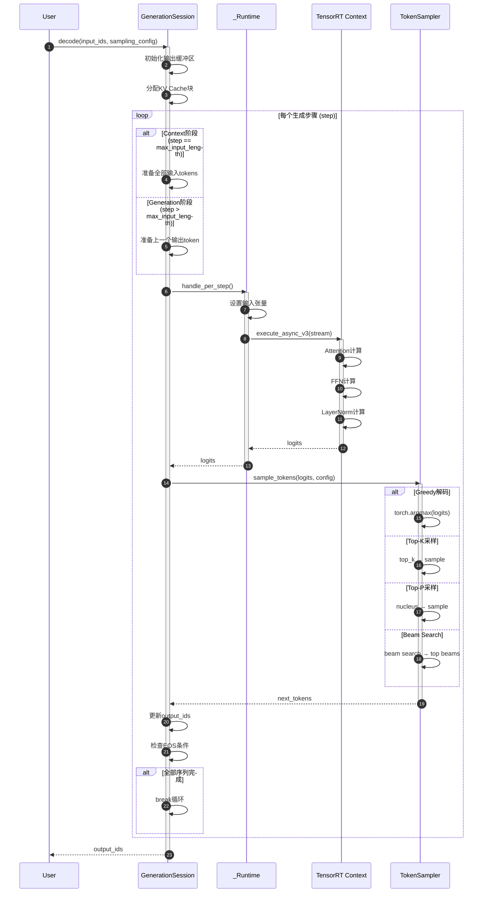
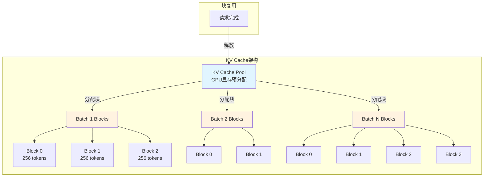
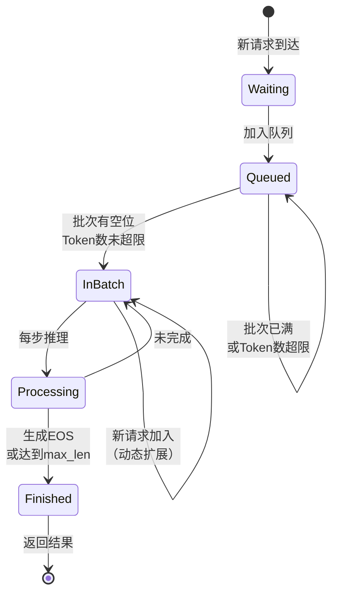
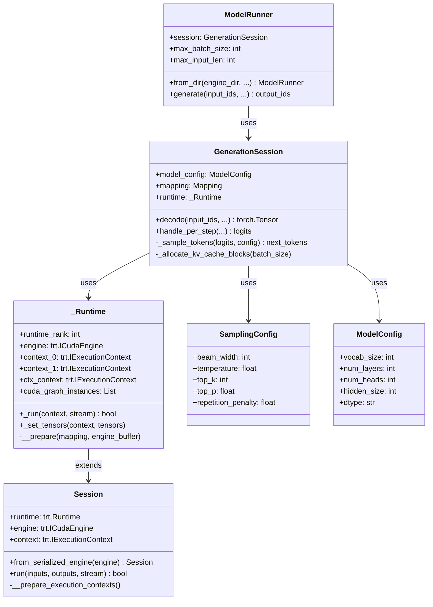
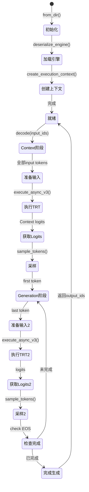

# TensorRT-LLM-03-Runtime模块-深度剖析

## 一、模块概览

### 1.1 模块定位

Runtime 模块是 TensorRT-LLM 的推理执行引擎，负责加载预编译的 TensorRT 引擎并执行推理任务。

**核心职责：**
- 引擎加载：反序列化 TensorRT 引擎
- 内存管理：KV Cache、输入输出缓冲区
- 推理执行：TensorRT 上下文执行
- 批处理：动态批处理和Inflight Batching
- 解码策略：Greedy、BeamSearch、Sampling

### 1.2 模块架构

```
Runtime 模块架构：

tensorrt_llm/runtime/
├── session.py              # TRT会话管理
│   └── Session类
│       ├── from_serialized_engine()    # 加载引擎
│       └── run()                       # 执行推理
│
├── generation.py           # 生成管理
│   ├── _Runtime类                     # TRT运行时封装
│   ├── GenerationSession类            # 生成会话
│   │   ├── decode()                   # 解码主循环
│   │   └── handle_per_step()          # 单步处理
│   └── SamplingConfig类               # 采样配置
│
├── model_runner.py         # 模型运行器
│   └── ModelRunner类
│       ├── from_dir()                 # 加载引擎
│       ├── generate()                 # 生成接口
│       └── decode()                   # 解码执行
│
└── model_runner_cpp.py     # C++ Executor封装
    └── ModelRunnerCpp类
        ├── __init__()                 # 初始化Executor
        ├── generate()                 # 生成接口
        └── shutdown()                 # 关闭
```

### 1.3 核心数据流

```
引擎加载 → Session创建 → 输入准备 → TRT执行 → 输出解析 → Token采样 → 循环解码
    ↓           ↓            ↓          ↓          ↓          ↓          ↓
engine.bin → Context → InputTensors → GPU推理 → Logits → NextToken → 完成
```

## 二、核心API详细剖析

### 2.1 Session.run() 方法

#### 2.1.1 函数签名

```python
def run(
    self,
    inputs: Dict[str, Any],       # 输入张量字典
    outputs: Dict[str, Any],      # 输出张量字典
    stream,                        # CUDA流
    context=None                   # TRT执行上下文
) -> bool:
    """
    执行TensorRT引擎推理
    
    Args:
        inputs: 输入张量映射，键为张量名，值为torch.Tensor或指针
        outputs: 输出张量映射，键为张量名，值为torch.Tensor或指针
        stream: CUDA流句柄
        context: TRT执行上下文（可选）
        
    Returns:
        bool: 入队是否成功（异步调用）
    """
```

#### 2.1.2 参数结构体

**请求参数：inputs字典**

| 张量名 | 类型 | 形状 | 说明 |
|-------|------|------|------|
| input_ids | torch.Tensor | [batch, seq_len] | 输入Token IDs |
| context_lengths | torch.Tensor | [batch] | 上下文长度 |
| position_ids | torch.Tensor | [batch, seq_len] | 位置编码 |
| attention_mask | torch.Tensor | [batch, seq_len] | 注意力掩码 |
| kv_cache_block_offsets | torch.Tensor | [batch, 2, max_blocks] | KV Cache块偏移 |

**响应参数：outputs字典**

| 张量名 | 类型 | 形状 | 说明 |
|-------|------|------|------|
| logits | torch.Tensor | [batch, seq_len, vocab] | 输出logits |
| sequence_length | torch.Tensor | [batch] | 序列长度 |
| context_logits | torch.Tensor | [batch, ctx_len, vocab] | 上下文logits（可选） |

#### 2.1.3 核心代码实现

```python
def run(self, inputs, outputs, stream, context=None):
    # 1. 选择执行上下文
    if context is None:
        context = self.context  # 使用默认上下文
    
    # 2. 设置输入张量地址
    import torch
    for tensor_name in inputs:
        tensor = inputs[tensor_name]
        # 获取指针（支持torch.Tensor和原始指针）
        ptr = tensor.data_ptr() if isinstance(tensor, torch.Tensor) else tensor
        context.set_tensor_address(tensor_name, ptr)
    
    # 3. 设置输出张量地址
    for tensor_name in outputs:
        tensor = outputs[tensor_name]
        ptr = tensor.data_ptr() if isinstance(tensor, torch.Tensor) else tensor
        context.set_tensor_address(tensor_name, ptr)
    
    # 4. 异步执行
    ok = context.execute_async_v3(stream)
    return ok
```

#### 2.1.4 详细调用链路

```
Session.run()
  ├─→ 获取执行上下文
  │     └─→ context = self.context（默认）
  ├─→ 设置输入张量地址
  │     ├─→ tensor.data_ptr()           # 获取GPU指针
  │     └─→ context.set_tensor_address() # 设置TRT输入
  ├─→ 设置输出张量地址
  │     ├─→ tensor.data_ptr()
  │     └─→ context.set_tensor_address()
  └─→ 异步执行
        └─→ context.execute_async_v3(stream)  # TRT推理内核启动
              ├─→ CUDA Kernel调度
              ├─→ Attention计算
              ├─→ FFN计算
              ├─→ LayerNorm计算
              └─→ 输出写入
```

### 2.2 GenerationSession.decode() 方法

#### 2.2.1 函数签名

```python
def decode(
    self,
    input_ids: torch.Tensor,              # 输入Token IDs
    input_lengths: torch.Tensor,          # 输入长度
    sampling_config: SamplingConfig,      # 采样配置
    max_new_tokens: int = None,           # 最大新Token数
    *,
    output_sequence_lengths: bool = False,
    return_dict: bool = False,
    encoder_output: torch.Tensor = None,
    encoder_input_lengths: torch.Tensor = None,
    stopping_criteria: StoppingCriteria = None,
    logits_processor: LogitsProcessor = None,
    **kwargs
) -> Union[torch.Tensor, dict]:
    """
    执行自回归解码生成
    
    Args:
        input_ids: 输入Token IDs [batch, seq_len]
        input_lengths: 每个序列的实际长度 [batch]
        sampling_config: 采样配置
        max_new_tokens: 最大生成Token数
        
    Returns:
        output_ids: 生成的Token IDs [batch, max_seq_len]
        或包含output_ids、sequence_lengths等的字典
    """
```

#### 2.2.2 参数结构体

**SamplingConfig**

| 字段 | 类型 | 默认值 | 说明 |
|-----|------|--------|------|
| beam_width | int | 1 | Beam Search宽度（1为Greedy） |
| temperature | float | 1.0 | 温度系数 |
| top_k | int | 0 | Top-K采样 |
| top_p | float | 0.0 | Top-P（Nucleus）采样 |
| repetition_penalty | float | 1.0 | 重复惩罚 |
| presence_penalty | float | 0.0 | 存在惩罚 |
| frequency_penalty | float | 0.0 | 频率惩罚 |
| length_penalty | float | 1.0 | 长度惩罚（Beam Search） |
| min_length | int | 1 | 最小生成长度 |

#### 2.2.3 核心代码实现

```python
def decode(self, input_ids, input_lengths, sampling_config, max_new_tokens=None, **kwargs):
    # 1. 参数校验和初始化
    batch_size = input_ids.size(0)
    beam_width = sampling_config.beam_width
    max_input_length = torch.max(input_lengths).item()
    
    # 2. 计算最大输出长度
    if max_new_tokens is None:
        max_new_tokens = self.max_seq_len - max_input_length
    max_seq_len = max_input_length + max_new_tokens
    
    # 3. 初始化输出缓冲区
    output_ids = torch.zeros(
        (batch_size, beam_width, max_seq_len),
        dtype=torch.int32,
        device='cuda'
    )
    output_ids[:, :, :max_input_length] = input_ids.unsqueeze(1)
    
    # 4. 初始化序列长度
    sequence_lengths = input_lengths.clone()
    
    # 5. 初始化KV Cache
    kv_cache_block_offsets = self._allocate_kv_cache_blocks(batch_size)
    
    # 6. 主解码循环
    for step in range(max_input_length, max_seq_len):
        # 6.1 准备输入（Context阶段使用全部输入，Generation阶段使用last token）
        if step == max_input_length:
            # Context阶段：处理全部输入tokens
            current_input_ids = input_ids
            current_position_ids = torch.arange(max_input_length, device='cuda')
        else:
            # Generation阶段：只处理上一步的输出token
            current_input_ids = output_ids[:, :, step-1:step]
            current_position_ids = torch.tensor([[step-1]], device='cuda')
        
        # 6.2 执行单步推理
        logits = self.handle_per_step(
            step=step,
            batch_size=batch_size,
            input_ids=current_input_ids,
            context_lengths=input_lengths,
            kv_cache_block_offsets=kv_cache_block_offsets,
            # ... 其他参数
        )
        
        # 6.3 采样下一个token
        next_tokens = self._sample_tokens(
            logits=logits,
            sampling_config=sampling_config,
            step=step
        )
        
        # 6.4 更新输出
        output_ids[:, :, step] = next_tokens
        
        # 6.5 更新序列长度（遇到EOS则停止）
        not_finished = next_tokens != self.end_id
        sequence_lengths += not_finished.long()
        
        # 6.6 检查是否全部完成
        if not not_finished.any():
            break
    
    # 7. 返回结果
    if kwargs.get('return_dict', False):
        return {
            'output_ids': output_ids,
            'sequence_lengths': sequence_lengths,
            'cum_log_probs': cum_log_probs,
        }
    return output_ids
```

#### 2.2.4 时序图



### 2.3 ModelRunner.generate() 方法

#### 2.3.1 函数签名

```python
def generate(
    self,
    batch_input_ids: List[torch.Tensor],    # 批次输入IDs列表
    *,
    max_new_tokens: int = 1,                 # 最大新Token数
    max_attention_window_size: int = None,   # 最大注意力窗口
    end_id: int = None,                      # 结束Token ID
    pad_id: int = None,                      # 填充Token ID
    temperature: float = 1.0,                # 温度
    top_k: int = 1,                          # Top-K
    top_p: float = 0.0,                      # Top-P
    repetition_penalty: float = 1.0,         # 重复惩罚
    output_sequence_lengths: bool = False,
    return_dict: bool = False,
    **kwargs
) -> Union[torch.Tensor, dict]:
    """
    高层生成接口
    
    Args:
        batch_input_ids: 输入Token IDs列表
        max_new_tokens: 最大生成Token数
        temperature/top_k/top_p: 采样参数
        
    Returns:
        output_ids或包含多个字段的字典
    """
```

#### 2.3.2 核心实现

```python
def generate(self, batch_input_ids, **kwargs):
    # 1. 输入预处理
    # 1.1 填充到相同长度
    max_input_len = max(len(ids) for ids in batch_input_ids)
    input_ids = torch.full(
        (len(batch_input_ids), max_input_len),
        self.pad_id,
        dtype=torch.int32,
        device='cuda'
    )
    input_lengths = torch.tensor(
        [len(ids) for ids in batch_input_ids],
        dtype=torch.int32,
        device='cuda'
    )
    for i, ids in enumerate(batch_input_ids):
        input_ids[i, :len(ids)] = torch.tensor(ids, dtype=torch.int32)
    
    # 2. 创建采样配置
    sampling_config = SamplingConfig(
        temperature=kwargs.get('temperature', 1.0),
        top_k=kwargs.get('top_k', 1),
        top_p=kwargs.get('top_p', 0.0),
        # ... 其他参数
    )
    
    # 3. 调用session.decode
    outputs = self.session.decode(
        input_ids=input_ids,
        input_lengths=input_lengths,
        sampling_config=sampling_config,
        max_new_tokens=kwargs.get('max_new_tokens', 1),
        return_dict=True,
    )
    
    # 4. 后处理
    output_ids = outputs['output_ids']
    sequence_lengths = outputs['sequence_lengths']
    
    # 4.1 移除填充
    output_list = []
    for i in range(len(batch_input_ids)):
        seq_len = sequence_lengths[i].item()
        output_list.append(output_ids[i, :seq_len].cpu().tolist())
    
    # 5. 返回结果
    if kwargs.get('return_dict', False):
        return {
            'output_ids': output_list,
            'sequence_lengths': sequence_lengths.cpu().tolist(),
        }
    return output_list
```

#### 2.3.3 调用链路

```
ModelRunner.generate()
  ├─→ 输入预处理
  │     ├─→ 填充input_ids到max_input_len
  │     └─→ 计算input_lengths
  ├─→ 创建SamplingConfig
  ├─→ GenerationSession.decode()
  │     ├─→ 初始化输出缓冲区
  │     ├─→ 分配KV Cache
  │     └─→ 主解码循环
  │           ├─→ handle_per_step()
  │           │     ├─→ _Runtime._set_tensors()
  │           │     ├─→ _Runtime._run()
  │           │     │     └─→ Session.run()
  │           │     │           └─→ context.execute_async_v3()
  │           │     └─→ 获取logits
  │           ├─→ _sample_tokens()
  │           │     ├─→ 应用temperature
  │           │     ├─→ 应用top_k/top_p
  │           │     ├─→ 应用repetition_penalty
  │           │     └─→ 采样next_token
  │           ├─→ 更新output_ids
  │           └─→ 检查EOS
  └─→ 后处理
        ├─→ 移除填充
        └─→ 返回结果
```

## 三、关键功能深度剖析

### 3.1 KV Cache管理

#### 3.1.1 功能描述

KV Cache用于缓存Attention机制中的Key和Value矩阵，避免重复计算，是自回归生成的核心优化。

#### 3.1.2 Paged KV Cache

```python
def _allocate_kv_cache_blocks(self, batch_size):
    """
    分配Paged KV Cache块
    
    Paged KV Cache将KV矩阵划分为固定大小的块（如256 tokens/block），
    按需分配，减少内存浪费。
    """
    # 1. 计算所需块数
    max_blocks_per_seq = (self.max_seq_len + self.tokens_per_block - 1) // self.tokens_per_block
    
    # 2. 分配块索引
    kv_cache_block_offsets = torch.zeros(
        (batch_size, 2, max_blocks_per_seq),  # 2: [context, generation]
        dtype=torch.int32,
        device='cuda'
    )
    
    # 3. 从块池分配
    for batch_idx in range(batch_size):
        for block_idx in range(max_blocks_per_seq):
            kv_cache_block_offsets[batch_idx, 0, block_idx] = self.block_pool.allocate()
    
    return kv_cache_block_offsets
```

#### 3.1.3 KV Cache架构图



**优势：**
- 减少内存碎片
- 支持动态批处理
- 提高内存利用率（相比连续分配节省30-50%）

### 3.2 Inflight Batching

#### 3.2.1 功能描述

Inflight Batching（连续批处理）允许不同长度的请求在同一批次中并行处理，新请求可以在旧请求完成前加入批次。

#### 3.2.2 实现原理

```python
class InflightBatchingManager:
    """
    动态批处理管理器
    """
    def __init__(self, max_batch_size, max_num_tokens):
        self.max_batch_size = max_batch_size
        self.max_num_tokens = max_num_tokens
        self.active_requests = []
    
    def can_add_request(self, new_request):
        """
        检查是否可以添加新请求
        """
        # 1. 检查批次大小
        if len(self.active_requests) >= self.max_batch_size:
            return False
        
        # 2. 检查Token数量（移除padding后）
        current_tokens = sum(req.current_length for req in self.active_requests)
        new_tokens = new_request.input_length
        if current_tokens + new_tokens > self.max_num_tokens:
            return False
        
        return True
    
    def add_request(self, request):
        """
        添加请求到批次
        """
        self.active_requests.append(request)
    
    def remove_finished_requests(self):
        """
        移除已完成的请求
        """
        self.active_requests = [
            req for req in self.active_requests
            if not req.is_finished()
        ]
```

#### 3.2.3 状态图



### 3.3 CUDA Graph优化

#### 3.3.1 功能描述

CUDA Graph捕获固定的kernel启动序列，减少CPU-GPU交互开销，提升吞吐量10-20%。

#### 3.3.2 实现代码

```python
def _enable_cuda_graph(self, step, batch_size):
    """
    启用CUDA Graph
    """
    instance_idx = step % 2  # Ping-pong两个实例
    
    if self.runtime.cuda_graph_instances[instance_idx] is not None:
        # 已捕获，直接启动图
        CUASSERT(
            cudart.cudaGraphLaunch(
                self.runtime.cuda_graph_instances[instance_idx],
                stream
            )
        )
    else:
        # 首次执行，捕获图
        graph = cudart.cudaGraph_t()
        CUASSERT(cudart.cudaStreamBeginCapture(stream, mode))
        
        # 执行推理（会被记录到图中）
        ok = self.runtime._run(context, stream)
        
        # 结束捕获
        CUASSERT(cudart.cudaStreamEndCapture(stream, graph))
        
        # 实例化图
        graphExec = cudart.cudaGraphExec_t()
        CUASSERT(cudart.cudaGraphInstantiate(graphExec, graph, 0))
        
        # 保存实例
        self.runtime.cuda_graph_instances[instance_idx] = graphExec
```

## 四、数据结构UML图

### 4.1 Runtime核心类图



### 4.2 推理执行状态图



## 五、使用示例

### 5.1 基础推理示例

```python
from tensorrt_llm.runtime import ModelRunner
from tensorrt_llm import SamplingConfig

# 1. 加载引擎
runner = ModelRunner.from_dir(
    engine_dir="./llama-3-8b-engine",
    rank=0,
)

# 2. 准备输入
input_ids = [[1, 15043, 29892, 920, 526, 366]]  # "Hello, how are you"

# 3. 配置采样
sampling_config = SamplingConfig(
    temperature=0.8,
    top_k=50,
    top_p=0.95,
)

# 4. 生成
output_ids = runner.generate(
    batch_input_ids=input_ids,
    max_new_tokens=100,
    temperature=0.8,
    top_k=50,
    top_p=0.95,
)

print("Generated:", tokenizer.decode(output_ids[0]))
```

### 5.2 Beam Search示例

```python
# Beam Search配置
sampling_config = SamplingConfig(
    beam_width=4,           # 4个beam
    length_penalty=1.0,     # 长度惩罚
    temperature=1.0,        # Beam Search通常用temperature=1.0
)

output_ids = runner.generate(
    batch_input_ids=input_ids,
    max_new_tokens=100,
    sampling_config=sampling_config,
)

# output_ids形状: [batch, beam_width, seq_len]
for beam_idx in range(4):
    print(f"Beam {beam_idx}:", tokenizer.decode(output_ids[0, beam_idx]))
```

### 5.3 流式生成示例

```python
# 使用C++ Executor支持流式生成
from tensorrt_llm.runtime import ModelRunnerCpp

runner = ModelRunnerCpp.from_dir(engine_dir="./llama-3-8b-engine")

# 异步生成
for output in runner.generate_async(
    batch_input_ids=input_ids,
    max_new_tokens=100,
    streaming=True,
):
    # 每生成一个token就返回
    new_token = output['output_ids'][0][-1]
    print(tokenizer.decode([new_token]), end='', flush=True)
```

## 六、性能优化建议

### 6.1 批处理优化

```python
# 1. 启用Inflight Batching
runner = ModelRunner.from_dir(
    engine_dir="./engine",
    max_batch_size=128,           # 更大批次
    max_num_tokens=4096,          # Token数限制（移除padding）
)

# 2. 批量请求
batch_input_ids = [
    [1, 15043, ...],  # 请求1
    [1, 3532, ...],   # 请求2
    [1, 1724, ...],   # 请求3
    # ... 更多请求
]
outputs = runner.generate(batch_input_ids=batch_input_ids)
```

### 6.2 内存优化

```python
# 启用Paged KV Cache
# （在Builder阶段配置）
build_config = BuildConfig(
    kv_cache_type=KVCacheType.PAGED,  # Paged KV Cache
    tokens_per_block=256,              # 每块256 tokens
)
```

### 6.3 CUDA Graph优化

```python
# 启用CUDA Graph（自动，满足条件时）
runner = ModelRunner.from_dir(
    engine_dir="./engine",
    enable_cuda_graph=True,  # 启用CUDA Graph
)

# CUDA Graph生效条件：
# 1. 批次大小固定
# 2. 序列长度固定
# 3. Generation阶段（非Context阶段）
```

## 七、常见问题

**Q1：为什么第一次推理很慢？**
- Context阶段需要处理全部输入tokens，计算量大
- CUDA Graph需要首次捕获，后续会加速

**Q2：如何提高吞吐量？**
- 增大批次大小（max_batch_size）
- 启用Inflight Batching（max_num_tokens）
- 使用Paged KV Cache

**Q3：生成结果不稳定？**
- 检查temperature设置（过高导致随机性大）
- 调整top_k/top_p参数
- 使用Beam Search提高质量

---

**文档版本：** 2.0（深度剖析版）  
**生成时间：** 2025-10-05  
**对应代码版本：** TensorRT-LLM v1.2.0rc1
