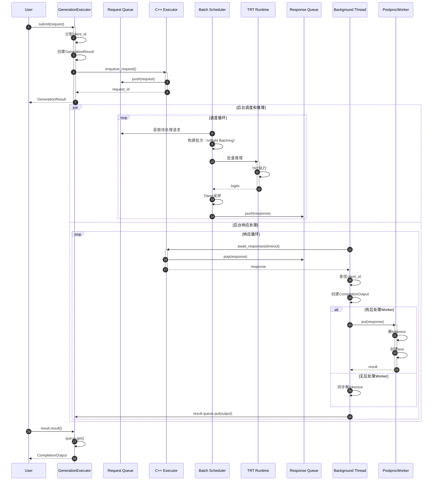
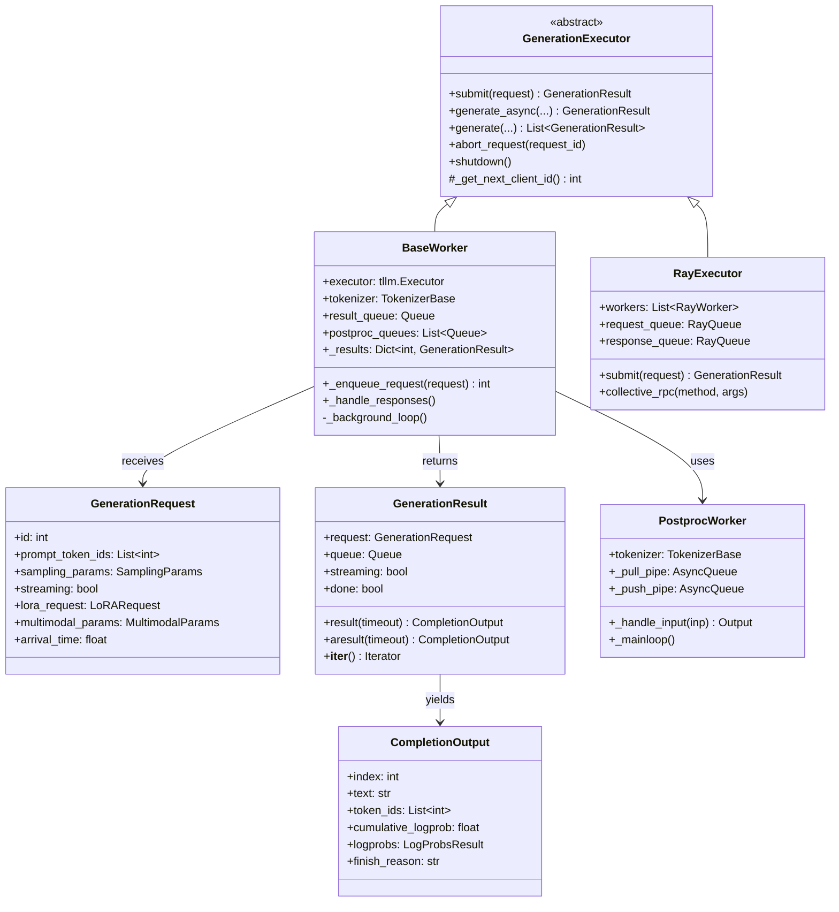
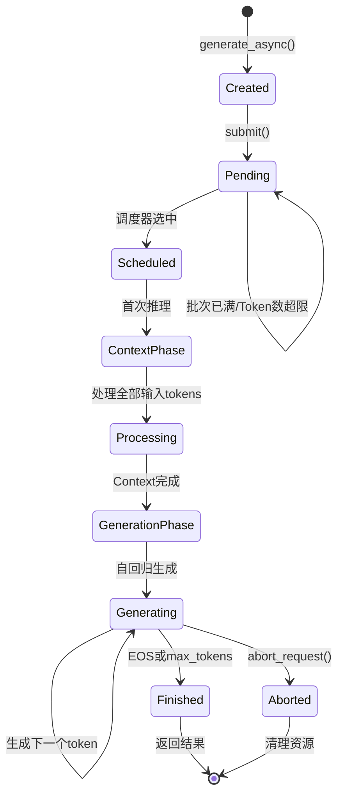

# TensorRT-LLM-04-Executor模块-深度剖析

## 一、模块概览

### 1.1 模块定位

Executor 模块是 TensorRT-LLM 的高层请求调度和管理层，负责异步请求提交、批处理调度、结果分发和多进程/多节点协调。

**核心职责：**
- 请求管理：异步请求提交和生命周期管理
- 批处理调度：动态批处理和Inflight Batching
- 结果分发：流式和非流式结果返回
- 多进程协调：MPI/Ray多进程通信
- 后处理：异步解tokenize和后处理

### 1.2 模块架构

```
Executor 模块架构：

tensorrt_llm/executor/
├── executor.py                    # 抽象基类
│   └── GenerationExecutor
│       ├── submit()               # 提交请求
│       ├── generate_async()       # 异步生成
│       ├── generate()             # 同步生成
│       └── shutdown()             # 关闭
│
├── base_worker.py                 # Worker实现
│   └── BaseWorker(GenerationExecutor)
│       ├── _enqueue_request()     # 入队请求
│       ├── _handle_responses()    # 处理响应
│       └── _background_loop()     # 后台循环
│
├── worker.py                      # Worker进程入口
│   └── worker_main()              # Worker主函数
│
├── ray_executor.py                # Ray分布式执行器
│   └── RayExecutor
│       ├── submit()               # Ray请求提交
│       └── collective_rpc()       # 集合通信
│
├── request.py                     # 请求定义
│   ├── GenerationRequest         # 生成请求
│   ├── LoRARequest               # LoRA请求
│   └── PromptAdapterRequest      # Prompt Adapter请求
│
├── result.py                      # 结果定义
│   ├── GenerationResult          # 生成结果
│   └── IterationResult           # 迭代结果
│
└── postproc_worker.py             # 后处理Worker
    └── PostprocWorker
        └── _handle_input()        # 处理输入
```

### 1.3 核心数据流

```
用户请求 → GenerationRequest → submit() → RequestQueue → Worker
                                                              ↓
                                                         Executor
                                                              ↓
                                                      TRT推理引擎
                                                              ↓
                                                         Response
                                                              ↓
                                    ResponseQueue ← _handle_responses()
                                          ↓
                                 PostprocWorker（解tokenize）
                                          ↓
                                 GenerationResult → 用户
```

## 二、核心API详细剖析

### 2.1 GenerationExecutor.submit() 方法

#### 2.1.1 函数签名

```python
@abstractmethod
def submit(self, request: GenerationRequest) -> GenerationResult:
    """
    提交生成请求（低层API）
    
    Args:
        request: GenerationRequest对象
        
    Returns:
        GenerationResult: 包含Future的结果对象
    """
    pass
```

#### 2.1.2 GenerationRequest结构体

**GenerationRequest**

| 字段 | 类型 | 必填 | 说明 |
|-----|------|-----|------|
| prompt_token_ids | List[int] | ✅ | 输入Token IDs |
| sampling_params | SamplingParams | ✅ | 采样配置 |
| max_tokens | int | ❌ | 最大生成Token数（可通过sampling_params设置） |
| query_token_ids | List[int] | ❌ | 查询Token IDs（用于prefix caching） |
| lora_request | LoRARequest | ❌ | LoRA适配器请求 |
| prompt_adapter_request | PromptAdapterRequest | ❌ | Prompt Adapter请求 |
| streaming | bool | ❌ | 是否流式返回 |
| kv_cache_retention_config | KvCacheRetentionConfig | ❌ | KV Cache保留配置 |
| multimodal_params | MultimodalParams | ❌ | 多模态参数 |
| arrival_time | float | ❌ | 请求到达时间（用于调度分析） |

**GenerationResult结构体**

| 字段 | 类型 | 说明 |
|-----|------|------|
| request | GenerationRequest | 原始请求 |
| queue | Queue | 结果队列（内部使用） |
| streaming | bool | 是否流式 |
| done | bool | 是否完成 |

#### 2.1.3 核心代码实现（BaseWorker）

```python
def submit(self, request: GenerationRequest) -> GenerationResult:
    # 1. 分配唯一请求ID
    request.set_id(self._get_next_client_id())
    self._last_client_id = request.id
    
    # 2. 提取logprob参数（用于后续解tokenize）
    logprob_params = self._get_logprob_params(request)
    
    # 3. 创建GenerationResult（Future对象）
    result = GenerationResult(
        request,
        background_error_handler=self._handle_background_error,
        executor=self,
        disaggregated_params=request.disaggregated_params,
        logprob_params=logprob_params,
    )
    
    # 4. 保存到_results映射（用于后续查找）
    self._results[request.id] = result
    
    # 5. 入队请求
    self._enqueue_request(request, result.queue)
    
    return result
```

#### 2.1.4 _enqueue_request 详细实现

```python
def _enqueue_request(self, request: GenerationRequest, result_wait_queue=None) -> int:
    # 1. 创建C++ Executor请求对象
    executor_request = tllm.Request(
        input_token_ids=request.prompt_token_ids,
        max_tokens=request.sampling_params.max_tokens,
        streaming=request.streaming,
        sampling_config=tllm.SamplingConfig(
            beam_width=request.sampling_params.beam_width if request.sampling_params.use_beam_search else 1,
            temperature=request.sampling_params.temperature,
            top_k=request.sampling_params.top_k,
            top_p=request.sampling_params.top_p,
            # ... 其他采样参数
        ),
        output_config=tllm.OutputConfig(
            return_log_probs=request.sampling_params.logprobs is not None,
            return_context_logits=request.sampling_params.return_context_logits,
            return_generation_logits=request.sampling_params.return_generation_logits,
        ),
        # 高级特性
        lora_config=self._create_lora_config(request.lora_request),
        prompt_tuning_config=self._create_prompt_adapter_config(request.prompt_adapter_request),
        kv_cache_retention_config=request.kv_cache_retention_config,
    )
    
    # 2. 设置logits后处理器（用于自定义采样逻辑）
    if request.sampling_params.logits_processor:
        executor_request.logits_post_processor = request.sampling_params.logits_processor
    
    # 3. 提交到C++ Executor
    request_id = self.executor.enqueue_request(executor_request)
    
    # 4. 映射request_id到client_id
    self.req_id_to_client_id[request_id] = request.id
    
    return request_id
```

#### 2.1.5 调用链路

```
GenerationExecutor.submit()
  ├─→ 分配请求ID
  │     └─→ _get_next_client_id()
  ├─→ 创建GenerationResult
  │     └─→ result.queue = Queue()
  ├─→ _enqueue_request()
  │     ├─→ 创建tllm.Request
  │     │     ├─→ 转换SamplingConfig
  │     │     ├─→ 转换OutputConfig
  │     │     └─→ 设置logits_processor
  │     ├─→ executor.enqueue_request()  # C++层
  │     │     ├─→ 加入请求队列
  │     │     ├─→ 调度器通知
  │     │     └─→ 返回request_id
  │     └─→ 映射request_id → client_id
  └─→ 返回GenerationResult
```

### 2.2 GenerationExecutor.generate_async() 方法

#### 2.2.1 函数签名

```python
def generate_async(
    self,
    prompt_token_ids: List[int],
    sampling_params: SamplingParams,
    streaming: bool = False,
    **kwargs
) -> GenerationResult:
    """
    异步生成（高层API）
    
    Args:
        prompt_token_ids: 输入Token IDs
        sampling_params: 采样配置
        streaming: 是否流式返回
        
    Returns:
        GenerationResult: Future对象，可通过result()或aresult()获取
    """
```

#### 2.2.2 核心实现

```python
def generate_async(self, prompt_token_ids, sampling_params, streaming=False, **kwargs):
    # 1. 校验输入
    assert isinstance(prompt_token_ids[0], int)
    assert isinstance(sampling_params, SamplingParams)
    
    # 2. 初始化迭代结果队列（首次调用）
    self._maybe_initialize_iteration_results()
    
    # 3. 创建GenerationRequest
    request = GenerationRequest(
        prompt_token_ids,
        sampling_params=sampling_params,
        streaming=streaming,
        query_token_ids=kwargs.get('query_token_ids'),
        lora_request=kwargs.get('lora_request'),
        prompt_adapter_request=kwargs.get('prompt_adapter_request'),
        # ... 其他参数
    )
    
    # 4. 提交请求
    result = self.submit(request)
    
    return result
```

#### 2.2.3 结果获取

```python
# 同步获取（阻塞）
result = executor.generate_async(prompt_token_ids, sampling_params)
output = result.result()  # 阻塞直到完成

# 异步获取（需要在async函数中）
async def generate():
    result = executor.generate_async(prompt_token_ids, sampling_params)
    output = await result.aresult()  # 异步等待
    return output

# 流式获取
result = executor.generate_async(prompt_token_ids, sampling_params, streaming=True)
for output in result:  # 迭代器，每生成一个token返回一次
    print(output.text, end='', flush=True)
```

### 2.3 后台响应处理循环

#### 2.3.1 _handle_responses() 方法

```python
def _handle_responses(self):
    """
    后台线程：持续从C++ Executor获取响应并分发
    """
    while not self._shutdown:
        try:
            # 1. 从C++ Executor获取响应（阻塞，带超时）
            responses = self.executor.await_responses(timeout=datetime.timedelta(milliseconds=100))
            
            # 2. 批量处理响应
            for response in responses:
                # 2.1 查找对应的client_id
                client_id = self.req_id_to_client_id.get(response.request_id)
                if client_id is None:
                    continue
                
                # 2.2 获取GenerationResult
                result = self._results.get(client_id)
                if result is None:
                    continue
                
                # 2.3 解析响应
                output_token_ids = response.result.output_token_ids[0]  # beam_idx=0
                is_final = response.result.is_final
                
                # 2.4 创建CompletionOutput
                completion_output = CompletionOutput(
                    index=0,
                    text="",  # 后续由PostprocWorker解tokenize
                    token_ids=output_token_ids,
                    cumulative_logprob=response.result.cum_log_probs,
                    logprobs=self._get_logprobs(response),
                    finish_reason=response.result.finish_reason if is_final else None,
                )
                
                # 2.5 发送到后处理队列
                if self.postproc_config.num_postprocess_workers > 0:
                    # 异步后处理
                    postproc_input = PostprocWorker.Input(
                        response=response,
                        sampling_params=result.sampling_params,
                        streaming=result.streaming,
                    )
                    pid = client_id % self.postproc_config.num_postprocess_workers
                    self.postproc_queues[pid].put(postproc_input)
                else:
                    # 同步后处理
                    text = self.tokenizer.decode(output_token_ids)
                    completion_output.text = text
                    result.queue.put(completion_output)
                
                # 2.6 标记完成
                if is_final:
                    self._pop_result(client_id)
        
        except Exception as e:
            self._error_queue.put(e)
            break
```

#### 2.3.2 时序图



## 三、关键功能深度剖析

### 3.1 动态批处理调度

#### 3.1.1 Inflight Batching原理

```
传统静态批处理：
Batch 1: [Req1, Req2, Req3] → 推理 → [全部完成] → Batch 2: [Req4, Req5, Req6]
问题：Req1完成后需要等待Req2、Req3完成才能释放资源

Inflight Batching：
Step 0: [Req1, Req2, Req3] → 推理
Step 1: [Req1, Req2, Req3] → 推理（Req1生成第2个token）
Step 2: [Req1, Req2, Req3, Req4] → 推理（Req4加入，Req1生成第3个token）
Step 3: [Req2, Req3, Req4] → 推理（Req1完成并移除）
Step 4: [Req2, Req3, Req4, Req5] → 推理（Req5加入）
...

优势：
- 更高GPU利用率（批次动态变化）
- 更低延迟（新请求无需等待）
- 更高吞吐量（相比静态批处理提升2-3倍）
```

#### 3.1.2 调度策略代码

```python
class BatchScheduler:
    """
    动态批处理调度器（C++实现，此处为伪代码）
    """
    def __init__(self, max_batch_size, max_num_tokens):
        self.max_batch_size = max_batch_size
        self.max_num_tokens = max_num_tokens
        self.active_requests = []
        self.pending_requests = Queue()
    
    def schedule_step(self):
        """
        单步调度：决定哪些请求参与本次推理
        """
        # 1. 移除已完成的请求
        self.active_requests = [
            req for req in self.active_requests
            if not req.is_finished()
        ]
        
        # 2. 尝试添加新请求
        while not self.pending_requests.empty():
            new_req = self.pending_requests.peek()
            
            # 2.1 检查批次大小限制
            if len(self.active_requests) >= self.max_batch_size:
                break
            
            # 2.2 检查Token数量限制（关键！）
            current_tokens = sum(req.num_tokens for req in self.active_requests)
            new_tokens = new_req.num_tokens
            if current_tokens + new_tokens > self.max_num_tokens:
                break
            
            # 2.3 加入批次
            self.active_requests.append(self.pending_requests.get())
        
        # 3. 返回当前批次
        return self.active_requests
```

### 3.2 多进程/多GPU协调

#### 3.2.1 MPI通信架构

```
Rank 0 (Leader)              Rank 1              Rank 2              Rank 3
    ↓                          ↓                   ↓                   ↓
Executor                   Executor            Executor            Executor
    ↓                          ↓                   ↓                   ↓
TRT Engine                TRT Engine          TRT Engine          TRT Engine
(部分权重 TP=0)            (部分权重 TP=1)      (部分权重 TP=2)      (部分权重 TP=3)
    ↓                          ↓                   ↓                   ↓
    └────────────── NCCL AllReduce/AllGather ────────────────────────┘
                                 ↓
                           完整输出（仅Rank 0）
```

#### 3.2.2 Tensor Parallel推理流程

```python
def tensor_parallel_inference(input_ids, tp_size=4):
    """
    Tensor Parallel推理（伪代码）
    """
    # 1. 所有rank接收相同输入
    # input_ids: [batch, seq_len]
    
    # 2. Embedding层（每个rank持有vocab_size/tp_size的embedding）
    embeddings = model.embedding(input_ids)  # [batch, seq_len, hidden]
    
    # 3. Transformer层
    for layer in model.layers:
        # 3.1 Attention（Q/K/V分片）
        # Rank 0: heads 0-7
        # Rank 1: heads 8-15
        # Rank 2: heads 16-23
        # Rank 3: heads 24-31
        attn_out = layer.attention(embeddings)  # [batch, seq_len, hidden/tp_size]
        
        # 3.2 AllReduce合并结果
        attn_out = nccl.all_reduce(attn_out)  # [batch, seq_len, hidden]
        
        # 3.3 FFN（分片）
        ffn_out = layer.ffn(attn_out)  # [batch, seq_len, hidden/tp_size]
        
        # 3.4 AllReduce合并结果
        embeddings = nccl.all_reduce(ffn_out)  # [batch, seq_len, hidden]
    
    # 4. LM Head（每个rank持有vocab_size/tp_size）
    logits = model.lm_head(embeddings)  # [batch, seq_len, vocab/tp_size]
    
    # 5. AllGather收集完整logits（仅Rank 0需要）
    if rank == 0:
        logits = nccl.all_gather(logits)  # [batch, seq_len, vocab]
    
    return logits
```

### 3.3 流式结果返回

#### 3.3.1 流式迭代器实现

```python
class GenerationResult:
    """
    生成结果Future对象
    """
    def __init__(self, request, queue, streaming):
        self.request = request
        self.queue = queue  # 接收CompletionOutput的队列
        self.streaming = streaming
        self._done = False
        self._final_output = None
    
    def __iter__(self):
        """
        流式迭代器（支持for循环）
        """
        assert self.streaming, "Not a streaming result"
        
        while True:
            # 从队列获取输出（阻塞）
            output = self.queue.get()
            
            # 检查是否完成
            if output.finish_reason is not None:
                self._done = True
                self._final_output = output
                yield output
                break
            
            yield output
    
    def result(self, timeout=None):
        """
        同步获取最终结果（非流式）
        """
        if self._done:
            return self._final_output
        
        # 阻塞等待
        while True:
            output = self.queue.get(timeout=timeout)
            if output.finish_reason is not None:
                self._done = True
                self._final_output = output
                return output
    
    async def aresult(self, timeout=None):
        """
        异步获取最终结果
        """
        if self._done:
            return self._final_output
        
        # 异步等待
        while True:
            output = await self.queue.get_async(timeout=timeout)
            if output.finish_reason is not None:
                self._done = True
                self._final_output = output
                return output
```

#### 3.3.2 流式使用示例

```python
# 流式生成
result = executor.generate_async(
    prompt_token_ids=[1, 15043, 29892],
    sampling_params=SamplingParams(max_tokens=100),
    streaming=True
)

# 方法1：for循环迭代
for output in result:
    new_text = output.text[len(prev_text):]  # 增量文本
    print(new_text, end='', flush=True)
    prev_text = output.text

# 方法2：异步迭代
async for output in result:
    print(output.text_diff, end='', flush=True)
```

## 四、数据结构UML图

### 4.1 Executor核心类图



### 4.2 请求生命周期状态图



## 五、使用示例

### 5.1 基础异步生成

```python
from tensorrt_llm.executor import GenerationExecutor
from tensorrt_llm import SamplingParams

# 1. 初始化Executor（通常由LLM类内部创建）
executor = GenerationExecutor.create(
    engine_dir="./llama-3-8b-engine",
    tokenizer_dir="./llama-3-8b",
)

# 2. 准备输入
prompt_token_ids = [1, 15043, 29892, 920, 526, 366]  # "Hello, how are you"

# 3. 配置采样
sampling_params = SamplingParams(
    max_tokens=100,
    temperature=0.8,
    top_p=0.95,
)

# 4. 异步生成
result = executor.generate_async(
    prompt_token_ids=prompt_token_ids,
    sampling_params=sampling_params,
)

# 5. 获取结果
output = result.result()  # 阻塞等待
print("Generated:", output.text)
```

### 5.2 流式生成

```python
# 流式生成配置
result = executor.generate_async(
    prompt_token_ids=prompt_token_ids,
    sampling_params=sampling_params,
    streaming=True,  # 启用流式
)

# 流式迭代
print("Streaming: ", end='')
for output in result:
    # 每生成一个token返回一次
    print(output.text_diff, end='', flush=True)
print()
```

### 5.3 批量生成

```python
# 批量请求
prompt_token_ids_list = [
    [1, 15043, 29892],  # "Hello,"
    [1, 3532, 825],     # "What is"
    [1, 1724, 437],     # "How to"
]

sampling_params_list = [
    SamplingParams(max_tokens=50, temperature=0.7),
    SamplingParams(max_tokens=100, temperature=0.9),
    SamplingParams(max_tokens=80, temperature=0.8),
]

# 同步批量生成
results = executor.generate(
    prompt_token_ids=prompt_token_ids_list,
    sampling_params=sampling_params_list,
)

for i, result in enumerate(results):
    print(f"Result {i}: {result.result().text}")
```

### 5.4 LoRA推理

```python
from tensorrt_llm.executor import LoRARequest

# LoRA请求
lora_request = LoRARequest(
    lora_name="math_lora",
    lora_int_id=1,
    lora_path="./lora_weights/math",
)

# 使用LoRA生成
result = executor.generate_async(
    prompt_token_ids=prompt_token_ids,
    sampling_params=sampling_params,
    lora_request=lora_request,
)

output = result.result()
```

## 六、性能优化建议

### 6.1 批处理优化

```python
# 配置更大的批次和Token数
executor_config = tllm.ExecutorConfig(
    max_batch_size=256,        # 更大批次
    max_num_tokens=8192,       # Token数限制
    scheduler_config=tllm.SchedulerConfig(
        policy=tllm.SchedulerPolicy.MAX_UTILIZATION,
    ),
)
```

### 6.2 异步后处理

```python
# 启用多个后处理Worker
executor = GenerationExecutor.create(
    engine_dir="./engine",
    num_postprocess_workers=4,  # 4个后处理进程
    postprocess_tokenizer_dir="./tokenizer",
)

# 优势：解tokenize异步并行，降低主线程延迟
```

### 6.3 KV Cache复用

```python
from tensorrt_llm.executor import KvCacheRetentionConfig

# 配置KV Cache保留
kv_config = KvCacheRetentionConfig(
    max_tokens=1024,  # 保留前1024个tokens的KV Cache
)

# 用于prefix相同的多轮对话
result = executor.generate_async(
    prompt_token_ids=prompt_token_ids,
    sampling_params=sampling_params,
    kv_cache_retention_config=kv_config,
)
```

## 七、常见问题

**Q1：如何处理请求超时？**
```python
try:
    output = result.result(timeout=30.0)  # 30秒超时
except TimeoutError:
    executor.abort_request(result.request.id)
```

**Q2：如何监控批处理状态？**
```python
# 通过stats队列获取统计信息
stats = executor.get_latest_stats()
print(f"Active requests: {stats.num_active_requests}")
print(f"Queued requests: {stats.num_queued_requests}")
print(f"Batch size: {stats.current_batch_size}")
```

**Q3：多GPU如何分配请求？**
- Tensor Parallel（TP）：所有GPU处理相同请求，并行计算
- Pipeline Parallel（PP）：不同GPU处理不同层
- Data Parallel（DP）：不同GPU处理不同请求

---

**文档版本：** 2.0（深度剖析版）  
**生成时间：** 2025-10-05  
**对应代码版本：** TensorRT-LLM v1.2.0rc1
