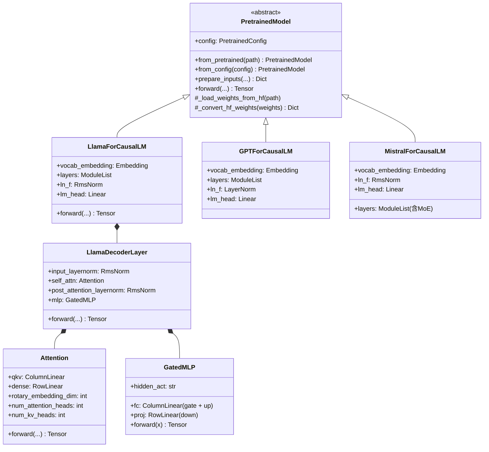
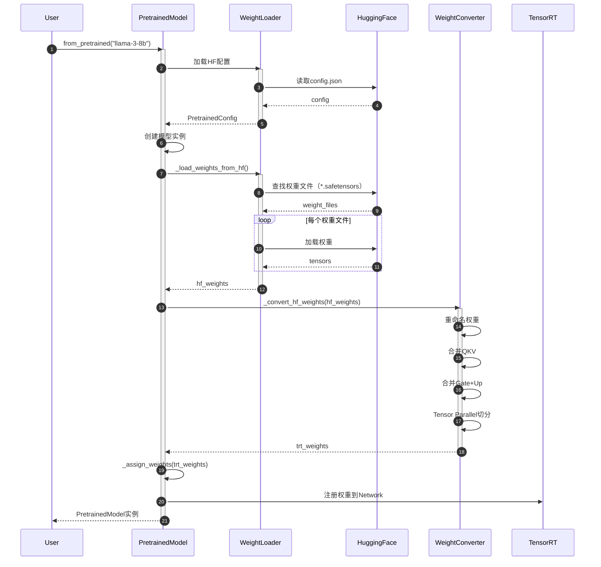

# TensorRT-LLM-05-Models模块-深度剖析

## 一、模块概览

### 1.1 模块定位

Models 模块包含各种LLM架构的TensorRT-LLM实现，每个模型实现都遵循统一的`PretrainedModel`接口，支持从HuggingFace checkpoint加载和TensorRT引擎构建。

**核心职责：**
- 模型架构实现：Llama、GPT、Mistral、DeepSeek等
- 权重转换：HuggingFace格式→TensorRT格式
- 网络构建：定义TensorRT网络图
- 量化支持：FP8、INT8、INT4等
- 并行支持：Tensor Parallel、Pipeline Parallel

### 1.2 支持的模型架构

| 架构系列 | 具体模型 | 特性 |
|---------|---------|------|
| Llama | Llama 2/3/3.1/3.2 | Decoder-only, RoPE, GQA |
| GPT | GPT-2, GPT-J, GPT-NeoX | 经典Transformer |
| Mistral | Mistral 7B, Mixtral 8x7B | Sliding Window, MoE |
| DeepSeek | DeepSeek V2/V3 | MLA, MoE, Yarn RoPE |
| Qwen | Qwen 1.5/2/2.5 | 多语言, 长上下文 |
| Phi | Phi-2/Phi-3 | 小模型, 高性能 |
| Gemma | Gemma 2B/7B | Google开源 |
| ChatGLM | ChatGLM2/3 | 中文优化 |

### 1.3 模块架构

```
tensorrt_llm/models/
├── llama/                          # Llama系列
│   ├── config.py                   # 配置定义
│   ├── model.py                    # 模型实现
│   ├── convert.py                  # 权重转换
│   └── weight.py                   # 权重加载
│
├── gpt/                            # GPT系列
│   └── ...
│
├── mistral/                        # Mistral系列
│   └── ...
│
├── modeling_utils.py               # 通用工具
│   ├── PretrainedModel             # 模型基类
│   ├── PretrainedConfig            # 配置基类
│   └── QuantConfig                 # 量化配置
│
└── modeling_chatglm.py, ...        # 其他模型实现
```

## 二、核心API详细剖析

### 2.1 PretrainedModel基类

#### 2.1.1 类定义

```python
class PretrainedModel(Module):
    """
    所有模型的抽象基类
    
    核心方法：
    - from_pretrained(): 从HF checkpoint加载
    - from_config(): 从配置创建
    - prepare_inputs(): 准备TRT网络输入
    - forward(): 定义前向传播（构建TRT图）
    """
    config_class: Type[PretrainedConfig] = None
    
    @classmethod
    def from_pretrained(
        cls,
        pretrained_model_name_or_path: str,
        config: Optional[PretrainedConfig] = None,
        **kwargs
    ) -> "PretrainedModel":
        """
        从预训练模型加载
        
        Args:
            pretrained_model_name_or_path: HF模型名或本地路径
            config: 可选的配置覆盖
            
        Returns:
            PretrainedModel实例
        """
```

#### 2.1.2 from_pretrained()实现

```python
@classmethod
def from_pretrained(cls, pretrained_model_name_or_path, config=None, **kwargs):
    # 1. 加载配置
    if config is None:
        config = cls.config_class.from_hugging_face(
            pretrained_model_name_or_path
        )
    
    # 2. 应用自定义配置
    for key, value in kwargs.items():
        if hasattr(config, key):
            setattr(config, key, value)
    
    # 3. 创建模型实例
    model = cls(config)
    
    # 4. 加载权重
    model._load_weights_from_hf(pretrained_model_name_or_path)
    
    return model

def _load_weights_from_hf(self, model_dir):
    """
    从HuggingFace checkpoint加载权重
    """
    import safetensors
    
    # 1. 查找权重文件
    weight_files = list(Path(model_dir).glob("*.safetensors"))
    if not weight_files:
        weight_files = list(Path(model_dir).glob("*.bin"))
    
    # 2. 加载权重
    weights = {}
    for weight_file in weight_files:
        if weight_file.suffix == ".safetensors":
            with safetensors.safe_open(weight_file, framework="pt") as f:
                for key in f.keys():
                    weights[key] = f.get_tensor(key)
        else:
            weights.update(torch.load(weight_file, map_location="cpu"))
    
    # 3. 转换权重名称（HF格式→TRT-LLM格式）
    converted_weights = self._convert_hf_weights(weights)
    
    # 4. 分配权重到模型参数
    self._assign_weights(converted_weights)
```

#### 2.1.3 prepare_inputs()方法

```python
def prepare_inputs(
    self,
    max_batch_size: int,
    max_input_len: int,
    max_seq_len: int,
    *,
    use_cache: bool = True,
    max_beam_width: int = 1,
    max_num_tokens: int = None,
    prompt_embedding_table_size: int = 0,
) -> Dict[str, Tensor]:
    """
    准备TensorRT网络输入
    
    Args:
        max_batch_size: 最大批次大小
        max_input_len: 最大输入长度
        max_seq_len: 最大序列长度
        
    Returns:
        输入张量字典，键为张量名，值为Tensor对象
    """
    # 1. 创建input_ids
    input_ids = Tensor(
        name='input_ids',
        dtype=trt.int32,
        shape=[-1],  # 动态形状
        dim_range=OrderedDict([
            ('batch_size_beam_width', [1, (max_batch_size * max_beam_width) // 2, max_batch_size * max_beam_width]),
            ('input_len', [1, max_input_len // 2, max_input_len]),
        ])
    )
    
    # 2. 创建context_lengths
    context_lengths = Tensor(
        name='context_lengths',
        dtype=trt.int32,
        shape=[-1],
        dim_range=OrderedDict([
            ('batch_size_beam_width', [1, (max_batch_size * max_beam_width) // 2, max_batch_size * max_beam_width]),
        ])
    )
    
    # 3. 创建position_ids
    position_ids = Tensor(
        name='position_ids',
        dtype=trt.int32,
        shape=[-1],
        dim_range=OrderedDict([
            ('batch_size_beam_width', [1, (max_batch_size * max_beam_width) // 2, max_batch_size * max_beam_width]),
            ('input_len', [1, max_input_len // 2, max_input_len]),
        ])
    )
    
    # 4. KV Cache相关输入
    if use_cache:
        # past_key_value（用于Generation阶段）
        # kv_cache_block_offsets（Paged KV Cache）
        # host_kv_cache_block_offsets
        # ...
        pass
    
    # 5. 其他输入
    # - attention_mask
    # - last_token_ids
    # - prompt_embedding_table
    # ...
    
    return {
        'input_ids': input_ids,
        'context_lengths': context_lengths,
        'position_ids': position_ids,
        # ... 其他输入
    }
```

### 2.2 LlamaForCausalLM模型

#### 2.2.1 类定义

```python
class LlamaForCausalLM(PretrainedModel):
    """
    Llama模型实现
    
    架构：
    - Embedding: vocab_embedding
    - Decoder Layers: transformer.layers (N层)
      - Attention: self_attn (Multi-Head或Grouped-Query)
      - MLP: mlp (Gate, Up, Down投影)
      - LayerNorm: input_layernorm, post_attention_layernorm
    - Output: lm_head
    """
    config_class = LlamaConfig
    
    def __init__(self, config: LlamaConfig):
        super().__init__(config)
        
        # 1. Embedding层
        self.vocab_embedding = Embedding(
            num_embeddings=config.vocab_size,
            embedding_dim=config.hidden_size,
            dtype=config.dtype,
        )
        
        # 2. Transformer层
        self.layers = ModuleList([
            LlamaDecoderLayer(config, layer_idx=i)
            for i in range(config.num_hidden_layers)
        ])
        
        # 3. 最终LayerNorm
        self.ln_f = RmsNorm(
            normalized_shape=config.hidden_size,
            eps=config.norm_epsilon,
            dtype=config.dtype,
        )
        
        # 4. LM Head
        self.lm_head = ColumnLinear(
            in_features=config.hidden_size,
            out_features=config.vocab_size,
            bias=False,
            dtype=config.dtype,
            tp_group=config.mapping.tp_group,
            tp_size=config.mapping.tp_size,
        )
```

#### 2.2.2 forward()方法

```python
def forward(
    self,
    input_ids: Tensor,
    position_ids: Tensor = None,
    use_cache: bool = False,
    kv_cache_params: KeyValueCacheParams = None,
    attention_params: AttentionParams = None,
) -> Union[Tensor, Tuple[Tensor, Tuple[Tensor, ...]]]:
    """
    前向传播（构建TensorRT网络图）
    
    Args:
        input_ids: [batch, seq_len]
        position_ids: [batch, seq_len]
        use_cache: 是否使用KV Cache
        
    Returns:
        logits: [batch, seq_len, vocab_size]
    """
    # 1. Embedding
    hidden_states = self.vocab_embedding(input_ids)  # [batch, seq_len, hidden]
    
    # 2. Transformer层
    presents = []
    for layer in self.layers:
        hidden_states, present = layer(
            hidden_states,
            position_ids=position_ids,
            use_cache=use_cache,
            kv_cache_params=kv_cache_params,
            attention_params=attention_params,
        )
        if use_cache:
            presents.append(present)
    
    # 3. 最终LayerNorm
    hidden_states = self.ln_f(hidden_states)
    
    # 4. LM Head
    logits = self.lm_head(hidden_states)  # [batch, seq_len, vocab]
    
    if use_cache:
        return logits, tuple(presents)
    return logits
```

#### 2.2.3 LlamaDecoderLayer实现

```python
class LlamaDecoderLayer(Module):
    """
    Llama Decoder层
    
    结构：
    Input
      ├─> LayerNorm
      ├─> Attention
      ├─> Residual Add
      ├─> LayerNorm
      ├─> MLP
      └─> Residual Add
    Output
    """
    def __init__(self, config: LlamaConfig, layer_idx: int):
        super().__init__()
        
        # 1. Pre-Attention LayerNorm
        self.input_layernorm = RmsNorm(
            normalized_shape=config.hidden_size,
            eps=config.norm_epsilon,
        )
        
        # 2. Self-Attention
        self.self_attn = Attention(
            hidden_size=config.hidden_size,
            num_attention_heads=config.num_attention_heads,
            num_kv_heads=config.num_key_value_heads,  # GQA
            max_position_embeddings=config.max_position_embeddings,
            dtype=config.dtype,
            attention_mask_type=AttentionMaskType.causal,
            position_embedding_type=PositionEmbeddingType.rope_gpt_neox,
            rotary_embedding_base=config.rotary_base,
            tp_group=config.mapping.tp_group,
            tp_size=config.mapping.tp_size,
        )
        
        # 3. Pre-MLP LayerNorm
        self.post_attention_layernorm = RmsNorm(
            normalized_shape=config.hidden_size,
            eps=config.norm_epsilon,
        )
        
        # 4. MLP (Gate, Up, Down)
        self.mlp = GatedMLP(
            hidden_size=config.hidden_size,
            ffn_hidden_size=config.intermediate_size,
            hidden_act=config.hidden_act,  # "silu"
            dtype=config.dtype,
            tp_group=config.mapping.tp_group,
            tp_size=config.mapping.tp_size,
        )
    
    def forward(
        self,
        hidden_states: Tensor,
        position_ids: Tensor = None,
        use_cache: bool = False,
        kv_cache_params: KeyValueCacheParams = None,
        attention_params: AttentionParams = None,
    ):
        # 1. Pre-Attention LayerNorm
        residual = hidden_states
        hidden_states = self.input_layernorm(hidden_states)
        
        # 2. Self-Attention
        attention_output, present_kv = self.self_attn(
            hidden_states,
            position_ids=position_ids,
            use_cache=use_cache,
            kv_cache_params=kv_cache_params,
            attention_params=attention_params,
        )
        
        # 3. Residual连接
        hidden_states = residual + attention_output
        
        # 4. Pre-MLP LayerNorm
        residual = hidden_states
        hidden_states = self.post_attention_layernorm(hidden_states)
        
        # 5. MLP
        mlp_output = self.mlp(hidden_states)
        
        # 6. Residual连接
        hidden_states = residual + mlp_output
        
        return hidden_states, present_kv
```

### 2.3 权重转换

#### 2.3.1 _convert_hf_weights()实现

```python
def _convert_hf_weights(self, hf_weights: Dict[str, torch.Tensor]) -> Dict[str, torch.Tensor]:
    """
    转换HuggingFace权重为TensorRT-LLM格式
    
    HF格式:
    - model.embed_tokens.weight
    - model.layers.0.self_attn.q_proj.weight
    - model.layers.0.self_attn.k_proj.weight
    - model.layers.0.self_attn.v_proj.weight
    - model.layers.0.self_attn.o_proj.weight
    - model.layers.0.mlp.gate_proj.weight
    - model.layers.0.mlp.up_proj.weight
    - model.layers.0.mlp.down_proj.weight
    - model.norm.weight
    - lm_head.weight
    
    TRT-LLM格式:
    - vocab_embedding.weight
    - layers.0.attention.qkv.weight (合并Q, K, V)
    - layers.0.attention.dense.weight (即o_proj)
    - layers.0.mlp.fc.weight (合并gate和up)
    - layers.0.mlp.proj.weight (即down_proj)
    - ln_f.weight
    - lm_head.weight
    """
    trt_weights = {}
    tp_size = self.config.mapping.tp_size
    tp_rank = self.config.mapping.tp_rank
    
    # 1. Embedding
    trt_weights['vocab_embedding.weight'] = hf_weights['model.embed_tokens.weight']
    
    # 2. Transformer层
    for layer_idx in range(self.config.num_hidden_layers):
        prefix_hf = f'model.layers.{layer_idx}'
        prefix_trt = f'layers.{layer_idx}'
        
        # 2.1 Attention QKV合并
        q_weight = hf_weights[f'{prefix_hf}.self_attn.q_proj.weight']
        k_weight = hf_weights[f'{prefix_hf}.self_attn.k_proj.weight']
        v_weight = hf_weights[f'{prefix_hf}.self_attn.v_proj.weight']
        
        # Tensor Parallel切分
        if tp_size > 1:
            # Q: [hidden, hidden] → [hidden, hidden/tp_size]
            q_weight = self._split_tensor_parallel(q_weight, dim=0, rank=tp_rank, world_size=tp_size)
            # K, V: 同样切分
            k_weight = self._split_tensor_parallel(k_weight, dim=0, rank=tp_rank, world_size=tp_size)
            v_weight = self._split_tensor_parallel(v_weight, dim=0, rank=tp_rank, world_size=tp_size)
        
        # 合并QKV
        qkv_weight = torch.cat([q_weight, k_weight, v_weight], dim=0)
        trt_weights[f'{prefix_trt}.attention.qkv.weight'] = qkv_weight
        
        # 2.2 Attention Dense (O投影)
        o_weight = hf_weights[f'{prefix_hf}.self_attn.o_proj.weight']
        if tp_size > 1:
            # O: [hidden, hidden] → [hidden/tp_size, hidden]（列切分）
            o_weight = self._split_tensor_parallel(o_weight, dim=1, rank=tp_rank, world_size=tp_size)
        trt_weights[f'{prefix_trt}.attention.dense.weight'] = o_weight
        
        # 2.3 MLP Gate和Up合并
        gate_weight = hf_weights[f'{prefix_hf}.mlp.gate_proj.weight']
        up_weight = hf_weights[f'{prefix_hf}.mlp.up_proj.weight']
        if tp_size > 1:
            gate_weight = self._split_tensor_parallel(gate_weight, dim=0, rank=tp_rank, world_size=tp_size)
            up_weight = self._split_tensor_parallel(up_weight, dim=0, rank=tp_rank, world_size=tp_size)
        fc_weight = torch.cat([gate_weight, up_weight], dim=0)
        trt_weights[f'{prefix_trt}.mlp.fc.weight'] = fc_weight
        
        # 2.4 MLP Down投影
        down_weight = hf_weights[f'{prefix_hf}.mlp.down_proj.weight']
        if tp_size > 1:
            down_weight = self._split_tensor_parallel(down_weight, dim=1, rank=tp_rank, world_size=tp_size)
        trt_weights[f'{prefix_trt}.mlp.proj.weight'] = down_weight
        
        # 2.5 LayerNorm
        trt_weights[f'{prefix_trt}.input_layernorm.weight'] = hf_weights[f'{prefix_hf}.input_layernorm.weight']
        trt_weights[f'{prefix_trt}.post_attention_layernorm.weight'] = hf_weights[f'{prefix_hf}.post_attention_layernorm.weight']
    
    # 3. 最终LayerNorm
    trt_weights['ln_f.weight'] = hf_weights['model.norm.weight']
    
    # 4. LM Head
    lm_head_weight = hf_weights['lm_head.weight']
    if tp_size > 1:
        lm_head_weight = self._split_tensor_parallel(lm_head_weight, dim=0, rank=tp_rank, world_size=tp_size)
    trt_weights['lm_head.weight'] = lm_head_weight
    
    return trt_weights
```

## 三、关键功能深度剖析

### 3.1 Grouped-Query Attention (GQA)

#### 3.1.1 原理

```
Multi-Head Attention (MHA):
Q: 32 heads, K: 32 heads, V: 32 heads
问题：KV Cache占用大（需存储32个K和V）

Grouped-Query Attention (GQA):
Q: 32 heads, K: 8 heads, V: 8 heads
- 每4个Q heads共享1对KV heads
- KV Cache减少75%
- 性能损失<1%

Multi-Query Attention (MQA):
Q: 32 heads, K: 1 head, V: 1 head
- 所有Q heads共享1对KV heads
- KV Cache减少96.875%
- 性能损失~2%
```

#### 3.1.2 实现

```python
class Attention(Module):
    def __init__(
        self,
        num_attention_heads: int = 32,
        num_kv_heads: int = 8,  # GQA: 8, MQA: 1, MHA: 32
        **kwargs
    ):
        self.num_attention_heads = num_attention_heads
        self.num_kv_heads = num_kv_heads
        self.num_heads_per_kv = num_attention_heads // num_kv_heads
        
        # QKV投影
        self.qkv = ColumnLinear(
            in_features=hidden_size,
            out_features=(num_attention_heads + 2 * num_kv_heads) * head_size,
            # Q: num_attention_heads * head_size
            # K: num_kv_heads * head_size
            # V: num_kv_heads * head_size
        )
    
    def forward(self, hidden_states):
        # 1. QKV投影
        qkv = self.qkv(hidden_states)  # [batch, seq, (num_heads + 2*num_kv_heads) * head_size]
        
        # 2. 分离Q, K, V
        q_size = self.num_attention_heads * self.head_size
        kv_size = self.num_kv_heads * self.head_size
        q = qkv[:, :, :q_size]
        k = qkv[:, :, q_size:q_size+kv_size]
        v = qkv[:, :, q_size+kv_size:]
        
        # 3. Reshape
        q = q.view(batch, seq, self.num_attention_heads, self.head_size)
        k = k.view(batch, seq, self.num_kv_heads, self.head_size)
        v = v.view(batch, seq, self.num_kv_heads, self.head_size)
        
        # 4. 扩展KV（重复以匹配Q的heads）
        if self.num_heads_per_kv > 1:
            k = k.repeat_interleave(self.num_heads_per_kv, dim=2)
            v = v.repeat_interleave(self.num_heads_per_kv, dim=2)
        
        # 5. Attention计算
        # ... (Flash Attention或标准Attention)
```

### 3.2 RoPE位置编码

#### 3.2.1 原理

```
旋转位置编码（Rotary Position Embedding）
- 不添加绝对位置编码
- 在Q和K上应用旋转变换
- 隐式编码相对位置信息

公式：
q_m = R(θ, m) * q
k_n = R(θ, n) * k
其中 R(θ, m) 是旋转矩阵，m是位置索引

优势：
- 外推性好（可处理超过训练长度的序列）
- 相对位置编码
- 无需额外参数
```

#### 3.2.2 实现

```python
def apply_rotary_pos_emb(
    q: Tensor,  # [batch, seq, num_heads, head_dim]
    k: Tensor,
    position_ids: Tensor,  # [batch, seq]
    rotary_base: float = 10000.0,
):
    """
    应用RoPE
    """
    # 1. 计算频率
    dim = q.shape[-1]
    inv_freq = 1.0 / (rotary_base ** (torch.arange(0, dim, 2).float() / dim))
    
    # 2. 计算旋转角度
    freqs = position_ids.unsqueeze(-1) * inv_freq  # [batch, seq, dim/2]
    
    # 3. 构建旋转矩阵（使用复数表示）
    emb = torch.cat([freqs, freqs], dim=-1)  # [batch, seq, dim]
    cos = emb.cos()
    sin = emb.sin()
    
    # 4. 应用旋转
    def rotate_half(x):
        x1, x2 = x[..., :dim//2], x[..., dim//2:]
        return torch.cat([-x2, x1], dim=-1)
    
    q_embed = (q * cos) + (rotate_half(q) * sin)
    k_embed = (k * cos) + (rotate_half(k) * sin)
    
    return q_embed, k_embed
```

### 3.3 MoE (Mixture of Experts)

#### 3.3.1 Mixtral架构

```
传统FFN:
Input → Gate(W1) * Up(W2) → SiLU → Down(W3) → Output
参数量: 3 * hidden * ffn_hidden

MoE FFN (Mixtral 8x7B):
Input → Router (选择2个experts)
  ├─> Expert 0 (W1_0, W2_0, W3_0)  权重 w0
  ├─> Expert 1 (W1_1, W2_1, W3_1)  权重 w1
  ├─> ...
  └─> Expert 7 (W1_7, W2_7, W3_7)
Output = w0 * Expert_0(Input) + w1 * Expert_1(Input)

参数量: 8 * (3 * hidden * ffn_hidden) = 56B
激活参数: 2 * (3 * hidden * ffn_hidden) = 14B（每次只用2个experts）
```

#### 3.3.2 实现

```python
class MixtralMoE(Module):
    def __init__(
        self,
        num_experts: int = 8,
        top_k: int = 2,
        hidden_size: int = 4096,
        ffn_hidden_size: int = 14336,
    ):
        # 1. Router（门控网络）
        self.gate = RowLinear(
            in_features=hidden_size,
            out_features=num_experts,
            bias=False,
        )
        
        # 2. Experts
        self.experts = ModuleList([
            GatedMLP(hidden_size, ffn_hidden_size)
            for _ in range(num_experts)
        ])
        
        self.top_k = top_k
    
    def forward(self, hidden_states):
        batch, seq, hidden = hidden_states.shape
        
        # 1. Router计算（选择top-k experts）
        router_logits = self.gate(hidden_states)  # [batch, seq, num_experts]
        router_probs = F.softmax(router_logits, dim=-1)
        
        # 2. 选择top-k
        top_k_probs, top_k_indices = torch.topk(router_probs, self.top_k, dim=-1)
        # top_k_probs: [batch, seq, top_k]
        # top_k_indices: [batch, seq, top_k]
        
        # 3. 归一化权重
        top_k_probs = top_k_probs / top_k_probs.sum(dim=-1, keepdim=True)
        
        # 4. 计算expert输出
        output = torch.zeros_like(hidden_states)
        for k in range(self.top_k):
            expert_idx = top_k_indices[:, :, k]  # [batch, seq]
            expert_weight = top_k_probs[:, :, k:k+1]  # [batch, seq, 1]
            
            # 对每个expert分别计算
            for i in range(self.num_experts):
                mask = (expert_idx == i)  # [batch, seq]
                if mask.any():
                    expert_input = hidden_states[mask]
                    expert_output = self.experts[i](expert_input)
                    output[mask] += expert_weight[mask] * expert_output
        
        return output
```

## 四、数据结构UML图

### 4.1 模型类层次结构



### 4.2 权重转换流程



## 五、使用示例

### 5.1 加载和构建Llama模型

```python
from tensorrt_llm.models import LlamaForCausalLM
from tensorrt_llm import build, BuildConfig

# 1. 从HuggingFace加载
model = LlamaForCausalLM.from_pretrained("meta-llama/Llama-3-8B")

# 2. 配置并行
model.config.mapping = Mapping(
    world_size=4,
    tp_size=4,
    pp_size=1,
)

# 3. 构建引擎
build_config = BuildConfig(
    max_batch_size=16,
    max_input_len=2048,
    max_seq_len=4096,
)
engine = build(model, build_config)

# 4. 保存
engine.save("./llama-3-8b-engine")
```

### 5.2 自定义模型配置

```python
from tensorrt_llm.models import LlamaConfig, LlamaForCausalLM

# 自定义配置
config = LlamaConfig(
    vocab_size=32000,
    hidden_size=4096,
    num_hidden_layers=32,
    num_attention_heads=32,
    num_key_value_heads=8,  # GQA
    intermediate_size=11008,
    hidden_act="silu",
    max_position_embeddings=4096,
    dtype="float16",
)

# 创建模型
model = LlamaForCausalLM(config)
```

### 5.3 量化模型

```python
from tensorrt_llm.models import LlamaForCausalLM
from tensorrt_llm.quantization import quantize

# 加载模型
model = LlamaForCausalLM.from_pretrained("meta-llama/Llama-3-8B")

# FP8量化
model = quantize(model, "fp8")

# 或INT4 AWQ量化
model = quantize(model, "int4_awq", calib_dataset=calib_data)

# 构建引擎
engine = build(model, build_config)
```

## 六、常见问题

**Q1：如何添加新模型架构？**
1. 继承`PretrainedModel`
2. 实现`from_pretrained()`和`_convert_hf_weights()`
3. 实现`forward()`定义网络图
4. 添加配置类继承`PretrainedConfig`

**Q2：GQA如何影响性能？**
- KV Cache大小减少：32 heads → 8 heads，减少75%
- 推理速度提升：内存带宽降低
- 精度损失：<1%

**Q3：MoE模型如何部署？**
- 所有experts都需要加载到显存
- 使用Expert Parallelism分片experts到多GPU
- Tensor Parallel + Expert Parallel组合

---

**文档版本：** 2.0（深度剖析版）  
**生成时间：** 2025-10-05  
**对应代码版本：** TensorRT-LLM v1.2.0rc1
