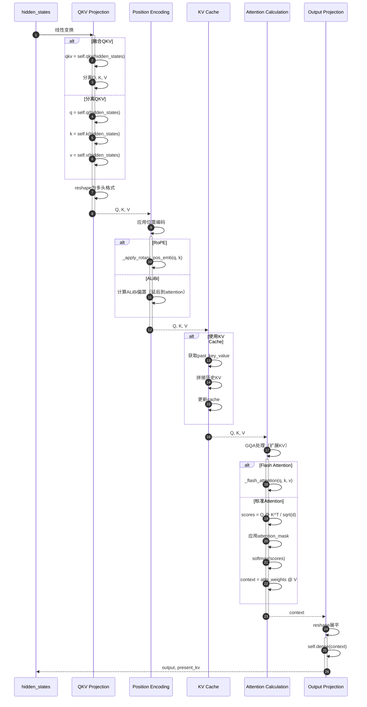
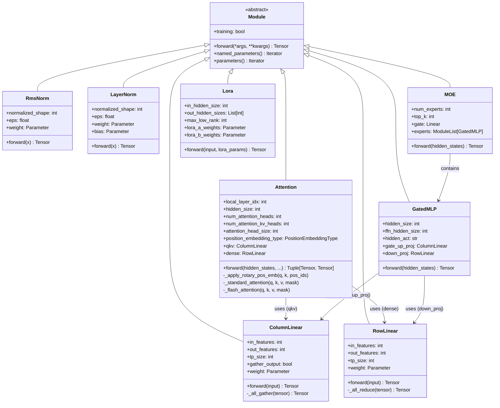
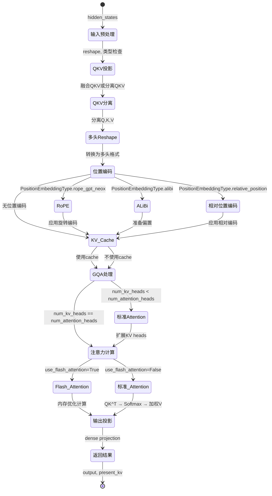

# TensorRT-LLM-06-Layers模块-深度剖析

## 一、模块概览

### 1.1 模块定位

Layers 模块是 TensorRT-LLM 的基础组件层，提供了构建大语言模型所需的各种神经网络层，包括Attention、MLP、Normalization、Embedding等。每个层都经过TensorRT优化，支持混合精度、量化和并行计算。

**核心职责：**
- 基础层实现：Attention、MLP、LayerNorm、Embedding
- TensorRT优化：自定义kernel、层融合、内存优化
- 并行支持：Tensor Parallel、Pipeline Parallel
- 量化支持：FP8、INT8、INT4等
- 特殊架构：MoE、Mamba、RoPE、ALiBi等

### 1.2 模块架构

```
tensorrt_llm/layers/
├── attention.py                    # Attention层实现
│   ├── Attention                   # 通用Attention
│   ├── BertAttention              # BERT风格Attention
│   ├── DeepseekV2Attention        # DeepSeek V2 MLA
│   └── CogVLMAttention           # CogVLM多模态Attention
│
├── mlp.py                         # MLP层实现
│   ├── MLP                        # 标准MLP
│   ├── GatedMLP                   # 门控MLP（SwiGLU等）
│   └── FusedGatedMLP             # 融合门控MLP
│
├── normalization.py               # 标准化层
│   ├── LayerNorm                  # 标准LayerNorm
│   ├── RmsNorm                    # RMS LayerNorm
│   └── GroupNorm                  # Group Normalization
│
├── linear.py                      # 线性层
│   ├── Linear                     # 标准线性层
│   ├── ColumnLinear              # 列并行线性层
│   └── RowLinear                 # 行并行线性层
│
├── embedding.py                   # 嵌入层
│   ├── Embedding                  # 标准嵌入层
│   └── PromptTuningEmbedding     # Prompt Tuning嵌入
│
├── moe.py                         # MoE层
│   ├── MOE                        # Mixture of Experts
│   ├── MoeConfig                  # MoE配置
│   └── SharedMoE                  # 共享MoE
│
├── ssm.py                         # 状态空间模型
│   ├── Mamba                      # Mamba架构
│   └── Mamba2                     # Mamba2架构
│
└── lora.py                        # LoRA层
    ├── Lora                       # LoRA实现
    └── LoraParams                 # LoRA参数
```

### 1.3 层分类

| 类别 | 层名称 | 功能 | 使用场景 |
|-----|--------|------|---------|
| **注意力层** | Attention | 多头自注意力 | 所有Transformer模型 |
| | BertAttention | BERT风格注意力 | BERT系列模型 |
| | DeepseekV2Attention | Multi-Head Latent Attention | DeepSeek V2 |
| **MLP层** | MLP | 标准前馈网络 | 传统Transformer |
| | GatedMLP | 门控MLP | Llama、Mistral等 |
| | FusedGatedMLP | 融合门控MLP | 性能优化版本 |
| **标准化层** | LayerNorm | 层标准化 | GPT系列 |
| | RmsNorm | RMS标准化 | Llama系列 |
| **线性层** | Linear | 标准线性变换 | 通用 |
| | ColumnLinear | 列并行线性层 | Tensor Parallel |
| | RowLinear | 行并行线性层 | Tensor Parallel |
| **特殊层** | MOE | 专家混合 | Mixtral等 |
| | Mamba | 状态空间模型 | Mamba架构 |
| | Lora | 低秩适配 | 参数高效微调 |

## 二、核心API详细剖析

### 2.1 Attention层

#### 2.1.1 类定义

```python
class Attention(Module):
    """
    多头自注意力层
    
    支持特性：
    - Multi-Head Attention (MHA)
    - Grouped-Query Attention (GQA) 
    - Multi-Query Attention (MQA)
    - RoPE、ALiBi等位置编码
    - Flash Attention优化
    - KV Cache
    - Tensor Parallel并行
    """
    
    def __init__(
        self,
        *,
        local_layer_idx: int,                    # 层索引
        hidden_size: int,                        # 隐藏层维度
        num_attention_heads: int,                # 注意力头数
        num_kv_heads: int = None,               # KV头数（GQA/MQA）
        max_position_embeddings: int = 1024,     # 最大位置编码
        attention_head_size: int = None,         # 注意力头维度
        attention_mask_type: AttentionMaskType = AttentionMaskType.padding,
        position_embedding_type: PositionEmbeddingType = PositionEmbeddingType.learned_absolute,
        rotary_embedding_base: float = 10000.0, # RoPE基数
        bias: bool = True,                       # 是否使用bias
        dtype = None,                           # 数据类型
        tp_group = None,                        # TP通信组
        tp_size: int = 1,                       # TP并行度
        quant_mode: QuantMode = QuantMode(0),   # 量化模式
        **kwargs
    ):
```

#### 2.1.2 核心参数详解

**注意力配置**

| 参数 | 类型 | 说明 | 示例 |
|-----|------|------|------|
| num_attention_heads | int | Query头数 | 32（Llama-7B） |
| num_kv_heads | int | Key/Value头数 | 8（GQA），1（MQA），32（MHA） |
| attention_head_size | int | 每个头的维度 | 128（4096/32） |
| max_position_embeddings | int | 最大序列长度 | 2048, 4096, 8192 |

**位置编码类型**

| 类型 | 说明 | 使用模型 |
|-----|------|---------|
| learned_absolute | 学习的绝对位置编码 | GPT-2 |
| rope_gpt_neox | RoPE（GPT-NeoX风格） | Llama, Mistral |
| alibi | ALiBi线性偏置 | PaLM, BLOOM |
| relative_position | 相对位置编码 | T5 |

#### 2.1.3 forward()方法实现

```python
def forward(
    self,
    hidden_states: Tensor,                    # [batch, seq_len, hidden_size]
    attention_mask: Tensor = None,            # 注意力掩码
    use_cache: bool = False,                  # 是否使用KV Cache
    kv_cache_params: KeyValueCacheParams = None, # KV Cache参数
    attention_params: AttentionParams = None,  # 注意力参数
    lora_layer_params: LoraRuntimeParams = None, # LoRA参数
    **kwargs
) -> Tuple[Tensor, Optional[Tensor]]:
    """
    Attention前向传播
    
    Returns:
        context: [batch, seq_len, hidden_size]
        present_key_value: KV Cache（可选）
    """
    
    # 1. QKV投影
    batch_size, seq_len, hidden_size = hidden_states.size()
    
    # 1.1 QKV线性变换
    if self.cross_attention:
        # Cross Attention：Q来自decoder，KV来自encoder
        q = self.q(hidden_states)  # [batch, seq_len, num_q_heads * head_size]
        k = self.k(encoder_hidden_states)
        v = self.v(encoder_hidden_states)
    else:
        # Self Attention：QKV都来自同一输入
        if hasattr(self, 'qkv'):
            # 融合QKV投影（性能更好）
            qkv = self.qkv(hidden_states)  # [batch, seq_len, (num_q_heads + 2*num_kv_heads) * head_size]
            
            # 分离Q, K, V
            q_size = self.num_attention_heads * self.attention_head_size
            kv_size = self.num_attention_kv_heads * self.attention_head_size
            q = qkv[:, :, :q_size]
            k = qkv[:, :, q_size:q_size + kv_size]
            v = qkv[:, :, q_size + kv_size:]
        else:
            # 分离QKV投影
            q = self.q(hidden_states)
            k = self.k(hidden_states)
            v = self.v(hidden_states)
    
    # 1.2 Reshape为多头格式
    q = q.view(batch_size, seq_len, self.num_attention_heads, self.attention_head_size)
    k = k.view(batch_size, seq_len, self.num_attention_kv_heads, self.attention_head_size)
    v = v.view(batch_size, seq_len, self.num_attention_kv_heads, self.attention_head_size)
    
    # 2. 位置编码
    if self.position_embedding_type == PositionEmbeddingType.rope_gpt_neox:
        # RoPE位置编码
        q, k = self._apply_rotary_pos_emb(q, k, position_ids)
        
    elif self.position_embedding_type == PositionEmbeddingType.alibi:
        # ALiBi位置编码（在注意力计算中添加）
        pass
    
    # 3. KV Cache处理
    if use_cache:
        if kv_cache_params is not None:
            # 从cache中获取past_key_value
            past_key_value = kv_cache_params.get_cache_kv(self.local_layer_idx)
            if past_key_value is not None:
                past_k, past_v = past_key_value
                k = torch.cat([past_k, k], dim=-2)  # 在seq_len维度拼接
                v = torch.cat([past_v, v], dim=-2)
            
            # 更新cache
            kv_cache_params.update_cache_kv(self.local_layer_idx, (k, v))
    
    # 4. Grouped-Query Attention处理
    if self.num_attention_kv_heads < self.num_attention_heads:
        # GQA/MQA：扩展KV以匹配Q的头数
        num_heads_per_kv = self.num_attention_heads // self.num_attention_kv_heads
        k = k.repeat_interleave(num_heads_per_kv, dim=2)
        v = v.repeat_interleave(num_heads_per_kv, dim=2)
    
    # 5. Attention计算
    if self.use_flash_attention:
        # Flash Attention（内存高效）
        context = self._flash_attention(q, k, v, attention_mask)
    else:
        # 标准Attention
        context = self._standard_attention(q, k, v, attention_mask)
    
    # 6. 输出投影
    context = context.view(batch_size, seq_len, self.attention_hidden_size)
    output = self.dense(context)  # [batch, seq_len, hidden_size]
    
    # 7. 返回结果
    present_key_value = (k, v) if use_cache else None
    return output, present_key_value

def _standard_attention(self, q, k, v, attention_mask):
    """
    标准注意力计算
    """
    # 1. 计算注意力分数
    # q: [batch, seq_len, num_heads, head_size]
    # k: [batch, seq_len, num_heads, head_size]
    scores = torch.matmul(q, k.transpose(-2, -1))  # [batch, num_heads, seq_len, seq_len]
    scores = scores / math.sqrt(self.attention_head_size)  # 缩放
    
    # 2. 添加位置编码偏置
    if self.position_embedding_type == PositionEmbeddingType.alibi:
        alibi_biases = self._compute_alibi_biases(seq_len)
        scores = scores + alibi_biases
    
    # 3. 应用注意力掩码
    if attention_mask is not None:
        scores = scores + attention_mask  # 掩码位置设为-inf
    
    # 4. Softmax
    attn_weights = torch.softmax(scores, dim=-1)
    
    # 5. 应用Dropout（训练时）
    if self.training:
        attn_weights = self.dropout(attn_weights)
    
    # 6. 加权求和
    context = torch.matmul(attn_weights, v)  # [batch, num_heads, seq_len, head_size]
    
    return context

def _apply_rotary_pos_emb(self, q, k, position_ids):
    """
    应用RoPE位置编码
    """
    # 1. 计算旋转角度
    inv_freq = 1.0 / (self.rotary_embedding_base ** 
                      (torch.arange(0, self.attention_head_size, 2).float() / self.attention_head_size))
    
    # 2. 构建旋转矩阵
    freqs = position_ids.unsqueeze(-1) * inv_freq
    cos = freqs.cos()
    sin = freqs.sin()
    
    # 3. 应用旋转
    def rotate_half(x):
        x1, x2 = x[..., :x.shape[-1]//2], x[..., x.shape[-1]//2:]
        return torch.cat([-x2, x1], dim=-1)
    
    q_embed = (q * cos) + (rotate_half(q) * sin)
    k_embed = (k * cos) + (rotate_half(k) * sin)
    
    return q_embed, k_embed
```

#### 2.1.4 时序图



### 2.2 GatedMLP层

#### 2.2.1 类定义

```python
class GatedMLP(Module):
    """
    门控MLP层（如SwiGLU）
    
    架构：
    Input → Gate(W1) * Up(W2) → Activation → Down(W3) → Output
    
    其中：
    - Gate和Up投影并行计算
    - 激活函数通常为SiLU/Swish
    - 支持SwiGLU、GeGELU等变体
    """
    
    def __init__(
        self,
        hidden_size: int,                    # 输入/输出维度
        ffn_hidden_size: int,               # 中间层维度（通常是hidden_size的2.67倍）
        hidden_act: str,                    # 激活函数（"silu", "gelu", "swiglu"等）
        bias: bool = True,                  # 是否使用bias
        dtype = None,                       # 数据类型
        tp_group = None,                    # TP通信组
        tp_size: int = 1,                   # TP并行度
        **kwargs
    ):
        super().__init__()
        
        # Gate和Up投影融合（性能优化）
        self.gate_up_proj = ColumnLinear(
            in_features=hidden_size,
            out_features=2 * ffn_hidden_size,  # 同时计算Gate和Up
            bias=bias,
            dtype=dtype,
            tp_group=tp_group,
            tp_size=tp_size,
            gather_output=False,  # 不收集结果（保持分片状态）
        )
        
        # Down投影
        self.down_proj = RowLinear(
            in_features=ffn_hidden_size,
            out_features=hidden_size,
            bias=bias,
            dtype=dtype,
            tp_group=tp_group,
            tp_size=tp_size,
        )
        
        self.hidden_act = hidden_act
        self.hidden_size = hidden_size
        self.ffn_hidden_size = ffn_hidden_size
```

#### 2.2.2 forward()方法实现

```python
def forward(self, hidden_states: Tensor) -> Tensor:
    """
    门控MLP前向传播
    
    Args:
        hidden_states: [batch, seq_len, hidden_size]
        
    Returns:
        output: [batch, seq_len, hidden_size]
    """
    
    # 1. Gate和Up投影（融合计算）
    gate_up = self.gate_up_proj(hidden_states)  # [batch, seq_len, 2 * ffn_hidden_size]
    
    # 2. 分离Gate和Up
    gate, up = gate_up.chunk(2, dim=-1)  # 各自为[batch, seq_len, ffn_hidden_size]
    
    # 3. 计算门控激活
    if self.hidden_act == "silu":
        # SiLU/Swish激活：x * sigmoid(x)
        intermediate = gate * torch.sigmoid(gate) * up
    elif self.hidden_act == "gelu":
        # GELU激活
        intermediate = torch.nn.functional.gelu(gate) * up
    elif self.hidden_act == "swiglu":
        # SwiGLU：SiLU门控的GLU变体
        intermediate = torch.nn.functional.silu(gate) * up
    elif self.hidden_act == "gegelu":
        # GeGELU：GELU门控的GLU变体
        intermediate = torch.nn.functional.gelu(gate) * up
    else:
        raise ValueError(f"Unsupported activation: {self.hidden_act}")
    
    # 4. Down投影
    output = self.down_proj(intermediate)  # [batch, seq_len, hidden_size]
    
    return output
```

#### 2.2.3 Tensor Parallel实现

```python
# ColumnLinear（列并行）：权重按列切分
class ColumnLinear(Module):
    """
    列并行线性层
    
    权重分布：
    - GPU 0: W[:, 0:d/tp_size]
    - GPU 1: W[:, d/tp_size:2*d/tp_size]
    - ...
    
    输出需要AllGather收集（如果gather_output=True）
    """
    
    def forward(self, input):
        # 本地计算
        output = torch.matmul(input, self.weight)  # 只计算部分输出
        
        if self.gather_output:
            # AllGather收集完整输出
            output = self._all_gather(output)
        
        return output

# RowLinear（行并行）：权重按行切分
class RowLinear(Module):
    """
    行并行线性层
    
    权重分布：
    - GPU 0: W[0:d/tp_size, :]
    - GPU 1: W[d/tp_size:2*d/tp_size, :]
    - ...
    
    输入需要分片，输出需要AllReduce合并
    """
    
    def forward(self, input):
        # 输入已经是分片状态（来自ColumnLinear）
        output = torch.matmul(input, self.weight)  # 本地计算
        
        # AllReduce合并所有GPU的结果
        output = self._all_reduce(output)
        
        return output
```

#### 2.2.4 架构图

```mermaid
graph TB
    subgraph "GatedMLP架构（SwiGLU示例）"
        A[Input<br/>[batch, seq, hidden]] 
        
        subgraph "TP并行计算"
            B1[GPU 0<br/>Gate+Up投影<br/>W[:, 0:d/4]]
            B2[GPU 1<br/>Gate+Up投影<br/>W[:, d/4:d/2]]
            B3[GPU 2<br/>Gate+Up投影<br/>W[:, d/2:3d/4]]
            B4[GPU 3<br/>Gate+Up投影<br/>W[:, 3d/4:d]]
        end
        
        C1[分离Gate和Up]
        C2[SiLU(Gate) * Up]
        
        subgraph "Down投影（行并行）"
            D1[GPU 0<br/>Down投影<br/>W[0:d/4, :]]
            D2[GPU 1<br/>Down投影<br/>W[d/4:d/2, :]]
            D3[GPU 2<br/>Down投影<br/>W[d/2:3d/4, :]]
            D4[GPU 3<br/>Down投影<br/>W[3d/4:d, :]]
        end
        
        E[AllReduce]
        F[Output<br/>[batch, seq, hidden]]
        
        A --> B1 & B2 & B3 & B4
        B1 --> C1
        B2 --> C1
        B3 --> C1
        B4 --> C1
        
        C1 --> C2
        C2 --> D1 & D2 & D3 & D4
        
        D1 & D2 & D3 & D4 --> E
        E --> F
    end
    
    style A fill:#e1f5ff
    style F fill:#e1f5ff
    style B1 fill:#fff3e0
    style B2 fill:#fff3e0
    style B3 fill:#fff3e0
    style B4 fill:#fff3e0
    style D1 fill:#f3e5f5
    style D2 fill:#f3e5f5
    style D3 fill:#f3e5f5
    style D4 fill:#f3e5f5
```

### 2.3 RmsNorm层

#### 2.3.1 类定义和原理

```python
class RmsNorm(Module):
    """
    Root Mean Square Layer Normalization
    
    相比LayerNorm的优势：
    - 计算更简单（无需计算均值）
    - 数值更稳定
    - 训练速度更快
    
    公式：
    RMSNorm(x) = x / RMS(x) * γ
    其中 RMS(x) = sqrt(mean(x²) + ε)
    """
    
    def __init__(
        self,
        normalized_shape: int,      # 标准化维度（通常是hidden_size）
        eps: float = 1e-6,          # 数值稳定性参数
        dtype = None,               # 数据类型
        **kwargs
    ):
        super().__init__()
        
        # 可学习的缩放参数
        self.weight = Parameter(
            shape=(normalized_shape,),
            dtype=dtype,
        )
        
        self.normalized_shape = normalized_shape
        self.eps = eps
        self.dtype = dtype
```

#### 2.3.2 forward()方法实现

```python
def forward(self, x: Tensor) -> Tensor:
    """
    RMSNorm前向传播
    
    Args:
        x: [batch, seq_len, hidden_size]
        
    Returns:
        output: [batch, seq_len, hidden_size]
    """
    
    # 1. 计算RMS（Root Mean Square）
    # x²的均值
    variance = x.pow(2).mean(-1, keepdim=True)  # [batch, seq_len, 1]
    
    # RMS = sqrt(mean(x²) + ε)
    rms = torch.sqrt(variance + self.eps)
    
    # 2. 标准化
    x_normalized = x / rms  # [batch, seq_len, hidden_size]
    
    # 3. 缩放
    output = self.weight * x_normalized
    
    return output
```

#### 2.3.3 与LayerNorm对比

```python
# LayerNorm vs RmsNorm 对比

def layer_norm(x, weight, bias, eps=1e-5):
    """标准LayerNorm"""
    # 1. 计算均值和方差
    mean = x.mean(-1, keepdim=True)
    variance = x.var(-1, keepdim=True, unbiased=False)
    
    # 2. 标准化
    x_normalized = (x - mean) / torch.sqrt(variance + eps)
    
    # 3. 仿射变换
    return weight * x_normalized + bias

def rms_norm(x, weight, eps=1e-6):
    """RMSNorm（更简单）"""
    # 1. 计算RMS
    rms = torch.sqrt(x.pow(2).mean(-1, keepdim=True) + eps)
    
    # 2. 标准化和缩放
    return weight * (x / rms)

# 性能对比：
# - LayerNorm：需要计算mean和var，两次pass
# - RmsNorm：只需计算mean(x²)，一次pass
# - RmsNorm比LayerNorm快约10-15%
```

## 三、关键功能深度剖析

### 3.1 Flash Attention实现

#### 3.1.1 原理

```
标准Attention问题：
1. 内存占用：O(N²)存储attention matrix
2. 内存访问：多次读写HBM（High Bandwidth Memory）

Flash Attention解决方案：
1. 分块计算：将Q、K、V分成块
2. 在线softmax：避免存储完整attention matrix
3. 重计算：在backward时重新计算而非存储
4. 利用SRAM：减少HBM访问

性能提升：
- 内存使用：从O(N²)降至O(N)
- 速度提升：2-4倍（长序列更明显）
```

#### 3.1.2 伪代码实现

```python
def flash_attention(Q, K, V, block_size=256):
    """
    Flash Attention伪代码
    """
    N, d = Q.shape  # 序列长度，头维度
    Br = Bc = block_size  # 块大小
    
    # 初始化输出
    O = torch.zeros_like(Q)
    l = torch.zeros(N)  # 分母（用于数值稳定的softmax）
    m = torch.full((N,), -float('inf'))  # 最大值（用于数值稳定）
    
    # 遍历KV块
    for j in range(0, N, Bc):
        # 加载KV块到SRAM
        Kj = K[j:j+Bc]  # [Bc, d]
        Vj = V[j:j+Bc]  # [Bc, d]
        
        # 遍历Q块
        for i in range(0, N, Br):
            # 加载Q块到SRAM
            Qi = Q[i:i+Br]  # [Br, d]
            
            # 计算attention分数
            Sij = Qi @ Kj.T  # [Br, Bc]
            
            # 在线softmax更新
            m_new = torch.maximum(m[i:i+Br], Sij.max(dim=1).values)
            l_new = torch.exp(m[i:i+Br] - m_new) * l[i:i+Br] + \
                    torch.exp(Sij - m_new.unsqueeze(1)).sum(dim=1)
            
            # 更新输出
            O[i:i+Br] = torch.exp(m[i:i+Br] - m_new).unsqueeze(1) * O[i:i+Br] + \
                        torch.exp(Sij - m_new.unsqueeze(1)) @ Vj
            
            # 更新统计量
            m[i:i+Br] = m_new
            l[i:i+Br] = l_new
    
    # 最终归一化
    O = O / l.unsqueeze(1)
    return O
```

### 3.2 MoE (Mixture of Experts)

#### 3.2.1 架构原理

```
传统MLP：Input → FC1 → Activation → FC2 → Output
所有参数都被激活

MoE MLP：
Input → Router（选择top-k experts）
  ├─> Expert 0: FC1_0 → Act → FC2_0
  ├─> Expert 1: FC1_1 → Act → FC2_1
  ├─> ...
  └─> Expert N: FC1_N → Act → FC2_N
Output = Σ(weight_i * Expert_i(Input))  # 只激活top-k个

优势：
- 参数量大但计算量小
- 专家专门化（不同专家学习不同模式）
- 可扩展性好
```

#### 3.2.2 实现

```python
class MOE(Module):
    """
    Mixture of Experts实现
    """
    
    def __init__(
        self,
        hidden_size: int,
        ffn_hidden_size: int,
        num_experts: int = 8,        # 专家数量
        top_k: int = 2,              # 每个token选择的专家数
        gate_type: str = "top",      # 门控类型
        **kwargs
    ):
        super().__init__()
        
        # Router（门控网络）
        self.gate = Linear(
            in_features=hidden_size,
            out_features=num_experts,
            bias=False,
        )
        
        # Experts
        self.experts = ModuleList([
            GatedMLP(hidden_size, ffn_hidden_size, **kwargs)
            for _ in range(num_experts)
        ])
        
        self.num_experts = num_experts
        self.top_k = top_k
    
    def forward(self, hidden_states: Tensor) -> Tensor:
        batch_size, seq_len, hidden_size = hidden_states.shape
        
        # 1. Router计算
        router_logits = self.gate(hidden_states)  # [batch, seq, num_experts]
        router_probs = torch.softmax(router_logits, dim=-1)
        
        # 2. 选择top-k experts
        top_k_probs, top_k_indices = torch.topk(
            router_probs, self.top_k, dim=-1
        )  # [batch, seq, top_k]
        
        # 3. 重新归一化权重
        top_k_probs = top_k_probs / top_k_probs.sum(dim=-1, keepdim=True)
        
        # 4. 专家计算
        output = torch.zeros_like(hidden_states)
        
        for expert_idx in range(self.num_experts):
            # 4.1 找到选择当前expert的tokens
            expert_mask = (top_k_indices == expert_idx).any(dim=-1)  # [batch, seq]
            
            if not expert_mask.any():
                continue
            
            # 4.2 提取需要处理的tokens
            expert_input = hidden_states[expert_mask]  # [num_tokens, hidden]
            
            # 4.3 专家计算
            expert_output = self.experts[expert_idx](expert_input)
            
            # 4.4 计算权重并累加到输出
            for k in range(self.top_k):
                k_mask = (top_k_indices[:, :, k] == expert_idx) & expert_mask
                if k_mask.any():
                    weight = top_k_probs[:, :, k][k_mask].unsqueeze(-1)
                    output[k_mask] += weight * expert_output[k_mask.sum(dim=0).cumsum(0) - 1]
        
        return output
```

### 3.3 LoRA (Low-Rank Adaptation)

#### 3.3.1 原理

```
传统微调：更新所有参数 W → W + ΔW
问题：ΔW参数量巨大（与原模型相同）

LoRA：
W' = W + ΔW = W + BA
其中：
- W: 原始权重 [d, k]（冻结）
- B: 下投影矩阵 [d, r]（可训练）
- A: 上投影矩阵 [r, k]（可训练）
- r << min(d, k)：低秩瓶颈

参数量：r(d + k) << dk
例如：Llama-7B的QKV投影
- 原始：4096 × 4096 = 16.8M参数
- LoRA (r=16)：16 × (4096 + 4096) = 131K参数
- 压缩比：128:1
```

#### 3.3.2 实现

```python
class Lora(Module):
    """
    LoRA低秩适配层
    """
    
    def __init__(
        self,
        in_hidden_size: int,     # 输入维度
        out_hidden_sizes: List[int],  # 输出维度列表（支持多个投影）
        max_low_rank: int,       # 最大低秩维度
        **kwargs
    ):
        super().__init__()
        
        self.in_hidden_size = in_hidden_size
        self.out_hidden_sizes = out_hidden_sizes
        self.max_low_rank = max_low_rank
        
        # A矩阵（上投影）：[max_rank, in_hidden_size]
        self.lora_a_weights = Parameter(
            shape=(max_low_rank, in_hidden_size),
            dtype=kwargs.get('dtype'),
        )
        
        # B矩阵（下投影）：[sum(out_hidden_sizes), max_rank]
        total_out_size = sum(out_hidden_sizes)
        self.lora_b_weights = Parameter(
            shape=(total_out_size, max_low_rank),
            dtype=kwargs.get('dtype'),
        )
    
    def forward(
        self,
        input: Tensor,                    # [batch, seq, in_hidden_size]
        lora_runtime_params: LoraRuntimeParams = None
    ) -> Tensor:
        """
        LoRA前向传播：x → xA^T → (xA^T)B^T = x(AB)^T
        """
        if lora_runtime_params is None:
            # 不使用LoRA，返回零
            batch_size, seq_len = input.shape[:2]
            total_out_size = sum(self.out_hidden_sizes)
            return torch.zeros(
                batch_size, seq_len, total_out_size,
                dtype=input.dtype, device=input.device
            )
        
        # 1. 获取LoRA参数
        lora_ranks = lora_runtime_params.lora_ranks  # 每个LoRA的实际rank
        lora_weights_pointers = lora_runtime_params.lora_weights_pointers
        
        # 2. 第一步：input @ A^T
        # input: [batch, seq, in_hidden] @ A^T: [in_hidden, rank] 
        #      = [batch, seq, rank]
        first_gemm_output = torch.matmul(
            input, 
            self.lora_a_weights[:lora_ranks[0], :].T
        )
        
        # 3. 第二步：(input @ A^T) @ B^T
        # [batch, seq, rank] @ B^T: [rank, out_hidden]
        #                         = [batch, seq, out_hidden]
        lora_output = torch.matmul(
            first_gemm_output,
            self.lora_b_weights[:, :lora_ranks[0]].T
        )
        
        return lora_output
```

## 四、数据结构UML图

### 4.1 Layers核心类图



### 4.2 Attention计算流程状态图



## 五、使用示例

### 5.1 构建自定义Attention层

```python
from tensorrt_llm.layers import Attention, AttentionMaskType, PositionEmbeddingType

# 1. 标准Multi-Head Attention
attention = Attention(
    local_layer_idx=0,
    hidden_size=4096,
    num_attention_heads=32,
    num_kv_heads=32,  # MHA
    max_position_embeddings=2048,
    attention_mask_type=AttentionMaskType.causal,
    position_embedding_type=PositionEmbeddingType.rope_gpt_neox,
    dtype="float16",
)

# 2. Grouped-Query Attention
gqa_attention = Attention(
    local_layer_idx=0,
    hidden_size=4096,
    num_attention_heads=32,
    num_kv_heads=8,   # GQA: 4个Q heads共享1个KV head
    max_position_embeddings=4096,
    position_embedding_type=PositionEmbeddingType.rope_gpt_neox,
    rotary_embedding_base=10000.0,
)

# 3. Multi-Query Attention
mqa_attention = Attention(
    local_layer_idx=0,
    hidden_size=4096,
    num_attention_heads=32,
    num_kv_heads=1,   # MQA: 所有Q heads共享1个KV head
    max_position_embeddings=8192,
)
```

### 5.2 构建Tensor Parallel MLP

```python
from tensorrt_llm.layers import GatedMLP
from tensorrt_llm.mapping import Mapping

# 1. 单GPU MLP
mlp = GatedMLP(
    hidden_size=4096,
    ffn_hidden_size=11008,  # Llama-7B: 2.67倍
    hidden_act="silu",
    bias=False,
)

# 2. 4-GPU Tensor Parallel MLP
mapping = Mapping(world_size=4, tp_size=4)
tp_mlp = GatedMLP(
    hidden_size=4096,
    ffn_hidden_size=11008,
    hidden_act="silu",
    tp_group=mapping.tp_group,
    tp_size=mapping.tp_size,
)

# TP权重分布：
# GPU 0: gate_up_proj.weight[:, 0:2752]     + down_proj.weight[0:2752, :]
# GPU 1: gate_up_proj.weight[:, 2752:5504]  + down_proj.weight[2752:5504, :]
# GPU 2: gate_up_proj.weight[:, 5504:8256]  + down_proj.weight[5504:8256, :]
# GPU 3: gate_up_proj.weight[:, 8256:11008] + down_proj.weight[8256:11008, :]
```

### 5.3 构建MoE层

```python
from tensorrt_llm.layers import MOE

# Mixtral 8x7B风格的MoE
moe = MOE(
    hidden_size=4096,
    ffn_hidden_size=14336,
    num_experts=8,      # 8个专家
    top_k=2,           # 每个token选择2个专家
    hidden_act="silu",
    tp_group=mapping.tp_group,
    tp_size=mapping.tp_size,
)

# Expert Parallel + Tensor Parallel组合：
# - 8个experts分布到4个GPU：每个GPU 2个experts
# - 每个expert内部使用Tensor Parallel
```

### 5.4 LoRA微调

```python
from tensorrt_llm.layers import Lora, LoraRuntimeParams

# 1. 创建LoRA层
lora = Lora(
    in_hidden_size=4096,
    out_hidden_sizes=[4096, 4096, 4096],  # Q, K, V投影
    max_low_rank=64,
)

# 2. 创建LoRA运行时参数
lora_params = LoraRuntimeParams(
    lora_ranks=[16, 16, 16],  # Q, K, V的实际rank
    lora_weights_pointers=[...],  # 权重指针
)

# 3. 前向传播
hidden_states = torch.randn(2, 512, 4096)
lora_output = lora(hidden_states, lora_params)

# 4. 与原始层结合
original_output = linear(hidden_states)
final_output = original_output + lora_output  # 残差连接
```

## 六、性能优化建议

### 6.1 Attention优化

```python
# 1. 启用Flash Attention
attention = Attention(
    # ... 其他参数
    use_flash_attention=True,     # 内存优化
    use_paged_context_fmha=True,  # Paged KV Cache
)

# 2. 选择合适的位置编码
# RoPE：外推性好，支持长序列
# ALiBi：计算简单，内存友好
position_embedding_type=PositionEmbeddingType.rope_gpt_neox

# 3. 使用GQA减少KV Cache
num_attention_heads=32,
num_kv_heads=8,  # 减少75% KV Cache
```

### 6.2 MLP优化

```python
# 1. 融合Gate和Up投影
gate_up_proj = ColumnLinear(
    in_features=hidden_size,
    out_features=2 * ffn_hidden_size,  # 融合计算
    gather_output=False,               # 避免不必要的通信
)

# 2. 选择高效的激活函数
# SiLU/Swish：在现代GPU上很快
# GELU需要更多计算
hidden_act="silu"

# 3. 合理设置TP
# ffn_hidden_size必须能被tp_size整除
assert ffn_hidden_size % tp_size == 0
```

### 6.3 MoE优化

```python
# 1. 平衡专家负载
# 监控专家使用分布，避免负载不均

# 2. Expert Parallel + Tensor Parallel
# 大模型使用EP+TP组合：
# - 16个experts，4个GPU：每GPU 4个experts
# - 每个expert内部使用TP=2

# 3. 路由策略优化
# Top-1 vs Top-2权衡：
# - Top-1：计算量小，可能精度损失大
# - Top-2：计算量适中，精度损失小
```

## 七、常见问题

**Q1：GQA如何影响模型精度？**
- Llama2-70B：32 heads → 8 KV heads，精度损失<1%
- 建议：Q heads数量应该是KV heads的倍数

**Q2：Flash Attention何时有效？**
- 序列长度>512时明显有效
- 长序列（2K+）可以有2-4倍加速
- 短序列可能反而慢（kernel启动开销）

**Q3：MoE如何选择专家数量？**
- 专家数量=2的幂次（2, 4, 8, 16...）
- Top-K通常选择2
- 专家数量vs模型质量：更多专家→更好性能，但收益递减

**Q4：LoRA的rank如何选择？**
- 小模型：r=8-16
- 大模型：r=32-64
- 更大的r→更好微调效果，但参数量增加

**Q5：如何在多GPU上部署MoE？**
```python
# Expert Parallel示例（8 experts, 4 GPUs）
expert_parallel_group = [0, 1, 2, 3]  # 4个GPU组成EP组
tp_group = [0, 1]  # 每2个GPU组成TP组

# 专家分布：
# GPU 0: Expert 0, 1 (TP rank 0)
# GPU 1: Expert 0, 1 (TP rank 1)  
# GPU 2: Expert 2, 3 (TP rank 0)
# GPU 3: Expert 2, 3 (TP rank 1)
```

---

**文档版本：** 2.0（深度剖析版）  
**生成时间：** 2025-10-05  
**对应代码版本：** TensorRT-LLM v1.2.0rc1
