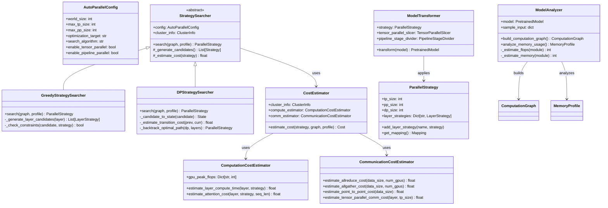
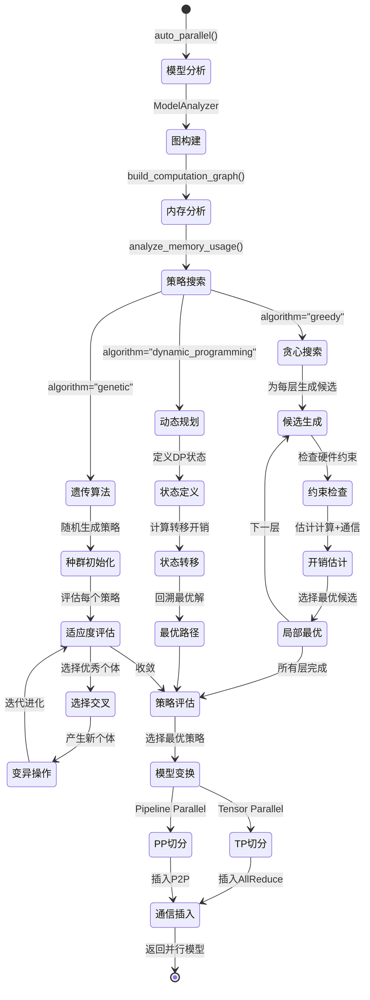

# TensorRT-LLM-08-AutoParallel模块-深度剖析

## 一、模块概览

### 1.1 模块定位

AutoParallel 模块是TensorRT-LLM的自动并行化系统，能够自动分析模型结构并生成最优的多GPU分布式执行策略，无需手动配置Tensor Parallel和Pipeline Parallel参数。

**核心职责：**
- 策略搜索：自动搜索最优并行策略
- 模型分析：分析模型计算图和内存需求
- 通信优化：最小化GPU间通信开销
- 负载均衡：平衡各GPU的计算和内存负载
- 动态适配：根据硬件配置自动调整策略

### 1.2 并行策略类型

| 并行类型 | 缩写 | 原理 | 适用场景 | 通信模式 |
|---------|------|------|---------|---------|
| **Tensor Parallel** | TP | 权重按维度切分 | 大模型单层加速 | AllReduce |
| **Pipeline Parallel** | PP | 层按序列切分 | 超深模型 | P2P |
| **Data Parallel** | DP | 数据批次切分 | 大批次训练 | AllReduce |
| **Expert Parallel** | EP | MoE专家切分 | MoE模型 | AllToAll |
| **Context Parallel** | CP | 序列长度切分 | 超长序列 | P2P |

### 1.3 模块架构

```
tensorrt_llm/auto_parallel/
├── __init__.py                     # 模块导出
├── config.py                       # AutoParallel配置
├── tensor_parallel.py              # TP策略实现
├── pipeline_parallel.py            # PP策略实现
├── sharding_strategy.py            # 分片策略
├── cost_model.py                   # 性能开销模型
├── search_algorithm.py             # 策略搜索算法
├── placement_strategy.py           # 设备放置策略
└── cluster_info.py                 # 集群硬件信息
```

### 1.4 自动并行流程

```
模型定义 → 图分析 → 策略搜索 → 开销估计 → 最优选择 → 模型变换 → 分布式执行
    ↓         ↓         ↓         ↓         ↓         ↓         ↓
  网络结构   计算图   候选策略   通信+计算   Pareto最优  重写模型   多GPU推理
```

## 二、核心API详细剖析

### 2.1 AutoParallelConfig配置

#### 2.1.1 类定义

```python
@dataclass
class AutoParallelConfig:
    """
    自动并行配置
    
    定义自动并行化的约束条件和优化目标
    """
    
    # 硬件配置
    world_size: int = 1                    # 总GPU数量
    max_tp_size: int = None               # 最大TP大小
    max_pp_size: int = None               # 最大PP大小
    
    # 搜索约束
    enable_tensor_parallel: bool = True    # 启用TP
    enable_pipeline_parallel: bool = True  # 启用PP
    enable_expert_parallel: bool = False   # 启用EP（MoE）
    enable_context_parallel: bool = False  # 启用CP（长序列）
    
    # 优化目标
    optimization_target: str = "latency"   # "latency", "throughput", "memory"
    memory_limit_per_gpu: int = None      # 每GPU内存限制（GB）
    
    # 搜索算法
    search_algorithm: str = "greedy"       # "greedy", "dynamic_programming", "genetic"
    max_search_time: int = 300            # 最大搜索时间（秒）
    
    # 通信配置
    communication_backend: str = "nccl"    # "nccl", "mpi"
    use_sequence_parallel: bool = False    # 序列并行优化
    
    def __post_init__(self):
        # 自动推断约束
        if self.max_tp_size is None:
            self.max_tp_size = min(8, self.world_size)
        if self.max_pp_size is None:
            self.max_pp_size = self.world_size
```

#### 2.1.2 配置示例

```python
# 1. 延迟优化配置（推理场景）
latency_config = AutoParallelConfig(
    world_size=8,
    optimization_target="latency",
    enable_tensor_parallel=True,
    enable_pipeline_parallel=False,  # 推理时PP延迟高
    search_algorithm="greedy",
)

# 2. 吞吐量优化配置（训练场景）
throughput_config = AutoParallelConfig(
    world_size=32,
    optimization_target="throughput",
    enable_tensor_parallel=True,
    enable_pipeline_parallel=True,
    memory_limit_per_gpu=80,  # A100 80GB
)

# 3. 内存优化配置（超大模型）
memory_config = AutoParallelConfig(
    world_size=16,
    optimization_target="memory",
    max_tp_size=4,
    max_pp_size=8,
    enable_sequence_parallel=True,
)
```

### 2.2 auto_parallel()主函数

#### 2.2.1 函数签名

```python
def auto_parallel(
    model: PretrainedModel,               # 待并行化模型
    config: AutoParallelConfig,           # 自动并行配置
    sample_input: Optional[dict] = None,  # 样本输入（用于分析）
    cluster_info: Optional[ClusterInfo] = None, # 集群信息
    **kwargs
) -> Tuple[PretrainedModel, Mapping]:
    """
    自动并行化模型
    
    Args:
        model: 预训练模型
        config: 自动并行配置
        sample_input: 样本输入数据
        cluster_info: 硬件集群信息
        
    Returns:
        parallel_model: 并行化后的模型
        mapping: 并行配置映射
    """
```

#### 2.2.2 核心实现

```python
def auto_parallel(model, config, sample_input=None, cluster_info=None):
    # 1. 集群信息收集
    if cluster_info is None:
        cluster_info = collect_cluster_info(config.world_size)
    
    # 2. 模型分析
    model_analyzer = ModelAnalyzer(model, sample_input)
    computation_graph = model_analyzer.build_computation_graph()
    memory_profile = model_analyzer.analyze_memory_usage()
    
    # 3. 策略搜索
    strategy_searcher = StrategySearcher(config, cluster_info)
    candidate_strategies = strategy_searcher.generate_candidates(
        computation_graph, memory_profile
    )
    
    # 4. 开销估计
    cost_estimator = CostEstimator(cluster_info)
    strategy_costs = []
    
    for strategy in candidate_strategies:
        cost = cost_estimator.estimate_cost(
            strategy, computation_graph, memory_profile
        )
        strategy_costs.append((strategy, cost))
    
    # 5. 最优策略选择
    optimal_strategy = select_optimal_strategy(
        strategy_costs, config.optimization_target
    )
    
    # 6. 模型变换
    model_transformer = ModelTransformer(optimal_strategy)
    parallel_model = model_transformer.transform(model)
    
    # 7. 生成映射配置
    mapping = generate_mapping_from_strategy(optimal_strategy, config.world_size)
    
    return parallel_model, mapping

class ModelAnalyzer:
    """
    模型分析器：分析计算图和内存使用
    """
    def __init__(self, model, sample_input):
        self.model = model
        self.sample_input = sample_input
    
    def build_computation_graph(self):
        """
        构建计算图
        """
        graph = ComputationGraph()
        
        # 1. 遍历模型层
        for name, module in self.model.named_modules():
            if isinstance(module, (Linear, Attention, MLP)):
                # 1.1 添加计算节点
                node = ComputationNode(
                    name=name,
                    module_type=type(module).__name__,
                    input_shape=self._get_input_shape(module),
                    output_shape=self._get_output_shape(module),
                    flops=self._estimate_flops(module),
                    memory=self._estimate_memory(module),
                )
                graph.add_node(node)
                
                # 1.2 添加依赖边
                dependencies = self._find_dependencies(name)
                for dep in dependencies:
                    graph.add_edge(dep, node)
        
        return graph
    
    def analyze_memory_usage(self):
        """
        分析内存使用模式
        """
        profile = MemoryProfile()
        
        # 1. 权重内存
        for name, param in self.model.named_parameters():
            profile.add_weight_memory(
                name=name,
                size=param.numel() * param.element_size(),
                shape=param.shape,
            )
        
        # 2. 激活内存（需要前向传播分析）
        if self.sample_input is not None:
            with MemoryProfiler() as profiler:
                _ = self.model(**self.sample_input)
            
            for event in profiler.events:
                if event.event_type == "activation":
                    profile.add_activation_memory(
                        name=event.name,
                        size=event.memory_size,
                        peak_memory=event.peak_memory,
                    )
        
        return profile
```

### 2.3 策略搜索算法

#### 2.3.1 贪心搜索算法

```python
class GreedyStrategySearcher:
    """
    贪心策略搜索器
    
    基于局部最优选择构建全局策略
    """
    def __init__(self, config, cluster_info):
        self.config = config
        self.cluster_info = cluster_info
    
    def search(self, computation_graph, memory_profile):
        """
        贪心搜索最优策略
        """
        strategy = ParallelStrategy()
        
        # 1. 按层顺序处理
        for layer in computation_graph.topological_sort():
            # 2. 为当前层生成候选并行方案
            candidates = self._generate_layer_candidates(layer)
            
            # 3. 评估每个候选方案
            best_candidate = None
            best_cost = float('inf')
            
            for candidate in candidates:
                # 3.1 检查约束条件
                if not self._check_constraints(candidate, strategy):
                    continue
                
                # 3.2 估计开销
                cost = self._estimate_layer_cost(candidate, layer)
                
                # 3.3 更新最优选择
                if cost < best_cost:
                    best_cost = cost
                    best_candidate = candidate
            
            # 4. 应用最优选择
            if best_candidate is not None:
                strategy.add_layer_strategy(layer.name, best_candidate)
        
        return strategy
    
    def _generate_layer_candidates(self, layer):
        """
        为单层生成并行候选方案
        """
        candidates = []
        
        # 1. Tensor Parallel候选
        if self.config.enable_tensor_parallel:
            for tp_size in range(1, self.config.max_tp_size + 1):
                if self.config.world_size % tp_size == 0:
                    candidates.append(LayerStrategy(
                        layer_name=layer.name,
                        tp_size=tp_size,
                        pp_size=1,
                        strategy_type="tensor_parallel"
                    ))
        
        # 2. Pipeline Parallel候选
        if self.config.enable_pipeline_parallel:
            for pp_size in range(1, self.config.max_pp_size + 1):
                if self.config.world_size % pp_size == 0:
                    candidates.append(LayerStrategy(
                        layer_name=layer.name,
                        tp_size=1,
                        pp_size=pp_size,
                        strategy_type="pipeline_parallel"
                    ))
        
        # 3. 混合并行候选
        for tp_size in range(2, min(8, self.config.world_size) + 1):
            for pp_size in range(2, self.config.world_size // tp_size + 1):
                if tp_size * pp_size <= self.config.world_size:
                    candidates.append(LayerStrategy(
                        layer_name=layer.name,
                        tp_size=tp_size,
                        pp_size=pp_size,
                        strategy_type="hybrid_parallel"
                    ))
        
        return candidates
```

#### 2.3.2 动态规划搜索

```python
class DPStrategySearcher:
    """
    动态规划策略搜索器
    
    考虑全局最优解，避免贪心算法的局部最优问题
    """
    def search(self, computation_graph, memory_profile):
        """
        动态规划搜索
        """
        layers = computation_graph.topological_sort()
        n_layers = len(layers)
        
        # DP状态：dp[i][state] = 前i层使用state配置的最小开销
        dp = {}
        
        # 1. 初始化：第0层
        candidates_0 = self._generate_layer_candidates(layers[0])
        for candidate in candidates_0:
            state = self._candidate_to_state(candidate)
            dp[(0, state)] = self._estimate_layer_cost(candidate, layers[0])
        
        # 2. 状态转移：逐层计算
        for i in range(1, n_layers):
            layer = layers[i]
            candidates_i = self._generate_layer_candidates(layer)
            
            for candidate in candidates_i:
                state_i = self._candidate_to_state(candidate)
                min_cost = float('inf')
                
                # 2.1 尝试所有前一层状态
                for prev_state in self._get_prev_states(i-1, dp):
                    if not self._can_transition(prev_state, state_i):
                        continue
                    
                    # 2.2 计算转移开销
                    transition_cost = self._estimate_transition_cost(
                        prev_state, state_i, layers[i-1], layer
                    )
                    
                    total_cost = dp[(i-1, prev_state)] + \
                               self._estimate_layer_cost(candidate, layer) + \
                               transition_cost
                    
                    min_cost = min(min_cost, total_cost)
                
                # 2.3 更新DP表
                if min_cost < float('inf'):
                    dp[(i, state_i)] = min_cost
        
        # 3. 回溯最优路径
        optimal_strategy = self._backtrack_optimal_path(dp, layers)
        
        return optimal_strategy
    
    def _estimate_transition_cost(self, prev_state, curr_state, prev_layer, curr_layer):
        """
        估计状态转移开销（主要是通信开销）
        """
        cost = 0.0
        
        # 1. TP切换开销
        if prev_state.tp_size != curr_state.tp_size:
            # 需要AllGather/ReduceScatter通信
            data_size = prev_layer.output_size
            bandwidth = self.cluster_info.inter_gpu_bandwidth
            cost += data_size / bandwidth
        
        # 2. PP切换开销
        if prev_state.pp_size != curr_state.pp_size:
            # Pipeline bubble开销
            cost += self._estimate_pipeline_bubble_cost(prev_state, curr_state)
        
        return cost
```

### 2.4 开销估计模型

#### 2.4.1 计算开销估计

```python
class ComputationCostEstimator:
    """
    计算开销估计器
    """
    def __init__(self, cluster_info):
        self.cluster_info = cluster_info
        
        # GPU性能参数（TFLOPS）
        self.gpu_peak_flops = {
            "H100": 989,     # FP16 Tensor Core
            "A100": 312,     # FP16 Tensor Core  
            "V100": 125,     # FP16 Tensor Core
        }
    
    def estimate_layer_compute_time(self, layer, strategy):
        """
        估计单层计算时间
        """
        # 1. 获取层的FLOPS
        total_flops = layer.flops
        
        # 2. 考虑并行化
        if strategy.strategy_type == "tensor_parallel":
            # TP将计算分配到多个GPU
            parallel_flops = total_flops / strategy.tp_size
        elif strategy.strategy_type == "pipeline_parallel":
            # PP不减少单层计算
            parallel_flops = total_flops
        else:
            parallel_flops = total_flops
        
        # 3. 计算时间
        gpu_type = self.cluster_info.gpu_type
        peak_flops = self.gpu_peak_flops[gpu_type] * 1e12  # 转换为FLOPS
        efficiency = 0.8  # 实际效率（经验值）
        
        compute_time = parallel_flops / (peak_flops * efficiency)
        
        return compute_time
    
    def estimate_attention_cost(self, layer, strategy, sequence_length):
        """
        特殊处理Attention层开销
        """
        if not isinstance(layer.module, Attention):
            return self.estimate_layer_compute_time(layer, strategy)
        
        # 1. Attention FLOPS: 4 * batch * seq_len^2 * hidden_size
        batch_size = layer.input_shape[0]
        hidden_size = layer.input_shape[-1]
        
        attention_flops = 4 * batch_size * (sequence_length ** 2) * hidden_size
        
        # 2. 考虑Flash Attention优化
        if layer.use_flash_attention:
            # Flash Attention减少约30%计算开销
            attention_flops *= 0.7
        
        # 3. 考虑GQA优化
        if hasattr(layer.module, 'num_kv_heads'):
            num_attention_heads = layer.module.num_attention_heads
            num_kv_heads = layer.module.num_kv_heads
            if num_kv_heads < num_attention_heads:
                # GQA减少KV计算
                gqa_ratio = num_kv_heads / num_attention_heads
                attention_flops *= (0.5 + 0.5 * gqa_ratio)  # 近似估计
        
        # 4. 计算时间
        return attention_flops / (self.gpu_peak_flops[self.cluster_info.gpu_type] * 1e12 * 0.8)
```

#### 2.4.2 通信开销估计

```python
class CommunicationCostEstimator:
    """
    通信开销估计器
    """
    def __init__(self, cluster_info):
        self.cluster_info = cluster_info
    
    def estimate_allreduce_cost(self, data_size, num_gpus):
        """
        估计AllReduce通信开销
        
        使用Ring AllReduce算法：
        时间复杂度 = 2 * (N-1) / N * data_size / bandwidth
        其中N是GPU数量
        """
        bandwidth = self.cluster_info.inter_gpu_bandwidth  # GB/s
        
        # Ring AllReduce: 两个阶段，每个阶段传输(N-1)/N的数据
        ring_efficiency = 2 * (num_gpus - 1) / num_gpus
        
        return ring_efficiency * data_size / bandwidth
    
    def estimate_allgather_cost(self, data_size, num_gpus):
        """
        估计AllGather通信开销
        """
        bandwidth = self.cluster_info.inter_gpu_bandwidth
        
        # AllGather: 每个GPU收集所有其他GPU的数据
        allgather_efficiency = (num_gpus - 1) / num_gpus
        
        return allgather_efficiency * data_size / bandwidth
    
    def estimate_point_to_point_cost(self, data_size):
        """
        估计点对点通信开销（Pipeline Parallel使用）
        """
        bandwidth = self.cluster_info.inter_gpu_bandwidth
        latency = self.cluster_info.inter_gpu_latency  # 微秒
        
        # P2P通信 = 延迟 + 传输时间
        transfer_time = data_size / bandwidth
        total_time = latency * 1e-6 + transfer_time
        
        return total_time
    
    def estimate_tensor_parallel_comm_cost(self, layer, tp_size):
        """
        估计Tensor Parallel通信开销
        """
        total_cost = 0.0
        
        if isinstance(layer.module, Attention):
            # 1. QKV投影后需要AllGather（如果使用融合QKV）
            qkv_size = layer.output_size  # 近似
            total_cost += self.estimate_allgather_cost(qkv_size, tp_size)
            
            # 2. Attention输出需要AllReduce
            attn_output_size = layer.input_shape[-1] * layer.input_shape[0] * layer.input_shape[1]
            total_cost += self.estimate_allreduce_cost(attn_output_size, tp_size)
        
        elif isinstance(layer.module, MLP):
            # 1. 第一个线性层输入需要复制（无通信）
            # 2. 第二个线性层输出需要AllReduce
            mlp_output_size = layer.output_size
            total_cost += self.estimate_allreduce_cost(mlp_output_size, tp_size)
        
        return total_cost
    
    def estimate_pipeline_parallel_comm_cost(self, layer, pp_size):
        """
        估计Pipeline Parallel通信开销
        """
        if pp_size == 1:
            return 0.0
        
        # 1. 激活传输：当前层输出 → 下一层输入
        activation_size = layer.output_size
        p2p_cost = self.estimate_point_to_point_cost(activation_size)
        
        # 2. Pipeline bubble开销
        bubble_ratio = 1.0 / pp_size  # 简化估计
        bubble_cost = layer.compute_time * bubble_ratio
        
        return p2p_cost + bubble_cost
```

## 三、关键功能深度剖析

### 3.1 Tensor Parallel自动切分

#### 3.1.1 权重切分策略

```python
class TensorParallelSlicer:
    """
    Tensor Parallel权重切分器
    """
    def __init__(self, tp_size):
        self.tp_size = tp_size
    
    def slice_attention_weights(self, attention_module):
        """
        切分Attention权重
        """
        sliced_module = copy.deepcopy(attention_module)
        
        # 1. QKV权重切分
        if hasattr(attention_module, 'qkv'):
            # 融合QKV：按输出维度切分
            qkv_weight = attention_module.qkv.weight  # [3*hidden, hidden]
            out_features = qkv_weight.shape[0]
            
            # 每个GPU分配 out_features/tp_size
            chunk_size = out_features // self.tp_size
            
            sliced_qkv_weight = qkv_weight[
                rank * chunk_size:(rank + 1) * chunk_size, :
            ]
            
            sliced_module.qkv.weight = Parameter(sliced_qkv_weight)
            
        else:
            # 分离QKV：分别切分
            for proj_name in ['q_proj', 'k_proj', 'v_proj']:
                if hasattr(attention_module, proj_name):
                    proj = getattr(attention_module, proj_name)
                    sliced_weight = self._slice_linear_weight(proj.weight, dim=0)
                    getattr(sliced_module, proj_name).weight = Parameter(sliced_weight)
        
        # 2. 输出投影权重切分
        if hasattr(attention_module, 'o_proj'):
            # 输出投影：按输入维度切分
            o_weight = attention_module.o_proj.weight  # [hidden, hidden]
            sliced_o_weight = self._slice_linear_weight(o_weight, dim=1)
            sliced_module.o_proj.weight = Parameter(sliced_o_weight)
        
        # 3. 调整head数量
        sliced_module.num_attention_heads = attention_module.num_attention_heads // self.tp_size
        if hasattr(attention_module, 'num_key_value_heads'):
            sliced_module.num_key_value_heads = attention_module.num_key_value_heads // self.tp_size
        
        return sliced_module
    
    def slice_mlp_weights(self, mlp_module):
        """
        切分MLP权重
        """
        sliced_module = copy.deepcopy(mlp_module)
        
        # 1. 第一个线性层（扩展层）：按输出维度切分
        if hasattr(mlp_module, 'gate_proj') and hasattr(mlp_module, 'up_proj'):
            # SwiGLU: gate和up都需要切分
            gate_weight = mlp_module.gate_proj.weight
            up_weight = mlp_module.up_proj.weight
            
            sliced_gate_weight = self._slice_linear_weight(gate_weight, dim=0)
            sliced_up_weight = self._slice_linear_weight(up_weight, dim=0)
            
            sliced_module.gate_proj.weight = Parameter(sliced_gate_weight)
            sliced_module.up_proj.weight = Parameter(sliced_up_weight)
        
        elif hasattr(mlp_module, 'fc'):
            # 融合gate+up
            fc_weight = mlp_module.fc.weight
            sliced_fc_weight = self._slice_linear_weight(fc_weight, dim=0)
            sliced_module.fc.weight = Parameter(sliced_fc_weight)
        
        # 2. 第二个线性层（压缩层）：按输入维度切分
        if hasattr(mlp_module, 'down_proj'):
            down_weight = mlp_module.down_proj.weight
            sliced_down_weight = self._slice_linear_weight(down_weight, dim=1)
            sliced_module.down_proj.weight = Parameter(sliced_down_weight)
        
        elif hasattr(mlp_module, 'proj'):
            proj_weight = mlp_module.proj.weight
            sliced_proj_weight = self._slice_linear_weight(proj_weight, dim=1)
            sliced_module.proj.weight = Parameter(sliced_proj_weight)
        
        return sliced_module
    
    def _slice_linear_weight(self, weight, dim):
        """
        按维度切分线性层权重
        """
        size = weight.shape[dim]
        chunk_size = size // self.tp_size
        rank = get_tensor_parallel_rank()
        
        if dim == 0:
            # 按行切分
            return weight[rank * chunk_size:(rank + 1) * chunk_size, :]
        else:
            # 按列切分
            return weight[:, rank * chunk_size:(rank + 1) * chunk_size]
```

#### 3.1.2 通信插入

```python
class CommunicationInserter:
    """
    通信操作插入器
    """
    def insert_tensor_parallel_communication(self, model, tp_size):
        """
        为Tensor Parallel插入必要的通信操作
        """
        for name, module in model.named_modules():
            if isinstance(module, Attention):
                # 1. Attention输出后插入AllReduce
                self._insert_allreduce_after_attention(module, tp_size)
            
            elif isinstance(module, MLP):
                # 2. MLP输出后插入AllReduce
                self._insert_allreduce_after_mlp(module, tp_size)
            
            elif isinstance(module, Linear) and self._is_lm_head(name):
                # 3. LM Head后插入AllGather
                self._insert_allgather_after_lm_head(module, tp_size)
    
    def _insert_allreduce_after_attention(self, attention_module, tp_size):
        """
        在Attention输出后插入AllReduce
        """
        original_forward = attention_module.forward
        
        def forward_with_allreduce(*args, **kwargs):
            # 1. 原始前向传播
            output = original_forward(*args, **kwargs)
            
            # 2. AllReduce通信
            if tp_size > 1:
                output = self._all_reduce(output, group=get_tensor_parallel_group())
            
            return output
        
        attention_module.forward = forward_with_allreduce
    
    def _all_reduce(self, tensor, group):
        """
        AllReduce通信原语
        """
        import torch.distributed as dist
        
        # 在实际实现中，这会调用NCCL进行高效通信
        dist.all_reduce(tensor, group=group)
        return tensor
```

### 3.2 Pipeline Parallel自动切分

#### 3.2.1 层间依赖分析

```python
class LayerDependencyAnalyzer:
    """
    层间依赖分析器
    """
    def analyze_dependencies(self, model):
        """
        分析模型层间依赖关系
        """
        dependency_graph = nx.DiGraph()
        
        # 1. 构建依赖图
        layer_outputs = {}  # 记录每层的输出变量
        
        for name, module in model.named_modules():
            if self._is_leaf_module(module):
                # 1.1 添加节点
                dependency_graph.add_node(name, module=module)
                
                # 1.2 分析输入依赖
                input_deps = self._find_input_dependencies(name, layer_outputs)
                for dep in input_deps:
                    dependency_graph.add_edge(dep, name)
                
                # 1.3 记录输出变量
                layer_outputs[name] = self._get_output_variables(module)
        
        return dependency_graph
    
    def find_pipeline_cut_points(self, dependency_graph, pp_size):
        """
        寻找Pipeline Parallel的最优切分点
        """
        # 1. 拓扑排序得到层序列
        layer_sequence = list(nx.topological_sort(dependency_graph))
        n_layers = len(layer_sequence)
        
        # 2. 计算每层的计算开销
        layer_costs = {}
        for layer_name in layer_sequence:
            module = dependency_graph.nodes[layer_name]['module']
            layer_costs[layer_name] = self._estimate_computation_cost(module)
        
        # 3. 动态规划寻找最优切分
        return self._find_optimal_cuts_dp(layer_sequence, layer_costs, pp_size)
    
    def _find_optimal_cuts_dp(self, layer_sequence, layer_costs, pp_size):
        """
        使用动态规划寻找最优切分点
        """
        n_layers = len(layer_sequence)
        
        # dp[i][k] = 前i层分成k个stage的最小负载不均衡度
        dp = {}
        cuts = {}  # 记录切分点
        
        # 计算前缀开销
        prefix_costs = [0]
        for layer in layer_sequence:
            prefix_costs.append(prefix_costs[-1] + layer_costs[layer])
        
        # 初始化：1个stage
        for i in range(1, n_layers + 1):
            dp[(i, 1)] = prefix_costs[i]
            cuts[(i, 1)] = []
        
        # 状态转移：k个stage
        for k in range(2, pp_size + 1):
            for i in range(k, n_layers + 1):
                dp[(i, k)] = float('inf')
                
                # 尝试所有可能的最后一个stage起点
                for j in range(k-1, i):
                    # 最后一个stage的开销
                    last_stage_cost = prefix_costs[i] - prefix_costs[j]
                    
                    # 前k-1个stage的最大开销
                    prev_max_cost = dp[(j, k-1)]
                    
                    # 当前配置的最大stage开销
                    max_cost = max(prev_max_cost, last_stage_cost)
                    
                    if max_cost < dp[(i, k)]:
                        dp[(i, k)] = max_cost
                        cuts[(i, k)] = cuts[(j, k-1)] + [j]
        
        # 返回最优切分点
        optimal_cuts = cuts[(n_layers, pp_size)]
        return optimal_cuts
```

#### 3.2.2 Stage划分

```python
class PipelineStageDivider:
    """
    Pipeline Stage划分器
    """
    def divide_into_stages(self, model, cut_points, pp_size):
        """
        根据切分点将模型划分为Pipeline Stage
        """
        stages = []
        layer_sequence = list(model.named_modules())
        
        # 添加起始和结束点
        boundaries = [0] + cut_points + [len(layer_sequence)]
        
        # 为每个stage创建子模型
        for stage_id in range(pp_size):
            start_idx = boundaries[stage_id]
            end_idx = boundaries[stage_id + 1]
            
            # 提取当前stage的层
            stage_layers = layer_sequence[start_idx:end_idx]
            
            # 创建stage子模型
            stage_model = self._create_stage_model(stage_layers, stage_id)
            stages.append(stage_model)
        
        return stages
    
    def _create_stage_model(self, stage_layers, stage_id):
        """
        创建Pipeline Stage子模型
        """
        class PipelineStage(nn.Module):
            def __init__(self, layers, stage_id):
                super().__init__()
                self.stage_id = stage_id
                self.layers = nn.ModuleDict()
                
                # 添加层到stage
                for name, module in layers:
                    self.layers[name] = module
            
            def forward(self, hidden_states):
                # 顺序执行所有层
                for layer in self.layers.values():
                    hidden_states = layer(hidden_states)
                
                return hidden_states
        
        return PipelineStage(stage_layers, stage_id)
    
    def insert_pipeline_communication(self, stages, pp_size):
        """
        为Pipeline Stage插入通信
        """
        for stage_id in range(pp_size):
            stage = stages[stage_id]
            
            # 包装forward函数添加通信
            original_forward = stage.forward
            
            def forward_with_communication(hidden_states, stage_id=stage_id):
                # 1. 接收上游数据（除了第一个stage）
                if stage_id > 0:
                    hidden_states = self._receive_from_prev_stage(hidden_states, stage_id)
                
                # 2. 执行本stage计算
                output = original_forward(hidden_states)
                
                # 3. 发送到下游（除了最后一个stage）
                if stage_id < pp_size - 1:
                    self._send_to_next_stage(output, stage_id)
                
                return output
            
            stage.forward = forward_with_communication
    
    def _receive_from_prev_stage(self, tensor, stage_id):
        """从上一个stage接收数据"""
        import torch.distributed as dist
        
        prev_rank = stage_id - 1
        dist.recv(tensor, src=prev_rank)
        return tensor
    
    def _send_to_next_stage(self, tensor, stage_id):
        """发送数据到下一个stage"""
        import torch.distributed as dist
        
        next_rank = stage_id + 1
        dist.send(tensor, dst=next_rank)
```

### 3.3 混合并行策略优化

#### 3.3.1 策略组合

```python
class HybridParallelOptimizer:
    """
    混合并行策略优化器
    """
    def optimize_hybrid_strategy(self, model, world_size, memory_limit):
        """
        优化混合并行策略
        """
        best_strategy = None
        best_score = float('inf')
        
        # 1. 枚举所有可能的组合
        for tp_size in self._get_valid_tp_sizes(world_size):
            for pp_size in self._get_valid_pp_sizes(world_size, tp_size):
                dp_size = world_size // (tp_size * pp_size)
                
                if dp_size < 1:
                    continue
                
                # 2. 评估当前组合
                strategy = HybridStrategy(
                    tp_size=tp_size,
                    pp_size=pp_size,
                    dp_size=dp_size,
                )
                
                # 3. 检查内存约束
                if not self._check_memory_constraint(model, strategy, memory_limit):
                    continue
                
                # 4. 估计性能
                score = self._evaluate_strategy_performance(model, strategy)
                
                # 5. 更新最优策略
                if score < best_score:
                    best_score = score
                    best_strategy = strategy
        
        return best_strategy
    
    def _evaluate_strategy_performance(self, model, strategy):
        """
        评估混合策略性能
        """
        # 1. 计算开销
        compute_cost = self._estimate_compute_cost(model, strategy)
        
        # 2. 通信开销
        comm_cost = self._estimate_communication_cost(model, strategy)
        
        # 3. 内存开销
        memory_cost = self._estimate_memory_cost(model, strategy)
        
        # 4. Pipeline bubble开销
        bubble_cost = self._estimate_pipeline_bubble(strategy)
        
        # 5. 综合评分（可以根据需求调整权重）
        total_score = (
            compute_cost * 0.4 +
            comm_cost * 0.3 +
            memory_cost * 0.2 +
            bubble_cost * 0.1
        )
        
        return total_score
    
    def _estimate_pipeline_bubble(self, strategy):
        """
        估计Pipeline bubble开销
        """
        if strategy.pp_size == 1:
            return 0.0
        
        # Pipeline bubble比例近似为 (pp_size - 1) / (pp_size + microbatch_num - 1)
        # 假设microbatch数量等于pp_size
        microbatch_num = strategy.pp_size
        bubble_ratio = (strategy.pp_size - 1) / (strategy.pp_size + microbatch_num - 1)
        
        return bubble_ratio
```

## 四、数据结构UML图

### 4.1 AutoParallel核心类图



### 4.2 策略搜索流程状态图



## 五、使用示例

### 5.1 基础自动并行

```python
from tensorrt_llm.auto_parallel import auto_parallel, AutoParallelConfig
from tensorrt_llm.models import LlamaForCausalLM

# 1. 加载模型
model = LlamaForCausalLM.from_pretrained("meta-llama/Llama-3-8B")

# 2. 配置自动并行
config = AutoParallelConfig(
    world_size=8,                          # 8个GPU
    optimization_target="latency",         # 优化延迟
    search_algorithm="greedy",             # 贪心搜索
    max_search_time=300,                   # 最大搜索5分钟
)

# 3. 自动并行化
parallel_model, mapping = auto_parallel(model, config)

# 4. 构建引擎
from tensorrt_llm import build, BuildConfig

build_config = BuildConfig(
    max_batch_size=16,
    max_input_len=2048,
    max_seq_len=4096,
)

# 设置映射
parallel_model.config.mapping = mapping

# 构建
engine = build(parallel_model, build_config)

# 结果示例：
# mapping.tp_size = 8, mapping.pp_size = 1
# 推荐策略：纯Tensor Parallel（适合推理）
```

### 5.2 内存受限场景

```python
# 超大模型在有限显存上部署
config = AutoParallelConfig(
    world_size=16,
    optimization_target="memory",          # 优化内存使用
    memory_limit_per_gpu=40,              # 每GPU 40GB限制
    enable_pipeline_parallel=True,        # 启用PP减少内存
    search_algorithm="dynamic_programming", # 全局最优
)

# 准备样本输入（帮助内存分析）
sample_input = {
    "input_ids": torch.randint(0, 32000, (1, 2048)),
    "attention_mask": torch.ones(1, 2048),
}

parallel_model, mapping = auto_parallel(
    model, 
    config, 
    sample_input=sample_input
)

# 结果示例：
# mapping.tp_size = 4, mapping.pp_size = 4
# 混合策略：减少内存占用
```

### 5.3 自定义优化目标

```python
class CustomOptimizationTarget:
    """
    自定义优化目标：平衡延迟和吞吐量
    """
    def __init__(self, latency_weight=0.6, throughput_weight=0.4):
        self.latency_weight = latency_weight
        self.throughput_weight = throughput_weight
    
    def evaluate(self, strategy, model_info):
        # 1. 估计延迟
        latency = self._estimate_latency(strategy, model_info)
        
        # 2. 估计吞吐量
        throughput = self._estimate_throughput(strategy, model_info)
        
        # 3. 综合评分（越小越好）
        score = (
            self.latency_weight * latency +
            self.throughput_weight * (1.0 / throughput)
        )
        
        return score

# 使用自定义优化目标
config = AutoParallelConfig(
    world_size=32,
    optimization_target=CustomOptimizationTarget(0.7, 0.3),
    search_algorithm="genetic",            # 遗传算法适合复杂目标
)
```

### 5.4 MoE模型自动并行

```python
from tensorrt_llm.models import MixtralForCausalLM

# MoE模型需要Expert Parallel
mixtral_config = AutoParallelConfig(
    world_size=16,
    enable_expert_parallel=True,           # 启用EP
    enable_tensor_parallel=True,
    optimization_target="throughput",
)

# MoE模型
model = MixtralForCausalLM.from_pretrained("mistralai/Mixtral-8x7B-v0.1")

parallel_model, mapping = auto_parallel(model, mixtral_config)

# 结果示例：
# mapping.tp_size = 2, mapping.pp_size = 1, mapping.ep_size = 8
# 每个expert分配到不同GPU，同时使用TP加速
```

## 六、性能优化建议

### 6.1 搜索算法选择

```python
def select_search_algorithm(model_size, world_size, time_limit):
    """
    根据场景选择搜索算法
    """
    # 1. 小模型或少GPU：贪心搜索
    if model_size < "13B" or world_size <= 8:
        return "greedy"
    
    # 2. 大模型且时间充裕：动态规划
    elif time_limit > 600:  # 10分钟以上
        return "dynamic_programming"
    
    # 3. 超大模型或复杂约束：遗传算法
    else:
        return "genetic"

# 使用建议：
# - 贪心搜索：快速，适合简单场景
# - 动态规划：全局最优，适合中等复杂度
# - 遗传算法：处理复杂约束，适合超大规模
```

### 6.2 硬件感知优化

```python
def configure_for_hardware(gpu_type, interconnect):
    """
    根据硬件配置优化策略
    """
    if gpu_type == "H100" and interconnect == "NVSwitch":
        # H100 + NVSwitch：通信带宽高，偏向TP
        return AutoParallelConfig(
            optimization_target="latency",
            max_tp_size=8,                    # 利用高带宽
            enable_sequence_parallel=True,    # H100支持
        )
    
    elif gpu_type == "A100" and interconnect == "InfiniBand":
        # A100 + IB：平衡TP和PP
        return AutoParallelConfig(
            optimization_target="throughput",
            max_tp_size=4,                    # 适度TP
            enable_pipeline_parallel=True,    # 结合PP
        )
    
    elif interconnect == "Ethernet":
        # 低带宽网络：偏向PP，减少通信
        return AutoParallelConfig(
            optimization_target="memory",
            max_tp_size=2,                    # 最小TP
            enable_pipeline_parallel=True,    # 主要使用PP
        )
```

### 6.3 动态调整策略

```python
class AdaptiveParallelManager:
    """
    自适应并行管理器
    """
    def __init__(self, model, initial_config):
        self.model = model
        self.current_strategy = None
        self.performance_history = []
    
    def adapt_strategy(self, workload_info):
        """
        根据工作负载动态调整策略
        """
        # 1. 分析当前工作负载
        batch_size = workload_info['batch_size']
        sequence_length = workload_info['sequence_length']
        request_rate = workload_info['request_rate']
        
        # 2. 预测最优策略
        if batch_size > 32:
            # 大批次：优化吞吐量
            target = "throughput"
            prefer_pp = True
        elif sequence_length > 4096:
            # 长序列：使用Context Parallel
            target = "memory"
            enable_cp = True
        else:
            # 标准场景：优化延迟
            target = "latency"
            prefer_tp = True
        
        # 3. 重新搜索策略
        new_config = AutoParallelConfig(
            optimization_target=target,
            # ... 根据工作负载调整其他参数
        )
        
        new_strategy = auto_parallel(self.model, new_config)
        
        # 4. 评估是否需要切换
        if self._should_switch_strategy(new_strategy):
            self._switch_to_new_strategy(new_strategy)
    
    def _should_switch_strategy(self, new_strategy):
        """
        判断是否应该切换策略
        """
        # 考虑切换开销和性能提升
        switch_cost = self._estimate_switch_cost(new_strategy)
        performance_gain = self._estimate_performance_gain(new_strategy)
        
        return performance_gain > switch_cost * 1.2  # 需要20%以上提升
```

## 七、常见问题

**Q1：AutoParallel搜索时间过长怎么办？**
```python
# 限制搜索空间
config = AutoParallelConfig(
    max_tp_size=4,           # 限制TP最大值
    max_pp_size=4,           # 限制PP最大值
    max_search_time=180,     # 限制搜索时间
    search_algorithm="greedy" # 使用快速算法
)
```

**Q2：如何处理不规则GPU配置？**
```python
# 非2的幂次GPU数量
config = AutoParallelConfig(
    world_size=12,  # 12个GPU
    # 自动寻找合适的因数分解：
    # 可能结果：tp=3, pp=4 或 tp=4, pp=3
)
```

**Q3：如何验证自动并行策略的正确性？**
```python
def validate_parallel_strategy(original_model, parallel_model, test_input):
    """
    验证并行策略正确性
    """
    # 1. 数值精度检查
    with torch.no_grad():
        original_output = original_model(**test_input)
        parallel_output = parallel_model(**test_input)
    
    # 2. 比较输出
    max_diff = torch.max(torch.abs(original_output.logits - parallel_output.logits))
    print(f"Max difference: {max_diff.item()}")
    
    # 3. 相对误差
    relative_error = max_diff / torch.max(torch.abs(original_output.logits))
    print(f"Relative error: {relative_error.item()}")
    
    # 可接受的误差范围：通常<1e-3
    assert relative_error < 1e-3, "Parallel model output differs too much"
```

**Q4：AutoParallel如何处理异构GPU？**
```python
# 异构集群配置
cluster_info = ClusterInfo(
    gpus=[
        {"type": "A100", "memory": 80, "compute_capability": 8.0},
        {"type": "A100", "memory": 80, "compute_capability": 8.0},
        {"type": "V100", "memory": 32, "compute_capability": 7.0},
        {"type": "V100", "memory": 32, "compute_capability": 7.0},
    ],
    interconnect="InfiniBand"
)

# AutoParallel会考虑硬件差异分配任务
config = AutoParallelConfig(
    world_size=4,
    optimization_target="throughput",
    heterogeneous_aware=True,  # 启用异构感知
)
```

**Q5：如何调试并行策略？**
```python
# 启用详细日志
import logging
logging.getLogger("tensorrt_llm.auto_parallel").setLevel(logging.DEBUG)

# 可视化策略
def visualize_strategy(strategy):
    """
    可视化并行策略
    """
    print(f"Parallel Strategy:")
    print(f"  TP Size: {strategy.tp_size}")
    print(f"  PP Size: {strategy.pp_size}")
    print(f"  DP Size: {strategy.dp_size}")
    
    print(f"Layer Distribution:")
    for layer_name, layer_strategy in strategy.layer_strategies.items():
        print(f"  {layer_name}: {layer_strategy}")

# 性能分析
def profile_parallel_model(parallel_model, test_input):
    """
    性能分析并行模型
    """
    with torch.profiler.profile(
        activities=[torch.profiler.ProfilerActivity.CPU, torch.profiler.ProfilerActivity.CUDA],
        record_shapes=True
    ) as prof:
        parallel_model(**test_input)
    
    # 查看通信开销
    comm_events = [event for event in prof.events() if "nccl" in event.name.lower()]
    total_comm_time = sum(event.cuda_time_total for event in comm_events)
    print(f"Total communication time: {total_comm_time / 1000:.2f} ms")
```

---

**文档版本：** 2.0（深度剖析版）  
**生成时间：** 2025-10-05  
**对应代码版本：** TensorRT-LLM v1.2.0rc1
