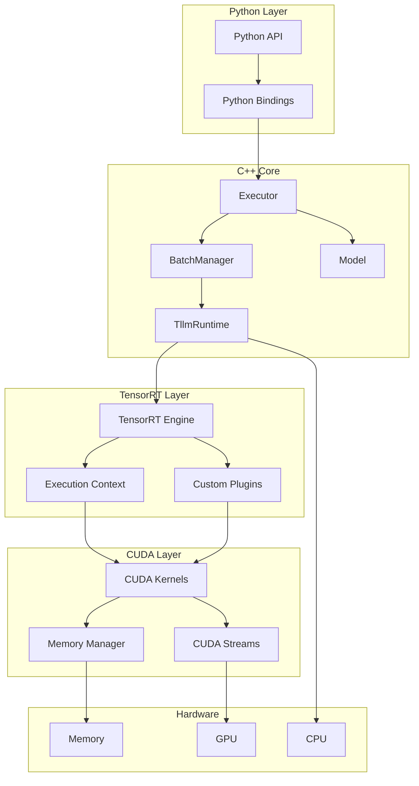
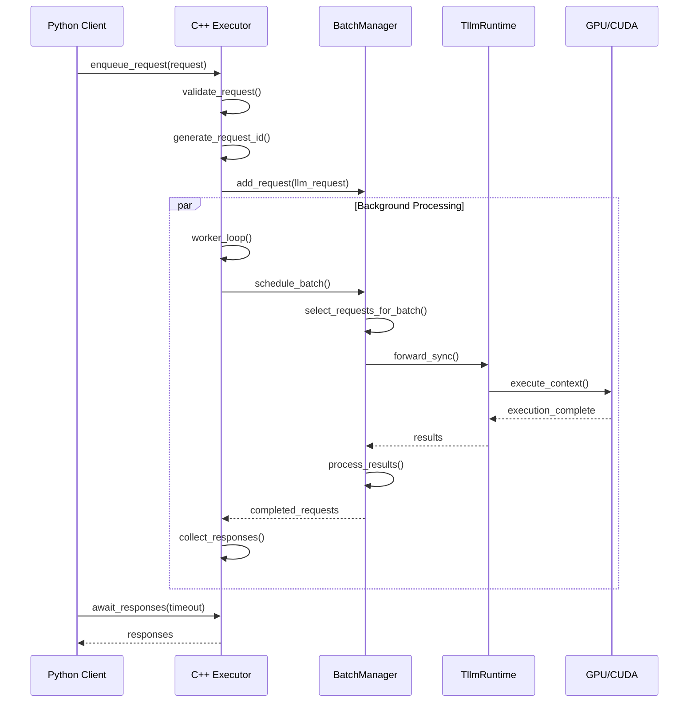

# TensorRT-LLM-09-C++后端核心组件-深度剖析

## 一、模块概览

### 1.1 模块定位

C++后端是TensorRT-LLM的性能核心，通过精心优化的C++代码和CUDA kernels实现高性能LLM推理。主要负责底层计算加速、内存管理、并行化调度和硬件抽象。

**核心职责：**
- 高性能推理引擎
- CUDA内核优化
- 内存池管理
- 多GPU协调
- 硬件抽象层
- Python/C++互操作

### 1.2 架构层次

```
Python API Layer
    ↓
Python Bindings (pybind11/nanobind)
    ↓
C++ Executor & BatchManager
    ↓
TensorRT Runtime & CUDA Kernels
    ↓
Hardware (GPU/CPU/NIC)
```

### 1.3 核心组件

| 组件 | 职责 | 关键类 | 性能特点 |
|------|------|--------|----------|
| **Executor** | 请求调度与执行 | `executor::Executor` | 高并发、低延迟 |
| **BatchManager** | 动态批处理 | `batch_manager::TrtGptModelInflightBatching` | 内存高效 |
| **Runtime** | TensorRT引擎管理 | `runtime::TllmRuntime` | GPU优化 |
| **Kernels** | CUDA计算内核 | `kernels::*` | 极致性能 |
| **Layers** | 神经网络层 | `layers::*` | 模块化 |
| **Plugins** | TensorRT插件 | `plugins::*` | 自定义算子 |

### 1.4 目录结构

```
cpp/
├── include/tensorrt_llm/          # 头文件
│   ├── executor/                  # 执行器
│   ├── batch_manager/             # 批处理管理
│   ├── runtime/                   # 运行时
│   ├── layers/                    # 神经网络层
│   ├── kernels/                   # CUDA内核
│   └── plugins/                   # TensorRT插件
│
├── tensorrt_llm/                  # 实现文件
│   ├── executor/                  # 执行器实现
│   ├── batch_manager/             # 批处理实现
│   ├── runtime/                   # 运行时实现
│   ├── layers/                    # 层实现
│   ├── kernels/                   # 内核实现
│   └── plugins/                   # 插件实现
│
├── pybind/                        # Python绑定 (pybind11)
├── nanobind/                      # Python绑定 (nanobind)
└── tests/                         # C++单元测试
```

## 二、Executor核心执行器

### 2.1 Executor架构

#### 2.1.1 类层次结构

```cpp
// 抽象执行器接口
class Executor {
public:
    // 构造函数重载
    Executor(std::filesystem::path const& modelPath, 
             ModelType modelType, 
             ExecutorConfig const& executorConfig);
    
    Executor(BufferView const& engineBuffer, 
             std::string const& jsonConfigStr,
             ModelType modelType, 
             ExecutorConfig const& executorConfig);
    
    // 核心API
    IdType enqueueRequest(Request const& request);
    std::vector<IdType> enqueueRequests(std::vector<Request> const& requests);
    std::vector<Response> awaitResponses(std::optional<std::chrono::milliseconds> const& timeout);
    void cancelRequest(IdType requestId);
    void shutdown();
    
    // 统计信息
    [[nodiscard]] std::deque<IterationStats> getLatestIterationStats();
    [[nodiscard]] std::vector<RequestStats> getLatestRequestStats();
    
private:
    class Impl;                    // PIMPL模式
    std::unique_ptr<Impl> mImpl;   // 隐藏实现细节
};
```

#### 2.1.2 Executor::Impl核心实现

```cpp
class Executor::Impl {
public:
    // 初始化
    void initialize(ExecutorConfig const& executorConfig);
    
    // 请求处理
    IdType enqueueRequest(Request const& request);
    std::vector<Response> awaitResponses(std::optional<std::chrono::milliseconds> const& timeout);
    
    // 生命周期管理
    void shutdown();
    
private:
    // 核心组件
    std::shared_ptr<Model> mModel;                    // 模型实例
    std::shared_ptr<Model> mEncoderModel;            // 编码器模型（可选）
    
    // 通信和调度
    std::unique_ptr<mpi::MpiComm> mComm;             // MPI通信
    std::unique_ptr<RequestQueue> mRequestQueue;     // 请求队列
    std::unique_ptr<ResponseQueue> mResponseQueue;   // 响应队列
    
    // 线程管理
    std::thread mWorkerThread;                       // 工作线程
    std::atomic<bool> mShutdown{false};             // 关闭标志
    
    // 统计信息
    std::deque<IterationStats> mIterationStats;
    std::vector<RequestStats> mRequestStats;
    
    // 工作循环
    void workerLoop();
    void processNewRequests();
    void executeModel();
    void collectResponses();
};
```

### 2.2 请求处理流程

#### 2.2.1 请求入队

```cpp
IdType Executor::Impl::enqueueRequest(Request const& request) {
    // 1. 验证请求
    validateRequest(request);
    
    // 2. 生成请求ID
    IdType requestId = generateRequestId();
    
    // 3. 创建内部请求对象
    auto llmRequest = std::make_shared<batch_manager::LlmRequest>(
        requestId,
        request.getInputTokenIds(),
        request.getSamplingConfig(),
        request.getOutputConfig(),
        request.getGenerationConfig()
    );
    
    // 4. 添加到请求队列
    {
        std::lock_guard<std::mutex> lock(mRequestQueueMutex);
        mRequestQueue->push(llmRequest);
    }
    
    // 5. 通知工作线程
    mRequestCondition.notify_one();
    
    return requestId;
}

void Executor::Impl::validateRequest(Request const& request) {
    // 验证输入长度
    auto const& inputTokenIds = request.getInputTokenIds();
    TLLM_CHECK_WITH_INFO(!inputTokenIds.empty(), "Input token IDs cannot be empty");
    
    auto maxInputLen = mModel->getMaxInputLen();
    TLLM_CHECK_WITH_INFO(inputTokenIds.size() <= maxInputLen, 
                        "Input length exceeds maximum: %zu > %d", 
                        inputTokenIds.size(), maxInputLen);
    
    // 验证采样配置
    auto const& samplingConfig = request.getSamplingConfig();
    TLLM_CHECK_WITH_INFO(samplingConfig.getBeamWidth() >= 1, "Beam width must be >= 1");
    TLLM_CHECK_WITH_INFO(samplingConfig.getTemperature().value_or(1.0f) > 0.0f, 
                        "Temperature must be > 0");
    
    // 验证输出配置
    auto const& outputConfig = request.getOutputConfig();
    TLLM_CHECK_WITH_INFO(outputConfig.maxNewTokens > 0, "maxNewTokens must be > 0");
}
```

#### 2.2.2 工作线程主循环

```cpp
void Executor::Impl::workerLoop() {
    TLLM_LOG_INFO("Worker thread started");
    
    while (!mShutdown.load()) {
        try {
            // 1. 处理新请求
            processNewRequests();
            
            // 2. 执行模型推理
            executeModel();
            
            // 3. 收集响应
            collectResponses();
            
            // 4. 更新统计信息
            updateStats();
            
            // 5. 检查内存压力
            checkMemoryPressure();
            
        } catch (std::exception const& e) {
            TLLM_LOG_ERROR("Worker thread error: %s", e.what());
            // 错误恢复机制
            handleWorkerError(e);
        }
    }
    
    TLLM_LOG_INFO("Worker thread stopped");
}

void Executor::Impl::processNewRequests() {
    std::vector<std::shared_ptr<batch_manager::LlmRequest>> newRequests;
    
    // 1. 从队列中取出新请求
    {
        std::lock_guard<std::mutex> lock(mRequestQueueMutex);
        while (!mRequestQueue->empty()) {
            newRequests.push_back(mRequestQueue->front());
            mRequestQueue->pop();
        }
    }
    
    // 2. 将新请求提交给模型
    for (auto const& request : newRequests) {
        try {
            mModel->addRequest(request);
            TLLM_LOG_DEBUG("Added request %lu to model", request->getRequestId());
        } catch (std::exception const& e) {
            // 请求添加失败，生成错误响应
            auto errorResponse = createErrorResponse(request->getRequestId(), e.what());
            mResponseQueue->push(errorResponse);
        }
    }
}
```

### 2.3 模型执行与响应收集

#### 2.3.1 模型执行

```cpp
void Executor::Impl::executeModel() {
    auto start = std::chrono::high_resolution_clock::now();
    
    // 1. 检查是否有活跃请求
    if (!mModel->hasActiveRequests()) {
        return;
    }
    
    // 2. 执行推理步骤
    try {
        // 同步执行（等待GPU完成）
        mModel->forwardSync();
        
        // 异步执行（适用于Pipeline Parallel）
        auto activeRequests = mModel->getActiveRequests();
        mModel->forwardAsync(activeRequests);
        
    } catch (std::exception const& e) {
        TLLM_LOG_ERROR("Model execution failed: %s", e.what());
        
        // 标记所有活跃请求为失败
        auto activeRequests = mModel->getActiveRequests();
        for (auto const& request : activeRequests) {
            auto errorResponse = createErrorResponse(request->getRequestId(), e.what());
            mResponseQueue->push(errorResponse);
            mModel->terminateRequest(request);
        }
    }
    
    // 3. 记录执行时间
    auto end = std::chrono::high_resolution_clock::now();
    auto duration = std::chrono::duration_cast<std::chrono::microseconds>(end - start);
    mIterationStats.back().inferenceTime = duration.count();
}

void Executor::Impl::collectResponses() {
    // 1. 从模型中收集完成的响应
    auto completedRequests = mModel->getCompletedRequests();
    
    for (auto const& request : completedRequests) {
        // 2. 构建响应对象
        Response response;
        response.setRequestId(request->getRequestId());
        
        // 3. 设置输出tokens
        auto const& outputTokenIds = request->getOutputTokenIds();
        response.setOutputTokenIds(outputTokenIds);
        
        // 4. 设置完成原因
        response.setFinishReason(request->getFinishReason());
        
        // 5. 设置统计信息
        RequestStats stats;
        stats.requestId = request->getRequestId();
        stats.numInputTokens = request->getInputLength();
        stats.numOutputTokens = outputTokenIds.size();
        stats.totalTime = request->getTotalTime();
        response.setStats(stats);
        
        // 6. 添加到响应队列
        {
            std::lock_guard<std::mutex> lock(mResponseQueueMutex);
            mResponseQueue->push(response);
        }
        
        // 7. 清理请求资源
        mModel->terminateRequest(request);
    }
    
    // 8. 通知等待的客户端
    mResponseCondition.notify_all();
}
```

## 三、BatchManager动态批处理管理器

### 3.1 BatchManager架构

#### 3.1.1 TrtGptModelInflightBatching核心类

```cpp
class TrtGptModelInflightBatching : public Model {
public:
    // 构造函数
    TrtGptModelInflightBatching(
        TensorPtr const& trtEngineBuffer,
        TensorPtr const& jsonConfig,
        TrtGptModelType modelType,
        int32_t deviceId,
        jit::BatchConfig const& batchConfig,
        bool debugMode = false);
    
    // 请求管理
    void addRequest(std::shared_ptr<LlmRequest> const& llmRequest) override;
    void terminateRequest(std::shared_ptr<LlmRequest> const& llmRequest) override;
    
    // 推理执行
    void forwardSync() override;
    void forwardAsync(RequestList const& activeRequests) override;
    
    // 状态查询
    [[nodiscard]] bool hasActiveRequests() const override;
    [[nodiscard]] RequestList getActiveRequests() const override;
    [[nodiscard]] RequestList getCompletedRequests() override;
    
private:
    // 批处理状态
    struct BatchState {
        std::vector<std::shared_ptr<LlmRequest>> activeRequests;  // 活跃请求
        std::vector<std::shared_ptr<LlmRequest>> pendingRequests; // 等待请求
        std::vector<std::shared_ptr<LlmRequest>> completedRequests; // 完成请求
        
        int32_t maxBatchSize;         // 最大批处理大小
        int32_t currentBatchSize;     // 当前批处理大小
        int32_t totalTokenCount;      // 总token数
        int32_t maxSeqLen;           // 最大序列长度
    };
    
    BatchState mBatchState;
    
    // TensorRT组件
    std::unique_ptr<runtime::TllmRuntime> mRuntime;
    std::shared_ptr<nvinfer1::IExecutionContext> mContext;
    
    // 内存管理
    std::unique_ptr<runtime::BufferManager> mBufferManager;
    std::unique_ptr<batch_manager::kv_cache_manager::BaseKVCacheManager> mKvCacheManager;
    
    // 批处理算法
    void scheduleBatch();
    void updateBatchState();
    bool canAddRequestToBatch(std::shared_ptr<LlmRequest> const& request);
    void removeBatchedRequest(std::shared_ptr<LlmRequest> const& request);
};
```

#### 3.1.2 动态批处理调度

```cpp
void TrtGptModelInflightBatching::scheduleBatch() {
    // 1. 检查资源约束
    if (mBatchState.currentBatchSize >= mBatchState.maxBatchSize) {
        return; // 批处理已满
    }
    
    // 2. 从待处理队列中选择请求
    auto pendingIt = mBatchState.pendingRequests.begin();
    while (pendingIt != mBatchState.pendingRequests.end() && 
           mBatchState.currentBatchSize < mBatchState.maxBatchSize) {
        
        auto request = *pendingIt;
        
        // 3. 检查是否可以添加到当前批次
        if (canAddRequestToBatch(request)) {
            // 3.1 从待处理列表移除
            pendingIt = mBatchState.pendingRequests.erase(pendingIt);
            
            // 3.2 添加到活跃列表
            mBatchState.activeRequests.push_back(request);
            mBatchState.currentBatchSize++;
            
            // 3.3 更新token计数
            mBatchState.totalTokenCount += request->getInputLength();
            
            TLLM_LOG_DEBUG("Added request %lu to batch, current size: %d", 
                          request->getRequestId(), mBatchState.currentBatchSize);
        } else {
            ++pendingIt;
        }
    }
    
    // 4. 更新批处理状态
    updateBatchState();
}

bool TrtGptModelInflightBatching::canAddRequestToBatch(
    std::shared_ptr<LlmRequest> const& request) {
    
    // 1. 检查序列长度约束
    int32_t requestSeqLen = request->getInputLength() + request->getMaxNewTokens();
    if (requestSeqLen > mBatchState.maxSeqLen) {
        return false;
    }
    
    // 2. 检查KV Cache内存
    auto kvCacheMemoryRequired = mKvCacheManager->calculateMemoryUsage(
        request->getInputLength(), request->getMaxNewTokens());
    
    if (!mKvCacheManager->hasAvailableMemory(kvCacheMemoryRequired)) {
        return false;
    }
    
    // 3. 检查批处理对齐
    // 某些情况下需要批内序列长度对齐
    if (mBatchState.activeRequests.size() > 0) {
        auto existingRequest = mBatchState.activeRequests[0];
        int32_t existingSeqLen = existingRequest->getCurrentSequenceLength();
        
        // 检查长度兼容性（简化逻辑）
        if (abs(requestSeqLen - existingSeqLen) > 512) {
            return false; // 长度差异过大，等待下个批次
        }
    }
    
    return true;
}
```

### 3.2 KV Cache管理

#### 3.2.1 分页KV Cache

```cpp
class PagedKVCacheManager : public BaseKVCacheManager {
public:
    // 构造函数
    PagedKVCacheManager(
        int32_t numLayers,
        int32_t numHeads, 
        int32_t headSize,
        int32_t pageSize,
        memory::MemoryPoolPtr memoryPool);
    
    // KV Cache分配
    KVCacheBlock allocateKVCache(
        std::shared_ptr<LlmRequest> const& request) override;
    
    void deallocateKVCache(KVCacheBlock const& block) override;
    
    // 内存管理
    [[nodiscard]] bool hasAvailableMemory(size_t requiredBytes) const override;
    [[nodiscard]] size_t getAvailableMemory() const override;
    
private:
    struct KVCachePage {
        void* keyData;           // Key数据指针
        void* valueData;         // Value数据指针
        int32_t pageId;          // 页面ID
        int32_t sequenceId;      // 所属序列ID
        bool isAllocated;        // 是否已分配
    };
    
    // 分页管理
    std::vector<KVCachePage> mPages;           // 所有页面
    std::queue<int32_t> mFreePageIds;         // 空闲页面队列
    std::unordered_map<int32_t, std::vector<int32_t>> mSequenceToPages; // 序列到页面映射
    
    // 内存池
    memory::MemoryPoolPtr mMemoryPool;
    
    // 配置参数
    int32_t mNumLayers;
    int32_t mNumHeads;
    int32_t mHeadSize;
    int32_t mPageSize;        // 每页token数
    
    // 内存管理
    void initializePages();
    KVCachePage* allocatePage();
    void deallocatePage(int32_t pageId);
    void rearrangePages(); // 内存碎片整理
};

KVCacheBlock PagedKVCacheManager::allocateKVCache(
    std::shared_ptr<LlmRequest> const& request) {
    
    int32_t sequenceId = request->getRequestId();
    int32_t sequenceLength = request->getInputLength() + request->getMaxNewTokens();
    
    // 1. 计算需要的页面数
    int32_t numPagesNeeded = (sequenceLength + mPageSize - 1) / mPageSize;
    
    // 2. 检查是否有足够页面
    if (mFreePageIds.size() < numPagesNeeded) {
        // 尝试内存回收
        garbageCollect();
        
        if (mFreePageIds.size() < numPagesNeeded) {
            throw std::runtime_error("Insufficient KV cache memory");
        }
    }
    
    // 3. 分配页面
    std::vector<int32_t> allocatedPageIds;
    for (int32_t i = 0; i < numPagesNeeded; ++i) {
        int32_t pageId = mFreePageIds.front();
        mFreePageIds.pop();
        
        auto& page = mPages[pageId];
        page.sequenceId = sequenceId;
        page.isAllocated = true;
        
        allocatedPageIds.push_back(pageId);
    }
    
    // 4. 建立映射关系
    mSequenceToPages[sequenceId] = allocatedPageIds;
    
    // 5. 创建KV Cache块
    KVCacheBlock block;
    block.sequenceId = sequenceId;
    block.pageIds = allocatedPageIds;
    block.totalPages = numPagesNeeded;
    block.pageSize = mPageSize;
    
    return block;
}
```

## 四、Runtime运行时系统

### 4.1 TllmRuntime核心类

#### 4.1.1 运行时初始化

```cpp
class TllmRuntime {
public:
    // 构造函数
    TllmRuntime(
        void const* engineData,
        std::size_t engineSize, 
        nvinfer1::ILogger& logger);
    
    // 引擎管理
    void deserializeEngine(void const* engineData, std::size_t engineSize);
    nvinfer1::IExecutionContext* createExecutionContext();
    
    // 推理执行
    bool executeContext(
        nvinfer1::IExecutionContext* context,
        void** bindings,
        cudaStream_t stream);
    
    // 内存管理
    void* allocateBuffer(std::size_t size, bool hostBuffer = false);
    void deallocateBuffer(void* buffer, bool hostBuffer = false);
    
    // 性能分析
    void setProfiler(std::shared_ptr<nvinfer1::IProfiler> profiler);
    
private:
    // TensorRT组件
    std::unique_ptr<nvinfer1::IRuntime> mRuntime;
    std::unique_ptr<nvinfer1::ICudaEngine> mEngine;
    std::vector<std::unique_ptr<nvinfer1::IExecutionContext>> mContexts;
    
    // 内存管理
    cudaStream_t mStream;
    std::unique_ptr<common::CudaAllocator> mAllocator;
    
    // 性能分析
    std::shared_ptr<nvinfer1::IProfiler> mProfiler;
    
    // 工具函数
    void printEngineInfo();
    void optimizeForInference();
};

void TllmRuntime::deserializeEngine(void const* engineData, std::size_t engineSize) {
    TLLM_LOG_INFO("Deserializing TensorRT engine (%zu bytes)", engineSize);
    
    // 1. 创建TensorRT运行时
    mRuntime = std::unique_ptr<nvinfer1::IRuntime>(
        nvinfer1::createInferRuntime(gLogger));
    
    if (!mRuntime) {
        throw std::runtime_error("Failed to create TensorRT runtime");
    }
    
    // 2. 反序列化引擎
    mEngine = std::unique_ptr<nvinfer1::ICudaEngine>(
        mRuntime->deserializeCudaEngine(engineData, engineSize));
    
    if (!mEngine) {
        throw std::runtime_error("Failed to deserialize TensorRT engine");
    }
    
    // 3. 打印引擎信息
    printEngineInfo();
    
    // 4. 创建CUDA流
    CUDA_CHECK(cudaStreamCreate(&mStream));
    
    // 5. 初始化内存分配器
    mAllocator = std::make_unique<common::CudaAllocator>();
    
    TLLM_LOG_INFO("TensorRT engine deserialized successfully");
}
```

#### 4.1.2 执行上下文管理

```cpp
nvinfer1::IExecutionContext* TllmRuntime::createExecutionContext() {
    if (!mEngine) {
        throw std::runtime_error("Engine not initialized");
    }
    
    // 1. 创建执行上下文
    auto context = std::unique_ptr<nvinfer1::IExecutionContext>(
        mEngine->createExecutionContext());
    
    if (!context) {
        throw std::runtime_error("Failed to create execution context");
    }
    
    // 2. 设置动态形状（如果需要）
    if (mEngine->hasImplicitBatchDimension()) {
        // 显式批处理
        context->setBindingDimensions(0, nvinfer1::Dims{2, {1, 1024}}); // 示例
    }
    
    // 3. 优化设置
    context->setOptimizationProfileAsync(0, mStream);
    
    // 4. 存储上下文
    auto* rawContext = context.get();
    mContexts.push_back(std::move(context));
    
    return rawContext;
}

bool TllmRuntime::executeContext(
    nvinfer1::IExecutionContext* context,
    void** bindings,
    cudaStream_t stream) {
    
    if (!context || !bindings) {
        return false;
    }
    
    // 1. 同步必要的内存传输
    CUDA_CHECK(cudaStreamSynchronize(stream));
    
    // 2. 执行推理
    bool success;
    if (mEngine->hasImplicitBatchDimension()) {
        // 隐式批处理
        success = context->execute(1, bindings);
    } else {
        // 显式批处理
        success = context->executeV2(bindings);
    }
    
    // 3. 异步执行
    if (success && stream != nullptr) {
        success = context->enqueueV2(bindings, stream, nullptr);
    }
    
    if (!success) {
        TLLM_LOG_ERROR("TensorRT execution failed");
    }
    
    return success;
}
```

## 五、CUDA Kernels高性能计算内核

### 5.1 Attention Kernels

#### 5.1.1 Flash Attention实现

```cpp
// Flash Attention CUDA Kernel
namespace kernels {

template<typename T>
__global__ void flashAttentionKernel(
    T* query,              // [batch, heads, seq_len, head_size]
    T* key,                // [batch, heads, seq_len, head_size] 
    T* value,              // [batch, heads, seq_len, head_size]
    T* output,             // [batch, heads, seq_len, head_size]
    float* softmaxLse,     // [batch, heads, seq_len] log-sum-exp
    int batch_size,
    int num_heads,
    int seq_len,
    int head_size,
    float scale) {
    
    // 1. 线程块和网格配置
    const int blockIdx_x = blockIdx.x;  // batch * heads
    const int blockIdx_y = blockIdx.y;  // seq_len 块
    
    const int batch_idx = blockIdx_x / num_heads;
    const int head_idx = blockIdx_x % num_heads;
    
    // 2. 共享内存分配
    extern __shared__ char smem[];
    T* smem_q = reinterpret_cast<T*>(smem);
    T* smem_k = smem_q + head_size;
    T* smem_v = smem_k + head_size;
    float* smem_s = reinterpret_cast<float*>(smem_v + head_size);
    
    // 3. 加载Query到共享内存
    const int tid = threadIdx.x;
    const int q_offset = batch_idx * num_heads * seq_len * head_size + 
                        head_idx * seq_len * head_size + 
                        blockIdx_y * head_size;
    
    if (tid < head_size) {
        smem_q[tid] = query[q_offset + tid];
    }
    __syncthreads();
    
    // 4. Flash Attention核心算法
    float row_max = -INFINITY;
    float row_sum = 0.0f;
    
    // 按块处理Key-Value
    for (int k_block = 0; k_block < seq_len; k_block += BLOCK_SIZE) {
        // 4.1 加载Key块
        if (tid < head_size && k_block + tid < seq_len) {
            const int k_offset = batch_idx * num_heads * seq_len * head_size + 
                                head_idx * seq_len * head_size + 
                                (k_block + tid) * head_size;
            smem_k[tid] = key[k_offset];
        }
        __syncthreads();
        
        // 4.2 计算注意力分数 Q*K^T
        float score = 0.0f;
        for (int i = 0; i < head_size; i++) {
            score += smem_q[i] * smem_k[i];
        }
        score *= scale;
        
        // 4.3 在线Softmax更新
        float new_max = fmaxf(row_max, score);
        float exp_score = expf(score - new_max);
        float exp_sum = row_sum * expf(row_max - new_max) + exp_score;
        
        row_max = new_max;
        row_sum = exp_sum;
        
        smem_s[tid] = exp_score;
        __syncthreads();
        
        // 4.4 加载Value并累积输出
        if (tid < head_size && k_block + tid < seq_len) {
            const int v_offset = batch_idx * num_heads * seq_len * head_size + 
                                head_idx * seq_len * head_size + 
                                (k_block + tid) * head_size;
            smem_v[tid] = value[v_offset];
        }
        __syncthreads();
        
        // 累积加权Value
        if (tid < head_size) {
            float weighted_value = 0.0f;
            for (int i = 0; i < BLOCK_SIZE && k_block + i < seq_len; i++) {
                weighted_value += smem_s[i] * smem_v[i * head_size + tid];
            }
            output[q_offset + tid] += weighted_value;
        }
    }
    
    // 5. 最终归一化
    if (tid < head_size) {
        output[q_offset + tid] /= row_sum;
    }
    
    // 6. 保存log-sum-exp用于反向传播
    if (tid == 0) {
        const int lse_offset = batch_idx * num_heads * seq_len + 
                              head_idx * seq_len + blockIdx_y;
        softmaxLse[lse_offset] = logf(row_sum) + row_max;
    }
}

// Flash Attention主机接口
void flashAttention(
    void* query,
    void* key, 
    void* value,
    void* output,
    void* softmaxLse,
    int batch_size,
    int num_heads,
    int seq_len,
    int head_size,
    float scale,
    cudaStream_t stream,
    nvinfer1::DataType dtype) {
    
    // 1. 计算线程块配置
    dim3 grid(batch_size * num_heads, (seq_len + BLOCK_SIZE - 1) / BLOCK_SIZE);
    dim3 block(BLOCK_SIZE);
    
    // 2. 计算共享内存大小
    size_t smem_size = (head_size * 3 + BLOCK_SIZE) * sizeof(float);
    
    // 3. 根据数据类型启动对应kernel
    switch (dtype) {
        case nvinfer1::DataType::kFLOAT:
            flashAttentionKernel<float><<<grid, block, smem_size, stream>>>(
                static_cast<float*>(query),
                static_cast<float*>(key),
                static_cast<float*>(value),
                static_cast<float*>(output),
                static_cast<float*>(softmaxLse),
                batch_size, num_heads, seq_len, head_size, scale);
            break;
            
        case nvinfer1::DataType::kHALF:
            flashAttentionKernel<half><<<grid, block, smem_size, stream>>>(
                static_cast<half*>(query),
                static_cast<half*>(key),
                static_cast<half*>(value),
                static_cast<half*>(output),
                static_cast<float*>(softmaxLse),
                batch_size, num_heads, seq_len, head_size, scale);
            break;
            
        default:
            throw std::runtime_error("Unsupported data type for Flash Attention");
    }
    
    // 4. 检查CUDA错误
    CUDA_CHECK(cudaGetLastError());
}

} // namespace kernels
```

### 5.2 MLP Kernels

#### 5.2.1 融合MLP实现

```cpp
// 融合MLP CUDA Kernel (SwiGLU)
template<typename T>
__global__ void fusedSwiGLUKernel(
    T* input,              // [batch_size, seq_len, hidden_size]
    T* gate_weight,        // [hidden_size, intermediate_size]
    T* up_weight,          // [hidden_size, intermediate_size]  
    T* down_weight,        // [intermediate_size, hidden_size]
    T* output,             // [batch_size, seq_len, hidden_size]
    int batch_size,
    int seq_len,
    int hidden_size,
    int intermediate_size) {
    
    // 1. 线程索引计算
    const int batch_idx = blockIdx.x;
    const int seq_idx = blockIdx.y;
    const int tid = threadIdx.x;
    
    // 2. 共享内存分配
    extern __shared__ char smem[];
    T* smem_input = reinterpret_cast<T*>(smem);
    T* smem_gate = smem_input + hidden_size;
    T* smem_up = smem_gate + intermediate_size;
    
    // 3. 加载输入到共享内存
    const int input_offset = batch_idx * seq_len * hidden_size + 
                            seq_idx * hidden_size;
    
    for (int i = tid; i < hidden_size; i += blockDim.x) {
        smem_input[i] = input[input_offset + i];
    }
    __syncthreads();
    
    // 4. 计算Gate投影: gate = input @ gate_weight
    for (int i = tid; i < intermediate_size; i += blockDim.x) {
        T gate_sum = T(0);
        for (int j = 0; j < hidden_size; j++) {
            gate_sum += smem_input[j] * gate_weight[j * intermediate_size + i];
        }
        smem_gate[i] = gate_sum;
    }
    __syncthreads();
    
    // 5. 计算Up投影: up = input @ up_weight  
    for (int i = tid; i < intermediate_size; i += blockDim.x) {
        T up_sum = T(0);
        for (int j = 0; j < hidden_size; j++) {
            up_sum += smem_input[j] * up_weight[j * intermediate_size + i];
        }
        smem_up[i] = up_sum;
    }
    __syncthreads();
    
    // 6. 应用SwiGLU激活: swiglu = gate * swish(up)
    //    其中 swish(x) = x * sigmoid(x)
    for (int i = tid; i < intermediate_size; i += blockDim.x) {
        T up_val = smem_up[i];
        T swish_val = up_val * (T(1) / (T(1) + expf(-float(up_val))));
        smem_gate[i] = smem_gate[i] * swish_val;
    }
    __syncthreads();
    
    // 7. 计算Down投影: output = swiglu @ down_weight
    const int output_offset = batch_idx * seq_len * hidden_size + 
                             seq_idx * hidden_size;
    
    for (int i = tid; i < hidden_size; i += blockDim.x) {
        T output_sum = T(0);
        for (int j = 0; j < intermediate_size; j++) {
            output_sum += smem_gate[j] * down_weight[j * hidden_size + i];
        }
        output[output_offset + i] = output_sum;
    }
}

// 融合MLP主机接口
void fusedSwiGLU(
    void* input,
    void* gate_weight,
    void* up_weight, 
    void* down_weight,
    void* output,
    int batch_size,
    int seq_len,
    int hidden_size,
    int intermediate_size,
    cudaStream_t stream,
    nvinfer1::DataType dtype) {
    
    // 1. 线程块配置
    dim3 grid(batch_size, seq_len);
    dim3 block(256); // 每个block 256个线程
    
    // 2. 共享内存大小
    size_t smem_size = sizeof(float) * (hidden_size + intermediate_size * 2);
    
    // 3. 启动kernel
    switch (dtype) {
        case nvinfer1::DataType::kFLOAT:
            fusedSwiGLUKernel<float><<<grid, block, smem_size, stream>>>(
                static_cast<float*>(input),
                static_cast<float*>(gate_weight),
                static_cast<float*>(up_weight),
                static_cast<float*>(down_weight),
                static_cast<float*>(output),
                batch_size, seq_len, hidden_size, intermediate_size);
            break;
            
        case nvinfer1::DataType::kHALF:
            fusedSwiGLUKernel<half><<<grid, block, smem_size, stream>>>(
                static_cast<half*>(input),
                static_cast<half*>(gate_weight),
                static_cast<half*>(up_weight),
                static_cast<half*>(down_weight),
                static_cast<half*>(output),
                batch_size, seq_len, hidden_size, intermediate_size);
            break;
    }
    
    CUDA_CHECK(cudaGetLastError());
}
```

## 六、Python绑定接口

### 6.1 pybind11绑定

#### 6.1.1 Executor绑定

```cpp
// pybind/executor/bindings.cpp
#include <pybind11/pybind11.h>
#include <pybind11/stl.h>
#include <pybind11/chrono.h>

namespace py = pybind11;
namespace tle = tensorrt_llm::executor;

PYBIND11_MODULE(trtllm, m) {
    m.doc() = "TensorRT-LLM Python bindings";
    
    // 1. Executor类绑定
    py::class_<tle::Executor>(m, "Executor")
        .def(py::init<std::filesystem::path const&, tle::ModelType, tle::ExecutorConfig const&>(),
             py::arg("model_path"), py::arg("model_type"), py::arg("executor_config"),
             "Create Executor from model path")
        
        .def(py::init<py::buffer, std::string const&, tle::ModelType, tle::ExecutorConfig const&>(),
             py::arg("engine_buffer"), py::arg("json_config"), py::arg("model_type"), py::arg("executor_config"),
             "Create Executor from engine buffer")
        
        // 请求管理
        .def("enqueue_request", &tle::Executor::enqueueRequest,
             py::arg("request"), py::return_value_policy::copy,
             "Enqueue a generation request")
        
        .def("enqueue_requests", &tle::Executor::enqueueRequests,
             py::arg("requests"), py::return_value_policy::copy,
             "Enqueue multiple generation requests")
        
        // 响应获取  
        .def("await_responses", 
             py::overload_cast<std::optional<std::chrono::milliseconds> const&>(&tle::Executor::awaitResponses, py::const_),
             py::arg("timeout") = py::none(),
             py::call_guard<py::gil_scoped_release>(), // 释放GIL
             "Await responses from any request")
        
        .def("await_responses",
             py::overload_cast<tle::IdType const&, std::optional<std::chrono::milliseconds> const&>(&tle::Executor::awaitResponses, py::const_),
             py::arg("request_id"), py::arg("timeout") = py::none(),
             py::call_guard<py::gil_scoped_release>(),
             "Await responses from specific request")
        
        // 请求控制
        .def("cancel_request", &tle::Executor::cancelRequest,
             py::arg("request_id"), "Cancel a request")
        
        .def("shutdown", &tle::Executor::shutdown, "Shutdown executor")
        
        // 统计信息
        .def("get_latest_iteration_stats", &tle::Executor::getLatestIterationStats,
             py::return_value_policy::copy, "Get iteration statistics")
        
        .def("get_latest_request_stats", &tle::Executor::getLatestRequestStats,
             py::return_value_policy::copy, "Get request statistics")
        
        // 上下文管理器协议
        .def("__enter__", [](tle::Executor& self) -> tle::Executor& { return self; })
        .def("__exit__", [](tle::Executor& self, py::handle, py::handle, py::handle) {
            self.shutdown();
        });
    
    // 2. Request类绑定
    py::class_<tle::Request>(m, "Request")
        .def(py::init<std::vector<tle::TokenIdType> const&, tle::SamplingConfig const&>(),
             py::arg("input_token_ids"), py::arg("sampling_config"),
             "Create a generation request")
        
        .def_property("input_token_ids", &tle::Request::getInputTokenIds, &tle::Request::setInputTokenIds)
        .def_property("sampling_config", &tle::Request::getSamplingConfig, &tle::Request::setSamplingConfig)
        .def_property("output_config", &tle::Request::getOutputConfig, &tle::Request::setOutputConfig);
    
    // 3. Response类绑定
    py::class_<tle::Response>(m, "Response")
        .def_property_readonly("request_id", &tle::Response::getRequestId)
        .def_property_readonly("output_token_ids", &tle::Response::getOutputTokenIds)
        .def_property_readonly("finish_reason", &tle::Response::getFinishReason)
        .def_property_readonly("stats", &tle::Response::getStats);
    
    // 4. 配置类绑定
    py::class_<tle::ExecutorConfig>(m, "ExecutorConfig")
        .def(py::init<>())
        .def_readwrite("max_beam_width", &tle::ExecutorConfig::maxBeamWidth)
        .def_readwrite("scheduler_config", &tle::ExecutorConfig::schedulerConfig)
        .def_readwrite("kv_cache_config", &tle::ExecutorConfig::kvCacheConfig)
        .def_readwrite("enable_chunked_context", &tle::ExecutorConfig::enableChunkedContext)
        .def_readwrite("normalize_log_probs", &tle::ExecutorConfig::normalizeLogProbs);
    
    // 5. 枚举类型
    py::enum_<tle::ModelType>(m, "ModelType")
        .value("DECODER_ONLY", tle::ModelType::kDECODER_ONLY)
        .value("ENCODER_ONLY", tle::ModelType::kENCODER_ONLY)  
        .value("ENCODER_DECODER", tle::ModelType::kENCODER_DECODER);
    
    py::enum_<tle::BatchingType>(m, "BatchingType")
        .value("STATIC", tle::BatchingType::kSTATIC)
        .value("INFLIGHT", tle::BatchingType::kINFLIGHT);
}
```

#### 6.1.2 自动类型转换

```cpp
// 自定义类型转换器
namespace pybind11 { namespace detail {

// Tensor类型转换器
template <> struct type_caster<tle::Tensor> {
    PYBIND11_TYPE_CASTER(tle::Tensor, _("Tensor"));
    
    // Python -> C++转换
    bool load(handle src, bool convert) {
        if (!src) return false;
        
        // 检查是否为numpy数组
        if (py::isinstance<py::array>(src)) {
            auto arr = py::cast<py::array>(src);
            
            // 获取数据指针和形状
            void* data = arr.mutable_data();
            auto shape = arr.shape();
            auto dtype = arr.dtype();
            
            // 转换数据类型
            tle::DataType trtDataType;
            if (dtype.is(py::dtype::of<float>())) {
                trtDataType = tle::DataType::kFLOAT;
            } else if (dtype.is(py::dtype::of<int32_t>())) {
                trtDataType = tle::DataType::kINT32;
            } else {
                return false;
            }
            
            // 创建Tensor对象
            value = tle::Tensor::wrap(data, trtDataType, 
                                    tle::Shape{shape.begin(), shape.end()},
                                    tle::MemoryType::kCPU);
            return true;
        }
        
        return false;
    }
    
    // C++ -> Python转换
    static handle cast(tle::Tensor const& tensor, return_value_policy policy, handle parent) {
        // 获取Tensor信息
        auto shape = tensor.getShape();
        auto dataType = tensor.getDataType();
        void* data = tensor.getData();
        
        // 转换为numpy dtype
        py::dtype numpy_dtype;
        switch (dataType) {
            case tle::DataType::kFLOAT:
                numpy_dtype = py::dtype::of<float>();
                break;
            case tle::DataType::kINT32:
                numpy_dtype = py::dtype::of<int32_t>();
                break;
            default:
                return py::none();
        }
        
        // 创建numpy数组
        return py::array(numpy_dtype, shape.asStdVector(), data).release();
    }
};

}} // namespace pybind11::detail
```

## 七、系统架构图

### 7.1 C++后端整体架构



### 7.2 请求处理序列图



## 八、性能优化建议

### 8.1 内存优化

```cpp
// 内存池管理器
class MemoryPool {
public:
    MemoryPool(size_t poolSize, size_t chunkSize) 
        : mPoolSize(poolSize), mChunkSize(chunkSize) {
        
        // 预分配内存池
        CUDA_CHECK(cudaMalloc(&mPoolMemory, poolSize));
        
        // 初始化空闲块列表
        initializeFreeList();
    }
    
    void* allocate(size_t size) {
        std::lock_guard<std::mutex> lock(mMutex);
        
        // 1. 对齐到chunk边界
        size_t alignedSize = alignToChunk(size);
        
        // 2. 查找合适的空闲块
        auto it = findFreeBlock(alignedSize);
        if (it != mFreeBlocks.end()) {
            void* ptr = it->ptr;
            mFreeBlocks.erase(it);
            return ptr;
        }
        
        // 3. 内存池已满，触发垃圾回收
        garbageCollect();
        
        // 4. 重试分配
        it = findFreeBlock(alignedSize);
        if (it != mFreeBlocks.end()) {
            void* ptr = it->ptr;
            mFreeBlocks.erase(it);
            return ptr;
        }
        
        throw std::bad_alloc();
    }
    
private:
    struct FreeBlock {
        void* ptr;
        size_t size;
    };
    
    void* mPoolMemory;
    size_t mPoolSize;
    size_t mChunkSize;
    std::vector<FreeBlock> mFreeBlocks;
    std::mutex mMutex;
    
    void garbageCollect() {
        // 实现内存碎片整理
        // 合并相邻的空闲块
        std::sort(mFreeBlocks.begin(), mFreeBlocks.end(), 
                 [](const FreeBlock& a, const FreeBlock& b) {
                     return a.ptr < b.ptr;
                 });
        
        for (size_t i = 0; i < mFreeBlocks.size() - 1; ++i) {
            char* currentEnd = static_cast<char*>(mFreeBlocks[i].ptr) + mFreeBlocks[i].size;
            if (currentEnd == mFreeBlocks[i + 1].ptr) {
                // 合并相邻块
                mFreeBlocks[i].size += mFreeBlocks[i + 1].size;
                mFreeBlocks.erase(mFreeBlocks.begin() + i + 1);
                --i;
            }
        }
    }
};
```

### 8.2 并发优化

```cpp
// 无锁队列实现
template<typename T>
class LockFreeQueue {
private:
    struct Node {
        std::atomic<T*> data{nullptr};
        std::atomic<Node*> next{nullptr};
    };
    
    std::atomic<Node*> head{new Node};
    std::atomic<Node*> tail{head.load()};
    
public:
    void enqueue(T item) {
        Node* newNode = new Node;
        T* data = new T(std::move(item));
        newNode->data.store(data);
        
        Node* prevTail = tail.exchange(newNode);
        prevTail->next.store(newNode);
    }
    
    bool dequeue(T& result) {
        Node* head_node = head.load();
        Node* next = head_node->next.load();
        
        if (next == nullptr) {
            return false; // 队列为空
        }
        
        T* data = next->data.load();
        if (data == nullptr) {
            return false;
        }
        
        result = *data;
        delete data;
        head.store(next);
        delete head_node;
        
        return true;
    }
};

// 工作窃取调度器
class WorkStealingScheduler {
public:
    WorkStealingScheduler(int numThreads) : mNumThreads(numThreads) {
        mQueues.resize(numThreads);
        mWorkerThreads.reserve(numThreads);
        
        for (int i = 0; i < numThreads; ++i) {
            mWorkerThreads.emplace_back([this, i]() { workerLoop(i); });
        }
    }
    
    template<typename F>
    void submit(F&& task) {
        int targetQueue = mCurrentQueue.fetch_add(1) % mNumThreads;
        mQueues[targetQueue].enqueue(std::forward<F>(task));
    }
    
private:
    std::vector<LockFreeQueue<std::function<void()>>> mQueues;
    std::vector<std::thread> mWorkerThreads;
    std::atomic<int> mCurrentQueue{0};
    int mNumThreads;
    
    void workerLoop(int workerId) {
        while (!mShutdown.load()) {
            std::function<void()> task;
            
            // 首先尝试从自己的队列获取任务
            if (mQueues[workerId].dequeue(task)) {
                task();
                continue;
            }
            
            // 工作窃取：从其他队列窃取任务
            for (int i = 0; i < mNumThreads; ++i) {
                int targetQueue = (workerId + i + 1) % mNumThreads;
                if (mQueues[targetQueue].dequeue(task)) {
                    task();
                    break;
                }
            }
            
            // 短暂休眠避免忙等
            std::this_thread::sleep_for(std::chrono::microseconds(1));
        }
    }
    
    std::atomic<bool> mShutdown{false};
};
```

## 九、常见问题

**Q1：如何选择pybind11还是nanobind？**
```cpp
// pybind11：成熟稳定，功能完整
// - 更好的STL支持
// - 丰富的文档和社区
// - 较大的二进制文件

// nanobind：轻量快速，面向未来
// - 更小的二进制文件
// - 更快的编译速度
// - 需要C++17+
```

**Q2：CUDA kernel性能调优要点？**
```cpp
// 1. 内存访问模式
//    - 使用coalesced memory access
//    - 避免bank conflicts
//    - 合理使用shared memory

// 2. 线程块配置
//    - warp大小的倍数(32)
//    - 考虑寄存器和共享内存限制
//    - 平衡并行度和资源使用

// 3. 指令优化
//    - 使用intrinsic函数
//    - 避免分支发散
//    - 利用tensor core指令
```

**Q3：内存泄漏检测和预防？**
```cpp
// 使用RAII和智能指针
class CUDAResource {
public:
    CUDAResource(size_t size) {
        CUDA_CHECK(cudaMalloc(&ptr, size));
    }
    
    ~CUDAResource() {
        if (ptr) {
            cudaFree(ptr);
        }
    }
    
    // 禁止拷贝，允许移动
    CUDAResource(const CUDAResource&) = delete;
    CUDAResource& operator=(const CUDAResource&) = delete;
    
    CUDAResource(CUDAResource&& other) noexcept : ptr(other.ptr) {
        other.ptr = nullptr;
    }
    
private:
    void* ptr = nullptr;
};
```

**Q4：如何调试C++/CUDA代码？**
```bash
# 编译调试版本
cmake -DCMAKE_BUILD_TYPE=Debug ..

# CUDA调试
cuda-gdb ./program
nvprof ./program

# 内存检查
cuda-memcheck ./program
valgrind --tool=memcheck ./program
```

**Q5：多GPU同步和通信优化？**
```cpp
// NCCL通信优化
class NCCLCommunicator {
public:
    void allReduce(void* data, size_t count, ncclDataType_t datatype) {
        // 1. 使用专用CUDA流
        NCCL_CHECK(ncclAllReduce(data, data, count, datatype, ncclSum, 
                                mComm, mStream));
        
        // 2. 异步执行，避免阻塞
        // 不等待完成，让计算和通信重叠
    }
    
    void groupCall(std::function<void()> operations) {
        // 3. 分组通信，减少延迟
        NCCL_CHECK(ncclGroupStart());
        operations();
        NCCL_CHECK(ncclGroupEnd());
    }
    
private:
    ncclComm_t mComm;
    cudaStream_t mStream;
};
```

---

**文档版本：** 2.0（深度剖析版）  
**生成时间：** 2025-10-05  
**对应代码版本：** TensorRT-LLM v1.2.0rc1
