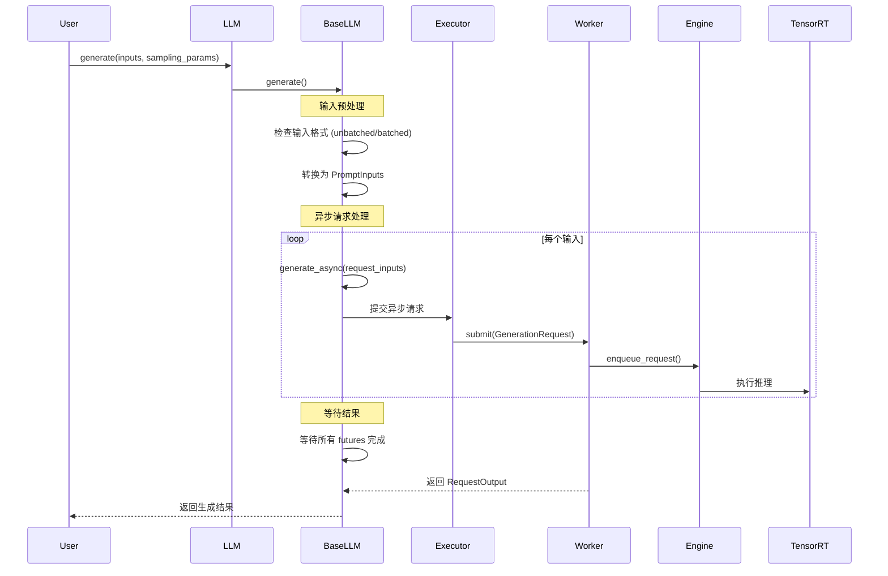
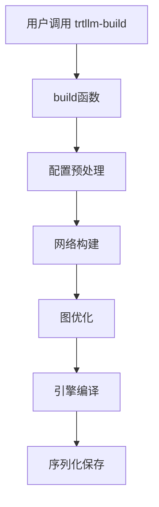
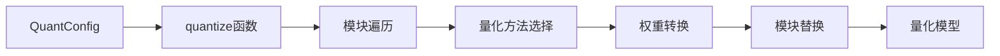

# TensorRT-LLM API 深度分析

## 核心 API 概览

TensorRT-LLM 提供了分层的 API 架构，从高级的 LLM API 到底层的 Runtime API，满足不同层次的使用需求。

## 1. 高级 LLM API

### 1.1 LLM 类 - 主要入口点

**位置**: `tensorrt_llm/llmapi/llm.py`

```python
class LLM(_TorchLLM):
    """TensorRT-LLM 的主要入口类，提供简化的 generate() API"""

    def __init__(self,
                 model: Union[str, Path],
                 tokenizer: Optional[Union[str, Path, TokenizerBase, PreTrainedTokenizerBase]] = None,
                 tokenizer_mode: Literal['auto', 'slow'] = 'auto',
                 skip_tokenizer_init: bool = False,
                 trust_remote_code: bool = False,
                 tensor_parallel_size: int = 1,
                 dtype: str = "auto",
                 revision: Optional[str] = None,
                 tokenizer_revision: Optional[str] = None,
                 **kwargs: Any) -> None:
        """
        初始化 LLM 实例

        Args:
            model: 模型路径或 HuggingFace 模型名称
            tokenizer: 分词器路径或实例
            tensor_parallel_size: 张量并行大小
            dtype: 数据类型 ("auto", "float16", "bfloat16", "float32")
            **kwargs: 其他配置参数
        """
```

**核心方法分析**:

#### generate() 方法

```python
def generate(
    self,
    inputs: Union[PromptInputs, Sequence[PromptInputs]],
    sampling_params: Optional[Union[SamplingParams, List[SamplingParams]]] = None,
    use_tqdm: bool = True,
    lora_request: Optional[Union[LoRARequest, Sequence[LoRARequest]]] = None,
    prompt_adapter_request: Optional[Union[PromptAdapterRequest, Sequence[PromptAdapterRequest]]] = None,
    kv_cache_retention_config: Optional[Union[KvCacheRetentionConfig, Sequence[KvCacheRetentionConfig]]] = None,
    disaggregated_params: Optional[Union[DisaggregatedParams, Sequence[DisaggregatedParams]]] = None,
    scheduling_params: Optional[Union[SchedulingParams, List[SchedulingParams]]] = None,
) -> Union[RequestOutput, List[RequestOutput]]:
    """
    同步生成文本的核心方法

    功能说明:

    1. 输入预处理和验证
    2. 创建生成请求
    3. 提交到执行器
    4. 等待并收集结果
    5. 后处理和返回

    调用链路:
    generate() -> _generate_non_streaming() -> _submit_requests() -> executor.submit()
    """

```

**实现细节**:

```python
# 位置: tensorrt_llm/llmapi/llm.py:280-350
def _generate_non_streaming(self, requests: List[GenerationRequest]) -> List[RequestOutput]:
    """非流式生成的内部实现"""

    # 1. 提交所有请求到执行器
    futures = []
    for request in requests:
        future = self._executor.submit(request)
        futures.append(future)

    # 2. 等待所有结果
    results = []
    for future in tqdm(futures, desc="Generating", disable=not use_tqdm):
        result = future.result()  # 阻塞等待结果
        results.append(result)

    # 3. 转换为 RequestOutput 格式
    outputs = []
    for result in results:
        output = RequestOutput(
            request_id=result.request_id,
            prompt=result.prompt,
            outputs=result.outputs,
            finished=result.finished
        )
        outputs.append(output)

    return outputs
```

### 1.2 BaseLLM 基类架构

**位置**: `tensorrt_llm/llmapi/llm.py:108-766`

```python
class BaseLLM:
    """所有 LLM 类的基类，定义核心接口和通用功能"""

    def __init__(self, **kwargs):
        # 核心组件初始化
        self._executor_cls = kwargs.pop("executor_cls", GenerationExecutor)
        self._llm_id = None
        self._tokenizer = None
        self._executor = None
        self.mpi_session = None

        # 参数解析和验证
        self.args = self._parse_args(**kwargs)

        # 初始化执行器
        self._init_executor()

    def _init_executor(self):
        """初始化执行器的核心逻辑"""
        # 1. 创建 MPI 会话（多 GPU 场景）
        if self.args.tensor_parallel_size > 1:
            self.mpi_session = MpiCommSession(
                n_workers=self.args.tensor_parallel_size
            )

        # 2. 创建执行器
        self._executor = GenerationExecutor.create(
            engine=self.args.model,
            executor_config=self._create_executor_config(),
            model_world_size=self.args.tensor_parallel_size,
            mpi_session=self.mpi_session
        )
```

**关键功能分析**:

#### 分词器管理

```python
@property
def tokenizer(self) -> Optional[TokenizerBase]:
    """分词器属性访问器"""
    if hasattr(self, 'input_processor') and self.input_processor:
        return self.input_processor.tokenizer
    return self._tokenizer

def _load_tokenizer(self):
    """分词器加载逻辑"""
    if self.args.skip_tokenizer_init:
        return None

    # 1. 从模型路径推导分词器路径
    tokenizer_path = self.args.tokenizer or self.args.model

    # 2. 创建分词器实例
    from .tokenizer import TokenizerBase
    tokenizer = TokenizerBase.from_pretrained(
        tokenizer_path,
        trust_remote_code=self.args.trust_remote_code
    )

    return tokenizer
```

## 2. 执行器 API (Executor)

### 2.1 GenerationExecutor 抽象基类

**位置**: `tensorrt_llm/executor/executor.py:78-407`

```python
class GenerationExecutor(ABC):
    """生成执行器的抽象基类，定义核心接口"""

    def __init__(self,
                 num_postprocess_workers: int = 0,
                 postprocess_tokenizer_dir: Optional[str] = None,
                 is_llm_executor: Optional[bool] = None):
        # 后处理配置
        self.postproc_config = PostprocWorkerConfig(
            num_postprocess_workers=num_postprocess_workers,
            postprocess_tokenizer_dir=postprocess_tokenizer_dir
        )

        # 结果队列
        self.kv_events_queues = IterationResultQueue()
        self.stats_queues = IterationResultQueue()

        # 错误处理
        self._error_queue = Queue()
        self.doing_shutdown = False

        # 客户端 ID 管理
        self._last_client_id: int = 1

    @abstractmethod
    def submit(self, request: GenerationRequest) -> GenerationResult:
        """提交生成请求的抽象方法"""
        pass

    @abstractmethod
    def abort_request(self, request_id: int) -> None:
        """中止请求的抽象方法"""
        pass
```

**核心方法实现**:

#### generate_async() 方法

```python
def generate_async(
    self,
    prompt_token_ids: List[int],
    sampling_params: SamplingParams,
    query_token_ids: Optional[Union[torch.Tensor, np.ndarray, list]] = None,
    lora_request: Optional[LoRARequest] = None,
    prompt_adapter_request: Optional[PromptAdapterRequest] = None,
    streaming: bool = False,
    kv_cache_retention_config: Optional[KvCacheRetentionConfig] = None,
    disaggregated_params: Optional[DisaggregatedParams] = None,
    postproc_params: Optional[PostprocParams] = None,
    multimodal_params: Optional[MultimodalParams] = None,
    scheduling_params: Optional[SchedulingParams] = None,
    cache_salt_id: Optional[int] = None,
    arrival_time: Optional[float] = None,
) -> GenerationResult:
    """
    异步生成方法的核心实现

    功能流程:

    1. 创建生成请求对象
    2. 分配客户端 ID
    3. 提交请求到执行器
    4. 返回 Future 对象
    """

    # 1. 创建请求对象
    request = GenerationRequest(
        client_id=self._get_next_client_id(),
        prompt_token_ids=prompt_token_ids,
        sampling_params=sampling_params,
        lora_request=lora_request,
        streaming=streaming,
        arrival_time=arrival_time or time.time()
    )

    # 2. 提交请求
    result = self.submit(request)

    return result

```

### 2.2 GenerationExecutorWorker 实现类

**位置**: `tensorrt_llm/executor/worker.py:41-91`

```python
class GenerationExecutorWorker(BaseWorker):
    """执行器工作进程实现，负责实际的模型推理"""

    def __init__(self, **kwargs):
        super().__init__(**kwargs)

        # 设置推理引擎
        self.setup_engine()

        # 启动后台线程
        self.await_response_thread = ManagedThread(
            self.await_response_task,
            error_queue=self._error_queue,
            name="await_response_thread"
        )

        self.dispatch_stats_thread = ManagedThread(
            self.dispatch_stats_task,
            error_queue=self._error_queue,
            name="dispatch_stats_thread"
        )
```

**核心功能实现**:

#### submit() 方法

```python
def submit(self, request: GenerationRequest) -> GenerationResult:
    """提交请求到底层推理引擎"""

    # 1. 验证请求参数
    self._validate_request(request)

    # 2. 创建结果对象
    result = GenerationResult(
        request_id=request.client_id,
        prompt=request.prompt_token_ids
    )

    # 3. 注册结果对象
    self._results[request.client_id] = result

    # 4. 提交到底层引擎
    backend_request_id = self.engine.enqueue_request(
        prompt_token_ids=request.prompt_token_ids,
        sampling_config=request.sampling_params.to_backend_config(),
        lora_config=request.lora_request.to_backend_config() if request.lora_request else None
    )

    # 5. 建立映射关系
    self._client_id_to_request_id[request.client_id] = backend_request_id

    return result
```

#### await_response_task() 后台任务

```python
def await_response_task(self):
    """等待推理结果的后台任务"""
    while not self.doing_shutdown:
        try:
            # 1. 从引擎获取响应
            responses = self.engine.await_responses(timeout=0.1)

            # 2. 处理每个响应
            for response in responses:
                self._handle_response(response)

        except Exception as e:
            logger.error(f"Error in await_response_task: {e}")
            self._error_queue.put(e)
            break

def _handle_response(self, response):
    """处理单个推理响应"""
    # 1. 查找对应的结果对象
    backend_request_id = response.request_id
    client_id = self._find_client_id(backend_request_id)

    if client_id not in self._results:
        return

    result = self._results[client_id]

    # 2. 更新结果
    if response.has_error():
        result.set_exception(RequestError(response.error_msg))
    else:
        # 添加新的输出 token
        result.add_output_tokens(response.output_token_ids)

        # 检查是否完成
        if response.is_final:
            result.set_finished()
            # 清理资源
            del self._results[client_id]
            del self._client_id_to_request_id[client_id]
```

## 3. 构建器 API (Builder)

### 3.1 Builder 类

**位置**: `tensorrt_llm/builder.py:108-478`

```python
class Builder:
    """TensorRT 引擎构建器"""

    _ALLOWED_PRECISIONS = [
        'float32', 'float16', 'bfloat16', 'int8', 'fp8'
    ]

    def __init__(self):
        self._trt_builder = trt.Builder(logger.trt_logger)
        self._timing_cache = None

    def build_engine(self,
                     network: Network,
                     builder_config: BuilderConfig,
                     managed_weights: dict = None) -> trt.IHostMemory:
        """
        构建 TensorRT 引擎的核心方法

        Args:
            network: TensorRT-LLM 网络对象
            builder_config: 构建配置
            managed_weights: 托管权重字典

        Returns:
            序列化的 TensorRT 引擎
        """

        # 1. 设置插件配置
        builder_config.plugin_config = network.plugin_config
        builder_config.auto_parallel_config = network.auto_parallel_config

        # 2. 添加优化配置文件
        if builder_config.trt_builder_config.num_optimization_profiles == 0:
            self._add_optimization_profile(network, builder_config)

        # 3. 重命名权重（如果需要）
        if network.named_parameters is not None:
            self._rename_weights(network, managed_weights)

        # 4. 构建引擎
        tik = time.time()
        engine = self._trt_builder.build_serialized_network(
            network.trt_network,
            builder_config.trt_builder_config
        )

        tok = time.time()
        logger.info(f'Build TensorRT engine Took: {tok - tik:.2f} s')

        return engine
```

**关键方法分析**:

#### _add_optimization_profile() 方法

```python
def _add_optimization_profile(self, network: Network, builder_config: BuilderConfig):
    """添加优化配置文件"""

    # 1. 创建优化配置文件
    profile = self._trt_builder.create_optimization_profile()

    # 2. 为每个输入张量设置形状范围
    for input_name in network.get_input_names():
        input_shape = network.get_input_shape(input_name)

        # 最小形状
        min_shape = self._get_min_shape(input_name, input_shape, builder_config)
        # 最优形状
        opt_shape = self._get_opt_shape(input_name, input_shape, builder_config)
        # 最大形状
        max_shape = self._get_max_shape(input_name, input_shape, builder_config)

        profile.set_shape(input_name, min_shape, opt_shape, max_shape)

    # 3. 添加到构建配置
    builder_config.trt_builder_config.add_optimization_profile(profile)
```

### 3.2 BuildConfig 配置类

**位置**: `tensorrt_llm/builder.py:481-570`

```python
@dataclass
class BuildConfig:
    """TensorRT-LLM 引擎构建配置"""

    # 序列长度配置
    max_input_len: int = 1024
    max_seq_len: int = None

    # 批次配置
    opt_batch_size: int = 8
    max_batch_size: int = 2048
    max_beam_width: int = 1
    max_num_tokens: int = 8192
    opt_num_tokens: int = None

    # KV 缓存配置
    kv_cache_type: KVCacheType = None

    # 优化配置
    strongly_typed: bool = True
    profiling_verbosity: str = 'layer_names_only'
    enable_debug_output: bool = False

    # 投机解码配置
    max_draft_len: int = 0
    speculative_decoding_mode: SpeculativeDecodingMode = SpeculativeDecodingMode.NONE

    # 高级配置
    use_refit: bool = False
    weight_sparsity: bool = False
    weight_streaming: bool = False

    def update_kv_cache_type(self, architecture: str):
        """根据模型架构更新 KV 缓存类型"""
        if self.kv_cache_type is None:
            # 默认使用分页 KV 缓存
            self.kv_cache_type = KVCacheType.PAGED
```

### 3.3 build() 函数

**位置**: `tensorrt_llm/builder.py:1106-1402`

```python
def build(model: PretrainedModel, build_config: BuildConfig) -> Engine:
    """
    从给定模型和构建配置构建引擎

    Args:
        model: 预训练模型对象
        build_config: 构建配置

    Returns:
        构建好的引擎对象
    """

    tic = time.time()

    # 1. 深拷贝配置避免修改输入
    build_config = copy.deepcopy(build_config)
    build_config.plugin_config.dtype = model.config.dtype
    build_config.update_kv_cache_type(model.config.architecture)

    # 2. 初始化最大序列长度
    _init_max_seq_len(model.config, build_config)

    # 3. 验证和调整配置
    _validate_build_config(model.config, build_config)

    # 4. 创建网络
    network = Network()
    network.plugin_config = build_config.plugin_config

    # 5. 构建模型网络
    with net_guard(network):
        # 准备输入参数
        prepare_input_args = {
            'max_batch_size': build_config.max_batch_size,
            'max_input_len': build_config.max_input_len,
            'max_seq_len': build_config.max_seq_len,
            'max_beam_width': build_config.max_beam_width,
            'max_num_tokens': build_config.max_num_tokens,
        }

        # 准备模型输入
        inputs = model.prepare_inputs(**prepare_input_args)

        # 前向传播构建网络
        model(**inputs)

    # 6. 网络优化
    if model.config.architecture != "DecoderModel":
        optimize(network)

    # 7. 自动并行处理（如果启用）
    if build_config.auto_parallel_config.enabled:
        sharded_networks = auto_parallel(network, build_config.auto_parallel_config)
        network = sharded_networks[model.config.mapping.rank]

    # 8. 创建构建器配置
    builder_config = BuilderConfig.from_build_config(build_config)

    # 9. 构建引擎
    builder = Builder()
    engine_buffer = builder.build_engine(network, builder_config)

    # 10. 创建引擎对象
    engine = Engine(
        config=model.config,
        engine_buffer=engine_buffer
    )

    toc = time.time()
    logger.info(f'Total time of building {model.config.architecture}: {toc - tic:.2f} s')

    return engine
```

## 4. 运行时 API (Runtime)

### 4.1 Session 类

**位置**: `tensorrt_llm/runtime/session.py:83-303`

```python
class Session:
    """TensorRT 运行时会话管理器"""

    def __init__(self, **kwargs):
        # 使用 Session.from_serialized_engine 创建会话
        pass

    def _init(self, engine_buffer=None):
        """初始化 TensorRT 引擎和上下文"""

        # 1. 创建 TensorRT 运行时
        self._runtime = trt.Runtime(logger.trt_logger)

        # 2. 反序列化引擎
        if engine_buffer is not None:
            self._engine = self.runtime.deserialize_cuda_engine(engine_buffer)

        # 3. 创建执行上下文
        self._context = None
        if not self.engine.streamable_weights_size:
            self.__prepare_execution_contexts()

        return self

    def __prepare_execution_contexts(self):
        """准备执行上下文"""
        self._context = self.engine.create_execution_context()
        assert self._context is not None, "Failed to create an execution context!"

        # 设置优化配置文件
        with _scoped_stream() as stream:
            self._context.set_optimization_profile_async(0, stream)

    @staticmethod
    def from_serialized_engine(engine) -> 'Session':
        """从序列化引擎创建会话"""
        session = Session()
        return session._init(engine)

    def run(self,
            inputs: Dict[str, Any],
            outputs: Dict[str, Any],
            stream,
            context=None) -> bool:
        """
        运行 TensorRT 引擎

        Args:
            inputs: 输入张量字典
            outputs: 输出张量字典
            stream: CUDA 流
            context: 执行上下文

        Returns:
            是否成功入队
        """

        # 使用默认上下文（如果未指定）
        if context is None:
            context = self.context

        # 设置输入张量地址
        for tensor_name in inputs:
            tensor = inputs[tensor_name]
            ptr = tensor.data_ptr() if isinstance(tensor, torch.Tensor) else tensor
            context.set_tensor_address(tensor_name, ptr)

        # 设置输出张量地址
        for tensor_name in outputs:
            tensor = outputs[tensor_name]
            ptr = tensor.data_ptr() if isinstance(tensor, torch.Tensor) else tensor
            context.set_tensor_address(tensor_name, ptr)

        # 异步执行
        ok = context.execute_async_v3(stream)
        return ok
```

### 4.2 ModelRunner 类

**位置**: `tensorrt_llm/runtime/model_runner.py:515+`

```python
class ModelRunner(ModelRunnerMixin):
    """模型运行器，封装推理执行逻辑"""

    def __init__(self,
                 session: Session,
                 max_batch_size: int,
                 max_input_len: int,
                 max_seq_len: int,
                 **kwargs):

        self.session = session
        self.max_batch_size = max_batch_size
        self.max_input_len = max_input_len
        self.max_seq_len = max_seq_len

        # 初始化缓冲区
        self._init_buffers()

        # 初始化 KV 缓存
        self._init_kv_cache()

    def generate(self,
                 batch_input_ids: torch.Tensor,
                 sampling_config: SamplingConfig,
                 **kwargs) -> Dict[str, torch.Tensor]:
        """
        生成文本的核心方法

        Args:
            batch_input_ids: 批次输入 token IDs
            sampling_config: 采样配置

        Returns:
            生成结果字典
        """

        # 1. 输入预处理
        batch_size = batch_input_ids.shape[0]
        input_lengths = self._get_input_lengths(batch_input_ids)

        # 2. 准备输入张量
        inputs = self._prepare_inputs(
            batch_input_ids=batch_input_ids,
            input_lengths=input_lengths,
            sampling_config=sampling_config
        )

        # 3. 执行推理
        outputs = self._run_inference(inputs)

        # 4. 后处理
        results = self._postprocess_outputs(outputs, batch_size)

        return results

    def _run_inference(self, inputs: Dict[str, torch.Tensor]) -> Dict[str, torch.Tensor]:
        """执行推理的内部方法"""

        # 1. 分配输出缓冲区
        outputs = self._allocate_output_buffers(inputs)

        # 2. 运行会话
        with torch.cuda.stream(self.stream):
            ok = self.session.run(inputs, outputs, self.stream.cuda_stream)
            if not ok:
                raise RuntimeError("TensorRT execution failed")

        # 3. 同步等待完成
        self.stream.synchronize()

        return outputs
```

## 5. 量化 API

### 5.1 QuantConfig 配置类

**位置**: `tensorrt_llm/quantization/quantize.py`

```python
@dataclass
class QuantConfig:
    """量化配置类"""

    quant_algo: QuantAlgo = QuantAlgo.NO_QUANT
    kv_cache_quant_algo: QuantAlgo = QuantAlgo.NO_QUANT

    # 权重量化参数
    group_size: int = 128
    has_zero_point: bool = True
    pre_quant_scale: bool = False

    # 激活量化参数
    activation_scaling_factor: float = 1.0
    weight_scaling_factor: float = 1.0

    def to_dict(self) -> Dict[str, Any]:
        """转换为字典格式"""
        return {
            'quant_algo': self.quant_algo.value,
            'kv_cache_quant_algo': self.kv_cache_quant_algo.value,
            'group_size': self.group_size,
            'has_zero_point': self.has_zero_point
        }
```

### 5.2 quantize() 函数

**位置**: `tensorrt_llm/quantization/quantize.py:561-603`

```python
def quantize(model, quant_config: Union[QuantConfig, LayerQuantConfig]):
    """
    模型量化的核心函数

    Args:
        model: 要量化的模型
        quant_config: 量化配置

    Returns:
        量化后的模型
    """

    # 遍历模型的所有模块
    for name, module, parent in model.named_modules_with_parent():

        # 1. 确定层级量化模式
        if quant_config.quant_algo == QuantAlgo.MIXED_PRECISION:
            layer_quant_mode = quant_config.layer_quant_mode(name)
        else:
            layer_quant_mode = quant_config.layer_quant_mode

        if layer_quant_mode == QuantMode(0):
            continue

        # 2. 获取层级量化配置
        layer_quant_cfg = quant_config._get_quant_cfg(name)

        # 3. 根据量化模式选择量化方法
        if layer_quant_mode.has_fp8_qdq():
            module = fp8_quantize(module, layer_quant_cfg)
        elif layer_quant_mode.has_fp8_rowwise():
            module = fp8_rowwise_quantize(module, layer_quant_cfg)
        elif layer_quant_mode.is_qserve_w4a8():
            module = qserve_quantize(module, quant_config)
        elif layer_quant_mode.has_nvfp4():
            module = fp4_quantize(module, layer_quant_cfg)
        elif layer_quant_mode.has_act_and_weight_quant():
            module = smooth_quantize(module, layer_quant_cfg)
        elif layer_quant_mode.is_weight_only():
            if layer_quant_mode.has_per_group_scaling():
                module = weight_only_groupwise_quantize(module, layer_quant_cfg, model.config)
            else:
                module = weight_only_quantize(module, layer_quant_cfg, model.config)

        # 4. 替换模块
        if parent is not None:
            module_name = name.rsplit('.', 1)[-1]
            setattr(parent, module_name, module)
        else:
            model = module
            break

    # 5. KV 缓存量化
    if quant_config.quant_mode.has_kv_cache_quant():
        model = kv_cache_quantize(model)

    # 6. 设置量化模式
    setattr(model, 'quant_mode', quant_config.quant_mode)

    return model
```

## 6. API 调用链路分析

### 6.1 完整推理调用链



### 6.2 详细调用链路代码分析

#### 6.2.1 LLM.generate() 入口方法

**位置**: `tensorrt_llm/llmapi/llm.py:241-319`

```python
def generate(
    self,
    inputs: Union[PromptInputs, Sequence[PromptInputs]],
    sampling_params: Optional[Union[SamplingParams, List[SamplingParams]]] = None,
    use_tqdm: bool = True,
    lora_request: Optional[Union[LoRARequest, Sequence[LoRARequest]]] = None,
    # ... 其他参数
) -> Union[RequestOutput, List[RequestOutput]]:
    """
    同步生成文本的主入口方法

    功能说明:

    1. 输入格式检查和标准化
    2. 批量请求处理
    3. 异步请求提交
    4. 结果收集和返回
    """

    # 1. 输入格式检查和标准化
    unbatched = not isinstance(inputs, list)
    if not unbatched:
        if isinstance(inputs[0], int):
            unbatched = True  # 处理 token ids 输入

    if unbatched:
        inputs = [inputs]  # 转换为批量格式

    # 2. 转换为标准 PromptInputs 格式
    inputs = [prompt_inputs(i) for i in inputs]

    # 3. 辅助函数：从批量参数中获取单个项目
    def _item_at(maybe_batched: Union[Any, Sequence[Any]], pos: int) -> Any:
        if isinstance(maybe_batched, list):
            return maybe_batched[pos]
        else:
            return maybe_batched

    # 4. 提交异步请求
    futures = []
    for i, request_inputs in enumerate(inputs):
        future = self.generate_async(
            request_inputs,
            sampling_params=_item_at(sampling_params, i),
            lora_request=_item_at(lora_request, i),
            # ... 其他参数
            streaming=False
        )
        futures.append(future)

    # 5. 等待所有结果完成
    for future in tqdm(futures, desc="Processed requests",
                      dynamic_ncols=True, disable=not use_tqdm):
        future.result()  # 阻塞等待结果

    # 6. 返回结果
    if unbatched:
        futures = futures[0]  # 单个输入返回单个结果

    return futures

```

#### 6.2.2 generate_async() 异步处理方法

**位置**: `tensorrt_llm/llmapi/llm.py:322-354`

```python
@nvtx_range_debug("LLM.generate_async", color="green", category="LLM")
def generate_async(
    self,
    inputs: PromptInputs,
    sampling_params: Optional[SamplingParams] = None,
    # ... 其他参数
) -> RequestOutput:
    """
    异步生成方法，处理单个请求

    功能说明:

    1. 参数验证和默认值设置
    2. 输入预处理
    3. 创建生成请求
    4. 提交到执行器
    5. 返回 Future 对象
    """

    # 1. 检查是否正在关闭
    if hasattr(self, '_executor') and self._executor is None:
        raise RuntimeError("LLM is shutting down or has been shut down")

    # 2. 设置默认采样参数
    if sampling_params is None:
        sampling_params = SamplingParams()

    # 3. 输入预处理
    processed_inputs = self.input_processor.process(
        inputs,
        sampling_params=sampling_params
    )

    # 4. 提交到执行器
    result = self._executor.submit(generation_request)

    # 5. 包装为 RequestOutput
    return RequestOutput._from_generation_result(
        result,
        prompt=inputs.text if hasattr(inputs, 'text') else None,
        tokenizer=self.tokenizer
    )

```

### 6.3 执行器层调用链路

#### 6.3.1 GenerationExecutor.create() 工厂方法

**位置**: `tensorrt_llm/executor/executor.py:356-370`

```python
@staticmethod
def create(**kwargs) -> Union["GenerationExecutorProxy", "GenerationExecutorWorker"]:
    """
    工厂方法创建执行器实例

    功能说明:

    1. 根据配置选择执行器类型
    2. 支持单进程和多进程模式
    3. 自动处理 MPI 通信
    """
    from .proxy import GenerationExecutorProxy
    from .worker import GenerationExecutorWorker

    # 获取配置参数
    world_size = kwargs.get('world_size', 0)
    model_world_size = kwargs.get('model_world_size', 1)

    # 根据世界大小选择执行器类型
    if world_size > 1 and world_size >= model_world_size:
        # 多进程模式：使用代理执行器
        logger.info(f"Creating GenerationExecutorProxy with {world_size} workers")
        return GenerationExecutorProxy.create(**kwargs)
    else:
        # 单进程模式：使用工作执行器
        logger.info("Creating GenerationExecutorWorker for single process")
        return GenerationExecutorWorker(**kwargs)

```

### 6.4 模型构建调用链



### 6.5 量化处理调用链



## 7. 关键数据结构

### 7.1 GenerationRequest

```python
@dataclass
class GenerationRequest:
    """生成请求数据结构"""
    client_id: int
    prompt_token_ids: List[int]
    sampling_params: SamplingParams
    lora_request: Optional[LoRARequest] = None
    streaming: bool = False
    arrival_time: float = field(default_factory=time.time)
```

### 7.2 RequestOutput

```python
@dataclass
class RequestOutput:
    """请求输出数据结构"""
    request_id: int
    prompt: str
    outputs: List[CompletionOutput]
    finished: bool
    metrics: Optional[RequestMetrics] = None
```

### 7.3 SamplingParams

```python
@dataclass
class SamplingParams:
    """采样参数数据结构"""
    max_tokens: int = 16
    temperature: float = 1.0
    top_p: float = 1.0
    top_k: int = 0
    beam_width: int = 1
    length_penalty: float = 1.0
    repetition_penalty: float = 1.0
```

这个 API 深度分析涵盖了 TensorRT-LLM 的核心 API 层次结构、关键方法实现、调用链路和数据结构，为深入理解和使用该框架提供了详细的技术参考。
