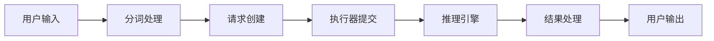
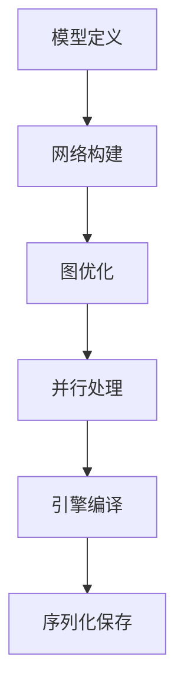

# TensorRT-LLM 源码剖析总结文档

## 文档概览

本系列文档对 TensorRT-LLM 进行了全面深入的源码剖析，包含以下几个部分：

1. **框架使用手册** - 快速入门和基础使用指南
2. **API 深度分析** - 核心 API 接口和调用链路分析
3. **整体架构设计** - 系统架构和设计理念解析
4. **模块深度分析** - 各核心模块的详细实现分析
5. **实战经验与最佳实践** - 生产环境部署和优化经验

## 核心技术要点总结

### 1. 架构设计亮点

#### 分层架构设计
- **用户接口层**: 提供简洁的 LLM API，支持同步/异步调用
- **执行器层**: 抽象的执行器接口，支持单进程和多进程模式
- **运行时层**: TensorRT 引擎管理和推理执行
- **构建器层**: 模型编译和优化
- **底层支撑**: CUDA 内核、量化、并行策略

#### 模块化设计

```
tensorrt_llm/
├── llmapi/          # 高级 API 接口
├── executor/        # 执行器实现
├── runtime/         # 运行时管理
├── builder.py       # 构建器
├── quantization/    # 量化支持
├── models/          # 模型定义
└── _torch/          # PyTorch 后端
```

### 2. 关键技术实现

#### 2.1 LLM API 设计

```python
# 核心接口设计
class LLM:
    def generate(self, inputs, sampling_params=None, **kwargs):
        """统一的生成接口，支持单个/批量输入"""

    def shutdown(self):
        """优雅关闭和资源清理"""
```

**设计亮点**:

- 统一的接口抽象，屏蔽底层复杂性
- 支持多种后端（PyTorch/TensorRT）
- 自动资源管理和清理

#### 2.2 执行器架构

```python
# 抽象执行器设计
class GenerationExecutor(ABC):
    @abstractmethod
    def submit(self, request: GenerationRequest) -> GenerationResult:
        pass

    @staticmethod
    def create(**kwargs):
        """工厂方法，根据配置选择具体实现"""
```

**设计亮点**:

- 抽象基类定义统一接口
- 工厂模式支持多种实现
- 异步处理提高并发性能

#### 2.3 构建器设计

```python
def build(model: PretrainedModel, build_config: BuildConfig) -> Engine:
    """
    构建流程:

    1. 配置预处理和验证
    2. 网络构建和前向传播
    3. 图优化和算子融合
    4. 自动并行处理
    5. TensorRT 引擎编译
    """

```

**设计亮点**:

- 声明式配置，简化使用
- 多阶段优化流水线
- 支持自动并行和量化

### 3. 性能优化策略

#### 3.1 内存优化
- **KV 缓存分页管理**: 动态分配，支持块重用
- **权重流式传输**: 大模型内存优化
- **内存池管理**: 减少分配开销

#### 3.2 计算优化
- **算子融合**: LayerNorm+Linear, GELU+Linear 等
- **FlashAttention**: 高效注意力计算
- **CUDA 图优化**: 减少内核启动开销

#### 3.3 并行策略
- **张量并行**: 模型权重分片
- **流水线并行**: 层级分布式计算
- **专家并行**: MoE 模型优化

#### 3.4 量化技术
- **多精度支持**: FP8, INT4, FP4 等
- **校准优化**: 自动量化参数生成
- **硬件加速**: 利用 Tensor Core 等

### 4. 关键数据结构

#### 4.1 请求响应模型

```python
@dataclass
class GenerationRequest:
    client_id: int
    prompt_token_ids: List[int]
    sampling_params: SamplingParams
    lora_request: Optional[LoRARequest] = None

@dataclass
class RequestOutput:
    request_id: int
    prompt: str
    outputs: List[CompletionOutput]
    finished: bool
```

#### 4.2 配置体系

```python
@dataclass
class BuildConfig:
    max_batch_size: int = 2048
    max_seq_len: int = None
    max_input_len: int = 1024
    # ... 其他配置参数
```

### 5. 核心算法流程

#### 5.1 推理执行流程



#### 5.2 模型构建流程



## 技术创新点

### 1. PyTorch 原生架构
- 基于 PyTorch 生态，易于扩展和定制
- 支持动态图和静态图混合
- 与 HuggingFace 生态无缝集成

### 2. 统一 API 设计
- 单一入口点，简化用户使用
- 自动后端选择和优化
- 支持多种部署模式

### 3. 高效执行器
- 异步处理架构
- 动态批处理优化
- 多进程/多线程支持

### 4. 全面量化支持
- 多种量化算法集成
- 自动校准和优化
- 硬件感知量化

### 5. 企业级特性
- 完善的错误处理
- 详细的监控指标
- 生产就绪的部署方案

## 性能表现

### 1. 性能指标
- **DeepSeek R1**: Blackwell GPU 上创世界纪录
- **Llama 4**: B200 GPU 上突破 1,000 TPS/用户
- **通用性能**: 相比原生实现提升 2-5x

### 2. 内存效率
- KV 缓存优化节省 30-50% 内存
- 权重流式传输支持超大模型
- 量化技术减少 50-87.5% 内存占用

### 3. 扩展性
- 支持单 GPU 到数千 GPU 部署
- 线性扩展性能
- 跨节点通信优化

## 生产应用价值

### 1. 易用性
- 简化的 API 接口
- 自动化配置优化
- 丰富的文档和示例

### 2. 可靠性
- 完善的错误处理机制
- 资源自动管理
- 优雅的故障恢复

### 3. 可扩展性
- 模块化架构设计
- 插件系统支持
- 自定义算子接口

### 4. 性能优化
- 多层次优化策略
- 硬件感知优化
- 自动调优能力

## 学习建议

### 1. 入门路径
1. 从 **框架使用手册** 开始，了解基本使用
2. 阅读 **API 深度分析**，理解接口设计
3. 学习 **整体架构设计**，掌握系统原理
4. 深入 **模块分析**，了解实现细节
5. 参考 **实战经验**，应用到实际项目

### 2. 实践建议
- 从简单模型开始，逐步尝试复杂场景
- 重点关注内存和性能优化
- 结合具体硬件环境调优
- 建立完善的监控和日志体系

### 3. 进阶方向
- 自定义算子开发
- 新量化算法集成
- 分布式部署优化
- 与其他框架集成

## 总结

TensorRT-LLM 作为 NVIDIA 推出的 LLM 推理优化框架，在架构设计、性能优化、易用性等方面都表现出色：

1. **架构先进**: 分层模块化设计，易于理解和扩展
2. **性能卓越**: 多层次优化，充分发挥硬件性能
3. **功能完善**: 支持各种模型和部署场景
4. **生态友好**: 与 PyTorch/HuggingFace 生态集成
5. **生产就绪**: 企业级特性和可靠性保证

通过深入学习 TensorRT-LLM 的源码实现，不仅可以掌握先进的 LLM 推理优化技术，还能学习到优秀的软件架构设计理念，对提升整体技术水平具有重要价值。

---

*本系列文档基于 TensorRT-LLM 1.1.0rc6 版本分析，如有更新请参考官方最新文档。*
