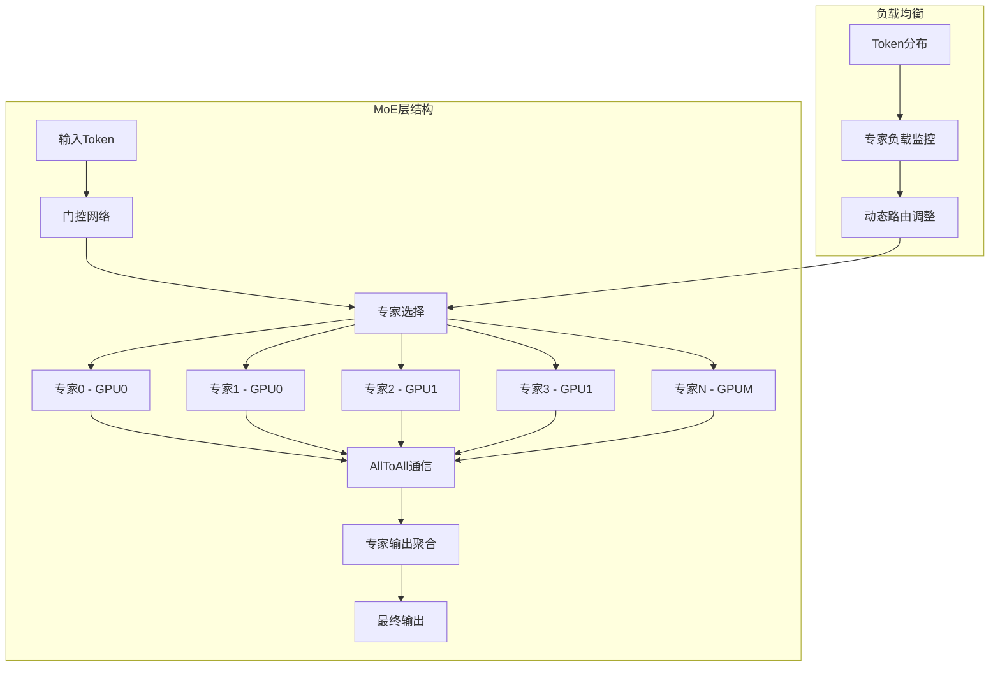

# TensorRT-LLM 整体架构设计

## 1. 系统架构概览

TensorRT-LLM 采用分层架构设计，从上到下分为以下几个层次：


### 1.1 层次职责说明

#### 用户接口层 (User Interface Layer)
- **LLM API**: 提供统一的高级接口，支持同步/异步生成
- **命令行工具**: 提供构建、服务、测试等命令行功能
- **Python SDK**: 完整的 Python 开发工具包
- **多模态API**: 支持图像、音频等多模态输入

#### 执行器层 (Executor Layer)
- **GenerationExecutor**: 抽象执行器接口，定义统一的生成协议
- **ExecutorProxy**: 多进程代理，管理分布式推理
- **ExecutorWorker**: 工作进程，执行具体的推理任务
- **IPC通信**: 进程间通信机制，支持高效的数据传输

#### 运行时层 (Runtime Layer)
- **ModelRunner**: 模型运行器，封装推理执行逻辑
- **Session管理**: TensorRT 会话和上下文管理
- **KV缓存管理**: 键值缓存的分页和重用机制
- **内存管理**: GPU 内存池和动态分配

#### 构建器层 (Builder Layer)
- **Builder**: TensorRT 引擎构建器
- **网络构建**: 从模型定义构建计算图
- **优化配置**: 图优化和算子融合
- **自动并行**: 自动分片和并行策略选择

#### 底层支撑 (Infrastructure Layer)
- **CUDA Kernels**: 高性能 CUDA 算子实现
- **量化支持**: 多精度量化算法和工具
- **并行策略**: 张量并行、流水线并行、专家并行

## 2. 核心组件架构

### 2.1 LLM API 层架构


### 2.2 执行器层详细架构

```mermaid
graph TB
    subgraph "执行器抽象层"
        A[GenerationExecutor] --> B[抽象接口定义]
        A --> C[公共功能实现]
        A --> D[工厂方法]
    end

    subgraph "代理执行器 (多进程)"
        E[GenerationExecutorProxy] --> F[进程管理]
        E --> G[请求分发]
        E --> H[结果收集]
        F --> I[Worker进程启动]
        F --> J[进程监控]
        F --> K[故障恢复]
        G --> L[负载均衡]
        G --> M[请求队列]
        H --> N[结果聚合]
        H --> O[异常处理]
    end

    subgraph "工作执行器 (单进程)"
        P[GenerationExecutorWorker] --> Q[引擎管理]
        P --> R[请求处理]
        P --> S[后台任务]
        Q --> T[Engine初始化]
        Q --> U[Session管理]
        R --> V[请求验证]
        R --> W[结果映射]
        S --> X[响应监听]
        S --> Y[统计收集]
    end

    subgraph "基础工作器"
        Z[BaseWorker] --> AA[引擎设置]
        Z --> BB[后处理管理]
        Z --> CC[错误处理]
        AA --> DD[模型加载]
        AA --> EE[配置验证]
        BB --> FF[PostprocWorker]
        BB --> GG[分词器管理]
    end

    subgraph "支撑组件"
        HH[IPC队列] --> II[进程间消息传递]
        HH --> JJ[异步通信]
        KK[ManagedThread] --> LL[后台任务管理]
        KK --> MM[线程监控]
        NN[IterationResultQueue] --> OO[结果队列管理]
        NN --> PP[事件分发]
    end

    A <|-- E
    A <|-- P
    P --|> Z
    E --> HH
    P --> KK
    P --> NN
```

### 2.3 执行器层时序图


### 2.4 构建器层架构


### 2.5 构建器时序图


## 3. 数据流架构

### 3.1 推理数据流


### 3.2 内存管理架构


## 4. 并行策略架构

### 4.1 张量并行（Tensor Parallelism）


### 4.2 流水线并行（Pipeline Parallelism）


### 4.3 专家并行（Expert Parallelism）



## 5. 量化架构

### 5.1 量化策略层次


### 5.2 量化执行流程


## 6. 优化策略架构

### 6.1 计算优化


### 6.2 通信优化


## 7. 系统时序架构

### 7.1 初始化时序


### 7.2 推理时序


## 8. 错误处理架构

### 8.1 异常处理层次


### 8.2 容错机制


## 9. 性能监控架构

### 9.1 指标收集体系


这个整体架构设计文档详细描述了 TensorRT-LLM 的系统架构、核心组件、数据流、并行策略、量化机制、优化策略、时序设计、错误处理和性能监控等方面，为深入理解该框架的设计理念和实现原理提供了全面的技术视角。
